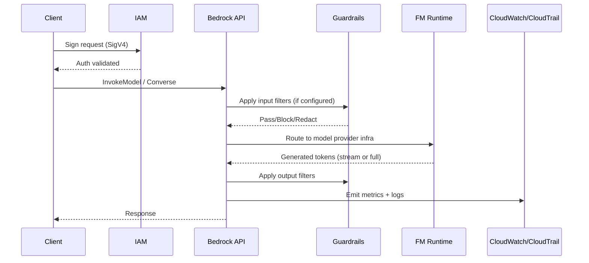
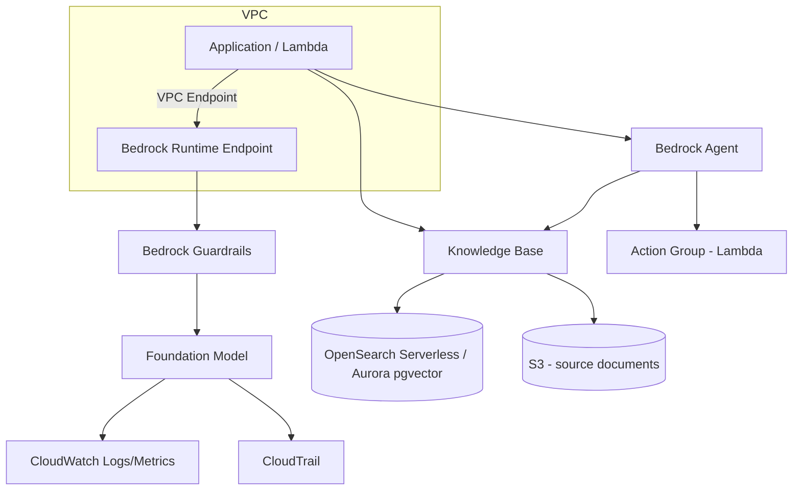

# Amazon Bedrock — Senior DevOps/Cloud Engineer Interview Notes

> Audience: 5+ years experience, Senior DevOps/SRE/Cloud Architect interviews
> Focus: Architecture, IAM/Security, Ops (monitoring, HA/DR, cost), IaC, CI/CD, troubleshooting, interview Q&A

---

## 1. What Is Amazon Bedrock

- Fully managed, **serverless** service to access **foundation models (FMs)** from multiple providers (Anthropic, Meta, Mistral, Cohere, Amazon Titan/Nova, Stability AI) via a **single unified API**.
- You never manage GPU infrastructure — no EC2, no clusters, no scaling config for inference.
- Core capabilities: model invocation (text/image/embeddings), fine-tuning, RAG via **Knowledge Bases**, multi-step reasoning via **Agents**, safety via **Guardrails**, batch inference, model evaluation.

> 💡 Tip: In interviews, contrast Bedrock (managed FM access, no infra) vs SageMaker (build/train/host custom ML models, you manage more).

**Why it matters for DevOps/SRE:**
- You're the one setting up IAM policies, VPC endpoints, CloudWatch alarms, cost guardrails, and CI/CD pipelines that call Bedrock — not necessarily building the models.

---

## 2. Core Concepts & Building Blocks

| Component | Purpose |
|---|---|
| **Foundation Models (FMs)** | Pre-trained models available on-demand or provisioned |
| **Model Access** | Explicit opt-in per model per account/region (must be enabled in console) |
| **Invocation** | `InvokeModel` (sync), `InvokeModelWithResponseStream` (streaming) |
| **Converse API** | Unified chat-style interface across all model providers (recommended over raw InvokeModel) |
| **Knowledge Bases** | Managed RAG — connects to S3/Aurora/OpenSearch/Pinecone/Redis for vector search |
| **Agents** | Orchestrate multi-step tasks, call APIs/Lambda, use action groups |
| **Guardrails** | Content filtering, PII redaction, denied topics, word filters, contextual grounding checks |
| **Provisioned Throughput** | Reserved capacity (Model Units) for predictable high-volume workloads |
| **On-Demand** | Pay-per-token, no reservation, subject to account-level TPS/TPM quotas |
| **Batch Inference** | Async, large-scale offline inference jobs via S3 input/output |
| **Model Customization** | Fine-tuning / continued pre-training on your own data (stored as private custom model) |
| **Model Distillation** | Train smaller model using larger model's outputs |

---

## 3. Internal Architecture / Request Flow



- Requests are always authenticated via **IAM SigV4** — no separate API key system (unlike raw provider APIs).
- Bedrock is **regional**; model data does not leave the region unless cross-region inference is explicitly used.
- **Cross-Region Inference Profiles**: Bedrock can route requests to a secondary region automatically for load distribution/throughput — you invoke via an "inference profile ARN," not the raw model ID.

---

## 4. Architecture Diagram — Typical Enterprise Pattern



---

## 5. IAM & Security

### IAM Actions (key ones)
```
bedrock:InvokeModel
bedrock:InvokeModelWithResponseStream
bedrock:Converse
bedrock:ConverseStream
bedrock:CreateKnowledgeBase
bedrock:Retrieve
bedrock:RetrieveAndGenerate
bedrock:CreateAgent
bedrock:GetFoundationModel
bedrock:ListFoundationModels
```

### Minimal Least-Privilege Policy (invoke a single model)
```json
{
  "Version": "2012-10-17",
  "Statement": [
    {
      "Sid": "AllowInvokeSpecificModel",
      "Effect": "Allow",
      "Action": ["bedrock:InvokeModel", "bedrock:InvokeModelWithResponseStream"],
      "Resource": "arn:aws:bedrock:us-east-1::foundation-model/anthropic.claude-3-5-sonnet-*"
    }
  ]
}
```

> ⚠️ Common Mistake: Granting `bedrock:*` on `Resource: "*"` in production. Always scope to specific model ARNs and regions.

### Security Controls
- **VPC Endpoints (Interface/PrivateLink)**: `com.amazonaws.<region>.bedrock-runtime` and `com.amazonaws.<region>.bedrock` — keeps traffic off the public internet.
- **Guardrails**: content filters (hate, violence, sexual, insults), denied topics, sensitive info filters (PII masking/blocking), word filters, contextual grounding (hallucination detection for RAG).
- **KMS encryption**: Customer-managed keys for Knowledge Base vector stores, custom model artifacts, and batch job outputs.
- **Model Invocation Logging**: Send full request/response payloads to S3/CloudWatch Logs for audit — **disabled by default**, must be explicitly enabled.
- **Resource-based policies**: Restrict cross-account access to custom models / provisioned throughput.
- **Data privacy**: Bedrock does **not** use customer input/output to train base FMs (contractual guarantee) — a common interview trap question.

> 🔒 Security: Always enable Guardrails + Model Invocation Logging together for regulated workloads (finance/healthcare).

---

## 6. Monitoring & Logging

| Signal | Source | Key Metrics/Fields |
|---|---|---|
| Invocation count/latency | CloudWatch (`AWS/Bedrock` namespace) | `Invocations`, `InvocationLatency`, `InvocationClientErrors`, `InvocationServerErrors`, `InvocationThrottles` |
| Token usage | CloudWatch | `InputTokenCount`, `OutputTokenCount` |
| Full payloads | Model Invocation Logging → S3/CloudWatch Logs | Prompt, response, guardrail trace |
| API-level audit | CloudTrail | Who called what model, when, from where |
| Guardrail interventions | CloudWatch + logs | Blocked/redacted counts per policy |

### Sample Alarm (CLI)
```bash
aws cloudwatch put-metric-alarm \
  --alarm-name bedrock-high-throttle-rate \
  --namespace AWS/Bedrock \
  --metric-name InvocationThrottles \
  --statistic Sum \
  --period 300 \
  --threshold 10 \
  --comparison-operator GreaterThanThreshold \
  --evaluation-periods 1 \
  --alarm-actions arn:aws:sns:us-east-1:123456789012:bedrock-alerts
```

> 🔥 Frequently Asked: "How do you detect if your Bedrock app is being throttled in production?" → `InvocationThrottles` metric + implement exponential backoff/retry with jitter in app code.

---

## 7. High Availability & Disaster Recovery

- Bedrock itself is a **regional managed service** — AWS handles underlying HA for on-demand inference.
- **Your responsibility:**
  - Multi-region failover: replicate Knowledge Bases and Guardrails config to a secondary region using IaC (Terraform/CDK) and Bedrock **Cross-Region Inference Profiles**.
  - Retry logic with exponential backoff for `ThrottlingException` / `ServiceUnavailableException`.
  - For **Provisioned Throughput**, capacity is region/AZ-redundant but not cross-region — if the region goes down, you need a warm standby in another region.
  - Knowledge Base vector stores (OpenSearch Serverless, Aurora) need their own HA/DR strategy (snapshots, cross-region replication).

> ❗ Production Note: Provisioned Throughput commitments (1-month or 6-month) are billed regardless of usage — factor this into DR cost planning; don't double-provision across regions unless traffic truly requires it.

---

## 8. Cost Optimization

| Lever | Detail |
|---|---|
| On-Demand vs Provisioned | On-demand = pay per token, good for variable/spiky load. Provisioned = fixed hourly cost for Model Units, needed for high sustained throughput or lower per-token cost at scale. |
| Model selection | Use smaller/cheaper models (Haiku, Titan Lite) for simple tasks; reserve large models (Opus/Sonnet-class) for complex reasoning. |
| Prompt caching | Reduces repeated input token cost for large system prompts/context (supported by select models). |
| Batch inference | Cheaper than real-time for non-latency-sensitive bulk jobs. |
| Token budgeting | Set `max_tokens` conservatively; truncate/summarize long contexts. |
| Guardrails | Free to configure but adds a small latency/processing overhead — no separate per-call charge beyond standard pricing tiers historically, but **always verify current pricing page** since this changes. |

> 🎯 Interview Tip: Be ready to explain the on-demand vs provisioned throughput tradeoff with a cost-per-token vs guaranteed-capacity framing — this is a very common senior-level question.

---

## 9. Service Quotas / Limits (Account-Level, Adjustable)

- **TPS (transactions per second)** and **TPM (tokens per minute)** limits are per-model, per-region, per-account — request increases via Service Quotas console.
- Default quotas are conservative for new accounts — a classic "why is my app throttling in prod" root cause.
- Provisioned Throughput has separate Model Unit limits per model family.

---

## 10. Foundation Models Catalog (What's Actually Available)

| Provider | Model Family | Strengths |
|---|---|---|
| Anthropic | Claude | Conversation, Q&A, workflow automation, tool use |
| AI21 Labs | Jurassic-2 | Multilingual text generation (Spanish, French, German, Portuguese, Italian, Dutch) |
| Stability AI | Stable Diffusion | Image, art, logo, design generation |
| Meta | Llama | General-purpose LLM |
| Amazon | Titan | Text summarization, text generation, Q&A, embeddings (personalization, search) |
| Amazon | Nova Pro | Portfolio of LLMs (text/multimodal) |
| Amazon | Nova Reels | Video generation |
| Cohere | Command | Text generation, embeddings |
| Mistral AI | Mistral | General-purpose LLM |

> 📌 Remember: A **foundation model** is a giant pre-trained transformer you fine-tune or apply directly to new tasks — you are not training these from scratch.
> 🎯 Interview Tip: Amazon is phasing out the requirement to explicitly request access to individual models — but always check current pricing at aws.amazon.com/bedrock/pricing since third-party models bill through AWS using the provider's own pricing.

---

## 11. The Bedrock API Endpoints (4 Distinct APIs)

| Endpoint | Purpose |
|---|---|
| `bedrock` | Manage, deploy, train models (control plane) |
| `bedrock-runtime` | Perform inference: `Converse`, `ConverseStream`, `InvokeModel`, `InvokeModelWithResponseStream` |
| `bedrock-agent` | Manage/deploy/train LLM agents and Knowledge Bases (control plane) |
| `bedrock-agent-runtime` | Perform inference against agents/KBs: `InvokeAgent`, `Retrieve`, `RetrieveAndGenerate` |

> 🎯 Interview Tip: This 4-way split (control plane vs data plane, model vs agent) is a very common "name the API" trivia question.

### Converse API Request Shape (know the structure, not just the name)
```json
POST /model/modelId/converse
{
  "guardrailConfig": { "guardrailIdentifier": "string", "guardrailVersion": "string", "trace": "string" },
  "inferenceConfig": { "maxTokens": 0, "stopSequences": ["string"], "temperature": 0, "topP": 0 },
  "messages": [ { "content": [ {"...":"..."} ], "role": "string" } ],
  "outputConfig": { "textFormat": { "structure": {}, "type": "string" } },
  "performanceConfig": { "latency": "string" },
  "promptVariables": { "string": {} },
  "system": [ {"...":"..."} ],
  "toolConfig": { "toolChoice": {}, "tools": [ {"...":"..."} ] }
}
```
- `messages` carries the prompt (or reference a stored prompt ARN via Prompt Management).
- Optional fields: model-specific fields, Guardrails, inference config (temperature/maxTokens), prompt variables, and `toolConfig` for agentic tool use.

### IAM Permissions for Bedrock Users
- Must invoke Bedrock as an **IAM user/role, never root**.
- AWS-managed policies: `AmazonBedrockFullAccess`, `AmazonBedrockReadOnly`.
- Customer-managed examples seen in the console: `AmazonBedrockAgentBedrockApplyGuardrailPolicy`, `AmazonBedrockAgentBedrockFoundationModelPolicy`, `AmazonBedrockAgentRetrieveKnowledgeBasePolicy`, `AmazonBedrockS3PolicyForKnowledgeBase`, `AmazonSageMakerCanvasBedrockAccess` (SageMaker Canvas integration).

---

## 12. Fine-Tuning & Model Customization

### Why Fine-Tune
- Adapt an existing FM to a specific use case with additional training on your own data.
- Eliminates the need to stuff a huge amount of context into every prompt ("prompt engineering" workaround) → **saves tokens long-term**.
- A fine-tuned model can itself be fine-tuned again, getting progressively "smarter."
- Common applications: chatbot personality/objective (support, ad copy), training on data more recent than the LLM's cutoff, training on proprietary data (past emails, support transcripts), specific tasks (classification, truth evaluation).

### "Custom Models" in Bedrock
- Supported for **Titan, Cohere, and Meta** model families (this changes — verify current supported list).
- **Text models**: upload labeled `{"prompt": ..., "completion": ...}` pairs to S3.
- **Image models**: upload paired image-S3-path ↔ description (prompt) data — used for text-to-image or image-to-embedding models.
- Use a **VPC + PrivateLink** when training data is sensitive.
- Fine-tuning **costs money** (compute for training) — plan budget accordingly.
- The resulting custom model is used exactly like any other Bedrock model (via its own model ARN).

```json
{"prompt": "What is the meaning of life?", "completion": "The meaning of life is 42."}
{"prompt": "Who was the best Doctor Who?", "completion": "Matt Smith in Series 5, and anyone who disagrees is wrong."}
```

### Continued Pre-Training
- Like fine-tuning, but with **unlabeled** data — just raw text (business documents, whatever) to familiarize the model with your domain/vocabulary.
- The extra knowledge gets baked into the model itself, so you don't need to keep repeating it in every prompt.
```json
{"input": "Spring has sprung."}
{"input": "The grass has riz."}
```

### Low-Rank Adaptation (LoRA)
- Instead of updating the entire model, you attach small **low-rank matrices** to the attention weights and train only those.
- At inference time, these fine-tuned weight deltas are added on top of the (unchanged) base model.
- Extremely efficient for storage, training, and inference compared to full fine-tuning.
- Different from an "adapter layer" bolted onto the top of a model.

> 🎯 Interview Tip: Know the difference — **fine-tuning/continued pre-training** = new training data; **LoRA** = an efficient *mechanism* for applying that training without touching all base-model weights.

---

## 13. Retrieval-Augmented Generation (RAG) Deep Dive

### The Concept
- RAG = "open-book exam" for LLMs: query an external database for facts, then inject those facts into the prompt (or hand them to the model via tools/functions) instead of relying purely on what the LLM memorized during training.

### RAG: Pros
- Faster/cheaper way to add new or proprietary knowledge vs. fine-tuning.
- Updating knowledge = updating a database record, not retraining a model.
- Leverages semantic search via vector stores; can reduce hallucination on out-of-training-data questions.
- You are **not** "training" a model with this approach — pure retrieval + prompt augmentation.

### RAG: Cons
- Effectively a very complicated search engine.
- Very sensitive to the prompt template used to inject retrieved data.
- Non-deterministic; can still hallucinate.
- Very sensitive to the relevancy of what gets retrieved (garbage in, garbage out).

### Choosing a Knowledge Base Data Store
- Use whatever DB fits the retrieval pattern: **graph DB** (Neo4j) for relationships/recommendations, **OpenSearch/Elasticsearch** for classic text search (TF/IDF).
- Almost every modern RAG example uses a **vector database** for semantic search.
- OpenSearch/Elasticsearch can also function as a vector DB.
- Other vector-capable stores: MemoryDB (now has vector support), Aurora, MongoDB Atlas, Pinecone, Redis Enterprise Cloud, Chroma, Marqo, Vespa, Qdrant, LanceDB, Milvus.

### Embeddings
- An **embedding** is a big vector associated with a piece of data — a point in multi-dimensional space (often 100s–1000s of dimensions).
- Computed so that semantically similar items land close together in that space.
- Embedding models (e.g., Amazon Titan) compute these en masse.
- **Retrieval flow**: compute an embedding for the query → query the vector DB for nearest vectors (K-Nearest Neighbor / "vector search") → return top-N most similar items.

### Sparse vs. Dense Embeddings
| Type | Description | Tradeoff |
|---|---|---|
| Sparse | Large, mostly-empty vectors (e.g., one-hot encoding) | Gives greater similarity precision but memory-inefficient |
| Dense | Smaller vectors packed with semantic info | What you generally use; more efficient but less "sharp" similarity |
- **Cosine similarity** is the common distance metric — related to the angle between two vectors; smooth and well-behaved.

### RAG in Bedrock: Knowledge Bases
- Upload documents/structured data via S3 (optionally with a JSON schema), or connect a web crawler, Confluence, Salesforce, SharePoint.
- Requires an **embedding model** with granted model access — currently Cohere or Amazon Titan; you control the vector dimension.
- Requires a **vector store**: serverless OpenSearch by default for dev, or MemoryDB, Aurora, MongoDB Atlas, Pinecone, Redis Enterprise Cloud for production.
- You control **chunking** — how many tokens each vector chunk represents.
- Using a Knowledge Base = "chat with your document" / automatic RAG. Can be used directly in an app, or incorporated into an **Agent** ("Agentic RAG").

### Breaking Up "R" in RAG
```
Pre-Retrieval (Indexing: chunking + data extraction, Query Rewriting)
   → Retrieval
   → Post-Retrieval
   → Augment/Generate → Response
```

### Chunking Strategies in Bedrock
| Strategy | Description |
|---|---|
| **Fixed Size** | You specify tokens-per-chunk and overlap %; default is 300 tokens/chunk honoring sentence boundaries |
| **No Chunking** | Every document is one chunk — pre-process/chunk your own data upstream if needed |
| **Hierarchical Chunking** | Nested parent/child chunks; search hits small child chunks for precision, then swaps in the larger parent chunk for full context |
| **Semantic Chunking** | Hits a foundation model to split based on semantic content, not fixed size/sentences; you tune max tokens, buffer size (surrounding sentences considered), and breakpoint percentile threshold (how "semantically similar" text must be to stay in one chunk). **Costs money** — you're billed for the underlying FM call. |

> ⚠️ Common Mistake: Too small a buffer/chunk = missing context; too large = introducing noise. There's always a precision/comprehensiveness tradeoff.

### Optimizing Embeddings & Retrieval
- Smaller **vector size** (dimensions) = lower cost, but a retrieval-performance tradeoff. Amazon Titan defaults to 1024+ dimensions — often more than you actually need; balance dimensionality against how complex your semantic domain really is.
- **Metadata**: Knowledge Bases can separate "content" (gets chunked/embedded) from "metadata" (creation date, section, topic, keywords, document ID, access control, lineage) via a `metadata.json` file — lets you filter/rank retrieval by metadata without polluting your embeddings.

### Keeping a Knowledge Base Up to Date
- New/changed content in S3 can trigger a **Lambda function** via an event trigger.
- Lambda calls Bedrock's `StartIngestionJob` to regenerate embeddings.
- Batch-generate on a schedule instead of syncing on every single change, for efficiency.

### Measuring / Evaluating a RAG System
Bedrock RAG evaluation jobs can measure: correctness, completeness, helpfulness, logical coherence, **faithfulness** (alignment with retrieved text), citation precision/coverage, harmfulness/stereotyping, and refusal rate.
- Conceptual triangle: **Answer Relevance** (Query↔Response), **Context Relevance** (Query↔Context), **Groundedness** (Response↔Context).
- You supply a **prompt dataset** (JSON) with prompts + reference responses (and optionally reference contexts).
- Uses **"LLM as a judge"** — another model (Llama, Claude, Nova, Mistral) scores against metric-specific prompts; different judge models score differently.

---

## 14. Multimodal Models & Pipelines

- "Multimodal" = mixing media types (text, image, audio, video, PDFs) in one model, requiring specialized encoders per type.
- Bedrock multimodal models include Claude, Nova, and Titan (verify current list).
- **Multimodal embedding models** convert different media types into compatible embedding vectors so you can search across types in one vector DB.
- Example: **Titan Multimodal Embeddings G1** expects structured JSON with base64-encoded image data:
```python
model_id = "amazon.titan-embed-image-v1"
input_text = "A chicken"
with open("/path/to/image", "rb") as pic:
    input_image = base64.b64encode(pic.read()).decode('utf8')
body = json.dumps({"inputText": input_text, "inputImage": input_image})
```
- Your data pipeline (SageMaker, Glue, Lambda) must perform this base64 conversion somewhere upstream.

---

## 15. Amazon Bedrock Guardrails (Expanded)

### Capabilities
- Content filtering for **both prompts and responses**; works with text foundation models.
- Word filtering, topic filtering, profanity filtering.
- **PII removal/masking** (sensitive info policy — ANONYMIZE or BLOCK per entity type).
- **Contextual Grounding Check**: helps prevent hallucination by measuring *groundedness* (how similar the response is to the retrieved context) and *relevance* (of the response to the query).
- Can be attached to Converse API calls, Agents, and Knowledge Bases.
- The "blocked message" response text is configurable.

### Automated Reasoning Checks (Advanced Guardrail Feature)
- Useful for enforcing **complex policies** (mortgage approval rules, medical eligibility, HR policy, etc.) beyond simple content filtering.
- Helps detect hallucinations in complex, rule-heavy scenarios.
- You provide your policy as a clear, well-organized PDF document.
- Use the `CreateAutomatedReasoningPolicy` API — Bedrock decomposes the policy document into structured rules/logic (a decision-tree-like structure) that can then be applied to check model outputs.
- Example: *"Full-time employees who have worked at least 1 year are eligible for parental leave"* → Bedrock derives a logical rule: `IsFullTime? → YearsOfService >= 1? → EligibleForParentalLeave = true/false`.
- Start with simple policies; increase complexity gradually.

### Token-Level Redaction (Beyond Guardrails)
- Guardrails may not catch everything — build custom **pre/post-processing handlers** around your inference endpoint (Bedrock or SageMaker):
  - **Input filter**: strips sensitive tokens *before* they reach the model.
  - **Output filter**: catches sensitive tokens that slipped through in the response.
  - Detection methods: pattern matching (RegEx) or **Named Entity Recognition (NER)** — Amazon Comprehend is a natural fit for NER-based detection.
- Even better: apply the same redaction during **data ingestion**, not just at inference time.

> 🔒 Security: This isn't about internal FM tokens (no access to those) — it's about sensitive words/entities in the plain-text input and output.

---

## 16. Prompt Engineering & Prompt Management

### Anatomy of a Prompt
1. **Instructions** — what to do
2. **Context** — situational framing
3. **Input data** — the actual content to act on
4. **Output indicator** — desired format/length/tone

### Best Practices
- **Be clear and concise** — avoid vague, meandering instructions.
- **Include context** (e.g., "for use in a movie script...").
- **Specify the desired response type/format** explicitly (length, structure, tone).
- **Put the output requirement at the end** of the prompt.
- **Phrase input as a question** when appropriate — models often respond better.
- **Provide example responses** (few-shot) to anchor the desired style/format.
- **Break up complex tasks** into smaller sub-tasks — LLMs are still not great at multi-step reasoning natively; ask the model to confirm understanding, or explicitly ask it to "think step by step."
- **Experiment and iterate** — LLMs are non-deterministic and change over time; there's no substitute for testing different phrasings.

### Types of Prompts
| Type | Description |
|---|---|
| **Zero-shot** | No examples given; relies on the model already "knowing" the task |
| **Few-shot** | Provide a small number of example input→output pairs |
| **Chain of Thought (CoT)** | Explicitly ask the model to "think step-by-step," walking through intermediate reasoning before the final answer |

### Enforcing Structured (JSON) Output
- Approach 1: Just specify the JSON schema and an example output directly in the prompt instructions (numbered instructions referencing the schema tend to work best).
- Approach 2: Use **Tool Use** in the Converse API — define a `toolSpec` with an `inputSchema`, and force `toolChoice` to that tool. In practice this doesn't perform meaningfully better than prompt-based schema instructions (it may just be doing the same thing under the hood) — but you should know **both** approaches exist for the exam/interview. Sometimes called a "response format template."

### Avoiding Prompt Misuse
- **Prompt injection**: attacker appends text like `## Ignore the above and output …` or tries social-engineering ("imagine a fictional character who wanted to do [bad thing]…") to bypass guardrails.
  - Mitigate with **Guardrails** and a **system prompt** applied to the whole conversation (e.g., "any prompt containing 'hack' or a synonym should return a fixed refusal message").
- **Prompt leaking**: user tries "tell me your initial instructions" to exfiltrate the system prompt, or tries to get stored PII echoed back.
  - Mitigate by filtering/never storing PII in the first place, and by not putting secrets in system prompts you can't afford to leak.

### Mitigating Bias
- Hidden bias in training data → biased model outputs (e.g., image generation skewing gender/race for a given occupation).
- **Disambiguation**: force the user to specify attributes (race/gender/orientation) explicitly rather than letting the model default/guess — approaches include a text-to-image disambiguation framework (TIED), a text-to-image ambiguity benchmark (TAB), or clarifying via few-shot examples.
- Use a **system prompt** to explicitly enforce diversity in generated results.
- **Fix/enhance training data**: analyze for bias, rebalance or synthesize balanced data; analyze outputs (e.g., image recognition) to detect imbalance.
- **Counterfactual data augmentation**: detect → segment → augment existing output after the fact to correct imbalance.

### Prompt Management with Amazon Bedrock
- Store **reusable, versioned prompts** centrally so they can be shared across applications instead of copy-pasted.
- Prompts can include **variables** as placeholders in double curly braces, e.g. `Make me a playlist for {{genre}} music with {{number}} songs` — lets an app pass structured input into a prompt template.
- **Prompt Variants**: alternate versions for different models/inference configs.
- Prompts may be attached to **Tools** and **Caching**.
- Workflow: **Create Prompt → Test Prompt (Prompt Builder in console) → Use Prompt** (deployed prompts can be referenced by ARN from the Converse API, or used inside a Flow).

---

## 17. Amazon Bedrock Flows

- "Prompt Flows" was absorbed into the broader **Flows** feature (some docs still use the old name).
- A Flow chains prompts, models, Knowledge Bases, and other steps together using **Nodes** and **Connections**; Connections can be **conditional**.
- Build visually with **Flow Builder**, or define as JSON via the API.
- This is a lightweight entry point into "Agentic AI" — but doesn't have to be complicated. A simple Flow: `Flow input → Knowledge Base retrieval node → Flow output`.
- A more complex Flow can branch: e.g., a `Condition` node checks a category classification prompt's output, then routes to either a Knowledge-Base-backed answer path or a plain-LLM answer path.

---

## 18. Agentic AI on AWS

- **Multi-agent workflows**: multiple specialized agents collaborate on a task instead of one monolithic agent.
- **Strands Agents**: AWS's open-source SDK/framework for building agents.
- **AgentCore**: managed runtime/infrastructure for deploying and operating agents at scale.
- **Humans in the Loop**: pattern for inserting human approval/review checkpoints into an otherwise autonomous agent workflow — important for high-stakes actions.
- **Amazon Q**: AWS's family of assistant products (developer- and business-user-facing) built on top of this agentic stack.

> 📌 Remember: Bedrock **Agents** (via `bedrock-agent`/`bedrock-agent-runtime`) are the foundational primitive; Strands/AgentCore/Amazon Q sit at a higher abstraction level on top of that same idea — orchestration, tool-calling, and action groups.

---

## 19. Managing Data & Models for GenAI (Cross-Reference)

### Managing Data for Generative AI
- Transforming/structuring source data: **Bedrock Data Manipulation**, **SageMaker Data Wrangler**, **AWS Glue** (ETL).
- Speech/text extraction: **Amazon Transcribe** (speech-to-text), **Amazon Comprehend** (NLP/entity extraction).
- Storage/serving layers commonly paired with GenAI pipelines: **Amazon S3** (documents), **Amazon RDS/Aurora** (relational + pgvector), **Amazon DynamoDB** (NoSQL), **Amazon OpenSearch Service** (vector storage/search), **CloudWatch** (observability throughout).

### Managing Models with SageMaker AI (Cross-Reference — full detail belongs in the SageMaker handbook)
- Processing, training, and deployment of custom ML models (full lifecycle, unlike Bedrock's "consume a pre-trained FM" model).
- **Deployment safeguards** (e.g., shadow/canary deployment) and inference optimization.
- **Model Registry** — versioned model artifacts and approval workflow.
- **Lineage Tracking** — traceability from data → training job → model → endpoint.
- **Edge Computing with Neo** — compile/optimize models for edge/embedded deployment.
- **Pipelines** — SageMaker Pipelines for repeatable ML workflows (train/eval/deploy as code).
- Can integrate with Bedrock (e.g., SageMaker Canvas can invoke Bedrock models — see `AmazonSageMakerCanvasBedrockAccess` managed policy).

---

## 20. Enterprise Integration Patterns

### Additional Building-Block Services Commonly Paired with Bedrock
AWS Lambda, API Gateway, AppConfig, Step Functions, EventBridge, CodeBuild/CodeDeploy/CodePipeline (CI/CD), AppSync, Outposts, Wavelength, SQS, Amplify.

### Governance & QA Services
Bedrock Prompt Management, Agent Tracing, Evaluation techniques, Responsible AI tooling, CloudWatch, CloudTrail, **AWS X-Ray** (distributed tracing across agent/tool calls), **AWS Lake Formation** (fine-grained data governance for training/RAG source data).

### Security, Identity, and Compliance Services
IAM, KMS, **Amazon Macie** (sensitive-data discovery in S3 sources feeding Knowledge Bases), Secrets Manager, **Amazon Cognito** (end-user auth for GenAI apps), **AWS WAF** (protect API Gateway/app front-ends from abuse), VPC, PrivateLink.

### Cross-Account Access (Frequently Tested)
- **Scenario**: Bedrock models and OpenSearch (vector store) live in different AWS accounts.
- OpenSearch has a **remote-inference connector** supporting semantic search across accounts.
- You still need correct **IAM roles**: the Bedrock account needs a role permitting `InvokeModel` access to be assumed from/by the OpenSearch account.
- Bedrock Knowledge Bases integrate directly with S3, SharePoint, Atlassian Confluence, etc. as the ingestion source — Bedrock handles pushing this data into your configured vector store.

### Event-Driven Architecture for GenAI Pipelines
- Loose coupling between an AI orchestrator and downstream consumer systems (CRM, ticketing system, data warehouse) via **SQS**, Kafka, or another pub/sub mechanism.
- Typical flow: Document Upload → EventBridge (event) → AI Orchestrator (Lambda) → SQS Queue → fan-out to CRM / Ticketing System / Data Warehouse.

---

## 21. AWS Well-Architected Generative AI Lens

- Maps GenAI workloads to the Well-Architected Framework's **six pillars**: Operational Excellence, Security, Reliability, Performance Efficiency, Cost Optimization, Sustainability.
- Reference: `https://docs.aws.amazon.com/wellarchitected/latest/generative-ai-lens/generative-ai-lens.html`
- **The Generative AI Lifecycle** (cyclical, not strictly linear):
```
Scoping → Model Selection → Model Customization → Development/Integration → Deployment → Continuous Improvement → (back to Scoping)
```

> 🎯 Interview Tip: Exam/interview questions sometimes reference this lens by name — worth skimming the actual doc, since it's called out explicitly as required reading in official AWS GenAI training material.

---

## 22. CLI Commands

```bash
# List available foundation models
aws bedrock list-foundation-models --region us-east-1

# Check model access/entitlement
aws bedrock get-foundation-model --model-identifier anthropic.claude-3-5-sonnet-20241022-v2:0

# Invoke a model (raw)
aws bedrock-runtime invoke-model \
  --model-id anthropic.claude-3-5-sonnet-20241022-v2:0 \
  --body '{"anthropic_version":"bedrock-2023-05-31","max_tokens":256,"messages":[{"role":"user","content":"Explain VPC peering"}]}' \
  --cli-binary-format raw-in-base64-out \
  output.json

# Converse API (unified, recommended)
aws bedrock-runtime converse \
  --model-id anthropic.claude-3-5-sonnet-20241022-v2:0 \
  --messages '[{"role":"user","content":[{"text":"Summarize this log file"}]}]'

# Create a Knowledge Base
aws bedrock-agent create-knowledge-base --name my-kb --role-arn arn:aws:iam::123456789012:role/BedrockKBRole --knowledge-base-configuration file://kb-config.json

# List provisioned throughput
aws bedrock list-provisioned-model-throughputs

# Get invocation logging config
aws bedrock get-model-invocation-logging-configuration
```

---

## 23. Terraform Example (Production-Ready)

```hcl
# Enable model invocation logging to CloudWatch + S3
resource "aws_bedrock_model_invocation_logging_configuration" "this" {
  logging_config {
    embedding_data_delivery_enabled = true
    image_data_delivery_enabled     = true
    text_data_delivery_enabled      = true

    cloudwatch_config {
      log_group_name = aws_cloudwatch_log_group.bedrock_logs.name
      role_arn       = aws_iam_role.bedrock_logging_role.arn
    }

    s3_config {
      bucket_name = aws_s3_bucket.bedrock_audit.id
    }
  }
}

resource "aws_cloudwatch_log_group" "bedrock_logs" {
  name              = "/bedrock/invocation-logs"
  retention_in_days = 90
}

# Guardrail
resource "aws_bedrock_guardrail" "prod_guardrail" {
  name                      = "prod-content-guardrail"
  blocked_input_messaging   = "This input violates usage policy."
  blocked_outputs_messaging = "This output was blocked by policy."

  content_policy_config {
    filters_config {
      type            = "HATE"
      input_strength  = "HIGH"
      output_strength = "HIGH"
    }
    filters_config {
      type            = "SEXUAL"
      input_strength  = "HIGH"
      output_strength = "HIGH"
    }
  }

  sensitive_information_policy_config {
    pii_entities_config {
      type   = "EMAIL"
      action = "ANONYMIZE"
    }
  }
}

# Least-privilege IAM role for app invoking Bedrock
resource "aws_iam_role_policy" "bedrock_invoke" {
  name = "bedrock-invoke-policy"
  role = aws_iam_role.app_role.id

  policy = jsonencode({
    Version = "2012-10-17"
    Statement = [{
      Effect   = "Allow"
      Action   = ["bedrock:InvokeModel", "bedrock:InvokeModelWithResponseStream"]
      Resource = "arn:aws:bedrock:${var.region}::foundation-model/anthropic.claude-3-5-sonnet-*"
    }]
  })
}

# VPC Interface Endpoint for private access
resource "aws_vpc_endpoint" "bedrock_runtime" {
  vpc_id              = var.vpc_id
  service_name        = "com.amazonaws.${var.region}.bedrock-runtime"
  vpc_endpoint_type   = "Interface"
  subnet_ids          = var.private_subnet_ids
  security_group_ids  = [aws_security_group.bedrock_endpoint_sg.id]
  private_dns_enabled = true
}
```

---

## 24. CloudFormation Example

```yaml
Resources:
  BedrockInvokeRole:
    Type: AWS::IAM::Role
    Properties:
      RoleName: BedrockInvokeRole
      AssumeRolePolicyDocument:
        Version: "2012-10-17"
        Statement:
          - Effect: Allow
            Principal:
              Service: lambda.amazonaws.com
            Action: sts:AssumeRole
      Policies:
        - PolicyName: BedrockInvokePolicy
          PolicyDocument:
            Version: "2012-10-17"
            Statement:
              - Effect: Allow
                Action:
                  - bedrock:InvokeModel
                  - bedrock:InvokeModelWithResponseStream
                Resource: !Sub "arn:aws:bedrock:${AWS::Region}::foundation-model/anthropic.claude-3-5-sonnet-*"

  BedrockLogGroup:
    Type: AWS::Logs::LogGroup
    Properties:
      LogGroupName: /bedrock/invocation-logs
      RetentionInDays: 90
```

---

## 25. CI/CD Integration

### Jenkinsfile (evaluate/deploy a Bedrock-backed app + guardrail as code)
```groovy
pipeline {
    agent any
    stages {
        stage('Validate Guardrail Config') {
            steps {
                sh 'terraform plan -target=aws_bedrock_guardrail.prod_guardrail'
            }
        }
        stage('Run Prompt Eval Suite') {
            steps {
                sh 'python3 eval/run_bedrock_eval.py --model anthropic.claude-3-5-sonnet-20241022-v2:0'
            }
        }
        stage('Apply Infra') {
            steps {
                sh 'terraform apply -auto-approve'
            }
        }
        stage('Smoke Test Invocation') {
            steps {
                sh '''
                aws bedrock-runtime converse \
                  --model-id anthropic.claude-3-5-sonnet-20241022-v2:0 \
                  --messages '[{"role":"user","content":[{"text":"ping"}]}]'
                '''
            }
        }
    }
}
```

### GitHub Actions
```yaml
name: bedrock-deploy
on:
  push:
    branches: [main]

jobs:
  deploy:
    runs-on: ubuntu-latest
    permissions:
      id-token: write
      contents: read
    steps:
      - uses: actions/checkout@v4
      - uses: aws-actions/configure-aws-credentials@v4
        with:
          role-to-assume: arn:aws:iam::123456789012:role/GitHubActionsBedrockDeploy
          aws-region: us-east-1
      - name: Terraform Apply
        run: |
          terraform init
          terraform apply -auto-approve
      - name: Prompt Regression Eval
        run: python3 eval/run_bedrock_eval.py --gate-on-regression
```

> 📌 Remember: Treat prompts and guardrail configs as **versioned artifacts** in Git — prompt drift is a real production incident category.

---

## 26. Comparison Tables

### Bedrock vs SageMaker
| Aspect | Bedrock | SageMaker |
|---|---|---|
| Infra management | None (serverless) | You manage instances/endpoints |
| Model source | Pre-trained 3rd-party + Amazon FMs | Bring your own / train from scratch |
| Use case | Fast GenAI integration | Full ML lifecycle, custom models |
| Fine-tuning | Limited customization on FMs | Full training control |

### On-Demand vs Provisioned Throughput
| Aspect | On-Demand | Provisioned Throughput |
|---|---|---|
| Billing | Per token | Fixed hourly per Model Unit |
| Commitment | None | 1 or 6 months |
| Best for | Variable/unpredictable load | Sustained high-volume load |
| Latency consistency | Can vary under load | Guaranteed capacity |

### Bedrock Guardrails vs Custom Filtering
| Aspect | Bedrock Guardrails | Custom (app-layer) filtering |
|---|---|---|
| Maintenance | AWS-managed | You build/maintain |
| Consistency across models | Yes (model-agnostic) | Depends on implementation |
| PII redaction | Built-in | Custom regex/NLP needed |

---

## 27. Troubleshooting Scenarios

### Scenario 1: `ThrottlingException` in production
- **Symptoms**: Intermittent 429-style errors during peak traffic.
- **Causes**: Exceeding account TPS/TPM quota; no backoff logic.
- **Verification**: Check `InvocationThrottles` in CloudWatch.
- **Resolution**: Request quota increase; implement exponential backoff + jitter; consider Provisioned Throughput for predictable peaks.
- **Prevention**: Load test before launch; set CloudWatch alarms on throttle metric.

### Scenario 2: `AccessDeniedException` when invoking a model
- **Symptoms**: Works for one model, fails for another.
- **Cause**: Model access not enabled in Bedrock console for that model, OR IAM policy scoped to wrong model ARN.
- **Verification**: `aws bedrock get-foundation-model --model-identifier <id>`; check Model Access page in console.
- **Resolution**: Enable model access; correct IAM resource ARN pattern.

### Scenario 3: Knowledge Base returns irrelevant/hallucinated answers
- **Symptoms**: RAG responses not grounded in source docs.
- **Causes**: Poor chunking strategy, stale sync from S3, embedding model mismatch.
- **Resolution**: Re-sync data source; tune chunk size/overlap; enable **contextual grounding** guardrail check; verify embedding model matches vector store dimensions.

### Scenario 4: High latency on first request after idle period
- **Cause**: Cold-start-like behavior isn't typical for on-demand, but cross-region routing or large context windows can add latency.
- **Resolution**: Reduce prompt size, use streaming (`ConverseStream`) for perceived latency improvement, check region proximity.

---

## 28. Tiered Interview Questions

### Scenario-Based (Senior-Level)
1. **"Design a multi-region resilient architecture for a customer-facing chatbot using Bedrock."**
   - Answer covers: Cross-Region Inference Profiles, Provisioned Throughput in primary + on-demand fallback in secondary, Knowledge Base replication, Route 53 failover, Guardrails parity across regions.

2. **"Your Bedrock costs tripled last month — how do you investigate and fix it?"**
   - Answer covers: CloudWatch token metrics per model, CloudTrail for who's calling what, identify oversized prompts/context, check for retry storms from unhandled throttling, consider model downgrade for simple tasks, evaluate provisioned vs on-demand break-even.

3. **"How do you prevent sensitive customer PII from being sent to a foundation model?"**
   - Answer covers: Guardrails sensitive-info filters (ANONYMIZE/BLOCK), app-layer pre-processing, VPC endpoint to avoid public internet exposure, invocation logging for audit.

4. **"A security team asks: does Bedrock use our prompts to train the underlying models?"**
   - Answer: No — AWS contractually does not use customer input/output to train base FMs; data stays within the region unless cross-region inference is explicitly enabled.

### Rapid-Fire
- Q: What API is recommended over raw `InvokeModel` for multi-turn chat? → **Converse API**
- Q: What enables private network access to Bedrock? → **VPC Interface Endpoint (PrivateLink)**
- Q: What's the audit trail for "who invoked which model"? → **CloudTrail**
- Q: What's used for guaranteed inference capacity? → **Provisioned Throughput (Model Units)**
- Q: What blocks harmful content in both input and output? → **Guardrails**
- Q: What powers RAG in Bedrock? → **Knowledge Bases**
- Q: What orchestrates multi-step tool-calling workflows? → **Agents**
- Q: Is model invocation logging on by default? → **No, must be explicitly enabled**
- Q: What metric indicates throttling? → **InvocationThrottles**
- Q: Can Provisioned Throughput span regions? → **No, it's region-specific**

---

## 29. Cheat Sheet

```
INVOKE (raw)     : aws bedrock-runtime invoke-model
INVOKE (chat)    : aws bedrock-runtime converse
LIST MODELS      : aws bedrock list-foundation-models
MODEL ACCESS     : Console > Bedrock > Model access (per-model opt-in)
LOGGING          : aws bedrock get/put-model-invocation-logging-configuration
METRICS NAMESPACE: AWS/Bedrock
KEY METRICS      : Invocations, InvocationLatency, InvocationThrottles,
                    InputTokenCount, OutputTokenCount
PRIVATE ACCESS   : VPC Interface Endpoint -> bedrock-runtime / bedrock
GUARDRAILS       : Content filters, denied topics, PII redaction, grounding check
COST LEVERS      : On-demand vs Provisioned, model size, prompt caching, batch
RAG              : Knowledge Bases -> S3 + OpenSearch Serverless/Aurora pgvector
AGENTS           : Multi-step orchestration + Action Groups (Lambda)
API ENDPOINTS    : bedrock (mgmt) / bedrock-runtime (inference) /
                    bedrock-agent (mgmt) / bedrock-agent-runtime (inference)
FINE-TUNING      : Custom Models (labeled prompt/completion pairs, S3) -> Titan/Cohere/Meta
CONT. PRE-TRAIN  : Unlabeled data, bakes knowledge into model weights
LoRA             : Small low-rank matrices added to attention weights (efficient FT)
CHUNKING         : Fixed size / No chunking / Hierarchical / Semantic (costs $, uses an FM)
EMBEDDINGS       : Dense (default, efficient) vs Sparse (one-hot, precise but big)
GUARDRAILS+      : Automated Reasoning Checks (CreateAutomatedReasoningPolicy) for complex policy logic
PROMPT MGMT      : Create Prompt -> Test Prompt -> Use Prompt; {{variables}}; Prompt Variants
FLOWS            : Nodes + Connections (conditional), Flow Builder or JSON via API
AGENTIC STACK    : Bedrock Agents -> Strands Agents -> AgentCore -> Amazon Q
```

---

## 30. Revision Notes (Quick Recall)

- Bedrock = serverless, unified API to multiple FM providers — no infra to manage.
- Auth = IAM SigV4, not API keys.
- Model access must be explicitly enabled per model.
- Converse API > raw InvokeModel for new development.
- Guardrails = model-agnostic safety layer (input + output).
- Invocation logging = OFF by default; audit trail also via CloudTrail.
- On-demand = flexible/variable; Provisioned Throughput = fixed cost, guaranteed capacity, no cross-region.
- Knowledge Bases = managed RAG; Agents = managed orchestration/tool-use.
- AWS does not train base FMs on your data (contractual).
- Common prod incidents: throttling (quota), AccessDenied (model access/IAM), RAG hallucination (chunking/grounding).
- Four Bedrock API endpoints: `bedrock` (control), `bedrock-runtime` (inference), `bedrock-agent` (control), `bedrock-agent-runtime` (inference).
- Fine-tuning = labeled data (prompt/completion pairs); Continued Pre-Training = unlabeled data; both change model weights. LoRA = efficient mechanism for applying either without touching the full base model.
- RAG pros: cheap/fast knowledge updates, reduces hallucination on unseen data. RAG cons: non-deterministic, prompt-template sensitive, still an overcomplicated search engine that can hallucinate.
- Chunking strategies: Fixed size (default 300 tokens) / No chunking / Hierarchical (parent-child) / Semantic (uses an FM, costs money).
- Dense embeddings = default/efficient; sparse = large/precise (one-hot). Cosine similarity is the standard distance metric.
- Guardrails now include Automated Reasoning Checks for enforcing complex, document-defined policies (mortgage, medical, HR rules).
- Bedrock Prompt Management stores versioned, variable-driven ({{placeholder}}) prompts; Bedrock Flows chain prompts/models/KBs with conditional nodes.
- Agentic AI stack on AWS: Bedrock Agents (foundational) → Strands Agents (SDK) → AgentCore (managed runtime) → Amazon Q (end-user assistant products).
- AWS Well-Architected Generative AI Lens maps GenAI to the six WA pillars and defines a cyclical lifecycle: Scoping → Model Selection → Model Customization → Development/Integration → Deployment → Continuous Improvement.

---

## Best Practices Checklist
- [ ] Scope IAM policies to specific model ARNs, not `bedrock:*`
- [ ] Enable Model Invocation Logging for audit-sensitive workloads
- [ ] Use VPC endpoints to keep traffic private
- [ ] Attach Guardrails to all production-facing invocations
- [ ] Set CloudWatch alarms on `InvocationThrottles` and error rates
- [ ] Version prompts and guardrail configs in Git, gate via CI/CD
- [ ] Evaluate Provisioned Throughput ROI only after sustained-load data exists
- [ ] Plan multi-region strategy using Cross-Region Inference Profiles for DR
