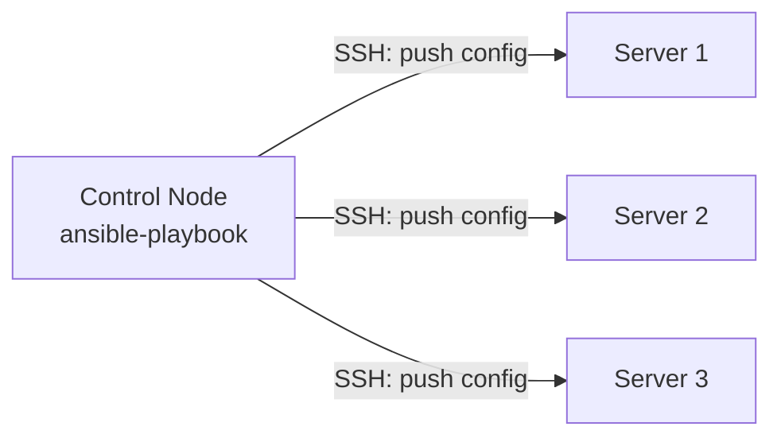
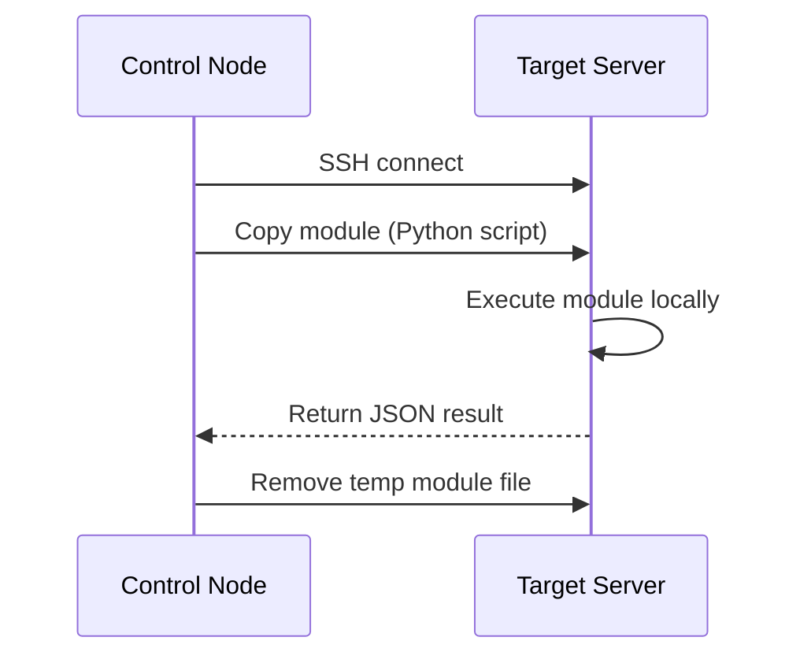
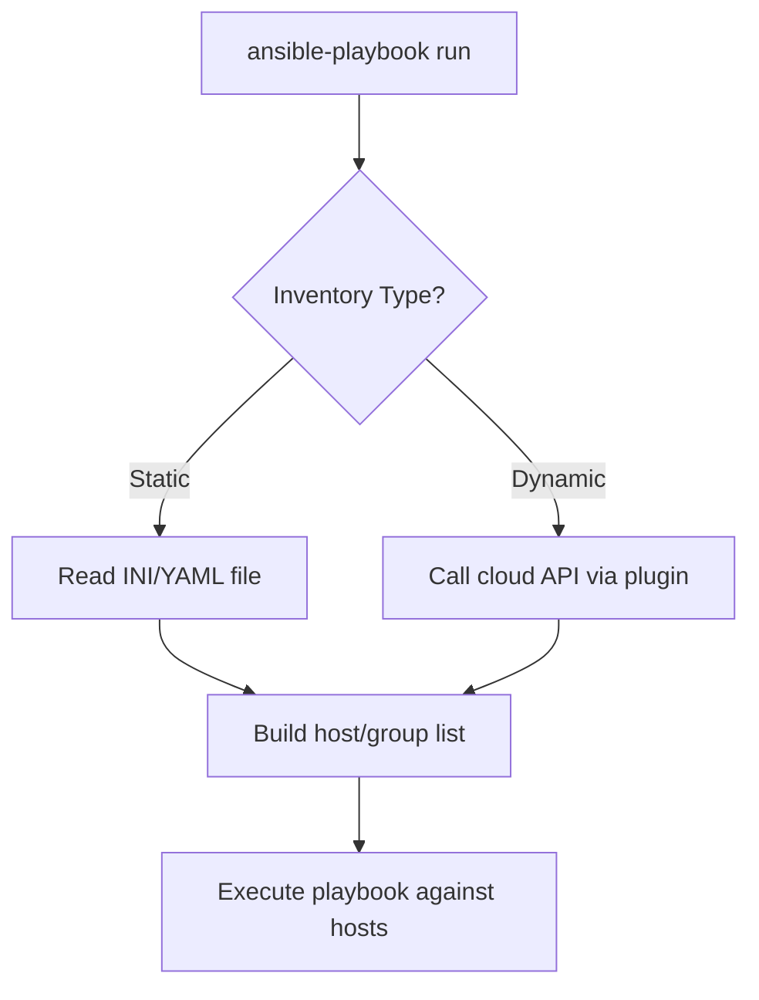
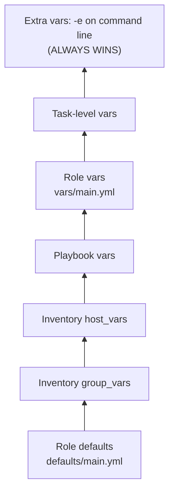
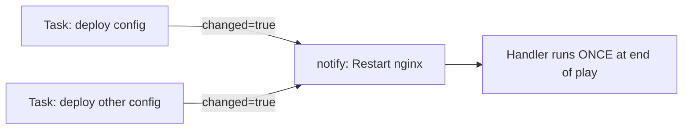
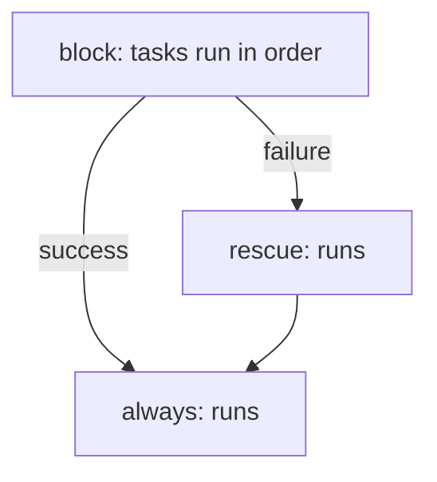
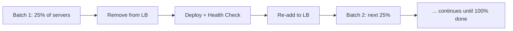
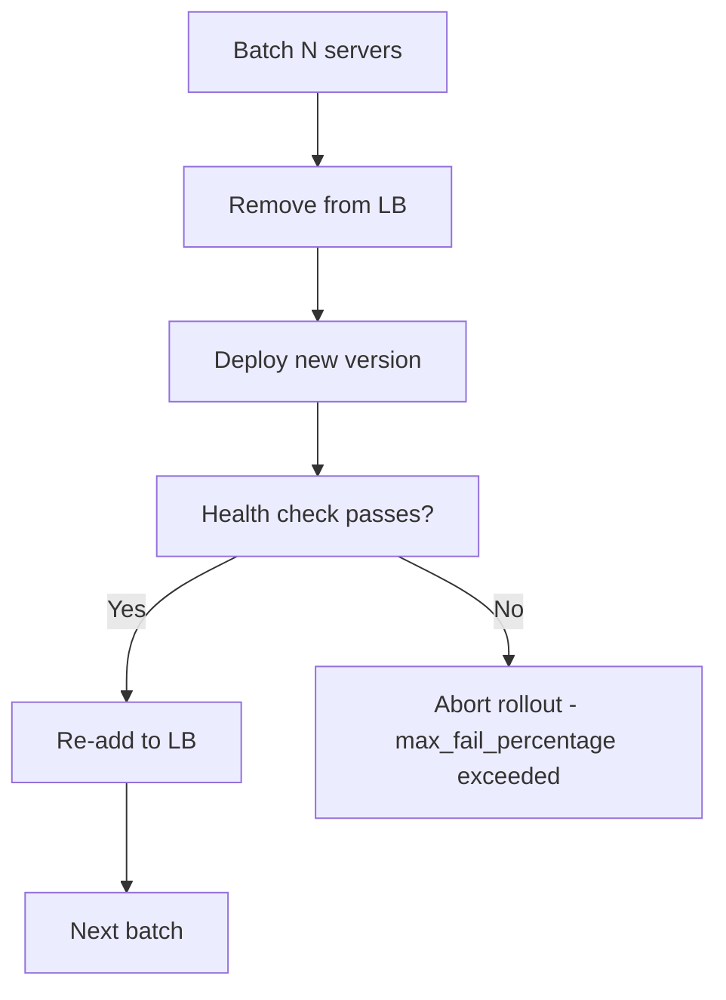

# Ansible — Complete Senior DevOps Interview Notes (5+ Years, 20+ LPA)

> Written in simple English. Every term is explained before it is used. Read top to bottom once, then use the Cheat Sheet at the end for quick revision.

---

## Table of Contents

1. [Introduction & Why Ansible](#1-introduction--why-ansible)
2. [Architecture (Agentless, Push vs Pull, SSH)](#2-architecture)
3. [Inventory](#3-inventory)
4. [Configuration (ansible.cfg)](#4-configuration)
5. [Ad-hoc Commands](#5-ad-hoc-commands)
6. [Playbooks & YAML Basics](#6-playbooks--yaml-basics)
7. [Modules, Collections, Galaxy](#7-modules-collections-galaxy)
8. [Variables](#8-variables)
9. [Facts](#9-facts)
10. [Conditionals & Loops](#10-conditionals--loops)
11. [Tags](#11-tags)
12. [Handlers](#12-handlers)
13. [Blocks & Error Handling](#13-blocks--error-handling)
14. [Includes vs Imports](#14-includes-vs-imports)
15. [Roles](#15-roles)
16. [Templates, Jinja2, Filters, Lookups](#16-templates-jinja2-filters-lookups)
17. [Vault & Secrets Management](#17-vault--secrets-management)
18. [Async Tasks & Polling](#18-async-tasks--polling)
19. [Delegation, Local Actions, Run Once](#19-delegation-local-actions-run-once)
20. [Serial, Rolling Updates, Strategies, Forks, Performance](#20-serial-rolling-updates-strategies-forks-performance)
21. [Callbacks, Plugins, Custom Modules, Python Integration](#21-callbacks-plugins-custom-modules-python-integration)
22. [System Administration Automation](#22-system-administration-automation)
23. [Cloud & Container Automation](#23-cloud--container-automation)
24. [CI/CD Integration](#24-cicd-integration)
25. [Logging, Debugging, Troubleshooting](#25-logging-debugging-troubleshooting)
26. [Best Practices, Security, Project Structure](#26-best-practices-security-project-structure)
27. [Production Deployment Strategies](#27-production-deployment-strategies)
28. [Common Errors, Mistakes, Interview Traps](#28-common-errors-mistakes-interview-traps)
29. [50 Production Scenarios](#29-50-production-scenarios)
30. [Interview Question Bank](#30-interview-question-bank)
31. [Cheat Sheet & One-Page Revision](#31-cheat-sheet--one-page-revision)

---

## 1. Introduction & Why Ansible

### What is Ansible?

Ansible is a tool that lets you control many computers from one place, using simple text files. You write down the steps you want (for example: "install nginx", "start the service"), and Ansible does those steps on every server you point it at.

**Simple analogy:** Imagine you have 500 employees and you want all of them to fill the same form the same way. Instead of visiting each person's desk, you send one instruction sheet, and each person follows it exactly. Ansible is that instruction sheet, sent automatically to 500 servers at once.

### Why Ansible Exists (The Problem Before Ansible)

- Before tools like Ansible, engineers logged into each server one by one (SSH) and ran commands manually.
- This was slow, error-prone, and impossible to repeat exactly the same way every time.
- Different engineers configured servers slightly differently — this is called **configuration drift** (servers slowly become different from each other even though they were supposed to be identical).
- Manual work does not scale. You cannot manually configure 1,000 servers during a production incident at 2 AM.

### Problems Ansible Solves

| Problem | How Ansible Solves It |
|---|---|
| Manual, repetitive server setup | Write once (a "playbook"), run on any number of servers |
| Configuration drift | Playbooks are **idempotent** (running them twice gives the same result, explained below) |
| No record of what was changed | Playbooks are code, stored in Git — a full history of every change |
| Different environments (dev/stage/prod) configured differently | Same playbook + different variables = consistent environments |
| Slow disaster recovery | Rebuild a server from scratch in minutes by re-running the playbook |

**Idempotent** means: if you run the same instruction many times, the result stays the same after the first time. Example: "make sure nginx is installed" — if nginx is already installed, Ansible does nothing the second time. It does not reinstall it or cause an error.

### Real-World Use Cases

- **Banking:** Patch 2,000 Linux servers with the same security update every month, with an audit trail of exactly what changed.
- **E-commerce:** Deploy a new version of the checkout service to 50 servers with zero downtime during a sale event.
- **Healthcare:** Enforce the same security hardening (firewall rules, disabled root login) on every server to pass HIPAA compliance audits.
- **OTT Streaming:** Bootstrap new EC2 instances at 3 AM automatically when traffic scales up, install the required packages, and register them into the load balancer.
- **SaaS:** Keep 10 different customer environments (multi-tenant infra) configured identically using the same codebase with different variable files.

### Interview Questions (Section 1)

- Q: What problem does Ansible solve that manual SSH scripting doesn't?
  A: Idempotency, consistency across large fleets, and a version-controlled record of every change — manual scripting cannot guarantee any of these reliably at scale.
- Q: What does "configuration drift" mean and how does Ansible prevent it?
  A: Drift is when servers that should be identical slowly diverge due to manual, untracked changes. Ansible prevents it by making the playbook the single source of truth, re-applied regularly.

---

## 2. Architecture

### Agentless Architecture

**What it means:** Ansible does not require you to install any special software (an "agent") on the servers you manage. It connects using SSH (for Linux) or WinRM (for Windows), which almost every server already has.

**Why this matters:**
- No agent to install, upgrade, or troubleshoot on 1,000 servers.
- No extra open port required beyond SSH (port 22), which is usually already open and firewalled correctly.
- Less attack surface (fewer things running on the target server that could be exploited).

**Compare with agent-based tools (Puppet, Chef):** These require an agent process running permanently on every managed server, which then pulls configuration from a central server on a schedule.

| Aspect | Ansible (Agentless) | Puppet/Chef (Agent-based) |
|---|---|---|
| Installation on targets | None required | Agent must be installed everywhere |
| Communication | SSH/WinRM (on-demand) | Agent polls a central server (constant) |
| Attack surface | Smaller | Larger (extra running service) |
| Setup speed for a new server | Immediate | Needs agent bootstrap first |

### Push vs Pull Model

- **Push model (Ansible's default):** The control machine (where you run `ansible-playbook`) actively connects out to every target server and pushes the configuration. You control exactly when changes happen.
- **Pull model:** Each server periodically checks in with a central server and pulls its own configuration (this is how Puppet/Chef normally work; Ansible also supports this via `ansible-pull`, but it's rarely used).

**Why Ansible chose Push by default:** Full control over timing (you decide exactly when a change rolls out — important for coordinated production deployments), and simpler mental model (you run one command, you see the result immediately).



### SSH Communication — How It Actually Works

1. You run `ansible-playbook site.yml` on your **control node** (your laptop, a Jenkins agent, a bastion host).
2. Ansible reads the **inventory** (the list of target servers).
3. For each target, Ansible opens an SSH connection using the credentials/key you configured.
4. Ansible copies small Python scripts (the **modules**) over SSH to a temporary directory on the target server.
5. The target server executes the Python script locally (this is why most target servers need Python installed).
6. The result (success/failure/changed) is sent back over the same SSH connection as JSON.
7. Ansible deletes the temporary script from the target server (unless you're debugging with `-vvv`).



**Interview trap:** People often think Ansible "runs commands remotely one by one." In reality, it **copies and executes a script**, then reads back structured JSON — this is why Ansible can report a clean "changed: true/false" rather than just raw command output.

### Interview Questions (Section 2)

- Q: Why is Ansible called agentless?
  A: Because it doesn't require any permanently-running software on the managed servers — it connects on-demand via SSH/WinRM and cleans up after itself.
- Q: What has to be installed on the target server for Ansible to work?
  A: Python (for most modules) and an SSH server — nothing Ansible-specific needs to be pre-installed.
- Q: Push vs Pull — which does Ansible use by default and why?
  A: Push, by default, via `ansible-playbook`, because it gives the operator precise control over exactly when a change is applied — important for coordinated production rollouts.

---

## 3. Inventory

### What is Inventory?

The inventory is simply the list of servers Ansible will manage, along with how to group them and any per-server settings (like which SSH user to use).

### Static Inventory

A plain text file (INI or YAML format) listing your servers by hand.

**INI format example (`inventory.ini`):**
```ini
[webservers]
web1.cmg.internal ansible_host=10.0.1.10
web2.cmg.internal ansible_host=10.0.1.11

[dbservers]
db1.cmg.internal ansible_host=10.0.2.10

[webservers:vars]
ansible_user=deploy
ansible_ssh_private_key_file=~/.ssh/cmg_deploy_key
```
- `[webservers]` and `[dbservers]` are **groups** — you can target a whole group in a playbook instead of listing servers one by one.
- `ansible_host` tells Ansible the real IP/hostname to connect to (useful when the name in the inventory differs from the actual DNS name).
- `[webservers:vars]` sets variables that apply to every host in the `webservers` group.

**YAML format example (`inventory.yml`):**
```yaml
all:
  children:
    webservers:
      hosts:
        web1.cmg.internal:
          ansible_host: 10.0.1.10
        web2.cmg.internal:
          ansible_host: 10.0.1.11
      vars:
        ansible_user: deploy
```

### Dynamic Inventory

**Problem static inventory has:** In the cloud, servers are created and destroyed constantly (auto-scaling). A hand-written list goes out of date immediately.

**Solution:** Dynamic inventory — a script or plugin that asks a live source (AWS, Azure, Kubernetes) "what servers exist right now?" and builds the inventory automatically, every time you run a playbook.

**Example: AWS EC2 dynamic inventory plugin (`aws_ec2.yml`):**
```yaml
plugin: amazon.aws.aws_ec2
regions:
  - eu-west-2
filters:
  tag:Environment: production
  instance-state-name: running
keyed_groups:
  - key: tags.Team
    prefix: team
```
- `plugin: amazon.aws.aws_ec2` tells Ansible to use the AWS EC2 dynamic inventory plugin.
- `filters` restricts results to only production, running instances — exactly like `ec2_sd_config` filters in Prometheus.
- `keyed_groups` automatically creates groups like `team_platform`, `team_billing` based on the EC2 `Team` tag.

Run it with:
```bash
ansible-inventory -i aws_ec2.yml --graph   # shows the discovered groups/hosts as a tree
```

### Inventory Plugins

Inventory plugins are the mechanism dynamic inventory uses — pluggable connectors for different sources: `amazon.aws.aws_ec2`, `azure.azcollection.azure_rm`, `kubernetes.core.k8s`, `community.vmware.vmware_vm_inventory`.

| Inventory Type | Best For | Update Frequency |
|---|---|---|
| Static (INI/YAML) | Small, stable, on-prem fleets | Manual |
| Dynamic (cloud plugin) | Auto-scaling cloud environments | Real-time, on every run |
| Dynamic (custom script) | Legacy/CMDB-driven environments | Depends on script |

### When to Use Static vs Dynamic

- **Use static** when your server list rarely changes (e.g. 5 fixed on-prem database servers).
- **Use dynamic** whenever servers are created/destroyed automatically (Auto Scaling Groups, Kubernetes nodes) — this is the standard for any modern cloud environment.

### Common Mistakes

- Hardcoding IPs in static inventory that change after an instance restart.
- Forgetting `--limit` and accidentally running a playbook against **all** production servers instead of one group.
- Not testing dynamic inventory filters — an overly broad filter can accidentally include non-production servers.



### Interview Questions (Section 3)

- Q: Why is dynamic inventory preferred in cloud environments?
  A: Because servers are created/destroyed automatically by auto-scaling, and a static list would immediately go stale — dynamic inventory always reflects what's actually running right now.
- Q: How would you target only production web servers using AWS tags?
  A: Use the `amazon.aws.aws_ec2` inventory plugin with a `filters` block matching `tag:Environment: production` and a group/role tag, then target that resulting group in the playbook.

---

## 4. Configuration

### ansible.cfg

A settings file that controls Ansible's default behavior — which inventory to use, how many parallel connections to open, timeouts, etc. Instead of typing the same flags every time on the command line, you set them once here.

**Example `ansible.cfg`:**
```ini
[defaults]
inventory = ./inventory.ini      # default inventory file location
remote_user = deploy             # default SSH user for all hosts
host_key_checking = False        # skip SSH host key prompt (use carefully — see Security section)
forks = 20                       # number of servers to configure in parallel
retry_files_enabled = False      # don't create .retry files on failure

[privilege_escalation]
become = True                    # use sudo by default
become_method = sudo
```

### Configuration Precedence (Where Ansible Looks First)

Ansible checks these locations in order, and the **first one found wins**:

1. `ANSIBLE_CONFIG` environment variable (explicit override — highest priority)
2. `ansible.cfg` in the current directory (where you run the command from)
3. `~/.ansible.cfg` (in the user's home directory)
4. `/etc/ansible/ansible.cfg` (system-wide default — lowest priority)

```mermaid
flowchart LR
    A[ANSIBLE_CONFIG env var] -->|found?| B[./ansible.cfg]
    B -->|found?| C[~/.ansible.cfg]
    C -->|found?| D[/etc/ansible/ansible.cfg]
```

**Interview trap:** Many candidates think `/etc/ansible/ansible.cfg` is always used. In reality it's the **last resort** — a project-local `ansible.cfg` almost always wins in real teams (checked into the project's Git repo, so it's version-controlled per project).

### Common Mistakes

- Setting `host_key_checking = False` globally without understanding it disables a real security check (protection against man-in-the-middle attacks on first SSH connection).
- Not committing `ansible.cfg` to Git, causing "it works on my machine" problems across the team.

### Interview Questions (Section 4)

- Q: Where does Ansible look for its config file, in what order?
  A: `ANSIBLE_CONFIG` env var, then `./ansible.cfg`, then `~/.ansible.cfg`, then `/etc/ansible/ansible.cfg` — first found wins.
- Q: What's the risk of disabling `host_key_checking`?
  A: It removes SSH's protection against connecting to an unexpected/spoofed host, which is a real security control, not just a convenience prompt.

---

## 5. Ad-hoc Commands

### What Are Ad-hoc Commands?

A one-line Ansible command for a quick, one-time task — no playbook file needed. Good for checking something quickly, not for repeatable production changes.

```bash
# Check disk space on all webservers
ansible webservers -i inventory.ini -m shell -a "df -h"

# Restart nginx on all webservers (using the 'service' module, not raw shell)
ansible webservers -i inventory.ini -m service -a "name=nginx state=restarted" --become

# Ping every host to confirm SSH connectivity works
ansible all -i inventory.ini -m ping
```
- `-m` specifies the **module** to use (`shell`, `service`, `ping`, etc.)
- `-a` provides the arguments to that module.
- `--become` tells Ansible to use `sudo` for this command.

### When to Use Ad-hoc vs Playbook

| Use Ad-hoc When | Use a Playbook When |
|---|---|
| One-time, quick check (e.g. "is this service running?") | The task needs to be repeated reliably |
| No need for a record of what was run | You need Git history of the change |
| Simple, single-module action | Multiple steps, conditionals, or ordering matter |

### Common Mistake

Using `shell`/`command` modules for things that have a proper module already (e.g. `shell: systemctl restart nginx` instead of `service: name=nginx state=restarted`). The dedicated module is idempotent and gives clean changed/unchanged reporting; raw shell always reports "changed" even if nothing actually changed.

### Interview Questions (Section 5)

- Q: When would you use an ad-hoc command instead of a playbook?
  A: For a quick, one-time check or fix that doesn't need to be repeated or tracked in version control — e.g. confirming SSH connectivity or checking disk space across a fleet.

---

## 6. Playbooks & YAML Basics

### What is a Playbook?

A YAML file describing the steps ("tasks") you want Ansible to perform, and which servers ("hosts") to perform them on. This is the main way real teams use Ansible — not ad-hoc commands.

### YAML Basics (Explained From Scratch)

YAML is a plain-text format for structured data, using **indentation** (spaces, never tabs) to show structure.

```yaml
---                          # three dashes mark the start of a YAML document
- name: Configure web servers   # a human-readable description of this "play"
  hosts: webservers              # which inventory group this play targets
  become: true                   # use sudo for all tasks in this play
  vars:
    http_port: 8080               # a variable usable anywhere in this play
  tasks:
    - name: Install nginx         # a human-readable description of this task
      apt:                        # the module being used
        name: nginx               # module argument: package name
        state: present            # module argument: ensure it's installed
    - name: Start nginx
      service:
        name: nginx
        state: started
        enabled: true             # also enable it to start on boot
```

**Key YAML rules:**
- Indentation matters — 2 spaces per level is the convention.
- Lists use `-` (a dash).
- Key-value pairs use `key: value` (note the space after the colon).
- Never use tabs — Ansible will error out.

### Anatomy of a Playbook

| Keyword | Meaning |
|---|---|
| `hosts` | Which inventory group/host this play applies to |
| `become` | Whether to escalate privileges (sudo) |
| `vars` | Variables scoped to this play |
| `tasks` | The ordered list of actions to perform |
| `handlers` | Actions triggered only when notified (see Section 12) |
| `roles` | Reusable, packaged sets of tasks (see Section 15) |

### Running a Playbook

```bash
ansible-playbook -i inventory.ini site.yml
ansible-playbook -i inventory.ini site.yml --check     # dry run — shows what WOULD change, changes nothing
ansible-playbook -i inventory.ini site.yml --limit webservers   # restrict to one group
ansible-playbook -i inventory.ini site.yml --tags "nginx"        # run only tasks tagged 'nginx'
```

### Common Mistakes

- Using tabs instead of spaces in YAML (instant parse error).
- Forgetting `become: true` and having tasks silently fail due to permission errors.
- Writing tasks that are not idempotent (e.g. `shell: echo "config" >> file.conf` — this appends every single run, growing the file forever, instead of using the `lineinfile` or `template` module).

### Interview Questions (Section 6)

- Q: What makes a playbook "idempotent" and why does it matter?
  A: Using proper modules (not raw shell appends) so re-running the playbook produces the same end state without duplicating or corrupting changes — critical because playbooks are re-run regularly, not just once.
- Q: What does `--check` do and why is it useful before a production run?
  A: It performs a dry run, showing what changes WOULD be made without actually making them — lets you review the blast radius of a change before committing to it.

---

## 7. Modules, Collections, Galaxy

### What is a Module?

A module is a small, self-contained script (usually Python) that performs one specific task — install a package, copy a file, manage a service. Modules are the actual "verbs" of Ansible; a playbook is just a list of module calls with arguments.

**Examples of common modules:**

| Module | Purpose |
|---|---|
| `apt` / `yum` / `dnf` | Install/remove packages on Debian/RedHat systems |
| `service` / `systemd` | Start, stop, enable, restart services |
| `copy` | Copy a static file to the target |
| `template` | Copy a file, replacing variables with real values (Jinja2) |
| `file` | Manage file/directory permissions, ownership, existence |
| `lineinfile` | Ensure a specific line exists (or doesn't) in a file |
| `user` / `group` | Manage OS users and groups |
| `command` / `shell` | Run raw commands (least preferred — no idempotency, use only when no dedicated module exists) |
| `ec2_instance` (AWS collection) | Create/manage EC2 instances |
| `k8s` (Kubernetes collection) | Apply Kubernetes manifests |

### Collections

A **collection** is a packaged bundle of modules, roles, and plugins, distributed together — introduced because the built-in Ansible module set became too large to ship as one thing. Modern Ansible ships a small core, and everything else (AWS, Azure, Docker, Kubernetes modules) comes from separate collections you install.

```bash
ansible-galaxy collection install amazon.aws
ansible-galaxy collection install community.docker
ansible-galaxy collection install kubernetes.core
```
Use them in a playbook with their full name:
```yaml
- name: Launch an EC2 instance
  amazon.aws.ec2_instance:
    name: cmg-app-server
    instance_type: t3.medium
    image_id: ami-0abcd1234
```

### Galaxy

**Ansible Galaxy** is the public hub (like npm for Node.js, or Docker Hub for containers) where the community publishes reusable **roles** and **collections**.

```bash
ansible-galaxy install geerlingguy.nginx          # install a community role
ansible-galaxy collection install community.general
```

### When to Write a Custom Module vs Use an Existing One

- **Use existing modules/collections** for anything standard (packages, services, cloud resources) — almost everything is already covered.
- **Write a custom module** only when you need to talk to an internal, proprietary system with no existing module (e.g. a CMG-internal legacy API with no public collection).

### Common Mistakes

- Overusing `shell`/`command` when a proper idempotent module already exists for the task.
- Not pinning collection versions, causing an unexpected breaking change when a collection is upgraded.

### Interview Questions (Section 7)

- Q: Why did Ansible split modules into collections instead of shipping everything in core?
  A: The full module set became too large and slow to release as one bundle; collections let cloud/vendor-specific modules be versioned and released independently of Ansible core itself.
- Q: When should you use `shell` instead of a dedicated module?
  A: Only when no dedicated module exists for the task — dedicated modules give proper idempotency and changed/unchanged reporting that raw shell commands don't.

---

## 8. Variables

### What Are Variables?

Named values you can reuse throughout a playbook instead of hardcoding them — e.g. a port number, a package version, an environment name.

### Variable Types

```yaml
vars:
  app_name: "cmg-portal"        # string
  http_port: 8080                 # integer
  is_production: true             # boolean
  allowed_ips:                    # list
    - 10.0.1.0/24
    - 10.0.2.0/24
  db_config:                      # dictionary
    host: db1.internal
    port: 5432
```

### Where Variables Can Be Defined

| Location | Example |
|---|---|
| Inside a playbook (`vars:`) | Scoped to that play |
| `group_vars/webservers.yml` | Applies to every host in the `webservers` group |
| `host_vars/web1.yml` | Applies only to the specific host `web1` |
| Role defaults (`roles/x/defaults/main.yml`) | Lowest-priority defaults, meant to be overridden |
| Command line (`-e "var=value"`) | Highest priority, useful for one-off overrides |
| Registered variables (from `register:`) | Captures a task's output for later use |

### Variable Precedence (Critical Interview Topic)

When the same variable is defined in multiple places, Ansible needs a rule for which value wins. From **lowest to highest** priority (simplified, most commonly tested version):



**The one fact every interviewer expects you to know: `-e` (extra vars) on the command line always wins, no matter what else is set.** This is intentional — it lets you override anything at run time for a one-off deployment without editing files.

### Common Mistakes

- Assuming `group_vars` beats `host_vars` — it's the opposite; more specific (host-level) usually wins over more general (group-level).
- Putting secrets in plain `vars:` instead of Vault-encrypting them (see Section 17).
- Forgetting that role `defaults/main.yml` is meant to be **overridden** — treating it like a fixed config rather than a sensible starting point.

### Interview Questions (Section 8)

- Q: What variable source always wins, regardless of everything else?
  A: `-e` / extra-vars passed on the `ansible-playbook` command line.
- Q: What's the practical difference between role `defaults` and role `vars`?
  A: `defaults` are meant to be easily overridden by users of the role (lowest precedence); `vars` are set by the role author and are much harder to override (higher precedence) — used for values the role genuinely depends on.

---

## 9. Facts

### What Are Facts?

Facts are information Ansible automatically gathers about a target server before running tasks — its IP addresses, OS version, amount of RAM, disk layout, hostname, and more.

### Fact Gathering

By default, at the start of every play, Ansible runs a built-in module called `setup` on every target, which collects hundreds of facts. This happens automatically unless disabled.

```yaml
- hosts: webservers
  gather_facts: true    # default; set to false to skip and speed up the run
  tasks:
    - name: Show the OS family
      debug:
        msg: "This server runs {{ ansible_facts['os_family'] }}"
```

**Why you'd disable fact gathering (`gather_facts: false`):** Gathering facts takes time (a few seconds per host) — on a very large fleet running simple, fact-independent tasks (like an ad-hoc restart), skipping it speeds up the run noticeably.

### Registered Variables

Capture the result of a task so a later task can use it (e.g. check the output, or make a decision based on it).

```yaml
- name: Check if a config file exists
  stat:
    path: /etc/myapp/config.yml
  register: config_check

- name: Create the config only if it doesn't exist
  template:
    src: config.yml.j2
    dest: /etc/myapp/config.yml
  when: not config_check.stat.exists
```

### Magic Variables

Built-in variables Ansible provides automatically, without you defining them:

| Magic Variable | Meaning |
|---|---|
| `inventory_hostname` | The name of the current host, as it appears in inventory |
| `hostvars` | A dictionary letting you access variables/facts of OTHER hosts |
| `group_names` | List of groups the current host belongs to |
| `ansible_play_hosts` | List of hosts targeted in the current play |

**Real production example:** Using `hostvars` to get the private IP of a database server while configuring a web server:
```yaml
- name: Point app config at the DB server
  template:
    src: app.conf.j2
  vars:
    db_ip: "{{ hostvars['db1.cmg.internal']['ansible_default_ipv4']['address'] }}"
```

### Common Mistakes

- Assuming facts are cached between separate `ansible-playbook` runs by default — they are not, unless fact caching is explicitly configured (in `ansible.cfg`, using Redis/JSON file cache).
- Forgetting `register` only captures the LAST run of a task inside a loop unless you handle it carefully (loop results go into a `.results` list).

### Interview Questions (Section 9)

- Q: What's the difference between a "fact" and a "variable"?
  A: A fact is automatically discovered from the target system (OS, IP, memory); a variable is something you (or a role) explicitly define.
- Q: How would you speed up a large playbook run that doesn't need any facts?
  A: Set `gather_facts: false` for that play, skipping the automatic `setup` module call on every host.


---

## 10. Conditionals & Loops

### Conditionals (`when`)

Run a task only if a condition is true.

```yaml
- name: Install httpd only on RedHat-family systems
  yum:
    name: httpd
    state: present
  when: ansible_facts['os_family'] == "RedHat"

- name: Restart service only if the config file changed
  service:
    name: myapp
    state: restarted
  when: config_result.changed
```

### Loops

Repeat a task for each item in a list, instead of writing the same task many times.

```yaml
- name: Install multiple packages
  apt:
    name: "{{ item }}"
    state: present
  loop:
    - nginx
    - git
    - curl

- name: Create multiple users with different settings
  user:
    name: "{{ item.name }}"
    groups: "{{ item.groups }}"
  loop:
    - { name: 'alice', groups: 'sudo' }
    - { name: 'bob', groups: 'developers' }
```

**Older syntax you'll still see in legacy playbooks:** `with_items` — `loop` is the modern, preferred replacement.

### Combining Loop + Conditional

```yaml
- name: Restart only services that are currently running
  service:
    name: "{{ item }}"
    state: restarted
  loop:
    - nginx
    - postgresql
  when: item in ansible_facts.services
```

### Common Mistakes

- Using `when` with a Jinja2 expression wrapped in `{{ }}` — `when` already evaluates as an expression, so `{{ }}` is unnecessary and can cause errors.
- Looping over a huge list without `register` + `loop_control.label` — resulting output becomes unreadable in a large fleet.

### Interview Questions (Section 10)

- Q: What's wrong with writing `when: "{{ ansible_facts['os_family'] == 'RedHat' }}"`?
  A: `when` conditions are already evaluated as expressions — wrapping in `{{ }}` is redundant and considered bad practice/can cause subtle errors.
- Q: How do you loop over a list of dictionaries?
  A: Use `loop:` with a list of dicts, and reference fields via `item.fieldname` inside the task.

---

## 11. Tags

### What Are Tags?

Labels you attach to tasks so you can run (or skip) only a subset of a playbook, instead of the whole thing.

```yaml
tasks:
  - name: Install nginx
    apt:
      name: nginx
      state: present
    tags: [install]

  - name: Deploy application config
    template:
      src: app.conf.j2
      dest: /etc/app/app.conf
    tags: [config, deploy]
```

```bash
ansible-playbook site.yml --tags "config"       # run only tasks tagged 'config'
ansible-playbook site.yml --skip-tags "install" # run everything EXCEPT 'install' tasks
```

**Real production example:** A single playbook handles both first-time server setup (`install` tag) and routine config updates (`config` tag). During an incident, you only need to push a config fix — tag it and run `--tags config` to avoid re-running the (safe, but slower) install steps.

### Common Mistake

Tagging too granularly (a tag per single task) makes the tag list unmanageable — tag at a meaningful logical grouping (install, config, deploy, restart).

### Interview Questions (Section 11)

- Q: Why would you use `--tags` instead of just splitting into multiple playbooks?
  A: Tags let you keep related logic together in one playbook (easier to reason about full server state) while still allowing selective, faster execution when only part of it is needed.

---

## 12. Handlers

### What Are Handlers?

Tasks that only run when explicitly **notified** by another task, and only if that task actually reported a change. Used for actions that should happen once, at the end, only if needed — the classic example is restarting a service only if its config file actually changed.

```yaml
tasks:
  - name: Deploy nginx config
    template:
      src: nginx.conf.j2
      dest: /etc/nginx/nginx.conf
    notify: Restart nginx        # only triggers the handler if this task reports "changed"

handlers:
  - name: Restart nginx
    service:
      name: nginx
      state: restarted
```

**Why this matters:** Without handlers, you'd either always restart nginx (wasteful, causes unnecessary brief downtime even when nothing changed) or forget to restart it after a real config change (bug). Handlers solve both problems.

### Key Behavior Rules

- Handlers run **once**, at the **end of the play**, even if notified by multiple tasks.
- Handlers run in the order they are **defined**, not the order they were notified.
- Use `meta: flush_handlers` to force handlers to run immediately, mid-play, if you can't wait until the end.



### Common Mistakes

- Expecting a handler to run immediately after the notifying task (it runs at the end, unless you flush).
- Notifying a handler by the wrong name (handler names must match exactly, including case).

### Interview Questions (Section 12)

- Q: If three tasks all notify the same handler, how many times does it run?
  A: Once — handlers are deduplicated and run a single time at the end of the play, regardless of how many tasks notified them.
- Q: How do you force a handler to run immediately instead of at the end of the play?
  A: Use `meta: flush_handlers` right after the task that notifies it.

---

## 13. Blocks & Error Handling

### Blocks

Group related tasks together so you can apply a shared condition, tag, or error-handling behavior to all of them at once.

```yaml
tasks:
  - name: Database migration block
    block:
      - name: Take a DB backup
        command: /opt/scripts/backup_db.sh
      - name: Run migration script
        command: /opt/scripts/migrate.sh
    rescue:
      - name: Restore from backup if migration fails
        command: /opt/scripts/restore_db.sh
    always:
      - name: Send notification regardless of outcome
        debug:
          msg: "Migration attempt finished"
```

### Error Handling: `rescue` and `always`

- **`rescue`**: Runs only if a task inside the `block` fails — like a `catch` in programming. Lets you recover gracefully instead of the whole playbook aborting.
- **`always`**: Runs no matter what — whether the block succeeded, failed, or was rescued. Good for cleanup/notification steps.



### `ignore_errors` (a simpler, less powerful alternative)

```yaml
- name: A task that might fail but shouldn't stop the playbook
  command: /opt/scripts/optional_check.sh
  ignore_errors: true
```
**Difference from `block/rescue`:** `ignore_errors` just swallows the failure and moves on — it gives you no chance to actually recover or run cleanup logic. Use `block/rescue/always` for anything where you actually need to react to the failure.

### Common Mistakes

- Overusing `ignore_errors: true` to silence real failures instead of properly handling them — this hides genuine production problems.
- Forgetting that a failed host is, by default, removed from the rest of the play (unless handled) — later tasks simply skip that host silently.

### Interview Questions (Section 13)

- Q: What's the difference between `ignore_errors` and `block/rescue`?
  A: `ignore_errors` just suppresses the failure with no recovery logic; `block/rescue` lets you define an actual recovery path (e.g. restore from backup) when something fails.
- Q: When does the `always` section run?
  A: Always — regardless of whether the block succeeded, failed, or was rescued. Good for cleanup/notifications.

---

## 14. Includes vs Imports

### The Difference (Commonly Confused, Frequently Tested)

| | `import_*` (Static) | `include_*` (Dynamic) |
|---|---|---|
| When it's processed | At **playbook parse time**, before the run starts | At **run time**, task by task |
| Can it use a variable in the filename? | No — must be a fixed, known-in-advance path | Yes — e.g. `include_tasks: "{{ env }}.yml"` |
| Works with `--tags`/`--list-tasks` cleanly? | Yes, fully visible ahead of time | Partially — dynamic content isn't known until run time |
| Conditionals (`when`) apply to | Every task inside individually | The include statement itself, as one unit |

```yaml
# Static import — resolved before the play starts
- import_tasks: common_setup.yml

# Dynamic include — resolved while running, can use a variable
- include_tasks: "{{ ansible_facts['os_family'] }}_setup.yml"
```

**Real production example:** Use `include_tasks` with a variable to load OS-specific setup steps (`RedHat_setup.yml` vs `Debian_setup.yml`) determined dynamically from facts gathered at run time — this is impossible with `import_tasks` since it needs the filename known upfront.

### Common Mistake

Trying to use a variable in `import_tasks` filename and being confused why it doesn't work as expected — this is exactly the static-vs-dynamic distinction above.

### Interview Questions (Section 14)

- Q: Why can't you use a runtime variable in `import_tasks`'s filename?
  A: Because `import_*` is resolved at parse time, before any facts/variables from the actual run are available — only `include_*` supports that, since it resolves at execution time.

---

## 15. Roles

### What is a Role?

A standard, reusable folder structure that packages tasks, variables, templates, handlers, and files together for one purpose (e.g. "install and configure nginx"), so it can be shared and reused across many playbooks/projects.

### Role Directory Structure

```
roles/
  nginx/
    tasks/
      main.yml        # the main list of tasks for this role
    handlers/
      main.yml        # handlers used by this role
    templates/
      nginx.conf.j2    # Jinja2 templates this role uses
    files/
      static_file.txt  # static files to copy as-is
    vars/
      main.yml         # role-specific variables (high precedence)
    defaults/
      main.yml         # default variables (lowest precedence, meant to be overridden)
    meta/
      main.yml         # role metadata: dependencies on other roles, supported platforms
```

### Using a Role in a Playbook

```yaml
- hosts: webservers
  roles:
    - nginx
    - { role: app_deploy, app_version: "2.4.1" }   # pass a variable when including the role
```

### Role Dependencies

Declared in `meta/main.yml` — roles that must run before this one.

```yaml
# roles/app_deploy/meta/main.yml
dependencies:
  - role: nginx
  - role: common_security_hardening
```

### Real Production Example

CMG-style enterprise setup: a `common` role (security hardening, user management, base packages) applied to every server, plus service-specific roles (`webserver_config`, `siebel_agent`) applied only where relevant — keeping shared logic in one place instead of duplicated across playbooks.

### Advantages / Disadvantages

| Advantages | Disadvantages |
|---|---|
| Reusable across many playbooks/projects | Adds directory structure overhead for very small, one-off tasks |
| Easy to share via Ansible Galaxy | Can become over-engineered for simple use cases |
| Clear separation of concerns | Debugging a deep role-dependency chain can be harder to trace |

### Common Mistakes

- Not using `defaults/main.yml` for overridable settings, hardcoding values in `tasks/main.yml` instead.
- Circular role dependencies (Role A depends on Role B which depends on Role A).

### Interview Questions (Section 15)

- Q: What's the difference between role `vars` and role `defaults`?
  A: `defaults` are low-priority, meant to be overridden by whoever uses the role; `vars` are high-priority, set by the role author for values the role's internal logic depends on.
- Q: How do you make one role automatically pull in another role it depends on?
  A: Declare it under `dependencies` in that role's `meta/main.yml`.

---

## 16. Templates, Jinja2, Filters, Lookups

### Templates

The `template` module copies a file to the target server, replacing placeholders with real variable values — used for any config file that needs to differ per environment/host.

```jinja
# templates/nginx.conf.j2
server {
    listen {{ http_port }};
    server_name {{ ansible_facts['hostname'] }};
    root {{ app_root_path }};
}
```
```yaml
- name: Deploy nginx config from template
  template:
    src: nginx.conf.j2
    dest: /etc/nginx/sites-available/app.conf
  notify: Restart nginx
```

### Jinja2 (The Templating Language Behind Templates and Variables)

`{{ }}` inserts a variable's value. `` is used for logic (loops, conditionals) inside a template.

```jinja

worker_processes auto;

worker_processes 1;


upstream backend {

    server {{ server }};

}
```

### Filters

Transform a variable's value inline, using the `|` (pipe) syntax.

```jinja
{{ app_name | upper }}                     # convert to uppercase
{{ my_list | join(", ") }}                  # join list items into one string
{{ password | default("changeme") }}       # provide a fallback if undefined
{{ raw_json | from_json }}                  # parse a JSON string into a usable object
```

### Lookups

Pull in data from OUTSIDE Ansible's normal variable system — files, environment variables, external commands — at the point they're needed.

```yaml
vars:
  ssh_pub_key: "{{ lookup('file', '/home/deploy/.ssh/id_rsa.pub') }}"
  db_password: "{{ lookup('env', 'DB_PASSWORD') }}"
```

### Common Mistakes

- Confusing filters (transform a value you already have) with lookups (fetch a value from an external source) — a very common interview trap.
- Forgetting Jinja2 whitespace control (``) and ending up with extra blank lines in generated config files.

### Interview Questions (Section 16)

- Q: What's the difference between a filter and a lookup?
  A: A filter transforms a value already inside a variable (e.g. uppercase it); a lookup fetches a value from an external source (a file, an environment variable, a command) that Ansible doesn't already have.
- Q: Why use `template` instead of `copy` for a config file?
  A: `template` processes Jinja2 (variables/logic) before copying, so the resulting file can differ per host/environment; `copy` copies the file byte-for-byte with no substitution.


---

## 17. Vault & Secrets Management

### What is Ansible Vault?

A built-in feature that encrypts sensitive data (passwords, API keys, certificates) inside your Ansible files, so you can safely commit them to Git without exposing secrets in plain text.

### Basic Vault Commands

```bash
ansible-vault create secrets.yml          # create a new encrypted file
ansible-vault edit secrets.yml            # edit an existing encrypted file (decrypts temporarily in your editor)
ansible-vault encrypt existing_vars.yml   # encrypt a file that already exists in plain text
ansible-vault decrypt secrets.yml         # permanently decrypt (use carefully)
ansible-vault view secrets.yml            # view content without editing
ansible-vault rekey secrets.yml           # change the vault password
```

Running a playbook that uses vault-encrypted files:
```bash
ansible-playbook site.yml --ask-vault-pass                 # prompt for the password interactively
ansible-playbook site.yml --vault-password-file ~/.vault_pass  # read password from a file (for CI/CD)
```

### Vault IDs (Multiple Vault Passwords)

Lets you use different passwords for different environments/teams instead of one password for everything.

```bash
ansible-vault encrypt secrets_prod.yml --vault-id prod@prompt
ansible-vault encrypt secrets_dev.yml --vault-id dev@prompt
ansible-playbook site.yml --vault-id prod@~/.vault_pass_prod --vault-id dev@~/.vault_pass_dev
```

### Secrets Management — Best Practice in Real Production

- Never commit the vault password itself to Git — store it in a secrets manager (AWS Secrets Manager, HashiCorp Vault-the-tool — note: different "Vault" from Ansible Vault, easy to confuse in interviews) and inject it via CI/CD pipeline environment variables.
- CMG-style pattern: Jenkins pulls the vault password from AWS Secrets Manager at pipeline runtime and passes it via `--vault-password-file` pointing at a temp file that's deleted after the run.
- Encrypt only the sensitive values inline (`!vault` inline encryption) rather than whole files, when only a few fields are actually secret — keeps diffs in Git readable.

```yaml
# Inline single-value encryption example
db_password: !vault |
  $ANSIBLE_VAULT;1.1;AES256
  66386439653236336462626566653...
```

### Common Mistakes

- Storing the vault password in the same Git repo as the encrypted files — defeats the entire purpose.
- Using one shared vault password across dev/stage/prod, meaning anyone with dev access can decrypt production secrets too.

### Interview Questions (Section 17)

- Q: How do you use Ansible Vault safely inside a Jenkins pipeline?
  A: Store the vault password in a secrets manager, have Jenkins fetch it at runtime into a temporary file, pass that file via `--vault-password-file`, and ensure it's deleted after the run — never hardcode it in the pipeline script.
- Q: Why would you use multiple Vault IDs instead of one shared password?
  A: To isolate blast radius — a leaked dev password shouldn't also expose production secrets; each environment/team can have its own vault password.

---

## 18. Async Tasks & Polling

### What Are Async Tasks?

Normally, Ansible waits for each task to finish before moving to the next one. **Async** lets a long-running task run in the background on the target server, so Ansible can either check back later or move on immediately without waiting.

```yaml
- name: Kick off a long database migration (fire and forget style)
  command: /opt/scripts/long_migration.sh
  async: 3600     # allow up to 1 hour total for this task to complete
  poll: 0         # don't wait/check at all — just start it and move on immediately

- name: Run a long backup and wait, checking every 10 seconds
  command: /opt/scripts/backup.sh
  async: 1800     # max 30 minutes allowed
  poll: 10        # check back every 10 seconds until done or timeout
```

### Checking on a Fire-and-Forget Async Task Later

```yaml
- name: Start the long task in the background
  command: /opt/scripts/long_task.sh
  async: 3600
  poll: 0
  register: long_task

- name: Do other unrelated work while it runs
  debug:
    msg: "Doing other things..."

- name: Check on the async task's result later
  async_status:
    jid: "{{ long_task.ansible_job_id }}"
  register: job_result
  until: job_result.finished
  retries: 30
  delay: 10
```

### When to Use Async

- Long-running operations (large backups, big data migrations, big software installs) that would otherwise exceed Ansible's default connection timeout.
- Running independent long tasks on many servers in parallel without one slow server blocking the whole playbook.

### Common Mistakes

- Forgetting `poll: 0` still needs an eventual `async_status` check if you actually care about the result/success of the task.
- Setting `async` timeout too short for the actual task duration, causing Ansible to disconnect before the task truly finishes (the task keeps running on the server, but Ansible loses track of it as "successful").

### Interview Questions (Section 18)

- Q: What does `poll: 0` mean, and what extra step do you need afterward if you care about the outcome?
  A: It means "start the task and don't wait at all." If you need to know the result, you must later query it with `async_status` using the returned job ID.

---

## 19. Delegation, Local Actions, Run Once

### Delegation (`delegate_to`)

Run a specific task on a DIFFERENT host than the one the play is currently targeting — useful when an action logically belongs elsewhere (e.g. updating a load balancer while deploying to app servers).

```yaml
- name: Remove this server from the load balancer before deploying
  delegate_to: loadbalancer.cmg.internal
  community.general.haproxy:
    state: disabled
    host: "{{ inventory_hostname }}"
    backend: app_backend

- name: Deploy the new application version
  # ... normal deploy tasks on the actual app server ...

- name: Re-add this server to the load balancer after deploying
  delegate_to: loadbalancer.cmg.internal
  community.general.haproxy:
    state: enabled
    host: "{{ inventory_hostname }}"
    backend: app_backend
```

### Local Actions (`local_action` / `delegate_to: localhost`)

A shortcut for delegating specifically to the control node itself — common for tasks like calling a cloud API (e.g. "create this EC2 instance") that should run from the control machine, not from a remote target.

```yaml
- name: Notify Slack from the control node, not the target server
  delegate_to: localhost
  community.general.slack:
    token: "{{ slack_token }}"
    msg: "Deployment to {{ inventory_hostname }} completed"
```

### `run_once`

Run a task only ONE time total for the whole play, even though the play targets many hosts — useful for actions that should genuinely happen once (e.g. running a database migration that only needs to happen from a single server, not once per app server).

```yaml
- name: Run the database migration only once, even though 20 app servers are in this play
  command: /opt/scripts/migrate.sh
  run_once: true
  delegate_to: "{{ groups['dbservers'][0] }}"   # but actually run it ON the DB server, not an app server
```

### Common Mistakes

- Forgetting `run_once` still executes on whichever host Ansible happens to pick first from the play's targets — usually you also need `delegate_to` to make sure it runs on the RIGHT host, not just any host.
- Using `delegate_to` without realizing variables like `inventory_hostname` still refer to the ORIGINAL host being processed, not the delegated-to host — a common source of confusion.

### Interview Questions (Section 19)

- Q: How would you take a server out of a load balancer's rotation before deploying to it, then add it back?
  A: Use `delegate_to` pointing at the load balancer host, calling the appropriate module (e.g. `haproxy`) to disable the backend before the deploy tasks, then re-enable it afterward.
- Q: What's the difference between `run_once` alone and `run_once` + `delegate_to`?
  A: `run_once` alone still runs on an arbitrary host from the play's target list; adding `delegate_to` ensures it runs specifically on the intended host (e.g. a database server) rather than wherever Ansible happens to pick.

---

## 20. Serial, Rolling Updates, Strategies, Forks, Performance

### Serial Execution

Controls how many hosts Ansible processes at once within a single play — the foundation of rolling deployments.

```yaml
- hosts: webservers
  serial: 2          # only configure 2 servers at a time, then move to the next 2
  tasks:
    - name: Deploy new app version
      # ...
```

You can also use percentages and a progressive ramp-up:
```yaml
serial:
  - 1          # first batch: just 1 server (a canary-style first step)
  - 25%        # second batch: 25% of remaining servers
  - 100%       # final batch: everything else
```

### Rolling Updates (Zero-Downtime Pattern)

Combining `serial`, `delegate_to` (removing from load balancer), and `max_fail_percentage` gives a true rolling, zero-downtime deployment:

```yaml
- hosts: webservers
  serial: "25%"
  max_fail_percentage: 10   # abort the whole rollout if more than 10% of a batch fails
  tasks:
    - name: Remove from load balancer
      delegate_to: loadbalancer
      # ...
    - name: Deploy new version
      # ...
    - name: Health check before re-adding to load balancer
      uri:
        url: "http://{{ inventory_hostname }}:8080/health"
        status_code: 200
      retries: 5
      delay: 5
    - name: Re-add to load balancer
      delegate_to: loadbalancer
      # ...
```



### Strategies

Controls HOW Ansible coordinates task execution across all targeted hosts.

| Strategy | Behavior |
|---|---|
| `linear` (default) | All hosts run each task together before any host moves to the next task — slowest host in the batch blocks everyone |
| `free` | Each host runs through all its tasks independently, as fast as it can, with no waiting for other hosts |
| `debug` | Drops into an interactive debugger on task failure, useful for troubleshooting |

```yaml
- hosts: webservers
  strategy: free    # let fast servers finish ahead of slow ones instead of lockstep
```

### Forks

Controls how many hosts Ansible connects to and processes **in parallel** at the SSH/connection level (different from `serial`, which controls batching within a play).

```ini
# ansible.cfg
[defaults]
forks = 50   # default is only 5 — very low for large fleets, almost always increased in production
```

### Performance Optimization Checklist

- Increase `forks` (default 5 is far too low for fleets of hundreds+).
- Disable fact gathering (`gather_facts: false`) when facts aren't needed.
- Use `strategy: free` when hosts don't need to stay in lockstep.
- Enable **pipelining** (`pipelining = True` in `ansible.cfg`) to reduce the number of SSH connections per task.
- Use fact caching (Redis/JSON file) to avoid re-gathering facts on every single run.
- Avoid excessive `loop` sizes without `loop_control.label` — the raw output becomes both slow to render and hard to read.

### Common Mistakes

- Confusing `serial` (batching within one play, for rolling deploys) with `forks` (parallelism at the connection level) — these solve different problems and are frequently mixed up in interviews.
- Leaving `forks` at the default of 5 while managing hundreds of servers, making every playbook run painfully slow.

### Interview Questions (Section 20)

- Q: What's the difference between `serial` and `forks`?
  A: `forks` controls how many SSH connections/hosts Ansible processes simultaneously overall; `serial` controls how many hosts move through the ENTIRE play together as a batch, specifically to support rolling/zero-downtime deployments.
- Q: How would you design a zero-downtime rolling deployment for 40 web servers behind a load balancer?
  A: Use `serial` (e.g. 25% per batch) combined with `delegate_to` to remove/re-add each batch from the load balancer, plus a health check task before re-adding, and `max_fail_percentage` to abort if a batch fails.


---

## 21. Callbacks, Plugins, Custom Modules, Python Integration

### Plugins (The General Concept)

Plugins are pluggable pieces of code that extend Ansible's core behavior without modifying Ansible itself. Modules are technically one type of plugin, but there are many other kinds:

| Plugin Type | Purpose |
|---|---|
| Connection plugins | How Ansible connects to a host (`ssh`, `local`, `docker`, `winrm`) |
| Callback plugins | React to events during a run (task start/finish, playbook start/finish) — e.g. custom logging or Slack notifications |
| Inventory plugins | How dynamic inventory is built (covered in Section 3) |
| Lookup plugins | How `lookup()` fetches external data (covered in Section 16) |
| Filter plugins | Custom Jinja2 filters beyond the built-in ones |

### Callbacks

A callback plugin hooks into playbook events (task started, task ok, task failed, playbook stats) to do something custom — like sending a Slack message when a play fails, or writing structured JSON logs for ingestion elsewhere.

```ini
# ansible.cfg
[defaults]
callback_whitelist = slack, json
```

**Real production example:** CMG-style pipeline uses a callback plugin to emit structured JSON logs for every task result, shipped to the same log aggregation pipeline (ELK/Loki) used for application logs — giving one unified place to search "what did this deployment actually do."

### Custom Modules

When no existing module/collection covers what you need (usually an internal, proprietary system), you write your own — a Python script following Ansible's module conventions (accepts JSON input, returns JSON output with `changed`/`failed`/`msg`).

```python
#!/usr/bin/python
from ansible.module_utils.basic import AnsibleModule

def main():
    module = AnsibleModule(
        argument_spec=dict(
            name=dict(type='str', required=True),
            state=dict(type='str', default='present', choices=['present', 'absent']),
        )
    )
    name = module.params['name']
    state = module.params['state']

    # ... your custom logic here (e.g. call an internal API) ...
    changed = True   # set based on whether something actually changed

    module.exit_json(changed=changed, msg=f"{name} set to {state}")

if __name__ == '__main__':
    main()
```
- `AnsibleModule` handles all the boilerplate (argument parsing, JSON output formatting).
- `argument_spec` declares what arguments the module accepts, their types, and whether they're required.
- `module.exit_json(...)` is how the module reports its result back to Ansible — `changed` must be set accurately for idempotency reporting to work correctly.

### Python Integration

Ansible itself is written in Python, and every module (unless it's a non-Python "binary module") runs as a Python script on the target. This is why the target server needs a compatible Python interpreter installed — Ansible auto-detects it, but you can force a specific one:

```ini
[defaults]
interpreter_python = /usr/bin/python3.11
```

### Common Mistakes

- Writing a custom module that doesn't correctly report `changed` — breaks idempotency and makes `--check` mode meaningless for that module.
- Assuming a target server has Python pre-installed — some minimal container base images don't, requiring a `raw:` module bootstrap task first.

### Interview Questions (Section 21)

- Q: When would you write a custom module instead of using `shell`/`command`?
  A: When you need idempotent, reusable, properly-reported behavior against an internal/proprietary system with no existing module — `shell` should be a last resort, not a first choice, for anything repeatable.
- Q: What's the very first task you'd run against a minimal container image with no Python installed?
  A: A `raw:` module task (which doesn't require Python) to bootstrap Python onto the target before any normal module can run.

---

## 22. System Administration Automation

Ansible is extremely commonly used for classic Linux system administration tasks. Below are the most interview-relevant categories.

### Shell Integration & File Operations

```yaml
- name: Ensure a directory exists with correct permissions
  file:
    path: /opt/myapp
    state: directory
    owner: appuser
    group: appuser
    mode: '0750'

- name: Ensure a specific line exists in a config file
  lineinfile:
    path: /etc/sysctl.conf
    line: "vm.swappiness=10"
    create: yes

- name: Run a shell command only when a dedicated module doesn't exist
  shell: /opt/scripts/legacy_setup.sh
  args:
    creates: /opt/myapp/.setup_done   # idempotency trick: skip if this file already exists
```

### Package Management

```yaml
- name: Install a package (works across apt/yum via 'package' module)
  package:
    name: git
    state: present

- name: Install a specific version (apt-specific)
  apt:
    name: nginx=1.18.0-0ubuntu1
    state: present
```

### User Management

```yaml
- name: Create an application user with no login shell
  user:
    name: appuser
    shell: /usr/sbin/nologin
    system: yes
    create_home: no
```

### Service Management

```yaml
- name: Ensure a service is running and enabled on boot
  systemd:
    name: nginx
    state: started
    enabled: true
    daemon_reload: yes   # useful after changing a systemd unit file
```

### Cron Management

```yaml
- name: Schedule a nightly backup job
  cron:
    name: "nightly backup"
    minute: "0"
    hour: "2"
    job: "/opt/scripts/backup.sh >> /var/log/backup.log 2>&1"
```

### Firewall Management

```yaml
- name: Allow HTTPS traffic (UFW example)
  ufw:
    rule: allow
    port: '443'
    proto: tcp
```

### SELinux

```yaml
- name: Ensure SELinux is enforcing (RedHat systems)
  selinux:
    policy: targeted
    state: enforcing
```

### Systemd (Custom Unit Files)

```yaml
- name: Deploy a custom systemd unit file
  template:
    src: myapp.service.j2
    dest: /etc/systemd/system/myapp.service
  notify: Reload systemd and restart myapp

handlers:
  - name: Reload systemd and restart myapp
    systemd:
      name: myapp
      daemon_reload: yes
      state: restarted
```

### Real Production Example (Security Hardening — Healthcare/HIPAA Context)

A `security_hardening` role applied fleet-wide: disable root SSH login, enforce password complexity via PAM, configure firewall default-deny with explicit allow rules, enable auditd logging, and apply CIS benchmark-aligned sysctl settings — run against every server to pass a compliance audit consistently.

### Common Mistakes

- Using `shell` for package/service/user management instead of the dedicated idempotent modules.
- Forgetting `daemon_reload: yes` after changing a systemd unit file, so the change silently doesn't take effect.

### Interview Questions (Section 22)

- Q: How would you idempotently ensure a specific kernel parameter is set on every server?
  A: Use the `sysctl` module (or `lineinfile` on `/etc/sysctl.conf` combined with a handler that runs `sysctl -p`), not a raw `shell: echo >> ` append which isn't idempotent.

---

## 23. Cloud & Container Automation

### Docker Automation

```yaml
- name: Ensure Docker is installed
  package:
    name: docker.io
    state: present

- name: Run a container
  community.docker.docker_container:
    name: cmg-app
    image: "myrepo/cmg-app:{{ app_version }}"
    state: started
    restart_policy: always
    ports:
      - "8080:8080"
    env:
      DB_HOST: "db1.internal"
```

### Kubernetes Automation

```yaml
- name: Apply a Kubernetes manifest
  kubernetes.core.k8s:
    state: present
    definition: "{{ lookup('template', 'deployment.yaml.j2') }}"

- name: Bootstrap a kubeadm cluster control-plane node
  command: kubeadm init --pod-network-cidr=10.244.0.0/16
  args:
    creates: /etc/kubernetes/admin.conf   # idempotency: skip if already initialized
```
**Note:** Ansible is commonly used to bootstrap Kubernetes infrastructure (nodes, kubeadm init/join, base OS config) but is generally NOT used to manage ongoing application deployments inside a running cluster — that's what Kubernetes-native tools (Helm, ArgoCD, kubectl) are for. This distinction ("Ansible provisions the cluster, GitOps manages what runs inside it") is a common senior-level interview point.

### AWS Automation

```yaml
- name: Launch an EC2 instance
  amazon.aws.ec2_instance:
    name: "cmg-app-{{ env }}"
    key_name: cmg-keypair
    instance_type: t3.medium
    image_id: ami-0abcd1234
    region: eu-west-2
    security_groups: [cmg-app-sg]
    tags:
      Environment: "{{ env }}"

- name: Ensure an S3 bucket exists
  amazon.aws.s3_bucket:
    name: cmg-app-artifacts
    region: eu-west-2
    state: present
```

### Azure and GCP Automation

```yaml
# Azure example
- name: Create an Azure VM
  azure.azcollection.azure_rm_virtualmachine:
    resource_group: cmg-rg
    name: cmg-vm
    vm_size: Standard_B2s
    image:
      offer: 0001-com-ubuntu-server-jammy
      publisher: Canonical
      sku: 22_04-lts
      version: latest

# GCP example
- name: Create a GCP Compute instance
  google.cloud.gcp_compute_instance:
    name: cmg-instance
    machine_type: e2-medium
    zone: europe-west2-a
    project: cmg-project-id
```

### VMware Automation

```yaml
- name: Create a VM from a template (on-prem hybrid cloud use case)
  community.vmware.vmware_guest:
    hostname: vcenter.cmg.internal
    name: cmg-legacy-vm
    template: rhel8-template
    datacenter: CMG-DC1
    folder: /Legacy
```

### Terraform vs Ansible for Cloud (Interview Comparison)

| | Terraform | Ansible |
|---|---|---|
| Primary purpose | Provisioning infrastructure (create the VM/network/DB) | Configuring what runs ON existing infrastructure |
| State tracking | Maintains a state file tracking exactly what exists | No persistent state file — checks live system state each run |
| Best fit | "Does this VPC/EC2 instance/RDS database exist?" | "Is nginx installed and configured correctly on this server?" |
| Common real pattern | Terraform provisions the EC2 instance | Ansible then configures the software on it |

**Real CMG-style pattern:** Terraform provisions the EC2 instance and Security Group; Ansible (triggered right after, often via a Terraform `local-exec` provisioner or a separate Jenkins stage) then installs and configures the application software on that instance.

### Common Mistakes

- Using Ansible to try to manage Terraform-style infrastructure state — Ansible has no persistent state file, so it's the wrong tool for "did this resource exist before and now needs updating vs replacing" logic.
- Using Ansible to manage ongoing Kubernetes application deployments instead of GitOps tooling meant for that purpose.

### Interview Questions (Section 23)

- Q: Would you use Ansible or Terraform to create an EC2 instance, and why?
  A: Terraform — it tracks state and understands "create vs update vs destroy" for infrastructure resources; Ansible is better suited to configuring the software once the instance already exists.
- Q: Is Ansible a good fit for ongoing Kubernetes application deployment?
  A: Generally no — Kubernetes-native GitOps tools (ArgoCD/Flux/Helm) are purpose-built for that; Ansible is more commonly used to bootstrap the underlying cluster/nodes themselves.


---

## 24. CI/CD Integration

### Jenkins Integration

```groovy
pipeline {
  agent { label 'iam-scoped-agent' }   // Jenkins agent with a scoped IAM role (CMG pattern)
  stages {
    stage('Lint Playbooks') {
      steps { sh 'ansible-lint site.yml' }        // catch style/logic issues before running
    }
    stage('Syntax Check') {
      steps { sh 'ansible-playbook site.yml --syntax-check' }
    }
    stage('Dry Run') {
      steps { sh 'ansible-playbook -i inventory/prod.ini site.yml --check --diff' }
    }
    stage('Deploy') {
      steps {
        withCredentials([file(credentialsId: 'ansible-vault-pass', variable: 'VAULT_PASS_FILE')]) {
          sh 'ansible-playbook -i inventory/prod.ini site.yml --vault-password-file $VAULT_PASS_FILE'
        }
      }
    }
  }
}
```
- `ansible-lint` catches common mistakes/anti-patterns before they ever run.
- `--syntax-check` confirms the YAML/playbook structure is valid without touching any server.
- `--check --diff` performs a dry run, showing exactly what WOULD change.
- The vault password is injected via Jenkins Credentials, never hardcoded in the pipeline script.

### GitHub Actions Integration

```yaml
name: Deploy with Ansible
on:
  push:
    branches: [main]
jobs:
  deploy:
    runs-on: ubuntu-latest
    steps:
      - uses: actions/checkout@v4
      - name: Install Ansible
        run: pip install ansible
      - name: Run playbook
        env:
          ANSIBLE_VAULT_PASSWORD: ${{ secrets.VAULT_PASSWORD }}
        run: |
          echo "$ANSIBLE_VAULT_PASSWORD" > vault_pass.txt
          ansible-playbook -i inventory/prod.ini site.yml --vault-password-file vault_pass.txt
          rm vault_pass.txt
```

### GitLab CI Integration

```yaml
deploy:
  stage: deploy
  script:
    - ansible-playbook -i inventory/prod.ini site.yml --vault-password-file $VAULT_PASS_FILE
  only:
    - main
```

### Terraform Integration (Handoff Pattern)

```hcl
resource "aws_instance" "app" {
  # ... instance config ...

  provisioner "local-exec" {
    command = "ansible-playbook -i '${self.private_ip},' site.yml"
  }
}
```
**Better real-world pattern than inline provisioners:** Terraform outputs the new instance's IP to a dynamic inventory file (or Ansible just uses `ec2_sd`-style dynamic inventory directly), and a separate Jenkins stage runs Ansible afterward — keeping provisioning (Terraform) and configuration (Ansible) as cleanly separated pipeline stages, easier to retry independently.

### Common Mistakes

- Running Ansible directly from a developer's laptop against production instead of through a controlled, audited CI/CD pipeline.
- Not running `--check --diff` before a real production deploy, skipping the chance to review blast radius.

### Interview Questions (Section 24)

- Q: Why separate Terraform's `local-exec` provisioner pattern from a dedicated Ansible pipeline stage in practice?
  A: Inline provisioners couple provisioning and configuration tightly, making retries and independent debugging harder; a separate pipeline stage lets you re-run just the configuration step without recreating infrastructure.

---

## 25. Logging, Debugging, Troubleshooting

### Increasing Verbosity

```bash
ansible-playbook site.yml -v      # basic verbosity
ansible-playbook site.yml -vvv    # shows SSH connection details and module arguments
ansible-playbook site.yml -vvvv   # includes connection plugin debugging (very detailed)
```

### The `debug` Module

```yaml
- name: Print a variable's value for troubleshooting
  debug:
    var: some_registered_variable

- name: Print a custom message with variable interpolation
  debug:
    msg: "The app version is {{ app_version }} on {{ inventory_hostname }}"
```

### Common Troubleshooting Scenarios

**Issue: "UNREACHABLE" error**
- Symptoms: Task fails immediately with `UNREACHABLE! => {"changed": false, "msg": "Failed to connect to the host via ssh"}`.
- Root Cause: Wrong SSH key, wrong user, host not reachable on the network, or SSH port blocked.
- Investigation Steps: Try connecting manually with plain SSH using the same key/user Ansible is configured to use.
- Commands to Verify: `ssh -i ~/.ssh/key -vvv deploy@target_host`
- Log Files to Check: SSH client verbose output; target server's `/var/log/auth.log` (or `/var/log/secure` on RedHat).
- Resolution: Fix the SSH key/user/network path issue found above.
- Prevention: Validate inventory connectivity with `ansible all -m ping` before running real playbooks, especially after inventory changes.

**Issue: Task reports "changed" every single run (breaking idempotency)**
- Symptoms: A task shows `changed: true` every time, even when nothing should be different.
- Root Cause: Using `shell`/`command` for something that has no natural idempotency check, instead of a dedicated module.
- Investigation Steps: Check whether the task uses `shell`/`command` without a `creates`/`removes` guard, or whether a proper module exists for this action.
- Resolution: Replace with the dedicated idempotent module, or add a `creates:`/`removes:` argument as a guard.
- Prevention: Code review checklist item — no `shell`/`command` without justification when a dedicated module exists.

**Issue: Variable is undefined error**
- Symptoms: `'some_var' is undefined` error during a run.
- Root Cause: Variable precedence issue — the variable is defined somewhere you expect but is being overridden/shadowed, or simply never defined at all in this context.
- Investigation Steps: Run `ansible-inventory --host <hostname> --vars` to see the fully resolved variable set for that host.
- Resolution: Provide the missing variable at the correct precedence level, or use `| default(...)` as a safe fallback.
- Prevention: Always define a sane default for optional variables, either in role `defaults/main.yml` or with `| default(...)` in templates.

**Issue: Playbook hangs indefinitely**
- Symptoms: A task never completes, no error, no progress.
- Root Cause: A command waiting for interactive input (e.g. a package manager prompt) that Ansible can't answer.
- Investigation Steps: Re-run with `-vvv` to see exactly which task and command is stuck.
- Resolution: Add the correct non-interactive flag to the underlying command (e.g. `DEBIAN_FRONTEND=noninteractive` for apt), or use the proper module instead of raw shell.
- Prevention: Avoid raw shell commands that can prompt interactively; always test new tasks against a single host first.

### Interview Questions (Section 25)

- Q: A task shows "changed: true" every run even though nothing is actually different — what's likely wrong and how do you fix it?
  A: The task probably uses `shell`/`command` without idempotency logic; fix by using a dedicated module, or adding a `creates`/`removes` guard.
- Q: How would you debug why a specific host is missing an expected variable value?
  A: Run `ansible-inventory --host <hostname> --vars` to see the fully-resolved variable precedence result for that specific host, then trace back which source should have provided it.

---

## 26. Best Practices, Security, Project Structure

### Project Structure (Production-Grade)

```
cmg-ansible/
├── ansible.cfg
├── inventory/
│   ├── production.ini
│   ├── staging.ini
│   └── group_vars/
│       ├── all.yml
│       ├── webservers.yml
│       └── dbservers.yml
├── roles/
│   ├── common/
│   ├── nginx/
│   └── app_deploy/
├── playbooks/
│   ├── site.yml            # master playbook, includes others
│   ├── deploy_app.yml
│   └── security_hardening.yml
├── group_vars/
├── host_vars/
└── secrets/
    └── vault_prod.yml       # vault-encrypted, never plain text
```

### Best Practices

- Keep roles small and single-purpose (one role = one responsibility).
- Always use `defaults/main.yml` for anything a consumer of the role might reasonably want to override.
- Run `ansible-lint` in CI on every change — catches anti-patterns automatically.
- Use `--check --diff` before every production run as a mandatory pipeline gate.
- Pin collection/role versions in `requirements.yml` — never rely on "whatever the latest version happens to be" in production.
- Never store secrets in plain text — Vault-encrypt everything sensitive.
- Use meaningful task names — `- name: Install nginx` not `- name: task1`. Good names make `--check`/logs actually readable.

### Security Best Practices

- Use SSH key-based auth, never password auth, for the control node to target connections.
- Rotate vault passwords periodically, and use separate Vault IDs per environment.
- Apply least privilege for the `become` (sudo) user — a dedicated `deploy` user with scoped sudo rules, not full root access by default.
- Audit who has access to the vault password / secrets manager entries used by the pipeline.
- Never disable `host_key_checking` in production without a compensating control (e.g. a known_hosts file managed separately).

### Interview Questions (Section 26)

- Q: What's your project structure for a large, multi-environment Ansible codebase?
  A: Separate inventories per environment, roles kept single-purpose and reusable, a master `site.yml` composing environment-specific playbooks, and Vault-encrypted secrets never committed in plain text.
- Q: What CI gate would you insist on before any production Ansible run?
  A: `ansible-lint`, `--syntax-check`, and a mandatory `--check --diff` dry run reviewed before the real apply.

---

## 27. Production Deployment Strategies

### Blue-Green Deployment

Run two identical environments ("blue" = current live, "green" = new version); once green is verified, switch traffic over entirely.

```yaml
- name: Deploy new version to the green environment
  hosts: green_servers
  tasks:
    - name: Deploy new app version
      # ...
    - name: Health check green environment
      uri:
        url: "http://{{ inventory_hostname }}/health"
        status_code: 200

- name: Switch load balancer to green
  hosts: loadbalancer
  tasks:
    - name: Update load balancer upstream to point at green
      template:
        src: lb_upstream.conf.j2
        dest: /etc/nginx/upstream.conf
      notify: Reload nginx
```
**Trade-off:** Instant rollback (just switch back to blue) but requires double the infrastructure running simultaneously during the cutover window.

### Canary Deployment

Roll out the new version to a small subset first, monitor, then proceed to everyone else.

```yaml
- hosts: webservers
  serial:
    - 1        # canary: just 1 server first
    - "100%"   # then everyone else, once canary is verified
  tasks:
    - name: Deploy new version
      # ...
    - name: Pause for manual verification after canary batch
      pause:
        prompt: "Canary deployed. Check dashboards, then press Enter to continue to full rollout."
      when: ansible_play_batch.index(inventory_hostname) == 0
```

### Rolling Deployment

Already covered in depth in Section 20 — `serial` + `delegate_to` (load balancer) + health checks is the standard Ansible pattern.

### Zero-Downtime Deployment (Combining the Above)

The full production-grade pattern used at CMG-style organizations combines: `serial` (batch size), `delegate_to` (remove/re-add from load balancer), health checks (`uri` module with retries), and `max_fail_percentage` (automatic abort on batch failure).



### High Availability & Disaster Recovery Considerations (for Ansible Itself)

- The **control node** running Ansible is not itself part of your production runtime — if it goes down mid-deploy, in-progress changes on already-completed hosts are unaffected, but the rollout simply stops. Re-running the playbook (idempotently) picks up safely where it left off.
- Store playbooks/roles/inventory in Git (not only on one engineer's laptop) so any team member/CI runner can pick up and continue a deployment.
- For DR: since Ansible is just configuration-as-code, "recovering" the control tooling itself is as simple as cloning the Git repo onto a new control node — there's no persistent state to lose (unlike Terraform's state file).

### Interview Questions (Section 27)

- Q: What's the difference between blue-green and canary deployment?
  A: Blue-green switches ALL traffic at once between two full environments; canary gradually increases traffic/rollout percentage to a small subset first, verifying before continuing — canary catches issues with a smaller blast radius, blue-green gives instant full rollback.
- Q: If the Ansible control node crashes mid-deployment, what happens to servers already updated?
  A: They remain in their already-updated state, unaffected; because playbooks are idempotent, simply re-running the playbook from any control node (or CI runner) safely continues/completes the rollout.

---

## 28. Common Errors, Mistakes, Interview Traps

### Common Errors (Quick Reference Table)

| Error Message | Likely Cause | Fix |
|---|---|---|
| `UNREACHABLE! Failed to connect via ssh` | Wrong key/user, network/firewall block | Verify with plain `ssh` first |
| `'x' is undefined` | Variable precedence issue or typo | Check with `ansible-inventory --host <h> --vars` |
| Task always shows `changed: true` | Using `shell`/`command` without idempotency | Use dedicated module or `creates:` guard |
| `Permission denied` on a task | Missing `become: true` | Add `become: true` at play or task level |
| YAML parse error | Tabs instead of spaces, bad indentation | Fix indentation, use a YAML linter |
| Handler never runs | Task didn't actually report `changed`, or handler name mismatch | Confirm the notifying task result; check exact handler name spelling |

### Common Mistakes (Senior-Level)

- Treating Ansible as a full infrastructure-provisioning tool (Terraform's job) instead of a configuration tool.
- Overusing `shell`/`command`, breaking idempotency across a whole codebase.
- No CI linting/dry-run gate before production runs.
- Hardcoding secrets instead of using Vault.
- Ignoring variable precedence rules, leading to confusing "why isn't my override working" bugs.
- Not pinning role/collection versions, causing a "worked yesterday, broke today" incident after an unpinned dependency updated itself.

### Interview Traps (What Separates Junior from Senior Answers)

- **Trap:** "Ansible manages infrastructure state like Terraform." — **Correct senior answer:** Ansible has no persistent state file; it checks the live system every run. This is a fundamental architectural difference, not just a feature gap.
- **Trap:** "Handlers run immediately when notified." — **Correct senior answer:** They run once, at the END of the play, unless explicitly flushed.
- **Trap:** "`import_tasks` and `include_tasks` are basically the same." — **Correct senior answer:** One is static (parse-time, no runtime variables in the path), the other dynamic (run-time, supports variables) — this affects what's possible with tags/conditionals too.
- **Trap:** "More forks is always better." — **Correct senior answer:** Forks are bounded by target-side resource limits (SSH daemon connection limits, target CPU) — tuning forks means balancing speed against overloading target servers, not maximizing blindly.

### Interview Questions (Section 28)

- Q: Someone says "Ansible has state like Terraform." How do you correct this?
  A: Ansible has no persistent state file — every run inspects the live system and decides what needs to change; Terraform explicitly tracks and diffs against a stored state file. This is a core architectural difference, not a minor detail.


---

## 29. 50 Production Scenarios

Format: **Scenario → Approach** (concise; ask if you want any single one expanded to full Symptoms/Root Cause/Investigation/Fix detail).

| # | Scenario | Approach |
|---|---|---|
| 1 | Patch 500 Linux servers with a security update | Dynamic inventory + `serial` batching + `yum`/`apt` module with `state: latest` scoped to the specific CVE package, run via Jenkins with `--check` first |
| 2 | Zero-downtime deployment behind a load balancer | `serial` + `delegate_to` (LB disable/enable) + health check (`uri` module) per batch |
| 3 | Blue-green deployment for a payments API | Two full environments, deploy+verify green, switch LB config, keep blue as instant rollback |
| 4 | Canary deployment of a new microservice version | `serial: [1, "100%"]` with a `pause` for manual verification after the canary batch |
| 5 | Rolling deployment across 3 AZs | `serial` sized to never take more than 1 AZ's capacity offline at once |
| 6 | Configure Apache identically on 200 servers | A single `apache` role applied via `roles:` across the whole inventory group |
| 7 | Deploy a Java application with a specific JVM version | Role installs the pinned JDK version, templates `application.properties`, manages the systemd unit |
| 8 | Bootstrap a new Kubernetes cluster's nodes | Ansible installs containerd/kubeadm/kubelet on all nodes, runs `kubeadm init` on control-plane, `kubeadm join` on workers |
| 9 | Install Docker fleet-wide with a specific version pin | `docker.io` package pinned to a tested version, `docker` group membership managed via the `user` module |
| 10 | Fleet-wide user account management (onboarding/offboarding) | `user` module driven by a variable list of current employees, sourced from an HR system export |
| 11 | Security hardening for a compliance audit (HIPAA/PCI) | `security_hardening` role: disable root SSH, enforce PAM password policy, firewall default-deny, auditd enabled |
| 12 | Automated nightly backups across a database fleet | `cron` module scheduling a backup script, results shipped to S3, monitored via a follow-up check task |
| 13 | Log rotation configuration | `template` module deploying `/etc/logrotate.d/myapp` with environment-specific retention settings |
| 14 | SSL certificate deployment/renewal across web servers | `copy`/`template` deploying cert+key, handler reloading nginx/apache, integrated with a cert-manager-equivalent renewal script |
| 15 | Database configuration standardization (MySQL/Postgres) | Role templating `my.cnf`/`postgresql.conf` per environment tier (dev/stage/prod resource sizing) |
| 16 | Nginx reverse proxy deployment | `template` for `nginx.conf` with backend list built from a Jinja2 loop over inventory group hosts |
| 17 | Load balancer configuration (HAProxy) | `template` for `haproxy.cfg`, `delegate_to` used elsewhere in the fleet for LB drain during deploys |
| 18 | AWS EC2 fleet provisioning + configuration handoff | Terraform provisions EC2 + SG, Ansible (triggered right after) configures the software |
| 19 | Hybrid cloud automation (on-prem VMware + AWS) | Single Ansible codebase, different inventory groups/vars per environment, same roles reused across both |
| 20 | Multi-region deployment coordination | Separate inventories per region, same playbook run against each, orchestrated via a single Jenkins pipeline with parallel stages |
| 21 | Emergency rollback after a bad deploy | Re-run the previous Git-tagged playbook/version — idempotency means this safely restores the prior state |
| 22 | Onboarding a brand-new environment (staging) from scratch | Clone `group_vars` structure from an existing environment, adjust environment-specific vars, run full `site.yml` |
| 23 | Enforcing consistent time sync (NTP/chrony) fleet-wide | `package` + `template` + `service` modules ensuring chrony is installed, configured, and running everywhere |
| 24 | Patch management with a maintenance window constraint | `cron`-scheduled Jenkins trigger running the patch playbook only during an approved window, using `serial` for safety |
| 25 | Auto-scaling group instance bootstrap (new instances at 3 AM) | `ansible-pull` or a Jenkins job triggered by an Auto Scaling lifecycle hook running the bootstrap playbook against the new instance |
| 26 | Migrating configuration management from Puppet to Ansible | Wave-based migration: convert Puppet manifests to Ansible roles for non-critical servers first, run in parallel briefly to validate parity |
| 27 | Standardizing DNS resolver configuration fleet-wide | `template` for `/etc/resolv.conf` (or `systemd-resolved` config), applied via a `common` role |
| 28 | Deploying a config change that requires a specific task order across dependent services | `block` grouping ordered tasks, `roles` with explicit `dependencies` in `meta/main.yml` |
| 29 | Disabling a compromised server during a security incident | Ad-hoc command: `ansible target_host -m service -a "name=app state=stopped" --become`, then isolate via Security Group change |
| 30 | Auditing configuration drift across the fleet | Run the playbook with `--check --diff` regularly (even without applying) to detect and report drift automatically |
| 31 | Standardizing sudoers rules across environments | `template` for `/etc/sudoers.d/appteam`, validated with `visudo -cf` before deployment via a `validate:` argument on the file task |
| 32 | Deploying a CMG-style WebSphere config change to legacy EC2 | Role manages JVM heap settings, deploys config via `template`, restarts via `systemd`/`service`, verified via a JMX health check task |
| 33 | Automating a database failover runbook | Playbook with `block/rescue`: attempt promotion of replica, rescue path pages on-call if promotion fails |
| 34 | Standardizing container registry credentials fleet-wide | Vault-encrypted registry credentials templated into Docker config, rotated via a scheduled pipeline run |
| 35 | Enforcing consistent Python/Node runtime versions across app servers | Role installs pinned runtime version via `package`/`shell` with `creates:` guard, verified via `command` + `register` + `assert` |
| 36 | Coordinating a multi-service dependent rollout (DB migration then app deploy) | Separate plays in one playbook: DB migration play first, app deploy play second, using `serial` only on the app play |
| 37 | Deploying feature-flag configuration changes without a full redeploy | `template` updates just the feature-flag config file, handler reloads the app without a full redeploy |
| 38 | Setting up centralized logging agents (Filebeat/Fluent Bit) fleet-wide | Role installs and configures the agent, pointing at the central ELK/Loki endpoint, consistent across all servers |
| 39 | Enforcing consistent backup retention policy across regions | Variable-driven retention days per environment (`group_vars` per region), single shared backup role |
| 40 | Automating patch compliance reporting for an audit | Playbook runs `--check` fleet-wide, custom callback plugin/report aggregates non-compliant hosts into a report |
| 41 | Bootstrapping a brand-new data center's server fleet | Static inventory initially (before dynamic tooling is wired up), `common` role, then migrate to dynamic inventory once mature |
| 42 | Coordinating a Jenkins-triggered emergency config fix at 2 AM | On-call runs a pre-approved, tagged (`--tags hotfix`) playbook via Jenkins with `--limit` to affected hosts only |
| 43 | Standardizing container base image OS hardening | Ansible runs against the Dockerfile's build context (or a hardening role applied at VM/AMI-bake time via Packer+Ansible) |
| 44 | Building a golden AMI with Packer + Ansible | Packer launches a temp instance, Ansible provisioner applies the `common` + `security_hardening` roles, Packer bakes the AMI |
| 45 | Automating certificate rotation ahead of expiry | Scheduled Jenkins job runs a playbook checking cert expiry dates (via a custom module or `openssl` command), renews if within a threshold |
| 46 | Coordinating a multi-team shared platform config change | Change reviewed via PR against the shared `common` role repo, tested in staging inventory first, promoted via Git tag |
| 47 | Automating firewall rule updates across a fleet after a new service launch | `ufw`/`firewalld` module driven by a variable list of allowed ports per service, applied via the relevant role |
| 48 | Standardizing shell environment (bashrc, aliases, PATH) for engineers across jump hosts | `template` for `/etc/profile.d/cmg_env.sh`, applied fleet-wide via `common` role |
| 49 | Automating incident-driven mass service restart across a fleet | Ad-hoc command with `--limit @failed_hosts.txt` (retry file) targeting only the servers actually affected |
| 50 | Decommissioning servers safely (drain, backup, terminate) | Playbook: remove from LB (`delegate_to`), stop services, snapshot/backup data, then a separate Terraform step destroys the resource |

---

## 30. Interview Question Bank

### Top 25 Most-Asked Conceptual Questions

| # | Question | Short Answer |
|---|---|---|
| 1 | What is Ansible? | Agentless, push-based configuration management/automation tool using SSH and YAML playbooks |
| 2 | Why is Ansible called agentless? | No permanent software needs to run on managed servers; connects on-demand via SSH/WinRM |
| 3 | What is idempotency? | Running the same playbook repeatedly gives the same end result, without unwanted side effects |
| 4 | Push vs pull model? | Ansible defaults to push (control node initiates); pull (`ansible-pull`) exists but is rarely used |
| 5 | What is an inventory? | The list of managed hosts/groups, static (file) or dynamic (cloud plugin) |
| 6 | Static vs dynamic inventory? | Static is a hand-written file; dynamic is auto-generated from a live source like AWS |
| 7 | What is a playbook? | A YAML file describing hosts and the ordered tasks to run against them |
| 8 | What is a module? | A small script (usually Python) that performs one specific action (install package, manage service, etc.) |
| 9 | What is a collection? | A packaged bundle of modules/roles/plugins, distributed independently of Ansible core |
| 10 | Variable precedence — what always wins? | `-e` / extra-vars on the command line, regardless of anything else |
| 11 | What are facts? | Auto-gathered information about a target host (OS, IP, memory) via the `setup` module |
| 12 | Handlers — when do they run? | Once, at the end of the play, only if notified by a task that reported a change |
| 13 | Blocks — what do `rescue`/`always` do? | `rescue` runs on failure (recovery logic); `always` runs regardless of outcome |
| 14 | `import_tasks` vs `include_tasks`? | Static (parse-time, no runtime variables) vs dynamic (run-time, supports variables) |
| 15 | What is a role? | A standard folder structure packaging tasks/vars/templates/handlers for reuse |
| 16 | What is Ansible Vault? | Built-in encryption for sensitive data inside Ansible files |
| 17 | What does `serial` control? | How many hosts move through an entire play together, enabling rolling deployments |
| 18 | What do forks control? | How many hosts Ansible connects to/processes in parallel overall |
| 19 | Ansible vs Terraform? | Ansible configures existing infrastructure (no state file); Terraform provisions/tracks infrastructure state |
| 20 | Ansible vs Puppet/Chef? | Agentless/push vs agent-based/pull; Ansible has a lower barrier to entry, no agent bootstrap needed |
| 21 | What is `delegate_to` used for? | Running a specific task on a different host than the one currently targeted (e.g. a load balancer) |
| 22 | What is `run_once`? | Runs a task only one time for the whole play, instead of once per targeted host |
| 23 | Jinja2 filters vs lookups? | Filters transform an existing value; lookups fetch data from an external source |
| 24 | What does `--check` do? | Performs a dry run showing what WOULD change, without making real changes |
| 25 | Why avoid `shell`/`command` when possible? | They're not inherently idempotent and always report "changed", unlike dedicated modules |

### Top 20 Scenario-Based Questions (Condensed)

| # | Scenario Question | Key Points to Cover in Your Answer |
|---|---|---|
| 1 | Design a zero-downtime deployment for 40 web servers | `serial`, `delegate_to` (LB), health checks, `max_fail_percentage` |
| 2 | A playbook run partially fails halfway through 200 servers — what now? | Idempotency means safe re-run; use `--limit @retry-file` to target only failed hosts |
| 3 | How do you handle secrets in a CI/CD pipeline? | Vault + secrets manager injection, never hardcoded, temp password file deleted after run |
| 4 | How do you avoid configuration drift? | Regular `--check --diff` runs, treat playbooks as the single source of truth, re-apply on a schedule |
| 5 | How would you speed up a slow playbook run on 500 hosts? | Increase `forks`, disable unneeded fact gathering, enable pipelining, use `strategy: free` |
| 6 | How do you test a playbook change safely before production? | Lint, syntax-check, `--check --diff` dry run, apply to a staging inventory first |
| 7 | How would you roll out a config change to only some servers first? | `--limit`, or `serial` with a canary-style first batch and a `pause` for verification |
| 8 | How do you avoid hardcoding environment differences? | `group_vars` per environment, one shared playbook/role set, environment-specific inventories |
| 9 | How do you manage a role that depends on another role? | Declare it under `dependencies` in `meta/main.yml` |
| 10 | How would you bootstrap a new EC2 instance the moment it launches via Auto Scaling? | Lifecycle hook triggers a pipeline job (or `ansible-pull`) running the bootstrap playbook against the new instance |
| 11 | How do you keep secrets isolated between dev and prod? | Separate Vault IDs/passwords per environment |
| 12 | How would you migrate from a legacy tool (Puppet) without downtime? | Wave-based migration, run both in parallel temporarily, validate parity before decommissioning the old tool |
| 13 | How would you design alert-free maintenance during a deploy? | Coordinate with monitoring (silence relevant alerts) as part of the deploy pipeline, not manually |
| 14 | How would you handle a task that must run on exactly one server, not all? | `run_once` combined with `delegate_to` the correct specific host |
| 15 | How do you keep a large fleet's alerting rules or configs consistent as it grows? | Golden-path role templates, shared library roles, CI linting gates |
| 16 | How would you detect a server that's silently out of compliance? | Scheduled `--check` runs producing a drift report, reviewed regularly |
| 17 | How do you avoid one bad host blocking an entire rollout? | `max_fail_percentage` to abort gracefully, `strategy: free` to avoid lockstep blocking |
| 18 | How would you structure a playbook for a hybrid on-prem + cloud estate? | Shared roles, separate inventory groups/vars per estate type, same automation logic reused |
| 19 | How do you validate a custom module works correctly with `--check`? | Ensure it reports `changed` accurately and supports `check_mode` properly in its Python logic |
| 20 | How would you coordinate a DB migration that must run before app servers deploy? | Separate plays in the same playbook: migration play first (targeting DB host), app deploy play second |

### Rapid Fire Questions (50) — One-Line Answers

| Q | A |
|---|---|
| Default Ansible connection port? | 22 (SSH) |
| Default forks value? | 5 |
| Command to check playbook syntax only? | `ansible-playbook site.yml --syntax-check` |
| Command to dry-run a playbook? | `ansible-playbook site.yml --check` |
| Command to see what changed, in detail? | `ansible-playbook site.yml --check --diff` |
| Module to install a package cross-distro? | `package` |
| Module to manage a systemd service? | `systemd` (or `service`) |
| Module to ensure a line exists in a file? | `lineinfile` |
| Module to copy a file with variable substitution? | `template` |
| Module to copy a file as-is? | `copy` |
| Module for cron jobs? | `cron` |
| Module to gather custom facts? | `setup` (built-in) or custom facts.d scripts |
| File extension for Jinja2 templates? | `.j2` |
| Command to create an encrypted file? | `ansible-vault create <file>` |
| Command to edit an encrypted file? | `ansible-vault edit <file>` |
| Flag to pass the vault password from a file? | `--vault-password-file` |
| What always wins in variable precedence? | `-e` extra-vars |
| Lowest-precedence variable source in a role? | `defaults/main.yml` |
| What triggers a handler? | `notify:` from a task that reports `changed` |
| When do handlers run? | End of the play (once), unless flushed |
| Static include keyword? | `import_tasks` |
| Dynamic include keyword? | `include_tasks` |
| Keyword to run a task only if a condition is true? | `when` |
| Keyword to repeat a task over a list? | `loop` |
| Keyword to group tasks with shared error handling? | `block` |
| Keyword for recovery logic on failure? | `rescue` |
| Keyword that always runs regardless of success/failure? | `always` |
| Keyword to ignore a task's failure? | `ignore_errors` |
| Keyword to run a task on a different host? | `delegate_to` |
| Keyword to run a task only once for the whole play? | `run_once` |
| Keyword controlling batch size for rolling deploys? | `serial` |
| Default execution strategy? | `linear` |
| Strategy letting hosts run independently at their own pace? | `free` |
| Default config file search order (last resort)? | `/etc/ansible/ansible.cfg` |
| Env var to override config file location? | `ANSIBLE_CONFIG` |
| Command to list all hosts an inventory resolves to? | `ansible-inventory --list` |
| Command to see a specific host's resolved variables? | `ansible-inventory --host <hostname> --vars` |
| Tool to lint playbooks for anti-patterns? | `ansible-lint` |
| Module for firing off a long background task? | `async` (with `poll: 0`) |
| Module to check on an async job later? | `async_status` |
| Where do you install community roles from? | Ansible Galaxy (`ansible-galaxy install`) |
| Where do you install collections from? | Ansible Galaxy (`ansible-galaxy collection install`) |
| What connects Ansible to AWS resources? | The `amazon.aws` collection |
| What connects Ansible to Kubernetes? | The `kubernetes.core` collection |
| Filter to provide a fallback value? | `default` |
| Lookup to read an environment variable? | `lookup('env', 'VAR_NAME')` |
| Lookup to read a local file's contents? | `lookup('file', '/path')` |
| Module to check an HTTP endpoint's health? | `uri` |
| Flag to target only a subset of inventory? | `--limit` |
| Flag to run only specific tagged tasks? | `--tags` |
| Ansible vs Terraform — who tracks state? | Terraform (Ansible has no persistent state file) |


---

## 31. Cheat Sheet & One-Page Revision

### Comparisons with Similar Tools

| Tool | Model | Language | State Tracking | Best Fit |
|---|---|---|---|---|
| **Ansible** | Agentless, push, SSH | YAML | None (checks live state each run) | Config management, orchestration, app deployment |
| **Bash scripts** | Manual/ad-hoc | Shell | None | Quick one-offs; no idempotency, no reuse structure |
| **Puppet** | Agent-based, pull | Puppet DSL | Agent + catalog compilation | Large, stable, long-lived infra needing continuous enforcement |
| **Chef** | Agent-based, pull | Ruby DSL | Agent + Chef Server | Similar to Puppet; more code-heavy, steeper learning curve |
| **SaltStack** | Agent-based (or agentless via SSH), push/pull hybrid | YAML + Python | Optional (via Salt Master) | High-speed, event-driven automation at very large scale |
| **Terraform** | Agentless, declarative | HCL | Explicit state file | Provisioning infrastructure (create/update/destroy resources) |
| **Kubernetes Operators** | In-cluster controller, reconciliation loop | Go (typically) | Kubernetes API objects as state | Continuously managing application lifecycle INSIDE a Kubernetes cluster |

**Key distinction to state clearly in an interview:** Ansible = "configure what's already there, no persistent state." Terraform = "provision and track infrastructure with explicit state." Puppet/Chef = "agent-based continuous enforcement." Kubernetes Operators = "in-cluster, Kubernetes-native reconciliation for apps running inside the cluster" — none of these are true substitutes for each other; real production stacks typically use two or more together (e.g. Terraform + Ansible, or Ansible + Kubernetes Operators).

### Advantages of Ansible

- Agentless — fast to adopt, nothing to install on targets beyond Python/SSH.
- Simple YAML syntax — lower learning curve than Puppet/Chef DSLs.
- Huge module/collection ecosystem covering nearly every system and cloud.
- Idempotent by design when using proper modules.
- Strong orchestration features (`serial`, `delegate_to`) for coordinated multi-server rollouts.

### Disadvantages of Ansible

- No persistent state file — can't natively answer "what exists vs what should exist" the way Terraform can for infrastructure.
- Performance can lag agent-based tools at very large scale (thousands of nodes) without careful tuning (forks, pipelining, strategy).
- YAML-based logic (loops/conditionals) can get awkward for genuinely complex programming logic compared to a real programming language.
- Relies on SSH connectivity being reliable/fast; slow networks slow down every run.

### One-Page Summary

- Ansible = agentless, push-based automation using SSH + YAML playbooks.
- Core flow: Inventory → Playbook (tasks using Modules) → Facts inform decisions → Handlers react to changes → Results reported back.
- Idempotency is the core design principle — always prefer dedicated modules over raw `shell`/`command`.
- Variables have a strict precedence order; `-e` extra-vars always wins.
- Roles are the standard way to package reusable automation; Collections package modules/plugins; Galaxy is where the community shares both.
- Vault encrypts secrets so they can live safely in Git.
- `serial` + `delegate_to` + health checks + `max_fail_percentage` = the standard zero-downtime rolling deployment pattern.
- Ansible configures; Terraform provisions; Puppet/Chef continuously enforce via agents; Kubernetes Operators reconcile in-cluster app state — know which tool fits which job.

### Most Important Commands

```bash
ansible all -m ping                                    # test connectivity
ansible-playbook site.yml --syntax-check                # validate syntax only
ansible-playbook site.yml --check --diff                 # dry run, show changes
ansible-playbook site.yml --limit webservers --tags deploy   # scoped run
ansible-inventory --host <hostname> --vars                # debug resolved variables
ansible-vault edit secrets.yml                             # edit encrypted secrets
ansible-galaxy install <role>                              # install a community role
ansible-lint site.yml                                       # lint for anti-patterns
```

### Most Important Modules

`package`, `service`/`systemd`, `template`, `copy`, `file`, `lineinfile`, `user`, `cron`, `uri` (health checks), `command`/`shell` (last resort only).

### Most Important Variable Rules

1. `-e` (extra-vars) always wins.
2. Task-level vars beat play-level vars.
3. Role `vars/main.yml` beats role `defaults/main.yml`.
4. Host-specific (`host_vars`) beats group-specific (`group_vars`).
5. Role `defaults` are the lowest priority — meant to be overridden.

### Common Mistakes (Final Recap)

- Using `shell`/`command` where a dedicated module exists.
- Hardcoding secrets instead of Vault.
- Assuming handlers run immediately, not at the end of the play.
- Confusing `import_*` (static) with `include_*` (dynamic).
- Leaving `forks` at the default (5) for large fleets.
- Treating Ansible as a state-tracking infrastructure tool like Terraform.

### Quick Revision Questions (Test Yourself)

1. What always wins in variable precedence?
2. When do handlers actually run?
3. What's the risk of using `shell` instead of a dedicated module?
4. What's the difference between `import_tasks` and `include_tasks`?
5. What does `serial` control, and how does it enable zero-downtime deployment?
6. Why does Ansible have no persistent state file, and what tool fills that gap?
7. What's the difference between a filter and a lookup in Jinja2?
8. How do you safely use Ansible Vault inside a CI/CD pipeline?
9. What's the difference between static and dynamic inventory, and when would you use each?
10. What does `--check --diff` do, and why should it be mandatory before a production run?

---

*End of notes. This file is designed to be your single source of truth for Ansible interview preparation — revisit the Cheat Sheet and Rapid Fire tables the morning of the interview.*
