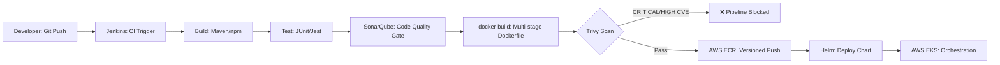
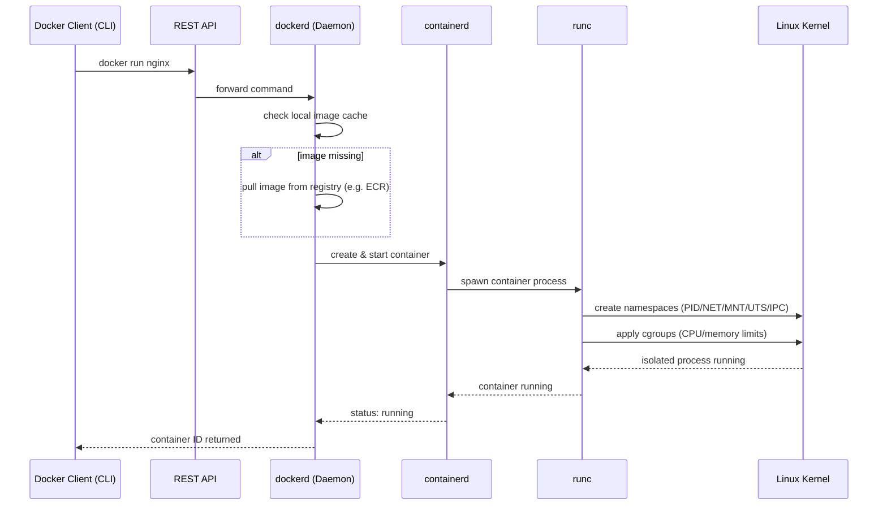
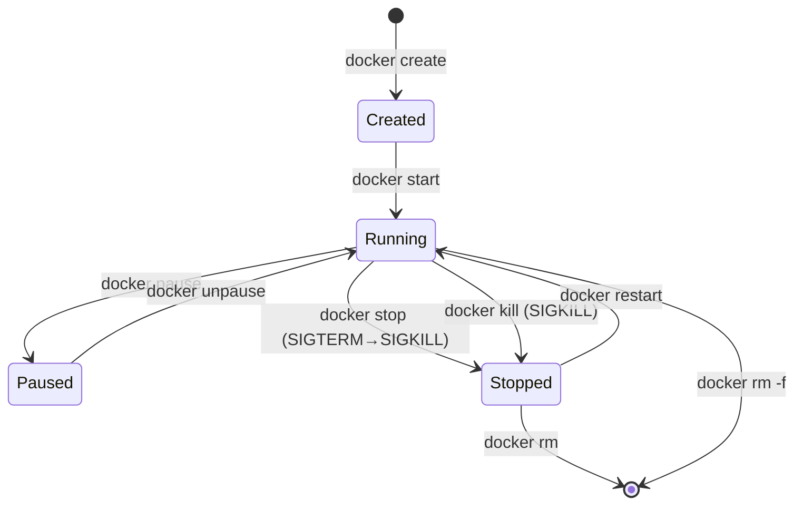
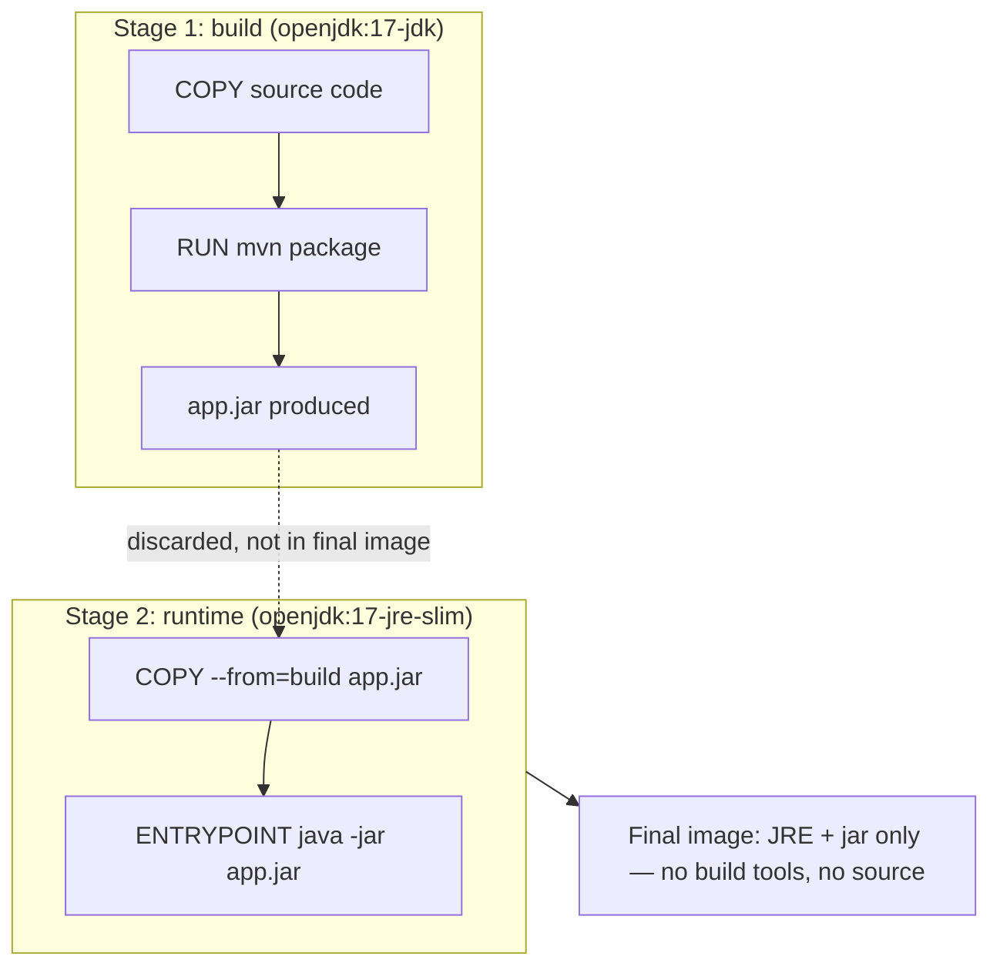
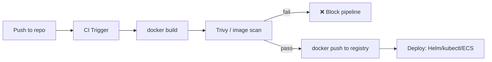

# DOCKER HANDBOOK

**Edition:** 2026-07-v1 (First edition under the monthly incremental handbook system)
**Owner:** Suraj — Platform/DevOps Engineer, UK Government Project (CMG)
**Status:** ACTIVE — this file is appended to only within July 2026. From August 2026 onward, a new file (`Docker-Handbook-2026-08-v2.md`) will be created and this file becomes READ-ONLY per the versioning rules.

> **Migration note:** This edition consolidates all Docker knowledge previously captured across `Docker_Notes_v1_Jul2025.docx` and `Docker_Interview_QA_v1_Jul2025.docx` into the single Markdown handbook format defined by the Docker Master Prompt. No content was duplicated in this merge — Notes-doc material became the concept/architecture/command Phases (1–17), and the QA-doc material became Phase 20 (Interview Preparation), matching the Master Prompt's own definition of that phase.

## How This Handbook Works

- Organized strictly along the Master Prompt's 20-phase learning path.
- Every phase below is tagged **✅ Covered**, **🟡 Partial**, or **⬜ Not Yet Covered** — see the Coverage Tracker.
- `⬜ Not Yet Covered` phases are intentionally left as stubs; they will be written in a future monthly edition (per Rule 5/6 — new/incomplete topics get fully documented, not patched).
- 🟢 CMG project example  |  🔴 Security point  |  🟣 Interviewer expectation  |  💡 Tip  |  ⚠️ Common mistake  |  🚀 Best practice

---

## CMG Project Docker Pipeline (Reference Context)

*Reference this pipeline in every interview answer — this is real project experience.*

> *Reference this pipeline in EVERY interview answer. This is your real
> project experience.*

|               |                    |                                               |
|---------------|--------------------|-----------------------------------------------|
| **Stage**     | **Tool / Action**  | **Purpose**                                   |
| Developer     | Git Push           | Code committed to repo; triggers CI pipeline  |
| CI Trigger    | Jenkins Pipeline   | Automated build triggered on every push       |
| Build         | Maven / npm Build  | Application compiled and packaged             |
| Test          | Unit Testing       | JUnit / Jest tests executed in pipeline       |
| Code Quality  | SonarQube Analysis | Static analysis; quality gate must pass       |
| Image Build   | docker build       | Multi-stage Dockerfile builds lean image      |
| Security Scan | Trivy Scan         | CVE scan; CRITICAL/HIGH blocks ECR push       |
| Registry Push | AWS ECR Push       | Versioned image pushed (BUILD_NUMBER tag)     |
| Deploy        | Helm Deployment    | Kubernetes manifests deployed via Helm charts |
| Orchestration | AWS EKS            | Managed Kubernetes runs and heals services    |

> **Pipeline Key Point:** Trivy is a QUALITY GATE — exit-code 1 on
> CRITICAL/HIGH CVEs fails the Jenkins stage and BLOCKS the push to ECR.
> Image never reaches EKS if it fails Trivy.

#### CMG Pipeline Flow (Diagram)

---

## Coverage Tracker (Master Prompt Phases 1–20)

| Phase | Topic | Status | Source |
|---|---|---|---|
| 1 | Fundamentals | ✅ Covered | Notes §2, §4, §18, §19 |
| 2 | Docker Architecture | ✅ Covered | Notes §3, §20, §21, §22, §23 |
| 3 | Images | ✅ Covered | Notes §5 |
| 4 | Containers (lifecycle) | 🟡 Partial | Notes §12.2 (commands only — no dedicated lifecycle deep-dive yet) |
| 5 | Dockerfile | ✅ Covered | Notes §6 |
| 6 | Image Building (BuildKit/Buildx) | ✅ Covered | Notes §7, §24, §25 |
| 7 | Networking | ✅ Covered | Notes §8 |
| 8 | Storage | ✅ Covered | Notes §9, §29 |
| 9 | Docker Compose | ✅ Covered | Notes §10 |
| 10 | Registry | ✅ Covered | Notes §32 |
| 11 | Security | ✅ Covered | Notes §11, §16, §26, §27, §28 |
| 12 | Monitoring | ✅ Covered | Notes §31 |
| 13 | Logging | ✅ Covered | Notes §30 |
| 14 | Troubleshooting | 🟡 Partial | QA Section M (scenarios only — no dedicated concept section yet) |
| 15 | Production | ✅ Covered | Notes §13, QA §L/§N |
| 16 | Docker in Cloud | ✅ Covered | Notes §33 |
| 17 | CI/CD | ✅ Covered | Notes §34 |
| 18 | Orchestration Overview (Swarm/Nomad/Compose vs K8s vs ECS) | ⬜ Not Yet Covered | Only Compose-vs-K8s decision exists (§10.1); Swarm/Nomad comparison pending |
| 19 | Advanced Docker (distroless, scratch, OCI runtime, plugins, Docker API) | 🟡 Partial | Buildx/multi-arch covered (§6); distroless/scratch/plugins/API pending |
| 20 | Interview Preparation | ✅ Covered | Entire QA document (40 Qs + scenarios) |

**Pending for next edition (2026-08-v2):** full Phase 18 (Swarm, Nomad, orchestration comparison), remainder of Phase 19 (distroless/scratch images, OCI runtime spec, Docker plugins, Docker API), and a dedicated Phase 14 troubleshooting concept section (exit codes, OOMKilled, DNS/port conflicts as standalone reference, not just scenarios).

---

## PHASE 1: FUNDAMENTALS

### Docker — Core Concepts

#### 2.1 Simple Definition

> *Docker is an open-source containerization platform that packages
> applications and all their dependencies into portable, isolated units
> called containers — sharing the host OS kernel.*

#### 2.2 Problem Docker Solves

- Eliminates "it works on my machine" — containers run identically
  everywhere

- Packages code + runtime + libraries + configs into one portable unit

- Ensures dev, staging, and production environments are identical

- Enables fast, consistent deployments across any infrastructure

#### 2.3 Key Terms

|                   |                                                                          |
|-------------------|--------------------------------------------------------------------------|
| **Container**     | Lightweight, isolated running process using Linux namespaces + cgroups   |
| **Image**         | Read-only template (blueprint) built from a Dockerfile                   |
| **Dockerfile**    | Text file with instructions to build a Docker image                      |
| **Registry**      | Storage and distribution service for Docker images (e.g. AWS ECR)        |
| **Docker Engine** | Core service: daemon (dockerd) + containerd + runc                       |
| **containerd**    | High-level container runtime; replaced Docker in Kubernetes 1.20+        |
| **runc**          | Low-level OCI runtime; actually creates containers using kernel features |
| **Layer**         | Each Dockerfile instruction creates a cached, reusable image layer       |
| **Volume**        | Docker-managed persistent storage outside the container filesystem       |
| **Bind Mount**    | Host directory mapped directly into container filesystem                 |

#### 2.4 Benefits of Docker

|                     |                                                             |
|---------------------|-------------------------------------------------------------|
| **Portability**     | Run anywhere Docker is installed — laptop, VM, EC2, EKS     |
| **Consistency**     | Same image in dev/staging/production — no environment drift |
| **Speed**           | Container starts in seconds vs minutes for VMs              |
| **Efficiency**      | Shared kernel = no duplicate OS overhead per container      |
| **Isolation**       | Namespaces prevent inter-application interference           |
| **Immutability**    | Image is fixed; changes = new image version (BUILD_NUMBER)  |
| **Scalability**     | EKS scales containers horizontally in seconds               |
| **Version Control** | Every image tagged and stored in ECR with full history      |

### Container vs Virtual Machine

> *Most asked comparison in any Docker interview. Know this cold.*

|                   |                                    |                                             |
|-------------------|------------------------------------|---------------------------------------------|
| **Aspect**        | **Virtual Machine**                | **Docker Container**                        |
| Operating System  | Full Guest OS per VM (GBs)         | Shares Host OS Kernel (MBs)                 |
| Startup Time      | 1–2 minutes (boot full OS)         | 1–5 seconds (start a process)               |
| Image Size        | GBs per VM                         | MBs per image                               |
| Isolation         | Full kernel isolation (hypervisor) | Process isolation (namespaces)              |
| Resource Overhead | High — full OS per VM              | Low — shared kernel                         |
| Portability       | Limited (hypervisor dependent)     | High — run anywhere Docker runs             |
| Security Boundary | Stronger (separate kernel)         | Good (namespace + seccomp + AppArmor)       |
| Hypervisor        | Required (VMware, KVM, Hyper-V)    | Not required                                |
| Use Case          | Legacy apps, full OS isolation     | Microservices, CI/CD, cloud-native          |
| In CMG            | EC2 runs as nodes in EKS           | Microservices run as containers in EKS pods |

> **✅ Correct Answer:** Containers share the host OS kernel —
> lightweight (MBs), start in seconds. VMs run a full Guest OS via
> hypervisor — heavyweight (GBs), start in minutes. In CMG we chose
> Docker + EKS to run multiple microservices on the same EC2 nodes,
> significantly reducing AWS costs.
>
> **❌ Common Trap:** Never say "Docker is a VM" or "containers are
> completely isolated like VMs".

#### 4.1 Linux Kernel Features Containers Use

|                              |                                                                                            |
|------------------------------|--------------------------------------------------------------------------------------------|
| **Namespaces**               | Process isolation — each container has own PID, NET, MNT, IPC, UTS, User space             |
| **Control Groups (cgroups)** | Resource limits — CPU, memory, disk I/O, network bandwidth per container                   |
| **Union Filesystem**         | Layered filesystem (OverlayFS) — image layers stacked with writable container layer on top |
| **seccomp**                  | Syscall filtering — restricts which Linux system calls a container can make                |
| **AppArmor / SELinux**       | Mandatory access controls — restrict container file/network access by policy               |

### Docker History & Evolution

|              |                                        |                                                                        |
|--------------|----------------------------------------|------------------------------------------------------------------------|
| **Year**     | **Milestone**                          | **Impact**                                                             |
| 2008         | Linux Containers (LXC) created         | First native Linux container technology using namespaces + cgroups     |
| 2010         | dotCloud founded by Solomon Hykes      | PaaS company that later open-sourced Docker                            |
| Mar 2013     | Docker open-sourced at PyCon           | Released as open-source; containerization went mainstream              |
| Jun 2014     | Docker 1.0 released                    | First production-stable release; Docker Hub launched                   |
| 2015         | Open Container Initiative (OCI) formed | Docker, CoreOS, Google standardised container formats                  |
| 2016         | Docker Swarm released                  | Docker's native orchestration; Kubernetes competition began            |
| 2017         | Kubernetes became dominant             | Docker Inc adopted Kubernetes alongside Swarm                          |
| 2019         | Docker Desktop for Mac/Windows         | Simplified local development; became standard dev tool                 |
| Dec 2020     | Kubernetes deprecated Docker runtime   | containerd became the preferred CRI; Docker Engine still builds images |
| 2022         | Docker Desktop licensing changed       | Free for personal use; commercial use requires paid subscription       |
| 2023–present | BuildKit, Docker Scout, Buildx default | New tooling for security, multi-arch, and faster builds                |

> **Key Insight:** Docker did NOT die when Kubernetes removed it as
> runtime. Docker builds images; Kubernetes runs them. OCI images built
> by Docker work on ANY compliant runtime (containerd, CRI-O, podman).

### Docker Editions (CE vs EE vs Desktop)

|                |                                   |                                                                                                                              |
|----------------|-----------------------------------|------------------------------------------------------------------------------------------------------------------------------|
| **Edition**    | **Full Name**                     | **Use Case**                                                                                                                 |
| Docker CE      | Community Edition                 | Free, open-source. Used for development, testing, and production on Linux.                                                   |
| Docker EE      | Enterprise Edition (now Mirantis) | Paid, enterprise features, certified infrastructure, support SLAs. Acquired by Mirantis in 2019.                             |
| Docker Desktop | Docker Desktop for Mac/Windows    | All-in-one dev tool. Includes Docker Engine, CLI, Compose, BuildKit, Kubernetes. Commercial license required for large orgs. |
| Docker Engine  | Engine only (Linux)               | Core container runtime for production servers. No GUI. Most lightweight.                                                     |

#### 19.1 Docker Desktop Key Features

- Runs Docker Engine inside a lightweight VM (HyperKit on Mac, WSL2 on
  Windows)

- Includes: Docker CLI, Compose, BuildKit, Kubernetes (single-node),
  Docker Scout, Extensions

- Dev Environments: share reproducible dev setups as containers

- Docker Desktop vs Colima vs Rancher Desktop: all run Docker Engine on
  Mac/Windows via VM

#### 19.2 Licensing Note

> **Important:** Docker Desktop requires a paid subscription for
> companies with 250+ employees or \>\$10M revenue. Docker Engine (CE)
> remains free for all use cases. In CMG: Jenkins agents use Docker
> Engine (CE) on Linux EC2 — no licensing concern.

## PHASE 2: DOCKER ARCHITECTURE

### Docker Architecture

#### 3.1 Client–Server Architecture

> *Docker Client → REST API → Docker Daemon (dockerd) → containerd →
> runc → Container*

|                         |                                                                      |                                                       |
|-------------------------|----------------------------------------------------------------------|-------------------------------------------------------|
| **Component**           | **Role**                                                             | **In CMG Project**                                    |
| Docker Client (CLI)     | Sends commands (build, run, push) to daemon via REST API             | Jenkins uses CLI to run docker build, docker push     |
| Docker Daemon (dockerd) | Background service managing all Docker objects                       | Runs on Jenkins agent; receives CLI commands          |
| containerd              | High-level runtime; manages container lifecycle + image storage      | Used by EKS as CRI (replaced Docker daemon in K8s)    |
| runc                    | Low-level OCI runtime; creates containers using namespaces + cgroups | Called by containerd to actually spawn containers     |
| Docker Registry         | Stores and distributes Docker images                                 | AWS ECR is our private registry                       |
| Images                  | Read-only templates; stacked layers built from Dockerfile            | Built by Jenkins, stored in ECR with BUILD_NUMBER tag |
| Containers              | Running instances of images; have writable layer on top              | Our microservices running in EKS pods                 |
| Networks                | Virtual networks for container communication                         | VPC CNI in EKS; bridge networks in local Compose      |
| Volumes                 | Persistent storage outside container filesystem                      | EBS/EFS backed PersistentVolumes in EKS               |

#### 3.2 How docker run nginx Works (Step by Step)

1.  Docker Client sends "run nginx" to daemon via REST API

2.  Daemon checks local image cache — if missing, pulls from registry

3.  Daemon instructs containerd to prepare container

4.  containerd calls runc to create isolated process

5.  runc creates Linux namespaces (PID, NET, MNT, UTS, IPC)

6.  runc applies cgroups (CPU/memory resource limits)

7.  Container process starts inside the isolated environment

8.  Docker assigns virtual network interface and IP to container

#### Docker Engine Internals — Request Flow (Diagram)

### OCI Standards — Deep Dive

> **Definition:** Open Container Initiative (OCI) is a Linux Foundation
> project defining open standards for container formats and runtimes.
> Ensures portability across all container tools.

#### 20.1 OCI Specifications

|                       |                                                            |                                                           |
|-----------------------|------------------------------------------------------------|-----------------------------------------------------------|
| **Specification**     | **What It Defines**                                        | **Implementations**                                       |
| OCI Image Spec        | Container image format — layers, manifests, config         | Docker images, Buildah, Podman images — all OCI compliant |
| OCI Runtime Spec      | Container runtime interface — how to create/run containers | runc (Docker), crun (Red Hat), gVisor, Kata Containers    |
| OCI Distribution Spec | How images are pushed/pulled from registries               | Docker Hub, ECR, ACR, GCR, Harbor — all OCI compliant     |

#### 20.2 Why OCI Matters

- Docker images are OCI images — they run on ANY OCI-compliant runtime
  (containerd, CRI-O, podman)

- Kubernetes uses containerd (OCI runtime) — NOT Docker daemon — since
  v1.20

- Your Docker-built images work unchanged on EKS, AKS, GKE — all use
  OCI-compliant runtimes

- OCI ensures vendor neutrality — no lock-in to Docker Inc or any single
  vendor

#### 20.3 OCI Image Structure

|                    |                                                                               |
|--------------------|-------------------------------------------------------------------------------|
| **Image Manifest** | JSON file listing layers and config. The "table of contents" of an image.     |
| **Image Config**   | JSON with metadata: environment, entrypoint, labels, history                  |
| **Layers**         | Compressed tar archives (gzip). Each layer = diff from previous layer.        |
| **Image Index**    | Multi-architecture manifest list. Points to arch-specific manifests.          |
| **Digest**         | SHA256 hash of the manifest. Immutable identifier. Never changes unlike tags. |

### Linux Namespaces — All 7 Types

> *Namespaces are the core Linux kernel feature that makes containers
> possible. Each container gets its own isolated view of system
> resources.*

|                   |                                                         |                                                                                                                 |
|-------------------|---------------------------------------------------------|-----------------------------------------------------------------------------------------------------------------|
| **Namespace**     | **Isolates**                                            | **What Container Sees**                                                                                         |
| PID               | Process IDs                                             | Container has its own PID 1. Cannot see host or other container processes. docker top shows isolated PIDs.      |
| NET               | Network interfaces, routing tables, iptables            | Own virtual eth0, IP address, routing. Containers can't see each other's network unless on same Docker network. |
| MNT               | Filesystem mount points                                 | Own root filesystem (from image layers). Cannot see host filesystem unless bind-mounted.                        |
| IPC               | Inter-process communication — shared memory, semaphores | Containers can't share memory with each other or host by default.                                               |
| UTS               | Hostname and domain name                                | Own hostname (container ID by default). Can be set with --hostname flag.                                        |
| USER              | User and group IDs                                      | Container UID 0 (root) can map to non-root on host with user namespace remapping (rootless Docker).             |
| TIME (Linux 5.6+) | System time                                             | Experimental. Allows per-container clock offset. Rarely used.                                                   |

#### 21.1 Namespace Commands

> \# View namespaces of a running container
>
> lsns -p \$(docker inspect --format="{{.State.Pid}}" mycontainer)
>
> \# Enter a container namespace manually (what docker exec does)
>
> nsenter --target \<PID\> --mount --uts --ipc --net --pid
>
> **Interview Tip:** Interviewers ask "how does Docker provide
> isolation?" Answer: Linux namespaces give each container its own
> isolated view of PID, NET, MNT, IPC, UTS, USER. Cgroups limit resource
> usage. Together they make containers.

### Cgroups — Deep Dive (v1 vs v2)

> **Definition:** Control Groups (cgroups) is a Linux kernel feature
> that limits, accounts for, and isolates resource usage (CPU, memory,
> disk I/O, network) of process groups — including containers.

#### 22.1 What cgroups Control

|               |                                                                                |
|---------------|--------------------------------------------------------------------------------|
| **CPU**       | Limit CPU shares, quota, and period. docker run --cpus=1 limits to 1 CPU core. |
| **Memory**    | Limit memory + swap. docker run --memory=512m. OOM killer enforces limit.      |
| **Block I/O** | Throttle disk read/write IOPS and bandwidth.                                   |
| **Network**   | Rate limit network bandwidth (via tc, not cgroups directly).                   |
| **PIDs**      | Limit number of processes a container can spawn (prevents fork bombs).         |

#### 22.2 cgroups v1 vs v2

|                  |                                            |                                                   |
|------------------|--------------------------------------------|---------------------------------------------------|
| **Aspect**       | **cgroups v1**                             | **cgroups v2**                                    |
| Hierarchy        | Multiple separate hierarchies per resource | Single unified hierarchy                          |
| Controller mount | /sys/fs/cgroup/memory/, /cpu/ etc.         | Single /sys/fs/cgroup/                            |
| Delegation       | Complicated                                | Simplified, safer delegation                      |
| Docker support   | Default on older kernels/distros           | Default on Ubuntu 22.04+, RHEL 9+, modern kernels |
| Kubernetes       | Supported                                  | Preferred; enables better memory QoS              |

#### 22.3 Setting Resource Limits (CMG)

> \# Docker run with cgroup limits
>
> docker run \\
>
> --memory=512m \\ \# Max memory
>
> --memory-swap=512m \\ \# Disable swap (same as memory = no swap)
>
> --cpus=1.5 \\ \# 1.5 CPU cores
>
> --pids-limit=100 \\ \# Max 100 processes (prevent fork bomb)
>
> myimage
>
> \# Kubernetes equivalent (CMG Helm chart)
>
> resources:
>
> requests:
>
> memory: "256Mi"
>
> cpu: "250m"
>
> limits:
>
> memory: "512Mi"
>
> cpu: "1000m"
>
> **Java in Containers:** ALWAYS add -XX:+UseContainerSupport to JVM
> flags. Without it, JVM reads host RAM (e.g. 32GB) instead of container
> limit (512MB) for heap sizing — causing OOM kills. This is set in our
> CMG ENTRYPOINT.

### OverlayFS / Union Filesystem

> **Definition:** OverlayFS is a union filesystem used by Docker to
> stack multiple read-only image layers and one writable container layer
> into a single unified filesystem view.

#### 23.1 How OverlayFS Works

|                   |                                                                                |
|-------------------|--------------------------------------------------------------------------------|
| **lowerdir**      | Read-only image layers (stacked from Dockerfile). Multiple lower directories.  |
| **upperdir**      | Writable container layer. All writes go here. Discarded on container removal.  |
| **workdir**       | OverlayFS internal working directory for atomic operations.                    |
| **merged**        | The unified view the container sees. Combines all layers transparently.        |
| **Copy-on-Write** | When container writes to a file from lowerdir, it is copied to upperdir first. |

#### 23.2 OverlayFS Layer Example

> \# View Docker storage driver
>
> docker info \| grep "Storage Driver"
>
> \# View image layers on disk
>
> ls /var/lib/docker/overlay2/
>
> \# Inspect layer structure of an image
>
> docker inspect myimage \| jq .\[0\].RootFS.Layers

#### 23.3 Storage Drivers

|               |                    |                                                      |
|---------------|--------------------|------------------------------------------------------|
| **Driver**    | **Platform**       | **Notes**                                            |
| overlay2      | Linux (preferred)  | Default and recommended. Requires Linux kernel 4.0+. |
| devicemapper  | Older RHEL/CentOS  | Legacy. Performance issues. Avoid unless required.   |
| btrfs         | btrfs filesystem   | Advanced features; not widely used.                  |
| vfs           | Any (testing only) | No CoW, no layers. Slow. For testing only.           |
| windowsfilter | Windows containers | Windows equivalent of overlay2.                      |

## PHASE 3: IMAGES

### Docker Image & Layers

#### 5.1 What is a Docker Image

- Read-only template containing: application code, runtime, libraries,
  configs, environment

- Built in layers — each Dockerfile instruction creates one cached layer

- Identified by: registry/repository:tag e.g.
  123456.ecr.eu-west-2.amazonaws.com/cmg-api:142

- Image digest (SHA256) = immutable reference; tag is a mutable pointer

#### 5.2 Image Layers & Caching

|                           |                                                                                             |
|---------------------------|---------------------------------------------------------------------------------------------|
| **Base Layer**            | FROM instruction — base OS or runtime (e.g. openjdk:17-jre-slim)                            |
| **Intermediate Layers**   | Each RUN, COPY, ADD instruction adds a new cached layer                                     |
| **Container Layer**       | Thin writable layer added when container starts — discarded on removal                      |
| **Layer Cache**           | Docker reuses unchanged layers — only rebuilds from first changed instruction               |
| **Caching Best Practice** | Put stable instructions early (FROM, COPY pom.xml, RUN mvn deps) — volatile last (COPY src) |

#### 5.3 Image Tagging Strategy in CMG

- Format: ECR_URL/cmg-api:BUILD_NUMBER (e.g. :142, :143)

- NEVER use :latest in production — mutable, non-reproducible, blocks
  rollback

- BUILD_NUMBER = immutable, traceable, rollback-able

- ECR image tag immutability enabled — existing tags cannot be
  overwritten

- ECR lifecycle policy — auto-delete images older than 30 days

#### 5.4 Image vs Container

> **Key Concept:** Image = Recipe (read-only). Container = Dish (running
> instance of image). Like class vs object in OOP. One image → many
> containers. Removing a container does NOT remove the image.

## PHASE 4: CONTAINERS

**Status: 🟡 Partial** — full container lifecycle deep-dive (create/start/stop/pause/exec/attach internals) is pending for the next edition. Lifecycle *commands* already exist below (full command list lives once, in the Appendix, to avoid duplication):

### Container Lifecycle Commands (excerpt — full Commands Reference in Appendix)

|                                             |                                                    |
|---------------------------------------------|----------------------------------------------------|
| **docker run -d --name name image**         | Run container detached (background)                |
| **docker run -it image /bin/bash**          | Run container with interactive terminal            |
| **docker run -p 8080:8080 image**           | Map host:container port                            |
| **docker run --memory=512m --cpus=1 image** | Set resource limits (ALWAYS in production)         |
| **docker run --user 1001 image**            | Run as specific non-root UID                       |
| **docker run --read-only image**            | Read-only root filesystem                          |
| **docker run --rm image**                   | Auto-remove container when it exits                |
| **docker run -e KEY=val image**             | Set environment variable                           |
| **docker run -v volname:/path image**       | Mount named volume                                 |
| **docker run -v /host:/container image**    | Bind mount host directory                          |
| **docker run --network mynet image**        | Attach to specific network                         |
| **docker ps**                               | List running containers                            |
| **docker ps -a**                            | List ALL containers (including stopped)            |
| **docker stop container**                   | Gracefully stop (SIGTERM + wait + SIGKILL)         |
| **docker kill container**                   | Immediately kill (SIGKILL)                         |
| **docker start container**                  | Start stopped container                            |
| **docker restart container**                | Stop then start container                          |
| **docker rm container**                     | Remove stopped container                           |
| **docker rm -f container**                  | Force remove running container                     |
| **docker pause container**                  | Freeze container processes                         |
| **docker unpause container**                | Unfreeze container processes                       |
| **docker rename old new**                   | Rename container                                   |
| **docker commit container image:tag**       | Create image from container state (avoid in CI/CD) |

#### Container Lifecycle — State Diagram

## PHASE 5: DOCKERFILE

### Dockerfile — All Instructions

> *Every Dockerfile instruction = one image layer. Order matters for
> caching. Stable instructions first.*

|                 |                                                                                                               |                                                                                 |
|-----------------|---------------------------------------------------------------------------------------------------------------|---------------------------------------------------------------------------------|
| **Instruction** | **Purpose & Best Practice**                                                                                   | **Example**                                                                     |
| FROM            | Sets base image. FIRST instruction. Always pin version. Use minimal images (slim, alpine, distroless).        | FROM openjdk:17-jre-slim                                                        |
| ARG             | Build-time variable — NOT in final image. Use for version params. Never for secrets.                          | ARG APP_VERSION=1.0                                                             |
| ENV             | Sets environment variable in image. Available at runtime. NEVER use for secrets (visible in docker inspect).  | ENV APP_ENV=production                                                          |
| WORKDIR         | Sets working directory for all subsequent instructions. Creates dir if not exists. Use absolute path.         | WORKDIR /app                                                                    |
| COPY            | Copies files/dirs from host to image. Preferred over ADD. Use .dockerignore to exclude.                       | COPY target/app.jar .                                                           |
| ADD             | Like COPY but extracts .tar.gz and downloads URLs. Use only when you need tar extraction.                     | ADD app.tar.gz /app/                                                            |
| RUN             | Executes command during build — creates a layer. Chain with && to reduce layers.                              | RUN apt-get update && apt-get install -y curl && rm -rf /var/lib/apt/lists/\*   |
| USER            | Sets user/UID for subsequent instructions and container runtime. CRITICAL for security — always set non-root. | USER appuser                                                                    |
| EXPOSE          | Documents port the container listens on. Informational only — does NOT publish port.                          | EXPOSE 8080                                                                     |
| VOLUME          | Creates a mount point for external volumes.                                                                   | VOLUME /data                                                                    |
| HEALTHCHECK     | Docker/Kubernetes uses this to detect unhealthy containers.                                                   | HEALTHCHECK --interval=30s CMD curl -f http://localhost:8080/health \|\| exit 1 |
| LABEL           | Adds metadata to image for traceability.                                                                      | LABEL maintainer="devops@cmg.gov.uk"                                            |
| ENTRYPOINT      | Fixed command that always runs. Cannot be overridden (without --entrypoint flag). Use exec form.              | ENTRYPOINT \["java", "-XX:+UseContainerSupport"\]                               |
| CMD             | Default arguments — CAN be overridden at docker run. Combined with ENTRYPOINT: provides default args.         | CMD \["-jar", "app.jar"\]                                                       |

#### 6.1 CMD vs ENTRYPOINT — Most Common Interview Trap

|                         |                                                                                                         |
|-------------------------|---------------------------------------------------------------------------------------------------------|
| **ENTRYPOINT**          | Fixed executable — always runs. Cannot be replaced without --entrypoint flag. Use for the main process. |
| **CMD**                 | Default arguments — can be replaced by passing args to docker run. Use for overridable defaults.        |
| **Together**            | ENTRYPOINT \["java"\] + CMD \["-jar","app.jar"\] → runs "java -jar app.jar"                             |
| **Override CMD**        | docker run myimage -jar other.jar → runs "java -jar other.jar" (CMD replaced)                           |
| **Override ENTRYPOINT** | docker run --entrypoint /bin/sh myimage (explicitly override)                                           |
| **Shell form risk**     | ENTRYPOINT java -jar app.jar — AVOID: shell form creates /bin/sh -c wrapper that swallows signals       |
| **CMG Example**         | ENTRYPOINT \["java","-XX:+UseContainerSupport","-XX:MaxRAMPercentage=75.0"\] — JVM flags always applied |

#### 6.2 COPY vs ADD

|                      |                                                                                        |
|----------------------|----------------------------------------------------------------------------------------|
| **COPY (preferred)** | Simple file/directory copy from host to image. Explicit, predictable, safe. USE THIS.  |
| **ADD (use rarely)** | COPY + extracts .tar.gz archives + downloads remote URLs. Extra features = extra risk. |

> **Rule:** Always use COPY. Only use ADD when you specifically need tar
> extraction. Never use ADD to download from URLs in Dockerfile —
> security risk.

## PHASE 6: IMAGE BUILDING

### Multi-Stage Builds

> **Definition:** Multiple FROM statements in one Dockerfile. Each FROM
> = a new stage. Only the LAST stage becomes the final image. Earlier
> stages are build environments — discarded.

#### 7.1 Why Multi-Stage Builds

|                   |                                                                                     |
|-------------------|-------------------------------------------------------------------------------------|
| **Image Size**    | CMG: Maven+JDK stage ~650MB → JRE-only runtime stage ~130MB (80% reduction)         |
| **Security**      | Build tools (Maven, JDK, compiler) not in production image = smaller attack surface |
| **Trivy CVEs**    | Fewer packages = fewer CVEs = less Trivy failures = smoother pipeline               |
| **ECR Cost**      | Smaller images = less ECR storage cost + faster push/pull                           |
| **Startup Speed** | Smaller image = faster container startup in EKS                                     |

#### 7.2 CMG Multi-Stage Dockerfile (Java Microservice)

> \# ===== STAGE 1: BUILD =====
>
> FROM maven:3.9-openjdk-17 AS builder
>
> WORKDIR /build
>
> COPY pom.xml .
>
> RUN mvn dependency:go-offline -B \# Cache deps in separate layer
>
> COPY src ./src
>
> RUN mvn package -DskipTests -B
>
> \# ===== STAGE 2: RUNTIME ONLY =====
>
> FROM openjdk:17-jre-slim \# No Maven, no JDK, no source code
>
> RUN groupadd -r appgroup && useradd -r -g appgroup appuser
>
> WORKDIR /app
>
> COPY --from=builder /build/target/cmg-service.jar app.jar
>
> RUN chown -R appuser:appgroup /app
>
> USER appuser \# SECURITY: non-root
>
> HEALTHCHECK --interval=30s --timeout=10s CMD curl -f
> http://localhost:8080/health \|\| exit 1
>
> EXPOSE 8080
>
> ENTRYPOINT
> \["java","-XX:+UseContainerSupport","-XX:MaxRAMPercentage=75.0"\]
>
> CMD \["-jar","app.jar"\]
>
> **Result:** Stage 1 (builder) discarded completely. Stage 2 (runtime)
> is the final image. COPY --from=builder copies only the compiled .jar
> — nothing else from the build stage.

#### Multi-Stage Build Flow (Diagram)

### BuildKit — Advanced Image Building

> *BuildKit is the next-generation Docker build engine. Default since
> Docker 23.0. Faster, more secure, and more feature-rich than the
> legacy builder. 📌 Ref: Section 7 for multi-stage builds basics.*

#### 24.1 Enable BuildKit

> \# Method 1: Environment variable
>
> DOCKER_BUILDKIT=1 docker build -t myimage .
>
> \# Method 2: Docker config (permanent)
>
> echo '{"features":{"buildkit":true}}' \> /etc/docker/daemon.json
>
> \# Method 3: buildx (BuildKit-based, multi-platform)
>
> docker buildx build -t myimage .

#### 24.2 BuildKit Features

|                 |                                                                      |                                                             |
|-----------------|----------------------------------------------------------------------|-------------------------------------------------------------|
| **Feature**     | **What It Does**                                                     | **Example**                                                 |
| Parallel Stages | Independent build stages run in parallel — faster multi-stage builds | Two FROM stages with no dependency run simultaneously       |
| Cache Mounts    | Mount a persistent cache between builds — e.g. Maven repo, npm cache | RUN --mount=type=cache,target=/root/.m2 mvn package         |
| Secret Mounts   | Pass secrets to build without baking them into image layers          | RUN --mount=type=secret,id=api_key cat /run/secrets/api_key |
| SSH Mounts      | Forward SSH agent into build — e.g. pull from private git repos      | RUN --mount=type=ssh git clone git@github.com:org/repo.git  |
| Inline Cache    | Embed cache metadata in image for registry-based caching             | docker build --cache-from myimage:latest .                  |
| Better Output   | Compact, coloured, progress output — easier to read build logs       | Automatic with BuildKit                                     |

#### 24.3 BuildKit Cache Mount (CMG Speed Optimisation)

> \# syntax=docker/dockerfile:1
>
> FROM maven:3.9-openjdk-17 AS builder
>
> WORKDIR /build
>
> COPY pom.xml .
>
> \# Cache Maven local repository between builds — MAJOR speed
> improvement
>
> RUN --mount=type=cache,target=/root/.m2 mvn dependency:go-offline -B
>
> COPY src ./src
>
> RUN --mount=type=cache,target=/root/.m2 mvn package -DskipTests -B
>
> **CMG Benefit:** BuildKit cache mount means Maven dependencies are NOT
> re-downloaded on every Jenkins build. Only new/changed dependencies
> are fetched. Build time reduced from ~8 minutes to ~2 minutes in CMG
> pipeline.

#### 24.4 BuildKit Secret Mount (Secure Build Credentials)

> \# Dockerfile — secret available only during RUN, not in image
>
> RUN --mount=type=secret,id=npmrc \\
>
> cp /run/secrets/npmrc ~/.npmrc && \\
>
> npm install && \\
>
> rm ~/.npmrc
>
> \# Build command — secret passed at build time
>
> docker buildx build --secret id=npmrc,src=.npmrc -t myimage .
>
> **Security:** Secret mount files NEVER appear in image layers. Even
> docker history or image inspection reveals nothing. This is the
> correct way to use credentials during build.

### Multi-Architecture Builds (buildx)

> **Definition:** docker buildx enables building Docker images for
> multiple CPU architectures (amd64, arm64, arm/v7) from a single build
> command. Essential for Apple M1/M2 and AWS Graviton deployments.

#### 25.1 Why Multi-Architecture Images

- Apple Silicon (M1/M2/M3): ARM64 architecture — standard amd64 images
  run via emulation (slow)

- AWS Graviton (EC2 t4g, m7g): ARM64 — 20% cheaper than equivalent x86,
  40% better price/performance

- IoT / Raspberry Pi: ARM/v7 — must use ARM images

- OCI Image Index: one tag pointing to multiple arch-specific manifests
  — Docker pulls the right one automatically

#### 25.2 Build Multi-Arch Image

> \# Step 1: Create a buildx builder with multi-platform support
>
> docker buildx create --name multiarch --use
>
> docker buildx inspect --bootstrap
>
> \# Step 2: Build and push for multiple platforms
>
> docker buildx build \\
>
> --platform linux/amd64,linux/arm64 \\
>
> -t 123456789.dkr.ecr.eu-west-2.amazonaws.com/cmg-api:142 \\
>
> --push .
>
> \# Step 3: Verify manifest (shows all architectures)
>
> docker buildx imagetools inspect
> 123456789.dkr.ecr.eu-west-2.amazonaws.com/cmg-api:142

#### 25.3 Platform-Specific Build Arguments

> FROM --platform=\$BUILDPLATFORM node:18-alpine AS builder
>
> ARG TARGETPLATFORM
>
> ARG BUILDPLATFORM
>
> RUN echo "Building on \$BUILDPLATFORM for \$TARGETPLATFORM"

## PHASE 7: NETWORKING

### Docker Networking

|                  |                                        |                                                                                                                  |
|------------------|----------------------------------------|------------------------------------------------------------------------------------------------------------------|
| **Network Type** | **Use Case**                           | **Key Behaviour**                                                                                                |
| Bridge (default) | Containers on same Docker host         | NAT-based isolation. Default for docker run. USER-DEFINED bridge supports DNS by name — default bridge does NOT. |
| Host             | Performance-critical; bypass isolation | Container shares host network stack directly. No NAT overhead. Security risk: bypasses network namespace.        |
| Overlay          | Docker Swarm multi-host                | Virtual network spanning multiple Docker hosts. Used by Swarm services for cross-node communication.             |
| None             | Maximum isolation                      | No network connectivity. Container has loopback only. Use for batch jobs that need zero network.                 |
| Macvlan          | Legacy apps needing own MAC/IP         | Container appears as physical device on network. Advanced; rarely needed.                                        |
| VPC CNI (EKS)    | Kubernetes pods on AWS                 | AWS native; each pod gets a real VPC IP. Used in CMG EKS cluster.                                                |

#### 8.1 Important Networking Rules

- Default bridge network: containers communicate by IP only — NO DNS
  resolution by name

- User-defined bridge network: containers communicate by NAME (DNS) —
  always use for multi-container apps

- Each container gets its own virtual network interface inside its
  network namespace

- In EKS (CMG): Kubernetes handles pod networking via AWS VPC CNI — each
  pod gets a VPC IP

- In EKS (CMG): Services communicate via Kubernetes Service objects
  (ClusterIP / LoadBalancer)

- Network policies in EKS restrict which pods can communicate — zero
  trust networking

#### 8.2 Key Networking Commands

|                                            |                                      |
|--------------------------------------------|--------------------------------------|
| **docker network ls**                      | List all networks                    |
| **docker network create mynet**            | Create user-defined bridge network   |
| **docker network inspect mynet**           | View subnet, containers, config      |
| **docker network connect mynet container** | Connect running container to network |
| **docker run --network mynet image**       | Start container on specific network  |

## PHASE 8: STORAGE

### Docker Volumes & Storage

|             |                                  |                                       |                                |
|-------------|----------------------------------|---------------------------------------|--------------------------------|
| **Aspect**  | **Docker Volumes**               | **Bind Mounts**                       | **tmpfs**                      |
| Managed by  | Docker (fully managed)           | Host OS / You                         | Docker (in RAM)                |
| Location    | /var/lib/docker/volumes/         | Any host path you specify             | Host memory — not on disk      |
| Portability | High — platform-independent      | Low — path tied to host               | Ephemeral — lost on stop       |
| Performance | Good                             | Best (direct I/O)                     | Excellent (RAM speed)          |
| Security    | Better (isolated from host)      | Risk (full host path access)          | Secure (not persisted to disk) |
| Backup      | docker volume + cp commands      | Standard file backup                  | N/A — ephemeral                |
| Use Case    | Databases, app data              | Dev: live reload, config files        | Secrets, temp cache in memory  |
| Production  | ✅ Recommended                   | ⚠️ With caution only                  | ✅ For sensitive temp data     |
| In CMG      | EBS/EFS PersistentVolumes in EKS | Jenkins agent workspace / docker.sock | Not used currently             |

> **CRITICAL:** NEVER mount /var/run/docker.sock into a production
> container. It grants the container root-level control over the Docker
> daemon on the host — complete host compromise.

#### 9.1 Key Volume Commands

|                                                    |                             |
|----------------------------------------------------|-----------------------------|
| **docker volume create mydata**                    | Create named volume         |
| **docker volume ls**                               | List all volumes            |
| **docker volume inspect mydata**                   | Show mount path and details |
| **docker volume rm mydata**                        | Remove volume (data lost!)  |
| **docker run -v mydata:/app/data image**           | Mount volume into container |
| **docker run -v /host/path:/container/path image** | Bind mount host directory   |

### Volume Drivers, Backup & Restore

> *📌 Ref: Section 9 for volume fundamentals (Volumes vs Bind Mounts vs
> tmpfs). This section covers advanced volume topics.*

#### 29.1 Volume Drivers

|            |                           |                                                                         |
|------------|---------------------------|-------------------------------------------------------------------------|
| **Driver** | **Provider**              | **Use Case**                                                            |
| local      | Docker built-in (default) | Local disk storage on the host. Default for all named volumes.          |
| nfs        | Docker built-in           | Mount NFS shares. Shared storage across multiple hosts.                 |
| aws-ebs    | AWS / Kubernetes CSI      | Block storage for stateful apps on EKS. Single-node read/write.         |
| aws-efs    | AWS / Kubernetes CSI      | Shared file storage. Multiple pods read/write. Used for shared content. |
| azure-disk | Azure CSI                 | Block storage on AKS. Similar to EBS.                                   |
| azure-file | Azure CSI                 | SMB shared storage on AKS. Similar to EFS.                              |
| rexray     | REX-Ray (open-source)     | Multi-cloud volume management. Less common now.                         |
| portworx   | Portworx                  | Enterprise cloud-native storage. HA, encryption, snapshots.             |

#### 29.2 Volume Backup & Restore

> \# BACKUP: Copy volume data to tar file
>
> docker run --rm \\
>
> -v mydata:/data \\ \# Mount the volume
>
> -v \$(pwd):/backup \\ \# Mount current dir for output
>
> alpine \\
>
> tar czf /backup/mydata-backup.tar.gz -C /data .
>
> \# RESTORE: Extract tar file into volume
>
> docker run --rm \\
>
> -v mydata:/data \\
>
> -v \$(pwd):/backup \\
>
> alpine \\
>
> tar xzf /backup/mydata-backup.tar.gz -C /data
>
> \# Copy files between container and host
>
> docker cp mycontainer:/var/lib/postgresql/data ./pg-backup
>
> **CMG Practice:** For EKS: AWS Data Lifecycle Manager (DLM) takes
> automatic EBS snapshots. For EFS: AWS Backup. For local Jenkins
> volumes: tar backup to S3 via cron job.

## PHASE 9: DOCKER COMPOSE

### Docker Compose

> **Definition:** Docker Compose defines and runs multi-container
> applications using a YAML file. One command (docker-compose up) starts
> all services, networks, and volumes.

#### 10.1 When to Use Compose vs Kubernetes

|                      |                                                                                                    |
|----------------------|----------------------------------------------------------------------------------------------------|
| **Docker Compose**   | Local development, integration testing, simple CI environments. Single host. Simple orchestration. |
| **Kubernetes / EKS** | Production. Multi-host. Auto-scaling. Self-healing. Rolling updates. RBAC. Used in CMG production. |

#### 10.2 docker-compose.yml — CMG Local Dev Example

> version: "3.9"
>
> services:
>
> cmg-api: \# Service 1: our Java application
>
> build:
>
> context: .
>
> ports: \["8080:8080"\]
>
> environment:
>
> \- SPRING_PROFILES_ACTIVE=dev
>
> \- DB_URL=jdbc:postgresql://postgres:5432/cmgdb
>
> depends_on:
>
> postgres:
>
> condition: service_healthy \# Wait for DB to be ready
>
> networks: \[cmg-network\]
>
> postgres: \# Service 2: database
>
> image: postgres:15-alpine
>
> volumes: \[postgres-data:/var/lib/postgresql/data\]
>
> healthcheck:
>
> test: \["CMD-SHELL","pg_isready -U cmguser"\]
>
> interval: 10s
>
> networks: \[cmg-network\]
>
> volumes:
>
> postgres-data: \# Named volume — survives compose down
>
> networks:
>
> cmg-network: \# User-defined bridge — DNS by service name

#### 10.3 Key Compose Commands

|                                      |                                       |
|--------------------------------------|---------------------------------------|
| **docker-compose up -d**             | Start all services in background      |
| **docker-compose down**              | Stop and remove containers + networks |
| **docker-compose logs -f service**   | Follow logs of specific service       |
| **docker-compose ps**                | List running compose services         |
| **docker-compose build**             | Rebuild images from Dockerfiles       |
| **docker-compose exec service bash** | Shell into running service            |

## PHASE 10: REGISTRY

### Registry Comparison — ECR, Harbor, Nexus, JFrog

|                          |                     |                                                                                                                                      |
|--------------------------|---------------------|--------------------------------------------------------------------------------------------------------------------------------------|
| **Registry**             | **Provider**        | **Key Features**                                                                                                                     |
| Docker Hub               | Docker Inc          | Public registry. 1 private repo free. Rate limiting on pulls. First registry ever.                                                   |
| AWS ECR                  | Amazon Web Services | Fully managed. IAM-native. No rate limits within AWS. Lifecycle policies. Scan-on-push. VPC endpoints. CMG choice.                   |
| Azure ACR                | Microsoft Azure     | Managed registry for Azure. Geo-replication. Task builds. Integrates with AKS natively.                                              |
| Google Artifact Registry | Google Cloud        | Replaces GCR. Multi-format (Docker, Maven, npm). VPC-native. Integrates with GKE.                                                    |
| Harbor                   | CNCF open-source    | Self-hosted. RBAC, vulnerability scanning (Trivy/Clair), image replication, proxy cache, Helm chart registry. Popular in enterprise. |
| Nexus Repository         | Sonatype            | Self-hosted. Multi-format (Docker, Maven, npm, PyPI). Proxy repos + hosted repos. Common in enterprises with on-prem infra.          |
| JFrog Artifactory        | JFrog               | Enterprise multi-format. Advanced RBAC. Build info. Xray for security scanning. DevSecOps platform.                                  |

#### 32.1 When to Choose Which

|                       |                                                                                     |
|-----------------------|-------------------------------------------------------------------------------------|
| **AWS ECR**           | AWS-native workloads. EKS deployments. Best ECR-EKS-IAM integration. CMG uses this. |
| **Harbor**            | On-prem or multi-cloud. Need self-hosted with RBAC + replication + proxy cache.     |
| **Nexus**             | Already using Nexus for Maven/npm. Want single repo manager for all artifact types. |
| **JFrog Artifactory** | Enterprise DevSecOps platform. Full build traceability. Multi-site replication.     |
| **Azure ACR**         | Azure-native workloads. AKS deployments. Geo-replication needs.                     |
| **Docker Hub**        | Open-source projects. Public image distribution. Personal projects.                 |

## PHASE 11: SECURITY

### Docker Security & DevSecOps

> *Security is non-negotiable for UK Government (CMG). Docker is NOT
> secure by default — every layer must be hardened deliberately.*

#### 11.1 Security Layers

|           |                                                                                     |                                                                                                    |
|-----------|-------------------------------------------------------------------------------------|----------------------------------------------------------------------------------------------------|
| **Layer** | **Controls**                                                                        | **CMG Implementation**                                                                             |
| Image     | Minimal base image, pin version, multi-stage, non-root USER, no secrets in image    | openjdk:17-jre-slim, USER appuser, multi-stage build                                               |
| Scan      | Trivy CVE scan before ECR push, scan-on-push in ECR                                 | Trivy --exit-code 1 blocks CRITICAL/HIGH — pipeline gate                                           |
| Registry  | Private ECR, IAM access control, image tag immutability, lifecycle policies         | AmazonEC2ContainerRegistryReadOnly on EKS node role; ECR lifecycle policy                          |
| Runtime   | Non-root, read-only FS, no privilege escalation, resource limits, drop capabilities | Kubernetes security context: runAsNonRoot, readOnlyRootFilesystem, allowPrivilegeEscalation: false |
| Network   | Network policies, no unnecessary exposed ports, VPC private subnets                 | EKS NetworkPolicies restrict pod-to-pod traffic                                                    |
| Secrets   | AWS Secrets Manager + CSI Driver, never in ENV or image                             | Secrets Store CSI Driver mounts secrets as files at pod startup                                    |
| Host      | CIS Docker benchmark, audit logging, CloudTrail                                     | CloudTrail logs all ECR API calls for Gov compliance                                               |

#### 11.2 Trivy — CMG Security Gate

- Trivy is an open-source vulnerability scanner by Aqua Security

- Scans: OS packages, language libraries (Maven/npm/pip), Dockerfile
  misconfigs, exposed secrets

- Severity levels: CRITICAL, HIGH, MEDIUM, LOW, UNKNOWN

- In CMG: --exit-code 1 on CRITICAL,HIGH → Jenkins stage FAILS → image
  NEVER pushed to ECR

> trivy image \\
>
> --severity CRITICAL,HIGH \\
>
> --exit-code 1 \\
>
> --ignore-unfixed \\
>
> --format table \\
>
> --output trivy-report.txt \\
>
> \${ECR_URL}/cmg-api:\${BUILD_NUMBER}

#### 11.3 Kubernetes Security Context (CMG Helm charts)

> securityContext:
>
> runAsNonRoot: true
>
> runAsUser: 1001
>
> readOnlyRootFilesystem: true
>
> allowPrivilegeEscalation: false
>
> capabilities:
>
> drop: \["ALL"\]
>
> add: \["NET_BIND_SERVICE"\]
>
> **Memory Trick:** Security layers = SHIRT: Scan images, Host
> hardening, Isolate networks, Runtime controls, Trust nothing by
> default.

### Rootless Docker

> **Definition:** Rootless Docker runs both the Docker daemon and
> containers as a non-root user. Provides stronger security by
> eliminating the root privilege requirement for Docker daemon.

#### 26.1 Why Rootless Docker

|                          |                                                                                            |
|--------------------------|--------------------------------------------------------------------------------------------|
| **Standard Docker Risk** | Docker daemon runs as root. If daemon is compromised, attacker gets host root.             |
| **Rootless Benefit**     | Daemon runs as your user. Container root = non-root on host. No privilege escalation path. |
| **Use Case**             | Multi-tenant CI/CD systems, shared development servers, security-hardened environments.    |
| **Limitation**           | Some features limited: overlapping port ranges, cgroups v1 memory limits.                  |

#### 26.2 Install Rootless Docker

> \# Install rootless Docker (Ubuntu/Debian)
>
> dockerd-rootless-setuptool.sh install
>
> \# Set environment
>
> export DOCKER_HOST=unix://\$XDG_RUNTIME_DIR/docker.sock
>
> \# Verify — daemon runs as your user
>
> docker info \| grep "rootless"

#### 26.3 User Namespace Remapping

- User namespace maps container UIDs to non-root host UIDs

- Container root (UID 0) → mapped to unprivileged host UID (e.g. 100000)

- Enable in daemon.json: {"userns-remap": "default"}

- CMG: Not using rootless Docker currently (Jenkins agents on dedicated
  EC2). Applicable for shared multi-tenant environments.

### Docker Scout

> **Definition:** Docker Scout is Docker's integrated supply chain
> security tool. Analyses images for CVEs, provides fix recommendations,
> and shows Software Bill of Materials (SBOM). Integrated into Docker
> Desktop and Docker Hub.

#### 27.1 Docker Scout vs Trivy

|                     |                                        |                                          |
|---------------------|----------------------------------------|------------------------------------------|
| **Aspect**          | **Docker Scout**                       | **Trivy (CMG current)**                  |
| Provider            | Docker Inc (built-in)                  | Aqua Security (open-source)              |
| Integration         | Docker Desktop, Docker Hub, CLI        | CLI, Jenkins, GitHub Actions, GitLab CI  |
| SBOM                | Yes — full Software Bill of Materials  | Yes — via trivy sbom                     |
| Fix Recommendations | Yes — suggests updated base images     | Yes — with --ignore-unfixed flag context |
| Policy Enforcement  | Docker Scout Policies (paid feature)   | Via exit codes + pipeline logic          |
| Cost                | Free tier limited; paid plans          | Free and open-source                     |
| CMG Usage           | Not currently used (Trivy is our gate) | ✅ Active — pipeline security gate       |
| Best For            | Dev team visibility in Docker Desktop  | CI/CD pipeline automation gate           |

#### 27.2 Docker Scout Commands

> \# Quick CVE overview of an image
>
> docker scout cves myimage:latest
>
> \# Recommendations for base image updates
>
> docker scout recommendations myimage:latest
>
> \# Generate SBOM (Software Bill of Materials)
>
> docker scout sbom myimage:latest
>
> \# Compare two image versions
>
> docker scout compare myimage:v1 myimage:v2
>
> **Interview Note:** Know the difference: Docker Scout =
> developer-friendly supply chain visibility + SBOM. Trivy = CI/CD
> quality gate with exit codes. Both complement each other. CMG uses
> Trivy as the gate; Scout could add visibility in Docker Desktop for
> devs.

### Advanced Security — Seccomp, AppArmor, Docker Bench

> *📌 Ref: Section 11 for security layers overview and Trivy. This
> section covers kernel-level runtime security controls.*

#### 28.1 Seccomp (Secure Computing Mode)

- Seccomp filters which Linux system calls (syscalls) a container can
  make

- Docker applies a default seccomp profile blocking ~44 dangerous
  syscalls

- Blocked by default: keyctl, add_key, request_key, ptrace, reboot,
  clock_adjtime etc.

- Custom profile: JSON file defining allowed/denied syscalls

> \# Apply custom seccomp profile
>
> docker run --security-opt seccomp=/path/to/profile.json myimage
>
> \# Disable seccomp (NEVER in production)
>
> docker run --security-opt seccomp=unconfined myimage

#### 28.2 AppArmor

- AppArmor is a Linux Mandatory Access Control (MAC) system

- Docker applies docker-default AppArmor profile to all containers

- Profile restricts: file access, network access, capabilities based on
  policy rules

- Custom profiles: loaded with apparmor_parser, applied with
  --security-opt apparmor=profile

> \# Check AppArmor status
>
> aa-status
>
> \# Apply custom profile
>
> docker run --security-opt apparmor=my-profile myimage

#### 28.3 Docker Bench for Security

- Docker Bench is an open-source script checking Docker installations
  against CIS Docker Benchmark

- Checks: host configuration, Docker daemon config, container runtime,
  image security, Swarm config

- Output: PASS / WARN / INFO / NOTE with remediation advice

> \# Run Docker Bench
>
> docker run --rm \\
>
> -v /etc:/etc:ro \\
>
> -v /usr/bin/containerd:/usr/bin/containerd:ro \\
>
> -v /var/run/docker.sock:/var/run/docker.sock:ro \\
>
> docker/docker-bench-security

|                    |                                                                      |                                                |
|--------------------|----------------------------------------------------------------------|------------------------------------------------|
| **Check Category** | **Examples**                                                         | **CMG Status**                                 |
| Host Config        | Separate partition for /var/lib/docker, audit rules for Docker files | Applies to Jenkins EC2 nodes                   |
| Daemon Config      | icc=false, no-new-privileges, userns-remap, log-level=info           | Review daemon.json on Jenkins agents           |
| Container Runtime  | AppArmor enabled, seccomp enabled, privileged=false, no root         | Applied via Kubernetes security context in EKS |
| Image              | Trusted base images only, no unnecessary packages, non-root user     | Enforced via Trivy + Dockerfile standards      |

### Security Checklist

|                                                    |                                                                               |
|----------------------------------------------------|-------------------------------------------------------------------------------|
| **✅ Non-root USER in Dockerfile**                 | Prevents privilege escalation — USER appuser after creating dedicated group   |
| **✅ Multi-stage builds**                          | Remove build tools from final image — smaller attack surface                  |
| **✅ Minimal base image (slim/alpine/distroless)** | Fewer installed packages = fewer CVEs from Trivy                              |
| **✅ Pin base image versions (not :latest)**       | Reproducible builds; no surprise vulnerabilities from base image updates      |
| **✅ Trivy scan as CI/CD quality gate**            | Block CRITICAL/HIGH CVEs before ECR push — exit-code 1 fails Jenkins          |
| **✅ Private ECR with IAM access control**         | No public registry; IAM roles on EKS node groups (not hardcoded keys)         |
| **✅ ECR image tag immutability**                  | Prevent overwriting existing tags — enforce immutable image versions          |
| **✅ ECR scan-on-push enabled**                    | Automatic CVE scan every time an image is pushed                              |
| **✅ ECR lifecycle policy**                        | Auto-delete images \>30 days — cost control + reduces stale vulnerable images |
| **✅ Never put secrets in image or ENV**           | Use AWS Secrets Manager + CSI Driver; secrets mounted at pod runtime          |
| **✅ Read-only root filesystem**                   | readOnlyRootFilesystem: true in Kubernetes security context                   |
| **✅ No privilege escalation**                     | allowPrivilegeEscalation: false in Kubernetes security context                |
| **✅ Drop all Linux capabilities**                 | capabilities.drop: \[ALL\] then add only what is truly needed                 |
| **✅ Set CPU and memory limits**                   | Prevent resource exhaustion; -XX:+UseContainerSupport for Java JVM            |
| **✅ Use .dockerignore**                           | Exclude .git, .env, node_modules, test files, SSH keys from build context     |
| **✅ Network policies in EKS**                     | Restrict pod-to-pod communication — zero trust networking                     |
| **✅ CloudTrail audit logging**                    | All ECR API calls logged — required for UK Government compliance              |
| **✅ No --privileged flag**                        | Never run privileged containers in production                                 |
| **✅ Rotate secrets regularly**                    | AWS Secrets Manager supports automatic rotation                               |

## PHASE 12: MONITORING

### Docker Monitoring — cAdvisor, Prometheus, Grafana

> *📌 Ref: Section 12 for docker stats command. This section covers
> production-grade monitoring infrastructure.*

#### 31.1 Monitoring Tools Comparison

|               |                                                                                   |                                                         |
|---------------|-----------------------------------------------------------------------------------|---------------------------------------------------------|
| **Tool**      | **Role**                                                                          | **In CMG**                                              |
| docker stats  | CLI real-time stats per container. Good for quick debugging.                      | Used for ad-hoc debugging on Jenkins agents             |
| cAdvisor      | Container Advisor by Google. Exposes per-container metrics as Prometheus metrics. | Runs as DaemonSet in EKS; exposes pod/container metrics |
| Prometheus    | Time-series metrics database. Scrapes cAdvisor, node-exporter, app metrics.       | kube-prometheus-stack deployed via Helm in EKS          |
| Grafana       | Visualization layer. Dashboards for Docker/Kubernetes metrics.                    | Grafana dashboards for CMG microservices and EKS nodes  |
| node-exporter | Host-level metrics (CPU, memory, disk, network) per EC2 node.                     | Runs as DaemonSet alongside cAdvisor                    |
| AlertManager  | Routes Prometheus alerts → Slack, PagerDuty, email.                               | Configured for CMG on-call alerts                       |

#### 31.2 cAdvisor Setup

> \# Run cAdvisor as container (single host)
>
> docker run -d \\
>
> --name cadvisor \\
>
> --volume=/var/run:/var/run:ro \\
>
> --volume=/sys:/sys:ro \\
>
> --volume=/var/lib/docker:/var/lib/docker:ro \\
>
> -p 8080:8080 \\
>
> gcr.io/cadvisor/cadvisor:latest

#### 31.3 Key Prometheus Metrics for Docker/Kubernetes

|                                              |                                            |
|----------------------------------------------|--------------------------------------------|
| **container_memory_usage_bytes**             | Current memory usage per container         |
| **container_cpu_usage_seconds_total**        | CPU usage counter per container            |
| **container_fs_reads_bytes_total**           | Filesystem read bytes per container        |
| **container_network_receive_bytes_total**    | Network RX bytes per container             |
| **kube_pod_container_status_restarts_total** | Pod restart count — spot CrashLoopBackOff  |
| **kube_pod_status_phase**                    | Pod phase (Running, Pending, Failed, etc.) |

#### 31.4 Key Grafana Dashboards

- Dashboard 1860: Node Exporter Full — EC2 node metrics

- Dashboard 14282: Kubernetes and Cluster App — EKS overview

- Dashboard 11074: Node.js Application Dashboard — if running Node
  services

- Custom CMG dashboard: service error rate, latency p99, pod restarts,
  memory trend

## PHASE 13: LOGGING

### Docker Logging Drivers

> **Principle:** Containers should log to stdout/stderr. Docker captures
> these via the configured logging driver and routes them to the
> destination.

|            |                             |                                                                                                              |
|------------|-----------------------------|--------------------------------------------------------------------------------------------------------------|
| **Driver** | **Destination**             | **Use Case**                                                                                                 |
| json-file  | Local JSON files (default)  | Development and simple setups. docker logs works. Files at /var/lib/docker/containers/\<id\>/\<id\>-json.log |
| journald   | systemd journal             | Linux systems using systemd. Integrates with journalctl.                                                     |
| syslog     | Syslog server               | Traditional Unix logging infrastructure.                                                                     |
| fluentd    | Fluentd daemon              | Log aggregation pipeline. Route to Elasticsearch, S3, etc.                                                   |
| awslogs    | AWS CloudWatch Logs         | Native AWS logging for ECS and EC2. Used in CMG for CloudWatch visibility.                                   |
| splunk     | Splunk HEC                  | Enterprise SIEM logging.                                                                                     |
| gelf       | Graylog Extended Log Format | Graylog centralized logging.                                                                                 |
| none       | Disabled                    | No logging. Use for containers with no log output needed.                                                    |

#### 30.1 Configure Logging Driver

> \# Per container
>
> docker run --log-driver=awslogs \\
>
> --log-opt awslogs-region=eu-west-2 \\
>
> --log-opt awslogs-group=/cmg/production \\
>
> --log-opt awslogs-stream=cmg-api \\
>
> myimage
>
> \# System-wide default (daemon.json)
>
> {
>
> "log-driver": "json-file",
>
> "log-opts": {
>
> "max-size": "100m",
>
> "max-file": "3"
>
> }
>
> }

#### 30.2 Log Rotation (Critical for Disk Management)

> **Warning:** json-file driver has NO rotation by default. Without
> max-size and max-file, log files grow unbounded and fill disk — same
> problem as Section 9 disk full issue. Always set log rotation in
> daemon.json.

#### 30.3 CMG Logging Strategy

- Jenkins agents: json-file driver with max-size=100m, max-file=3

- EKS production: Fluent Bit DaemonSet collects pod logs → CloudWatch
  Logs

- All microservices log structured JSON to stdout

- CloudWatch Log Insights for querying. CloudWatch Alarms for error rate
  thresholds

## PHASE 14: TROUBLESHOOTING

**Status: 🟡 Partial** — scenario-based troubleshooting exists in Phase 20 (QA Section M). A standalone concept reference (exit codes table, OOMKilled internals, DNS resolution failures, port conflict resolution as first-class content rather than Q&A) is pending for the next edition.

📎 *Ref: Phase 20 → Section M — Troubleshooting Scenarios (below)*

## PHASE 15: PRODUCTION

### Docker Best Practices

|               |                                                    |                                                  |
|---------------|----------------------------------------------------|--------------------------------------------------|
| **Category**  | **Best Practice**                                  | **Reason / CMG Application**                     |
| Image Size    | Use minimal base images (alpine, slim, distroless) | Fewer packages = fewer CVEs + faster pulls       |
| Image Size    | Multi-stage builds                                 | Remove build tools; CMG: 650MB → 130MB           |
| Image Size    | Chain RUN commands with &&                         | Single layer instead of multiple                 |
| Image Size    | Use .dockerignore                                  | Smaller build context; sensitive files excluded  |
| Security      | Always set USER (non-root)                         | Prevent privilege escalation if compromised      |
| Security      | Read-only root filesystem                          | Prevent runtime tampering                        |
| Security      | Drop all capabilities, add only needed             | Least privilege at kernel level                  |
| Security      | Never put secrets in ENV or image                  | Images inspectable; use Secrets Manager          |
| Security      | Trivy scan in CI/CD as quality gate                | Block CVEs before ECR in CMG pipeline            |
| Security      | Pin base image version (never :latest)             | Reproducible; no surprise vulnerability updates  |
| Reliability   | HEALTHCHECK in Dockerfile                          | Kubernetes can detect and replace unhealthy pods |
| Reliability   | Use specific image tags (BUILD_NUMBER)             | Reproducible deploys; reliable Helm rollback     |
| Performance   | Optimise layer cache (stable layers first)         | COPY pom.xml before COPY src = faster CI builds  |
| Performance   | -XX:+UseContainerSupport for Java                  | JVM respects container memory limits, not host   |
| Performance   | Set CPU and memory limits                          | Prevent resource starvation on EKS nodes         |
| Observability | Log to stdout/stderr (not files)                   | Docker/Kubernetes captures automatically         |
| Observability | Use structured JSON logging                        | ELK/CloudWatch can parse and filter              |
| Cleanup       | ECR lifecycle policy (delete \>30 days)            | Cost control; clean registry                     |
| Cleanup       | --rm flag for ephemeral containers                 | Auto cleanup after use                           |
| Cleanup       | docker system prune in Jenkins post-build          | Prevent disk full on Jenkins agents              |

## PHASE 16: DOCKER IN CLOUD

### Docker in Cloud — ECS, Azure, GCP

> *📌 Ref: Section 3 (Architecture) and Section 12 (ECR Commands) for
> AWS EKS usage in CMG. This section covers other cloud Docker
> services.*

#### 33.1 AWS ECS (Elastic Container Service)

- AWS-managed container orchestration service (alternative to
  Kubernetes)

- ECS Launch Types: EC2 (you manage nodes) vs Fargate (serverless
  containers — no node management)

- Task Definition: JSON equivalent of Kubernetes Pod spec. Defines
  image, CPU, memory, ports, volumes.

- Service: Maintains desired task count. Integrates with ALB for load
  balancing.

- CMG uses EKS (not ECS) because: Kubernetes ecosystem, Helm, GitOps
  with ArgoCD, portability

|                 |                                |                                       |
|-----------------|--------------------------------|---------------------------------------|
| **Feature**     | **AWS ECS**                    | **AWS EKS**                           |
| Orchestrator    | AWS proprietary (simpler)      | Kubernetes (industry standard)        |
| Learning curve  | Lower                          | Higher                                |
| Portability     | AWS-only                       | Portable (any K8s cluster)            |
| Ecosystem       | Limited (ECS-specific tooling) | Rich (Helm, ArgoCD, Prometheus, etc.) |
| Fargate support | Yes (native)                   | Yes (EKS Fargate profiles)            |
| CMG choice      | Not used                       | ✅ Used (EKS)                         |

#### 33.2 Docker on Azure

- Azure Container Instances (ACI): Serverless container execution. Like
  ECS Fargate. No cluster management.

- Azure Kubernetes Service (AKS): Managed Kubernetes on Azure. Uses ACR
  for registry.

- Azure Container Apps: Serverless microservices platform built on
  Kubernetes + KEDA.

- Azure DevOps: Full CI/CD pipeline with Docker build + ACR push + AKS
  deploy.

#### 33.3 Docker on GCP

- Google Cloud Run: Serverless containers. HTTP request-driven scaling
  to zero. Like ACI.

- Google Kubernetes Engine (GKE): Managed Kubernetes. Autopilot mode
  removes node management.

- Google Artifact Registry: Replaces GCR. Multi-format artifact
  registry.

- Cloud Build: Serverless CI/CD. Builds Docker images, pushes to
  Artifact Registry.

## PHASE 17: CI/CD

### CI/CD Integration — GitHub Actions & GitLab CI/CD

> *📌 Ref: Section 1 (CMG Pipeline) for Jenkins + Docker + ECR
> integration. This section covers GitHub Actions and GitLab CI/CD.*

#### 34.1 GitHub Actions — Docker Build & Push to ECR

> \# .github/workflows/docker-build.yml
>
> name: Docker Build and Push
>
> on:
>
> push:
>
> branches: \[main\]
>
> jobs:
>
> build:
>
> runs-on: ubuntu-latest
>
> steps:
>
> \- uses: actions/checkout@v4
>
> \- name: Configure AWS Credentials
>
> uses: aws-actions/configure-aws-credentials@v4
>
> with:
>
> role-to-assume: arn:aws:iam::123456789:role/GitHubActionsECRRole
>
> aws-region: eu-west-2
>
> \- name: Login to Amazon ECR
>
> id: login-ecr
>
> uses: aws-actions/amazon-ecr-login@v2
>
> \- name: Build Docker Image
>
> run: \|
>
> docker build -t \$ECR_REGISTRY/cmg-api:\${{ github.sha }} .
>
> \- name: Trivy Security Scan
>
> uses: aquasecurity/trivy-action@master
>
> with:
>
> image-ref: \$ECR_REGISTRY/cmg-api:\${{ github.sha }}
>
> severity: CRITICAL,HIGH
>
> exit-code: "1"
>
> ignore-unfixed: true
>
> \- name: Push to ECR
>
> run: docker push \$ECR_REGISTRY/cmg-api:\${{ github.sha }}

#### 34.2 GitLab CI/CD — Docker Build & Push

> \# .gitlab-ci.yml
>
> stages:
>
> \- build
>
> \- scan
>
> \- push
>
> variables:
>
> IMAGE: \$CI_REGISTRY_IMAGE:\$CI_COMMIT_SHORT_SHA
>
> build:
>
> stage: build
>
> image: docker:24
>
> services: \[docker:24-dind\] \# Docker in Docker
>
> before_script:
>
> \- docker login -u \$CI_REGISTRY_USER -p \$CI_REGISTRY_PASSWORD
> \$CI_REGISTRY
>
> script:
>
> \- docker build -t \$IMAGE .
>
> \- docker push \$IMAGE
>
> trivy_scan:
>
> stage: scan
>
> image: aquasec/trivy:latest
>
> script:
>
> \- trivy image --severity CRITICAL,HIGH --exit-code 1 \$IMAGE

#### 34.3 GitHub Actions vs Jenkins vs GitLab

|                |                                                 |                                       |                                     |
|----------------|-------------------------------------------------|---------------------------------------|-------------------------------------|
| **Feature**    | **GitHub Actions**                              | **Jenkins**                           | **GitLab CI/CD**                    |
| Setup          | Zero setup (cloud-hosted runners)               | Self-hosted (Jenkins server required) | Self-hosted GitLab or cloud SaaS    |
| Config         | YAML in .github/workflows/                      | Jenkinsfile (Groovy)                  | YAML in .gitlab-ci.yml              |
| Cost           | Free for public repos; paid minutes for private | Infrastructure cost (your EC2)        | Free tier; paid for more CI minutes |
| Docker support | docker/build-push-action                        | docker CLI + Jenkins agents           | Docker-in-Docker (dind) service     |
| OIDC to ECR    | ✅ Native (no long-lived keys)                  | IAM role on EC2 node                  | Via AWS credentials + OIDC          |
| In CMG         | Not used (Jenkins is our CI)                    | ✅ Primary CI/CD tool                 | Not used                            |

**— END OF Docker_Notes_v1_Jul2025.docx —**

#### Generic Docker CI/CD Flow (Diagram)

## PHASE 18: ORCHESTRATION OVERVIEW

**Status: ⬜ Not Yet Covered** — Docker Swarm, Nomad, and a full Swarm-vs-Kubernetes-vs-ECS comparison table are pending for the next edition. What exists today (full Compose section lives once, in Phase 9):

### Compose vs Kubernetes — When to Use Which

|                      |                                                                                                    |
|----------------------|----------------------------------------------------------------------------------------------------|
| **Docker Compose**   | Local development, integration testing, simple CI environments. Single host. Simple orchestration. |
| **Kubernetes / EKS** | Production. Multi-host. Auto-scaling. Self-healing. Rolling updates. RBAC. Used in CMG production. |

## PHASE 19: ADVANCED DOCKER

**Status: 🟡 Partial** — Buildx / multi-architecture builds are covered under Phase 6 above. Distroless images, scratch images, the OCI Runtime Spec (as distinct from OCI Image Spec already in Phase 2), the Docker Engine API, and Docker plugins are pending for the next edition.

## PHASE 20: INTERVIEW PREPARATION

*Consolidated from `Docker_Interview_QA_v1_Jul2025.docx` — 40 questions across 14 sections, plus troubleshooting and production scenarios.*

### Interview Traps — What Not to Say

> *These are the MOST COMMON mistakes. Saying the wrong thing here can
> fail an interview instantly.*

|                     |                                               |                                                                                                                                                                     |
|---------------------|-----------------------------------------------|---------------------------------------------------------------------------------------------------------------------------------------------------------------------|
| **Trap Topic**      | **❌ WRONG**                                  | **✅ CORRECT**                                                                                                                                                      |
| Docker vs VM        | "Docker is a virtual machine"                 | "Docker is a containerization platform. Containers share the host OS kernel — lightweight (MBs), seconds to start. VMs have full Guest OS — GBs, minutes to start." |
| Container isolation | "Containers are completely isolated like VMs" | "Containers use Linux namespaces for process isolation but share the host kernel. VMs have stronger isolation with separate kernels."                               |
| Docker security     | "Docker is automatically secure"              | "Docker requires deliberate hardening: non-root USER, Trivy scanning, read-only filesystem, network policies, secrets management."                                  |
| CMD vs ENTRYPOINT   | "CMD and ENTRYPOINT do the same thing"        | "ENTRYPOINT = fixed executable (always runs). CMD = overridable default arguments. Best practice: use both together."                                               |
| COPY vs ADD         | "ADD is better — it has more features"        | "COPY is preferred — explicit and safe. ADD has extra features (URL download, tar extract) that introduce security risks."                                          |
| Image tags          | "We use the latest tag in production"         | "We NEVER use latest in production — it's mutable and breaks rollback. In CMG we use immutable BUILD_NUMBER tags."                                                  |
| Docker vs K8s       | "Kubernetes replaced Docker"                  | "Kubernetes replaced Docker daemon with containerd as CRI, but Docker images (OCI format) are still the standard."                                                  |
| Image vs Container  | "Image and container are the same"            | "Image = read-only template (like a class). Container = running instance (like an object). One image → many containers."                                            |
| Volumes vs Bind     | "Volumes and bind mounts are the same"        | "Volumes = Docker-managed, portable, encrypted. Bind mounts = direct host path, host-dependent, riskier."                                                           |
| Compose in prod     | "We use Docker Compose in production"         | "Compose is for local dev and testing. Production uses Helm + EKS for orchestration, auto-scaling, self-healing."                                                   |
| Trivy               | "Trivy is just a report generator"            | "Trivy is our security quality gate. --exit-code 1 on CRITICAL/HIGH CVEs fails Jenkins and blocks ECR push automatically."                                          |

### FUNDAMENTALS (Q1–Q5)

> *Asked in 100% of Docker interviews. Master these first.*
>
> **Q1 \[Fundamentals\] What is Docker?**
>
> **Simple Definition** Docker is an open-source containerization
> platform that packages applications and all their dependencies into
> portable, isolated units called containers — sharing the host OS
> kernel.

**Detailed Explanation:** Docker uses Linux kernel features (namespaces,
cgroups) to create lightweight isolated environments. Unlike VMs,
containers share the host OS kernel, making them fast and
resource-efficient. Docker provides a complete ecosystem: Docker Engine
(runtime), Docker Hub/ECR (registry), Docker Compose (multi-container),
and Docker Swarm (clustering).

**Why Is It Used:** Solves "it works on my machine". Packages code +
runtime + libraries + configs into one portable unit. Ensures
consistency across dev, staging, and production. Enables fast CI/CD and
horizontal scaling.

**How It Works:** Docker Client → REST API → Daemon (dockerd) →
containerd → runc → Container using Linux namespaces + cgroups.

> **CMG Project Example** Jenkins builds Docker images from our Java
> microservice code. Trivy scans them. Images pushed to AWS ECR with
> BUILD_NUMBER tag. EKS pulls and runs them via Helm.
>
> **Production Usage** Containerize all microservices with multi-stage
> Dockerfiles. Store in private ECR. Deploy to EKS with Helm. Set
> resource limits. Monitor with Prometheus + Grafana.
>
> **Security** Non-root USER. Trivy scan every image. Never store
> secrets in images. Use AWS Secrets Manager. Private ECR with IAM.
>
> **Interviewer's Expectation** Expects clear Docker vs VM distinction,
> real-world usage, CMG mention. Senior: explain containerd/runc
> internals.
>
> **Common Mistake** ❌ "Docker is a VM" ✅ "Docker is a
> containerization platform sharing the host OS kernel — MBs, seconds
> startup."
>
> **30-Second Interview Answer** Docker = containers that are portable,
> isolated, and start in seconds. In CMG: Jenkins → docker build → Trivy
> → ECR → EKS via Helm. Namespaces for isolation, cgroups for resource
> limits.
>
> **Memory Trick** DOCKER = Deploy Once, Container Keeps Everything
> Running.

**Follow-Up Questions:**

1)  *What is a container?*

2)  *What is the Docker daemon?*

3)  *What is containerd vs runc?*

4)  *What problem does Docker solve?*

5)  *How does Docker use Linux kernel features?*

> **Q2 \[Fundamentals\] What is a Container? How does it differ from a
> process?**
>
> **Simple Definition** A container is a lightweight, isolated runtime
> environment packaging an application with all its dependencies — using
> Linux namespaces for isolation and cgroups for resource limits,
> sharing the host OS kernel.

**Detailed Explanation:** Containers use: Namespaces (PID, NET, MNT,
IPC, UTS, USER — isolate process view of system). Cgroups (limit CPU,
memory, disk I/O). OverlayFS (layered filesystem). Unlike a plain
process, a container has its own isolated filesystem, network, and
process tree — while sharing the host kernel.

**Why Is It Used:** Consistent environments. Fast startup (process, not
OS). Efficient resources (shared kernel). Easy horizontal scaling.
Immutable — same image = same behaviour always.

**How It Works:** "docker run nginx" → Docker creates namespaces → sets
cgroup limits → mounts OverlayFS layers → starts nginx process inside
isolated environment → assigns virtual network interface.

> **CMG Project Example** Each Java microservice runs in its own
> container with CPU/memory limits in Helm chart values. VPC CNI gives
> each EKS pod its own VPC IP. Processes in different containers cannot
> see each other.
>
> **Production Usage** Always set CPU/memory limits in Kubernetes
> resources.requests/limits. Prevent noisy-neighbour problems.
>
> **Security** Namespaces provide isolation but NOT security alone. Add
> seccomp, AppArmor, non-root user, read-only FS. 📌 Ref: Notes Section
> 21 (Namespaces deep dive).
>
> **Interviewer's Expectation** Senior: explain namespace types, cgroups
> v1 vs v2, OverlayFS. Know "container = process with walls".
>
> **Common Mistake** ❌ "Containers are completely isolated like VMs" ✅
> "Containers use namespaces for process isolation but share host
> kernel. VMs have stronger isolation with separate kernels."
>
> **30-Second Interview Answer** Container = process with walls.
> Namespaces = walls. Cgroups = resource guards. Shares host kernel but
> can't see other containers' processes, networks, or filesystems.
>
> **Memory Trick** Container = Apartment (own space, shared
> building/kernel). Process = person. Namespaces = walls. Cgroups =
> utility meter.

**Follow-Up Questions:**

6)  *What Linux namespaces does Docker use?*

7)  *What are cgroups?*

8)  *What is OverlayFS?*

9)  *What is the container runtime?*

10) *How does a container differ from a VM?*

> **Q3 \[Fundamentals\] What is a Docker Image? Explain image layers.**
>
> **Simple Definition** A Docker image is a read-only template
> containing application code, runtime, libraries, and configs — built
> in layers, each layer created by a Dockerfile instruction.

**Detailed Explanation:** Images use OverlayFS (union filesystem). Each
Dockerfile instruction creates an immutable cached layer. Layers are
shared across images — if two images share same base, Docker stores it
once. When container starts, thin writable layer added on top. Removing
container removes only writable layer; image layers stay.

**Why Is It Used:** Immutability (reproducible builds). Layer caching
(faster CI builds). Version control (tags + digests). Portability.
Shared layer storage efficiency.

**How It Works:** docker build reads Dockerfile → creates cached layer
per instruction → tags image → pushes to ECR (only new/changed layers).
Layer cache: unchanged pom.xml layer reused = saves 3 min per CMG build.

> **CMG Project Example** Jenkins: docker build -t
> \$ECR_URL/cmg-api:\$BUILD_NUMBER . — COPY pom.xml before COPY src/ so
> Maven dep layer cached. After build, Trivy scans all layers. docker
> history shows exact layer commands.
>
> **Production Usage** Scan every image with Trivy. Minimal base images.
> Pin versions. Multi-stage builds discard build layers. 📌 Ref: Notes
> Section 7 (Multi-Stage).
>
> **Security** docker inspect reveals ENV vars, ports, labels — never
> put secrets in ENV. Use docker history to audit what is in each layer.
>
> **Interviewer's Expectation** ❌ "Image and container are same" ✅
> "Image = read-only template (class). Container = running instance
> (object). One image → many containers."
>
> **Common Mistake** Image = stacked read-only layers from Dockerfile.
> Container = image + thin writable layer on top. In CMG: Jenkins builds
> → Trivy scans layers for CVEs → push to ECR. docker history shows
> every layer.
>
> **30-Second Interview Answer** Image = Wedding cake (layered,
> read-only). Container = slice (can eat it; cake stays).
>
> **Memory Trick**
>
> **Q4 \[Architecture\] Explain Docker Architecture.**
>
> **Simple Definition** Docker uses a client-server architecture. Docker
> Client sends commands via REST API to Docker Daemon (dockerd), which
> manages all Docker objects using containerd and runc as the runtime
> stack.

**Detailed Explanation:** Full stack: Docker Client (CLI) → REST API →
dockerd → containerd → runc → Linux kernel (namespaces + cgroups).
Registry stores images. Daemon pulls/pushes images from registry.
Networks and Volumes also managed by daemon.

**Why Is It Used:** Client-server separation allows remote management,
API-driven automation (Jenkins), multiple clients to one daemon,
containerd as pluggable runtime.

**How It Works:** docker run nginx → Client API → Daemon checks cache →
pulls from ECR if absent → containerd → runc → namespaces + cgroups →
container starts → network interface assigned.

> **CMG Project Example** Jenkins agent runs Docker daemon. Jenkins
> Groovy pipeline calls docker build / docker push via CLI. Daemon
> builds image, Trivy scans it, daemon pushes to ECR. In EKS: containerd
> (not Docker daemon) runs containers as CRI.
>
> **Production Usage** Secure daemon socket (/var/run/docker.sock).
> Never expose daemon over TCP without TLS. Never mount docker.sock into
> production containers.
>
> **Security** Senior: CRI (Container Runtime Interface) vs OCI spec.
> Kubernetes uses CRI; runc implements OCI. 📌 Ref: Notes Section 20
> (OCI Standards).
>
> **Interviewer's Expectation** ❌ "Docker daemon is Docker" ✅ "dockerd
> is the background service. CLI is what users interact with. containerd
> is runtime. runc actually creates containers."
>
> **Common Mistake** Docker = Client-Server. Client → daemon →
> containerd → runc → container. Images in ECR registry. In CMG: Jenkins
> CLI → daemon on agent → builds → ECR. EKS uses containerd directly.
>
> **30-Second Interview Answer** Architecture = CRANE: Client → Registry
> → API → Node (daemon) → Engine (runc).
>
> **Memory Trick**
>
> **Q5 \[Fundamentals\] What is the difference between Docker and
> Virtual Machines?**
>
> **Simple Definition** Docker containers share the host OS kernel and
> isolate only the application layer. VMs emulate complete hardware and
> run a full Guest OS via hypervisor — making containers faster,
> lighter, and more efficient.

**Detailed Explanation:** VM stack: Hardware → Hypervisor → Guest OS →
App. Docker stack: Hardware → Host OS → Docker Engine → Containers
(shared kernel). VMs isolated at OS level; containers isolated at
process level with namespaces.

**Why Is It Used:** Docker: fast startup, dense packing, microservices,
CI/CD. VMs: full OS isolation, different OS types, stricter security
boundaries, legacy app requirements.

**How It Works:** VM startup: 1–2 minutes (boot full OS). Docker
startup: 1–5 seconds (start a process). VM: GBs. Docker: MBs.

> **CMG Project Example** CMG chose Docker + EKS over VMs: run 15+
> container instances per EC2 node. EC2 instances are VMs; microservices
> run as containers inside them — best of both layers.
>
> **Production Usage** VMs stronger isolation (separate kernels). For
> container-level VM-equivalent security: gVisor or Kata Containers. EKS
> Fargate: AWS manages isolation layer.
>
> **Security** Know both clearly + security trade-offs. Senior: mention
> gVisor, Kata, Fargate.
>
> **Interviewer's Expectation** ❌ "Containers are completely isolated
> like VMs" ✅ "VMs = kernel-level isolation. Containers = namespace
> isolation sharing one kernel — faster but require hardening."
>
> **Common Mistake** VMs = separate house (own foundation/OS).
> Containers = apartment (shared building/kernel, own space). Docker:
> MBs, seconds. VM: GBs, minutes. In CMG: EC2 VMs + containers inside =
> both layers.
>
> **30-Second Interview Answer** VM = Hotel (own plumbing). Container =
> Apartment (shared plumbing/kernel, own locks/namespaces).
>
> **Memory Trick**

### DOCKERFILE (Q6–Q9)

> **Q6 \[Dockerfile\] What is a Dockerfile? Walk me through all key
> instructions.**
>
> **Simple Definition** A Dockerfile is a text file with ordered
> instructions Docker reads top-to-bottom to build an image. Each
> instruction creates one immutable cached layer.

**Detailed Explanation:** Instructions execute in order. Each creates a
cached layer. Order matters: stable instructions (FROM, COPY deps, RUN
install) at top; volatile (COPY source) at bottom — maximises cache
reuse. Build context sent to daemon; use .dockerignore to exclude
unnecessary files. 📌 Ref: Notes Section 6 for full instruction table.

**Why Is It Used:** Repeatable automated builds. Version-controlled
image definitions. Source of truth for exactly what is in a container.

**How It Works:** docker build → reads Dockerfile → executes each
instruction → each creates layer → final image built.

> **CMG Project Example** CMG Dockerfile: multi-stage,
> maven:3.9-openjdk-17 builder stage → openjdk:17-jre-slim runtime
> stage. COPY pom.xml before COPY src for cache optimisation. USER
> appuser for security. HEALTHCHECK for EKS pod health detection.
>
> **Production Usage** Security rules: USER non-root. Never ENV for
> secrets. Use COPY not ADD. Pin base image. HEALTHCHECK. .dockerignore.
>
> **Security** Expect deep questions on CMD vs ENTRYPOINT, COPY vs ADD,
> multi-stage, layer caching. Show cache-aware ordering.
>
> **Interviewer's Expectation** ❌ "Order of instructions doesn't
> matter" ✅ "Order is critical for layer caching. Stable instructions
> first. COPY pom.xml before COPY src saves Maven re-download on every
> build."
>
> **Common Mistake** Dockerfile = LEGO instruction manual. Each step
> adds a brick (layer). Cache-aware order = pre-assembled sections you
> don't redo. In CMG: multi-stage Dockerfile reduced image 80%, Trivy
> CVEs 70%.
>
> **30-Second Interview Answer** FARM CREW order: FROM, ARG, RUN deps,
> MAINTAINER, COPY code, RUN build, ENV, EXPOSE, WORKDIR, USER.
>
> **Memory Trick**
>
> **Q7 \[Dockerfile\] What is the difference between CMD and
> ENTRYPOINT?**
>
> **Simple Definition** ENTRYPOINT defines the fixed executable that
> always runs — cannot be replaced without --entrypoint flag. CMD
> provides overridable default arguments.

**Detailed Explanation:** Shell vs Exec form: always use exec form (JSON
array). Shell form wraps in /bin/sh -c — swallows SIGTERM, preventing
graceful shutdown. ENTRYPOINT + CMD together: ENTRYPOINT is executable,
CMD is default args. Override CMD at docker run. Override ENTRYPOINT
only with --entrypoint flag.

**Why Is It Used:** ENTRYPOINT: for core process that should ALWAYS run.
CMD: for default arguments operators might change per environment.

**How It Works:** ENTRYPOINT \["java","-XX:+UseContainerSupport"\] CMD
\["-jar","app.jar"\] = "java -XX:+UseContainerSupport -jar app.jar".
Override: docker run myimage -jar debug.jar = "java
-XX:+UseContainerSupport -jar debug.jar".

> **CMG Project Example** CMG: ENTRYPOINT
> \["java","-XX:+UseContainerSupport","-XX:MaxRAMPercentage=75.0"\] CMD
> \["-jar","cmg-service.jar"\]. JVM container flags always applied
> (ENTRYPOINT). Jar name overridable (CMD). Signal handling correct.
>
> **Production Usage** Always exec form for ENTRYPOINT — signal
> propagation to Java process for graceful EKS pod shutdown. Use tini as
> init if app doesn't handle signals: ENTRYPOINT
> \["/sbin/tini","--","java",...\].
>
> **Security** Most common interview trap. CMD vs ENTRYPOINT + signal
> handling expected at senior level.
>
> **Interviewer's Expectation** ❌ "CMD and ENTRYPOINT do the same
> thing" ✅ "ENTRYPOINT = fixed executable. CMD = overridable args.
> Shell form avoids for SIGTERM handling."
>
> **Common Mistake** ENTRYPOINT = Job title (always same). CMD = Default
> task (can change). In CMG: ENTRYPOINT has JVM flags (always needed),
> CMD has jar (overridable). Exec form always — shell form kills
> graceful shutdown.
>
> **30-Second Interview Answer** ENTRYPOINT = the verb (what you always
> do). CMD = the object (what by default, can change).
>
> **Memory Trick**
>
> **Q8 \[Dockerfile\] What is a Multi-Stage Build? Why is it critical in
> production?**
>
> **Simple Definition** Multi-stage builds use multiple FROM statements
> in one Dockerfile. Each FROM starts a new stage. Only the LAST stage
> is the final image — all earlier stages are completely discarded.

**Detailed Explanation:** Without multi-stage: final image has build
tools (Maven, JDK, npm, gcc), source code, test files — all unnecessary
in prod. With multi-stage: Stage 1 (builder) has all tools and compiles.
Stage 2 (runtime) uses minimal base + copies ONLY compiled artifact via
COPY --from=builder.

**Why Is It Used:** Image size: CMG 650MB → 130MB (80% reduction).
Security: no build tools = fewer CVEs. No source code in prod image.
Faster ECR push/pull. Faster EKS startup. Lower ECR storage cost.

**How It Works:** Stages defined by FROM. Named with AS: FROM
maven:3.9-openjdk-17 AS builder. Copy between: COPY --from=builder
/build/target/app.jar /app/. Target specific stage: docker build
--target builder . (debug build env).

> **CMG Project Example** CMG: Stage 1 (maven:3.9-openjdk-17 AS builder)
> compiles Java microservice. Stage 2 (openjdk:17-jre-slim) copies only
> the .jar. No Maven, no JDK, no source code in production image. Trivy
> finds ~70% fewer CVEs.
>
> **Production Usage** Fewer packages = smaller Trivy CVE surface. No
> compiler = attacker cannot compile malicious code inside container. No
> source = IP protection. Combine with BuildKit cache mounts for fastest
> CI. 📌 Ref: Notes Section 24 (BuildKit).
>
> **Security** Expected at intermediate/senior. Mention actual numbers.
> Show security implications.
>
> **Interviewer's Expectation** ❌ "Single-stage builds are fine" ✅
> "Multi-stage is essential. CMG: 650MB → 130MB, Trivy CVEs cut 70%, no
> Maven/JDK in production image."
>
> **Common Mistake** Multi-stage = build in factory (Stage 1 all tools),
> ship only the product (Stage 2 artifact). CMG: Maven+JDK builds →
> JRE-only runs. COPY --from=builder is the magic line.
>
> **30-Second Interview Answer** Multi-stage = Butterfly: caterpillar
> (build stage) → chrysalis (COPY --from) → butterfly (small, clean
> image).
>
> **Memory Trick**
>
> **Q9 \[Dockerfile\] What is the difference between COPY and ADD?**
>
> **Simple Definition** COPY copies files/directories from build context
> to image. ADD does everything COPY does plus extracts .tar.gz archives
> and downloads files from URLs.

**Detailed Explanation:** COPY: explicit, predictable, safe. ADD: same +
auto-extracts tar + downloads URLs. URL download is a security risk —
makes builds depend on external resources (availability + integrity).
Auto-extract makes behaviour non-obvious.

**Why Is It Used:** COPY preferred: explicit, safe, no surprises. ADD
only when you specifically need tar extraction. Never ADD for remote
URLs.

**How It Works:** COPY: docker file → image directory. ADD app.tar.gz
/app/ auto-extracts. ADD https://... downloads (avoid!). If must
download during build: RUN curl -fsSL ... && sha256sum --check file.

> **CMG Project Example** CMG: all Dockerfiles use COPY exclusively.
> COPY pom.xml, COPY src/, COPY --from=builder jar. .dockerignore
> excludes .git, target/, \*.log, .env.
>
> **Production Usage** ADD from URLs = no integrity verification by
> default = compromised binary risk. If you must download, use RUN
> curl + checksum. 📌 Ref: Notes Section 6.2.
>
> **Security** Always asked alongside CMD vs ENTRYPOINT as "Dockerfile
> traps" question.
>
> **Interviewer's Expectation** ❌ "ADD is better — more features" ✅
> "COPY preferred — explicit and safe. ADD extra features (URL, tar)
> introduce security risks. Only use ADD for tar extraction, never for
> URLs."
>
> **Common Mistake** COPY = exactly what it says. ADD = COPY +
> superpowers you rarely need. Rule: use COPY for everything. Switch to
> ADD only for .tar.gz extraction.
>
> **30-Second Interview Answer** COPY = Mail delivery (puts package
> where told). ADD = Mail + unpacking + online shopping — too much
> magic.
>
> **Memory Trick**

### IMAGES & REGISTRY (Q10–Q11)

> **Q10 \[Registry\] What is Docker Registry? How does AWS ECR work?**
>
> **Simple Definition** A Docker Registry stores and distributes Docker
> images. AWS ECR (Elastic Container Registry) is a fully managed
> private registry on AWS — used in the CMG project.

**Detailed Explanation:** Registry stores images in repositories
containing tagged images. Push: docker push registry/repo:tag. Pull:
docker pull registry/repo:tag. AWS ECR integrates with: IAM (access
without passwords), EKS (seamless pulls), CloudTrail (audit), Lifecycle
Policies (auto-delete old), Image Scanning (CVEs), VPC Endpoints
(private traffic). 📌 Ref: Notes Section 32 for registry comparison.

**Why Is It Used:** Private registry: no public access to government
images. IAM-controlled. Native EKS integration. ECR scan-on-push.
Lifecycle policies cut storage costs.

**How It Works:** Jenkins auth to ECR: aws ecr get-login-password
--region eu-west-2 \| docker login ... (valid 12h). Build: docker build
-t \$ECR_URL/cmg-api:\$BUILD_NUMBER. Trivy passes. Push. EKS pulls using
node IAM role.

> **CMG Project Example** ECR in CMG: private repo. Jenkins IAM role =
> push only. EKS node role = AmazonEC2ContainerRegistryReadOnly (pull
> only). ECR tag immutability enabled. Lifecycle policy: delete images
> \>30 days. VPC endpoint: ECR traffic never leaves our VPC. CloudTrail
> logs every push/pull for UK Gov audit. KMS encryption at rest.
>
> **Production Usage** ECR security: private + IAM + immutable tags +
> scan-on-push + VPC endpoint + CloudTrail + KMS = comprehensive image
> trust chain.
>
> **Security** Mention ECR over Docker Hub for enterprise/gov. Know
> lifecycle policies, VPC endpoints, IAM roles vs credentials.
>
> **Interviewer's Expectation** ❌ "We use Docker Hub" ✅ "We use AWS
> ECR — private, IAM-controlled, no passwords in code. EKS node IAM role
> grants read-only pull. Lifecycle policy auto-cleans images \>30 days."
>
> **Common Mistake** ECR = AWS private image warehouse. IAM key. In CMG:
> Jenkins pushes (IAM role, no passwords), EKS pulls (node IAM role).
> Lifecycle policy cleans. VPC endpoint keeps traffic private.
> CloudTrail for Gov audit.
>
> **30-Second Interview Answer** ECR = Library with IAM keycard. Only
> authorised Jenkins pushes books. Only EKS borrows. Every access
> logged.
>
> **Memory Trick**
>
> **Q11 \[Images\] What is image tagging and versioning? Why is "latest"
> dangerous?**
>
> **Simple Definition** Docker image tags are human-readable labels
> pointing to specific image versions. Format: registry/repository:tag.
> "latest" is mutable and changes with every push — dangerous in
> production.

**Detailed Explanation:** "latest" is just a default convention. Push a
new image with :latest → tag now points to different image. Breaks:
reproducibility (different code in prod than tested), rollback (no way
to identify which "latest" was deployed), auditability. Image digest
(SHA256) is the true immutable identifier — tag is just a pointer.

**Why Is It Used:** Specific tags: reproducible deployments, reliable
rollbacks, audit trails, environment promotion, debugging.

**How It Works:** docker tag source:tag dest:newtag. One image =
multiple tags. Tags mutable. Digest immutable: sha256:abc123...

> **CMG Project Example** CMG: every image tagged
> \$ECR_URL/cmg-api:\$BUILD_NUMBER (e.g. :142). BUILD_NUMBER
> auto-incremented by Jenkins. Helm chart image.tag = BUILD_NUMBER.
> Rollback: helm rollback (knows previous image tag). ECR tag
> immutability: cannot push :142 again once exists. Lifecycle policy
> keeps last 30 days.
>
> **Production Usage** ECR image tag immutability prevents overwriting
> production image tags. Use AWS Signer for cryptographic signing. Never
> :latest in any Kubernetes manifest. 📌 Ref: Notes Section 27 (Docker
> Scout for SBOM).
>
> **Security** Must say "we never use latest in production" with reason.
> Shows production maturity.
>
> **Interviewer's Expectation** ❌ "We always use latest — it's the most
> recent" ✅ "latest is mutable and dangerous. CMG uses BUILD_NUMBER —
> immutable, traceable, rollback-friendly via Helm."
>
> **Common Mistake** Tags are just labels. latest = sticker that gets
> replaced every push. BUILD_NUMBER = serial number engraved
> permanently. In CMG: cmg-api:142 deployed. Issue? helm rollback →
> cmg-api:141.
>
> **30-Second Interview Answer** latest = whiteboard (erased and
> rewritten). BUILD_NUMBER = stone engraving (permanent, unique).
>
> **Memory Trick**

### NETWORKING, VOLUMES & COMPOSE (Q12–Q14)

> **Q12 \[Networking\] Explain Docker networking. What are the different
> network types?**
>
> **Simple Definition** Docker networking enables containers to
> communicate with each other and external services. Docker provides
> built-in drivers: Bridge, Host, Overlay, None, Macvlan — each with
> different isolation and communication.

**Detailed Explanation:** Bridge (default): virtual bridge (docker0).
Default bridge: IP-only, NO DNS. User-defined bridge: DNS by container
name — always use for multi-container apps. Host: shares host network
namespace (no isolation, best performance). Overlay: multi-host Swarm
virtual network. None: no network. EKS: AWS VPC CNI — each pod gets real
VPC IP. 📌 Ref: Notes Section 8 for full table.

**Why Is It Used:** Container-to-container communication. DB
connectivity. External service exposure. Service discovery. Network
isolation.

**How It Works:** docker network create mynet → Docker adds DNS server →
containers resolve each other by name → iptables handles NAT. EKS: VPC
CNI allocates VPC ENIs and IPs. No NAT — pods communicate directly on
VPC.

> **CMG Project Example** CMG local dev (Compose): all services on
> cmg-network (user-defined bridge). cmg-api connects to postgres by
> name "postgres". EKS production: VPC CNI; NetworkPolicy restricts
> which pods can talk to postgres namespace.
>
> **Production Usage** User-defined networks always (never default
> bridge). NetworkPolicies in EKS (zero trust). Never --network host in
> production. Overlay network with encryption option for sensitive Swarm
> traffic.
>
> **Security** Know: default bridge has no DNS (common gotcha),
> user-defined has DNS, overlay for Swarm. Senior: VPC CNI, Kubernetes
> networking.
>
> **Interviewer's Expectation** ❌ "All containers on same host
> communicate" ✅ "Only containers on SAME Docker network. Default
> bridge has NO DNS. User-defined bridge supports DNS by container
> name."
>
> **Common Mistake** Docker networking = virtual LANs for containers. In
> CMG local: user-defined bridge so cmg-api talks to postgres by name.
> In EKS: VPC CNI gives each pod a VPC IP; NetworkPolicy restricts
> access.
>
> **30-Second Interview Answer** Networks = Housing estates. Bridge =
> same estate (talk by name if user-defined). Host = sharing host front
> door. Overlay = inter-city motorway.
>
> **Memory Trick**
>
> **Q13 \[Volumes\] What are Docker Volumes? How do they differ from
> Bind Mounts?**
>
> **Simple Definition** Docker Volumes are Docker-managed persistent
> storage outside the container filesystem. Data survives container
> removal. Bind Mounts map a host path directly into the container.

**Detailed Explanation:** Container filesystem is ephemeral — data LOST
on container removal. Volumes: /var/lib/docker/volumes/ (Docker
managed). Bind mounts: any host path (you control). tmpfs: in-memory,
ephemeral, not persisted. 📌 Ref: Notes Section 9 for full comparison
table, Section 29 for Volume Drivers + Backup.

**Why Is It Used:** Databases need data to survive restarts. App logs.
Config files. Shared data between containers. Any stateful workload.

**How It Works:** Volume: docker run -v mydata:/app/data image. Bind:
docker run -v /host/path:/container/path. Kubernetes:
PersistentVolumeClaims backed by EBS (single-node) or EFS (multi-node
shared).

> **CMG Project Example** CMG local dev: postgres volume —
> postgres-data:/var/lib/postgresql/data. EKS production: Kubernetes
> PVCs backed by AWS EBS or EFS. Jenkins agents: bind mount for
> workspace.
>
> **Production Usage** NEVER mount /var/run/docker.sock in production
> containers — complete host compromise. Volume encryption: StorageClass
> with encrypted: true for EBS PVCs. 📌 Ref: Notes Section 29 (Volume
> Backup).
>
> **Security** Must know difference clearly. In prod context: explain
> PersistentVolumes in Kubernetes.
>
> **Interviewer's Expectation** ❌ "Volumes and bind mounts are same" ✅
> "Volumes = Docker-managed, portable, encrypted. Bind = direct host
> path, riskier. In EKS: EBS-backed PVCs via StorageClass."
>
> **Common Mistake** Volumes = Docker's suitcase (managed, portable).
> Bind mounts = cable directly to host disk (faster, host-tied). CMG
> local: named volumes for postgres. EKS: EBS PersistentVolumes.
>
> **30-Second Interview Answer** Volume = Managed safety deposit box
> (bank manages it). Bind mount = Carrying documents yourself (you
> manage).
>
> **Memory Trick**
>
> **Q14 \[Compose\] What is Docker Compose? When do you use it vs
> Kubernetes?**
>
> **Simple Definition** Docker Compose defines and runs multi-container
> applications using a declarative YAML file. One command
> (docker-compose up) starts all services, networks, and volumes.

**Detailed Explanation:** Compose YAML: services (containers with
image/build/ports/env/volumes/networks/health/depends_on), networks,
volumes. depends_on with condition: service_healthy waits for health
check. Single-host only — no multi-host orchestration. 📌 Ref: Notes
Section 10 for full Compose YAML example.

**Why Is It Used:** Local development (full stack with one command).
Integration testing in CI (app with real DB). Demos. NOT for production:
single host, no self-healing, no rolling updates, no RBAC, no network
policies.

**How It Works:** docker-compose up -d: reads YAML, creates
networks/volumes, pulls/builds images, starts in dependency order.
docker-compose down: stops + removes containers + networks (volumes
preserved unless -v).

> **CMG Project Example** CMG: docker-compose.yml for local dev has
> cmg-api + postgres + Redis. Devs run docker-compose up -d for full
> local environment. Production uses Helm + EKS. No Compose in
> production.
>
> **Production Usage** Never plain text secrets in Compose env vars (use
> Docker Secrets or Vault). Set resource limits. Read-only volumes where
> possible. Never --privileged.
>
> **Security** Key difference: Compose = dev convenience. Kubernetes =
> production orchestration. Know cold.
>
> **Interviewer's Expectation** ❌ "We use Docker Compose on EKS" ✅
> "Compose is for local dev. Production uses Helm + EKS for multi-node,
> self-healing, auto-scaling, rolling updates, RBAC."
>
> **Common Mistake** Docker Compose = single YAML to start full local
> app stack. CMG: devs run docker-compose up -d for API + Postgres +
> Redis locally. Production = Helm + EKS.
>
> **30-Second Interview Answer** Compose = Rehearsal room (practice).
> EKS + Helm = Concert hall (live, scaled, resilient performance).
>
> **Memory Trick**

### SECURITY & DEVSECOPS (Q15–Q17)

> *Security questions are CRITICAL for UK Government roles. Always
> answer with depth — show you know the WHY.*
>
> **Q15 \[Security\] How do you secure Docker containers and images?
> Explain defence in depth.**
>
> **Simple Definition** Docker security requires multi-layer defence in
> depth: image security, registry security, runtime security, network
> security, and host security — no single control is sufficient.

**Detailed Explanation:** Layer 1 Image: minimal base, multi-stage, pin
versions, non-root USER, no secrets, .dockerignore. Layer 2 Scan: Trivy
CVE gate, ECR scan-on-push, update base images. Layer 3 Registry:
private ECR, IAM, immutable tags, lifecycle policies, VPC endpoint.
Layer 4 Runtime: securityContext (non-root, readOnly FS, drop
capabilities, no privilege escalation). Layer 5 Network:
NetworkPolicies. Layer 6 Secrets: AWS Secrets Manager + CSI Driver.
Layer 7 Audit: CloudTrail, K8s audit logs. 📌 Ref: Notes Section 28
(Seccomp, AppArmor, Docker Bench).

**Why Is It Used:** UK Gov (CMG) requires NCSC compliance, DSAR audit
logging, zero-trust, supply chain security.

**How It Works:** Controls in pipeline order: Dockerfile → SonarQube →
docker build → Trivy (CVE gate) → ECR (private, IAM, immutable) →
Kubernetes securityContext → seccomp/AppArmor → Monitoring → CloudTrail.

> **CMG Project Example** CMG: non-root USER. Trivy blocks
> CRITICAL/HIGH. Private ECR + IAM. securityContext: runAsNonRoot,
> readOnlyRootFilesystem, allowPrivilegeEscalation:false, drop:\[ALL\].
> Secrets Manager + CSI Driver. EKS NetworkPolicies. CloudTrail for Gov
> audit.
>
> **Production Usage** Top 5 to mention: Trivy CVE gate. Non-root
> container user. Secrets Manager (not ENV). Private ECR with IAM.
> Kubernetes securityContext (all 4 controls).
>
> **Security** For UK Gov: mention NCSC, zero trust, audit logging,
> supply chain security. Know WHY each control exists.
>
> **Interviewer's Expectation** ❌ "Docker is automatically secure" ✅
> "Defence in depth: Trivy scanning, non-root containers, private ECR +
> IAM, K8s securityContext, Secrets Manager, NetworkPolicies, CloudTrail
> audit."
>
> **Common Mistake** SHIRT model: Scan (Trivy), Host hardening (CIS
> Bench), Isolate networks (NetworkPolicy), Runtime controls
> (securityContext), Trust nothing. All 5 layers applied in CMG for UK
> Gov compliance.
>
> **30-Second Interview Answer** SHIRT: Scan, Host, Isolate, Runtime,
> Trust nothing.
>
> **Memory Trick**
>
> **Q16 \[Security\] How does Trivy work in your CMG pipeline?**
>
> **Simple Definition** Trivy is an open-source vulnerability scanner by
> Aqua Security. Scans Docker images, IaC, git repos for CVEs,
> misconfigs, secrets. In CMG: the security quality gate in Jenkins
> pipeline.

**Detailed Explanation:** Trivy: extracts image layers → reads OS
package manifests (dpkg/rpm/apk) + language lock files (pom.xml,
package-lock.json) → compares against CVE databases (NVD, GHSA, OS
advisories) → reports by severity → Jenkins reads exit code: 0=pass,
1=fail.

**Why Is It Used:** Shift-left security: catching CVEs before production
is cheaper and safer. UK Gov: mandatory vulnerability management. Fast
scan (~30s). Integrates with Jenkins via exit code — no plugin needed.

**How It Works:** Trivy pulls image → extracts layers → scans OS
packages + language libs → queries CVE DBs → reports → exits 0 (pass) or
1 (fail). --ignore-unfixed skips CVEs with no fix available. DB update
needed before each scan.

> **CMG Project Example** CMG Jenkins stage: trivy image --severity
> CRITICAL,HIGH --exit-code 1 --ignore-unfixed --format table --output
> trivy-report.txt \$ECR_URL/cmg-api:\$BUILD_NUMBER. Exit 1 = Jenkins
> FAILS stage. Image NEVER pushed to ECR. Trivy report archived as
> Jenkins artifact for UK Gov audit trail per build.
>
> **Production Usage** Pin Trivy version in pipeline. Update DB at
> pipeline start (--download-db-only). Archive reports for audit.
> --ignore-unfixed to reduce noise. Enable ECR scan-on-push as second
> layer. 📌 Ref: Notes Section 27 (Docker Scout as complementary tool).
>
> **Security** Show pipeline integration, exit code mechanism,
> --ignore-unfixed, what Trivy scans, audit trail for Gov compliance.
>
> **Interviewer's Expectation** ❌ "We run Trivy and check manually" ✅
> "Trivy is automated quality gate in Jenkins. --exit-code 1 on
> CRITICAL/HIGH fails stage automatically. Image never reaches ECR.
> Report archived per build for UK Gov audit."
>
> **Common Mistake** Trivy = automated security bouncer at ECR door.
> CMG: Jenkins runs Trivy → CRITICAL CVE found → exit 1 → Jenkins FAILS
> → image blocked → dev fixes → rebuild → re-scan → only clean images
> reach ECR → EKS.
>
> **30-Second Interview Answer** Trivy = Quality Gate: only clean images
> get a passport to ECR.
>
> **Memory Trick**
>
> **Q17 \[Security\] What is Docker Content Trust? How do you implement
> image signing?**
>
> **Simple Definition** Docker Content Trust (DCT) uses cryptographic
> signing to verify authenticity and integrity of Docker images. Only
> signed images from trusted publishers are used when DCT is enabled.

**Detailed Explanation:** Publisher signs image with private key →
signature stored in Notary server → Docker verifies signature on pull
when DOCKER_CONTENT_TRUST=1 → unsigned or tampered images REJECTED. AWS
alternative: ECR image signing via AWS Signer. Kubernetes enforcement:
Kyverno or OPA Gatekeeper admission policy. 📌 Ref: Notes Section 27
(Docker Scout for SBOM).

**Why Is It Used:** Prevents supply chain attacks: tampered images,
unauthorised sources, image substitution. Critical for UK Gov where
software supply chain integrity is audited.

**How It Works:** Enable: export DOCKER_CONTENT_TRUST=1. Sign: docker
trust sign image:tag. AWS Signer: managed key storage + signing for ECR.
OCI Cosign (Sigstore): modern alternative to Notary.

> **CMG Project Example** CMG: do NOT currently use DCT (honest answer —
> shows maturity). Our image trust chain: private ECR (no public
> access) + IAM restricts push to Jenkins role only + Trivy scan gate +
> ECR tag immutability + CloudTrail audit. For highest-security Gov: add
> AWS Signer + Kyverno to reject unsigned images in EKS.
>
> **Production Usage** DCT/AWS Signer addresses supply chain security —
> SLSA framework. UK Gov may require image signing under NCSC cloud
> guidance. Key management: AWS Signer manages signing keys — no manual
> key management.
>
> **Security** Advanced security question — senior/principal level. Know
> DCT + AWS alternatives. Honest CMG answer shows real-world experience.
>
> **Interviewer's Expectation** ❌ "Docker trusts all images by default"
> ✅ "DCT enables cryptographic verification. CMG equivalent: private
> ECR + IAM + immutable tags + Trivy + CloudTrail. AWS Signer + Kyverno
> would add cryptographic signing."
>
> **Common Mistake** Docker Content Trust = digital passport for images.
> Proves authenticity + integrity. CMG multi-layer trust: private ECR +
> IAM + tag immutability + Trivy + CloudTrail. AWS Signer + Kyverno adds
> cryptographic guarantee for highest-security Gov.
>
> **30-Second Interview Answer** DCT = Notary stamp on passport — proves
> genuine, not tampered.
>
> **Memory Trick**

### DOCKER WITH KUBERNETES (Q18)

> **Q18 \[Kubernetes\] What is the relationship between Docker and
> Kubernetes? How in CMG?**
>
> **Simple Definition** Docker provides containerization (building +
> packaging images). Kubernetes provides orchestration (running,
> scaling, healing containers at scale across multiple hosts).
> Complementary, not competing.

**Detailed Explanation:** Docker answers: "How do I build and run one
container?" Kubernetes answers: "How do I run thousands across hundreds
of servers with auto-scaling, self-healing, rolling updates, service
discovery?" K8s 1.20+: replaced Docker daemon with containerd as CRI —
but OCI images from Docker work perfectly. 📌 Ref: Notes Section 33 (ECS
vs EKS).

**Why Is It Used:** Production needs both: Docker to build images;
Kubernetes/EKS to orchestrate. Single containers not sufficient for
production resilience.

**How It Works:** Dev → docker build → docker push to ECR → K8s
scheduler places pods → EKS manages cluster → containerd on nodes pulls
from ECR → runc creates container → K8s monitors → restarts failed → HPA
scales → Cluster Autoscaler adds nodes.

> **CMG Project Example** CMG: Jenkins docker build + push to ECR
> (Docker domain). Helm deploy to EKS (Kubernetes domain). EKS uses
> containerd to pull from ECR. Pod crashes → EKS restarts automatically.
> Traffic spike → HPA adds pods. Node full → Cluster Autoscaler adds
> EC2. Services run as Deployments with 2+ replicas across AZs.
>
> **Production Usage** EKS: IRSA for pod-level AWS permissions.
> PodSecurity Admission. NetworkPolicies. Secrets Store CSI. OPA
> Gatekeeper/Kyverno for policy enforcement.
>
> **Security** Know Docker vs K8s AND how they work together. Explain
> EKS + Helm. Senior: containerd as CRI, OCI, IRSA.
>
> **Interviewer's Expectation** ❌ "Kubernetes replaced Docker" ✅ "K8s
> replaced Docker daemon with containerd as CRI in 1.20+. OCI images
> from Docker run perfectly on K8s. CMG: Docker builds → ECR stores →
> Helm deploys → EKS + containerd orchestrates."
>
> **Common Mistake** Docker = packaging (build + image). K8s =
> orchestration (run at scale + self-heal). CMG: Jenkins Docker CLI →
> ECR. Helm + EKS does everything else: run, restart, scale, update with
> zero downtime.
>
> **30-Second Interview Answer** Docker = Bricks factory. Kubernetes =
> Construction company (builds skyscraper, keeps it standing).
>
> **Memory Trick**

### CONFIGURATION & ORCHESTRATION (Q19–Q20)

> **Q19 \[Configuration\] How do you manage environment variables and
> secrets in Docker and Kubernetes?**
>
> **Simple Definition** Docker containers receive configuration via
> environment variables, config files, or external secret management.
> Key distinction: non-sensitive config vs sensitive secrets require
> different handling.

**Detailed Explanation:** Least to most secure: ENV in Dockerfile (baked
in, visible in inspect — NEVER for secrets). -e at docker run (visible
in process list). --env-file (file management risk). Kubernetes
ConfigMap (non-sensitive). Kubernetes Secret (base64 only, NOT encrypted
by default). AWS Secrets Manager + CSI Driver (best: encrypted,
rotatable, audited, IAM-controlled). 📌 Ref: Notes Section 11.3 for
securityContext.

**Why Is It Used:** Apps need config varying between environments
without image rebuilds. Secrets must never appear in logs, image layers,
or Git.

**How It Works:** AWS Secrets Manager: CSI Driver mounts secret as file
or injects as env var at pod startup. Secret never exists in image or
K8s etcd. Rotation: Secrets Manager rotates automatically; pod gets new
value on next restart.

> **CMG Project Example** CMG: non-sensitive (SPRING_PROFILES_ACTIVE,
> API URLs) → Kubernetes ConfigMaps in Helm values.yaml. Sensitive (DB
> passwords, API keys, JWT keys) → AWS Secrets Manager → CSI Driver
> mounts into pod as file → Spring Boot reads from file. No secrets in
> Dockerfile, Helm values, or Git. Jenkins uses EC2 IAM role — no stored
> passwords.
>
> **Production Usage** Never: ENV in Dockerfile for secrets. Never:
> hardcode in source. Never: commit .env to Git. Always: Secrets Manager
> for sensitive data. Always: RBAC to restrict ConfigMap/Secret access.
> Always: etcd encryption at rest in EKS.
>
> **Security** Must differentiate ConfigMap vs Secret vs Secrets
> Manager. Know base64 in K8s Secret is NOT encryption.
>
> **Interviewer's Expectation** ❌ "We put DB passwords in ENV vars in
> Dockerfile" ✅ "Config → K8s ConfigMaps (via Helm). Secrets → AWS
> Secrets Manager → CSI Driver → mounted as file in pod. Never in
> Dockerfile, never in Git."
>
> **Common Mistake** Config = non-sensitive → ConfigMap → Helm. Secrets
> = sensitive → Secrets Manager → CSI Driver → file in pod. CMG: Spring
> Boot reads DB password from /mnt/secrets/db_password mounted by CSI
> Driver.
>
> **30-Second Interview Answer** Config = Whiteboard (public). Secret =
> Bank vault (private, encrypted, audited, rotatable).
>
> **Memory Trick**
>
> **Q20 \[Orchestration\] What is Docker Swarm? How does it compare to
> Kubernetes?**
>
> **Simple Definition** Docker Swarm is Docker's built-in native
> clustering and orchestration tool. Kubernetes is the industry-standard
> container orchestration platform. Both solve the same problem with
> very different capabilities.

**Detailed Explanation:** Swarm: built into Docker CLI (docker swarm
init), simple setup, basic auto-healing, rolling updates, overlay
networking, load balancing, Docker Secrets. Kubernetes: complete
orchestration, massive ecosystem, RBAC, network policies, CRDs, Helm,
operators, HPA/VPA/Cluster Autoscaler, ingress, service mesh. 📌 Ref:
Notes Section 19 (Docker Editions) for Swarm context.

**Why Is It Used:** Swarm: quick setup, simpler ops, smaller teams,
simpler applications. K8s/EKS: enterprise-grade, rich features, industry
standard, complex microservice architectures.

**How It Works:** Swarm: docker swarm init → join-token → docker service
create → docker service scale web=5. Manager nodes handle orchestration.
docker stack deploy for multi-service.

> **CMG Project Example** CMG: do NOT use Swarm. Chose AWS EKS because:
> native IAM/ALB/EBS/EFS/Secrets Manager integration. Helm for templated
> deployments. HPA + Cluster Autoscaler for cost-effective scaling. Full
> RBAC for UK Gov compliance. K8s industry standard — team skills
> transferable.
>
> **Production Usage** Swarm has smaller security ecosystem. No K8s
> NetworkPolicy equivalent. No pod-level security contexts. For UK Gov:
> EKS right choice for RBAC, network policy, audit logging, compliance
> tooling.
>
> **Security** Know why you chose K8s over Swarm. Show you understand
> trade-offs.
>
> **Interviewer's Expectation** ❌ "Swarm and K8s are the same" ✅ "CMG
> chose EKS over Swarm: full RBAC, network policies, IAM integration,
> Helm, HPA, Cluster Autoscaler — needed for UK Gov production
> compliance."
>
> **Common Mistake** Swarm = Docker's built-in orchestration (simple,
> fewer features). K8s = industry standard (complex, full-featured).
> CMG: EKS for native AWS integration, Helm, HPA, compliance.
>
> **30-Second Interview Answer** Swarm = Rowing boat (small lake,
> simple). K8s = Aircraft carrier (serious mission, full capability).
>
> **Memory Trick**

**NEW QUESTIONS — Q21 to Q40**

> *Q21–Q40 are NEW questions from master prompt topics. None of these
> appear in Q1–Q20. 📌 Cross-reference Notes Sections 18–34 for detailed
> concepts.*

### HISTORY, EDITIONS & OCI (Q21–Q23)

> **Q21 \[History\] What is the history of Docker? How did it evolve?**
>
> **Simple Definition** Docker was created by Solomon Hykes at dotCloud
> in 2013, open-sourced at PyCon, and became the defining technology for
> containerization — evolving from a PaaS tool to an industry-standard
> platform.

**Detailed Explanation:** Key evolution: 2008 LXC (foundation). 2013
Docker open-sourced — containerization mainstream. 2014 Docker 1.0
stable + Docker Hub. 2015 OCI formed — vendor-neutral standards. 2016
Docker Swarm (orchestration). 2017 Kubernetes became dominant. 2019
Docker Desktop for Mac/Windows. 2020 Kubernetes deprecated Docker
runtime (containerd replaced it). 2022 Docker Desktop commercial
licensing. 2023+ BuildKit default, Docker Scout, Buildx. 📌 Ref: Notes
Section 18.

**Why Is It Used:** Understanding history explains why: K8s uses
containerd not Docker daemon. OCI images work everywhere. Docker builds
images but does not orchestrate in production.

**How It Works:** Timeline: LXC 2008 → Docker open-source 2013 → Docker
1.0 + Hub 2014 → OCI 2015 → Swarm 2016 → K8s dominant 2017 → containerd
in K8s 2020 → BuildKit default 2023.

> **CMG Project Example** CMG uses Docker Engine (CE) on Jenkins agents
> — free, production-grade. Not Docker Desktop (commercial licensing not
> needed for Linux CI agents). OCI images from Docker CE work perfectly
> on our EKS (containerd).
>
> **Production Usage** Docker Engine (CE) remains free for all use cases
> including commercial. Docker Desktop has commercial licensing
> requirements for large organisations.
>
> **Security** Understanding history shows architectural awareness —
> explains current decisions (containerd, OCI, why K8s "replaced" Docker
> runtime).
>
> **Interviewer's Expectation** ❌ "Kubernetes killed Docker" ✅ "K8s
> 1.20 replaced Docker daemon with containerd as CRI. Docker images (OCI
> standard) still power all containerized workloads. Docker builds; K8s
> orchestrates."
>
> **Common Mistake** Docker 2013: containers went mainstream. 2015: OCI
> made containers vendor-neutral. 2020: K8s switched from Docker daemon
> to containerd — Docker images still work because they're OCI format.
> Evolution shows Docker as image-builder, K8s as orchestrator.
>
> **30-Second Interview Answer** Docker history = Caterpillar (2013
> containerization) → Cocoon (OCI standardization) → Butterfly (Docker
> builds, K8s orchestrates).
>
> **Memory Trick**
>
> **Q22 \[Editions\] What are Docker Editions? What is the difference
> between CE, EE, and Docker Desktop?**
>
> **Simple Definition** Docker CE (Community Edition) is free
> open-source. Docker EE (Enterprise Edition, now Mirantis) is paid
> enterprise. Docker Desktop is the all-in-one dev tool for Mac/Windows
> with commercial licensing requirements. 📌 Ref: Notes Section 19.

**Detailed Explanation:** Docker CE: free, open-source, production Linux
servers, community support. Docker EE: paid, acquired by Mirantis 2019,
certified infrastructure, enterprise SLAs. Docker Desktop: runs Docker
Engine in lightweight VM (HyperKit/WSL2), includes Compose + BuildKit +
K8s + Scout + Extensions. Requires paid subscription for companies 250+
employees or \>\$10M revenue.

**Why Is It Used:** CE for production Linux. Desktop for dev
Mac/Windows. EE for enterprise support contracts (now Mirantis).

**How It Works:** Docker Desktop alternatives on Mac: Colima (free),
Rancher Desktop (free), OrbStack (paid). All run Docker Engine in VM on
Mac.

> **CMG Project Example** CMG: Jenkins agents use Docker Engine (CE) on
> Linux EC2 — free, no licensing concern. Developers on Mac use Docker
> Desktop (organisation has commercial subscription). Production EKS
> uses containerd — not Docker Engine at all.
>
> **Production Usage** Docker Desktop commercial licensing: verify
> compliance for your org size. Docker Engine CE always free. containerd
> in K8s production: no Docker licensing concern whatsoever.
>
> **Security** Interviewers test: know CE vs EE vs Desktop and licensing
> implications. Shows business awareness.
>
> **Interviewer's Expectation** ❌ "Docker is a paid product" ✅ "Docker
> Engine CE is free and open-source. Docker Desktop requires paid
> subscription for large orgs. In CMG: CE on Jenkins agents (Linux),
> Desktop for developer Mac machines."
>
> **Common Mistake** Docker CE = free Linux engine (our Jenkins agents).
> Docker Desktop = Mac/Windows dev tool with licensing. Docker EE =
> enterprise support (now Mirantis). Production EKS uses containerd —
> zero Docker licensing.
>
> **30-Second Interview Answer** CE = Open library (free). Desktop =
> Members club (free personal, paid commercial). EE = Hotel concierge
> service (paid enterprise support).
>
> **Memory Trick**
>
> **Q23 \[Architecture\] What are OCI Standards? Why do they matter for
> Docker and Kubernetes?**
>
> **Simple Definition** OCI (Open Container Initiative) is a Linux
> Foundation project defining open standards for container image format,
> runtime, and distribution — ensuring portability and vendor neutrality
> across all container tools. 📌 Ref: Notes Section 20.

**Detailed Explanation:** Three OCI specifications: Image Spec
(container image format — layers, manifests, config). Runtime Spec (how
to create/run containers — implemented by runc, crun, gVisor).
Distribution Spec (push/pull from registries — implemented by Docker
Hub, ECR, ACR, GCR, Harbor). All major container tools are
OCI-compliant.

**Why Is It Used:** OCI ensures Docker images work on ANY compliant
runtime. Kubernetes uses containerd (OCI runtime) — not Docker daemon.
Your Docker-built images work unchanged on EKS, AKS, GKE. Prevents
vendor lock-in.

**How It Works:** OCI Image = layers + manifest (JSON listing layers) +
config (metadata: env, entrypoint, labels) + image index (multi-arch
manifest list) + digest (SHA256 immutable ID).

> **CMG Project Example** CMG: Docker builds OCI images on Jenkins
> agents. EKS uses containerd (OCI runtime) to pull from ECR and run
> containers. Our Docker-built images work on EKS without any
> modification — because both speak OCI. ECR is OCI Distribution Spec
> compliant.
>
> **Production Usage** OCI image digest = SHA256 hash of manifest =
> immutable identifier. Tags are mutable pointers to digests. For
> highest security: pin by digest not tag (FROM
> openjdk@sha256:abc123...).
>
> **Security** OCI knowledge separates senior candidates. Shows
> understanding of why K8s replaced Docker daemon while still using
> Docker images.
>
> **Interviewer's Expectation** ❌ "K8s doesn't use Docker at all" ✅
> "K8s uses containerd (OCI runtime) not Docker daemon. But it runs OCI
> images — built by Docker. OCI standards enable this interoperability."
>
> **Common Mistake** OCI = universal standard for containers. Like USB
> standard: any device, any port. Docker builds OCI images → any OCI
> runtime (containerd, CRI-O, podman) can run them → that's why EKS
> works with Docker images without Docker daemon.
>
> **30-Second Interview Answer** OCI = USB standard for containers:
> build with Docker, run on any compliant runtime.
>
> **Memory Trick**

### ADVANCED BUILD & RUNTIME (Q24–Q27)

> **Q24 \[BuildKit\] What is BuildKit? What are its key features over
> legacy builder?**
>
> **Simple Definition** BuildKit is Docker's next-generation image build
> engine, default since Docker 23.0. It is faster, more secure, and more
> feature-rich than the legacy builder. 📌 Ref: Notes Section 24 for
> full details.

**Detailed Explanation:** Key features: Parallel stages (independent
stages run simultaneously — no sequential wait). Cache mounts (persist
Maven/npm cache between builds). Secret mounts (pass secrets to RUN
without baking into image). SSH mounts (forward SSH agent into build).
Inline cache (registry-based cache sharing). Better output (compact
coloured logs). Automatic garbage collection of build cache.

**Why Is It Used:** Build speed: CMG Maven build time reduced from 8 min
to 2 min with cache mounts. Security: secret mounts never appear in
image layers. Parallelism: multi-stage builds now fully parallel where
stages are independent.

**How It Works:** Enable: DOCKER_BUILDKIT=1 docker build ... or docker
buildx build. Syntax: \# syntax=docker/dockerfile:1 at top of Dockerfile
to enable all BuildKit features.

> **CMG Project Example** CMG: BuildKit cache mount for Maven: RUN
> --mount=type=cache,target=/root/.m2 mvn package -B. Maven dependencies
> cached between Jenkins builds. Only new/changed deps downloaded. Build
> time: 8min → 2min.
>
> **Production Usage** Secret mounts: credentials NEVER appear in image
> layers. Even docker history reveals nothing. Correct way to use
> build-time credentials (npm tokens, pip indexes, private git).
>
> **Security** BuildKit expected at senior level. Show cache mount
> example with real numbers from CMG.
>
> **Interviewer's Expectation** ❌ "docker build is always the same" ✅
> "BuildKit (default since Docker 23) adds parallel stages, cache mounts
> (CMG: 8min → 2min builds), secret mounts (credentials never in image
> layers)."
>
> **Common Mistake** BuildKit = turbo-charged build engine. CMG benefit:
> --mount=type=cache for Maven = deps cached between Jenkins builds =
> 75% faster CI. Secret mounts = credentials used during build but never
> in image. Default since Docker 23.
>
> **30-Second Interview Answer** BuildKit = F1 pit crew: same job
> (build), dramatically faster, with safety features (secret mounts).
>
> **Memory Trick**
>
> **Q25 \[BuildKit\] What are Multi-Architecture Images? How do you
> build them?**
>
> **Simple Definition** Multi-architecture images support multiple CPU
> architectures (amd64, arm64, arm/v7) from a single image tag. Docker
> pulls the correct architecture automatically via OCI Image Index. 📌
> Ref: Notes Section 25.

**Detailed Explanation:** OCI Image Index: one tag pointing to multiple
arch-specific manifests. "docker pull nginx" on ARM Mac gets ARM64
image; on Intel Linux gets amd64 image. Built with docker buildx —
BuildKit's multi-platform builder.

**Why Is It Used:** Apple Silicon (M1/M2/M3): ARM64. AWS Graviton (t4g,
m7g): ARM64 — 20% cheaper, 40% better price/performance than x86.
IoT/Raspberry Pi: ARM/v7. One image tag works everywhere.

**How It Works:** docker buildx create --name multiarch --use. docker
buildx build --platform linux/amd64,linux/arm64 -t myimage:tag --push .

> **CMG Project Example** CMG: currently build amd64 only (Jenkins
> agents on x86 EC2). If we migrate to Graviton nodes (AWS Graviton2):
> docker buildx would build amd64 + arm64 images. Single tag works on
> both x86 and Graviton EKS nodes. Significant cost saving potential.
>
> **Production Usage** QEMU emulation for cross-platform builds on x86
> hosts. Native arm64 builder recommended for production (faster). AWS
> CodeBuild supports multi-arch builds natively.
>
> **Security** Multi-arch at senior/architect level. Shows awareness of
> cost optimisation and Apple M-series development experience.
>
> **Interviewer's Expectation** ❌ "Docker images work on any CPU" ✅
> "Docker images are CPU-architecture specific. Multi-arch images (via
> buildx) include manifests for multiple architectures under one tag.
> OCI Image Index selects the right one."
>
> **Common Mistake** Multi-arch = one image tag, multiple CPU
> architectures. docker buildx build --platform linux/amd64,linux/arm64.
> Pulled image matches your CPU automatically. CMG opportunity: Graviton
> nodes = 20% cost saving with arm64 images.
>
> **30-Second Interview Answer** Multi-arch = Universal power adapter
> (one plug, works in any country/CPU).
>
> **Memory Trick**
>
> **Q26 \[Security\] What is Rootless Docker? When should you use it?**
>
> **Simple Definition** Rootless Docker runs both the Docker daemon and
> containers as a non-root user. Provides stronger security by
> eliminating root privilege requirement for the Docker daemon. 📌 Ref:
> Notes Section 26.

**Detailed Explanation:** Standard Docker: daemon runs as root —
compromise of daemon = host root access. Rootless: daemon runs as your
user. Container UID 0 = non-root on host (via user namespace remapping).
No privilege escalation path even if container is compromised.

**Why Is It Used:** Multi-tenant CI/CD systems. Shared development
servers. Security-hardened environments where root daemon is
unacceptable. Environments following principle of least privilege
strictly.

**How It Works:** Install: dockerd-rootless-setuptool.sh install. Set:
export DOCKER_HOST=unix://\$XDG_RUNTIME_DIR/docker.sock. Verify: docker
info \| grep rootless.

> **CMG Project Example** CMG: not using rootless Docker currently.
> Jenkins agents are dedicated EC2 instances with Docker daemon running
> as root (standard setup). Rootless would apply if we moved to shared
> multi-tenant CI infrastructure. EKS pods already run non-root
> (securityContext).
>
> **Production Usage** User namespace remapping: daemon.json
> {"userns-remap":"default"}. Maps container root (UID 0) to
> unprivileged host UID (100000+). Even without full rootless mode,
> userns-remap significantly reduces risk.
>
> **Security** Senior security question. Know rootless vs userns-remap
> difference. Know limitations.
>
> **Interviewer's Expectation** ❌ "Docker always needs root" ✅
> "Rootless Docker runs daemon as non-root user, eliminating root
> privilege escalation risk. Appropriate for multi-tenant CI or
> security-hardened environments."
>
> **Common Mistake** Rootless Docker = daemon runs as your user.
> Container root = non-root on host. Maximum privilege safety. CMG:
> dedicated agents so standard Docker used; rootless relevant for shared
> CI infrastructure.
>
> **30-Second Interview Answer** Standard Docker = Forklift (needs
> special operator licence/root). Rootless Docker = Hand trolley (anyone
> can use, safer).
>
> **Memory Trick**
>
> **Q27 \[Security\] What is Docker Scout? How does it differ from
> Trivy?**
>
> **Simple Definition** Docker Scout is Docker's integrated supply chain
> security tool. Analyses images for CVEs, provides fix recommendations,
> and shows SBOM (Software Bill of Materials). Integrated into Docker
> Desktop and Docker Hub. 📌 Ref: Notes Section 27.

**Detailed Explanation:** Docker Scout: built into Docker Desktop +
Docker Hub. Shows CVE overview, affected packages, fix recommendations,
SBOM. Docker Scout Policies (paid): enforce security baselines. Trivy:
open-source CLI + CI integration + exit code gate. Both use CVE
databases but serve different workflows: Scout for dev visibility, Trivy
for CI/CD automation.

**Why Is It Used:** Scout: developer-friendly. Shows "update your base
image from openjdk:17-jre to openjdk:17.0.2-jre to fix 3 CRITICAL CVEs"
in Docker Desktop. Trivy: CI/CD gate — fails pipeline on CVEs
automatically.

**How It Works:** docker scout cves myimage. docker scout
recommendations myimage. docker scout sbom myimage. docker scout compare
image:v1 image:v2.

> **CMG Project Example** CMG: use Trivy as pipeline quality gate
> (open-source, exit-code automation). Docker Scout would add: developer
> visibility in Docker Desktop before push, SBOM generation for software
> supply chain compliance, base image update recommendations.
> Complementary tools — not either/or.
>
> **Production Usage** SBOM (Software Bill of Materials): list of all
> components in an image. Required for UK Gov software supply chain
> compliance. Docker Scout generates SBOM. 📌 Cross-reference: SLSA
> framework for supply chain security.
>
> **Security** Distinguish Scout vs Trivy clearly. Know SBOM concept.
> Show Scout as complement to Trivy, not replacement.
>
> **Interviewer's Expectation** ❌ "Trivy and Docker Scout do the same
> thing" ✅ "Trivy = CI/CD quality gate (exit codes, automation). Scout
> = developer visibility + SBOM + base image recommendations.
> Complementary: Scout for devs, Trivy for pipeline."
>
> **Common Mistake** Docker Scout = developer's security dashboard in
> Docker Desktop. Trivy = automated security guard in Jenkins. CMG uses
> Trivy as gate. Scout would add SBOM generation and dev-time CVE
> visibility. Both speak OCI; both complement each other.
>
> **30-Second Interview Answer** Scout = Security dashboard
> (visibility). Trivy = Security gate (blocks bad images). Use both.
>
> **Memory Trick**

### LOGGING, MONITORING & ADVANCED (Q28–Q33)

> **Q28 \[Logging\] What are Docker Logging Drivers? Which do you use in
> CMG?**
>
> **Simple Definition** Docker logging drivers capture container
> stdout/stderr and route them to different destinations: local files,
> syslog, CloudWatch, Splunk, Fluentd etc. The logging driver is
> configured per-container or system-wide in daemon.json. 📌 Ref: Notes
> Section 30.

**Detailed Explanation:** Drivers: json-file (default, local files,
docker logs works), journald (systemd), syslog (Unix), fluentd
(aggregation pipeline), awslogs (CloudWatch — native AWS), splunk
(enterprise SIEM), gelf (Graylog), none (disabled). json-file MUST have
rotation configured (max-size + max-file) — otherwise logs fill disk.

**Why Is It Used:** Container logs routing to central platform:
CloudWatch for AWS monitoring, SIEM for security, ELK for search. Log
rotation to prevent disk full (📌 Ref: Troubleshooting Scenario 3).

**How It Works:** Per container: docker run --log-driver=awslogs
--log-opt awslogs-region=eu-west-2 --log-opt awslogs-group=/cmg/prod
myimage. System-wide daemon.json:
{"log-driver":"json-file","log-opts":{"max-size":"100m","max-file":"3"}}.

> **CMG Project Example** CMG Jenkins agents: json-file with
> max-size=100m, max-file=3. EKS production: Fluent Bit DaemonSet
> collects pod logs → CloudWatch Logs. All microservices log structured
> JSON to stdout. CloudWatch Log Insights for querying. CloudWatch
> Alarms for error rate thresholds.
>
> **Production Usage** Always configure log rotation on json-file
> driver. Never log sensitive data (passwords, tokens, PII). Structured
> JSON logging enables automated security monitoring (SIEM correlation).
>
> **Security** Expect: what driver CMG uses + why. Log rotation
> knowledge. CloudWatch integration. Fluent Bit in EKS.
>
> **Interviewer's Expectation** ❌ "Docker logs are automatic and
> unlimited" ✅ "json-file driver has NO rotation by default — logs fill
> disk. We configure max-size=100m, max-file=3 on Jenkins agents. EKS:
> Fluent Bit DaemonSet → CloudWatch."
>
> **Common Mistake** Docker logs = stdout/stderr captured by logging
> driver. CMG: json-file + rotation on Jenkins agents. EKS: Fluent Bit
> collects pod logs → CloudWatch. Always rotate json-file logs. Always
> log JSON to stdout (never to files inside container).
>
> **30-Second Interview Answer** Logging driver = Mail sorting machine.
> json-file = local mailbox. awslogs = express delivery to CloudWatch.
> fluentd = postal hub routing to multiple destinations.
>
> **Memory Trick**
>
> **Q29 \[Monitoring\] How do you monitor Docker containers in
> production?**
>
> **Simple Definition** Production Docker monitoring uses: docker stats
> (quick CLI check), cAdvisor (per-container Prometheus metrics),
> Prometheus (metrics storage + alerting), Grafana (dashboards),
> node-exporter (host metrics), AlertManager (alert routing). 📌 Ref:
> Notes Section 31.

**Detailed Explanation:** docker stats: real-time CLI view — good for
quick ad-hoc debugging. cAdvisor (Container Advisor by Google):
Kubernetes DaemonSet exposing per-container metrics at /metrics endpoint
for Prometheus scraping. Prometheus: time-series DB, scrapes cAdvisor +
node-exporter + app metrics (/actuator/prometheus). Grafana: dashboards.
AlertManager: routes alerts to Slack/PagerDuty.

**Why Is It Used:** Visibility into container health: CPU, memory,
network, restart counts. Detect memory leaks early. Alert before OOM
kill. Track error rates and latency.

**How It Works:** Key Prometheus metrics: container_memory_usage_bytes,
container_cpu_usage_seconds_total,
kube_pod_container_status_restarts_total (spot CrashLoopBackOff),
kube_pod_status_phase.

> **CMG Project Example** CMG EKS: kube-prometheus-stack (Helm chart):
> deploys Prometheus + Grafana + AlertManager + node-exporter +
> kube-state-metrics. cAdvisor runs as DaemonSet. Grafana dashboards:
> Node Exporter Full (1860), K8s cluster overview, custom CMG dashboard
> (error rate, latency p99, pod restarts, memory trend). Alerts: memory
> \>80%, error rate \>1%, pod restarts \>5.
>
> **Production Usage** Alert BEFORE hitting limits. Set Prometheus
> alerts at 75-80% memory (not 100%). Monitor
> kube_pod_container_status_restarts_total for early CrashLoop
> detection. CloudWatch for AWS-level metrics.
>
> **Security** Production monitoring expected at senior level. Name
> specific tools, metrics, and dashboards used in CMG.
>
> **Interviewer's Expectation** ❌ "We check docker stats when there's a
> problem" ✅ "CMG: kube-prometheus-stack in EKS. cAdvisor → Prometheus
> → Grafana dashboards. AlertManager notifies on-call. docker stats for
> ad-hoc debugging only."
>
> **Common Mistake** Production monitoring = cAdvisor (collect) →
> Prometheus (store) → Grafana (visualise) → AlertManager (alert). CMG:
> kube-prometheus-stack deployed via Helm. Alert at 80% memory, 1% error
> rate, 5 pod restarts. docker stats for quick CLI check only.
>
> **30-Second Interview Answer** Monitoring stack = Health monitoring:
> cAdvisor=doctor taking readings, Prometheus=medical records,
> Grafana=dashboard display, AlertManager=emergency pager.
>
> **Memory Trick**
>
> **Q30 \[Dockerfile\] What are ONBUILD, SHELL, and STOPSIGNAL
> Dockerfile instructions?**
>
> **Simple Definition** ONBUILD: trigger instruction executed when image
> is used as base by another Dockerfile. SHELL: change default shell for
> RUN commands. STOPSIGNAL: set the signal sent to container when docker
> stop is called.

**Detailed Explanation:** ONBUILD: deferred instruction. Stored in image
metadata. Fires when another Dockerfile uses FROM this-image. Useful for
base images that impose build steps on children. SHELL: default shell is
/bin/sh -c. Change with SHELL \["/bin/bash","-c"\] for bash features.
STOPSIGNAL: default is SIGTERM (15). Some apps need SIGINT (2) or
SIGQUIT (3) for graceful shutdown.

**Why Is It Used:** ONBUILD: create base images for teams where child
images must automatically run certain steps (COPY app, RUN install).
SHELL: use bash features (arrays, source, \[\[). STOPSIGNAL: ensure
correct signal for graceful shutdown.

**How It Works:** ONBUILD RUN npm install. SHELL \["/bin/bash","-c"\].
STOPSIGNAL SIGQUIT (for nginx graceful shutdown).

> **CMG Project Example** CMG: STOPSIGNAL not explicitly set in most
> Dockerfiles — Java apps handle SIGTERM correctly via ENTRYPOINT exec
> form. If using nginx: STOPSIGNAL SIGQUIT for graceful shutdown.
> ONBUILD not used — we prefer explicit Dockerfiles for visibility.
> SHELL not needed — using exec form ENTRYPOINT/CMD.
>
> **Production Usage** Exec form ENTRYPOINT \["/bin/java",...\] receives
> signals directly. Shell form wraps in /bin/sh -c — SIGTERM goes to
> shell, not app. Exec form = always use.
>
> **Security** ONBUILD and STOPSIGNAL are lesser-known — asking them
> tests advanced Dockerfile knowledge.
>
> **Interviewer's Expectation** ❌ "All signals are the same in Docker"
> ✅ "STOPSIGNAL sets which signal docker stop sends. Default SIGTERM.
> exec form ENTRYPOINT ensures signal reaches the actual process. Shell
> form swallows signals."
>
> **Common Mistake** ONBUILD = time-delayed instruction that fires when
> used as base. SHELL = change default shell for RUN. STOPSIGNAL =
> signal for graceful shutdown. CMG uses exec form ENTRYPOINT so SIGTERM
> reaches Java process directly.
>
> **30-Second Interview Answer** ONBUILD = Letter that says "open when
> you use this image". STOPSIGNAL = Which bell to ring for "time to
> close the shop".
>
> **Memory Trick**
>
> **Q31 \[Registry\] Compare Docker Hub, AWS ECR, Harbor, Nexus, and
> JFrog Artifactory.**
>
> **Simple Definition** Docker registries store and distribute container
> images. Each serves different use cases: Docker Hub for
> public/open-source, ECR for AWS-native, Harbor for self-hosted
> enterprise, Nexus/JFrog for multi-format artifact management. 📌 Ref:
> Notes Section 32.

**Detailed Explanation:** Docker Hub: public registry, rate limits on
pulls, 1 free private repo. ECR: AWS-managed, IAM-native, no rate limits
in AWS, lifecycle policies, VPC endpoints. Harbor: CNCF self-hosted,
RBAC, vulnerability scanning, image replication, proxy cache, Helm
charts. Nexus: self-hosted multi-format (Docker + Maven + npm + PyPI),
proxy + hosted repos. JFrog Artifactory: enterprise multi-format, build
info, Xray security scanning, multi-site replication.

**Why Is It Used:** Choose based on: cloud provider (ECR for AWS),
on-prem requirements (Harbor or Nexus), multi-format needs (Nexus or
JFrog), enterprise support (JFrog), open-source public sharing (Docker
Hub).

**How It Works:** ECR push/pull: aws ecr get-login-password \| docker
login. Harbor: docker login harbor.example.com -u user -p pass. Nexus:
docker login nexus.example.com:8443.

> **CMG Project Example** CMG uses AWS ECR — best fit for AWS-native EKS
> workloads. IAM integration eliminates credential management. VPC
> endpoints keep traffic private. Lifecycle policies auto-clean. If CMG
> had on-prem requirements: Harbor would be the choice for its RBAC and
> multi-tenancy.
>
> **Production Usage** ECR: credentials = IAM tokens (12h expiry).
> Nexus/Harbor: username/password (rotate regularly, use service
> accounts). JFrog: API tokens. All support HTTPS (TLS) only in
> production.
>
> **Security** Registry comparison at senior level. Know when to
> recommend each.
>
> **Interviewer's Expectation** ❌ "Docker Hub is fine for production"
> ✅ "Docker Hub has rate limits, public access risks. For production:
> private registry. CMG uses ECR for IAM integration + EKS native pull +
> VPC endpoints + CloudTrail audit."
>
> **Common Mistake** Registry choice = right tool for your cloud. AWS →
> ECR (IAM, EKS native). On-prem → Harbor (RBAC, proxy, multi-tenant).
> Multi-format → Nexus/JFrog (Maven + npm + Docker in one). Public OS
> projects → Docker Hub.
>
> **30-Second Interview Answer** Registry = Warehouse. Docker Hub =
> Public warehouse. ECR = AWS secure vault. Harbor = Self-managed secure
> warehouse. Nexus/JFrog = Multi-product enterprise depot.
>
> **Memory Trick**
>
> **Q32 \[CI/CD\] Walk me through a GitHub Actions pipeline: Docker
> build → Trivy scan → ECR push.**
>
> **Simple Definition** GitHub Actions is a cloud-native CI/CD platform
> integrated with GitHub. YAML workflows in .github/workflows/ define
> build pipelines. OIDC (OpenID Connect) allows passwordless AWS
> authentication using GitHub's identity token. 📌 Ref: Notes Section
> 34.

**Detailed Explanation:** Key components: uses: actions/checkout@v4
(checkout code). aws-actions/configure-aws-credentials@v4 (OIDC to AWS —
no long-lived keys). aws-actions/amazon-ecr-login@v2 (authenticate to
ECR). docker build (build image). aquasecurity/trivy-action@master
(Trivy scan with exit-code). docker push (push to ECR). Entire workflow
in YAML, version-controlled alongside code.

**Why Is It Used:** Cloud-native CI: no Jenkins server to maintain. OIDC
to AWS: no IAM access keys stored as secrets. Auto-triggers on push/PR.
Parallel jobs. Reusable workflows (DRY). GitHub marketplace actions.

**How It Works:** Trigger: on: push: branches: \[main\]. Jobs: runs-on:
ubuntu-latest. Steps: checkout → AWS OIDC → ECR login → docker build →
Trivy scan (exit-code: "1") → docker push (only if Trivy passes).

> **CMG Project Example** CMG currently uses Jenkins (not GitHub
> Actions). If migrating: OIDC role-to-assume:
> arn:aws:iam::123456789:role/GitHubActionsECRRole. Role needs:
> ecr:GetAuthorizationToken + ecr:BatchCheckLayerAvailability +
> ecr:PutImage. Same Trivy gate: --severity CRITICAL,HIGH --exit-code 1.
>
> **Production Usage** OIDC \> IAM access keys: no long-lived
> credentials stored in GitHub Secrets. Credentials expire with each
> job. Principle of least privilege on the OIDC role.
>
> **Security** GitHub Actions knowledge increasingly expected for DevOps
> roles. OIDC to AWS is the modern secure approach.
>
> **Interviewer's Expectation** ❌ "GitHub Actions needs IAM access keys
> stored as secrets" ✅ "Use OIDC (role-to-assume) — GitHub's identity
> token exchanges for temporary AWS credentials. No long-lived keys in
> GitHub Secrets."
>
> **Common Mistake** GitHub Actions: YAML workflow → OIDC auth to AWS
> (no keys) → ECR login → docker build → Trivy gate (exit-code 1 blocks
> push) → ECR push. Same security principle as CMG Jenkins pipeline but
> cloud-native, no server to maintain.
>
> **30-Second Interview Answer** GitHub Actions = Cloud autopilot. OIDC
> = Boarding pass (temporary, identity-based, no master key).
>
> **Memory Trick**
>
> **Q33 \[CI/CD\] Walk me through a GitLab CI/CD pipeline: Docker build
> → scan → push.**
>
> **Simple Definition** GitLab CI/CD uses .gitlab-ci.yml in the
> repository root. Built-in Docker registry (GitLab Container Registry).
> Docker-in-Docker (dind) service runs Docker daemon inside CI job. Can
> also push to ECR, Docker Hub, Harbor. 📌 Ref: Notes Section 34.

**Detailed Explanation:** Key components: stages (build, scan, push).
variables: IMAGE=\$CI_REGISTRY_IMAGE:\$CI_COMMIT_SHORT_SHA. image:
docker:24 (Docker CLI in job). services: \[docker:24-dind\] (Docker
daemon as sidecar). before_script: docker login to registry. script:
docker build → docker push. Trivy stage: image: aquasec/trivy:latest →
trivy image --exit-code 1.

**Why Is It Used:** Source code, CI config, and image registry all in
one platform (GitLab). Built-in DAST, SAST, dependency scanning. Auto
DevOps for automatic pipeline generation. Kubernetes integration for
deployment.

**How It Works:** docker:24-dind: Docker daemon runs as a service
alongside the CI job. DOCKER_HOST=tcp://docker:2376 env var points CLI
at dind daemon. Alternative: kaniko (builds without Docker daemon —
better security).

> **CMG Project Example** CMG uses Jenkins (not GitLab CI). If using
> GitLab: CI_REGISTRY_IMAGE references GitLab Container Registry
> automatically. Use \$CI_COMMIT_SHORT_SHA for immutable image tag
> (equivalent to BUILD_NUMBER). Trivy stage with --exit-code 1 blocks
> push on CRITICAL/HIGH — same security principle.
>
> **Production Usage** dind requires privileged mode — security risk.
> Alternative: Kaniko (runs as unprivileged container, builds OCI images
> without daemon). In GitLab: use kaniko executor for production CI.
>
> **Security** GitLab CI/CD vs Jenkins at senior level. Know dind
> security risk + Kaniko as alternative.
>
> **Interviewer's Expectation** ❌ "GitLab CI always uses privileged
> containers" ✅ "dind requires privileged mode — use Kaniko instead for
> unprivileged builds. Kaniko builds OCI images without needing Docker
> daemon — better security posture."
>
> **Common Mistake** GitLab CI = .gitlab-ci.yml YAML → stages →
> Docker-in-Docker builds image → Trivy scan stage → push to registry.
> CI_REGISTRY_IMAGE + CI_COMMIT_SHORT_SHA = built-in variables for
> immutable image tags. Kaniko = dind replacement without privileged
> mode.
>
> **30-Second Interview Answer** GitLab CI = All-in-one platform: code +
> pipeline + registry. dind = Daemon inside daemon (inception). Kaniko =
> Build without daemon (safer).
>
> **Memory Trick**

### ADVANCED TOPICS (Q34–Q38)

> **Q34 \[Architecture\] What is Linux Namespaces? Explain all 7
> types.**
>
> **Simple Definition** Linux Namespaces are the kernel feature that
> gives each container an isolated view of system resources — PID, NET,
> MNT, IPC, UTS, USER, TIME. Without namespaces, there are no
> containers. 📌 Ref: Notes Section 21.

**Detailed Explanation:** PID: own process tree (container PID 1). NET:
own network interfaces, IP, routing, iptables. MNT: own filesystem mount
points (image layers via OverlayFS). IPC: own shared memory, semaphores.
UTS: own hostname and domain. USER: own UID/GID space (container root =
non-root on host with user namespace). TIME (5.6+): own clock offset
(experimental).

**Why Is It Used:** Without namespaces: all processes share one PID
space — container processes visible to host and each other. Without NET
namespace: all containers share host network — no isolation. Namespaces
are the walls; cgroups are the resource guards.

**How It Works:** View namespaces: lsns -p \<container-PID\>. nsenter to
enter namespace manually. docker exec uses nsenter internally.

> **CMG Project Example** CMG: each microservice container has own PID,
> NET, MNT, UTS namespace. NET namespace: each EKS pod gets own VPC IP
> (VPC CNI). MNT namespace: each container sees only its own image
> layers + mounts. USER namespace: not enabled by default on our Jenkins
> agents.
>
> **Production Usage** User namespace remapping: daemon.json
> {"userns-remap":"default"} maps container root (UID 0) to
> high-numbered unprivileged host UID. Stronger security without full
> rootless mode.
>
> **Security** Senior security: know all 7 namespace types. Know which
> namespace each isolation concern maps to.
>
> **Interviewer's Expectation** ❌ "Containers are isolated by Docker"
> ✅ "Isolation is provided by Linux kernel namespaces. Docker is the
> tooling that configures them. PID for processes, NET for networking,
> MNT for filesystem, UTS for hostname, IPC for IPC, USER for UIDs."
>
> **Common Mistake** 7 namespaces = 7 isolation walls: PID (process
> tree), NET (network), MNT (filesystem), IPC (shared memory), UTS
> (hostname), USER (user IDs), TIME (clock). Docker configures all of
> these when creating a container. Cgroups then limit resources.
>
> **30-Second Interview Answer** Namespaces = One-way mirrors: container
> sees only what's in its namespace; host can see everything.
>
> **Memory Trick**
>
> **Q35 \[Architecture\] What is OverlayFS? How does Docker use it for
> image layers?**
>
> **Simple Definition** OverlayFS (Overlay Filesystem) is a Linux union
> filesystem that merges multiple directories into a single unified
> view. Docker uses it to stack read-only image layers with a writable
> container layer on top. 📌 Ref: Notes Section 23.

**Detailed Explanation:** OverlayFS components: lowerdir (read-only
image layers — multiple stacked). upperdir (writable container layer —
all writes go here). workdir (internal atomic operation staging). merged
(unified view the container sees). Copy-on-Write (CoW): when container
writes to a file from lowerdir, file is copied to upperdir first — then
modified.

**Why Is It Used:** Layer reuse: common base layers shared across all
images using them (stored once on disk). Container isolation: each
container has own upperdir (writable layer) — changes invisible to other
containers. Speed: image layers already on disk → container starts
instantly.

**How It Works:** docker info \| grep "Storage Driver" (shows overlay2).
ls /var/lib/docker/overlay2/ (image layers on disk). docker inspect
myimage \| jq .\[0\].RootFS.Layers (layer SHAs).

> **CMG Project Example** CMG: Docker uses overlay2 storage driver on
> Jenkins EC2 agents (Linux, kernel 4.0+). Each Jenkins build
> creates/removes container layer rapidly. kube-prometheus-stack on EKS
> also uses overlay2 in containerd. Image layers from
> openjdk:17-jre-slim shared across all microservice images that use it.
>
> **Production Usage** overlay2 is default and recommended on modern
> Linux. No devicemapper in production (legacy, performance issues).
> OverlayFS on tmpfs for ephemeral build containers.
>
> **Security** OverlayFS is how Docker achieves efficient image storage
> and fast container starts. Senior architecture question.
>
> **Interviewer's Expectation** ❌ "Each container has its own complete
> copy of files" ✅ "OverlayFS stacks read-only image layers with one
> writable container layer. Files are copied to writable layer only when
> modified (CoW). All containers share base layers."
>
> **Common Mistake** OverlayFS = transparent overlay. Read-only cake
> layers (image) + writable frosting on top (container layer). Container
> writes go to frosting only. Remove container = discard frosting, cake
> stays. Multiple containers share the same cake layers (stored once).
>
> **30-Second Interview Answer** OverlayFS = Laminated document
> (read-only base) with sticky note on top (writable container layer).
> Remove sticky note, document unchanged.
>
> **Memory Trick**
>
> **Q36 \[Security\] What is Seccomp? What is AppArmor? How do they
> secure containers?**
>
> **Simple Definition** Seccomp (Secure Computing Mode) filters which
> Linux syscalls containers can make. AppArmor is a Mandatory Access
> Control system that restricts file/network/capability access by
> policy. Both are kernel-level runtime security controls. 📌 Ref: Notes
> Section 28.

**Detailed Explanation:** Seccomp: Docker applies default profile
blocking ~44 dangerous syscalls (keyctl, add_key, ptrace, reboot,
clock_adjtime, etc.). Custom JSON profile defines allow/deny list.
AppArmor: docker-default profile applied to all containers. Restricts:
file paths container can access, network operations, Linux capabilities.
Both work at kernel level — independent of container runtime.

**Why Is It Used:** Defence in depth: even if attacker gains container
shell, seccomp prevents dangerous syscalls (e.g. creating kernel keys,
tracing processes). AppArmor prevents accessing files outside allowed
paths.

**How It Works:** Seccomp: docker run --security-opt
seccomp=/path/profile.json. AppArmor: docker run --security-opt
apparmor=my-profile. Verify: docker inspect container \| grep -i
seccomp.

> **CMG Project Example** CMG: Docker applies default seccomp profile
> (blocking 44 dangerous syscalls). AppArmor active on Ubuntu EC2
> Jenkins agents — docker-default profile. In EKS: seccompProfile field
> in Kubernetes securityContext enables seccomp for pods.
>
> **Production Usage** Never --security-opt seccomp=unconfined in
> production (disables all filtering). Custom profiles needed for apps
> requiring unusual syscalls (e.g. containers needing ptrace for
> profilers). Docker Bench checks seccomp/AppArmor compliance.
>
> **Security** Senior/architect security question. Know both concepts +
> how they complement namespace + cgroup isolation.
>
> **Interviewer's Expectation** ❌ "Non-root user is enough security" ✅
> "Non-root is one layer. Seccomp filters syscalls. AppArmor restricts
> file/network access. Together with namespace isolation and cgroups =
> comprehensive kernel-level security."
>
> **Common Mistake** Seccomp = System call filter (blocks 44 dangerous
> kernel calls by default). AppArmor = Access control policy (restricts
> which files/networks/caps container can touch). Together with
> non-root + namespaces + cgroups = 5-layer kernel security. CMG:
> default profiles applied on all containers.
>
> **30-Second Interview Answer** Seccomp = Bouncer checking ID (syscalls
> must be on guest list). AppArmor = Venue security checking which rooms
> you can access.
>
> **Memory Trick**
>
> **Q37 \[Cloud\] What is AWS ECS? How does it differ from EKS? When
> would you choose each?**
>
> **Simple Definition** AWS ECS (Elastic Container Service) is Amazon's
> proprietary container orchestration service. EKS (Elastic Kubernetes
> Service) is managed Kubernetes on AWS. Both run Docker/OCI containers
> but with very different architectures. 📌 Ref: Notes Section 33.

**Detailed Explanation:** ECS: AWS-proprietary orchestrator. Task
Definition (JSON pod spec). Service (maintains task count). Launch
types: EC2 (you manage nodes) or Fargate (serverless — no nodes). ALB
integration native. ECS Agent on EC2 nodes. EKS: managed Kubernetes.
Full K8s API. Helm, ArgoCD, Prometheus, all K8s ecosystem works. EC2 or
Fargate launch types.

**Why Is It Used:** ECS: simpler learning curve, AWS-native tooling,
lower operational overhead, less portability. EKS: K8s ecosystem,
portability (run same config anywhere K8s runs), richer feature set,
steeper learning curve.

**How It Works:** ECS task definition (JSON) vs K8s Deployment (YAML).
ECS service vs K8s Deployment + Service. ECS CloudMap vs K8s CoreDNS.
ECS IAM task roles vs K8s IRSA.

> **CMG Project Example** CMG chose EKS because: K8s ecosystem (Helm,
> ArgoCD, Prometheus, Grafana). Portability (if we move clouds, K8s
> manifests transfer). RBAC for UK Gov compliance. Rich tooling (Trivy
> Operator, Falco, OPA). Team K8s skills transferable. Helm for
> templated multi-environment deployments.
>
> **Production Usage** ECS Fargate: strong security (no node management
> = no node escape risk). EKS: more control but node management
> responsibility. EKS Fargate: best of both — managed nodes + K8s API.
>
> **Security** Know ECS vs EKS trade-offs. Show you made a deliberate
> architectural choice in CMG.
>
> **Interviewer's Expectation** ❌ "ECS and EKS are the same" ✅ "ECS is
> AWS-proprietary (simpler, less portable). EKS is managed Kubernetes
> (complex, full K8s ecosystem, portable). CMG chose EKS for K8s tooling
> (Helm, ArgoCD), portability, and RBAC for UK Gov compliance."
>
> **Common Mistake** ECS = AWS-only simpler orchestration (great if you
> stay on AWS forever). EKS = K8s standard (portable, rich ecosystem).
> CMG: EKS for K8s ecosystem, Helm, GitOps with ArgoCD, UK Gov RBAC
> compliance, portability.
>
> **30-Second Interview Answer** ECS = Company canteen (simple, one
> provider, less choice). EKS = Open restaurant market (more choice,
> more complex, can move anywhere).
>
> **Memory Trick**
>
> **Q38 \[Monitoring\] What is Docker system df? How do you manage
> Docker disk usage in production?**
>
> **Simple Definition** docker system df shows disk usage breakdown by
> images, containers, volumes, and build cache. Essential for diagnosing
> disk full issues on Docker hosts like Jenkins agents. 📌 Ref:
> Troubleshooting Scenario 3.

**Detailed Explanation:** docker system df output: Images (total size of
all images including shared layers). Containers (thin writable layers of
running/stopped containers). Volumes (named volume data). Build cache
(BuildKit layer cache). "RECLAIMABLE" shows what can be freed. docker
system df -v shows per-image and per-container details.

**Why Is It Used:** Jenkins agent disk full = build failures. ECR
unbounded growth = storage cost. docker system df tells you WHERE the
space is going before you blindly prune.

**How It Works:** docker system df → shows breakdown. docker system df
-v → verbose per-item. docker system prune → remove unused (safe).
docker system prune -a → ALL unused images. docker system prune -af
--volumes → EVERYTHING (⚠️ data loss risk).

> **CMG Project Example** CMG Jenkins agents: docker system prune -f
> runs as Jenkins post-build step after every successful build. Removes
> dangling images + stopped containers. Monthly: docker image prune -a
> --filter "until=720h" removes images not pulled in 30 days. ECR
> lifecycle policy: auto-delete images \>30 days. Disk alert at 70%
> triggers review.
>
> **Production Usage** docker system prune -af --volumes: DANGER —
> removes named volumes too. Could delete database data. Always verify
> no important volumes before running. Use docker volume ls first.
>
> **Security** Disk management is a practical operations question. Show
> systematic approach: monitor → diagnose → prune safely → automate →
> alert.
>
> **Interviewer's Expectation** ❌ "Just run docker system prune when
> disk is full" ✅ "docker system df first to understand WHERE space is
> used. Then targeted prune: docker image prune for dangling, --filter
> until=24h for old images. Never prune volumes without checking."
>
> **Common Mistake** Disk management workflow: docker system df
> (diagnose) → targeted prune (safe) → ECR lifecycle policy (automate
> registry cleanup) → Jenkins post-build prune (automate agent cleanup)
> → monitor alert at 70% (prevent). Never blindly prune --volumes.
>
> **30-Second Interview Answer** disk system df = X-ray of Docker disk.
> Prune selectively = surgical removal. system prune -af --volumes =
> nuclear option (use carefully).
>
> **Memory Trick**

### SYSTEM DESIGN & RCA (Q39–Q40)

> **Q39 \[System Design\] Design a production-grade containerized
> microservices architecture on AWS.**
>
> **Simple Definition** Design a fault-tolerant, scalable, secure
> containerized microservices platform on AWS using Docker, EKS, ECR,
> and supporting services.

**Detailed Explanation:** Architecture components: Docker (multi-stage
builds, OCI images). ECR (private registry, lifecycle policies,
scan-on-push, VPC endpoints). EKS (managed Kubernetes, multi-AZ node
groups, Cluster Autoscaler). Helm (package management, multi-environment
values). ArgoCD (GitOps deployment, sync from Git). Jenkins/GitHub
Actions (CI: build → test → Trivy → ECR push). Prometheus + Grafana
(metrics). Fluent Bit + CloudWatch (logs). AWS Secrets Manager + CSI
Driver (secrets). ALB Ingress Controller (external traffic). VPC with
private subnets (network isolation). NetworkPolicies (zero-trust pod
communication).

**Why Is It Used:** Production requirements: high availability
(multi-AZ), auto-scaling (HPA + Cluster Autoscaler), zero-downtime
deployments (rolling update), security (defence in depth), observability
(metrics + logs + tracing), cost optimisation (Spot instances +
Graviton).

**How It Works:** CI flow: Git push → Jenkins trigger → mvn test →
SonarQube → docker build → Trivy scan (CRITICAL/HIGH gate) → ECR push
(BUILD_NUMBER tag) → ArgoCD sync → EKS rolling deploy. CD flow: Helm
chart in Git → ArgoCD detects change → applies to EKS → Kubernetes
rolling update with readiness probes → zero downtime.

> **CMG Project Example** CMG implements this architecture: Jenkins CI →
> ECR → Helm → EKS. ArgoCD manages GitOps CD. kube-prometheus-stack for
> observability. Fluent Bit → CloudWatch for logs. AWS Secrets Manager →
> CSI Driver for secrets. NetworkPolicies between namespaces. Multi-AZ
> EKS node groups for HA.
>
> **Production Usage** Security by design: every layer hardened (📌 Ref:
> Notes Section 11, 28). IRSA for pod AWS permissions. Private subnets +
> VPC endpoints. CloudTrail for audit. WAF on ALB. Certificate Manager
> for TLS.
>
> **Security** Architecture questions require end-to-end thinking. Draw
> or verbally walk through: code → build → scan → push → deploy → run →
> scale → monitor → alert.
>
> **Interviewer's Expectation** Weak answer: "We use Docker on
> Kubernetes". Strong answer: full end-to-end architecture with
> security, observability, scaling, and cost considerations — tied to
> real CMG experience.
>
> **Common Mistake** Production microservices architecture = CI pipeline
> (Jenkins/GitHub Actions → Trivy → ECR) + CD pipeline (ArgoCD/Helm →
> EKS rolling update) + security (private ECR + IRSA + Secrets Manager +
> NetworkPolicy) + observability (Prometheus + Grafana + Fluent Bit +
> CloudWatch) + HA (multi-AZ + HPA + Cluster Autoscaler).
>
> **30-Second Interview Answer** Architecture = House: Foundation (VPC +
> EKS), Walls (security layers), Rooms (microservices), Electricity
> (CI/CD), CCTV (monitoring), Alarm (alerting).
>
> **Memory Trick**
>
> **Q40 \[RCA\] Root Cause Analysis: Production image vulnerability
> discovered post-deployment.**
>
> **Simple Definition** Incident: Trivy or AWS Security Hub alerts that
> a CRITICAL CVE exists in a base image currently running in production
> EKS. Walk through the full RCA and incident response.

**Detailed Explanation:** RCA methodology: Observe (alert received) →
Investigate (severity, exploitability, scope) → Contain (assess if
active exploit, isolate if needed) → Fix (patch and redeploy) → Verify
(confirm fixed) → Document (incident report, lessons learned) → Prevent
(automation, policy changes).

**Why Is It Used:** UK Gov incidents require: incident ticket, severity
classification, stakeholder notification, vulnerability register update,
root cause documentation, prevention measures, post-incident review
(PIR).

**How It Works:** Timeline: T+0: Security Hub/Trivy alert. T+5min:
classify CVE (RCE=P1, LPE=P2, DoS=P3). T+15min (P1): notify CISO +
platform lead. T+30min: update base image in Dockerfile → rebuild →
Trivy scan passes → push to ECR. T+45min: Helm upgrade → EKS rolling
update. T+60min: verify new pods running, CVE resolved. T+2h: incident
report → vulnerability register update.

> **CMG Project Example** CMG P1 process: CISO notified, incident ticket
> opened, Dockerfile updated (FROM openjdk:17-jre to patched version),
> Jenkins pipeline triggered, Trivy confirms CVE resolved, Helm upgrade
> deployed, CloudTrail shows old/new image timestamps, UK Gov
> vulnerability register updated.
>
> **Production Usage** Prevent recurrence: (1) Enable ECR scan-on-push +
> EventBridge alert → SNS → notify DevOps on new CVEs. (2)
> Renovate/Dependabot auto-updates base images. (3) Weekly Trivy scan of
> all running EKS images (not just at build time). (4) SBOM generation
> (Docker Scout) for supply chain visibility.
>
> **Security** RCA answers test: process discipline, production
> experience, stakeholder communication, and preventive thinking. Weak
> answer: "we rebuilt the image". Strong: full incident response process
> with CMG specifics.
>
> **Interviewer's Expectation** ❌ "We just rebuilt with a new base
> image" ✅ "P1 incident process: classify CVE → CISO notified →
> Dockerfile updated → pipeline triggered → Trivy confirms fix → Helm
> rolling update → zero downtime → CloudTrail audit trail →
> vulnerability register updated → PIR with prevention measures."
>
> **Common Mistake** CVE in prod = fire alarm. P1 RCA: alert → classify
> → notify stakeholders → fix Dockerfile → rebuild → Trivy gate passes →
> Helm rolling update (zero downtime) → verify → document for UK Gov
> compliance → add EventBridge alert to prevent recurrence.
>
> **30-Second Interview Answer** RCA = 5 Whys: Why CVE in prod? Base
> image not updated. Why? No automated monitoring. Why? No EventBridge
> alert on ECR scan. Prevention: add the alert.
>
> **Memory Trick**

### TROUBLESHOOTING SCENARIOS

> *Structure every answer: Observe → Investigate → Root Cause → Fix →
> Prevent. Mention specific commands.*
>
> **TROUBLE 1 Container Not Starting / CrashLoopBackOff**
>
> *Question: Container keeps restarting / Kubernetes shows
> CrashLoopBackOff. How do you investigate?*

**Symptoms:**

- docker ps -a shows container in Exited state repeatedly

- kubectl get pods shows STATUS=CrashLoopBackOff, RESTARTS\>0

- Application not responding, service unavailable

**Investigation Commands:**

> docker ps -a \# Check exit status + restart count
>
> docker logs \<container_id\> \# Application error output — check FIRST
>
> docker logs --tail 50 --timestamps \<container\> \# Last 50 lines with
> timestamps
>
> docker inspect \<container_id\> \| grep ExitCode \# Exit code tells
> the story
>
> docker run -it --entrypoint /bin/sh \<image\> \# Debug interactively
>
> kubectl describe pod \<pod\> -n \<ns\> \# Events section — EKS
>
> kubectl logs \<pod\> -n \<ns\> \# Current logs
>
> kubectl logs \<pod\> -n \<ns\> --previous \# Previous container logs
> (after restart)
>
> kubectl exec -it \<pod\> -n \<ns\> -- /bin/sh \# Shell inside

**Root Causes:**

1.  Exit 1: Application runtime error — check application logs

2.  Exit 137: OOM killed — memory limit too low

3.  Exit 0: Main process exited normally — wrong ENTRYPOINT/CMD
    (container not a daemon)

4.  Exit 127: Command not found — binary missing from image

5.  Missing required environment variable — not set in Helm values or
    ConfigMap

6.  Dependency not ready — DB or service not yet available

7.  Permission error — non-root user cannot access file/directory

**Solutions:**

8.  Exit 1 (app error): Fix bug from logs. Check all required ENV vars
    are set in ConfigMap.

9.  Exit 137 (OOM): Increase memory limit in Helm values. Java: add
    -XX:+UseContainerSupport -XX:MaxRAMPercentage=75.0.

10. Exit 0 (wrong CMD): Fix Dockerfile ENTRYPOINT — must start a
    foreground process.

11. Exit 127: Add missing binary to Dockerfile RUN step.

12. Missing env: Add to Kubernetes ConfigMap or Helm values.

13. Dependency not ready: Add readinessProbe or initContainer for DB
    check.

14. Permission: Add chown in Dockerfile or adjust USER.

> **Prevention:** Add HEALTHCHECK to Dockerfile. Use readinessProbe +
> livenessProbe in K8s. initContainers for dependency ordering. Set
> resource limits. Exec form ENTRYPOINT for signal handling.
>
> **30-Second Answer** CrashLoopBackOff: start kubectl describe pod →
> Events. Then kubectl logs --previous. Exit code tells story: 137=OOM
> (increase memory + Java UseContainerSupport), 1=app error (fix code),
> 0=wrong ENTRYPOINT (exits immediately). CMG: most common was missing
> ENV vars — now all in Helm values with required validation.
>
> **TROUBLE 2 High Memory / OOM Kill**
>
> *Question: Container exits with code 137 (OOM killed). How do you
> diagnose and fix?*

**Symptoms:**

- Container exits with code 137 (SIGKILL from OOM killer)

- kubectl describe pod shows OOMKilled: true

- Application slowness before kill. Memory steadily increasing in docker
  stats.

- EKS node shows MemoryPressure condition

**Investigation Commands:**

> docker stats \<container\> \# Real-time memory
>
> docker stats --no-stream \<container\> \# Snapshot
>
> docker inspect \<container\> \| grep -i memory \# Check configured
> limits
>
> kubectl describe pod \<pod\> -n \<ns\> \# Check limits + OOMKilled
>
> kubectl top pod \<pod\> -n \<ns\> \# Current usage

**Root Causes:**

15. Memory limit set too low for the workload

16. Memory leak in application (monotonic increase — never decreases)

17. Java JVM not container-aware — JVM uses host RAM (32GB) as heap
    baseline instead of container limit (512MB)

18. No memory limit set — container uses all host memory, kernel OOM
    killer fires

**Solutions:**

19. Too low limit: increase memory limit + request in Helm values based
    on observed docker stats.

20. Memory leak: capture heap dump (kubectl exec → jmap
    -dump:format=b,file=/tmp/heap.hprof 1), analyse with Eclipse MAT.

21. Java not container-aware: ADD -XX:+UseContainerSupport
    -XX:MaxRAMPercentage=75.0 to ENTRYPOINT — JVM respects container
    limit.

22. No limit: ALWAYS set memory requests and limits in Kubernetes Helm
    charts.

> **Prevention:** Always set K8s resource requests AND limits. Java:
> -XX:+UseContainerSupport is MANDATORY in containers. Monitor memory
> trend with Prometheus + Grafana. Alert at 80% memory utilisation. Use
> VPA to right-size limits.
>
> **30-Second Answer** OOM kill = limit too low OR Java JVM not
> container-aware. CMG Java services: ENTRYPOINT always has
> -XX:+UseContainerSupport -XX:MaxRAMPercentage=75.0. JVM uses 75% of
> container limit as heap (not host's 32GB). Set K8s limits based on
> observed docker stats usage + 20% headroom.
>
> **TROUBLE 3 Disk Full — Docker Images Consuming Space**
>
> *Question: Jenkins agent disk is full. Docker builds failing with "no
> space left on device". Fix it.*

**Symptoms:**

- docker build fails: "no space left on device"

- df -h shows /var/lib/docker at 95%+

- Jenkins pipeline failing at image build stage

**Investigation Commands:**

> df -h \# Overall host disk usage
>
> docker system df \# Docker-specific breakdown
>
> docker images --filter dangling=true \# Dangling (untagged) images =
> waste
>
> docker ps -a --filter status=exited \# Stopped containers wasting
> space

**Root Causes:**

23. Dangling images: every docker build creates new image. Old untagged
    images accumulate.

24. Stopped containers not removed: docker run without --rm leaves
    containers behind.

25. Build cache growing: unused BuildKit layer cache from multiple
    builds.

26. Unused volumes: left behind from removed containers.

**Solutions:**

27. Immediate (safe): docker system prune -f — removes stopped
    containers, dangling images, unused networks. Does NOT remove named
    volumes.

28. Remove all unused images: docker image prune -a (removes ALL images
    not used by any container) ⚠️ removes pulled images too.

29. Nuclear ⚠️: docker system prune -af --volumes — removes EVERYTHING
    including volumes. DATA LOSS RISK.

30. Jenkins: add post-build step: docker image prune -f --filter
    "until=24h"

> **Prevention:** ECR lifecycle policy: delete images \>30 days. Jenkins
> post-build hook: docker image prune --filter "until=24h". Use --rm
> flag with docker run for ephemeral containers. Monitor disk alert at
> 70%. BuildKit prune: docker buildx prune.
>
> **30-Second Answer** Disk full from Docker = classic Jenkins agent
> problem. Fix: docker system df (diagnose) → docker system prune -f
> (safe removal). Long-term: Jenkins post-build prune + ECR lifecycle
> policy. CMG: added prune step after this happened in production.
>
> **TROUBLE 4 ImagePullBackOff — Cannot Pull from ECR**
>
> *Question: Kubernetes pod shows ImagePullBackOff. Cannot pull image
> from ECR. How do you fix it?*

**Symptoms:**

- kubectl get pods shows STATUS=ImagePullBackOff or ErrImagePull

- Deployment fails to create pods. docker pull returns access denied.

**Investigation Commands:**

> kubectl describe pod \<pod\> -n \<ns\> \# Exact error in Events
>
> kubectl get events -n \<ns\> --sort-by=.metadata.creationTimestamp
>
> aws ecr describe-repositories --region eu-west-2 \# Verify repo exists
>
> aws ecr list-images --repository-name cmg-api \# Verify image tag
> exists
>
> aws iam list-attached-role-policies --role-name \<eks-node-role\> \#
> Check ECR policy

**Root Causes:**

31. ECR auth token expired: aws ecr tokens valid 12h only — Jenkins
    needs to re-auth before each push

32. EKS node IAM role missing ECR pull permission:
    AmazonEC2ContainerRegistryReadOnly not attached

33. Image tag does not exist: wrong tag in Helm values or image was
    never pushed

34. Wrong ECR region in image URL

35. VPC endpoint issue: private subnets cannot reach ECR

**Solutions:**

36. Expired auth: refresh aws ecr get-login-password in Jenkins pipeline
    before every build.

37. Missing IAM policy: attach AmazonEC2ContainerRegistryReadOnly to EKS
    node IAM role.

38. Wrong tag: verify Helm values image.tag matches aws ecr list-images
    output.

39. Wrong region: check ECR URL in Helm values matches actual region
    (eu-west-2 for CMG).

40. VPC endpoint: check ECR VPC endpoint routes + security groups in AWS
    console.

> **Prevention:** Use IAM roles for EKS node groups — not hardcoded
> credentials. Enable ECR VPC endpoint. Monitor with CloudWatch metric
> for image pull failures. Alert on ImagePullBackOff events. Always
> verify image exists in ECR before triggering Helm deploy.
>
> **30-Second Answer** ImagePullBackOff from ECR = 99% either IAM issue
> or wrong image tag. CMG: step 1 is kubectl describe pod → exact error.
> "No basic auth credentials" → EKS node missing
> AmazonEC2ContainerRegistryReadOnly policy. "manifest unknown" → image
> tag not in ECR. Verify with aws ecr list-images first.

### PRODUCTION SCENARIOS

> *These open-ended scenarios test end-to-end thinking. Answer with a
> numbered plan — shows structured architectural thinking.*

**Scenario 1: Deploy New Microservice to EKS**

> *Question: Walk me through containerising and deploying a new Java
> microservice to AWS EKS from scratch. Describe your CMG process.*

41. Write multi-stage Dockerfile: Stage 1 maven:3.9-openjdk-17 AS
    builder (COPY pom.xml → mvn deps offline → COPY src → mvn package).
    Stage 2 openjdk:17-jre-slim (create non-root group/user, COPY
    --from=builder jar, USER appuser, HEALTHCHECK, EXPOSE, ENTRYPOINT
    with -XX:+UseContainerSupport).

42. Add .dockerignore: Exclude .git, target/, node_modules, \*.log,
    .env, test/ from build context.

43. Jenkins Pipeline: git checkout → mvn test → SonarQube quality gate →
    docker build → Trivy (--exit-code 1 on CRITICAL/HIGH) → docker push
    to ECR → Helm upgrade to EKS.

44. Create Helm chart: Deployment (2+ replicas, resource limits,
    liveness/readiness probes, securityContext:
    runAsNonRoot/readOnlyRootFilesystem/allowPrivilegeEscalation:false,
    imagePullPolicy:Always). Service (ClusterIP). ConfigMap
    (non-sensitive config). CSI Secret reference (Secrets Manager).

45. IAM: EKS node group must have AmazonEC2ContainerRegistryReadOnly.
    Create ECR repository if new.

46. Deploy: helm upgrade --install new-service ./charts -f
    values-production.yaml --set image.tag=\$BUILD_NUMBER -n production

47. Verify: kubectl rollout status deployment/new-service. kubectl get
    pods -n production. Check /health endpoint. Review CloudWatch logs.

48. Monitor: Prometheus scrapes /actuator/prometheus. Grafana dashboard
    shows error rate, latency, pod count, memory trend. Alert if error
    rate \>1% or memory \>80%.

**Scenario 2: CRITICAL CVE in Running Production Service**

> *Question: Trivy/Security Hub alerts CRITICAL CVE in base image
> running in production EKS. Full incident response?*

49. Classify (P1/P2/P3): RCE = P1 (immediate). Local privilege
    escalation = P2 (24h). DoS = P3 (next sprint). Check exploitability
    in our deployment context.

50. P1: Notify CISO, platform lead, UK Gov security team immediately.
    Open incident ticket. Log in vulnerability register (mandatory).

51. Fix: Update Dockerfile FROM to patched base image version. If OS
    CVE: add RUN apt-get update && apt-get upgrade -y.

52. Rebuild: Trigger Jenkins pipeline → docker build with updated base →
    Trivy scan MUST pass → push to ECR with new BUILD_NUMBER tag.

53. Deploy: helm upgrade with new image tag → EKS rolling update (zero
    downtime if replicas ≥2 + probes configured).

54. Verify: kubectl rollout status. Confirm new pods running. Re-run
    Trivy scan against new image — confirm CVE gone.

55. Close: Update vulnerability register. Archive Trivy report.
    Post-incident review (PIR): Why did CVE reach production? Add
    EventBridge alert for ECR scan-on-push findings.

56. Prevent: Enable ECR scan-on-push → EventBridge → SNS → notify DevOps
    on new CVEs. Add Renovate/Dependabot for automated base image
    updates.

**Scenario 3: Container Memory Leak in Production**

> *Question: Production monitoring shows container memory increasing 5%
> per hour and never drops. Investigate and fix.*

57. Observe: kubectl top pod shows memory steadily climbing. No OOM kill
    yet — trending towards limit over hours/days.

58. Confirm leak vs spike: Prometheus/Grafana memory graph over 24–48h.
    Sawtooth pattern = GC clearing (not leak). Monotonic increase =
    potential leak.

59. Profile (Java): kubectl exec -it pod -- jcmd 1 GC.heap_info. Heap
    dump: jmap -dump:format=b,file=/tmp/heap.hprof 1 → kubectl cp
    pod:/tmp/heap.hprof ./heap.hprof → analyse with Eclipse MAT.

60. Short-term mitigation: HPA scale out to buy time. Increase memory
    limit slightly. Enable JVM GC logging for data gathering.

61. Root cause fix: Common causes: unclosed resources
    (streams/connections), cache without eviction policy, event listener
    not unregistered, ThreadLocal not cleared.

62. Verify fix: Deploy fixed version. Monitor Prometheus memory graph
    24h. Confirm no upward trend.

63. Long-term: Prometheus alert: pod memory \>75% for 10min → page
    on-call. VPA (Vertical Pod Autoscaler) to right-size memory limits
    based on actual usage.

**— END OF Docker_Interview_QA_v1_Jul2025.docx —**

---

# APPENDIX

## Docker Commands Reference (Full — All Groups)

> *Know the flags — interviewers ask WHY you use specific options.*

### 12.1 Image Commands

|                                                   |                                               |
|---------------------------------------------------|-----------------------------------------------|
| **docker build -t name:tag .**                    | Build image from Dockerfile in current dir    |
| **docker build -t name:tag -f path/Dockerfile .** | Build using specific Dockerfile               |
| **docker build --no-cache -t name:tag .**         | Build without using layer cache (clean build) |
| **docker build --build-arg KEY=val .**            | Pass build-time argument to Dockerfile ARG    |
| **docker images**                                 | List all local images                         |
| **docker images --filter dangling=true**          | Show dangling (untagged) images only          |
| **docker image prune -f**                         | Remove all dangling images                    |
| **docker image prune -a**                         | Remove ALL unused images                      |
| **docker rmi image:tag**                          | Remove specific image                         |
| **docker tag src:tag dst:newtag**                 | Add new tag to existing image                 |
| **docker pull image:tag**                         | Download image from registry                  |
| **docker push registry/repo:tag**                 | Push image to registry                        |
| **docker save -o file.tar image**                 | Save image to tar archive                     |
| **docker load -i file.tar**                       | Load image from tar archive                   |
| **docker history image**                          | Show image build history and layer sizes      |
| **docker inspect image**                          | Show full image metadata as JSON              |

### 12.2 Container Lifecycle Commands

|                                             |                                                    |
|---------------------------------------------|----------------------------------------------------|
| **docker run -d --name name image**         | Run container detached (background)                |
| **docker run -it image /bin/bash**          | Run container with interactive terminal            |
| **docker run -p 8080:8080 image**           | Map host:container port                            |
| **docker run --memory=512m --cpus=1 image** | Set resource limits (ALWAYS in production)         |
| **docker run --user 1001 image**            | Run as specific non-root UID                       |
| **docker run --read-only image**            | Read-only root filesystem                          |
| **docker run --rm image**                   | Auto-remove container when it exits                |
| **docker run -e KEY=val image**             | Set environment variable                           |
| **docker run -v volname:/path image**       | Mount named volume                                 |
| **docker run -v /host:/container image**    | Bind mount host directory                          |
| **docker run --network mynet image**        | Attach to specific network                         |
| **docker ps**                               | List running containers                            |
| **docker ps -a**                            | List ALL containers (including stopped)            |
| **docker stop container**                   | Gracefully stop (SIGTERM + wait + SIGKILL)         |
| **docker kill container**                   | Immediately kill (SIGKILL)                         |
| **docker start container**                  | Start stopped container                            |
| **docker restart container**                | Stop then start container                          |
| **docker rm container**                     | Remove stopped container                           |
| **docker rm -f container**                  | Force remove running container                     |
| **docker pause container**                  | Freeze container processes                         |
| **docker unpause container**                | Unfreeze container processes                       |
| **docker rename old new**                   | Rename container                                   |
| **docker commit container image:tag**       | Create image from container state (avoid in CI/CD) |

### 12.3 Debugging & Inspection Commands

|                                                          |                                                 |
|----------------------------------------------------------|-------------------------------------------------|
| **docker logs container**                                | Show container stdout/stderr logs               |
| **docker logs -f container**                             | Follow/stream container logs (like tail -f)     |
| **docker logs --tail 100 container**                     | Show last 100 lines                             |
| **docker logs --since 1h container**                     | Show logs from last hour                        |
| **docker exec -it container /bin/bash**                  | Open interactive shell in running container     |
| **docker exec container env**                            | Show environment variables                      |
| **docker exec -u root container bash**                   | Open shell as root (debug only)                 |
| **docker inspect container**                             | Full JSON metadata (network, mounts, config)    |
| **docker inspect container \| jq .\[0\].State.ExitCode** | Parse specific field with jq                    |
| **docker stats**                                         | Real-time CPU/memory/network for ALL containers |
| **docker stats --no-stream container**                   | One-time snapshot of stats                      |
| **docker top container**                                 | Show running processes inside container         |
| **docker cp container:/path/file ./**                    | Copy file from container to host                |
| **docker cp ./file container:/path/**                    | Copy file from host to container                |
| **docker diff container**                                | Show filesystem changes since container start   |

### 12.4 Network, Volume & System Commands

|                                                                       |                                                            |
|-----------------------------------------------------------------------|------------------------------------------------------------|
| **docker network ls / create / inspect / connect / prune**            | Manage Docker networks                                     |
| **docker volume ls / create / inspect / rm / prune**                  | Manage persistent storage volumes                          |
| **docker system df**                                                  | Show disk usage by images/containers/volumes               |
| **docker system prune -f**                                            | Remove unused containers, images, networks                 |
| **docker system prune -af --volumes**                                 | Remove EVERYTHING unused including volumes (⚠️ dangerous)  |
| **docker info**                                                       | System-wide Docker info (version, runtime, storage driver) |
| **docker events**                                                     | Stream real-time events from Docker daemon                 |
| **aws ecr get-login-password --region eu-west-2 \| docker login ...** | Authenticate Jenkins to ECR                                |
| **docker build -t \$ECR_URL/cmg-api:\$BUILD_NUMBER .**                | Build with ECR versioned tag                               |
| **docker push \$ECR_URL/cmg-api:\$BUILD_NUMBER**                      | Push versioned image to ECR                                |

## Cheat Sheet — Keywords & One-Liners

### 15.1 Keywords Memory Guide

|                   |                                            |                                                |
|-------------------|--------------------------------------------|------------------------------------------------|
| **Keyword**       | **What It Is**                             | **Memory Trick**                               |
| Container         | Running instance of an image               | Process with walls (namespaces + cgroups)      |
| Image             | Read-only template / blueprint             | Recipe (container is the dish you cook)        |
| Dockerfile        | Instructions to build an image             | Step-by-step blueprint for the image           |
| Registry          | Image storage + distribution               | Warehouse for Docker images (ECR in CMG)       |
| Layer             | Each Dockerfile instruction = one layer    | Floors in a building — stacked, cached         |
| Multi-stage build | Multiple FROM stages in one Dockerfile     | Caterpillar builds → Butterfly runs            |
| Volume            | Docker-managed persistent storage          | Portable USB drive (survives container death)  |
| Bind mount        | Host directory mapped into container       | Direct cable to host hard drive                |
| Bridge network    | Default container network same host        | Local neighbourhood (containers can talk)      |
| Trivy             | Vulnerability scanner for images           | Security bouncer at the ECR door               |
| AWS ECR           | Private Docker registry on AWS             | Secure vault with IAM key                      |
| containerd        | Container runtime (replaced Docker in K8s) | Engine under Kubernetes hood                   |
| runc              | Low-level OCI runtime                      | Actual container creator using kernel features |
| Helm              | Kubernetes package manager                 | App store for Kubernetes                       |
| IRSA              | IAM Roles for Service Accounts in EKS      | Pod-level AWS permissions without credentials  |

### 15.2 One-Line Answers

|                               |                                                                                                              |
|-------------------------------|--------------------------------------------------------------------------------------------------------------|
| **What is Docker?**           | Open-source containerization platform packaging apps + deps into portable containers sharing host OS kernel. |
| **Container vs VM?**          | Container: shares kernel, MBs, seconds startup. VM: full Guest OS, GBs, minutes startup.                     |
| **CMD vs ENTRYPOINT?**        | ENTRYPOINT = fixed executable (always runs). CMD = overridable default arguments.                            |
| **COPY vs ADD?**              | COPY = simple, safe file copy. ADD = also extracts tars + downloads URLs (use rarely).                       |
| **Volume vs Bind Mount?**     | Volume = Docker-managed, portable. Bind mount = direct host path, host-dependent.                            |
| **Multi-stage build?**        | Multiple FROM stages; build in Stage 1, copy artifact to minimal Stage 2. Small, secure image.               |
| **Docker vs Kubernetes?**     | Docker = containerization (build images). Kubernetes = orchestration (run at scale with self-healing).       |
| **What is Trivy?**            | Open-source image vulnerability scanner. In CMG: pipeline gate that blocks CRITICAL/HIGH CVEs from ECR.      |
| **What is AWS ECR?**          | AWS managed private Docker registry. IAM-controlled. Used in CMG to store versioned images.                  |
| **How to reduce image size?** | Multi-stage builds + alpine/slim/distroless base + chain RUN commands + .dockerignore.                       |

## One-Day Revision Plan

> **Tip:** Read this doc in the morning, quiz yourself on Q&A doc in the
> afternoon, practice commands in the evening.

**MORNING — Fundamentals (2 hours)**

- Docker = containerization. Container = process using namespaces +
  cgroups sharing host OS kernel

- VM vs Docker: VM full Guest OS (GBs, minutes). Docker shares kernel
  (MBs, seconds)

- Architecture: Client → REST API → Daemon (dockerd) → containerd → runc
  → Container

- Image = read-only layers. Container = image + writable layer. Image ≠
  Container

- Dockerfile: FROM, RUN, COPY, WORKDIR, USER, EXPOSE, ENTRYPOINT, CMD

- ENTRYPOINT = fixed executable. CMD = overridable defaults. COPY
  preferred over ADD

**AFTERNOON — Deep Dive (3 hours)**

- Multi-stage builds: Stage 1 build, Stage 2 runtime only. CMG: Maven →
  JRE. 650MB → 130MB

- Networking: Bridge (default, DNS only in user-defined), Host (no
  isolation), Overlay (Swarm), None

- Volumes vs Bind Mounts: Volumes = Docker-managed portable. Bind = host
  path, dev use

- Compose: Multi-container YAML for local dev. NOT for EKS production
  (use Helm)

- Security: Trivy → non-root → read-only FS → ECR IAM → network policies
  → secrets from Secrets Manager

- CMG Pipeline: Git → Jenkins → Build → Tests → SonarQube → docker build
  → Trivy → ECR → Helm → EKS

**EVENING — Commands + Troubleshooting (1 hour)**

- Practice: docker build (tags, no-cache), docker run (limits, user,
  read-only), docker ps -a, docker logs --follow, docker exec -it,
  docker stats, docker inspect, docker system prune

- Troubleshoot: CrashLoop → kubectl describe + logs. OOM → limits + Java
  UseContainerSupport. Disk full → system prune + ECR lifecycle.
  ImagePullBackOff → IAM role + ECR auth

- Interview traps: Docker ≠ VM. latest ≠ safe. Docker ≠ K8s. Compose ≠
  prod

- Connect EVERY answer to CMG: "In our UK Government project, we use X
  because Y..."

> **Final Tip:** Structure every answer: Definition → How it works → Why
> we use it → CMG example → Security consideration.

**NEW SECTIONS — Added Jul 2025**

> *Sections 18–34 are NEW topics from the master prompt not covered in
> the original notes. Cross-reference:
> Docker_Interview_QA_v1_Jul2025.docx for Q&A on these topics.*
