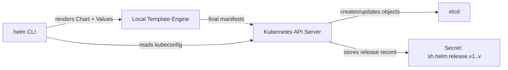
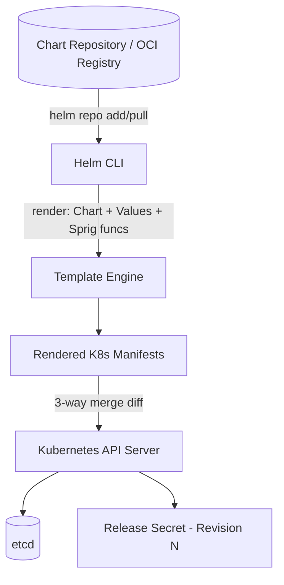
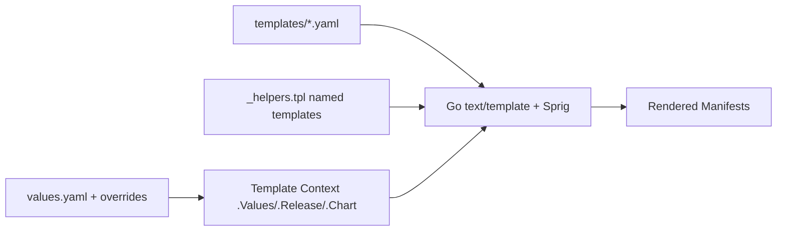
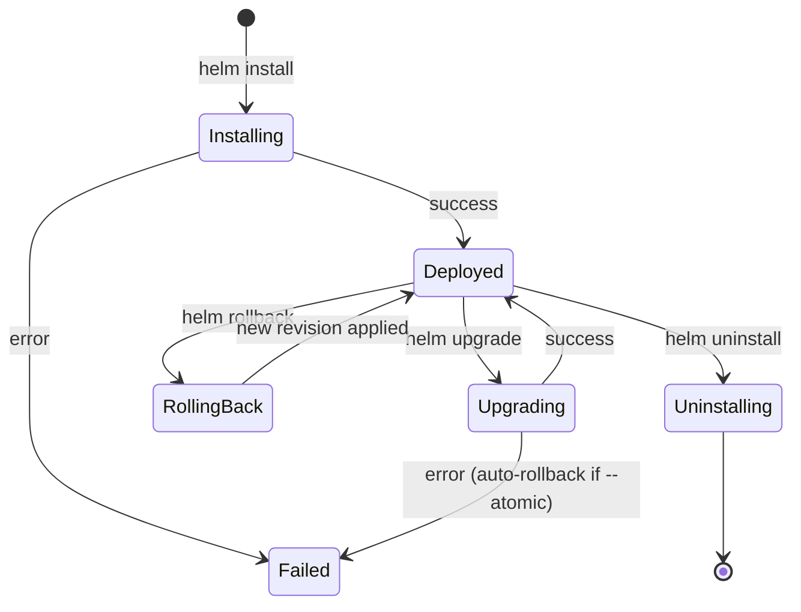
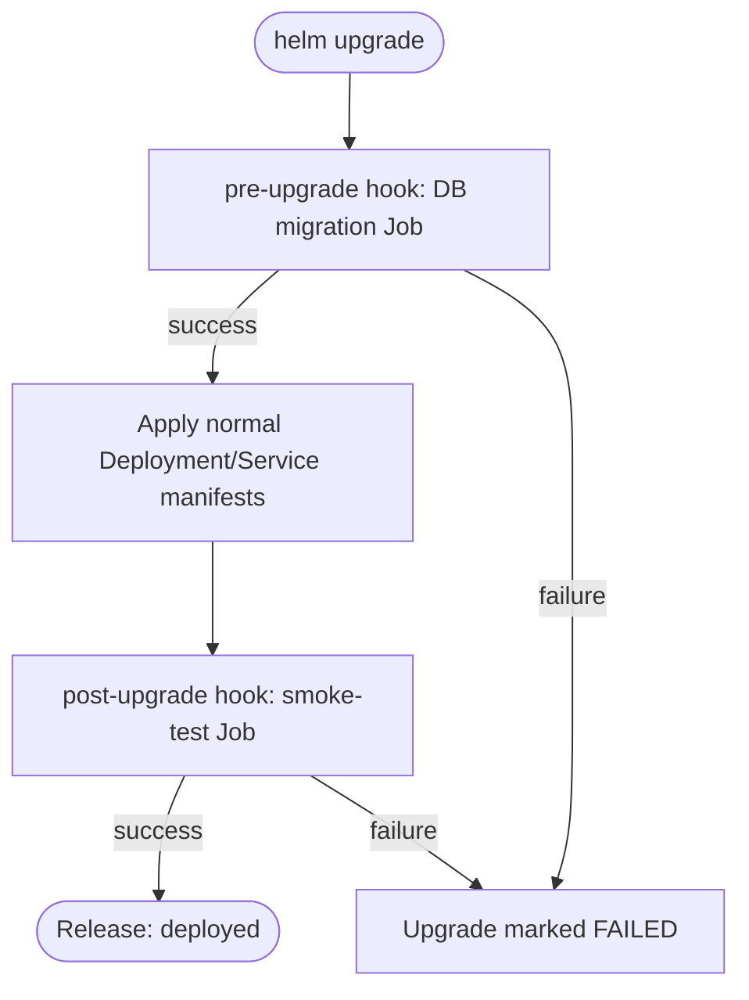
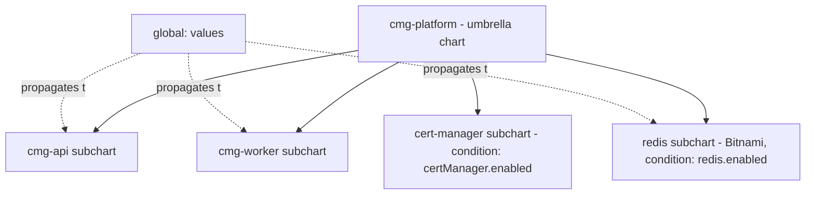
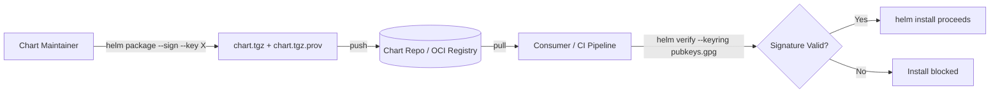
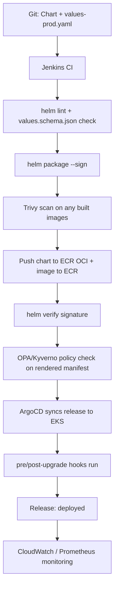
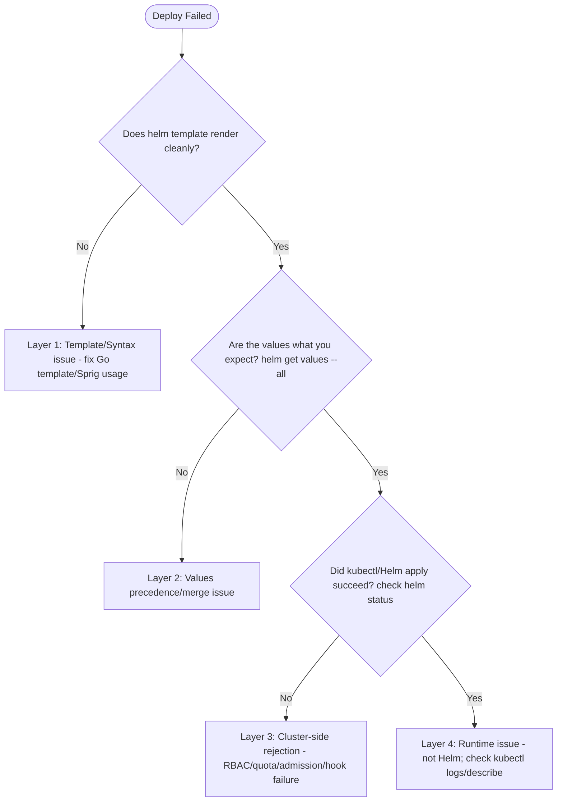

# Helm Handbook — 2026-07 (v1)

**Scope:** Foundational edition. Covers Helm fundamentals through production-grade release management, hooks, dependencies, security, and interview prep.
**Versioning:** This file is READ-ONLY once complete. Future editions (e.g. `Helm-Handbook-2026-08-v2.md`) build on top of this without repeating fully-covered topics.
**Reference project:** All production examples use the CMG (UK Government) EKS pipeline as the canonical running example, alongside the existing Jenkins/Docker/Terraform/ArgoCD toolchain.

---

## Table of Contents
1. What is Helm & Why It's Used
2. Helm Architecture
3. Charts and Templates
4. Values Files
5. Release Management
6. Hooks and Lifecycle
7. Dependencies and Subcharts
8. Security and Signing
9. Best Practices for Production
10. Troubleshooting & RCA
11. Interview Questions & Scenarios

---

# Topic 1: What is Helm & Why It's Used

## Introduction

**What is it?**
- Helm is the package manager for Kubernetes — think `apt`/`yum`/`npm` but for K8s manifests.
- A **Chart** is a Helm package: a bundle of templated YAML manifests + metadata + default config.
- Helm compiles charts + values into final Kubernetes manifests, then applies them as a tracked **Release**.

**Why is it needed?**
- Raw `kubectl apply -f` doesn't scale: no templating, no versioning, no rollback, no dependency management.
- Helm gives you: templating (loops/conditionals/variables), release history, atomic rollback, packaging/distribution, dependency graphs (subcharts).
- Without Helm, CMG's EKS deployments would need hand-maintained YAML per environment (dev/staging/prod) — huge duplication and drift risk.

**When should it be used?**
- Any app with more than one environment or more than a handful of manifests.
- When you need repeatable, versioned, rollback-capable deployments.
- When distributing a reusable K8s package (e.g. an internal platform team publishing a "standard microservice" chart).
- Not strictly needed for a single static Job/CronJob with no variation — plain YAML or Kustomize may suffice there.

---

## Internal Working

- Helm CLI (v3) is a **client-only** tool — no in-cluster "Tiller" component (that was Helm v2; removed in v3 for security).
- Helm talks directly to the **Kubernetes API server** using the same kubeconfig as `kubectl`.
- Release state (manifests + values used) is stored as a **Secret** (default) or ConfigMap in the target namespace, one object per revision.
- Flow: `helm install` → render templates locally → validate against schema → diff against live cluster state → apply via K8s API → store release record.

---

## Architecture

**Mermaid — Helm v3 request flow:**


**ASCII — Chart to Release pipeline:**
```
+-------------+     +----------------+     +------------------+     +-----------+
|  Chart.yaml | --> | templates/*.yaml| --> | Rendered Manifests| --> | K8s API    |
|  values.yaml|     | (Go templating) |     | (final YAML)      |     | (applied)  |
+-------------+     +----------------+     +------------------+     +-----------+
                                                                          |
                                                                          v
                                                                 +-----------------+
                                                                 | Release Secret  |
                                                                 | (revision hist.)|
                                                                 +-----------------+
```

---

## YAML / Code Examples

**Basic — Chart.yaml (minimal):**
```yaml
apiVersion: v2
name: hello-world
version: 0.1.0
```
- `apiVersion: v2` → Helm 3 chart spec (v1 = Helm 2, deprecated).
- `name` → chart identity, used in release naming conventions.
- `version` → chart version (SemVer), NOT app version.

**Intermediate — Chart.yaml with app metadata:**
```yaml
apiVersion: v2
name: cmg-api
description: CMG backend API service chart
type: application
version: 1.2.0
appVersion: "3.4.1"
```
- `type: application` (default) vs `library` (shared template snippets only, not deployable).
- `appVersion` → version of the actual container image/app, decoupled from chart version.

**Production — Chart.yaml with dependencies + maintainers:**
```yaml
apiVersion: v2
name: cmg-api
description: CMG backend API — production chart
type: application
version: 4.0.3
appVersion: "3.4.1"
kubeVersion: ">=1.27.0-0"
maintainers:
  - name: Suraj
    email: devops@cmg.gov.uk
dependencies:
  - name: redis
    version: "18.x.x"
    repository: "https://charts.bitnami.com/bitnami"
    condition: redis.enabled
```
- `kubeVersion` → guards against deploying to incompatible EKS control-plane versions.
- `dependencies` → declares subcharts (see Topic 7), `condition` toggles it via values.

**Enterprise — multi-chart umbrella pattern:**
```yaml
apiVersion: v2
name: cmg-platform
version: 2.5.0
type: application
dependencies:
  - name: cmg-api
    version: "4.0.x"
    repository: "file://../cmg-api"
  - name: cmg-worker
    version: "2.1.x"
    repository: "file://../cmg-worker"
  - name: redis
    version: "18.x.x"
    repository: "https://charts.bitnami.com/bitnami"
    condition: redis.enabled
  - name: cert-manager
    version: "1.14.x"
    repository: "https://charts.jetstack.io"
    condition: certManager.enabled
```
- Umbrella chart pattern: one top-level chart deploys the whole platform (API + worker + Redis + cert-manager) as a single release — used at CMG for full-environment spin-up.

---

## Commands

```bash
# CLI
helm version                     # client version (v3, no server component)
helm create mychart              # scaffold new chart
helm search repo bitnami/redis   # search added repos
helm search hub wordpress        # search Artifact Hub

# Verification
helm lint ./mychart               # validate chart structure/syntax
helm template ./mychart           # render locally without installing

# Cleanup
rm -rf mychart/                   # remove scaffolded chart locally

# Debugging
helm template ./mychart --debug   # verbose render output with errors
```

---

## Production Usage

- **Enterprise example:** CMG uses an umbrella chart (`cmg-platform`) so a single `helm upgrade --install` spins up API, worker, Redis, and cert-manager consistently across dev/staging/prod.
- **Production architecture:** GitOps-driven — Helm charts live in Git, ArgoCD (already in your stack) syncs releases automatically rather than engineers running `helm install` by hand.
- **Best practices:** pin chart versions in `Chart.yaml` dependencies (avoid floating `*`), use `--atomic` for auto-rollback on failed upgrades, keep one chart per deployable unit.
- **Performance tuning:** avoid excessively deep subchart nesting (>3 levels) — it slows `helm template` rendering and complicates debugging.
- **High Availability:** Helm itself has no HA concerns (it's client-side); HA is a property of the rendered manifests (replica counts, PodDisruptionBudgets, anti-affinity) — Helm just delivers them consistently.

---

## Security

- Helm v3 removed Tiller specifically because Tiller ran with cluster-admin-like privileges in-cluster — a major CVE surface in v2.
- Since Helm v3 uses your own kubeconfig/RBAC, **least-privilege IAM/RBAC on the deploying identity** (e.g. Jenkins service account) is the actual security boundary.
- Never commit `values-prod.yaml` with plaintext secrets — use Sealed Secrets, External Secrets Operator, or SOPS instead.
- Verify chart provenance (see Topic 8 — Security and Signing) before installing third-party charts from public repos.

---

## Monitoring

- **Metrics:** Helm itself emits no Prometheus metrics — monitor the *rendered workloads* (Deployment/Pod metrics via kube-state-metrics).
- **Logs:** `helm` CLI output only; no persistent Helm-specific logs — release history in the Secret is the audit trail.
- **Alerts:** Alert on failed `helm upgrade` exit codes in CI/CD (Jenkins post-build step), not via cluster-side monitoring.
- **Dashboards:** Track release revision count per app in Grafana via a custom exporter reading release Secrets, if release sprawl needs visibility.

---

## Troubleshooting

| Error | Root Cause | Fix |
|---|---|---|
| `Error: INSTALLATION FAILED: cannot re-use a name that is still in use` | Release name collision | `helm list -A`, use `--replace` cautiously or pick new name |
| `Error: UPGRADE FAILED: another operation (install/upgrade/rollback) is in progress` | Stuck release lock | `helm rollback` or delete the stuck Secret revision after investigation |
| `Error: unable to build kubernetes objects from release manifest` | Invalid rendered YAML (bad indentation/type) | `helm template` locally to catch before install |
| Chart installs but pods CrashLoop | Chart succeeded; app-level issue | Not a Helm problem — check `kubectl logs`, app config |

**RCA steps:**
1. Reproduce with `helm template` locally — isolates rendering vs cluster issues.
2. Check `helm history <release>` for prior successful revision to diff against.
3. Check `helm get manifest <release>` to see exactly what was applied last.

**Verification:** `helm status <release>` confirms deployed state and revision.
**Recovery:** `helm rollback <release> <revision>` reverts to last-known-good.

---

## FAQs

- **Q: Is Helm required for Kubernetes?** No — `kubectl`/Kustomize work without it, but Helm adds templating + release tracking.
- **Q: Does Helm v3 need Tiller?** No, removed entirely; Helm v3 is client-only.
- **Q: Can Helm manage non-K8s resources?** No, strictly Kubernetes API objects.

---

## Comparison Tables

| Tool | Templating | Release Tracking | Server Component | Rollback |
|---|---|---|---|---|
| Plain `kubectl apply` | ❌ | ❌ | ❌ | Manual |
| Kustomize | Overlay-based (no logic) | ❌ | ❌ | Manual (git revert) |
| Helm v3 | Go templates + Sprig functions | ✅ (Secrets) | ❌ | ✅ `helm rollback` |
| Helm v2 (legacy) | ✅ | ✅ | ✅ Tiller (deprecated/insecure) | ✅ |

---

## Cheat Sheet

```bash
helm create <name>            # scaffold chart
helm lint <chart>              # validate
helm template <chart>          # render only
helm install <rel> <chart>     # install
helm upgrade <rel> <chart>     # upgrade
helm rollback <rel> <rev>       # rollback
helm history <rel>              # revision list
helm uninstall <rel>            # remove release
```

---

## Revision Notes

- Helm = K8s package manager; Chart = package; Release = deployed instance.
- Helm v3: no Tiller, client-side only, uses your kubeconfig/RBAC directly.
- Release state stored as a Secret per revision — this is the source of truth for `helm history`/`rollback`.
- Use Helm when you have multiple environments or need templating + rollback; plain YAML/Kustomize may suffice for trivial single-object cases.

---

# Topic 2: Helm Architecture

## Introduction

**What is it?**
- The set of components and concepts that make up Helm's runtime model: CLI, Chart, Repository, Release, Revision, and the local template engine.

**Why is it needed?**
- Understanding the architecture is what lets you debug *where* a failure happened — client-side rendering vs API-server admission vs in-cluster reconciliation.

**When should it be used?**
- Reference this whenever diagnosing "why didn't my values change take effect" or designing multi-team chart repository structures.

---

## Internal Working

- **Chart Repository:** an HTTP server (or OCI registry) hosting an `index.yaml` + packaged `.tgz` charts. `helm repo add/update` fetches this index.
- **Local rendering:** `helm` reads `Chart.yaml`, `values.yaml`, `templates/*`, and merges values (CLI `--set` > `-f custom.yaml` > `values.yaml` defaults) using Go's `text/template` + Sprig function library.
- **Release object:** after successful apply, Helm serializes the rendered manifest + values into a Secret named `sh.helm.release.v1.<release-name>.v<revision>`, gzip+base64 encoded.
- **3-way merge (Helm 3):** on `upgrade`, Helm diffs (a) last applied manifest, (b) newly rendered manifest, (c) live cluster state — this is why Helm can detect and reconcile out-of-band `kubectl edit` drift better than Helm v2 did.

---

## Architecture

**Mermaid — component view:**


**ASCII — values precedence stack:**
```
Highest priority
  --set key=value        (CLI inline overrides)
  -f values-prod.yaml     (explicit values file)
  values.yaml              (chart defaults)
Lowest priority
```

---

## YAML / Code Examples

**Basic — repo add + install:**
```bash
helm repo add bitnami https://charts.bitnami.com/bitnami
helm repo update
helm install my-redis bitnami/redis
```

**Intermediate — OCI-based chart repo (modern registries):**
```bash
helm registry login registry.cmg.internal
helm pull oci://registry.cmg.internal/charts/cmg-api --version 4.0.3
helm install cmg-api oci://registry.cmg.internal/charts/cmg-api --version 4.0.3
```
- OCI registries (ECR supports this) are replacing classic HTTP chart repos — CMG can host charts in the same ECR used for container images.

**Production — private ECR-based OCI chart repository:**
```bash
aws ecr get-login-password --region eu-west-2 | helm registry login \
  --username AWS --password-stdin 123456789012.dkr.ecr.eu-west-2.amazonaws.com

helm package ./cmg-api --version 4.0.3
helm push cmg-api-4.0.3.tgz oci://123456789012.dkr.ecr.eu-west-2.amazonaws.com/charts
```
- Reuses the same AWS ECR already in your toolchain — no separate chart-hosting infra needed.

**Enterprise — multi-team repo index with signed charts:**
```yaml
# index.yaml (auto-generated by `helm repo index`)
apiVersion: v1
entries:
  cmg-api:
    - apiVersion: v2
      created: "2026-07-15T10:00:00Z"
      digest: sha256:abc123...
      name: cmg-api
      urls:
        - https://charts.cmg.internal/cmg-api-4.0.3.tgz
      version: 4.0.3
```
- `digest` enables integrity verification; combine with `helm verify` (Topic 8) for provenance.

---

## Commands

```bash
# CLI
helm repo add <name> <url>
helm repo list
helm repo update

# Verification
helm show values bitnami/redis      # inspect default values before install
helm show chart bitnami/redis       # inspect Chart.yaml metadata

# Cleanup
helm repo remove <name>

# Debugging
helm get values <release> --all     # see effective merged values for a live release
helm get manifest <release>         # see exact applied manifest for current revision
```

---

## Production Usage

- **Enterprise example:** CMG hosts internal charts in ECR (OCI) rather than standing up a separate Chart Museum/HTTP repo — one less service to secure and patch.
- **Production architecture:** repo access is scoped via IAM (same ECR IAM policies you already manage for images), not a separate auth system.
- **Best practices:** always `helm repo update` before install/upgrade in CI to avoid stale index caches; pin exact chart versions in CI, never `--version *`.
- **Performance tuning:** cache `~/.cache/helm/repository` in Jenkins agents to avoid re-downloading indexes on every pipeline run.
- **High Availability:** OCI registries (ECR) are inherently HA/multi-AZ — no extra work needed vs self-hosted Chart Museum.

---

## Security

- Treat chart repositories like package registries — supply-chain risk applies (malicious/typosquatted charts).
- Restrict `helm repo add` to an approved allowlist in CI; don't let pipelines pull from arbitrary public repos.
- Use OCI + IAM (ECR) so the same least-privilege model already governing your container images governs your charts.

---

## Monitoring

- **Metrics:** track ECR pull counts/errors for chart artifacts same as you would for images.
- **Logs:** CloudWatch logs for ECR access already capture chart pull/push activity if using ECR OCI.
- **Alerts:** alert on failed `helm repo update` / registry login in Jenkins pipeline steps.
- **Dashboards:** reuse existing ECR dashboards — chart artifacts show up as additional repository entries.

---

## Troubleshooting

| Error | Root Cause | Fix |
|---|---|---|
| `Error: looks like "https://..." is not a valid chart repository or cannot be reached` | Repo URL wrong/unreachable/network policy | Verify URL, check egress/firewall, `curl <url>/index.yaml` |
| `Error: failed to authenticate to registry` (OCI) | Expired ECR token | Re-run `aws ecr get-login-password \| helm registry login` |
| `helm show values` returns nothing useful | Chart not indexed yet after push | Run `helm repo update` or re-pull OCI ref |

**RCA steps:** confirm whether issue is repo-level (index/auth) vs chart-level (render) vs cluster-level (apply) by testing each stage in isolation (`helm pull` → `helm template` → `helm install`).
**Verification:** `helm show chart <repo>/<chart>` confirms repo connectivity + chart metadata.
**Recovery:** re-authenticate to registry or fall back to a cached local `.tgz` if repo is temporarily down.

---

## FAQs

- **Q: Do I need Chart Museum?** No — OCI registries (ECR, Docker Hub, Harbor) are the modern standard and reuse existing container registry infra.
- **Q: Where does Helm store release history?** In-cluster, as Secrets in the release's namespace — not in the chart repo.
- **Q: Can two teams share one chart repo?** Yes, with proper namespacing/access control via IAM on the OCI registry.

---

## Comparison Tables

| Repo Type | Auth Model | Infra Overhead | CMG Fit |
|---|---|---|---|
| HTTP Chart Museum | Basic auth/token | Separate service to run/patch | ❌ extra infra |
| OCI (ECR) | IAM | Reuses existing ECR | ✅ recommended |
| Artifact Hub (public) | None (public) | N/A | Only for pulling 3rd-party charts |

---

## Cheat Sheet

```bash
helm repo add <name> <url>
helm repo update
helm show values <repo>/<chart>
helm show chart <repo>/<chart>
helm pull oci://<registry>/<chart> --version <v>
helm push <chart>.tgz oci://<registry>
```

---

## Revision Notes

- Values precedence: `--set` > `-f file.yaml` > chart `values.yaml` defaults.
- Helm 3 does a 3-way merge on upgrade — detects drift better than v2.
- Prefer OCI (ECR) chart repos over separate Chart Museum infra for CMG.
- Release history lives in-cluster as Secrets, independent of the chart repo.

---

# Topic 3: Charts and Templates

## Introduction

**What is it?**
- The Chart is the directory structure (`Chart.yaml`, `values.yaml`, `templates/`, `charts/`) and templates are the Go-templated YAML files inside `templates/` that get rendered into final manifests.

**Why is it needed?**
- Templates let one chart produce different manifests per environment (dev/staging/prod) without maintaining separate YAML files.

**When should it be used?**
- Any time you have more than one deployment target for the same application — CMG's dev/staging/prod EKS namespaces are the textbook case.

---

## Internal Working

- Helm's template engine is Go's `text/template`, extended with the **Sprig** function library (string/math/date/list helpers) plus Helm-specific functions (`include`, `tpl`, `required`, `lookup`).
- Rendering order: Helm loads `values.yaml` → merges overrides → walks `templates/*.yaml` → executes each as a Go template with the merged values as context (`.Values`) → concatenates output separated by `---`.
- `_helpers.tpl` files (prefixed `_`) are NOT rendered as standalone manifests — they define reusable named templates via `{{ define "name" }}`.
- `{{- ... -}}` whitespace control trims newlines/whitespace around actions to keep rendered YAML valid.

---

## Architecture

**Mermaid — template rendering flow:**


**ASCII — chart directory layout:**
```
cmg-api/
├── Chart.yaml
├── values.yaml
├── values-prod.yaml
├── charts/                 (subcharts, see Topic 7)
├── templates/
│   ├── deployment.yaml
│   ├── service.yaml
│   ├── ingress.yaml
│   ├── _helpers.tpl
│   └── NOTES.txt           (post-install message)
└── .helmignore
```

---

## YAML / Code Examples

**Basic — templates/service.yaml:**
```yaml
apiVersion: v1
kind: Service
metadata:
  name: {{ .Chart.Name }}
spec:
  ports:
    - port: {{ .Values.service.port }}
```
- `.Chart.Name` → built-in object from `Chart.yaml`.
- `.Values.service.port` → pulled from `values.yaml`.

**Intermediate — deployment.yaml with conditionals/loops:**
```yaml
apiVersion: apps/v1
kind: Deployment
metadata:
  name: {{ .Release.Name }}-{{ .Chart.Name }}
spec:
  replicas: {{ .Values.replicaCount | default 1 }}
  template:
    spec:
      containers:
        - name: {{ .Chart.Name }}
          image: "{{ .Values.image.repository }}:{{ .Values.image.tag }}"
          {{- if .Values.resources }}
          resources:
            {{- toYaml .Values.resources | nindent 12 }}
          {{- end }}
          env:
            {{- range .Values.env }}
            - name: {{ .name }}
              value: {{ .value | quote }}
            {{- end }}
```
- `.Release.Name` → built-in object (the release name, e.g. `cmg-api-prod`).
- `| default 1` → Sprig pipe function, fallback if value unset.
- `{{- if .Values.resources }}` → conditional block; `-` trims leading whitespace.
- `toYaml ... | nindent 12` → converts a map to YAML and indents correctly (common pattern for arbitrary blocks like `resources`).
- `{{- range .Values.env }}` → loop over a list.

**Production — _helpers.tpl + full labels pattern:**
```yaml
{{/* templates/_helpers.tpl */}}
{{- define "cmg-api.labels" -}}
app.kubernetes.io/name: {{ .Chart.Name }}
app.kubernetes.io/instance: {{ .Release.Name }}
app.kubernetes.io/version: {{ .Chart.AppVersion | quote }}
app.kubernetes.io/managed-by: {{ .Release.Service }}
{{- end }}
```
```yaml
# templates/deployment.yaml (excerpt)
metadata:
  labels:
    {{- include "cmg-api.labels" . | nindent 4 }}
```
- `{{- define ... -}}` creates a reusable named template.
- `{{- include "cmg-api.labels" . | nindent 4 }}` calls it, passing current context (`.`), and indents the output — standard pattern across every production chart.

**Enterprise — schema validation with values.schema.json:**
```json
{
  "$schema": "http://json-schema.org/draft-07/schema#",
  "type": "object",
  "required": ["image", "replicaCount"],
  "properties": {
    "replicaCount": { "type": "integer", "minimum": 1 },
    "image": {
      "type": "object",
      "required": ["repository", "tag"],
      "properties": {
        "repository": { "type": "string" },
        "tag": { "type": "string" }
      }
    }
  }
}
```
- Helm auto-validates `values.yaml` against `values.schema.json` at install/upgrade time — fails fast with clear errors instead of a bad render reaching the cluster.
- CMG uses this to enforce that every environment values file sets `replicaCount >= 1` before deployment.

---

## Commands

```bash
# CLI
helm create cmg-api                        # scaffold chart structure

# Verification
helm template cmg-api ./cmg-api -f values-prod.yaml   # render with prod values
helm template cmg-api ./cmg-api --set replicaCount=3   # override inline
helm lint ./cmg-api                                     # syntax + best-practice checks

# Cleanup
helm template ... > /tmp/rendered.yaml && rm /tmp/rendered.yaml  # scratch render cleanup

# Debugging
helm template ./cmg-api --debug --show-only templates/deployment.yaml  # render just one file, verbose
```

---

## Production Usage

- **Enterprise example:** CMG's `cmg-api` chart uses `_helpers.tpl` for labels/selectors so every resource (Deployment, Service, Ingress, HPA) stays consistent and DRY.
- **Production architecture:** `values.schema.json` gate ensures a bad `values-prod.yaml` edit fails `helm lint`/CI before ever reaching EKS.
- **Best practices:** never hardcode environment-specific values inside `templates/` — always pull from `.Values`; keep templates logic-light, push complex logic into `_helpers.tpl`.
- **Performance tuning:** avoid excessive `range`/nested loops over huge lists in templates — rendering time grows with template complexity across many resources.
- **High Availability:** template `replicaCount`, `podAntiAffinity`, and `topologySpreadConstraints` as configurable values so prod HA settings differ from dev without duplicating templates.

---

## Security

- Use `required "message"` function to fail fast on missing sensitive values rather than rendering an empty/insecure default (e.g. `{{ required "image.tag is required" .Values.image.tag }}`).
- Never template raw secret values directly into ConfigMaps — use `Secret` manifests with values sourced from a secrets manager, not committed `values.yaml`.
- `.helmignore` should exclude local secret/test files from being packaged into the distributed `.tgz`.

---

## Monitoring

- **Metrics:** N/A directly to templating; monitor the resulting Deployment/Pod metrics.
- **Logs:** `helm template --debug` output is the primary "log" for template rendering issues.
- **Alerts:** alert in CI if `helm lint` or schema validation fails on a merge to main.
- **Dashboards:** N/A — this is a build-time concern, not a runtime one.

---

## Troubleshooting

| Error | Root Cause | Fix |
|---|---|---|
| `function "toYaml" not defined` | Typo or unsupported Sprig function name | Check Sprig docs for exact function name/case |
| `error calling include: template: no template "X" associated with template "gotpl"` | Named template not defined/wrong name in `_helpers.tpl` | Confirm `{{- define "X" -}}` name matches `include "X"` call exactly |
| YAML parse error after render | Missing `nindent`/incorrect whitespace control | Add `{{-`/`-}}` trims, verify with `helm template --debug` |
| Values not applying as expected | Precedence order misunderstood | Check `helm get values <release> --all` for effective merged values |

**RCA steps:** isolate with `--show-only templates/<file>.yaml` to render a single file; bisect by commenting out blocks.
**Verification:** `helm template` output should be valid YAML — pipe through `kubectl apply --dry-run=client -f -` to double-check.
**Recovery:** fix template, re-render, re-lint before any `helm upgrade`.

---

## FAQs

- **Q: What's the difference between `.Values` and `.Release`?** `.Values` = user-supplied config; `.Release` = built-in metadata about the current install (name, namespace, revision, service).
- **Q: Can templates reference other templates?** Yes, via `include`/`template` and named definitions in `_helpers.tpl`.
- **Q: What is NOTES.txt?** A templated file printed to the user after install/upgrade (e.g. "Run `kubectl get svc` to find your app").

---

## Comparison Tables

| Function | Purpose | Example |
|---|---|---|
| `default` | Fallback value | `{{ .Values.port \| default 8080 }}` |
| `required` | Fail if missing | `{{ required "msg" .Values.x }}` |
| `include` | Call named template, capture as string | `{{ include "name" . }}` |
| `toYaml` | Convert map/list to YAML string | `{{ toYaml .Values.resources }}` |
| `nindent` | Indent + newline prefix | `{{ ... \| nindent 4 }}` |

---

## Cheat Sheet

```bash
helm create <chart>
helm template <chart> [-f values.yaml] [--set k=v]
helm lint <chart>
helm template --show-only templates/<file>.yaml <chart>
```
Key built-ins: `.Values`, `.Release.Name`, `.Chart.Name`, `.Chart.AppVersion`, `.Files`, `.Capabilities`.

---

## Revision Notes

- Templates = Go `text/template` + Sprig; rendered top-to-bottom, joined by `---`.
- `_helpers.tpl` holds reusable named templates (not standalone manifests).
- `values.schema.json` gives fail-fast validation before render even happens.
- Always verify with `helm template`/`helm lint` before `helm upgrade` in production.

---

# Topic 4: Values Files

## Introduction

**What is it?**
- The mechanism for supplying configuration data into charts — `values.yaml` (defaults) plus optional override files (`values-prod.yaml`, `values-staging.yaml`) and CLI `--set` flags.

**Why is it needed?**
- Separates "what the app looks like" (templates) from "how this specific environment is configured" (values) — the entire reason one chart can serve dev/staging/prod.

**When should it be used?**
- Always — even a single-environment chart should externalize config like image tag, replica count, and resource limits into values rather than hardcoding in templates.

---

## Internal Working

- Helm merges values as a deep merge (not full replace) across the precedence stack: `values.yaml` (base) ← `-f` files (in the order given, later overrides earlier) ← `--set`/`--set-string`/`--set-file` (highest precedence).
- Deep merge means nested maps combine key-by-key; only the specific overridden keys change, sibling keys are preserved.
- `--set` uses a dotted-path + comma syntax parsed into the same map structure (e.g. `--set a.b=1,a.c=2`).

---

## Architecture

**ASCII — merge resolution for CMG's cmg-api:**
```
values.yaml (defaults)
   replicaCount: 1
   resources: { limits: { cpu: 250m } }
        ↓ merged with
values-prod.yaml
   replicaCount: 6
        ↓ merged with
--set image.tag=3.4.1  (from Jenkins pipeline, dynamic build tag)
        ↓ = EFFECTIVE VALUES
   replicaCount: 6
   resources: { limits: { cpu: 250m } }   <- untouched, inherited from base
   image: { tag: 3.4.1 }
```

---

## YAML / Code Examples

**Basic — values.yaml:**
```yaml
replicaCount: 1
image:
  repository: 123456789012.dkr.ecr.eu-west-2.amazonaws.com/cmg-api
  tag: latest
service:
  port: 8080
```

**Intermediate — values-staging.yaml override (partial):**
```yaml
replicaCount: 2
resources:
  limits:
    cpu: 500m
    memory: 512Mi
```
- Only `replicaCount` and `resources` are overridden; `image`/`service` fall back to `values.yaml` defaults via deep merge.

**Production — values-prod.yaml with environment-specific everything:**
```yaml
replicaCount: 6
image:
  tag: ""   # intentionally blank — injected via --set from Jenkins build number
resources:
  requests: { cpu: 500m, memory: 512Mi }
  limits:   { cpu: "1",  memory: 1Gi }
autoscaling:
  enabled: true
  minReplicas: 6
  maxReplicas: 20
  targetCPUUtilizationPercentage: 70
ingress:
  enabled: true
  host: api.cmg.gov.uk
  tls: true
podDisruptionBudget:
  minAvailable: 3
```
- Jenkins pipeline supplies the build-specific `image.tag` at deploy time: `--set image.tag=$BUILD_NUMBER`, keeping the values file itself static and reviewable in Git.

**Enterprise — layered values with global section for umbrella chart:**
```yaml
# umbrella chart's values.yaml
global:
  imageRegistry: 123456789012.dkr.ecr.eu-west-2.amazonaws.com
  environment: production

cmg-api:
  replicaCount: 6

cmg-worker:
  replicaCount: 3

redis:
  enabled: true
  auth:
    enabled: true
```
- `global:` values are automatically passed down to every subchart (accessible as `.Values.global.X` inside `cmg-api`/`cmg-worker`/`redis` templates) — used at CMG so all subcharts share the same registry/environment settings without repeating them per-subchart.

---

## Commands

```bash
# CLI
helm install cmg-api ./cmg-api -f values-prod.yaml --set image.tag=3.4.1

# Verification
helm get values cmg-api                 # values explicitly set at install/upgrade time
helm get values cmg-api --all            # full effective merged values (incl. chart defaults)

# Cleanup
helm upgrade cmg-api ./cmg-api --reset-values -f values.yaml  # discard prior --set overrides

# Debugging
helm template ./cmg-api -f values-prod.yaml --set image.tag=test --debug
```

---

## Production Usage

- **Enterprise example:** CMG keeps `values.yaml` as safe generic defaults, `values-<env>.yaml` per environment committed to Git, and injects only the build-specific `image.tag` via Jenkins `--set` at deploy time.
- **Production architecture:** environment values files live alongside the chart in the same Git repo, reviewed via PR — no config drift between "what's in Git" and "what's deployed" (ArgoCD then enforces this further).
- **Best practices:** never put secrets directly in any values file, even per-environment ones — reference External Secrets Operator or SOPS-encrypted values instead.
- **Performance tuning:** avoid deeply nested `--set` chains in CI scripts — prefer a generated `--set-file`/temp values file for large dynamic value sets (more reliable parsing).
- **High Availability:** values like `minReplicas`/`podDisruptionBudget.minAvailable` should differ meaningfully between environments — dev doesn't need HA, prod does.

---

## Security

- Use `--set-file` or a secrets manager integration rather than plaintext secrets in any values file, even ones marked "prod" and access-controlled.
- Audit who can modify `values-prod.yaml` via Git branch protection — this file controls production topology and scaling.
- Beware `--set` values appearing in shell history/CI logs — mask sensitive `--set` values in Jenkins console output.

---

## Monitoring

- **Metrics:** N/A directly; monitor result of scaling values (replicaCount/HPA) via standard K8s metrics.
- **Logs:** `helm get values <release> --all` audit-style check can be scripted into periodic CI compliance checks.
- **Alerts:** alert if `helm get values` in prod diverges from what's committed in Git (drift detection) — ArgoCD does this natively.
- **Dashboards:** N/A — this is config-management, tracked via Git history, not a live dashboard concern.

---

## Troubleshooting

| Error | Root Cause | Fix |
|---|---|---|
| Override value not taking effect | Wrong precedence order, or file path typo in `-f` | Verify with `helm get values --all`; check `-f` file actually exists/loaded |
| `--set` value parsed as string instead of int/bool | Missing quoting rules understanding | Use `--set-string` for forced strings, plain `--set` auto-types ints/bools |
| Nested list gets fully replaced instead of merged | Helm merges maps deeply but **replaces lists wholesale**, not element-wise | Restructure as a map keyed by name instead of a list, if merge-by-key is needed |
| Stale values persist after removing a `--set` on later upgrade | Previous `--set` values persist unless `--reset-values` used | Use `--reset-values` (Helm 3.14+) or explicitly pass full values file each time |

**RCA steps:** always check `helm get values <release> --all` first — it shows the actual effective config, removing guesswork.
**Verification:** diff `helm get values --all` output against your intended environment file to catch precedence surprises.
**Recovery:** `helm upgrade --reset-values` to fully reset to just the chart defaults + newly supplied files, discarding any historically accumulated `--set` overrides.

---

## FAQs

- **Q: Do lists merge or replace across values files?** They replace wholesale — Helm's deep merge only applies to maps, not arrays.
- **Q: What does `global:` do?** Values under `global` are automatically visible to all subcharts, useful for shared settings like registry or environment name.
- **Q: Is `--set` remembered on future `helm upgrade` calls?** Yes, until explicitly reset — this is a common gotcha.

---

## Comparison Tables

| Method | Precedence | Best For |
|---|---|---|
| `values.yaml` | Lowest | Safe chart-wide defaults |
| `-f values-<env>.yaml` | Medium | Environment-specific, Git-reviewed config |
| `--set` | Highest | Dynamic, build-time-only values (e.g. image tag) |

---

## Cheat Sheet

```bash
helm install <rel> <chart> -f values-prod.yaml --set image.tag=$TAG
helm get values <rel> --all
helm upgrade <rel> <chart> --reset-values -f values.yaml
```

---

## Revision Notes

- Precedence: `values.yaml` < `-f` files (in order) < `--set`.
- Maps deep-merge; lists replace wholesale — a common source of confusion.
- `global:` section propagates to all subcharts automatically.
- `helm get values --all` is the fastest way to debug "why isn't my override applying."

---

# Topic 5: Release Management

## Introduction

**What is it?**
- The lifecycle operations Helm provides around a deployed chart instance (a "Release"): install, upgrade, rollback, uninstall, and revision history tracking.

**Why is it needed?**
- Kubernetes has no native concept of "a versioned deployment of a bundle of resources with rollback" — Helm's Release model provides exactly that on top of raw manifests.

**When should it be used?**
- Every time you deploy/update/remove a chart — this is the core day-2 operational surface of Helm.

---

## Internal Working

- Each `helm install`/`upgrade` creates a new **revision** (incrementing integer), stored as its own Secret (`sh.helm.release.v1.<name>.v<N>`).
- `helm upgrade` performs: render new manifests → 3-way diff (last-applied vs new vs live) → apply changes → on success, write new revision Secret; on failure (with `--atomic`), auto-rollback to prior revision.
- `helm rollback <release> <revision>` doesn't "undo" — it re-applies the manifest from the target historical revision as a **new** revision (so history always moves forward, e.g. rollback from v5 to v3 creates v6 with v3's content).
- By default Helm keeps unlimited revision history unless `--history-max` is set, which can bloat the namespace with many Secrets over time.

---

## Architecture

**Mermaid — release lifecycle state machine:**


**ASCII — revision history for cmg-api release:**
```
Revision  Status      Description
   1      superseded  Install complete
   2      superseded  Upgrade complete (image v3.2.0)
   3      superseded  Upgrade complete (image v3.3.0)
   4      failed      Upgrade "cmg-api" failed: timed out waiting for condition
   5      deployed    Rollback to 3   <- current live state
```

---

## YAML / Code Examples

**Basic — install:**
```bash
helm install cmg-api ./cmg-api
```

**Intermediate — upgrade with install fallback (idempotent CI pattern):**
```bash
helm upgrade --install cmg-api ./cmg-api -f values-staging.yaml
```
- `--install` makes the command safe to run whether the release exists yet or not — the standard Jenkins pipeline pattern (no separate "first deploy" branch needed).

**Production — atomic upgrade with wait + timeout (Jenkins-safe):**
```bash
helm upgrade --install cmg-api ./cmg-api \
  -f values-prod.yaml \
  --set image.tag=${BUILD_NUMBER} \
  --atomic \
  --wait \
  --timeout 5m \
  --history-max 10
```
- `--atomic` → auto-rollback on failure, so a bad rollout never leaves prod partially updated.
- `--wait` → blocks until all resources report Ready (Deployments, PVCs, Services with endpoints), giving Jenkins a real pass/fail signal.
- `--timeout 5m` → prevents pipeline from hanging forever on a stuck rollout.
- `--history-max 10` → caps revision Secrets to last 10, avoiding namespace Secret bloat.

**Enterprise — canary-style release naming + blue/green via separate releases:**
```bash
# Deploy a canary release alongside the stable one
helm upgrade --install cmg-api-canary ./cmg-api \
  -f values-prod.yaml \
  --set image.tag=${CANARY_TAG} \
  --set replicaCount=1 \
  --set nameOverride=cmg-api-canary

# After validation, promote by upgrading the main release, then remove canary
helm upgrade --install cmg-api ./cmg-api -f values-prod.yaml --set image.tag=${CANARY_TAG}
helm uninstall cmg-api-canary
```
- Helm itself has no native canary/blue-green primitive — this is achieved by running two parallel *releases* of the same chart and shifting traffic externally (e.g. via Ingress/Service weight, or handing off to Argo Rollouts for true progressive delivery).

---

## Commands

```bash
# CLI
helm install <rel> <chart>
helm upgrade --install <rel> <chart> -f <values>
helm rollback <rel> <revision>
helm uninstall <rel>

# Verification
helm status <rel>
helm history <rel>
helm list -A                       # all releases, all namespaces

# Cleanup
helm uninstall <rel> --keep-history   # remove resources but keep revision Secrets for audit
helm uninstall <rel>                   # full removal incl. history

# Debugging
helm upgrade <rel> <chart> --dry-run --debug   # simulate without applying
```

---

## Production Usage

- **Enterprise example:** CMG's Jenkins pipeline always uses `helm upgrade --install ... --atomic --wait --timeout 5m` — one command handles both first-deploy and every subsequent deploy safely.
- **Production architecture:** ArgoCD (already in your stack) wraps this further — it calls Helm under the hood as a rendering engine but manages the actual sync/rollback via its own reconciliation loop, giving GitOps-style drift correction on top of Helm's release model.
- **Best practices:** always use `--atomic` in production pipelines; always set `--history-max` to bound Secret growth; never run bare `helm install` in CI (use `upgrade --install` for idempotency).
- **Performance tuning:** `--wait` adds pipeline time but is essential for real pass/fail signal — don't skip it to "save time" in prod pipelines.
- **High Availability:** `--atomic` + `--wait` together mean a broken rollout is caught and reverted automatically before it can degrade availability.

---

## Security

- Rollback ability means a compromised or buggy revision can be undone quickly — but audit `helm history` regularly since anyone with cluster/Helm access can rollback to an old (possibly vulnerable) image tag.
- `--history-max` doesn't delete released *resources*, only historical revision Secrets — don't rely on it for secret rotation.
- Restrict who can run `helm rollback`/`uninstall` in prod namespaces via RBAC — these are destructive-capable operations.

---

## Monitoring

- **Metrics:** track `helm upgrade` success/failure rate as a CI/CD pipeline metric (Jenkins build results feed nicely into this).
- **Logs:** Jenkins console output captures `--debug` output for post-mortem; CloudWatch captures underlying pod events during rollout.
- **Alerts:** alert on any `--atomic` triggered rollback (signals a bad release reached prod, even if auto-corrected).
- **Dashboards:** Grafana panel on deployment frequency + rollback frequency per app, sourced from Jenkins build metadata.

---

## Troubleshooting

| Error | Root Cause | Fix |
|---|---|---|
| `Error: UPGRADE FAILED: timed out waiting for the condition` | `--wait` timeout exceeded, resources not becoming Ready | Check `kubectl describe pod`/events; increase `--timeout` only if genuinely needed, not to mask real issues |
| `helm rollback` succeeds but old bug still present | Rolled back manifest, but underlying data/DB migration wasn't reverted | Rollback is manifest-only — DB/schema changes need separate reverse-migration handling |
| Namespace has hundreds of `sh.helm.release.v1...` Secrets | No `--history-max` ever set | Set `--history-max` going forward; manually prune very old revision Secrets if needed |
| `helm uninstall` doesn't remove PVCs | PVCs often intentionally NOT deleted by chart (data safety) | Check chart's `helm.sh/resource-policy: keep` annotations; delete PVCs manually if truly intended |

**RCA steps:** `helm history <rel>` to see exact failure point; `kubectl describe` on the specific resource that failed readiness; check `--atomic` rollback target matches expectations.
**Verification:** `helm status <rel>` should show `STATUS: deployed` with the expected revision number after any operation.
**Recovery:** `helm rollback <rel> <last-good-revision>` — always available as long as history hasn't been pruned past that point.

---

## FAQs

- **Q: Does `helm rollback` create a new revision or restore the old number?** New revision — history always moves forward.
- **Q: Is `helm upgrade --install` safe to run repeatedly?** Yes — that's exactly its purpose, standard CI pattern.
- **Q: Does uninstall delete PVCs/PVs?** Not by default if the chart marks them with a keep resource-policy — check chart behavior explicitly.

---

## Comparison Tables

| Command | Creates New Revision? | Use Case |
|---|---|---|
| `helm install` | Yes (rev 1) | First deploy only |
| `helm upgrade` | Yes | Subsequent deploys |
| `helm upgrade --install` | Yes | Idempotent CI standard |
| `helm rollback` | Yes (re-applies old content as new rev) | Recovery from bad deploy |
| `helm uninstall` | N/A (removes release) | Full teardown |

---

## Cheat Sheet

```bash
helm upgrade --install <rel> <chart> -f values.yaml --atomic --wait --timeout 5m
helm history <rel>
helm rollback <rel> <rev>
helm status <rel>
helm uninstall <rel> [--keep-history]
```

---

## Revision Notes

- `--atomic` + `--wait` + `--timeout` is the standard production-safe upgrade pattern for CI pipelines.
- Rollback always creates a new forward revision; it never truly "goes back" in history numbering.
- `--history-max` bounds Secret sprawl but doesn't affect actual deployed resources.
- Helm's release model handles manifests only — DB/data migrations need their own rollback strategy.

---

# Topic 6: Hooks and Lifecycle

## Introduction

**What is it?**
- Hooks are special annotated K8s manifests inside a chart that run at specific points in a release's lifecycle (e.g. before install, after upgrade) rather than being part of the normal managed resource set.

**Why is it needed?**
- Some operations must happen outside the normal "render and apply" flow — DB migrations before a new app version starts, backup jobs before upgrade, cleanup jobs after uninstall, smoke tests after install.

**When should it be used?**
- Any pre/post deployment task: schema migrations, cache warm-up, config validation Jobs, post-upgrade smoke tests, pre-delete backups.

---

## Internal Working

- A hook is just a normal manifest (usually a `Job` or `Pod`) with the annotation `helm.sh/hook: <event>`.
- Available hook events: `pre-install`, `post-install`, `pre-upgrade`, `post-upgrade`, `pre-rollback`, `post-rollback`, `pre-delete`, `post-delete`, `test`.
- Hook resources are **not** tracked as part of the release's normal managed set shown in `helm get manifest` in the same way — they're applied out-of-band at the appropriate lifecycle point, then optionally deleted per `helm.sh/hook-delete-policy`.
- `helm.sh/hook-weight` (string integer, can be negative) controls execution order when multiple hooks share the same event — lower weight runs first.
- If a hook Job fails, Helm treats the overall install/upgrade as failed (unless annotated to ignore).

---

## Architecture

**Mermaid — hook execution vs normal resource flow:**


**ASCII — hook weight ordering:**
```
pre-install hooks execute in weight order (lowest first):
  weight: -5   -> namespace-setup-job
  weight: -1   -> config-validation-job
  weight: 0    -> db-migration-job  (default weight if unset)
```

---

## YAML / Code Examples

**Basic — post-install hook (smoke test):**
```yaml
apiVersion: batch/v1
kind: Job
metadata:
  name: {{ .Release.Name }}-smoke-test
  annotations:
    "helm.sh/hook": post-install
spec:
  template:
    spec:
      containers:
        - name: smoke-test
          image: curlimages/curl
          command: ["curl", "-f", "http://{{ .Release.Name }}:8080/health"]
      restartPolicy: Never
```

**Intermediate — pre-upgrade DB migration with delete policy:**
```yaml
apiVersion: batch/v1
kind: Job
metadata:
  name: {{ .Release.Name }}-db-migrate
  annotations:
    "helm.sh/hook": pre-upgrade
    "helm.sh/hook-delete-policy": before-hook-creation
spec:
  template:
    spec:
      containers:
        - name: migrate
          image: "{{ .Values.image.repository }}:{{ .Values.image.tag }}"
          command: ["./manage.py", "migrate"]
      restartPolicy: Never
```
- `hook-delete-policy: before-hook-creation` → deletes any previous hook Job of the same name before creating the new one, avoiding "already exists" errors on repeated upgrades.

**Production — weighted multi-hook pre-upgrade sequence:**
```yaml
apiVersion: batch/v1
kind: Job
metadata:
  name: {{ .Release.Name }}-pre-check
  annotations:
    "helm.sh/hook": pre-upgrade
    "helm.sh/hook-weight": "-10"
    "helm.sh/hook-delete-policy": hook-succeeded,before-hook-creation
spec:
  template:
    spec:
      containers:
        - name: pre-check
          image: cmg-tools:latest
          command: ["/scripts/validate-config.sh"]
      restartPolicy: Never
---
apiVersion: batch/v1
kind: Job
metadata:
  name: {{ .Release.Name }}-db-migrate
  annotations:
    "helm.sh/hook": pre-upgrade
    "helm.sh/hook-weight": "0"
    "helm.sh/hook-delete-policy": hook-succeeded,before-hook-creation
spec:
  template:
    spec:
      containers:
        - name: migrate
          image: "{{ .Values.image.repository }}:{{ .Values.image.tag }}"
          command: ["./manage.py", "migrate"]
      restartPolicy: Never
```
- Config validation (`weight: -10`) runs before DB migration (`weight: 0`) — if validation fails, migration never runs, protecting the DB from a bad config reaching it.
- `hook-succeeded,before-hook-creation` → cleans up on success AND before recreation, keeping the namespace tidy across many CMG deploys per day.

**Enterprise — helm test hook for continuous release validation:**
```yaml
apiVersion: v1
kind: Pod
metadata:
  name: {{ .Release.Name }}-api-contract-test
  annotations:
    "helm.sh/hook": test
spec:
  containers:
    - name: contract-test
      image: cmg-api-tests:latest
      command: ["pytest", "/tests/contract/", "--base-url=http://{{ .Release.Name }}:8080"]
  restartPolicy: Never
```
- Run independently of install/upgrade via `helm test <release>` — used at CMG as a post-deploy verification gate in the Jenkins pipeline, separate from the deploy step itself.

---

## Commands

```bash
# CLI
helm install cmg-api ./cmg-api             # triggers pre-install/post-install hooks automatically
helm upgrade cmg-api ./cmg-api              # triggers pre-upgrade/post-upgrade hooks automatically
helm test cmg-api                            # runs "test" hooks on-demand against a live release

# Verification
kubectl get jobs -l "helm.sh/hook"           # inspect hook-related Jobs still present in namespace
kubectl logs job/<hook-job-name>              # check hook execution output

# Cleanup
kubectl delete job -l "helm.sh/hook"          # manually clean up leftover hook Jobs if delete-policy wasn't set

# Debugging
helm upgrade cmg-api ./cmg-api --dry-run --debug   # note: hooks are NOT executed in --dry-run, only rendered
```

---

## Production Usage

- **Enterprise example:** CMG's `cmg-api` chart runs a weighted pre-upgrade sequence: config validation → DB migration, then a post-upgrade smoke test, with `helm test` as a separate Jenkins pipeline gate before marking the deploy successful.
- **Production architecture:** hook failures block the release from completing — this is the primary mechanism for "fail the deploy if migrations fail" without custom pipeline scripting.
- **Best practices:** always set `hook-delete-policy` explicitly (don't rely on defaults) to avoid "resource already exists" errors on repeat upgrades; keep hook Jobs idempotent (migrations especially — safe to re-run).
- **Performance tuning:** keep hook Jobs fast — they block the overall `--wait`/`--timeout` window of the upgrade; long-running hooks should have their own dedicated timeout via `activeDeadlineSeconds` on the Job spec.
- **High Availability:** pre-upgrade hooks that fail should NOT proceed to apply the new Deployment — this hook-gating is itself an HA safeguard against deploying against an unmigrated/incompatible DB schema.

---

## Security

- Hook Jobs often need elevated permissions (e.g. DB migration credentials) — scope their ServiceAccount tightly, don't reuse the app's runtime ServiceAccount if it needs broader access.
- Failed hook Jobs can leave Pods around with logs containing sensitive output — ensure `hook-delete-policy` includes `hook-succeeded` at minimum, and review failed hook logs for secret leakage before wider team access.
- Since `--dry-run` does NOT execute hooks, never assume `--dry-run` validates migration correctness — it only validates manifest rendering.

---

## Monitoring

- **Metrics:** track hook Job success/failure rate as part of deployment pipeline metrics (a failing pre-upgrade hook = blocked deploy, worth its own metric).
- **Logs:** `kubectl logs job/<hook-name>` — capture and archive these in Jenkins artifacts for migration audit trails.
- **Alerts:** alert immediately on `pre-upgrade` hook failure in prod — it means the deploy was correctly blocked but needs investigation.
- **Dashboards:** panel showing hook Job duration trend — a slowly-growing migration Job duration over months can signal DB growth issues worth tracking.

---

## Troubleshooting

| Error | Root Cause | Fix |
|---|---|---|
| `Error: could not get apiVersion from Kind` on hook | Malformed hook manifest | Validate with `helm template --debug`, hooks still render even if not fully lifecycle-tested there |
| `Error: UPGRADE FAILED: pre-upgrade hooks failed` | Hook Job container exited non-zero | `kubectl logs job/<hook>` for real error (often migration SQL error) |
| Hook Job already exists error on retry | Missing/incorrect `hook-delete-policy` | Add `before-hook-creation` to policy |
| Hook runs but next hook of same event doesn't wait | Missing/incorrect `hook-weight` causing race | Explicitly set weights on all hooks sharing an event |

**RCA steps:** `kubectl get jobs -l helm.sh/hook` to find leftover evidence; `kubectl describe job` + `kubectl logs` for the actual failure; check hook weight ordering if a dependency ran out of order.
**Verification:** `helm test <release>` on demand to re-validate without a full upgrade cycle.
**Recovery:** fix the underlying hook Job issue (e.g. migration script bug), re-run `helm upgrade` — pre-upgrade hooks will re-execute.

---

## FAQs

- **Q: Do hooks run during `--dry-run`?** No — only manifest rendering happens, hooks are never actually executed.
- **Q: Are hook resources part of the tracked release manifest?** They're associated with the release but managed via a separate lifecycle path, not shown identically to normal resources in some tooling.
- **Q: Can I have multiple hooks for the same event?** Yes — use `hook-weight` to control ordering between them.

---

## Comparison Tables

| Hook Event | Fires On | Typical Use |
|---|---|---|
| `pre-install` | Before first install resources applied | Namespace/prereq setup |
| `post-install` | After install resources applied | Smoke test, cache warm-up |
| `pre-upgrade` | Before upgrade resources applied | DB migration, config validation |
| `post-upgrade` | After upgrade resources applied | Smoke test |
| `pre-delete` | Before uninstall removes resources | Backup, data export |
| `post-delete` | After uninstall removes resources | Cleanup external resources |
| `test` | On-demand via `helm test` | Contract/integration tests |

---

## Cheat Sheet

```yaml
annotations:
  "helm.sh/hook": pre-upgrade
  "helm.sh/hook-weight": "-10"
  "helm.sh/hook-delete-policy": hook-succeeded,before-hook-creation
```
```bash
helm test <release>
kubectl get jobs -l "helm.sh/hook"
```

---

## Revision Notes

- Hooks = annotated Jobs/Pods that run at specific lifecycle points, not part of the normal managed resource set.
- `hook-weight` controls order; `hook-delete-policy` controls cleanup — set both explicitly in production.
- Hook failures block the release (except `test` hooks, which are on-demand and separate from install/upgrade).
- `--dry-run` never executes hooks — don't rely on it to validate migration logic.

---

# Topic 7: Dependencies and Subcharts

## Introduction

**What is it?**
- Subcharts are charts nested inside a parent chart's `charts/` directory (or fetched via `dependencies:` in `Chart.yaml`) — allowing composition of a larger deployable unit (e.g. an app + its Redis + its cert-manager) from smaller reusable charts.

**Why is it needed?**
- Real applications rarely stand alone — they need supporting infra (caches, databases, ingress controllers). Subcharts let you compose these declaratively instead of managing them as entirely separate manual releases.

**When should it be used?**
- When an app has tightly-coupled infra dependencies that should be versioned/deployed together (umbrella/platform charts), or when building reusable "library" charts shared across many teams' applications.

---

## Internal Working

- `dependencies:` in `Chart.yaml` declares external subcharts (name, version, repository, optional `condition`/`tags`/`alias`).
- `helm dependency update` resolves these, downloads the `.tgz` packages, and places them in the `charts/` directory, generating/updating `Chart.lock` (pins exact resolved versions, similar to a lockfile in npm/pip).
- At render time, Helm processes subcharts bottom-up: each subchart renders using its own `values.yaml` merged with any parent-supplied overrides scoped under the subchart's name (e.g. `redis:` block in parent's `values.yaml`) plus anything under `global:`.
- A subchart cannot directly access the parent's non-global values — only `global.*` and its own scoped block flow down; parent CAN read subchart's exposed values if explicitly designed to (rare, one-directional by default).

---

## Architecture

**Mermaid — umbrella chart composition:**


**ASCII — directory layout with resolved dependencies:**
```
cmg-platform/
├── Chart.yaml          (declares dependencies)
├── Chart.lock           (resolved exact versions, generated)
├── values.yaml           (global + per-subchart overrides)
├── charts/               (downloaded subchart .tgz / unpacked)
│   ├── cmg-api-4.0.3.tgz
│   ├── cmg-worker-2.1.0.tgz
│   └── redis-18.1.2.tgz
└── templates/            (umbrella-level extra resources, if any)
```

---

## YAML / Code Examples

**Basic — Chart.yaml with one dependency:**
```yaml
apiVersion: v2
name: cmg-api
version: 4.0.0
dependencies:
  - name: redis
    version: "18.x.x"
    repository: "https://charts.bitnami.com/bitnami"
```

**Intermediate — conditional dependency + alias:**
```yaml
dependencies:
  - name: redis
    version: "18.x.x"
    repository: "https://charts.bitnami.com/bitnami"
    condition: redis.enabled
  - name: redis
    version: "18.x.x"
    repository: "https://charts.bitnami.com/bitnami"
    alias: session-cache
    condition: sessionCache.enabled
```
- `alias` allows including the same chart twice under different names (e.g. one Redis for caching, another aliased as `session-cache` for sessions), each independently configurable.

**Production — umbrella chart values.yaml scoping subchart config:**
```yaml
global:
  imageRegistry: 123456789012.dkr.ecr.eu-west-2.amazonaws.com
  environment: production

redis:
  enabled: true
  auth:
    enabled: true
    existingSecret: cmg-redis-auth
  master:
    persistence:
      size: 8Gi

cmg-api:
  replicaCount: 6
  ingress:
    enabled: true

cmg-worker:
  replicaCount: 3
```
- Top-level keys matching subchart names (`redis:`, `cmg-api:`, `cmg-worker:`) scope those values blocks to only that subchart — this is how one umbrella `values-prod.yaml` configures the entire platform.

**Enterprise — library chart for shared templates across teams:**
```yaml
# cmg-common-lib/Chart.yaml
apiVersion: v2
name: cmg-common-lib
version: 1.0.0
type: library
```
```yaml
# cmg-common-lib/templates/_deployment.tpl
{{- define "cmg-common-lib.deployment" -}}
apiVersion: apps/v1
kind: Deployment
metadata:
  name: {{ .Release.Name }}
  labels:
    {{- include "cmg-common-lib.labels" . | nindent 4 }}
spec:
  replicas: {{ .Values.replicaCount }}
  ...
{{- end }}
```
```yaml
# consuming chart (e.g. cmg-api) Chart.yaml
dependencies:
  - name: cmg-common-lib
    version: "1.x.x"
    repository: "oci://123456789012.dkr.ecr.eu-west-2.amazonaws.com/charts"
```
- `type: library` charts produce NO deployable resources themselves — they only provide named templates other charts `include`. CMG's platform team maintains one `cmg-common-lib` so every microservice chart shares identical labels/probes/security-context patterns without copy-paste.

---

## Commands

```bash
# CLI
helm dependency update ./cmg-platform     # download/resolve deps into charts/, writes Chart.lock
helm dependency build ./cmg-platform       # rebuild charts/ strictly from existing Chart.lock (no re-resolution)
helm dependency list ./cmg-platform         # show declared vs downloaded dependency status

# Verification
helm template ./cmg-platform --set redis.enabled=false   # confirm conditional toggling works

# Cleanup
rm -rf cmg-platform/charts/*                # clear downloaded subcharts (re-fetch with dependency update)

# Debugging
helm template ./cmg-platform --debug --show-only charts/redis/templates/master/statefulset.yaml
```

---

## Production Usage

- **Enterprise example:** CMG's `cmg-platform` umbrella chart bundles `cmg-api` + `cmg-worker` + conditional Redis/cert-manager, letting a full environment spin up (or a component be toggled off) via one values file.
- **Production architecture:** `Chart.lock` is committed to Git — this pins exact subchart versions so `helm dependency build` in CI reproduces the identical dependency set every time, avoiding "worked on my machine" drift.
- **Best practices:** always commit `Chart.lock`; use `condition` flags to make optional infra (Redis, cert-manager) toggleable per environment rather than maintaining separate umbrella charts.
- **Performance tuning:** avoid deep dependency chains (subchart depending on another subchart depending on another) — beyond 2-3 levels, rendering and debugging both slow down significantly.
- **High Availability:** subchart values (e.g. Redis `master.persistence`, replica counts) need the same environment-aware overrides as the parent — don't let a subchart silently use unsafe dev-tier defaults in prod.

---

## Security

- Pin subchart versions precisely (`Chart.lock`) — floating dependency versions are a supply-chain risk, same concern as unpinned npm/pip packages.
- Verify third-party subcharts (e.g. Bitnami Redis) for known CVEs before adding as a dependency — treat them like any other software dependency needing vetting.
- `global.imageRegistry` pattern ensures subcharts pull from your controlled ECR mirror rather than public registries directly, reducing exposure to upstream registry outages/tampering.

---

## Monitoring

- **Metrics:** monitor each subchart's rendered workloads independently (e.g. Redis metrics via `redis_exporter`, already standard for Bitnami charts).
- **Logs:** subchart Pod logs are indistinguishable from any other Pod logs in CloudWatch — label consistently (via `global`/shared helpers) to filter by subchart origin.
- **Alerts:** alert on `Chart.lock` drift (someone ran `dependency update` without reviewing version bumps) via a CI check comparing lockfile diffs on PRs.
- **Dashboards:** a platform-level Grafana dashboard aggregating all subchart workloads under one umbrella release name.

---

## Troubleshooting

| Error | Root Cause | Fix |
|---|---|---|
| `Error: found in Chart.yaml, but missing in charts/ directory` | `helm dependency update`/`build` never run after editing `Chart.yaml` | Run `helm dependency update` |
| Subchart ignores value override | Wrong top-level key name (must exactly match subchart `name` or `alias`) | Confirm exact name/alias spelling in values.yaml |
| `Chart.lock` conflicts after merge | Two branches both bumped dependency versions | Manually resolve, re-run `helm dependency update`, re-commit lock |
| Umbrella chart install slow/times out | Too many/too deep subchart dependencies rendering serially | Split into smaller independently-deployed charts if genuinely unrelated |

**RCA steps:** `helm dependency list` to see resolved vs expected status; `helm template --show-only charts/<sub>/templates/<file>` to isolate a specific subchart's render.
**Verification:** `helm template ./cmg-platform` should include manifests from every enabled subchart; disabled ones (via `condition: false`) should be fully absent.
**Recovery:** `helm dependency update` re-resolves; worst case, delete `charts/` and `Chart.lock` and regenerate fresh if corrupted.

---

## FAQs

- **Q: What's the difference between `dependency update` and `dependency build`?** `update` re-resolves against the repo (can pick up new versions matching your range) and rewrites `Chart.lock`; `build` strictly uses the existing lock file — safer/reproducible for CI.
- **Q: Can a subchart see the parent's values?** Only `global.*` values and its own explicitly-scoped block — not arbitrary parent values.
- **Q: What is a library chart?** A `type: library` chart with no deployable templates of its own — purely a source of shared `include`-able template snippets.

---

## Comparison Tables

| Concept | Deployable? | Values Scope | Use Case |
|---|---|---|---|
| Regular subchart (`type: application`) | Yes | Own block + `global.*` | Redis, cert-manager, app components |
| Library chart (`type: library`) | No | N/A (template-only) | Shared labels/probes/patterns across many charts |
| Umbrella chart | Yes (composes others) | Top-level `values.yaml` scoping all subcharts | Full-platform/environment spin-up |

---

## Cheat Sheet

```bash
helm dependency update <chart>   # resolve + download, rewrite Chart.lock
helm dependency build <chart>     # rebuild strictly from Chart.lock
helm dependency list <chart>      # status check
```
```yaml
dependencies:
  - name: <chart>
    version: "<range>"
    repository: "<repo-or-oci-url>"
    condition: <values.path.enabled>
    alias: <optional-alt-name>
```

---

## Revision Notes

- Subchart values are scoped under a top-level key matching the subchart's name/alias; `global.*` propagates to all.
- Always commit `Chart.lock`; use `dependency build` in CI for reproducibility, `dependency update` only when intentionally bumping versions.
- Library charts (`type: library`) provide shared templates with zero deployable resources of their own.
- Keep dependency nesting shallow (2-3 levels max) for maintainable rendering/debugging.

---

# Topic 8: Security and Signing

## Introduction

**What is it?**
- The practices and tooling for verifying chart integrity/provenance (signing, checksums) and hardening the security posture of both the Helm tooling and the workloads it deploys.

**Why is it needed?**
- Charts are executable deployment logic — a tampered or malicious chart can deploy backdoored images, privileged pods, or exfiltrate secrets. Signing proves a chart came from a trusted source and wasn't altered in transit.

**When should it be used?**
- Whenever consuming third-party charts, publishing internal charts for other teams, or operating in a regulated environment like CMG (UK Government) where supply-chain integrity is an audit requirement.

---

## Internal Working

- Helm's provenance mechanism (`helm package --sign`) generates a `.prov` file alongside the `.tgz`: a PGP-signed hash of the chart contents plus `Chart.yaml` metadata.
- `helm verify` checks the `.prov` signature against a provided public keyring, confirming both integrity (hash matches) and authenticity (signed by an expected key).
- Separately, OCI-based chart registries (ECR) support **cosign**-style signing of the chart artifact itself, layering on top of/alongside Helm's native provenance mechanism.
- None of this replaces standard K8s security controls (RBAC, PodSecurity admission, NetworkPolicy) — chart signing only protects the supply chain of the chart *artifact*, not the runtime security of what it deploys.

---

## Architecture

**Mermaid — sign & verify flow:**


**ASCII — defense-in-depth layers around Helm:**
```
Layer 1: Chart provenance (helm sign/verify)         <- integrity of the package itself
Layer 2: Registry access control (ECR IAM)            <- who can push/pull
Layer 3: values.schema.json validation                 <- config sanity before render
Layer 4: K8s admission control (PSA/OPA/Kyverno)       <- what the rendered manifest is allowed to do
Layer 5: RBAC on the deploying identity                <- what the CI/CD pipeline itself can touch
```

---

## YAML / Code Examples

**Basic — packaging with provenance:**
```bash
helm package ./cmg-api --sign --key 'CMG DevOps' --keyring ~/.gnupg/secring.gpg
```
- Produces `cmg-api-4.0.3.tgz` and `cmg-api-4.0.3.tgz.prov`.

**Intermediate — verifying before install:**
```bash
helm verify cmg-api-4.0.3.tgz --keyring cmg-public-keys.gpg
helm install cmg-api ./cmg-api-4.0.3.tgz --verify --keyring cmg-public-keys.gpg
```
- `--verify` on install itself refuses to proceed if the signature check fails.

**Production — restricting a values file's secret exposure via External Secrets Operator instead of plaintext:**
```yaml
apiVersion: external-secrets.io/v1beta1
kind: ExternalSecret
metadata:
  name: cmg-api-db-creds
spec:
  secretStoreRef:
    name: aws-secrets-manager
    kind: ClusterSecretStore
  target:
    name: cmg-api-db-creds
  data:
    - secretKey: DB_PASSWORD
      remoteRef:
        key: cmg/prod/db-password
```
```yaml
# templates/deployment.yaml (referencing the resulting Secret, never a values.yaml plaintext value)
env:
  - name: DB_PASSWORD
    valueFrom:
      secretKeyRef:
        name: cmg-api-db-creds
        key: DB_PASSWORD
```
- The chart never contains or templates the actual secret value — it only references a Secret populated out-of-band from AWS Secrets Manager.

**Enterprise — CI gate enforcing signature + PodSecurity + schema checks before any prod deploy:**
```bash
#!/usr/bin/env bash
set -euo pipefail

helm verify cmg-api-${VERSION}.tgz --keyring cmg-public-keys.gpg
helm template cmg-api ./cmg-api-${VERSION}.tgz -f values-prod.yaml > /tmp/rendered.yaml
kubeconform -summary /tmp/rendered.yaml
conftest test /tmp/rendered.yaml -p ./opa-policies/
helm upgrade --install cmg-api ./cmg-api-${VERSION}.tgz -f values-prod.yaml --atomic --wait
```
- Jenkins pipeline stage combining: signature verification, schema/API validation (`kubeconform`), OPA policy checks (`conftest` — e.g. "no privileged containers", "must have resource limits"), then the actual deploy — CMG's full pre-prod security gate.

---

## Commands

```bash
# CLI
helm package <chart> --sign --key <name> --keyring <secring.gpg>
helm verify <chart>.tgz --keyring <pubkeys.gpg>
helm install <rel> <chart> --verify --keyring <pubkeys.gpg>

# Verification
gpg --list-keys                              # confirm signing key available
helm verify <chart>.tgz --keyring <pubkeys.gpg>

# Cleanup
rm *.tgz.prov                                 # remove local provenance files (regenerate on repackage)

# Debugging
helm verify <chart>.tgz --keyring <pubkeys.gpg> --debug
```

---

## Production Usage

- **Enterprise example:** CMG's Jenkins pipeline chains `helm verify` → `kubeconform` schema validation → `conftest`/OPA policy checks → `helm upgrade --atomic` as a single security gate before any production deploy.
- **Production architecture:** signing keys are managed outside the CI system itself (e.g. a dedicated signing service or hardware-backed key), so a compromised Jenkins agent alone can't forge valid signatures.
- **Best practices:** never disable `--verify` "temporarily" in production pipelines; treat any unsigned or unverifiable chart as untrusted by default; keep public keyrings for verification separate from private signing keys.
- **Performance tuning:** signature verification is fast (cryptographic hash check) — negligible pipeline overhead, no reason to skip it for speed.
- **High Availability:** N/A directly — signing is a supply-chain control, not an availability mechanism, though it does prevent a *malicious* deploy from causing an outage.

---

## Security

- **Secrets:** never store plaintext secrets in `values.yaml`/`values-prod.yaml` even in a private repo — use External Secrets Operator, Sealed Secrets, or SOPS-encrypted values.
- **Hardening:** combine chart signing with K8s-level admission control (PodSecurity Admission, OPA/Kyverno) — signing only proves *where* a chart came from, not that its manifests are safe to run.
- **Common vulnerabilities:** unpinned third-party chart versions silently picking up a compromised update; overly broad RBAC on the Helm-deploying CI identity; secrets leaking via `--set` in shell history/CI logs.
- Rotate/verify the integrity of your OCI registry's own IAM/access policies regularly — the registry is as much a trust boundary as the signing key.

---

## Monitoring

- **Metrics:** track count of unverified/unsigned chart install attempts blocked by CI as a security metric.
- **Logs:** capture `helm verify` output in Jenkins build logs for every prod deploy as an audit trail.
- **Alerts:** alert immediately on any signature verification failure in CI — treat as a potential supply-chain incident, not a routine build failure.
- **Dashboards:** compliance dashboard tracking % of production releases that passed the full sign/verify/policy gate.

---

## Troubleshooting

| Error | Root Cause | Fix |
|---|---|---|
| `Error: failed to check signatures: no keyring provided` | Missing `--keyring` flag/pubkeys file | Provide correct public keyring path |
| `Error: sha256 sum does not match` | Chart tampered/corrupted in transit, or `.prov` out of sync with `.tgz` | Re-download/re-package; investigate transit integrity if unexpected |
| `gpg: skipped "CMG DevOps": No secret key` | Signing key not present on packaging machine | Import/generate correct private signing key before `helm package --sign` |
| CI blocks a legitimate release due to failed verify | Public keyring not updated with new signing key | Update `cmg-public-keys.gpg` distribution, redeploy pipeline config |

**RCA steps:** confirm whether failure is at packaging (wrong/missing private key) or verification (wrong/stale public keyring) stage; check if the `.tgz` and `.prov` are from the same build artifact.
**Verification:** `helm verify` exit code 0 = pass; non-zero = investigate before proceeding.
**Recovery:** re-sign with correct key and re-publish if a legitimate chart fails verification due to key mismatch; treat any unexpected hash mismatch as a potential security incident requiring investigation, not just a re-download.

---

## FAQs

- **Q: Does chart signing protect against a malicious template inside an otherwise "valid" signed chart?** No — signing only proves the chart wasn't altered after signing and came from the holder of that key; it says nothing about whether the chart's *contents* are safe, hence the need for OPA/policy checks too.
- **Q: Is `helm verify` mandatory?** Not by Helm itself, but should be mandatory by CI/organizational policy for any production deploy.
- **Q: Can OCI registries sign charts natively (e.g. cosign)?** Yes — this is increasingly common alongside/instead of Helm's native `.prov` mechanism.

---

## Comparison Tables

| Control | Protects Against | Layer |
|---|---|---|
| `helm verify`/provenance | Tampered/unauthenticated chart artifact | Supply chain |
| Registry IAM (ECR) | Unauthorized push/pull | Access control |
| `values.schema.json` | Malformed/insecure config values | Config validation |
| OPA/Kyverno admission policy | Insecure rendered manifests (privileged pods, missing limits) | Runtime admission |
| RBAC on CI identity | Over-privileged deploy pipeline | Identity/access |

---

## Cheat Sheet

```bash
helm package <chart> --sign --key <name> --keyring <secring.gpg>
helm verify <chart>.tgz --keyring <pubkeys.gpg>
helm install <rel> <chart> --verify --keyring <pubkeys.gpg>
```

---

## Revision Notes

- Chart signing (provenance) proves origin/integrity of the artifact — it does NOT validate that the chart's contents are safe to run.
- Combine signing with schema validation (Topic 3) and K8s admission policy for real defense-in-depth.
- Never store plaintext secrets in any values file — use External Secrets Operator/SOPS/Sealed Secrets.
- CMG's Jenkins pipeline gate: verify signature → validate schema → OPA policy check → atomic deploy.

---

# Topic 9: Best Practices for Production

## Introduction

**What is it?**
- A consolidated set of operational, structural, and process conventions for running Helm reliably at production scale — pulling together patterns already touched on in Topics 1-8 into a single reference checklist.

**Why is it needed?**
- Helm is easy to misuse at small scale (single `helm install`, no CI) but requires discipline at CMG's scale (multiple environments, regulated government workload, many engineers touching charts).

**When should it be used?**
- As a pre-go-live checklist for any new chart, and as a periodic audit checklist for existing production charts.

---

## Internal Working

- Production-grade Helm usage is less about any single Helm feature and more about **composition**: GitOps (ArgoCD) for drift control + CI (Jenkins) for build/test/sign gates + Helm for templating/release mechanics + K8s admission policy for runtime safety.
- The "chart as a contract" mental model: `values.schema.json` + documented `values.yaml` comments define the contract between platform team (chart authors) and application teams (chart consumers).

---

## Architecture

**Mermaid — full CMG production pipeline combining every prior topic:**


**ASCII — production readiness checklist:**
```
[ ] values.schema.json enforced
[ ] Chart.lock committed
[ ] --atomic --wait --timeout set in deploy command
[ ] --history-max set
[ ] Signed + verified charts
[ ] No plaintext secrets in any values file
[ ] Resource requests/limits set for every container
[ ] PodDisruptionBudget + anti-affinity for HA workloads
[ ] Hooks idempotent (safe to re-run)
[ ] Rollback tested (not just assumed to work)
```

---

## YAML / Code Examples

**Basic — minimal production-safe resource block every chart should default to:**
```yaml
resources:
  requests:
    cpu: 100m
    memory: 128Mi
  limits:
    cpu: 500m
    memory: 512Mi
```

**Intermediate — PodDisruptionBudget + anti-affinity as standard chart output:**
```yaml
apiVersion: policy/v1
kind: PodDisruptionBudget
metadata:
  name: {{ .Release.Name }}
spec:
  minAvailable: {{ .Values.podDisruptionBudget.minAvailable | default 1 }}
  selector:
    matchLabels:
      {{- include "cmg-api.selectorLabels" . | nindent 6 }}
```
```yaml
affinity:
  podAntiAffinity:
    preferredDuringSchedulingIgnoredDuringExecution:
      - weight: 100
        podAffinityTerm:
          topologyKey: "kubernetes.io/hostname"
          labelSelector:
            matchLabels:
              {{- include "cmg-api.selectorLabels" . | nindent 14 }}
```

**Production — full standardized deploy command used across all CMG charts:**
```bash
helm upgrade --install "${APP_NAME}" "oci://${REGISTRY}/charts/${APP_NAME}" \
  --version "${CHART_VERSION}" \
  -f "values-${ENVIRONMENT}.yaml" \
  --set image.tag="${BUILD_NUMBER}" \
  --namespace "${NAMESPACE}" \
  --create-namespace \
  --atomic \
  --wait \
  --timeout 5m \
  --history-max 10 \
  --verify \
  --keyring cmg-public-keys.gpg
```
- Every flag maps to a specific prior-topic concern: `--version` pins exact chart (supply chain), `--atomic`/`--wait`/`--timeout` (release safety), `--history-max` (Secret sprawl), `--verify`/`--keyring` (signing).

**Enterprise — CI-enforced linting/policy stage (Jenkinsfile snippet):**
```groovy
stage('Helm Validate') {
    steps {
        sh 'helm lint ./charts/cmg-api'
        sh 'helm template ./charts/cmg-api -f values-prod.yaml > rendered.yaml'
        sh 'kubeconform -summary rendered.yaml'
        sh 'conftest test rendered.yaml -p ./opa-policies/'
    }
}
stage('Helm Deploy') {
    steps {
        sh '''
          helm upgrade --install cmg-api ./charts/cmg-api \
            -f values-prod.yaml --set image.tag=${BUILD_NUMBER} \
            --atomic --wait --timeout 5m --history-max 10
        '''
    }
}
```
- Mirrors the existing Jenkins/SonarQube/Trivy quality-gate pattern already in your toolchain, just applied to Helm charts instead of application code.

---

## Commands

```bash
# CLI
helm lint ./chart
helm template ./chart -f values-prod.yaml | kubeconform -summary -

# Verification
helm upgrade --install <rel> <chart> --dry-run --debug   # pre-flight check before real deploy
helm test <rel>                                            # post-deploy contract validation

# Cleanup
helm uninstall <rel> --keep-history                         # safe teardown preserving audit trail

# Debugging
helm get all <rel>                                           # hooks + manifest + values + notes in one view
```

---

## Production Usage

- **Enterprise example:** every CMG chart follows the identical Jenkinsfile pattern: lint → render → schema-validate → policy-check → sign/verify → atomic deploy → smoke test — no chart skips a stage regardless of team.
- **Production architecture:** ArgoCD as the actual deployer (GitOps) with Helm as the template renderer underneath — Jenkins is used for pre-merge validation/signing, not as the final deploy mechanism, separating "build/validate" from "deploy" concerns.
- **Best practices summary:** pin chart + dependency versions; enforce schema validation; sign and verify; never skip `--atomic`/`--wait`; keep hooks idempotent; document every value in `values.yaml` with comments; version charts using SemVer meaningfully (patch = bugfix, minor = new optional feature, major = breaking values structure change).
- **Performance tuning:** keep `helm template` render time under a few seconds by avoiding excessive subchart depth/loop complexity — slow renders slow every CI run, multiplied across many daily deploys.
- **High Availability:** every production chart should default-enable PodDisruptionBudget + anti-affinity + resource limits + `minReplicas >= 2`, adjustable but never silently absent.

---

## Security

- Treat the full checklist in this topic's Architecture section as a security-relevant gate, not just an operational nicety — most "Helm security incidents" are actually missing basic hygiene (unpinned versions, plaintext secrets, unsigned charts) rather than exotic exploits.
- Regularly audit `helm history` across all prod releases for unexpected/unapproved rollbacks or version changes outside the normal CI pipeline.
- Restrict direct `helm` CLI access to production clusters for individual engineers — prefer all prod changes flow through the Jenkins/ArgoCD pipeline, not ad-hoc local `helm upgrade`.

---

## Monitoring

- **Metrics:** deployment frequency, change failure rate, mean time to recovery (rollback) — the standard DORA metrics, all derivable from Helm release history + Jenkins build data.
- **Logs:** centralize `helm` CLI output (via Jenkins) and hook Job logs (via CloudWatch) so a single incident review can pull both.
- **Alerts:** alert on any deploy that bypasses the standard pipeline pattern (e.g. detected via missing expected annotations/labels that only the pipeline sets).
- **Dashboards:** a single "release health" Grafana dashboard combining deploy frequency, rollback frequency, and current chart version per environment across all CMG services.

---

## Troubleshooting

| Error | Root Cause | Fix |
|---|---|---|
| Deploys inconsistent between engineers | No standardized deploy command/pipeline enforced | Centralize all deploys through one Jenkinsfile/ArgoCD Application, ban ad-hoc CLI deploys to prod |
| Chart works in staging, fails in prod | Environment-specific values not exercised in staging (e.g. HA settings) | Make staging values structurally mirror prod (same keys, smaller numbers), not a different shape entirely |
| Slow CI due to Helm stage | Unoptimized chart complexity or missing caching of chart repo index | Cache `~/.cache/helm`, simplify template complexity, avoid unnecessary subchart depth |

**RCA steps:** compare the failing environment's effective values (`helm get values --all`) against the working one; confirm identical pipeline stages ran (no skipped validation).
**Verification:** `helm get all <release>` gives a full one-shot view (manifest, values, hooks, notes) for review.
**Recovery:** standardize on the checklist in this topic; retrofit older charts that predate it during their next scheduled update.

---

## FAQs

- **Q: Is GitOps (ArgoCD) required, or is Jenkins-driven `helm upgrade` enough?** Either can work; GitOps adds continuous drift-correction that pure CI-triggered deploys don't provide — CMG uses both together (Jenkins validates/signs, ArgoCD deploys/reconciles).
- **Q: How often should chart versions bump?** Any change to `templates/` or `values.yaml` structure warrants at least a patch bump; breaking value structure changes warrant a major bump per SemVer.
- **Q: Should every chart have a schema?** Strongly recommended for any chart with more than a handful of values, especially ones touched by multiple teams.

---

## Comparison Tables

| Practice | Risk if Skipped | Effort to Implement |
|---|---|---|
| `--atomic --wait --timeout` | Bad deploy left half-applied in prod | Low (flag addition) |
| `values.schema.json` | Malformed config silently rendered | Medium |
| Chart signing/verify | Supply-chain tampering undetected | Medium |
| PodDisruptionBudget/anti-affinity | Availability loss during node drain/AZ failure | Low-Medium |
| GitOps (ArgoCD) drift correction | Manual `kubectl edit` drift goes unnoticed | Medium-High (infra setup) |

---

## Cheat Sheet

```bash
helm lint <chart>
helm template <chart> -f values-prod.yaml | kubeconform -summary -
helm upgrade --install <rel> <chart> -f values-prod.yaml --atomic --wait --timeout 5m --history-max 10 --verify --keyring <keys>
helm get all <rel>
```

---

## Revision Notes

- Production-readiness is a composition of Topics 1-8, not a single new feature — schema + signing + atomic upgrade + HA defaults + GitOps.
- Standardize the exact deploy command/pipeline across all teams; never allow ad-hoc `helm install` directly to prod.
- Track DORA metrics (deploy frequency, change failure rate, MTTR) using Helm release history as the data source.
- Staging values should structurally mirror prod values (same keys, smaller numbers) to actually catch HA/config issues before they reach prod.

---

# Topic 10: Troubleshooting and Root Cause Analysis (Consolidated)

## Introduction

**What is it?**
- A consolidated troubleshooting reference pulling together the highest-frequency Helm failure modes across the entire lifecycle (install → template → upgrade → hooks → dependencies) into one lookup table, plus a systematic RCA methodology.

**Why is it needed?**
- During an incident, hunting through 9 separate topic sections for the right error is too slow — a single consolidated reference speeds up MTTR.

**When should it be used?**
- First stop during any live Helm-related incident or CI pipeline failure.

---

## Internal Working

- Almost every Helm failure falls into one of four layers: **(1) Template rendering** (Go template/Sprig syntax errors), **(2) Values resolution** (wrong precedence/merge surprises), **(3) Cluster application** (K8s API rejects the rendered manifest — RBAC, quota, admission policy), **(4) Runtime** (manifest applied fine, but the resulting Pod/app fails — not actually a Helm problem).
- The fastest RCA discipline is to isolate which layer the failure is in FIRST, before diving into logs — this single step eliminates most wasted debugging time.

---

## Architecture

**Mermaid — RCA decision tree:**


**ASCII — MTTR-optimized first commands to run on any incident:**
```
1. helm status <release>              -> is it deployed/failed/pending?
2. helm history <release>              -> what changed, when, last-good revision?
3. helm get values <release> --all     -> what config is actually effective?
4. helm get manifest <release>          -> what was actually applied?
5. kubectl get events -n <ns> --sort-by=.lastTimestamp   -> cluster-side clues
```

---

## YAML / Code Examples

**Basic — reproducing a failure locally before touching the cluster:**
```bash
helm template cmg-api ./cmg-api -f values-prod.yaml --set image.tag=3.4.1 --debug
```

**Intermediate — comparing effective values between working and broken environments:**
```bash
helm get values cmg-api-staging --all -n staging > staging-values.txt
helm get values cmg-api-prod --all -n prod > prod-values.txt
diff staging-values.txt prod-values.txt
```

**Production — full incident triage script:**
```bash
#!/usr/bin/env bash
set -euo pipefail
REL=$1
NS=$2

echo "== STATUS =="
helm status "$REL" -n "$NS"

echo "== HISTORY =="
helm history "$REL" -n "$NS"

echo "== EFFECTIVE VALUES =="
helm get values "$REL" -n "$NS" --all

echo "== APPLIED MANIFEST =="
helm get manifest "$REL" -n "$NS" | head -100

echo "== RECENT EVENTS =="
kubectl get events -n "$NS" --sort-by=.lastTimestamp | tail -30

echo "== HOOK JOBS =="
kubectl get jobs -n "$NS" -l "helm.sh/hook"
```
- Used at CMG as the first script run by whoever is on-call for any Helm-related pipeline/deploy alert — standardizes the first 2 minutes of any incident.

**Enterprise — automated rollback-on-alert (paired with monitoring):**
```bash
#!/usr/bin/env bash
# Triggered by an alert indicating post-deploy error rate spike
REL=$1
NS=$2
LAST_GOOD=$(helm history "$REL" -n "$NS" -o json | jq -r '[.[] | select(.status=="superseded")][-1].revision')
helm rollback "$REL" "$LAST_GOOD" -n "$NS" --wait --timeout 3m
```
- Not a substitute for investigating root cause, but limits blast-radius duration while investigation happens in parallel.

---

## Commands

```bash
# CLI
helm status <rel> -n <ns>
helm history <rel> -n <ns>
helm get all <rel> -n <ns>

# Verification
helm template <chart> -f <values> --debug
kubectl get events -n <ns> --sort-by=.lastTimestamp

# Cleanup
kubectl delete job -l "helm.sh/hook" -n <ns>   # after confirming logs captured

# Debugging
helm upgrade <rel> <chart> --dry-run --debug -n <ns>
kubectl describe pod <pod> -n <ns>
```

---

## Production Usage

- **Enterprise example:** CMG's on-call runbook opens with the exact "5 first commands" ASCII block above before any deeper investigation — cuts triage time significantly versus ad-hoc debugging.
- **Production architecture:** ArgoCD's UI surfaces much of this (sync status, diff, resource health) visually — but the underlying Helm CLI commands remain the ground-truth fallback when the GitOps layer itself is the thing misbehaving.
- **Best practices:** always isolate the failing *layer* (template/values/cluster/runtime) before reading logs line-by-line; keep an incident-response script like the one above versioned in the same repo as the charts.
- **Performance tuning:** N/A directly to troubleshooting, though faster RCA directly reduces MTTR, a key production SLA metric.
- **High Availability:** a good RCA process is itself an HA control — it shortens outage duration when something does go wrong, which is often more realistic than trying to prevent all failures.

---

## Security

- Incident triage scripts (like the one above) that dump values/manifests can expose secrets if `helm get values`/`manifest` output isn't handled carefully — redact before sharing broadly (e.g. in a ticket or Slack channel).
- Automated rollback-on-alert scripts need the same RBAC restrictions as any other prod-mutating automation — don't let a monitoring webhook have unrestricted `helm rollback` rights without audit logging.

---

## Monitoring

- **Metrics:** MTTR per incident, categorized by which of the 4 layers was the root cause — over time this shows where your organization's actual failure patterns cluster (e.g. "80% of our incidents are Layer 2 values mistakes" would justify investing more in schema validation).
- **Logs:** centralize the triage script's output into the incident ticket/Slack automatically rather than manual copy-paste.
- **Alerts:** post-deploy error-rate spike alerts should link directly to the triage script/runbook, not just fire a generic page.
- **Dashboards:** an "incidents by layer" breakdown chart, updated after each RCA, to guide where to invest preventive effort next quarter.

---

## Troubleshooting

| Symptom | Likely Layer | First Command |
|---|---|---|
| CI fails before even reaching cluster | Layer 1 (template) | `helm template --debug` |
| Deploy applies but wrong config in the app | Layer 2 (values) | `helm get values --all` |
| `helm upgrade` errors out with K8s API error | Layer 3 (cluster) | `kubectl get events`, `helm get manifest` |
| Deploy shows "deployed" but app is unhealthy | Layer 4 (runtime, not Helm) | `kubectl logs`/`describe pod` |

**RCA steps:** always run the "5 first commands" block before anything else; classify into one of the 4 layers; only then dig into layer-specific detail (cross-reference Topics 3, 4, 5, 6 for layer-specific troubleshooting tables).
**Verification:** `helm status` showing `STATUS: deployed` at the expected revision is the definition of "resolved."
**Recovery:** `helm rollback` to last-good revision buys time; root cause fix should still be identified and back-ported as a proper chart/values change, not just left as a standing rollback.

---

## FAQs

- **Q: Is there a single command that shows "everything" about a release?** `helm get all <release>` — combines manifest, values, hooks, and notes in one call.
- **Q: Should I always start with `kubectl logs`?** No — start with `helm status`/`history`/`get values` first to confirm which layer is actually broken; jumping straight to app logs often wastes time on Layer 4 investigation when the real issue is Layer 2 (wrong values).
- **Q: Is automated rollback-on-alert safe?** Yes as a blast-radius-limiting stopgap, but always paired with mandatory human-driven root cause investigation afterward.

---

## Comparison Tables

| Layer | Tooling to Diagnose | Owner |
|---|---|---|
| 1. Template | `helm template --debug`, `helm lint` | Chart author |
| 2. Values | `helm get values --all` | Chart consumer/deployer |
| 3. Cluster application | `kubectl get events`, `helm get manifest`, RBAC/quota checks | Platform/cluster admin |
| 4. Runtime | `kubectl logs`/`describe`, app-level tooling | Application team |

---

## Cheat Sheet

```bash
helm status <rel> -n <ns>
helm history <rel> -n <ns>
helm get values <rel> -n <ns> --all
helm get manifest <rel> -n <ns>
helm get all <rel> -n <ns>
kubectl get events -n <ns> --sort-by=.lastTimestamp
helm rollback <rel> <rev> -n <ns> --wait
```

---

## Revision Notes

- Classify every Helm incident into one of 4 layers (template/values/cluster/runtime) before deep-diving — this single habit is the biggest MTTR improvement available.
- `helm get all` is the single richest one-shot debugging command.
- Keep a versioned incident-triage script in the chart repo, run it as step 1 of any on-call response.
- Automated rollback-on-alert limits blast radius but never replaces actual root cause investigation.

---

# Topic 11: Interview Questions and Scenarios

## Introduction

**What is it?**
- A consolidated interview-prep section, formatted consistently with your existing DevOps Interview Preparation Guide, covering conceptual, hands-on, and scenario-based Helm questions grounded in the CMG toolchain (Jenkins → Helm → EKS, with ArgoCD/Trivy/ECR context).

**Why is it needed?**
- Interviewers probe both textbook knowledge (what is a chart) and operational judgment (what would you do when an upgrade times out in prod) — this section covers both.

**When should it be used?**
- Direct interview revision, ideally after having gone through Topics 1-10 at least once.

---

## Core Interview Questions

**Q1: What problem does Helm solve that plain `kubectl apply` doesn't?**
A: Templating (one chart, many environments via values), release/revision tracking with rollback, and dependency management via subcharts — none of which raw manifest application provides natively.

**Q2: Why was Tiller removed in Helm v3?**
A: Tiller ran in-cluster with broad (often near-cluster-admin) privileges, a major security surface. Helm v3 is client-only, using the invoking user/service account's own kubeconfig and RBAC — a smaller, better-understood attack surface.

**Q3: What's the difference between `helm install`, `helm upgrade`, and `helm upgrade --install`?**
A: `install` only works if the release doesn't exist yet; `upgrade` only works if it does; `upgrade --install` handles both cases idempotently — the standard CI pattern.

**Q4: How does Helm merge values from multiple sources?**
A: Deep merge across a precedence stack: chart `values.yaml` (lowest) → `-f` files in given order → `--set`/`--set-string` (highest). Maps merge key-by-key; lists are replaced wholesale, not merged element-wise.

**Q5: What does `--atomic` do and why use it in production?**
A: On failure, it automatically rolls back to the last successful revision instead of leaving the release in a partially-applied `failed` state — critical for production safety, paired with `--wait --timeout`.

**Q6: Explain Helm hooks and hook-weight.**
A: Hooks are annotated Jobs/Pods (`helm.sh/hook: pre-upgrade` etc.) that run at specific lifecycle points outside the normal managed resource set. `hook-weight` (string integer) controls execution order when multiple hooks share an event — lower runs first.

**Q7: What is `Chart.lock` and why commit it?**
A: A lockfile generated by `helm dependency update` pinning exact resolved subchart versions. Committing it ensures `helm dependency build` in CI reproduces an identical dependency set every time — the same rationale as `package-lock.json`/`Pipfile.lock`.

**Q8: How would you structure a chart for a multi-service platform (API + worker + Redis)?**
A: An umbrella chart with `dependencies:` declaring each subchart, `condition` flags to toggle optional infra like Redis, and a `global:` values block for cross-cutting settings like image registry — this mirrors CMG's `cmg-platform` pattern.

**Q9: How do you keep secrets out of Helm charts?**
A: Never put plaintext secrets in any values file. Use External Secrets Operator, Sealed Secrets, or SOPS-encrypted values so the chart only references a Secret object populated out-of-band by a proper secrets manager (e.g. AWS Secrets Manager).

**Q10: What's the difference between chart signing and Kubernetes admission policy — do you need both?**
A: Signing (`helm package --sign`/`helm verify`) proves the chart artifact's origin/integrity wasn't tampered with in transit. It says nothing about whether the chart's *contents* are safe to run — that's what OPA/Kyverno/PodSecurity admission handles. Production needs both (defense-in-depth), not either/or.

**Q11: How does Helm work with GitOps tools like ArgoCD?**
A: ArgoCD uses Helm purely as a template renderer — it calls `helm template` under the hood, then manages the actual apply/sync/drift-correction itself via its own reconciliation loop, rather than shelling out to `helm upgrade` directly.

**Q12: What happens to revision history over time, and how do you manage it?**
A: Every install/upgrade/rollback creates a new revision Secret; unbounded, this leads to Secret sprawl in a namespace. Set `--history-max` to cap retained revisions.

---

## Scenario-Based Questions

**Scenario 1: "A `helm upgrade` in production times out with `--wait` after 5 minutes. Walk me through your response."**
A: First, `helm status`/`helm history` to see current state (was it left `failed` and auto-rolled-back via `--atomic`, or stuck `pending-upgrade`?). Then `kubectl get events`/`describe` on the specific resources to see why they didn't reach Ready (e.g. image pull error, readiness probe failing, insufficient node capacity). Classify into the 4-layer RCA model (Topic 10) before deep-diving. If `--atomic` was set, the release should have auto-rolled-back — confirm that actually happened and investigate the underlying app/infra issue in parallel, not just re-run the upgrade blindly.

**Scenario 2: "Your team wants to deploy the same chart to 5 different environments with only minor differences. How do you structure this?"**
A: One chart, `values.yaml` with safe generic defaults, `values-<env>.yaml` per environment committed to Git (dev/staging/prod/uat/dr), with only genuinely environment-specific keys overridden (replica count, resource limits, ingress hostnames). Build-time-only values (like image tag) injected via `--set` from CI rather than baked into any values file, keeping the Git-committed files stable and reviewable.

**Scenario 3: "A DB migration needs to run before a new app version starts, but must never run twice concurrently if two upgrades are triggered close together. How do you handle this in Helm?"**
A: A `pre-upgrade` hook Job running the migration, with `hook-delete-policy: before-hook-creation` (cleans up any prior hook Job of the same name first) and the migration script itself written idempotently (safe to re-run, e.g. using a proper migration framework with tracked applied-migrations state) rather than relying on Helm alone to prevent concurrent execution — Helm doesn't natively lock against concurrent upgrades of the same release, so the migration logic itself needs to be safe regardless.

**Scenario 4: "You need to add Redis as a dependency to an existing chart without breaking current deployments that don't want Redis." How?**
A: Add it as a subchart dependency with `condition: redis.enabled`, defaulting `redis.enabled: false` in the base `values.yaml` so existing deployments render identically unless they explicitly opt in via their environment values file.

**Scenario 5: "How would you roll out a canary release of a new app version using Helm, given Helm has no native canary feature?"**
A: Deploy a second release of the same chart (`cmg-api-canary`) with a small replica count and the new image tag, using `nameOverride` to avoid resource name collisions with the main release. Shift a small percentage of traffic to it via Ingress/Service weighting (or hand off to a proper progressive-delivery tool like Argo Rollouts if this needs to be a regular, automated process rather than a one-off).

**Scenario 6: "A junior engineer accidentally ran `helm rollback` to a very old revision in production, reintroducing a fixed security vulnerability. How do you prevent recurrence?"**
A: Restrict direct `helm` CLI access to production for individual engineers — route all changes through the CI/CD pipeline (Jenkins validate/sign → ArgoCD deploy) rather than ad-hoc local commands. Add RBAC restrictions on who can execute `helm rollback` directly against prod namespaces, and ensure monitoring/alerting would catch an unexpected version/revision change quickly regardless of how it happened.

**Scenario 7: "Interviewer asks: 'Compare Helm to Kustomize — when would you pick one over the other?'"**
A: Kustomize is overlay-based with no logic/templating (patches on top of base YAML) — simpler mental model, no separate "language" to learn, built into `kubectl`. Helm adds real templating (loops/conditionals/functions), packaging, versioned releases, and rollback, at the cost of more complexity. Pick Kustomize for simpler apps/overlay-only needs; pick Helm when you need packaging/distribution, complex conditional logic, or release/rollback tracking — CMG uses Helm because of the umbrella-chart/subchart composition needs and release history requirements.

---

## Comparison Tables (Interview Quick Reference)

| Question Theme | Key Answer Hook |
|---|---|
| Helm v2 vs v3 | No Tiller in v3; client-only, uses caller's RBAC |
| install vs upgrade vs upgrade --install | Idempotency for CI |
| Values merge order | `values.yaml` < `-f` files < `--set` |
| `--atomic` | Auto-rollback on failure |
| Hooks | Lifecycle-point Jobs, ordered by `hook-weight` |
| Chart.lock | Reproducible dependency resolution |
| Signing vs admission policy | Origin/integrity vs runtime safety — need both |
| Helm + ArgoCD | Helm = render engine; ArgoCD = sync/reconcile |

---

## Revision Notes

- Rehearse the "layer classification" mental model (Topic 10) out loud — interviewers value structured troubleshooting reasoning over memorized command lists.
- For scenario questions, always mention the CMG-relevant toolchain tie-in (Jenkins, ArgoCD, ECR, Trivy) to demonstrate real production context, not just textbook knowledge.
- Know the *why* behind Helm v3 dropping Tiller — a very common conceptual question.
- Be ready to explain the difference between chart signing and K8s admission policy clearly — a frequently confused pair.

---

*End of Helm-Handbook-2026-07-v1.md — 11/11 topics complete. This edition is now READ-ONLY. Future editions (e.g. Helm-Handbook-2026-08-v2.md) must cross-reference these topics rather than duplicate them.*
