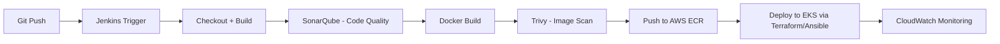
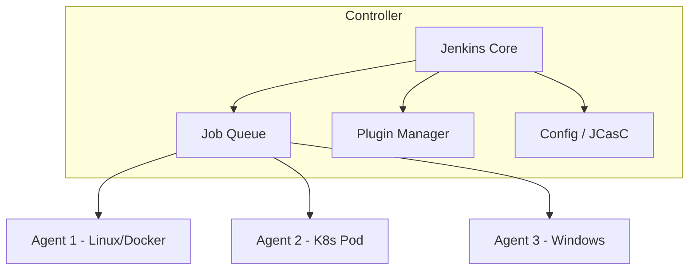
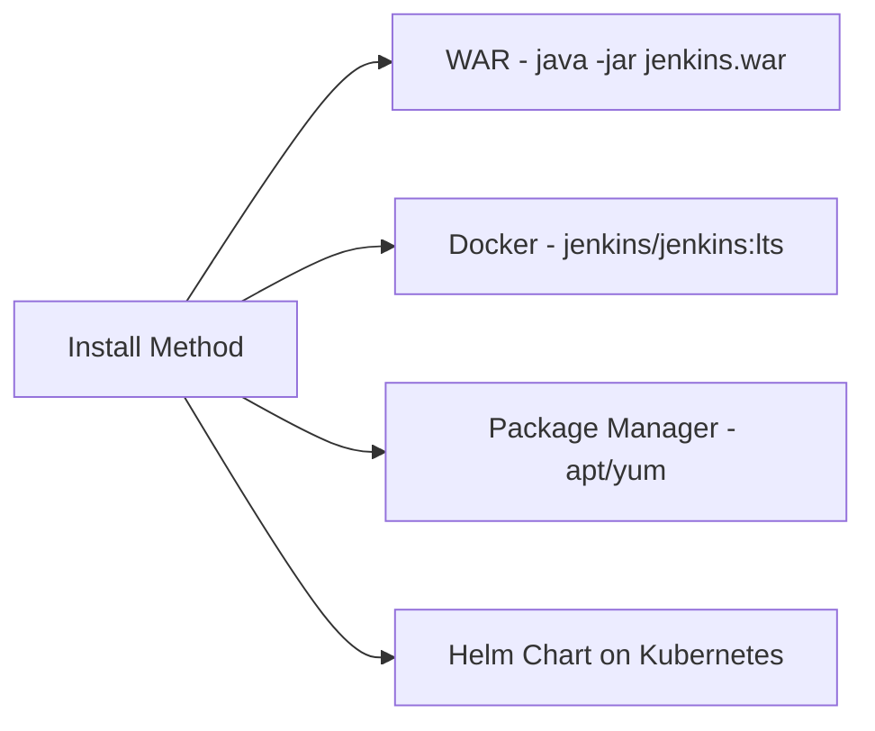
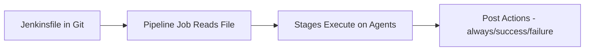
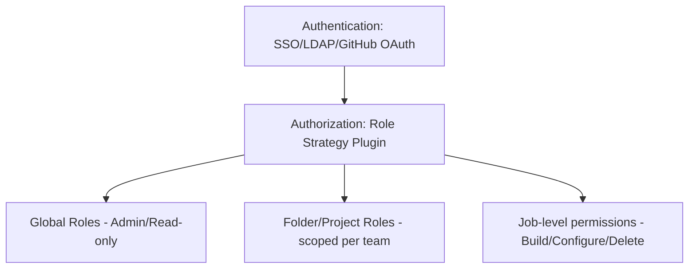
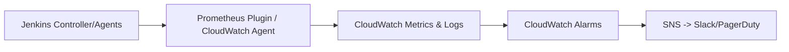
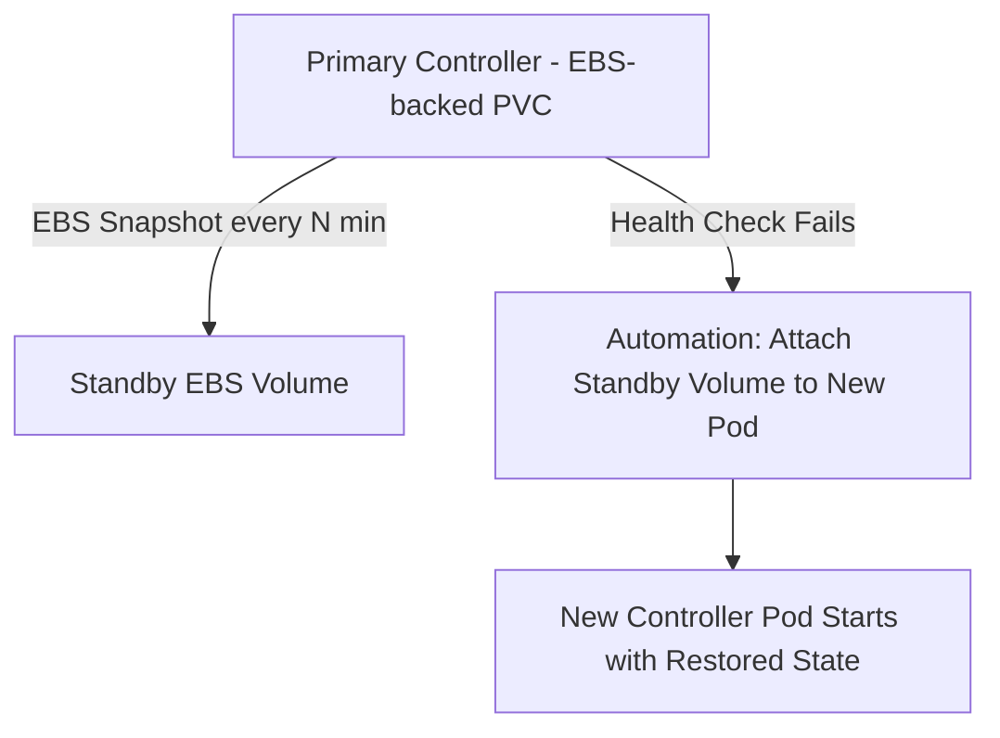

# Jenkins Handbook — 2026-07 — v1

**Edition:** July 2026 (v1 — first edition, no prior handbook to cross-reference)
**Author context:** Suraj — DevOps Engineer, CMG Project
**CMG Pipeline (used as the running production example throughout):**
`Git → Jenkins → SonarQube → Docker → Trivy → AWS ECR → Kubernetes (EKS) → Terraform → Ansible → CloudWatch`

**Status of this file:** ACTIVE (July 2026). Once August 2026 begins, this file becomes READ-ONLY/archived and a new file `Jenkins-Handbook-2026-08-v2.md` will be created containing only new/updated topics, cross-referencing this one.

---

## How to use this handbook

- Every topic follows: **What → Why → When / When Not → Architecture → Internal Working → Syntax → Examples (Basic → Intermediate → Production → Enterprise) → Best Practices → Security → Performance → Troubleshooting/RCA → Hands-on Lab → Cleanup → Interview Questions → Scenario Questions → FAQs → Cheat Sheet → Revision Notes**
- 💡 Tip | ⚠️ Common Mistake | 🚀 Best Practice | 🔒 Security | 🎯 Interview Tip | 📌 Remember | 🔥 Frequently Asked | ❗ Production Note
- All examples are grounded in the CMG toolchain wherever relevant.

---

## Table of Contents

1. CI/CD Fundamentals
2. Jenkins Architecture
3. Installation
4. Jenkins UI
5. Freestyle Jobs
6. Pipeline Basics
7. Declarative Pipeline
8. Scripted Pipeline
9. Jenkinsfile
10. Stages & Steps
11. Agents & Nodes
12. Master/Controller & Agents
13. Workspace
14. Parameters
15. Environment Variables
16. Credentials
17. Plugins
18. Shared Libraries
19. Tools Configuration
20. Triggers (Webhook, Poll SCM, Cron)
21. Git Integration
22. GitHub/GitLab Integration
23. Maven, Gradle, npm
24. Docker Integration
25. Kubernetes Integration
26. Terraform Integration
27. Ansible Integration
28. Artifact Management
29. Parallel Builds
30. Matrix Builds
31. Input & Approval
32. Notifications
33. Security & RBAC
34. Backup & Restore
35. Monitoring & Logging
36. Performance Tuning
37. High Availability
38. Jenkins Configuration as Code (JCasC)
39. Pipeline Optimization
40. Troubleshooting
41. Production Best Practices
42. Enterprise Folder Structure
43. Hands-on Labs (Consolidated)
44. Interview Preparation (Consolidated)
45. Cheat Sheets (Consolidated)
46. Revision Notes (Consolidated)
47. Master Rapid Fire (All Topics)

---

## 1. CI/CD Fundamentals

### What is it?
- **CI (Continuous Integration):** Developers merge code into a shared repo frequently; each merge triggers an automated build + test.
- **CD (Continuous Delivery):** Every validated build is automatically prepared for release (deployable artifact ready anytime).
- **CD (Continuous Deployment):** Every validated build is automatically deployed to production with no manual gate.

### Why is it needed?
- Catches integration bugs early (small diffs = small blast radius).
- Removes manual, error-prone release processes.
- Enables fast, safe, repeatable delivery — critical for multi-team projects like CMG.

### When to use it?
- Any team with more than one contributor or more than one environment (dev/stage/prod).
- Microservices, containerized apps, infra-as-code repos.

### When NOT to use it?
- One-off scripts / throwaway PoCs with no repeat deployment need.
- Extremely regulated release windows where full automation to prod isn't allowed (use CI + Continuous Delivery, hold Continuous Deployment).

### Architecture (CMG-style CI/CD flow)



ASCII fallback:
```
Git -> Jenkins -> SonarQube -> Docker -> Trivy -> ECR -> EKS -> Terraform/Ansible -> CloudWatch
```

### Internal Working
1. SCM webhook (or poll) fires a Jenkins job.
2. Jenkins allocates an agent, checks out code.
3. Build + unit tests run; SonarQube gate evaluates quality.
4. Docker image built, scanned by Trivy for CVEs.
5. Image pushed to ECR only if scan passes threshold.
6. Terraform provisions/updates infra; Ansible configures; kubectl/Helm rolls out to EKS.
7. CloudWatch collects logs/metrics for the new revision.

### Basic Example
```groovy
pipeline {
  agent any
  stages {
    stage('Build') { steps { sh 'mvn clean package' } }
  }
}
```

### Intermediate Example
```groovy
pipeline {
  agent any
  stages {
    stage('Build') { steps { sh 'mvn clean package' } }
    stage('Test')  { steps { sh 'mvn test' } }
  }
}
```

### Production Example (CMG-aligned)
```groovy
pipeline {
  agent any
  environment { ECR_REPO = '123456789012.dkr.ecr.ap-south-1.amazonaws.com/cmg-app' }
  stages {
    stage('Checkout') { steps { git branch: 'main', url: 'https://github.com/org/cmg.git' } }
    stage('Build')    { steps { sh 'mvn clean package' } }
    stage('SonarQube'){ steps { sh 'mvn sonar:sonar' } }
    stage('Docker Build') { steps { sh 'docker build -t $ECR_REPO:$BUILD_NUMBER .' } }
    stage('Trivy Scan')   { steps { sh 'trivy image --exit-code 1 --severity HIGH,CRITICAL $ECR_REPO:$BUILD_NUMBER' } }
    stage('Push to ECR')  { steps { sh 'docker push $ECR_REPO:$BUILD_NUMBER' } }
    stage('Deploy to EKS'){ steps { sh 'kubectl set image deployment/cmg-app cmg-app=$ECR_REPO:$BUILD_NUMBER' } }
  }
}
```

### Enterprise Example
- Same as above + shared libraries for common stages, Terraform-managed EKS/ECR, Ansible for post-deploy config, approval gate before prod, Slack/CloudWatch alerting, multi-branch pipeline per environment.

### Line-by-Line Explanation (Production Example)
- `environment{}` — centralizes the ECR repo URL so it isn't hardcoded per stage.
- `git branch:'main'` — explicit branch avoids ambiguous default-branch checkout.
- `mvn sonar:sonar` — pushes analysis to SonarQube server configured in Jenkins global config.
- `trivy --exit-code 1` — fails the build (non-zero exit) if HIGH/CRITICAL CVEs found, hard gate before push.
- `kubectl set image` — simplest rolling update trigger on EKS deployment.

### Best Practices
- 🚀 Fail fast: put cheapest checks (lint, unit test) before expensive ones (image scan, deploy).
- 🚀 Keep pipeline as code (Jenkinsfile) in the same repo as the application.
- 🚀 Use immutable artifacts (image tag = build number or commit SHA, never `latest` in prod).

### Security
- 🔒 Never hardcode AWS/ECR credentials in Jenkinsfile — use Jenkins Credentials Store + IAM roles.
- 🔒 Enforce Trivy scan as a hard gate, not advisory.
- 🔒 Restrict who can approve production deployment stages (RBAC).

### Performance
- Cache Maven/npm dependencies between builds (local repo or shared cache).
- Use parallel stages for independent test suites.

### Troubleshooting / RCA
| Symptom | Likely Cause | Fix |
|---|---|---|
| Build stuck at "Waiting for next available executor" | No agent matches label / all executors busy | Add agents or increase executor count |
| SonarQube stage hangs | Wrong server URL/token in Jenkins config | Re-validate SonarQube server config under Manage Jenkins |
| Trivy fails every build | CVE severity threshold too strict for base image | Update base image or adjust `--severity` policy with team sign-off |

### Verification
- Confirm each stage shows green in Blue Ocean/stage view.
- Confirm image tag exists in ECR (`aws ecr describe-images`).
- Confirm new pod revision running in EKS (`kubectl rollout status`).

### Hands-on Lab
1. Create a freestyle or pipeline job pointing to a sample repo.
2. Add stages: Build → Test → Docker Build → Push (use a test ECR repo or Docker Hub).
3. Break the build intentionally (failing test) and observe pipeline stop.

### Cleanup
- Remove test Docker images locally (`docker system prune`).
- Delete test ECR images/repos after lab.

### Interview Questions
- 🎯 Q: What's the difference between Continuous Delivery and Continuous Deployment?
  A: Delivery = artifact always release-ready, manual trigger to prod. Deployment = fully automated, no manual gate.
- 🎯 Q: Why put SonarQube before Docker build in CI/CD?
  A: Catch code-quality/security issues before spending compute on image build — fail fast principle.

### Scenario Questions
- Scenario: Production deploy failed after Trivy passed but before ECR push — where do you look first? → Check ECR push permissions/IAM role and network connectivity from agent to ECR endpoint.

### FAQs
- 🔥 Is Jenkins CI or CD tool? → Both; it orchestrates the full pipeline via Jenkinsfile stages.

### Comparison Table
| Aspect | CI | Continuous Delivery | Continuous Deployment |
|---|---|---|---|
| Trigger | Every commit | Every commit | Every commit |
| Manual gate before prod | N/A | Yes | No |
| Risk | Low (no prod) | Medium | Requires strong test coverage |

### Cheat Sheet
- CI = build+test on every commit. CD(delivery) = always release-ready. CD(deployment) = auto to prod.
- CMG flow: Git→Jenkins→SonarQube→Docker→Trivy→ECR→EKS→Terraform/Ansible→CloudWatch.

### 🔥 Rapid Fire

- CI vs Continuous Delivery vs Continuous Deployment? -> CI=build+test; Delivery=always release-ready+manual gate; Deployment=fully automated to prod.
- Why SonarQube before Docker build? -> Fail fast on cheap checks before expensive image build.
- CMG pipeline order? -> Git -> Jenkins -> SonarQube -> Docker -> Trivy -> ECR -> EKS -> Terraform/Ansible -> CloudWatch.

### Revision Notes
- 📌 Remember the fail-fast ordering: cheap checks first, expensive/destructive actions last.

---

## 2. Jenkins Architecture

### What is it?
- Jenkins uses a **Controller (Master) + Agent (Node/Slave)** distributed architecture. The controller schedules jobs, stores config/plugins/UI; agents execute the actual build steps.

### Why is it needed?
- Separates orchestration (controller) from execution (agents) so heavy builds don't overload the controller and different builds can run on different OS/hardware/toolchains.

### When to use it?
- Any team running more than trivial workloads — use dedicated agents for Docker builds, Kubernetes deploys, Terraform runs.

### When NOT to use it?
- Tiny personal projects can run everything on the controller (`agent any` on controller) but this is not recommended for production.

### Architecture Diagram


### Internal Working
1. Controller loads jobs/pipelines and listens for triggers (webhook/poll/cron).
2. On trigger, controller places build in queue.
3. Scheduler matches build's required label to an available agent.
4. Agent connects via JNLP/SSH/Kubernetes plugin, executes steps, streams logs back to controller.
5. Controller records build result, artifacts, and test reports.

### Syntax — Agent Selection
```groovy
pipeline {
  agent { label 'docker-ecr-agent' }
  stages { stage('Build'){ steps { sh 'docker build .' } } }
}
```

### Examples
- **Basic:** Single controller, no agents, `agent any` (builds run on controller — not for production).
- **Intermediate:** Controller + 2 static Linux agents connected via SSH.
- **Production (CMG):** Controller + Kubernetes-plugin agents that spin up ephemeral pods per build (one pod has Docker+Trivy+kubectl+Terraform+Ansible tooling).
- **Enterprise:** Multi-controller setup behind a load balancer (CloudBees CI) with agent pools segmented by team/toolchain and HA controller.

### Best Practices
- 🚀 Never run production builds directly on the controller — keep it orchestration-only.
- 🚀 Use ephemeral Kubernetes agents to avoid tool drift between builds.

### Security
- 🔒 Restrict controller's inbound agent port; use TLS for agent-controller connection.
- 🔒 Agents should have least-privilege IAM roles (e.g., only the ECR push permission they need).

### Performance
- Right-size executor count per agent based on CPU/memory, not just "more is better."

### Troubleshooting / RCA
| Symptom | Cause | Fix |
|---|---|---|
| Agent shows "offline" | Network/firewall block on JNLP port | Open port / check agent logs |
| Build queued forever | No agent matches label | Fix label or provision matching agent |

### Verification
- Manage Jenkins → Nodes: confirm agent status "Online" with correct labels.

### Hands-on Lab
1. Add a new agent (Docker container or VM) via SSH.
2. Assign label `test-agent`.
3. Run a pipeline with `agent { label 'test-agent' }` and confirm it executes there.

### Cleanup
- Remove test agent node from Manage Jenkins → Nodes after lab.

### Interview Questions
- 🎯 Q: Why shouldn't the controller run builds? A: Security + stability risk — a bad build could crash the orchestrator for everyone.
- 🎯 Q: JNLP vs SSH agent connection — difference? A: JNLP = agent initiates connection outward (good behind NAT/firewall); SSH = controller initiates connection to agent.

### FAQs
- 🔥 Can one Jenkins instance have agents in multiple clouds? Yes — via appropriate cloud/Kubernetes plugins per provider.

### Comparison Table
| Model | Pros | Cons |
|---|---|---|
| Static Agents | Predictable, easy to debug | Idle cost, config drift |
| Ephemeral (K8s) Agents | Always clean, scales to zero | Slightly higher startup latency |

### Cheat Sheet
- Controller = brain (schedule/UI/config). Agent = muscle (execute).

### 🔥 Rapid Fire

- Controller vs Agent? -> Controller=schedules/UI/config; Agent=executes builds.
- Why not build on controller? -> Security/stability risk, isolates blast radius.
- JNLP vs SSH? -> JNLP=agent connects out (NAT-friendly); SSH=controller connects in.

### Revision Notes
- 📌 Label-based scheduling is the core mechanism tying pipeline `agent{}` to real infrastructure.

---

## 3. Installation

### What is it?
- The process of standing up a Jenkins controller (and later agents) via WAR file, Docker, package manager, or Helm chart (Kubernetes).

### Why is it needed?
- Foundational step — no pipeline exists without a running controller.

### When to use it?
- New environment setup, DR rebuild, or migrating Jenkins versions.

### When NOT to use it?
- Don't reinstall to "fix" config issues — use JCasC/backup restore instead (safer, repeatable).

### Architecture / Install Options


### Basic Example (Docker)
```bash
docker run -d --name jenkins -p 8080:8080 -p 50000:50000 \
  -v jenkins_home:/var/jenkins_home jenkins/jenkins:lts
```

### Intermediate Example (Docker Compose with volume + JCasC)
```yaml
version: "3.8"
services:
  jenkins:
    image: jenkins/jenkins:lts
    ports: ["8080:8080", "50000:50000"]
    volumes:
      - jenkins_home:/var/jenkins_home
      - ./jenkins-casc.yaml:/var/jenkins_home/casc.yaml
    environment:
      - CASC_JENKINS_CONFIG=/var/jenkins_home/casc.yaml
volumes:
  jenkins_home:
```

### Production Example (Helm on EKS — CMG-aligned)
```bash
helm repo add jenkins https://charts.jenkins.io
helm install cmg-jenkins jenkins/jenkins \
  --namespace cicd --create-namespace \
  --set controller.installPlugins="{kubernetes,workflow-aggregator,git,sonar,docker-workflow}" \
  --set persistence.storageClass="gp3" \
  --set controller.resources.requests.cpu="1" \
  --set controller.resources.requests.memory="2Gi"
```

### Enterprise Example
- Terraform module provisions EKS namespace + IAM role for Jenkins service account (IRSA); Ansible bootstraps plugin baseline; Jenkins configured fully via JCasC YAML checked into Git (GitOps for Jenkins itself).

### Best Practices
- 🚀 Pin the Jenkins LTS version explicitly (avoid `latest` tag drift).
- 🚀 Store `jenkins_home` on persistent, backed-up storage (EBS/gp3, not ephemeral).

### Security
- 🔒 Never expose Jenkins controller UI directly to the internet — put behind VPN/ALB with auth.
- 🔒 Disable the setup wizard's default admin credentials immediately.

### Performance
- Controller: minimum 2 vCPU / 4GB RAM for small teams; scale up with job count, not agent count.

### Troubleshooting
| Symptom | Cause | Fix |
|---|---|---|
| Jenkins won't start, port 8080 in use | Port conflict | Change `-p` mapping or stop conflicting process |
| Plugins fail to install on first boot | No internet egress from controller | Configure proxy or internal plugin mirror |

### Verification
- `curl -I http://localhost:8080/login` returns 200/403 depending on auth state.
- Check `/var/jenkins_home/config.xml` exists and controller UI loads.

### Hands-on Lab
1. Install Jenkins via Docker on a local VM.
2. Complete setup wizard, install suggested plugins.
3. Create first admin user.

### Cleanup
- `docker rm -f jenkins` and remove the named volume after lab if not needed.

### Interview Questions
- 🎯 Q: WAR vs Docker install — when would you choose WAR? A: Bare VM environments without container runtime, or strict OS-level compliance requirements.
- 🎯 Q: What is JCasC and why use it at install time? A: Jenkins Configuration as Code — defines Jenkins system config in YAML for repeatable, version-controlled installs.

### FAQs
- 🔥 Can Jenkins run on Kubernetes itself? Yes, via the official Helm chart; commonly used for the CMG-style setup.

### Comparison Table
| Method | Best For | Downside |
|---|---|---|
| WAR | Bare VM, quick test | Manual dependency mgmt (Java version) |
| Docker | Portability, easy upgrade | Needs Docker knowledge |
| Helm/K8s | Production, HA, autoscaling agents | Higher initial setup complexity |

### Cheat Sheet
- Default ports: 8080 (UI), 50000 (JNLP agents).
- `JENKINS_HOME` holds all config/jobs/plugins/secrets — back it up.

### 🔥 Rapid Fire

- Default Jenkins ports? -> 8080 (UI), 50000 (JNLP agents).
- WAR vs Docker vs Helm? -> WAR=bare VM; Docker=portable; Helm=production K8s/HA.
- What is JCasC used for at install time? -> Version-controlled, repeatable Jenkins system config.

### Revision Notes
- 📌 Treat Jenkins installation itself as infrastructure-as-code (JCasC + Helm values in Git), not a manual one-time task.

---

## 4. Jenkins UI

### What is it?
- The web dashboard used to create/configure jobs, view builds, manage plugins/credentials/nodes, and view pipeline stage visualizations (classic UI + Blue Ocean).

### Why is it needed?
- Human interface for humans to configure, trigger, debug, and audit CI/CD activity without editing raw XML/JSON.

### When to use it?
- Initial setup, one-off debugging, viewing build/console logs, managing credentials/plugins.

### When NOT to use it?
- Don't hand-configure production jobs via UI only — always back UI config with Jenkinsfile/JCasC so it's reproducible.

### Key Areas
```
Dashboard → Job List
Manage Jenkins → System Config, Plugins, Nodes, Credentials, Security
Job Page → Build History, Console Output, Stage View, Test Results
Blue Ocean → Visual pipeline editor + run visualization
```

### Examples
- **Basic:** Create a Freestyle job via "New Item."
- **Intermediate:** Use Blue Ocean to visualize a multi-stage pipeline run.
- **Production:** Configure RBAC via UI initially, then migrate to JCasC (Role Strategy plugin config as YAML).

### Best Practices
- 🚀 Use "Pipeline Syntax" generator in the job UI to correctly generate step syntax (avoids hand-typing errors).
- 🚀 Bookmark "Console Output" — first place to check any failure.

### Security
- 🔒 Restrict "Manage Jenkins" access to admins only via Matrix/Role-based auth.
- 🔒 Disable anonymous read access on production controllers.

### Troubleshooting
| Symptom | Cause | Fix |
|---|---|---|
| UI very slow | Too many jobs/builds retained, no build discarder | Configure "Discard Old Builds" |
| Blue Ocean not showing pipeline | Blue Ocean plugin not installed | Install Blue Ocean plugin suite |

### Hands-on Lab
1. Log in, create a Freestyle job "hello-world" that echoes text.
2. Run it, view Console Output.
3. Install Blue Ocean and view the same job there.

### Interview Questions
- 🎯 Q: Classic UI vs Blue Ocean — when to use each? A: Classic for admin/config tasks; Blue Ocean for visual pipeline debugging and stage-level log inspection.

### Cheat Sheet
- `/job/<name>/console` = raw console log URL pattern. `Manage Jenkins → System Log` for controller-level issues.

### 🔥 Rapid Fire

- Classic UI vs Blue Ocean? -> Classic=admin/config; Blue Ocean=visual pipeline debugging.
- Where to check first on failure? -> Console Output of the job/build.

### Revision Notes
- 📌 UI is for humans; Jenkinsfile/JCasC is for machines/reproducibility — don't let critical config live only in UI clicks.

---

## 5. Freestyle Jobs

### What is it?
- The original, UI-configured Jenkins job type: build steps, SCM, triggers all set via form fields (no Jenkinsfile/code).

### Why is it needed?
- Simple to understand for beginners; still used for small utility/admin jobs (cleanup scripts, cron-style tasks).

### When to use it?
- Simple, single-step tasks; legacy jobs; quick admin scripts not needing full pipeline complexity.

### When NOT to use it?
- Multi-stage CI/CD (like CMG's Git→...→CloudWatch flow) — use Pipeline/Jenkinsfile instead; Freestyle isn't version-controlled with the app code.

### Architecture
```
SCM (poll/webhook) -> Build Steps (shell/batch/Maven) -> Post-build Actions (archive/notify)
```

### Basic Example
- New Item → Freestyle → Build Step: Execute Shell → `echo "Hello CMG"`.

### Intermediate Example
- Add SCM (Git), Build Trigger (Poll SCM `H/5 * * * *`), Build Step (`mvn clean package`), Post-build (Archive artifacts `*.jar`).

### Production Example
- Freestyle job used only for a specific ops task, e.g., nightly ECR image cleanup: Build Step runs a shell script calling `aws ecr batch-delete-image` for images older than 90 days.

### Best Practices
- 🚀 Reserve Freestyle for ops/utility tasks only; use Pipeline-as-code for actual app CI/CD.

### Security
- 🔒 Freestyle jobs' shell steps run with the agent's full permission — audit scripts carefully, don't allow arbitrary contributor edits.

### Troubleshooting
| Symptom | Cause | Fix |
|---|---|---|
| Job doesn't trigger on push | Using Poll SCM but no webhook, and cron schedule too sparse | Reduce poll interval or set up a webhook |

### Interview Questions
- 🎯 Q: Why has Pipeline mostly replaced Freestyle for CI/CD? A: Pipeline is version-controlled (Jenkinsfile in repo), supports complex logic, parallelism, and code review — Freestyle config lives only in Jenkins UI/XML.

### Cheat Sheet
- Freestyle = good for one-off ops jobs; Pipeline = good for real CI/CD.

### 🔥 Rapid Fire

- When to use Freestyle over Pipeline? -> Simple one-off ops/admin tasks only.
- Why is Freestyle not ideal for CI/CD? -> Not version-controlled with app code, no complex logic support.

### Revision Notes
- 📌 Freestyle jobs aren't "wrong," just limited — know when their simplicity is actually the right tool.

---

## 6. Pipeline Basics

### What is it?
- Jenkins Pipeline = a suite of plugins supporting CI/CD pipelines defined as code (Jenkinsfile), in Declarative or Scripted syntax.

### Why is it needed?
- Enables complex, multi-stage, version-controlled, code-reviewable automation — the backbone of CMG's Git→CloudWatch flow.

### When to use it?
- Any real CI/CD process with more than one step or need for conditional/parallel logic.

### When NOT to use it?
- Trivial one-shot admin tasks (Freestyle is fine there).

### Architecture


### Basic Example
```groovy
pipeline {
  agent any
  stages {
    stage('Hello') { steps { echo 'Hello CMG Pipeline' } }
  }
}
```

### Intermediate Example
```groovy
pipeline {
  agent any
  stages {
    stage('Build') { steps { sh 'mvn package' } }
    stage('Test')  { steps { sh 'mvn test' } }
  }
  post {
    always  { echo 'Pipeline finished' }
    failure { echo 'Notify team' }
  }
}
```

### Production Example
- Full CMG pipeline (see Topic 1's Production Example) — checkout, build, Sonar, Docker, Trivy, ECR push, EKS deploy, all as named stages with `post{}` block sending Slack/CloudWatch alerts on failure.

### Best Practices
- 🚀 Always define `post { failure {...} }` for alerting — silent failures are the worst failures.
- 🚀 Keep Jenkinsfile in the app repo (pipeline-as-code lives with the code it builds).

### Security
- 🔒 Use `withCredentials{}` block, never `sh "aws ... --key=hardcoded"`.

### Performance
- Use `stash`/`unstash` instead of re-checking-out code across agents in the same run.

### Troubleshooting
| Symptom | Cause | Fix |
|---|---|---|
| "No such DSL method" error | Missing plugin providing that step | Install the plugin providing the step (check plugin docs) |

### Interview Questions
- 🎯 Q: What are the two pipeline syntaxes? A: Declarative (structured, opinionated, easier) and Scripted (full Groovy, flexible).

### Cheat Sheet
- `pipeline { agent; stages { stage(){ steps {} } }; post {} }` = declarative skeleton.

### 🔥 Rapid Fire

- Two pipeline types? -> Declarative and Scripted.
- Where should post{failure{}} always be added? -> Every real pipeline, for alerting.

### Revision Notes
- 📌 Pipeline-as-code is what turns Jenkins into real GitOps-style CI/CD, not just a job scheduler.

---

## 7. Declarative Pipeline

### What is it?
- A structured, opinionated pipeline syntax with a fixed top-level `pipeline {}` block, enforcing a predictable structure (agent, stages, post, etc.).

### Why is it needed?
- Easier to read/write/validate than Scripted; has built-in syntax validation and better error messages; recommended default for most teams including CMG.

### When to use it?
- Default choice for almost all CI/CD pipelines.

### When NOT to use it?
- Highly dynamic pipeline logic (loops generating stages dynamically, complex conditionals) — may need `script{}` blocks inside, or full Scripted pipeline.

### Architecture / Structure
```groovy
pipeline {
  agent { label 'cmg-agent' }
  options { timestamps(); timeout(time: 30, unit: 'MINUTES') }
  environment { ECR_REPO = '...' }
  parameters { string(name: 'ENV', defaultValue: 'staging', description: 'Target env') }
  triggers { githubPush() }
  stages {
    stage('Checkout') { steps { checkout scm } }
    stage('Build')    { steps { sh 'mvn package' } }
  }
  post {
    success { echo 'OK' }
    failure { mail to: 'team@cmg.com', subject: 'Build failed', body: 'Check Jenkins' }
  }
}
```

### Basic Example
```groovy
pipeline { agent any; stages { stage('Build'){ steps { echo 'build' } } } }
```

### Intermediate Example
- Add `parameters{}`, `environment{}`, and a `when { branch 'main' }` conditional stage.

### Production Example (CMG)
- Full declarative pipeline with `options{ timeout }`, `parameters{ ENV }`, conditional deploy stage `when { expression { params.ENV == 'prod' } }`, Trivy gate, and `post{ failure{ slackSend } }`.

### Enterprise Example
- Shared library function wraps entire CMG pipeline (`@Library('cmg-shared-lib') _ ; cmgPipeline()`), called from a two-line Jenkinsfile per microservice repo.

### Best Practices
- 🚀 Use `when{}` blocks instead of duplicating pipelines per branch/environment.
- 🚀 Use `options { timeout() }` on every pipeline to prevent stuck builds hogging executors.

### Security
- 🔒 Use `input` step with `submitter` restriction for production deploy approval stage.

### Performance
- Use `options { skipDefaultCheckout() }` + explicit `checkout scm` only where needed to avoid redundant clones on multi-stage/parallel jobs.

### Troubleshooting
| Symptom | Cause | Fix |
|---|---|---|
| "Invalid pipeline block" | Steps placed outside `steps{}`, or wrong nesting | Fix top-level structure to match declarative schema |

### Interview Questions
- 🎯 Q: Why prefer Declarative over Scripted for most teams? A: Enforced structure, built-in validation, easier onboarding, less Groovy expertise required.
- 🎯 Q: How do you add custom Groovy logic inside Declarative? A: Use a `script {}` block inside a `steps{}` block.

### FAQs
- 🔥 Can Declarative call Scripted code? Yes, via `script{}` blocks.

### Comparison Table
| Feature | Declarative | Scripted |
|---|---|---|
| Structure | Fixed, validated | Free-form Groovy |
| Learning curve | Lower | Higher |
| Flexibility | Good (via script{}) | Full |

### Cheat Sheet
- Skeleton: `pipeline{agent;options;environment;parameters;triggers;stages{stage{steps{}}};post{}}`

### 🔥 Rapid Fire

- Why prefer Declarative? -> Structured, validated, easier onboarding, less Groovy needed.
- How to add custom Groovy in Declarative? -> Use a script{} block inside steps{}.

### Revision Notes
- 📌 Declarative is the CMG team default; reach for Scripted/`script{}` only when logic truly needs it.

---

## 8. Scripted Pipeline

### What is it?
- Full Groovy-based pipeline syntax wrapped in a `node {}` block — imperative, flexible, no fixed schema.

### Why is it needed?
- Needed for advanced logic: dynamic stage generation, complex conditionals/loops, custom exception handling that Declarative can't cleanly express.

### When to use it?
- Building shared libraries, generating stages dynamically (e.g., one stage per microservice found in a monorepo).

### When NOT to use it?
- Standard, static CI/CD flows — Declarative is safer/simpler for the team to maintain.

### Syntax
```groovy
node('cmg-agent') {
  stage('Checkout') { checkout scm }
  stage('Build') {
    try {
      sh 'mvn package'
    } catch (Exception e) {
      currentBuild.result = 'FAILURE'
      error("Build failed: ${e.message}")
    }
  }
}
```

### Production Example (Dynamic stages for CMG microservices)
```groovy
def services = ['auth-svc', 'billing-svc', 'notify-svc']
node('cmg-agent') {
  for (svc in services) {
    stage("Build ${svc}") {
      dir(svc) { sh 'docker build -t ' + svc + ':$BUILD_NUMBER .' }
    }
  }
}
```
⚠️ Common Mistake: Using `for (svc in services)` directly creates a closure variable-capture bug in some Groovy versions — safer to use `services.each { svc -> ... }`.

### Best Practices
- 🚀 Wrap risky steps in try/catch/finally for cleanup guarantees.
- 🚀 Prefer `.each{}` over `for` loops when generating stages dynamically to avoid variable capture bugs.

### Security
- 🔒 Scripted pipelines running arbitrary Groovy require Script Security plugin approval — review before approving in Manage Jenkins → In-process Script Approval.

### Troubleshooting
| Symptom | Cause | Fix |
|---|---|---|
| "Scripts not permitted to use..." | Script Security sandbox blocking a method | Admin approves in Script Approval, or refactor to use a safe step |

### Interview Questions
- 🎯 Q: When would you choose Scripted over Declarative? A: When you need real programming constructs — dynamic stage count, complex branching, custom error handling not expressible in Declarative's schema.

### Cheat Sheet
- Scripted = `node { stage(){ ... groovy ... } }`, full imperative Groovy.

### 🔥 Rapid Fire

- When choose Scripted over Declarative? -> Dynamic stage generation, complex branching/loops.
- Why use .each{} over for-loop for dynamic stages? -> Avoids Groovy closure variable-capture bug.

### Revision Notes
- 📌 Most real-world "Scripted" usage today lives inside Shared Library step implementations, not top-level Jenkinsfiles.

---

## 9. Jenkinsfile

### What is it?
- The text file (checked into source control) containing the pipeline definition (Declarative or Scripted) that Jenkins reads to run the job.

### Why is it needed?
- Makes CI/CD pipeline-as-code: version-controlled, code-reviewable, reproducible across branches/environments.

### When to use it?
- Always, for any Pipeline job — this is the standard, not optional in modern Jenkins usage.

### Where it lives
```
cmg-app/
├── src/
├── pom.xml
└── Jenkinsfile   <-- lives at repo root, read by Multibranch Pipeline job
```

### Basic Example
```groovy
// Jenkinsfile at repo root
pipeline {
  agent any
  stages { stage('Build'){ steps { sh 'mvn package' } } }
}
```

### Production Example
- Multibranch Pipeline job auto-discovers `Jenkinsfile` in every branch/PR of the CMG repo; `main` branch Jenkinsfile includes the full Docker/Trivy/ECR/EKS flow, feature branches run only Build+Test+Sonar (via `when { branch 'main' }` guarding the deploy stages).

### Best Practices
- 🚀 Keep Jenkinsfile thin — call into a Shared Library for the actual heavy logic so multiple repos stay consistent.
- 🚀 Validate syntax locally before pushing: `jenkins-cli declarative-linter < Jenkinsfile` (via Jenkins CLI) or the "Replay"/"Pipeline Syntax" validator in UI.

### Security
- 🔒 Treat Jenkinsfile like application code — PR review required before merge, especially changes to deploy/credentials stages.

### Troubleshooting
| Symptom | Cause | Fix |
|---|---|---|
| "Jenkinsfile not found" | Wrong path/branch, or Multibranch scan hasn't run | Trigger "Scan Multibranch Pipeline Now" |

### Interview Questions
- 🎯 Q: Why store Jenkinsfile in the app repo instead of a central Jenkins job config? A: Version control, PR review, branch-specific pipeline behavior, and reproducibility if Jenkins itself is rebuilt.

### Cheat Sheet
- Filename must be exactly `Jenkinsfile` (case-sensitive) unless custom script path is configured.

### 🔥 Rapid Fire

- Why keep Jenkinsfile in the app repo? -> Version control, PR review, branch-specific behavior.
- Default Jenkinsfile filename? -> Exactly 'Jenkinsfile' (case-sensitive).

### Revision Notes
- 📌 Jenkinsfile is the contract between "what the app repo says should happen" and "what Jenkins actually runs."

---

## 10. Stages & Steps

### What is it?
- **Stage** = a logical, visually-distinct phase of the pipeline (e.g., Build, Test, Deploy). **Step** = a single task/command inside a stage (e.g., `sh`, `echo`, `git`).

### Why is it needed?
- Stages give visual progress + logical grouping (stage view/Blue Ocean); steps are the actual executable actions.

### Syntax
```groovy
stages {
  stage('Build') {
    steps {
      sh 'mvn clean package'
      echo 'Build complete'
    }
  }
  stage('Docker') {
    steps {
      sh 'docker build -t cmg-app:$BUILD_NUMBER .'
    }
  }
}
```

### Best Practices
- 🚀 One clear responsibility per stage (don't cram build+test+deploy into a single stage) — improves readability and lets you re-run/retry at stage granularity with some plugins.
- 🚀 Name stages exactly what they do — stage names show directly in Blue Ocean/stage view for fast triage.

### Security
- 🔒 Isolate credential-using steps into their own stage with `withCredentials{}` scoping, minimizing where secrets are in scope.

### Troubleshooting
| Symptom | Cause | Fix |
|---|---|---|
| Stage shows skipped (grey) | `when{}` condition false, or previous stage failed with `options{skipStagesAfterUnstable}` | Check `when` condition logic and earlier stage results |

### Interview Questions
- 🎯 Q: Can a stage have nested stages? A: Yes, via `parallel` or `stages{}` nested for matrix-style organization, but keep nesting shallow for readability.

### Cheat Sheet
- `stages{ stage('Name'){ steps{ ... } } }` — steps only run inside `steps{}`.

### 🔥 Rapid Fire

- Stage vs Step? -> Stage=logical phase/visual grouping; Step=actual executable action.
- Where should credential-using steps live? -> Their own stage with withCredentials{} scoping.

### Revision Notes
- 📌 Stage = organization/visibility; Step = execution. Don't confuse the two in interviews.

---

## 11. Agents & Nodes

### What is it?
- "Agent" (Pipeline term) / "Node" (Groovy term) = a machine (VM, container, K8s pod) where Jenkins executes build steps.

### Why is it needed?
- Distributes build load, allows OS/toolchain-specific builds (e.g., a Docker+Trivy+kubectl agent for CMG vs a Windows agent for .NET builds elsewhere).

### Syntax
```groovy
pipeline {
  agent { label 'cmg-docker-agent' }
  stages { stage('Build'){ steps { sh 'docker build .' } } }
}
```
Per-stage agent override:
```groovy
stages {
  stage('Build') { agent { label 'build-agent' }; steps { sh 'mvn package' } }
  stage('Deploy') { agent { label 'k8s-agent' };   steps { sh 'kubectl apply -f k8s/' } }
}
```

### Production Example
- CMG uses Kubernetes-plugin dynamic agents: a pod template with containers for `maven`, `docker` (via DinD or Kaniko), `trivy`, `kubectl`, `terraform`, and `ansible` — one ephemeral pod per build, destroyed after.

```yaml
# Kubernetes agent pod template (JCasC or Jenkinsfile podTemplate)
podTemplate(containers: [
  containerTemplate(name: 'maven', image: 'maven:3.9-eclipse-temurin-17'),
  containerTemplate(name: 'docker', image: 'docker:24-dind', privileged: true),
  containerTemplate(name: 'trivy', image: 'aquasec/trivy:latest'),
  containerTemplate(name: 'kubectl', image: 'bitnami/kubectl:latest')
]) {
  node(POD_LABEL) {
    stage('Build') { container('maven') { sh 'mvn package' } }
    stage('Scan')  { container('trivy') { sh 'trivy image cmg-app:$BUILD_NUMBER' } }
  }
}
```

### Best Practices
- 🚀 Use ephemeral Kubernetes agents in production to avoid tool version drift and leftover state between builds.
- 🚀 Label agents meaningfully (`docker-ecr`, `terraform-ansible`) not generically (`agent1`).

### Security
- 🔒 `privileged: true` for Docker-in-Docker is a real risk — prefer Kaniko/Buildah for rootless image builds where possible.

### Troubleshooting
| Symptom | Cause | Fix |
|---|---|---|
| Pod agent never starts | Image pull error / resource limits too low | Check `kubectl describe pod`, adjust resources/image name |

### Interview Questions
- 🎯 Q: Why use ephemeral Kubernetes agents over static VMs? A: Clean environment every build, auto-scaling, no manual patching, cost efficient (scale to zero).
- 🎯 Q: Risk of Docker-in-Docker `privileged: true`? A: Container escape risk; Kaniko/Buildah avoid needing privileged mode.

### Cheat Sheet
- `agent { label '' }` = static/labeled agent. `podTemplate + node(POD_LABEL)` = dynamic K8s agent.

### 🔥 Rapid Fire

- Why ephemeral K8s agents over static VMs? -> Clean state each build, autoscale, no drift.
- Risk of privileged Docker-in-Docker? -> Container escape risk; prefer Kaniko/Buildah.

### Revision Notes
- 📌 Agent choice directly impacts security posture (privileged containers) and cost (static vs ephemeral) — a favorite interview probe area.

---

## 12. Master/Controller & Agents (Deep Dive)

### What is it?
- Deep dive on the controller-agent trust/communication model beyond basic architecture (Topic 2): connection protocols, executor model, and controller responsibilities.

### Why is it needed?
- Understanding this is essential for HA design, security hardening, and diagnosing "agent offline" or "build stuck" issues at a protocol level.

### Connection Protocols
| Protocol | Direction | Use Case |
|---|---|---|
| JNLP (inbound) | Agent → Controller | Agents behind NAT/firewall (most common, incl. K8s pods) |
| SSH | Controller → Agent | Static Linux VMs with known IP/SSH key |
| Kubernetes Plugin | Controller creates pod, pod connects via JNLP | Dynamic ephemeral agents (CMG production model) |

### Executor Model
- Each agent has N "executors" = N concurrent build slots on that agent. Executor count should match realistic concurrent build capacity (CPU/memory), not be set arbitrarily high.

### Best Practices
- 🚀 Controller executors should be set to 0 in production (force all real work onto agents).
- 🚀 Monitor executor utilization in CloudWatch/Prometheus to right-size agent pool.

### Security
- 🔒 Rotate JNLP agent secrets; don't reuse one static secret across many long-lived agents.

### Troubleshooting
| Symptom | Cause | Fix |
|---|---|---|
| "Agent went offline during the build" | Network blip, pod evicted (K8s resource pressure) | Increase pod resource requests, check node autoscaler, add retry logic |

### Interview Questions
- 🎯 Q: Why set controller executors to 0? A: Prevents production builds from ever running on the orchestrator itself, isolating blast radius of a bad build.

### Cheat Sheet
- Executors = concurrency slots per agent; controller executors should be 0 in production.

### 🔥 Rapid Fire

- Why set controller executors to 0? -> Force all real work onto agents, isolate blast radius.
- Which connects to which in K8s plugin agents? -> Controller creates pod, pod connects back via JNLP.

### Revision Notes
- 📌 This topic is a common "explain the internals" interview question at senior level — know the protocol table cold.

---

## 13. Workspace

### What is it?
- The directory on an agent where Jenkins checks out source code and runs build steps for a given job (`$WORKSPACE`).

### Why is it needed?
- Isolated working directory per job/build to avoid file collisions between concurrent builds.

### Syntax
```groovy
pipeline {
  agent any
  stages {
    stage('Show Workspace') { steps { sh 'echo $WORKSPACE; pwd; ls -la' } }
  }
}
```
Custom workspace:
```groovy
pipeline {
  agent { node { label 'cmg-agent'; customWorkspace '/data/cmg-build' } }
  stages { stage('Build') { steps { sh 'mvn package' } } }
}
```

### Best Practices
- 🚀 Use `cleanWs()` (Workspace Cleanup plugin) at the start or end of builds to avoid stale-file bugs.
- 🚀 Avoid custom fixed workspaces for parallel/matrix builds — causes file collisions between concurrent runs.

### Security
- 🔒 Don't leave secrets/temp credential files in workspace after build — clean up in `post { always { cleanWs() } }`.

### Troubleshooting
| Symptom | Cause | Fix |
|---|---|---|
| Old file used from previous build (stale artifact) | Workspace not cleaned between builds | Add explicit `cleanWs()` step |
| "No space left on device" on agent | Workspaces from old builds never cleaned | Configure Discard Old Builds + `cleanWs()` |

### Interview Questions
- 🎯 Q: What happens to the workspace on ephemeral Kubernetes agents? A: It's destroyed automatically when the pod terminates — inherently "clean" each build, unlike static agents.

### Cheat Sheet
- `$WORKSPACE` env var = current build's working directory; `cleanWs()` wipes it.

### 🔥 Rapid Fire

- What does $WORKSPACE mean? -> Current build's working directory on the agent.
- How to avoid stale files between builds? -> Use cleanWs() in post{always{}}.

### Revision Notes
- 📌 Ephemeral K8s agents (Topic 11) largely solve workspace-hygiene problems "for free."

---

## 14. Parameters

### What is it?
- User/pipeline-supplied inputs at build-trigger time (string, choice, boolean, password, etc.) that customize a run.

### Why is it needed?
- Allows one Jenkinsfile to serve multiple purposes (e.g., choose target environment: staging vs prod) without duplicating pipelines.

### Syntax
```groovy
pipeline {
  agent any
  parameters {
    choice(name: 'ENV', choices: ['staging', 'prod'], description: 'Target environment')
    string(name: 'IMAGE_TAG', defaultValue: 'latest', description: 'Docker image tag')
    booleanParam(name: 'SKIP_TESTS', defaultValue: false, description: 'Skip test stage')
  }
  stages {
    stage('Deploy') {
      when { expression { params.ENV == 'prod' } }
      steps { sh "kubectl set image deployment/cmg-app cmg-app=$ECR_REPO:${params.IMAGE_TAG} -n prod" }
    }
  }
}
```

### Best Practices
- 🚀 Use `choice` params over free-text `string` wherever a fixed set of valid values exists (prevents typo-driven prod incidents).
- 🚀 Give every parameter a clear `description` — shown in the "Build with Parameters" UI form.

### Security
- 🔒 Never use plain `string`/`password` param for long-lived secrets — use Jenkins Credentials Store instead; params are visible in build history/logs.

### Troubleshooting
| Symptom | Cause | Fix |
|---|---|---|
| `params.ENV` is null | First build of a Multibranch/Pipeline job (parameters aren't registered until after first run) | Run once to register, or define parameters via a properties step |

### Interview Questions
- 🎯 Q: Why avoid `password` parameter type for secrets? A: It appears in plaintext in some plugin logs/history; Credentials plugin masks properly and integrates with `withCredentials`.

### Cheat Sheet
- `params.NAME` accesses parameter value anywhere in Declarative pipeline.

### 🔥 Rapid Fire

- Why choice over string param? -> Prevents typo-driven prod incidents.
- Why not use password param for long-lived secrets? -> Use Credentials Store instead; params show in build history.

### Revision Notes
- 📌 Parameters + `when{}` is the standard pattern for one Jenkinsfile driving multiple environments (like CMG's staging/prod).

---

## 15. Environment Variables

### What is it?
- Key-value variables available to pipeline steps, either built-in (`BUILD_NUMBER`, `WORKSPACE`, `JOB_NAME`) or user-defined via `environment{}`.

### Why is it needed?
- Centralizes config (URLs, repo names, flags) so it's not hardcoded repeatedly across stages.

### Syntax
```groovy
pipeline {
  agent any
  environment {
    ECR_REPO = '123456789012.dkr.ecr.ap-south-1.amazonaws.com/cmg-app'
    AWS_REGION = 'ap-south-1'
  }
  stages {
    stage('Build Tag') { steps { echo "Building ${ECR_REPO}:${BUILD_NUMBER}" } }
  }
}
```
Stage-scoped env:
```groovy
stage('Deploy') {
  environment { NAMESPACE = 'prod' }
  steps { sh 'kubectl apply -n $NAMESPACE -f k8s/' }
}
```

### Common Built-in Variables
| Variable | Meaning |
|---|---|
| `BUILD_NUMBER` | Incrementing build ID |
| `WORKSPACE` | Path to job's workspace |
| `JOB_NAME` | Name of the Jenkins job |
| `BUILD_URL` | Full URL to this build's page |
| `GIT_COMMIT` | SHA of checked-out commit |

### Best Practices
- 🚀 Use top-level `environment{}` for values shared across all stages; stage-level `environment{}` for stage-specific overrides.
- 🚀 Combine with Credentials Binding for secrets: `environment { AWS_CREDS = credentials('aws-cmg-creds') }`.

### Security
- 🔒 Never `echo` a credential-bound environment variable — it can leak into console logs even when Jenkins tries to mask it in simple cases.

### Troubleshooting
| Symptom | Cause | Fix |
|---|---|---|
| Variable empty in shell step | Used `$VAR` in single-quoted Groovy string instead of double-quoted, or wrong scope | Use double quotes for Groovy interpolation, or rely on shell's own `$VAR` expansion inside `sh` |

### Interview Questions
- 🎯 Q: Difference between `environment{}` block var and a Groovy `def` variable? A: `environment{}` vars become actual OS environment variables available to `sh`/`bat` steps; `def` variables are Groovy-only and not automatically exported to shell.

### Cheat Sheet
- `environment{}` = real env vars for shell steps. `credentials()` inside it = secret binding.

### 🔥 Rapid Fire

- How to inject a secret as env var? -> environment { VAR = credentials('id') }.
- Common built-ins? -> BUILD_NUMBER, WORKSPACE, JOB_NAME, BUILD_URL, GIT_COMMIT.

### Revision Notes
- 📌 This is the standard mechanism for injecting the CMG ECR repo URL/region/namespace across all stages consistently.

---

## 16. Credentials

### What is it?
- Jenkins' encrypted credential store (username/password, secret text, SSH keys, certificates) accessible via ID in pipelines without exposing plaintext.

### Why is it needed?
- Secure handling of secrets (AWS keys, Git tokens, SonarQube token, Docker registry auth) required to talk to ECR, GitHub, SonarQube, etc.

### Syntax
```groovy
pipeline {
  agent any
  stages {
    stage('Push to ECR') {
      steps {
        withCredentials([usernamePassword(credentialsId: 'aws-ecr-creds', usernameVariable: 'AWS_ACCESS_KEY_ID', passwordVariable: 'AWS_SECRET_ACCESS_KEY')]) {
          sh 'aws ecr get-login-password | docker login --username AWS --password-stdin $ECR_REPO'
        }
      }
    }
  }
}
```
Environment-block binding:
```groovy
environment { SONAR_TOKEN = credentials('sonarqube-token') }
```

### Types of Credentials
| Type | Use Case |
|---|---|
| Username/Password | Docker registry, generic API auth |
| Secret Text | API tokens (SonarQube, Slack) |
| SSH Username with Private Key | Git over SSH |
| Certificate | mTLS to internal services |
| AWS Credentials (plugin) | IAM access for ECR/EKS/Terraform |

### Best Practices
- 🚀 Prefer IAM roles (IRSA on EKS) over static AWS access keys where the agent runs in AWS — eliminates long-lived secrets entirely.
- 🚀 Scope credentials to folder/job level, not globally, using Folder-scoped credential stores.

### Security
- 🔒 Rotate credentials regularly; use short-lived STS tokens over static IAM user keys wherever possible.
- 🔒 Audit credential usage via Jenkins' Credentials usage report periodically.

### Troubleshooting
| Symptom | Cause | Fix |
|---|---|---|
| Credential shows as `****` and command fails | Correct masking behavior, but downstream tool expects unmasked format | Ensure correct binding type used for the tool |
| "CredentialsNotFoundException" | Wrong credentialsId or wrong Jenkins scope (job vs folder vs global) | Verify ID and scope match |

### Interview Questions
- 🎯 Q: Why prefer IAM roles/IRSA over static AWS keys in Jenkins agents on EKS? A: No long-lived secret to leak/rotate; short-lived, auto-rotated tokens scoped to the pod's service account.

### Cheat Sheet
- `withCredentials([...]) { }` = scoped secret binding. `credentials('id')` in `environment{}` = simpler single-secret binding.

### 🔥 Rapid Fire

- Best alternative to static AWS keys on EKS agents? -> IAM roles via IRSA.
- How to scope secrets to one block only? -> withCredentials([...]) { }.

### Revision Notes
- 📌 For CMG on EKS, IRSA (IAM Roles for Service Accounts) should be the target state over static credentials.

---

## 17. Plugins

### What is it?
- Modular extensions adding SCM support, build tools, cloud integrations, UI features, and pipeline steps (e.g., Git plugin, Docker Pipeline, Kubernetes plugin, SonarQube Scanner).

### Why is it needed?
- Jenkins core is intentionally minimal; nearly all real functionality (Git, Docker, Kubernetes, Terraform, Slack, Trivy integration) comes via plugins.

### Key Plugins for CMG Stack
| Plugin | Purpose |
|---|---|
| Git / GitHub | SCM checkout, webhook triggers |
| Pipeline (workflow-aggregator) | Core pipeline DSL |
| Docker Pipeline | `docker.build()`, `docker.withRegistry()` steps |
| Kubernetes | Dynamic pod agents |
| SonarQube Scanner | `sonar:sonar` integration + quality gate step |
| Amazon ECR | ECR auth helper |
| Terraform | Terraform step wrappers (optional; many teams just use `sh 'terraform ...'`) |
| Ansible | `ansiblePlaybook` step |
| Slack Notification | Build status alerts |
| Blue Ocean | Visual pipeline UI |

### Installation
```
Manage Jenkins → Plugins → Available Plugins → search → Install
```
Or via JCasC/Configuration-as-code at install time (Topic 3/38).

### Best Practices
- 🚀 Minimize plugin count — each plugin is an attack surface and an upgrade dependency; audit unused plugins periodically.
- 🚀 Pin plugin versions in JCasC/`plugins.txt` for reproducible controller rebuilds.

### Security
- 🔒 Only install plugins from the official Jenkins Update Center; review CVEs before upgrading (jenkins.io/security).

### Troubleshooting
| Symptom | Cause | Fix |
|---|---|---|
| Plugin install fails | Version conflict with another plugin's dependency | Check "Plugin Manager → Advanced" dependency graph, update conflicting plugin |
| Controller won't start after upgrade | Incompatible plugin version with new Jenkins core | Roll back plugin or core version, check `jenkins.log` |

### Interview Questions
- 🎯 Q: How do you manage plugin versions reproducibly across environments? A: `plugins.txt` + `jenkins-plugin-cli`, or pin exact versions in JCasC/Docker image build.

### Cheat Sheet
- `plugins.txt` format: `plugin-id:version` per line, installed via `jenkins-plugin-cli --plugin-file plugins.txt`.

### 🔥 Rapid Fire

- How to pin plugin versions for reproducibility? -> plugins.txt + jenkins-plugin-cli.
- Where to check plugin security issues? -> jenkins.io/security advisories.

### Revision Notes
- 📌 CMG's entire toolchain integration (Docker/K8s/Sonar/ECR/Ansible) is plugin-dependent — know this list for interviews.

---

## 18. Shared Libraries

### What is it?
- Reusable Groovy code (custom steps, classes) stored in a separate Git repo, imported into Jenkinsfiles via `@Library`.

### Why is it needed?
- DRY principle across many microservice repos (like CMG's multiple services) — write the CI/CD logic once, reuse everywhere.

### Structure
```
cmg-shared-lib/
├── vars/
│   └── cmgPipeline.groovy      <- global var, callable as cmgPipeline()
├── src/
│   └── org/cmg/Utils.groovy    <- reusable classes
└── resources/
    └── org/cmg/k8s-template.yaml
```

### Syntax
```groovy
// vars/cmgPipeline.groovy
def call(Map config = [:]) {
  pipeline {
    agent any
    stages {
      stage('Build')  { steps { sh 'mvn package' } }
      stage('Docker') { steps { sh "docker build -t ${config.image}:$BUILD_NUMBER ." } }
      stage('Trivy')  { steps { sh "trivy image ${config.image}:$BUILD_NUMBER" } }
    }
  }
}
```
Usage in each microservice's Jenkinsfile:
```groovy
@Library('cmg-shared-lib') _
cmgPipeline(image: 'cmg-auth-svc')
```

### Best Practices
- 🚀 Version shared libraries with tags (`@Library('cmg-shared-lib@v2.1')`) so consuming repos control their upgrade timing.
- 🚀 Write unit tests for shared library Groovy code using the Jenkins Pipeline Unit testing framework.

### Security
- 🔒 Restrict who can merge to the shared library repo — a bad change breaks every consuming pipeline org-wide.

### Troubleshooting
| Symptom | Cause | Fix |
|---|---|---|
| "unable to resolve class cmgPipeline" | Library not configured in Manage Jenkins → Global Pipeline Libraries, or wrong name | Register library name/repo/branch in global config |

### Interview Questions
- 🎯 Q: Why version-tag shared libraries instead of always pulling `main`? A: Prevents a library change from silently breaking all dependent pipelines simultaneously; enables staged rollout.

### Cheat Sheet
- `vars/*.groovy` = global callable steps. `@Library('name@version') _` = import statement.

### 🔥 Rapid Fire

- Why version-tag shared libraries? -> Prevents one change from breaking every consuming pipeline at once.
- Where do global callable steps live? -> vars/*.groovy in the library repo.

### Revision Notes
- 📌 This is exactly the pattern to mention when asked "how do you standardize CI/CD across 20+ microservices."

---

## 19. Tools Configuration

### What is it?
- Jenkins global config (Manage Jenkins → Tools) defining installations of JDK, Maven, Git, Docker, Terraform, Ansible, etc., either pre-installed paths or auto-installers.

### Why is it needed?
- Lets Jenkinsfiles reference a named tool version (`tool 'maven-3.9'`) instead of hardcoding paths, portable across agents.

### Syntax
```groovy
pipeline {
  agent any
  tools { maven 'maven-3.9'; jdk 'jdk-17' }
  stages { stage('Build') { steps { sh 'mvn -v && mvn package' } } }
}
```

### Best Practices
- 🚀 Prefer baking tools into the agent image (Docker/K8s pod) over Jenkins auto-installers — faster, more reproducible builds (matches CMG's ephemeral pod-per-tool pattern from Topic 11).
- 🚀 Pin exact tool versions; avoid "latest" auto-installers in production.

### Security
- 🔒 Auto-installers download binaries from the internet at build time — verify checksums/sources are trusted, or avoid entirely in air-gapped environments.

### Troubleshooting
| Symptom | Cause | Fix |
|---|---|---|
| "tool not found: maven-3.9" | Name mismatch between Jenkinsfile and Manage Jenkins → Tools config | Align tool name exactly |

### Interview Questions
- 🎯 Q: Tool auto-install vs baked-into-agent-image — which is better for production and why? A: Baked-into-image is better — faster builds (no download step), consistent versions, no runtime internet dependency.

### Cheat Sheet
- `tools { maven 'name'; jdk 'name' }` — names must match Manage Jenkins → Global Tool Configuration exactly.

### 🔥 Rapid Fire

- Baked-into-image vs auto-installer tools? -> Baked-in is faster/more reproducible for production.

### Revision Notes
- 📌 CMG's Kubernetes pod-template agents (Topic 11) effectively replace most need for this feature — good contrast to explain in interviews.

---

## 20. Triggers (Webhook, Poll SCM, Cron)

### What is it?
- Mechanisms that start a Jenkins build automatically: **Webhook** (SCM pushes event to Jenkins instantly), **Poll SCM** (Jenkins checks repo on a schedule), **Cron** (time-based, unrelated to SCM changes).

### Why is it needed?
- Automates pipeline execution without manual "Build Now" clicks — core to CI's "every commit triggers a build" principle.

### Syntax
```groovy
pipeline {
  agent any
  triggers {
    githubPush()                    // webhook-based (needs GitHub plugin + webhook configured)
    pollSCM('H/5 * * * *')          // poll every ~5 minutes
    cron('H 2 * * *')               // nightly at ~2am, e.g., for a nightly full rebuild/scan job
  }
  stages { stage('Build') { steps { sh 'mvn package' } } }
}
```

### Best Practices
- 🚀 Prefer webhooks over Poll SCM — instant trigger, zero polling load on Git server/Jenkins.
- 🚀 Use `H` (hash) in cron syntax, not fixed minutes, to spread load across the hour when many jobs share a schedule.

### Security
- 🔒 Validate webhook payloads (shared secret/signature) to prevent spoofed trigger requests from untrusted sources.

### Troubleshooting
| Symptom | Cause | Fix |
|---|---|---|
| Webhook trigger not firing | Firewall blocking GitHub → Jenkins inbound, or webhook misconfigured in repo settings | Check repo webhook delivery logs, confirm Jenkins URL/port reachable |
| Poll SCM job builds even with no changes | Misconfigured schedule doing full poll instead of Git diff-based check | Verify SCM polling logs in job's "Poll Log" |

### Interview Questions
- 🎯 Q: Webhook vs Poll SCM — which is better and why? A: Webhook — instant, no wasted polling, lower load; Poll SCM is a fallback when webhooks can't reach Jenkins (e.g., no public endpoint).

### Cheat Sheet
- `githubPush()` = webhook. `pollSCM('cron-expr')` = scheduled check. `cron('cron-expr')` = time-based, SCM-independent.

### 🔥 Rapid Fire

- Webhook vs Poll SCM? -> Webhook=instant, no load; Poll SCM=fallback when webhook unreachable.
- What does 'H' mean in Jenkins cron syntax? -> Hash-based load distribution across the schedule window.

### Revision Notes
- 📌 "H" in Jenkins cron syntax = hash-based load distribution, a frequently-tested subtlety in interviews.

---

## 21. Git Integration

### What is it?
- Jenkins' native support for checking out source code from Git repositories as the first stage of nearly every pipeline.

### Why is it needed?
- CMG's entire flow starts with Git — Jenkins must reliably clone/checkout the right branch/commit to build from.

### Syntax
```groovy
pipeline {
  agent any
  stages {
    stage('Checkout') {
      steps {
        git branch: 'main', url: 'https://github.com/cmg-org/cmg-app.git', credentialsId: 'github-token'
      }
    }
  }
}
```
Using `checkout scm` (Multibranch, reads the triggering branch automatically):
```groovy
stage('Checkout') { steps { checkout scm } }
```

### Best Practices
- 🚀 Use `checkout scm` in Multibranch Pipeline jobs (auto-tracks the correct branch) rather than hardcoding branch name.
- 🚀 Use shallow clones (`git config --global fetch.depth`) for large repos to speed up checkout.

### Security
- 🔒 Use a scoped GitHub token (repo-read only) rather than a personal admin token for Jenkins' credential.

### Troubleshooting
| Symptom | Cause | Fix |
|---|---|---|
| "Authentication failed" on checkout | Expired/revoked token, wrong credentialsId | Rotate token, verify Jenkins credential |
| Checkout very slow | Full history clone on large repo | Configure shallow clone depth in Git plugin advanced options |

### Interview Questions
- 🎯 Q: `git` step vs `checkout scm` — difference? A: `git` step hardcodes a specific repo/branch; `checkout scm` uses whatever SCM config triggered this specific Multibranch job run (correct branch automatically).

### Cheat Sheet
- `checkout scm` = correct choice inside Multibranch Pipeline jobs.

### 🔥 Rapid Fire

- git step vs checkout scm? -> git hardcodes repo/branch; checkout scm auto-uses the triggering branch (Multibranch).

### Revision Notes
- 📌 Nearly every CMG pipeline's first stage is this — get the credential/branch handling right once, reuse via Shared Library.

---

## 22. GitHub/GitLab Integration

### What is it?
- Deeper integration beyond basic checkout: PR/MR status checks, webhook-based triggers, commit status reporting back to GitHub/GitLab.

### Why is it needed?
- Lets Jenkins report build/Sonar/Trivy pass-fail status directly on a Pull Request, blocking merge until CI passes.

### Syntax (GitHub)
```groovy
pipeline {
  agent any
  triggers { githubPush() }
  stages {
    stage('Build') { steps { sh 'mvn package' } }
  }
  post {
    success { githubNotify status: 'SUCCESS', description: 'Build passed' }
    failure { githubNotify status: 'FAILURE', description: 'Build failed' }
  }
}
```

### Best Practices
- 🚀 Require Jenkins status checks as a branch protection rule on `main` — enforces CMG's quality gate (Sonar+Trivy) before merge is even possible.
- 🚀 Use GitHub/GitLab App-based auth (not personal token) for org-wide Jenkins integration where possible — better auditability and scoped permissions.

### Security
- 🔒 Validate webhook signatures using the shared secret configured on both GitHub/GitLab and Jenkins.

### Troubleshooting
| Symptom | Cause | Fix |
|---|---|---|
| PR shows no status check | GitHub plugin not configured with correct API credential, or `githubNotify` step missing | Verify plugin config + add `githubNotify` in `post{}` |

### Interview Questions
- 🎯 Q: How do you block a PR from merging if SonarQube quality gate fails? A: Report the gate result via `githubNotify`/commit status API, then set that check as required in branch protection rules.

### Cheat Sheet
- `githubNotify status: 'SUCCESS'/'FAILURE'` reports PR-level status checks.

### 🔥 Rapid Fire

- How to block PR merge on CI failure? -> Report status via githubNotify + required branch protection check.

### Revision Notes
- 📌 This is the mechanism that actually enforces CMG's "SonarQube gate" at the PR level, not just informationally.

---

## 23. Maven, Gradle, npm

### What is it?
- Build/dependency-management tools for Java (Maven, Gradle) and JavaScript/Node (npm) projects, invoked as build steps in Jenkins.

### Why is it needed?
- Compiles code, runs tests, resolves dependencies, and produces the artifact (JAR/WAR/dist folder) that gets Dockerized in the next stage.

### Syntax
```groovy
// Maven
stage('Build') { steps { sh 'mvn clean package -DskipTests=false' } }

// Gradle
stage('Build') { steps { sh './gradlew build' } }

// npm
stage('Build') {
  steps {
    sh 'npm ci'
    sh 'npm run build'
    sh 'npm test'
  }
}
```

### Best Practices
- 🚀 Use `npm ci` (not `npm install`) in CI — installs exact versions from `package-lock.json`, faster and reproducible.
- 🚀 Cache `.m2`/`node_modules` across builds (via agent-persistent volume or Jenkins caching plugin) to speed up repeated builds.

### Security
- 🔒 Run `npm audit` / `mvn dependency-check:check` as part of the pipeline to catch vulnerable dependencies before SonarQube/Trivy stages.

### Troubleshooting
| Symptom | Cause | Fix |
|---|---|---|
| "npm ci" fails, lockfile mismatch | `package.json` changed without updating `package-lock.json` | Regenerate lockfile, commit it |
| Maven build fails only in Jenkins, works locally | Different local `~/.m2/settings.xml` (private repo mirrors) not present on agent | Mount/configure `settings.xml` on agent or via Jenkins Config File Provider plugin |

### Interview Questions
- 🎯 Q: Why `npm ci` over `npm install` in pipelines? A: Deterministic installs from lockfile, faster, and fails if lockfile/package.json are out of sync — a safety net for CI.

### Cheat Sheet
- Maven: `mvn clean package`. Gradle: `./gradlew build`. npm: `npm ci && npm run build && npm test`.

### 🔥 Rapid Fire

- Why npm ci over npm install in CI? -> Deterministic install from lockfile, fails fast on mismatch.

### Revision Notes
- 📌 Whichever build tool CMG's services use, the pattern is identical: build → test → produce artifact → hand off to Docker stage.

---

## 24. Docker Integration

### What is it?
- Building, tagging, and pushing Docker images from within Jenkins pipelines, typically via the Docker Pipeline plugin or raw `sh 'docker ...'` calls.

### Why is it needed?
- Converts the built artifact (JAR/dist) into a portable, immutable container image — the unit that travels through Trivy → ECR → EKS in the CMG flow.

### Syntax
```groovy
stage('Docker Build') {
  steps {
    script {
      dockerImage = docker.build("cmg-app:${env.BUILD_NUMBER}")
    }
  }
}
stage('Docker Push') {
  steps {
    script {
      docker.withRegistry('https://123456789012.dkr.ecr.ap-south-1.amazonaws.com', 'ecr:ap-south-1:aws-ecr-creds') {
        dockerImage.push()
        dockerImage.push('latest') // ⚠️ avoid in real prod; shown for illustration only
      }
    }
  }
}
```
Raw shell alternative:
```groovy
sh 'docker build -t $ECR_REPO:$BUILD_NUMBER .'
sh 'aws ecr get-login-password | docker login --username AWS --password-stdin $ECR_REPO'
sh 'docker push $ECR_REPO:$BUILD_NUMBER'
```

### Best Practices
- 🚀 Tag images with `$BUILD_NUMBER` or Git SHA — never rely on `latest` for deployable/rollback-able artifacts.
- 🚀 Use multi-stage Dockerfiles to keep final image small (build deps not shipped to prod).
- 🚀 Use Docker layer caching (BuildKit) to speed up repeated builds.

### Security
- 🔒 Run Docker builds as non-root where possible; avoid `--privileged` DinD in favor of Kaniko/Buildah rootless builds.
- 🔒 Scan every image with Trivy before push (Topic 25/CMG flow) — never push unscanned images to ECR.

### Troubleshooting
| Symptom | Cause | Fix |
|---|---|---|
| "Cannot connect to Docker daemon" | Agent lacks Docker socket access / DinD sidecar not running | Mount `/var/run/docker.sock` or configure DinD container in pod template |
| ECR push "no basic auth credentials" | `docker login` to ECR expired (12hr token) or missing | Re-run `aws ecr get-login-password` before push |

### Interview Questions
- 🎯 Q: Why avoid `--privileged` Docker-in-Docker in Kubernetes agents? A: Security risk — container escape potential; Kaniko/Buildah build images without a privileged daemon.
- 🎯 Q: Why tag with build number/SHA instead of `latest`? A: Enables precise rollback and traceability; `latest` is mutable and ambiguous.

### Cheat Sheet
- `docker.build()` / `docker.withRegistry()` = plugin DSL. Manual `sh 'docker ...'` = simpler, more portable across agent types.

### 🔥 Rapid Fire

- Why avoid 'latest' tag in prod? -> Mutable/ambiguous; use build number or Git SHA for rollback traceability.
- Why avoid --privileged DinD? -> Security risk; use Kaniko/Buildah for rootless builds.

### Revision Notes
- 📌 This is the exact midpoint of CMG's pipeline — artifact becomes image here, then gets scanned and shipped.

---

## 25. Kubernetes Integration

### What is it?
- Jenkins deploying built/scanned images to a Kubernetes cluster (EKS for CMG), typically via `kubectl`, Helm, or GitOps handoff (ArgoCD).

### Why is it needed?
- The final "ship it" step — updates the running workload to the new image version.

### Syntax
```groovy
stage('Deploy to EKS') {
  steps {
    withKubeConfig([credentialsId: 'eks-kubeconfig']) {
      sh 'kubectl set image deployment/cmg-app cmg-app=$ECR_REPO:$BUILD_NUMBER -n prod'
      sh 'kubectl rollout status deployment/cmg-app -n prod --timeout=120s'
    }
  }
}
```
Helm alternative:
```groovy
stage('Deploy via Helm') {
  steps {
    sh 'helm upgrade --install cmg-app ./charts/cmg-app --set image.tag=$BUILD_NUMBER -n prod'
  }
}
```

### Best Practices
- 🚀 Always follow deploy with `kubectl rollout status` (or Helm `--wait`) so the pipeline fails loudly if the rollout doesn't succeed — don't declare "deployed" on `kubectl apply` success alone.
- 🚀 Use readiness/liveness probes in the deployment manifest so bad rollouts are caught automatically and rolled back.

### Security
- 🔒 Scope the kubeconfig/service account Jenkins uses to only the namespace(s) it needs (RBAC `Role`/`RoleBinding`, not cluster-admin).

### Troubleshooting
| Symptom | Cause | Fix |
|---|---|---|
| `kubectl rollout status` times out | New pods crash-looping (bad config/image) | `kubectl describe pod` / `kubectl logs` to find root cause, rollback via `kubectl rollout undo` |
| "Unauthorized" from kubectl | kubeconfig/IAM role lacks cluster access mapping | Update `aws-auth` ConfigMap / IRSA role bindings |

### Interview Questions
- 🎯 Q: Why check rollout status instead of just trusting `kubectl apply`? A: `apply` only confirms the desired state was accepted, not that pods actually became healthy — rollout status verifies real success.
- 🎯 Q: Jenkins-driven kubectl deploy vs GitOps (ArgoCD) — trade-offs? A: Jenkins-push is simpler/direct but couples CI and CD; GitOps (pull-based) gives drift detection, audit trail via Git, and separates build from deploy concerns.

### Cheat Sheet
- `kubectl set image` = quick single-container update. `kubectl rollout status` = verify success. `helm upgrade --install` = templated, versioned deploy.

### 🔥 Rapid Fire

- Why check kubectl rollout status after deploy? -> Confirms pods are actually healthy, not just that apply was accepted.
- Jenkins-push vs GitOps(ArgoCD)? -> Push=simple/coupled; GitOps=pull-based, drift detection, Git audit trail.

### Revision Notes
- 📌 Suraj's memory notes mention a separate ArgoCD knowledge base — cross-reference: GitOps deploy is the alternative/complement to this Jenkins-push model.

---

## 26. Terraform Integration

### What is it?
- Running Terraform (`init`, `plan`, `apply`) from within Jenkins to provision/update infrastructure (EKS cluster, ECR repos, IAM roles, VPC) as part of CI/CD.

### Why is it needed?
- Keeps infrastructure changes reviewed, automated, and consistent — infra-as-code alongside app-as-code.

### Syntax
```groovy
stage('Terraform Plan') {
  steps {
    dir('infra') {
      sh 'terraform init -backend-config=backend.hcl'
      sh 'terraform plan -out=tfplan'
    }
  }
}
stage('Terraform Apply') {
  when { branch 'main' }
  steps {
    input message: 'Apply Terraform changes to CMG infra?'
    dir('infra') { sh 'terraform apply -auto-approve tfplan' }
  }
}
```

### Best Practices
- 🚀 Always run `plan` and require manual `input` approval before `apply` in shared/production environments.
- 🚀 Use remote state (S3 + DynamoDB lock) — never local state files on ephemeral Jenkins agents.

### Security
- 🔒 Store the Terraform IAM role with least-privilege (scoped to only the resources CMG's Terraform manages).
- 🔒 Never commit `.tfstate` or `.tfvars` with secrets to Git — use encrypted backends/Vault-sourced variables.

### Troubleshooting
| Symptom | Cause | Fix |
|---|---|---|
| "Error acquiring state lock" | Previous run crashed mid-apply, DynamoDB lock stuck | `terraform force-unlock <lock-id>` after confirming no concurrent run |
| Plan differs every run despite no changes | Provider version drift or unpinned module versions | Pin provider/module versions in `versions.tf`/`required_providers` |

### Interview Questions
- 🎯 Q: Why require manual approval before `terraform apply` in Jenkins but not before `plan`? A: `plan` is read-only/safe; `apply` can destroy/modify real infra — human review gate reduces blast radius of automation errors.

### Cheat Sheet
- `terraform init → plan → apply` — always plan first, gate apply behind review for shared environments.

### 🔥 Rapid Fire

- Why require manual input before apply but not plan? -> plan is read-only/safe; apply can modify/destroy real infra.
- Where should Terraform state live? -> Remote backend (S3 + DynamoDB lock), never local on ephemeral agents.

### Revision Notes
- 📌 Ties directly into CMG's stack — Terraform manages the EKS/ECR/IAM resources that the rest of the pipeline deploys into.

---

## 27. Ansible Integration

### What is it?
- Running Ansible playbooks from Jenkins for configuration management/post-provisioning tasks (e.g., configuring EC2 bastion hosts, EKS node bootstrapping extras, app config not suited to Kubernetes manifests).

### Why is it needed?
- Complements Terraform (which provisions resources) by configuring the software/state inside those resources.

### Syntax
```groovy
stage('Ansible Configure') {
  steps {
    ansiblePlaybook(
      playbook: 'ansible/site.yml',
      inventory: 'ansible/inventory/prod.ini',
      credentialsId: 'ansible-ssh-key',
      extraVars: [build_number: env.BUILD_NUMBER]
    )
  }
}
```
Raw shell alternative:
```groovy
sh 'ansible-playbook -i ansible/inventory/prod.ini ansible/site.yml --extra-vars "build_number=$BUILD_NUMBER"'
```

### Best Practices
- 🚀 Keep playbooks idempotent — running twice should produce the same end state, no side effects.
- 🚀 Use Ansible Vault for any secrets referenced in playbooks, integrated with Jenkins Credentials for the vault password.

### Security
- 🔒 Use dedicated SSH keys scoped only to the hosts Ansible needs, stored in Jenkins Credentials, never on the agent's disk long-term.

### Troubleshooting
| Symptom | Cause | Fix |
|---|---|---|
| "UNREACHABLE" host in playbook run | SSH key/security group misconfigured | Verify SG allows Jenkins agent IP/CIDR, check key permissions |
| Playbook succeeds but config not applied | Wrong inventory group/host targeted | Verify inventory file matches actual target hosts |

### Interview Questions
- 🎯 Q: Terraform vs Ansible — where's the line in CMG's pipeline? A: Terraform provisions infrastructure (EKS cluster, VPC, IAM, ECR); Ansible configures software/state on top of provisioned resources (bastion hosts, non-K8s VM config).

### Cheat Sheet
- `ansiblePlaybook()` step (plugin) or raw `sh 'ansible-playbook ...'` — both valid; plugin gives nicer Jenkins-native param passing.

### 🔥 Rapid Fire

- Terraform vs Ansible role split? -> Terraform provisions infra; Ansible configures software/state on top.

### Revision Notes
- 📌 Know the Terraform/Ansible division of responsibility cold — a very common interview question for this exact toolchain.

---

## 28. Artifact Management

### What is it?
- Archiving build outputs (JARs, test reports, coverage reports, Docker image digests) within Jenkins, and/or pushing to external artifact repos (Nexus/Artifactory/ECR).

### Why is it needed?
- Traceability (what exact artifact was deployed), rollback capability, and audit compliance.

### Syntax
```groovy
stage('Archive') {
  steps {
    archiveArtifacts artifacts: 'target/*.jar', fingerprint: true
    junit 'target/surefire-reports/*.xml'
  }
}
```

### Best Practices
- 🚀 Enable `fingerprint: true` to track exactly which downstream jobs/deployments used a given artifact.
- 🚀 Set a retention/build-discarder policy — don't let archived artifacts fill controller disk indefinitely.

### Security
- 🔒 Don't archive files containing secrets (`.env`, credential dumps) — audit `archiveArtifacts` patterns carefully.

### Troubleshooting
| Symptom | Cause | Fix |
|---|---|---|
| Controller disk full | No build discarder / artifact retention policy | Configure "Discard old builds" + artifact retention in job settings |

### Interview Questions
- 🎯 Q: Why fingerprint artifacts? A: Traces an artifact's usage across jobs/downstream builds — critical for audits and incident RCA ("which build's JAR is actually running in prod").

### Cheat Sheet
- `archiveArtifacts` = store build output in Jenkins. For CMG, ECR is the real artifact store for Docker images; Jenkins archives are mainly for reports/logs/test results.

### 🔥 Rapid Fire

- Why enable fingerprint:true on archiveArtifacts? -> Traces exactly which build's artifact is used/deployed where.

### Revision Notes
- 📌 In container-based pipelines like CMG's, ECR effectively IS the artifact repository for the main deliverable (the image); Jenkins archiving is secondary (reports/coverage).

---

## 29. Parallel Builds

### What is it?
- Running multiple stages/steps concurrently instead of sequentially, using the `parallel` directive.

### Why is it needed?
- Reduces total pipeline time — e.g., running unit tests and lint/Sonar analysis simultaneously instead of one after another.

### Syntax
```groovy
stage('Quality Checks') {
  parallel {
    stage('Unit Tests') { steps { sh 'mvn test' } }
    stage('SonarQube')  { steps { sh 'mvn sonar:sonar' } }
    stage('Lint')       { steps { sh 'npm run lint' } }
  }
}
```
Scripted-style dynamic parallel:
```groovy
def branches = [:]
['auth-svc','billing-svc'].each { svc ->
  branches[svc] = { stage("Build ${svc}") { dir(svc) { sh 'docker build .' } } }
}
parallel branches
```

### Best Practices
- 🚀 Only parallelize truly independent stages (no shared mutable state/workspace conflicts).
- 🚀 Set `failFast: true` on the parallel block if any failure should immediately stop the sibling branches.

### Security
- 🔒 Ensure parallel stages don't race on shared credentials/resources (e.g., two branches pushing to the same mutable tag simultaneously).

### Troubleshooting
| Symptom | Cause | Fix |
|---|---|---|
| Intermittent file-not-found errors in parallel stages | Shared workspace collision between parallel branches | Use separate `dir()`/agents per parallel branch |

### Interview Questions
- 🎯 Q: When would parallel builds NOT help? A: When stages have sequential dependencies (e.g., Deploy depends on Docker Push depends on Trivy Scan) — forcing parallelism there breaks correctness.

### Cheat Sheet
- `parallel { stage(){} stage(){} }` (declarative) or `parallel branches` (scripted map of closures).

### 🔥 Rapid Fire

- When NOT to parallelize stages? -> When stages have sequential dependencies (e.g., Deploy depends on Push).

### Revision Notes
- 📌 Good candidate for CMG: parallelize SonarQube + unit tests + lint, but keep Docker→Trivy→ECR→Deploy strictly sequential.

---

## 30. Matrix Builds

### What is it?
- Declarative `matrix{}` block that runs the same stage(s) across a combinatorial set of axes (e.g., OS × Java version, or multiple microservices × environments).

### Why is it needed?
- Avoids writing near-duplicate pipeline code for every combination that needs testing/building.

### Syntax
```groovy
pipeline {
  agent any
  stages {
    stage('Build Matrix') {
      matrix {
        axes {
          axis { name: 'JAVA_VERSION'; values '11', '17' }
          axis { name: 'OS'; values 'linux', 'windows' }
        }
        stages {
          stage('Build') { steps { echo "Building on ${OS} with Java ${JAVA_VERSION}" } }
        }
      }
    }
  }
}
```
Exclusions:
```groovy
excludes {
  exclude { axis { name: 'OS'; values 'windows' }; axis { name: 'JAVA_VERSION'; values '11' } }
}
```

### Best Practices
- 🚀 Use matrix for genuine combinatorial test needs (cross-platform/cross-version); don't force-fit it for simple sequential logic.

### Security
- 🔒 Watch total executor consumption — a large matrix can spawn many concurrent cells, potentially starving other jobs.

### Troubleshooting
| Symptom | Cause | Fix |
|---|---|---|
| Too many concurrent cells overload agents | No `maxParallel` set on matrix | Add `axes { ... }` with `maxParallel` in matrix `options` |

### Interview Questions
- 🎯 Q: Matrix vs manually written parallel stages — when is matrix better? A: When testing across a genuine cross-product of variables (OS × runtime version); manual parallel is better for a fixed, small set of independent unrelated tasks.

### Cheat Sheet
- `matrix { axes { axis{} } stages {} }` — combinatorial parallel execution.

### 🔥 Rapid Fire

- When is matrix{} better than manual parallel stages? -> True combinatorial testing (e.g., OS x runtime version).

### Revision Notes
- 📌 Less common in container-first pipelines like CMG (single OS/runtime via Docker), more relevant for teams still supporting multiple OS/runtime targets.

---

## 31. Input & Approval

### What is it?
- The `input` step — pauses the pipeline and waits for a human to approve/reject (optionally restricted to specific users/groups) before continuing.

### Why is it needed?
- Manual gate before risky actions — e.g., approving production deployment or Terraform apply.

### Syntax
```groovy
stage('Approve Production Deploy') {
  steps {
    input message: 'Deploy to production?', submitter: 'devops-leads', ok: 'Deploy'
  }
}
stage('Deploy') {
  steps { sh 'kubectl set image deployment/cmg-app cmg-app=$ECR_REPO:$BUILD_NUMBER -n prod' }
}
```
With parameters collected at approval time:
```groovy
input message: 'Confirm rollback version', parameters: [string(name: 'ROLLBACK_TAG', defaultValue: '')]
```

### Best Practices
- 🚀 Always set `submitter:` to restrict who can approve — an unrestricted `input` lets any authenticated user approve prod deploys.
- 🚀 Set a `timeout` around `input` so a forgotten approval doesn't hold an agent/executor indefinitely.

### Security
- 🔒 Log/audit who approved each `input` — Jenkins records this in the build's log by default; ensure it's retained per compliance needs.

### Troubleshooting
| Symptom | Cause | Fix |
|---|---|---|
| Pipeline stuck "waiting for input" indefinitely, blocking executor | No timeout configured around input | Wrap with `timeout(time: 1, unit: 'HOURS') { input ... }`, and consider running input stage on a lightweight/no agent to free real executors |

### Interview Questions
- 🎯 Q: How do you prevent an `input` step from holding an expensive agent hostage while waiting for approval? A: Use `input` in a stage with `agent none` (or a lightweight agent), and/or wrap in a `timeout{}` block.

### Cheat Sheet
- `input message:'...', submitter:'group', ok:'Label'` — human-in-the-loop gate.

### 🔥 Rapid Fire

- How to stop input from hogging an expensive agent? -> Use agent none/lightweight agent + wrap in timeout{}.
- How to restrict who can approve? -> Use the submitter: field on the input step.

### Revision Notes
- 📌 The standard place to insert this in CMG's flow: right before `terraform apply` and right before prod EKS deploy.

---

## 32. Notifications

### What is it?
- Sending build status alerts to Slack, email, Microsoft Teams, or CloudWatch/PagerDuty on pipeline events (start/success/failure/unstable).

### Why is it needed?
- Ensures failures are seen quickly (silent CI failures are worse than no CI) — critical for CMG's production deploy stages.

### Syntax
```groovy
post {
  success { slackSend channel: '#cmg-ci', color: 'good', message: "✅ ${env.JOB_NAME} #${env.BUILD_NUMBER} succeeded" }
  failure { slackSend channel: '#cmg-ci', color: 'danger', message: "❌ ${env.JOB_NAME} #${env.BUILD_NUMBER} failed: ${env.BUILD_URL}" }
  unstable { slackSend channel: '#cmg-ci', color: 'warning', message: "⚠️ ${env.JOB_NAME} unstable (tests failed)" }
}
```
Email alternative:
```groovy
failure { mail to: 'devops@cmg.com', subject: "Build Failed: ${env.JOB_NAME}", body: "See ${env.BUILD_URL}" }
```

### Best Practices
- 🚀 Route failure/prod-deploy notifications to a dedicated channel, not general chat — avoids alert fatigue.
- 🚀 Include `BUILD_URL` in every alert so the recipient can jump straight to logs.

### Security
- 🔒 Store Slack webhook/token as a Jenkins credential, not hardcoded in Jenkinsfile.

### Troubleshooting
| Symptom | Cause | Fix |
|---|---|---|
| Slack messages not arriving | Invalid/expired webhook token, or wrong channel name | Re-verify Slack app credential and channel |

### Interview Questions
- 🎯 Q: Where should failure notifications go for a production deploy stage vs a routine dev build? A: Prod-deploy failures → high-visibility channel/on-call (PagerDuty); routine dev build failures → team CI channel, lower urgency.

### Cheat Sheet
- `post { success{} failure{} unstable{} always{} }` — hook notifications to the right lifecycle event.

### 🔥 Rapid Fire

- Where should prod-deploy failures route vs routine dev build failures? -> Prod->on-call/PagerDuty; dev->team CI channel.

### Revision Notes
- 📌 CloudWatch alarms (Topic 35) complement this — Jenkins notifies on pipeline-level failure, CloudWatch alerts on post-deploy application-level failure.

---

## 33. Security & RBAC

### What is it?
- Controlling who can view/configure/run Jenkins jobs via authentication (LDAP/SSO/GitHub OAuth) and authorization (Matrix-based or Role Strategy plugin RBAC).

### Why is it needed?
- Prevents unauthorized users from viewing secrets, modifying pipelines, or triggering production deploys.

### Architecture


### Syntax (JCasC role definition example)
```yaml
jenkins:
  authorizationStrategy:
    roleBased:
      roles:
        global:
          - name: "admin"
            permissions: ["Overall/Administer"]
          - name: "developer"
            permissions: ["Overall/Read", "Job/Build", "Job/Read"]
```

### Best Practices
- 🚀 Follow least privilege — most engineers need "Build/Read," not "Configure/Delete."
- 🚀 Integrate with corporate SSO (SAML/OIDC) instead of local Jenkins user database.

### Security
- 🔒 Enable CSRF protection (enabled by default in modern Jenkins) — never disable it.
- 🔒 Disable the Groovy Script Console for non-admins — it's effectively unrestricted code execution on the controller.
- 🔒 Enable audit logging (Audit Trail plugin) for who changed what config.

### Troubleshooting
| Symptom | Cause | Fix |
|---|---|---|
| User can see job but can't trigger build | Missing `Job/Build` permission in their role | Add permission via Role Strategy config |
| "CSRF token missing" errors from external scripts | Script not fetching/sending crumb token | Fetch `/crumbIssuer/api/json` and include the crumb header in API calls |

### Interview Questions
- 🎯 Q: Why is the Script Console a security risk? A: It allows arbitrary Groovy execution with the Jenkins controller's full privileges — equivalent to root access on the controller if given to the wrong user.
- 🎯 Q: How do you scope permissions per team/project in a shared Jenkins instance? A: Use Folder-based organization + Role Strategy plugin's project/folder-scoped roles.

### Cheat Sheet
- Authentication = "who are you." Authorization = "what can you do." Role Strategy plugin = RBAC engine for the latter.

### 🔥 Rapid Fire

- Why is the Script Console risky? -> Arbitrary Groovy execution with full controller privileges.
- Authentication vs Authorization? -> Authn=who you are; Authz=what you can do (Role Strategy plugin).

### Revision Notes
- 📌 A shared multi-team Jenkins (likely CMG's setup) essentially requires Role Strategy + Folder-based RBAC — expect deep interview questions here.

---

## 34. Backup & Restore

### What is it?
- Preserving `JENKINS_HOME` (jobs, config, credentials, plugins, build history) so the controller can be restored after failure/migration.

### Why is it needed?
- `JENKINS_HOME` loss = losing all job configs, credentials, and history — a disaster without backups.

### Syntax (ThinBackup plugin config, or manual)
```bash
# Manual backup approach
tar czf jenkins_backup_$(date +%F).tar.gz -C /var/jenkins_home .

# Restore
tar xzf jenkins_backup_2026-07-20.tar.gz -C /var/jenkins_home
```
Kubernetes/EBS snapshot approach (production, CMG-aligned):
```bash
aws ec2 create-snapshot --volume-id vol-xxxxx --description "jenkins-home-backup-$(date +%F)"
```

### Best Practices
- 🚀 Automate backups on a schedule (nightly EBS snapshot or ThinBackup cron) — never rely on manual/on-demand-only backups.
- 🚀 Exclude `workspace/` and `builds/*/archive` from routine backups (large, regenerable) — prioritize `jobs/config.xml`, `credentials.xml`, `secrets/`.
- 🚀 Test restores periodically — an untested backup is not a real backup.

### Security
- 🔒 Encrypt backup storage (S3 with SSE, or encrypted EBS snapshots) since `credentials.xml`/`secrets/` are highly sensitive even when Jenkins-encrypted.

### Troubleshooting
| Symptom | Cause | Fix |
|---|---|---|
| Restored Jenkins can't decrypt credentials | Missing `secrets/master.key` and `secrets/hudson.util.Secret` from backup | Always back up the entire `secrets/` directory alongside config |

### Interview Questions
- 🎯 Q: What's the minimum set of directories needed to fully restore a Jenkins controller's identity/config? A: `jobs/`, `secrets/`, `credentials.xml`, `config.xml`, `plugins/` (or `plugins.txt` + reinstall).

### Cheat Sheet
- Critical to back up: `jobs/`, `secrets/`, `config.xml`, `credentials.xml`. Regenerable: `workspace/`, cached build artifacts.

### 🔥 Rapid Fire

- Minimum directories to restore Jenkins identity? -> jobs/, secrets/, config.xml, credentials.xml, plugins/.
- Why must secrets/master.key be backed up? -> Without it, restored credentials.xml can't be decrypted.

### Revision Notes
- 📌 On EKS/Helm deployment (Topic 3), backup = EBS snapshot of the PVC backing `jenkins_home` — align with CMG's Terraform-managed storage.

---

## 35. Monitoring & Logging

### What is it?
- Observability into Jenkins controller/agent health (JVM metrics, queue length, executor utilization) and pipeline execution logs, typically shipped to CloudWatch/Prometheus+Grafana.

### Why is it needed?
- Detects controller resource exhaustion, stuck queues, and failing builds before they become outages; required for CMG's CloudWatch-integrated stack.

### Architecture


### Syntax (CloudWatch log shipping via agent)
```bash
# On agent/controller: install unified CloudWatch agent, point at Jenkins logs
sudo /opt/aws/amazon-cloudwatch-agent/bin/amazon-cloudwatch-agent-ctl \
  -a fetch-config -m ec2 -c file:/opt/cw-agent-config.json -s
```
Jenkins Prometheus plugin metrics endpoint: `http://jenkins:8080/prometheus/`

### Best Practices
- 🚀 Alert on: queue length > N, executor utilization near 100% sustained, controller JVM heap > 80%, failed-build rate spike.
- 🚀 Ship both system logs (controller/agent) and pipeline console logs to centralized logging for correlation during incidents.

### Security
- 🔒 Restrict access to the `/prometheus` metrics endpoint (can reveal job names/internal topology) via reverse proxy auth.

### Troubleshooting
| Symptom | Cause | Fix |
|---|---|---|
| No metrics in CloudWatch | CloudWatch agent misconfigured or IAM role lacks `cloudwatch:PutMetricData` | Verify agent config and IAM policy |
| High queue length alarm firing | Insufficient agents for build volume | Scale agent pool (increase K8s node group size/HPA for Jenkins agents) |

### Interview Questions
- 🎯 Q: What key Jenkins metrics would you alert on in CloudWatch? A: Build queue length, executor utilization, controller JVM heap/GC time, and failed-build rate.

### Cheat Sheet
- Prometheus plugin = expose metrics. CloudWatch agent = ship metrics/logs to AWS. CloudWatch Alarms = threshold-based alerting.

### 🔥 Rapid Fire

- Key metrics to alert on? -> Queue length, executor utilization, controller JVM heap, failed-build rate.

### Revision Notes
- 📌 This is where CMG's CloudWatch tooling directly plugs into Jenkins — expect this cross-reference in interviews about "how does monitoring wrap the whole pipeline."

---

## 36. Performance Tuning

### What is it?
- Optimizing Jenkins controller/agent resource usage and pipeline execution speed (JVM tuning, executor counts, build discarders, caching).

### Why is it needed?
- Slow pipelines and an overloaded controller directly hurt developer productivity and delay CMG's deploy cadence.

### Key Tuning Areas
```
Controller JVM: -Xmx/-Xms sizing, GC algorithm (G1GC recommended)
Executors: controller=0, agents sized to real CPU/memory
Build Discarder: limit kept builds per job (e.g., last 20)
Caching: Maven/npm/Docker layer caching
Plugin count: fewer plugins = less controller overhead
```

### Syntax (JVM options, controller startup)
```bash
JAVA_OPTS="-Xmx4g -Xms2g -XX:+UseG1GC -XX:+ExplicitGCInvokesConcurrent" \
java -jar jenkins.war
```
Build discarder in Jenkinsfile:
```groovy
options { buildDiscarder(logRotator(numToKeepStr: '20')) }
```

### Best Practices
- 🚀 Set `buildDiscarder` on every job — unbounded build history is one of the most common causes of controller disk/DB slowdown.
- 🚀 Use ephemeral K8s agents (Topic 11) to eliminate agent-side tool/version drift performance issues.
- 🚀 Cache dependencies (`.m2`, `node_modules`, Docker layers) to cut repeated-build time significantly.

### Security
- 🔒 Not primarily a security topic, but note: overly generous executor counts can allow resource-exhaustion-style DoS from a runaway/malicious pipeline — cap sensibly.

### Troubleshooting
| Symptom | Cause | Fix |
|---|---|---|
| Controller UI sluggish | Too many retained builds/jobs, GC thrashing | Add buildDiscarder, tune JVM heap/GC, archive old jobs |
| Builds queue despite "idle" agents | Executor label mismatch, agents don't match required label | Verify label matching between Jenkinsfile `agent{}` and actual node labels |

### Interview Questions
- 🎯 Q: What's the single most common cause of a slow, bloated Jenkins controller? A: No build/artifact retention policy — years of build history and archived artifacts accumulating unchecked.

### Cheat Sheet
- `buildDiscarder(logRotator(numToKeepStr:'N'))` — always set this. G1GC + right-sized heap for controller JVM.

### 🔥 Rapid Fire

- Most common cause of a slow/bloated controller? -> No build/artifact retention policy (buildDiscarder missing).

### Revision Notes
- 📌 Performance tuning and Topic 11 (ephemeral agents) are tightly linked — mention both together in interviews.

---

## 37. High Availability

### What is it?
- Architecting Jenkins so a single controller failure doesn't halt all CI/CD — via warm-standby controllers, fast-restore automation, or commercial HA solutions (CloudBees CI).

### Why is it needed?
- Jenkins OSS controller is inherently a single point of failure (no true active-active OSS clustering) — HA strategy mitigates this risk for critical pipelines like CMG's.

### Architecture (Practical OSS-level HA)


### Approaches
| Approach | HA Level | Notes |
|---|---|---|
| Manual backup/restore | Cold standby (minutes-hours RTO) | Simplest, cheapest |
| Automated EBS snapshot + orchestrated restore | Warm standby (minutes RTO) | Common practical middle ground on EKS |
| CloudBees CI (commercial) | True HA/clustering | Needed for near-zero RTO requirements |

### Best Practices
- 🚀 Define and test an actual RTO/RPO target — don't assume "we have backups" equals "we have HA."
- 🚀 Automate the restore procedure (script/runbook) rather than relying on manual steps during an incident.

### Security
- 🔒 Ensure standby/restored controllers inherit the same RBAC/credential encryption keys (`secrets/master.key`) — a restore with mismatched keys can't decrypt credentials.

### Troubleshooting
| Symptom | Cause | Fix |
|---|---|---|
| Restored controller can't decrypt secrets | `secrets/master.key` not part of the snapshot/backup | Always include `secrets/` directory in every backup/snapshot |

### Interview Questions
- 🎯 Q: Does open-source Jenkins support true active-active HA? A: No — OSS Jenkins is fundamentally single-controller; true clustering requires CloudBees CI or careful custom warm-standby automation.

### Cheat Sheet
- OSS Jenkins HA = warm standby via automated backup/restore, not true clustering.

### 🔥 Rapid Fire

- Does OSS Jenkins support true active-active HA? -> No; only warm-standby via automated backup/restore (or CloudBees CI for real clustering).

### Revision Notes
- 📌 Be honest about this limitation in interviews — claiming OSS Jenkins has "built-in HA clustering" is a common wrong answer to avoid.

---

## 38. Jenkins Configuration as Code (JCasC)

### What is it?
- A plugin/approach that lets the entire Jenkins system configuration (security, tools, clouds, credentials references) be defined in a version-controlled YAML file instead of manual UI clicks.

### Why is it needed?
- Reproducible, auditable, disaster-recoverable Jenkins configuration — matches CMG's infra-as-code philosophy (Terraform/Ansible) applied to Jenkins itself.

### Syntax
```yaml
jenkins:
  systemMessage: "CMG Jenkins - Managed via JCasC"
  numExecutors: 0
  clouds:
    - kubernetes:
        name: "cmg-k8s-cloud"
        serverUrl: "https://kubernetes.default"
        namespace: "cicd"
tool:
  maven:
    installations:
      - name: "maven-3.9"
        properties:
          - installSource:
              installers:
                - maven:
                    id: "3.9.6"
credentials:
  system:
    domainCredentials:
      - credentials:
          - usernamePassword:
              scope: GLOBAL
              id: "aws-ecr-creds"
              username: "${AWS_ACCESS_KEY_ID}"
              password: "${AWS_SECRET_ACCESS_KEY}"
```
Applied via env var: `CASC_JENKINS_CONFIG=/var/jenkins_home/casc.yaml`

### Best Practices
- 🚀 Store JCasC YAML in Git alongside Terraform/Helm configs for CMG's Jenkins deployment — full GitOps for the CI/CD tool itself.
- 🚀 Reference secrets via environment variable substitution (`${VAR}`) sourced from a secrets manager, never hardcode plaintext in the YAML.

### Security
- 🔒 Treat JCasC YAML as sensitive config (it references credential IDs/structure) — restrict repo access appropriately.

### Troubleshooting
| Symptom | Cause | Fix |
|---|---|---|
| JCasC config not applied on startup | Wrong `CASC_JENKINS_CONFIG` path or YAML syntax error | Check `/var/jenkins_home/casc.yaml` path and validate YAML syntax |
| "Cannot resolve variable" error | Referenced env var not present at controller startup | Ensure secrets manager injects the variable before Jenkins boots |

### Interview Questions
- 🎯 Q: How does JCasC compare conceptually to Terraform? A: Same infra-as-code philosophy applied to Jenkins system config specifically — declarative YAML defines desired state, reproducible across environments/rebuilds.

### Cheat Sheet
- `CASC_JENKINS_CONFIG` env var points to the YAML file; supports env var substitution for secrets.

### 🔥 Rapid Fire

- What env var loads JCasC config? -> CASC_JENKINS_CONFIG pointing to the YAML file.
- How does JCasC compare to Terraform? -> Same infra-as-code philosophy applied to Jenkins system config specifically.

### Revision Notes
- 📌 JCasC is what makes Topic 3 (Installation) and Topic 33 (RBAC) fully reproducible/automatable — ties the whole "Jenkins-as-infrastructure" story together.

---

## 39. Pipeline Optimization

### What is it?
- Specifically optimizing pipeline *execution* (not controller infra) — reducing total pipeline runtime via caching, parallelism, smarter checkout, and stage ordering.

### Why is it needed?
- Faster feedback loop for developers; lower compute cost for ephemeral K8s agents (Topic 11) billed by run duration.

### Techniques
```groovy
options {
  skipDefaultCheckout()          // avoid redundant checkout when using stash/unstash
  timestamps()
  disableConcurrentBuilds()      // prevent overlapping runs on same branch corrupting shared state
}
stages {
  stage('Checkout') { steps { checkout scm; stash name: 'src' } }
  stage('Parallel QA') {
    parallel {
      stage('Unit Tests') { steps { unstash 'src'; sh 'mvn test' } }
      stage('Sonar')      { steps { unstash 'src'; sh 'mvn sonar:sonar' } }
    }
  }
}
```

### Best Practices
- 🚀 Fail fast: order stages cheapest/fastest-to-fail first (lint → unit test → build → scan → deploy).
- 🚀 Use `stash`/`unstash` instead of re-cloning Git in every parallel branch.
- 🚀 `disableConcurrentBuilds()` on deploy pipelines to avoid two prod deploys racing.

### Security
- 🔒 `disableConcurrentBuilds()` also prevents race conditions where two concurrent runs could both attempt conflicting infra changes (Terraform apply, EKS deploy).

### Troubleshooting
| Symptom | Cause | Fix |
|---|---|---|
| Pipeline slower after adding parallel stages | Parallel branches all re-cloning full repo | Use `stash`/`unstash` from a single checkout instead |

### Interview Questions
- 🎯 Q: How would you cut a 20-minute CMG pipeline down significantly? A: Parallelize independent QA stages, cache Maven/npm/Docker layers, use `stash` instead of re-checkout, and order fail-fast checks earliest.

### Cheat Sheet
- `stash`/`unstash` = share files across stages/agents without re-checkout. `disableConcurrentBuilds()` = prevent racing runs.

### 🔥 Rapid Fire

- How to avoid re-cloning repo in every parallel branch? -> stash after checkout, unstash in each branch.
- How to prevent two prod deploys racing? -> options { disableConcurrentBuilds() }.

### Revision Notes
- 📌 This topic is the "how do you make CI/CD faster" interview question — always mention fail-fast ordering + caching + stash first.

---

## 40. Troubleshooting (Consolidated)

### What is it?
- A consolidated RCA reference cutting across all pipeline stages, for fast triage during incidents.

### General Troubleshooting Method
1. Check Console Output for the exact failing stage/step and error text.
2. Check agent status (online? correct label? resource pressure?).
3. Check credentials (expired token? wrong ID? scope mismatch?).
4. Check downstream system status (SonarQube server up? ECR reachable? EKS API healthy?).
5. Reproduce locally if possible (same Docker image, extract exact failing command).

### Consolidated Troubleshooting Table
| Stage | Common Symptom | Likely Cause | Fix |
|---|---|---|---|
| Checkout | Auth failed | Expired Git token | Rotate credential |
| Build | "tool not found" | Tool name mismatch | Align Jenkinsfile `tools{}` with global config |
| SonarQube | Stage hangs | Wrong server URL/token | Re-check SonarQube server config |
| Docker Build | "Cannot connect to daemon" | No Docker socket/DinD on agent | Fix pod template/socket mount |
| Trivy | Every build fails scan | Severity threshold too strict for base image | Update base image or adjust policy w/ team sign-off |
| ECR Push | "no basic auth credentials" | Expired 12hr ECR token | Re-run `get-login-password` before push |
| EKS Deploy | Rollout timeout | Crash-looping pods | `kubectl describe/logs`, rollback via `rollout undo` |
| Terraform | State lock error | Crashed prior apply | `terraform force-unlock` after confirming no concurrent run |
| Ansible | UNREACHABLE host | SG/SSH key misconfigured | Verify security group + key |
| General | Controller slow | No build discarder | Add `buildDiscarder` policy |

### Best Practices
- 🚀 Build a team runbook mirroring this table — cuts MTTR dramatically during on-call.

### Interview Questions
- 🎯 Q: Walk me through your triage process when a CMG pipeline fails at 2am. A: Console output → identify failing stage → check that stage's specific dependency (credential/agent/downstream service) → reproduce/fix → document RCA.

### Cheat Sheet
- Console Output first, always. Then agent → credentials → downstream service, in that order.

### Revision Notes
- 📌 This consolidated table is your fastest interview-prep review before a senior DevOps interview — know every row.

---

## 41. Production Best Practices (Consolidated)

### Cross-Cutting Best Practices for CMG-style Production Pipelines
- 🚀 Pipeline-as-code (Jenkinsfile) in the app repo, thin wrapper calling a versioned Shared Library.
- 🚀 Fail-fast stage ordering: lint/unit-test → Sonar → build → Docker → Trivy → push → deploy.
- 🚀 Immutable image tags (build number/Git SHA), never `latest` in production deploys.
- 🚀 Ephemeral Kubernetes agents, no long-lived static build servers.
- 🚀 IAM roles (IRSA) over static credentials wherever the agent runs in AWS.
- 🚀 Manual `input` approval gates before Terraform apply and production EKS deploy.
- 🚀 `kubectl rollout status` / Helm `--wait` after every deploy — never assume apply = success.
- 🚀 Build discarder + artifact retention policy on every job.
- 🚀 RBAC via Role Strategy plugin, least privilege, SSO-integrated auth.
- 🚀 JCasC + Terraform + Helm to make the Jenkins controller itself reproducible infra.
- 🚀 Notifications routed by severity (prod failure → on-call; dev failure → team channel).
- 🚀 Automated, tested, encrypted backups of `JENKINS_HOME` (especially `secrets/`).

### Interview Questions
- 🎯 Q: If you were auditing a Jenkins production setup for CMG, what's your checklist? A: (Walk through the bullet list above — credential handling, agent security, deploy verification, RBAC, backups, monitoring.)

### Revision Notes
- 📌 This list is effectively the "senior DevOps engineer" answer to almost any open-ended Jenkins production question.

---

## 42. Enterprise Folder Structure

### What is it?
- Organizing Jenkins jobs into Folders (via CloudBees Folders plugin or native folder support) mirroring team/project/environment structure, rather than one flat list of jobs.

### Why is it needed?
- Scales RBAC (folder-scoped permissions), avoids job-name collisions, and keeps a large multi-team Jenkins instance navigable.

### Example Structure (CMG-aligned)
```
CMG/
├── auth-service/
│   ├── main (Multibranch Pipeline)
│   └── nightly-scan (Freestyle)
├── billing-service/
│   └── main (Multibranch Pipeline)
├── infra/
│   ├── terraform-apply
│   └── ansible-configure
└── shared-libraries/
    └── cmg-shared-lib (library repo, not a job)
```

### Best Practices
- 🚀 One folder per microservice/team; apply Role Strategy folder-scoped permissions matching team ownership.
- 🚀 Separate an `infra/` folder for Terraform/Ansible jobs, distinct from application service folders.

### Security
- 🔒 Folder-level credentials (not global) so team A can't accidentally use team B's ECR/AWS credentials.

### Troubleshooting
| Symptom | Cause | Fix |
|---|---|---|
| Team sees jobs they shouldn't | Permissions set at global scope instead of folder scope | Re-scope Role Strategy roles to the specific folder |

### Interview Questions
- 🎯 Q: Why use folder-scoped credentials instead of global? A: Least privilege — prevents cross-team credential misuse and limits blast radius if one team's pipeline is compromised.

### Cheat Sheet
- Folders = organizational + RBAC + credential-scoping boundary, not just a UI nicety.

### 🔥 Rapid Fire

- Why use folder-scoped credentials over global? -> Least privilege; prevents cross-team credential misuse.

### Revision Notes
- 📌 Directly extends Topic 33 (RBAC) — folders are the practical mechanism RBAC scoping attaches to.

---

## 43. Hands-on Labs (Consolidated Index)

Quick index of labs across this handbook — do these in order for a full guided walkthrough:
1. **Topic 3:** Install Jenkins via Docker, complete setup wizard.
2. **Topic 2:** Add an SSH agent, run a labeled pipeline on it.
3. **Topic 5:** Create a Freestyle "hello-world" job.
4. **Topic 9:** Create a Multibranch Pipeline reading a Jenkinsfile from a sample repo.
5. **Topic 13:** Inspect `$WORKSPACE`, add `cleanWs()`.
6. **Topic 16:** Add a credential, use `withCredentials{}` in a stage.
7. **Topic 18:** Build a minimal Shared Library with one `vars/` step, call it from a Jenkinsfile.
8. **Topic 24:** Build and tag a Docker image from a pipeline (local registry or Docker Hub sandbox).
9. **Topic 25:** Deploy to a local kind/minikube cluster via `kubectl` step.
10. **Topic 38:** Write a minimal JCasC YAML and boot a controller with it.

### Revision Notes
- 📌 Completing labs 1–10 in order gives hands-on coverage of the entire CMG-relevant Jenkins skill set.

---

## 44. Interview Preparation (Consolidated Rapid-Fire)

### Rapid-Fire Q&A
- Q: Declarative vs Scripted? → Declarative = structured/validated; Scripted = full Groovy flexibility.
- Q: Controller vs Agent? → Controller orchestrates; Agent executes.
- Q: Why ephemeral K8s agents? → Clean state every build, autoscale, no drift.
- Q: `withCredentials` purpose? → Securely inject/mask secrets scoped to a block.
- Q: Webhook vs Poll SCM? → Webhook = instant/efficient; Poll SCM = fallback when webhook unreachable.
- Q: Why tag images with build number/SHA, not `latest`? → Immutability, traceability, rollback capability.
- Q: Why `kubectl rollout status` after deploy? → Confirms pods are actually healthy, not just that the apply was accepted.
- Q: Terraform vs Ansible role in this pipeline? → Terraform provisions infra; Ansible configures it.
- Q: Why JCasC? → Reproducible, version-controlled Jenkins system config (infra-as-code for Jenkins itself).
- Q: Biggest OSS Jenkins HA limitation? → No true active-active clustering; HA = warm standby via backup/restore automation.
- Q: Most common cause of slow controller? → No build/artifact retention (`buildDiscarder`) policy.
- Q: Why folder-scoped credentials? → Least privilege, prevents cross-team credential misuse.
- Q: Shared Library versioning — why tag releases? → Prevents a library change from breaking all consuming pipelines simultaneously.
- Q: Why manual `input` gate before Terraform apply/prod deploy? → Human review before high-blast-radius, hard-to-reverse actions.

### Scenario-Based Prep
- "Walk me through what happens from `git push` to a pod running in EKS for CMG." → Recite the full Topic 1 architecture flow, naming each tool's specific role.
- "A prod deploy just failed at 2am — what do you do first?" → Console output → failing stage → its specific dependency → `kubectl rollout undo` if needed → RCA.

### Revision Notes
- 📌 Use this section as your final pre-interview skim — it maps 1:1 to the deep-dive Q&A already embedded per topic.

---

## 45. Cheat Sheets (Consolidated)

```
CI/CD flow:      Git -> Jenkins -> SonarQube -> Docker -> Trivy -> ECR -> EKS -> Terraform/Ansible -> CloudWatch
Pipeline skeleton: pipeline { agent; options; environment; parameters; triggers; stages{ stage{ steps{} } }; post{} }
Credentials:     withCredentials([...]) { } | credentials('id') in environment{}
Docker:          docker build -t $ECR_REPO:$BUILD_NUMBER . | docker push
K8s deploy:      kubectl set image ... | kubectl rollout status ...
Terraform:       terraform init -> plan -> (input approval) -> apply
Ansible:         ansiblePlaybook(playbook:, inventory:, credentialsId:)
Shared Library:  @Library('name@version') _ ; myStep()
JCasC env var:   CASC_JENKINS_CONFIG=/path/casc.yaml
Build discarder: options { buildDiscarder(logRotator(numToKeepStr:'20')) }
Triggers:        githubPush() | pollSCM('H/5 * * * *') | cron('H 2 * * *')
Parallel:        stage { parallel { stage{} stage{} } }
Input gate:      input message:'...', submitter:'group', ok:'Label'
```

### Revision Notes
- 📌 Print/pin this section — it's the fastest pre-interview or pre-incident reference in the whole handbook.

---

## 46. Revision Notes (Consolidated)

- 📌 CI vs Continuous Delivery vs Continuous Deployment — know the exact distinction (manual gate or not).
- 📌 Controller = brain, never runs builds directly in production (executors = 0).
- 📌 Declarative is default; drop to `script{}`/Scripted only when logic truly needs it.
- 📌 Jenkinsfile lives in the app repo; Shared Library holds the reusable logic across repos.
- 📌 Ephemeral Kubernetes agents solve workspace hygiene, tool drift, and scaling simultaneously.
- 📌 IAM roles (IRSA) > static AWS credentials whenever the agent runs inside AWS.
- 📌 Every deploy stage must verify success (`rollout status`), not just assume `apply`/`push` succeeded.
- 📌 Terraform provisions; Ansible configures — know the line between them.
- 📌 `input` approval gates protect the two most destructive actions: Terraform apply and production deploy.
- 📌 RBAC (Role Strategy) + Folder structure are the practical mechanism for least-privilege in a shared multi-team Jenkins.
- 📌 JCasC + Terraform + Helm together make the Jenkins controller itself fully reproducible infra — the meta-application of "infra as code" to Jenkins.
- 📌 OSS Jenkins has no true HA clustering — plan backup/restore automation deliberately; don't assume more resilience than exists.
- 📌 CloudWatch monitors both pipeline health (queue/executor/JVM) and, separately, post-deploy application health — two different failure domains to watch.


## 47. Master Rapid Fire (All Topics)

- Consolidated one-line Q -> A drills from every topic's Rapid Fire section, in Learning Order sequence.
- Read this chapter alone the night before an interview to touch every topic in the handbook.
- Updated whenever any topic's Rapid Fire section is added to or changed; duplicate facts are merged, not repeated.

### 1. CI/CD Fundamentals

- CI vs Continuous Delivery vs Continuous Deployment? -> CI=build+test; Delivery=always release-ready+manual gate; Deployment=fully automated to prod.
- Why SonarQube before Docker build? -> Fail fast on cheap checks before expensive image build.
- CMG pipeline order? -> Git -> Jenkins -> SonarQube -> Docker -> Trivy -> ECR -> EKS -> Terraform/Ansible -> CloudWatch.

### 2. Jenkins Architecture

- Controller vs Agent? -> Controller=schedules/UI/config; Agent=executes builds.
- Why not build on controller? -> Security/stability risk, isolates blast radius.
- JNLP vs SSH? -> JNLP=agent connects out (NAT-friendly); SSH=controller connects in.

### 3. Installation

- Default Jenkins ports? -> 8080 (UI), 50000 (JNLP agents).
- WAR vs Docker vs Helm? -> WAR=bare VM; Docker=portable; Helm=production K8s/HA.
- What is JCasC used for at install time? -> Version-controlled, repeatable Jenkins system config.

### 4. Jenkins UI

- Classic UI vs Blue Ocean? -> Classic=admin/config; Blue Ocean=visual pipeline debugging.
- Where to check first on failure? -> Console Output of the job/build.

### 5. Freestyle Jobs

- When to use Freestyle over Pipeline? -> Simple one-off ops/admin tasks only.
- Why is Freestyle not ideal for CI/CD? -> Not version-controlled with app code, no complex logic support.

### 6. Pipeline Basics

- Two pipeline types? -> Declarative and Scripted.
- Where should post{failure{}} always be added? -> Every real pipeline, for alerting.

### 7. Declarative Pipeline

- Why prefer Declarative? -> Structured, validated, easier onboarding, less Groovy needed.
- How to add custom Groovy in Declarative? -> Use a script{} block inside steps{}.

### 8. Scripted Pipeline

- When choose Scripted over Declarative? -> Dynamic stage generation, complex branching/loops.
- Why use .each{} over for-loop for dynamic stages? -> Avoids Groovy closure variable-capture bug.

### 9. Jenkinsfile

- Why keep Jenkinsfile in the app repo? -> Version control, PR review, branch-specific behavior.
- Default Jenkinsfile filename? -> Exactly 'Jenkinsfile' (case-sensitive).

### 10. Stages & Steps

- Stage vs Step? -> Stage=logical phase/visual grouping; Step=actual executable action.
- Where should credential-using steps live? -> Their own stage with withCredentials{} scoping.

### 11. Agents & Nodes

- Why ephemeral K8s agents over static VMs? -> Clean state each build, autoscale, no drift.
- Risk of privileged Docker-in-Docker? -> Container escape risk; prefer Kaniko/Buildah.

### 12. Master/Controller & Agents (Deep Dive)

- Why set controller executors to 0? -> Force all real work onto agents, isolate blast radius.
- Which connects to which in K8s plugin agents? -> Controller creates pod, pod connects back via JNLP.

### 13. Workspace

- What does $WORKSPACE mean? -> Current build's working directory on the agent.
- How to avoid stale files between builds? -> Use cleanWs() in post{always{}}.

### 14. Parameters

- Why choice over string param? -> Prevents typo-driven prod incidents.
- Why not use password param for long-lived secrets? -> Use Credentials Store instead; params show in build history.

### 15. Environment Variables

- How to inject a secret as env var? -> environment { VAR = credentials('id') }.
- Common built-ins? -> BUILD_NUMBER, WORKSPACE, JOB_NAME, BUILD_URL, GIT_COMMIT.

### 16. Credentials

- Best alternative to static AWS keys on EKS agents? -> IAM roles via IRSA.
- How to scope secrets to one block only? -> withCredentials([...]) { }.

### 17. Plugins

- How to pin plugin versions for reproducibility? -> plugins.txt + jenkins-plugin-cli.
- Where to check plugin security issues? -> jenkins.io/security advisories.

### 18. Shared Libraries

- Why version-tag shared libraries? -> Prevents one change from breaking every consuming pipeline at once.
- Where do global callable steps live? -> vars/*.groovy in the library repo.

### 19. Tools Configuration

- Baked-into-image vs auto-installer tools? -> Baked-in is faster/more reproducible for production.

### 20. Triggers (Webhook, Poll SCM, Cron)

- Webhook vs Poll SCM? -> Webhook=instant, no load; Poll SCM=fallback when webhook unreachable.
- What does 'H' mean in Jenkins cron syntax? -> Hash-based load distribution across the schedule window.

### 21. Git Integration

- git step vs checkout scm? -> git hardcodes repo/branch; checkout scm auto-uses the triggering branch (Multibranch).

### 22. GitHub/GitLab Integration

- How to block PR merge on CI failure? -> Report status via githubNotify + required branch protection check.

### 23. Maven, Gradle, npm

- Why npm ci over npm install in CI? -> Deterministic install from lockfile, fails fast on mismatch.

### 24. Docker Integration

- Why avoid 'latest' tag in prod? -> Mutable/ambiguous; use build number or Git SHA for rollback traceability.
- Why avoid --privileged DinD? -> Security risk; use Kaniko/Buildah for rootless builds.

### 25. Kubernetes Integration

- Why check kubectl rollout status after deploy? -> Confirms pods are actually healthy, not just that apply was accepted.
- Jenkins-push vs GitOps(ArgoCD)? -> Push=simple/coupled; GitOps=pull-based, drift detection, Git audit trail.

### 26. Terraform Integration

- Why require manual input before apply but not plan? -> plan is read-only/safe; apply can modify/destroy real infra.
- Where should Terraform state live? -> Remote backend (S3 + DynamoDB lock), never local on ephemeral agents.

### 27. Ansible Integration

- Terraform vs Ansible role split? -> Terraform provisions infra; Ansible configures software/state on top.

### 28. Artifact Management

- Why enable fingerprint:true on archiveArtifacts? -> Traces exactly which build's artifact is used/deployed where.

### 29. Parallel Builds

- When NOT to parallelize stages? -> When stages have sequential dependencies (e.g., Deploy depends on Push).

### 30. Matrix Builds

- When is matrix{} better than manual parallel stages? -> True combinatorial testing (e.g., OS x runtime version).

### 31. Input & Approval

- How to stop input from hogging an expensive agent? -> Use agent none/lightweight agent + wrap in timeout{}.
- How to restrict who can approve? -> Use the submitter: field on the input step.

### 32. Notifications

- Where should prod-deploy failures route vs routine dev build failures? -> Prod->on-call/PagerDuty; dev->team CI channel.

### 33. Security & RBAC

- Why is the Script Console risky? -> Arbitrary Groovy execution with full controller privileges.
- Authentication vs Authorization? -> Authn=who you are; Authz=what you can do (Role Strategy plugin).

### 34. Backup & Restore

- Minimum directories to restore Jenkins identity? -> jobs/, secrets/, config.xml, credentials.xml, plugins/.
- Why must secrets/master.key be backed up? -> Without it, restored credentials.xml can't be decrypted.

### 35. Monitoring & Logging

- Key metrics to alert on? -> Queue length, executor utilization, controller JVM heap, failed-build rate.

### 36. Performance Tuning

- Most common cause of a slow/bloated controller? -> No build/artifact retention policy (buildDiscarder missing).

### 37. High Availability

- Does OSS Jenkins support true active-active HA? -> No; only warm-standby via automated backup/restore (or CloudBees CI for real clustering).

### 38. Jenkins Configuration as Code (JCasC)

- What env var loads JCasC config? -> CASC_JENKINS_CONFIG pointing to the YAML file.
- How does JCasC compare to Terraform? -> Same infra-as-code philosophy applied to Jenkins system config specifically.

### 39. Pipeline Optimization

- How to avoid re-cloning repo in every parallel branch? -> stash after checkout, unstash in each branch.
- How to prevent two prod deploys racing? -> options { disableConcurrentBuilds() }.

### 42. Enterprise Folder Structure

- Why use folder-scoped credentials over global? -> Least privilege; prevents cross-team credential misuse.

---

*End of Jenkins-Handbook-2026-07-v1.md — Active file, edited in place per the Single-File Editing Rule. This file stays live and is updated directly (new topics, corrections, merged interview questions, Rapid Fire updates) until explicitly frozen on the command "go with version 2" / "new month," at which point Jenkins-Handbook-2026-08-v2.md is created seeded only with genuinely new or updated content.*
