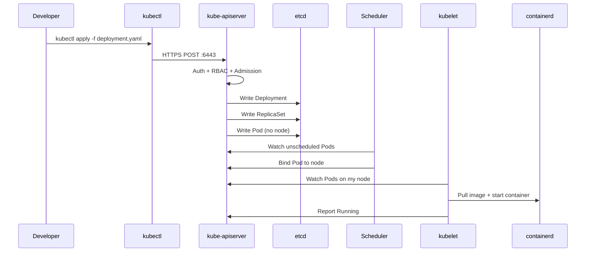
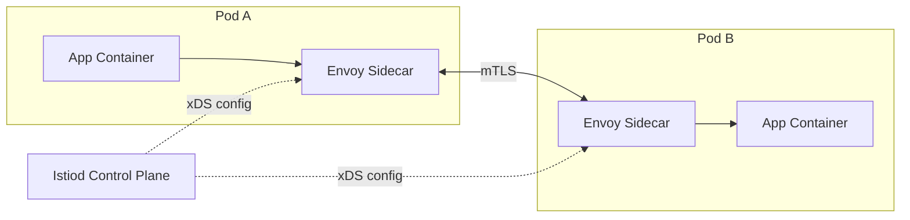
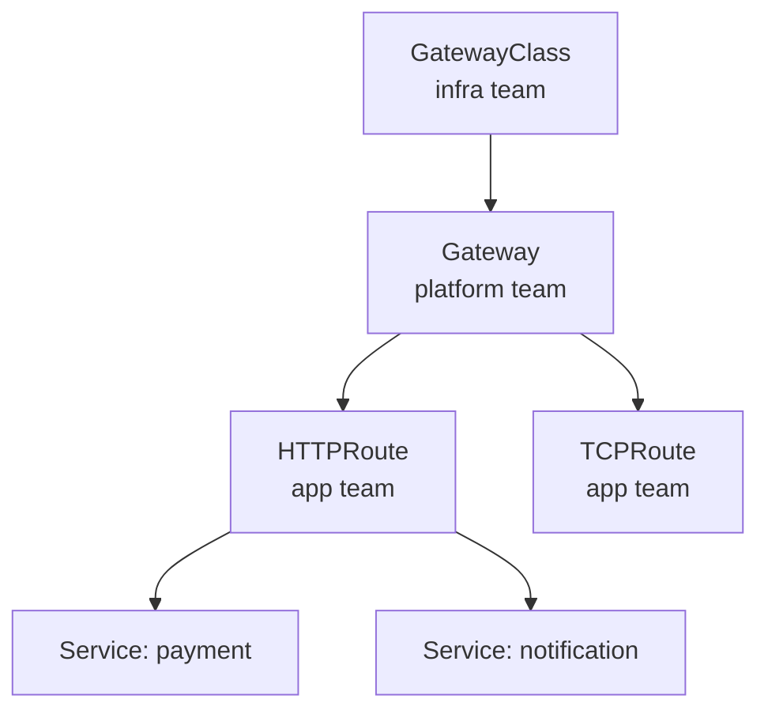
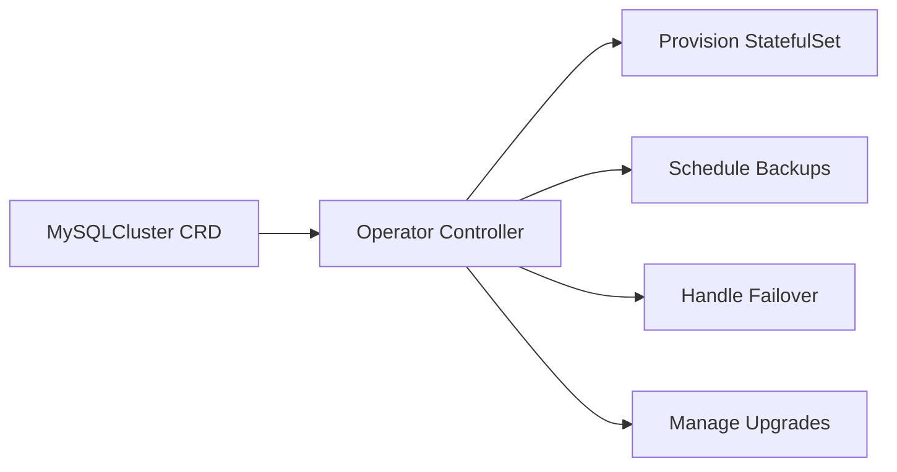

# ☸ KUBERNETES — V1 July 2025 | Notes & Concepts (Enhanced Edition)

> **Version:** V1 | **Month:** July 2025 | **Status:** Active  
> **Author:** Suraj Gomase | TCS | CMG Project | Senior DevOps / SRE  
> **Rule:** Add new topics to THIS FILE throughout July 2025  
> **Next Version:** V2_August2025 starts August 2025 — zero duplication from V1

---

## 📋 VERSION REGISTRY

### Topics Covered in V1 (V2 must NOT duplicate)

| Range | Sections |
|---|---|
| S01–S12 | Architecture, Pods, ReplicaSet, Deployments, Services & DNS, Networking, Ingress, Network Policies, Storage, ConfigMaps & Secrets, StatefulSet, DaemonSet |
| S13–S23 | Jobs & CronJobs, Scheduling, RBAC & Security, Pod Security Standards, HA, Scaling, Observability, Cluster Upgrade, EKS, Service Mesh, Cheat Sheet |
| S24–S36 | **NEW July 2025:** Labels/Annotations/Finalizers, env/envFrom/Downward API, Gateway API, Volumes, Priority Classes, Auth & Authorization, Image Security & TLS, Helm, ArgoCD & FluxCD, CRDs & Operators, kubeadm/Kind/Minikube, Backup & DR, YAML Mistakes |

### Monthly Versioning Rules
- **Same month** → add content to THIS file
- **New month** → create V2_August2025 file, zero duplication
- **Cross-reference** → V2 uses "See V1-July2025 Section SXX" for overlap
- **Uploaded file** = master copy — preserve all manual edits

---

# PHASE 1 — FUNDAMENTALS

## S01 — ARCHITECTURE

**WHAT:** Kubernetes (K8s) is an open-source CONTAINER ORCHESTRATION PLATFORM that automates deployment, scaling, self-healing, load balancing, storage, and config management of containerized apps.

**WHY:** Manually managing containers across hundreds of servers is impossible. Without K8s: no auto-restart on crash, no service discovery, no auto-scaling, no zero-downtime deployments — complete chaos at scale.

**HOW:** Declare DESIRED STATE in YAML → K8s Control Plane watches actual state → Controllers reconcile continuously → Cluster always matches desired state.

### History & CNCF

| Year | Milestone |
|---|---|
| 2003 | Google builds Borg — internal manager running billions of containers |
| 2006 | Google builds Omega — improved Borg |
| 2014 | Google open-sources Kubernetes. CNCF hosts it. |
| 2017 | AWS EKS, Azure AKS, GCP GKE all GA |
| 2024 | K8s industry standard — 80%+ of containerized production workloads |

> **CNCF** = Cloud Native Computing Foundation. Hosts K8s, Prometheus, Helm, ArgoCD, and 100+ cloud-native projects. Ensures vendor-neutral governance.

### Cluster Architecture

```
KUBERNETES CLUSTER
┌─────────────────────────────────────────────────────────────────┐
│  CONTROL PLANE (Brain)                                          │
│  ┌──────────────┐  ┌──────┐  ┌───────────┐  ┌─────────────┐  │
│  │kube-apiserver│  │ etcd │  │ scheduler │  │ ctrl-manager│  │
│  │  PORT: 6443  │  │2379  │  │filter+score│  │(reconcile)  │  │
│  └──────┬───────┘  └──────┘  └───────────┘  └─────────────┘  │
└─────────┼───────────────────────────────────────────────────────┘
          ↑ kubectl / Jenkins / ArgoCD / Helm
┌──────────────────────────┐   ┌──────────────────────────┐
│  WORKER NODE 1           │   │  WORKER NODE 2           │
│  kubelet | kube-proxy    │   │  kubelet | kube-proxy    │
│  containerd (CRI)        │   │  containerd (CRI)        │
│  [Pod][Pod][Pod]         │   │  [Pod][Pod]              │
└──────────────────────────┘   └──────────────────────────┘
```

### Mermaid — API Request Flow



### Control Plane Components — Point-Wise

- **kube-apiserver:** Front door. ALL components talk ONLY through it. Port 6443 HTTPS. Stateless → run multiple for HA. Validates Auth→RBAC→Admission→etcd write.
- **etcd:** K8s database. Stores ALL cluster state (Pods, Services, Secrets, RBAC). Raft consensus — ensures all nodes agree on cluster state at all times. Ports 2379/2380. If lost → cluster blind. ALWAYS backup before upgrades!
- **kube-scheduler:** Assigns Pods to nodes. Phase 1 Filter (eligible nodes) → Phase 2 Score (best fit) → Phase 3 Bind (writes nodeName). Checks: CPU/RAM, taints, affinity, volumes.
- **controller-manager:** Collection of background control loops that continuously reconcile actual vs desired state. Node Controller (detects failures), RS Controller (maintains replicas), Deployment Controller (manages RSs), Endpoints Controller (updates Pod IPs in Services).
- **cloud-controller-manager:** Connects K8s to cloud provider APIs. Provisions LBs (ALB/NLB), manages cloud node lifecycle. On EKS replaced by AWS-specific controllers.

### Worker Node Components — Point-Wise

- **kubelet:** THE node agent. ONLY component that physically starts containers. Registers with apiserver, watches for Pods assigned to its node, calls containerd, mounts volumes, runs health probes, reports status back.
- **kube-proxy:** Service routing. Watches apiserver for Service/Endpoints changes → writes iptables DNAT rules. No real process listens on ClusterIP — pure kernel rules.
- **containerd:** CRI runtime. kubelet delegates all container ops via gRPC. Docker deprecated in K8s v1.24. Chain: kubelet → CRI gRPC → containerd → runc → Linux namespaces → process.

### API Request Flow — Step by Step

1. kubectl reads `~/.kube/config` → API server URL + CA cert
2. HTTPS POST to kube-apiserver:6443
3. Authentication — Who are you? (client cert / Bearer token / ServiceAccount JWT)
4. Authorization — RBAC check: does user have permission?
5. Mutating Admission Webhooks — inject sidecars, add labels, set defaults (Vault Agent)
6. Validating Admission Webhooks — approve or reject (OPA Gatekeeper, PSA)
7. Write Deployment object to etcd
8. Deployment Controller watches etcd → creates ReplicaSet
9. RS Controller → creates Pod objects in etcd (no node assigned yet)
10. Scheduler: Filter nodes → Score → writes nodeName to Pod spec
11. kubelet on assigned node → containerd pulls image → container starts
12. kubelet reports Running status → etcd updated → kubectl shows Running

### Comparison: Kubernetes vs Docker vs Swarm vs ECS

| Feature | Kubernetes | Docker Swarm | Amazon ECS |
|---|---|---|---|
| Orchestration | Full enterprise | Simple | AWS-native |
| Auto-scaling | HPA/VPA/KEDA/CA | Basic | Service Auto Scaling |
| Self-healing | Full | Basic | Full |
| Multi-cloud | Yes | Yes | AWS only |
| Ecosystem | Massive (CNCF) | Declining | AWS services |
| Learning curve | Steep | Easy | Medium |
| Best for | Production microservices | Simple apps | AWS-native teams |

---

# PHASE 2 — KUBERNETES OBJECTS

## S02 — PODS

**WHAT:** Pod is the smallest deployable unit. Wraps 1+ containers sharing same network namespace (same IP) and storage volumes.

**WHY:** K8s needs abstraction over container runtimes. Pod provides: shared localhost (127.0.0.1 between containers), shared volumes, co-scheduling guarantee (all containers on same node).

**HOW:** kubelet reads Pod spec → containerd pulls image → Linux namespace created → volumes mounted → containers started → health probes run → status reported to apiserver.

### Pod Lifecycle Phases

| Phase | Meaning | Common Cause |
|---|---|---|
| Pending | Node not assigned or image pulling or PVC not bound | Insufficient resources, affinity constraints |
| Running | At least 1 container running | Normal state |
| Succeeded | All containers exited 0 | Completed Jobs |
| Failed | All terminated, ≥1 non-zero exit | App crash, OOMKilled |
| Unknown | apiserver cannot reach kubelet | Node failure, network partition |
| Terminating | kubectl delete sent, preStop hook running | Manual delete, rolling update |

### Pod Conditions

| Condition | When True |
|---|---|
| PodScheduled | Scheduler assigned Pod to a node |
| Initialized | All init containers completed successfully |
| ContainersReady | All containers passed readiness probe |
| Ready | Pod added to Service Endpoints — traffic flows |

### Health Probes — Point-Wise

- **livenessProbe:** Is container ALIVE? Failure → kubelet RESTARTS container. Detects deadlocks, zombies. Use `initialDelaySeconds` so app has time to start.
- **readinessProbe:** Is container READY for traffic? Failure → Pod REMOVED from Service Endpoints. Detects warm-up period, DB connection failures.
- **startupProbe:** Protects slow-starting JVM apps. Disables liveness until startup completes. `failureThreshold × periodSeconds` = max allowed startup time.

```yaml
# Production probe config (Spring Boot — CMG Payment Service)
livenessProbe:
  httpGet:
    path: /actuator/health/liveness
    port: 8080
  initialDelaySeconds: 30   # Wait before first check
  periodSeconds: 10
  failureThreshold: 3       # Restart after 3 failures
readinessProbe:
  httpGet:
    path: /actuator/health/readiness
    port: 8080
  initialDelaySeconds: 15
  periodSeconds: 5
  failureThreshold: 3       # Remove from Endpoints after 3 failures
startupProbe:
  httpGet:
    path: /actuator/health
    port: 8080
  failureThreshold: 30
  periodSeconds: 10         # 30×10=300s=5min max to start
```

### restartPolicy

| Policy | Behavior | Use Case |
|---|---|---|
| Always | Restart on ANY exit (default) | Deployments — services must always run |
| OnFailure | Restart only on non-zero exit | Jobs |
| Never | Never restart | One-shot debug/test Pods |

### Multi-Container Patterns

| Feature | Init Container | Sidecar Container |
|---|---|---|
| Timing | Runs BEFORE main, sequentially | Runs CONCURRENTLY with main |
| Exit | Must exit 0 to proceed | Runs forever (normally) |
| Use case | wait-for-DB, run migrations, set permissions | Fluent Bit, Vault Agent, Envoy proxy |
| Lifecycle | Disappears after main starts | Same lifecycle as main Pod |

### Production Pod Security Template

```yaml
apiVersion: v1
kind: Pod
metadata:
  name: payment-pod
  namespace: cmg-payments
  labels:
    app: payment-service     # ✅ semantic app label
    tier: backend            # ✅ not tier: "1"
    env: prod                # ✅ not env: "red"
  annotations:
    prometheus.io/scrape: "true"
    prometheus.io/port: "8080"
spec:
  automountServiceAccountToken: false   # ✅ spec level, NOT metadata
  securityContext:                      # ✅ Pod-level securityContext
    runAsNonRoot: true
    runAsUser: 1000
    runAsGroup: 1000
    fsGroup: 1000                       # ✅ fsGroup ONLY at pod level
  initContainers:
  - name: wait-for-db
    image: busybox:1.35                 # ✅ pinned version
    command: ['sh', '-c', 'until nc -z oracle-db 1521; do sleep 2; done']
  containers:
  - name: payment-service
    image: 123456789.dkr.ecr.eu-west-2.amazonaws.com/payment:v1.2.0  # ✅ pinned
    imagePullPolicy: IfNotPresent
    ports:
    - name: http                        # ✅ named correctly (http not metrics)
      containerPort: 8080
    - name: metrics                     # ✅ named correctly
      containerPort: 9090
    resources:
      requests: {memory: "256Mi", cpu: "250m"}
      limits:   {memory: "512Mi", cpu: "500m"}
    securityContext:                    # ✅ Container-level securityContext
      allowPrivilegeEscalation: false
      readOnlyRootFilesystem: true
      capabilities:
        drop: ["ALL"]                   # ✅ Drop all capabilities
      seccompProfile:
        type: RuntimeDefault            # ✅ Required for PSS Restricted
    volumeMounts:
    - name: tmp                         # ✅ writable scratch for readOnlyRootFilesystem
      mountPath: /tmp
    - name: nginx-cache
      mountPath: /var/cache/nginx
    - name: nginx-run
      mountPath: /var/run
    lifecycle:
      preStop:
        exec:
          command: ["/bin/sh", "-c", "sleep 10"]
    livenessProbe:
      httpGet: {path: /actuator/health/liveness, port: 8080}
      initialDelaySeconds: 30
      periodSeconds: 10
      failureThreshold: 3
    readinessProbe:
      httpGet: {path: /actuator/health/readiness, port: 8080}
      initialDelaySeconds: 15
      periodSeconds: 5
      failureThreshold: 3
  volumes:
  - name: tmp
    emptyDir: {}                        # ✅ emptyDir for writable paths
  - name: nginx-cache
    emptyDir: {}
  - name: nginx-run
    emptyDir: {}
  terminationGracePeriodSeconds: 60
```

### Pod Error States — Quick Fix Guide

| Error | Exit Code | Cause | First Fix |
|---|---|---|---|
| ImagePullBackOff | — | Wrong image/tag or no ECR creds | Fix image; check IAM/imagePullSecret |
| CrashLoopBackOff | 1/137 | App crashes repeatedly | `kubectl logs --previous` |
| OOMKilled | 137 | Memory limit exceeded (SIGKILL) | Increase `limits.memory` |
| Pending | — | No node fits or PVC not bound | `kubectl describe pod` → Events |
| CreateContainerConfigError | — | Missing ConfigMap/Secret | `kubectl get cm,secret -n ns` |
| RunContainerError | 126/127 | Wrong command / permission denied | Fix ENTRYPOINT in Dockerfile |

### Graceful Termination Flow

```
kubectl delete pod →
  1. Pod removed from Service Endpoints immediately (no new traffic)
  2. preStop hook runs (e.g. sleep 10 — LB drains connections)
  3. SIGTERM sent to container PID 1
  4. terminationGracePeriodSeconds countdown (default 30s, CMG uses 60s)
  5. SIGKILL if not done (force kill)
```

### Troubleshooting Commands

```bash
kubectl get pods -n cmg-payments -o wide --show-labels
kubectl describe pod payment-abc123 -n cmg-payments    # Events section = key diagnostic
kubectl logs payment-abc123 --previous -n cmg-payments  # CRITICAL: previous container
kubectl exec -it payment-abc123 -- /bin/bash
kubectl top pod --containers -n cmg-payments
kubectl get events -n cmg-payments --sort-by='.lastTimestamp'

# Debug container exit code
# 0   = success
# 1   = application error
# 126 = permission denied on startup script
# 127 = command not found (wrong ENTRYPOINT)
# 137 = SIGKILL — OOMKilled or admin force kill
# 143 = SIGTERM — graceful shutdown (normal termination)

# Override command to investigate crash
# Set command: ["sleep", "3600"] → exec in → run startup manually
```

---

## S03 — REPLICASET

**WHAT:** ReplicaSet ensures N identical Pod replicas always running using label selector and reconciliation loop.

**WHY:** Self-healing. Pod crashes → RS creates replacement immediately. Ensures desired count always maintained without manual intervention.

**HOW:** Reconciliation loop runs continuously: `actual count ≠ desired count` → create or delete Pods to match.

### Key Points

- **NEVER use directly** — Deployment manages RSs and adds rolling update + rollback
- **Selector is IMMUTABLE** after creation — changing requires delete + recreate
- **Old RSs kept** (scaled to 0) after Deployment update — enables instant rollback
- **revisionHistoryLimit** controls how many old RSs to keep (default 10, CMG uses 5)
- **Ownership via ownerReferences** — RS has ownerRef to Deployment; Pods have ownerRef to RS

```yaml
apiVersion: apps/v1
kind: ReplicaSet
metadata:
  name: payment-rs
  namespace: cmg-payments
spec:
  replicas: 3
  selector:
    matchLabels:
      app: payment-service    # IMMUTABLE after creation
  template:
    metadata:
      labels:
        app: payment-service  # MUST match selector exactly
    spec:
      containers:
      - name: payment-service
        image: ecr.../payment:v1.2.0
```

---

## S04 — DEPLOYMENTS

**WHAT:** Deployment manages Pods via ReplicaSets providing rolling updates, rollbacks, and replica count maintenance.

**WHY:** Update app versions without downtime. Roll back instantly if something breaks. Maintain desired Pod count automatically.

**HOW:** Image change → new RS created → Pods migrated per maxSurge/maxUnavailable → old RS scaled to 0 (kept for rollback).

### Update Strategies

| Strategy | Behavior | Downtime | Use Case |
|---|---|---|---|
| RollingUpdate | Replaces Pods gradually | Zero (if maxUnavailable:0) | All stateless services |
| Recreate | Kills ALL old Pods first | Yes — full outage | Breaking DB schema changes |
| Blue-Green | Two Deployments, switch Service selector | None — instant cutover | Zero-risk releases |
| Canary | Small % to new version, monitor, increase | None | Risk mitigation |

### Rolling Update Internals

```
replicas=4, maxSurge=1, maxUnavailable=0:

Start:  [v1][v1][v1][v1]
Step 1: [v1][v1][v1][v1][v2]  ← surge: +1 new Pod created
Step 2: [v1][v1][v1][v2]      ← v2 readiness passes → kill 1 v1
Step 3: [v1][v1][v1][v2][v2]  ← create another v2
Step 4: [v1][v1][v2][v2]      ← another v2 ready → kill 1 v1
...
Done:   [v2][v2][v2][v2]      ← ZERO DOWNTIME

Rollback = scale up old RS (v1) + scale down current RS (v2)
          No new RS created on rollback — re-activates existing RS
```

### Production Deployment YAML

```yaml
apiVersion: apps/v1
kind: Deployment
metadata:
  name: payment-service
  namespace: cmg-payments
  annotations:
    kubernetes.io/change-cause: "v2.0 - fixed payment processing bug"  # shows in rollout history
spec:
  replicas: 3
  selector:
    matchLabels:
      app: payment-service    # IMMUTABLE after creation
  strategy:
    type: RollingUpdate
    rollingUpdate:            # ONLY maxSurge + maxUnavailable go here
      maxSurge: 1             # ✅ correct location
      maxUnavailable: 0
  revisionHistoryLimit: 5     # ✅ goes under spec, NOT under rollingUpdate
  minReadySeconds: 10         # ✅ goes under spec, NOT under rollingUpdate
  progressDeadlineSeconds: 600
  template:
    metadata:
      labels:
        app: payment-service
    spec:
      containers:
      - name: payment-service
        image: ecr.../payment:v2.0
        resources:
          requests: {memory: "256Mi", cpu: "250m"}
          limits:   {memory: "512Mi", cpu: "500m"}
```

### Key Commands

```bash
kubectl set image deploy/payment-service payment-service=ecr.../payment:v2.0
kubectl rollout status deploy/payment-service -n cmg-payments
kubectl rollout history deploy/payment-service
kubectl rollout undo deploy/payment-service --to-revision=1
kubectl rollout restart deploy/payment-service   # rolling restart, same image
kubectl scale deploy payment-service --replicas=10
kubectl rollout pause deploy/payment-service     # pause mid-rollout
kubectl rollout resume deploy/payment-service    # resume
```

---

## S05 — SERVICES & DNS

**WHAT:** Service provides a stable virtual IP and DNS name for dynamic Pods found via label selector.

**WHY:** Pod IPs change every restart. Hardcoding Pod IPs breaks on every deployment. Service DNS (stable) → ClusterIP (stable) → Endpoints (dynamic Pod IPs).

**HOW:** CoreDNS auto-creates A record: `svc.ns.svc.cluster.local` → ClusterIP. kube-proxy writes iptables DNAT rules: ClusterIP:port → random healthy Pod IP from Endpoints.

> **IMPORTANT:** Service DNS does NOT point directly to a Pod.  
> Flow: DNS Query → CoreDNS returns ClusterIP → iptables DNAT on node → Pod IP from Endpoints.  
> The ClusterIP never changes even when ALL Pods are replaced.

### All 5 Service Types

| Type | What | DNS Behavior | Use Case |
|---|---|---|---|
| ClusterIP (default) | Internal VIP only | svc.ns.svc.cluster.local → ClusterIP | Internal APIs, DBs, caches |
| NodePort | External via NodeIP:30xxx | Same + NodeIP:NodePort externally | Dev/test ONLY |
| LoadBalancer | Cloud LB with public IP | cloud-controller provisions ALB/NLB | Production APIs |
| ExternalName | CNAME to external hostname | CoreDNS returns CNAME — no Pods | External RDS alias |
| Headless (clusterIP:None) | Returns Pod IPs directly | DNS returns all Pod IPs — no VIP | StatefulSets |

### DNS Formats

```
payment-service                                    # same namespace
payment-service.cmg-payments                       # with namespace
payment-service.cmg-payments.svc.cluster.local     # full FQDN (always works)
mysql-0.mysql-headless.cmg-data.svc.cluster.local  # StatefulSet per-pod DNS
```

### Service YAML Examples

```yaml
# ClusterIP (default)
apiVersion: v1
kind: Service
metadata:
  name: payment-service
  namespace: cmg-payments
spec:
  type: ClusterIP
  selector:
    app: payment-service  # must EXACTLY match Pod labels
  ports:
  - name: http
    port: 80
    targetPort: 8080
  sessionAffinity: None   # or ClientIP for sticky sessions

---
# Headless Service (for StatefulSet)
apiVersion: v1
kind: Service
metadata:
  name: mysql-headless
  namespace: cmg-data
spec:
  clusterIP: None         # THIS makes it headless
  selector:
    app: mysql
  ports:
  - name: mysql
    port: 3306

---
# ExternalName
apiVersion: v1
kind: Service
metadata:
  name: oracle-db
  namespace: cmg-payments
spec:
  type: ExternalName
  externalName: cmg-oracle.abcdef.eu-west-2.rds.amazonaws.com
```

### EndpointSlices

- Modern replacement for Endpoints object (K8s 1.21+ default)
- Max 100 endpoints per slice — only affected slice updated on Pod change
- Much more efficient for large services (1000+ Pods)

```bash
kubectl get endpointslices -n cmg-payments
kubectl describe endpointslice payment-service-xyz -n cmg-payments
```

### Service Troubleshooting

```bash
# Step 1: Check Endpoints — if EMPTY = selector mismatch (most common!)
kubectl get endpoints payment-service -n cmg-payments

# Step 2: Compare selector vs Pod labels
kubectl describe svc payment-service | grep Selector
kubectl get pods --show-labels -n cmg-payments

# Step 3: Is readinessProbe passing?
kubectl get pods -n cmg-payments   # READY column must be 1/1

# Step 4: Test internally
kubectl exec -it debug-pod -- curl http://payment-service.cmg-payments:80/health

# Step 5: Check kube-proxy rules
iptables -t nat -L -n | grep <ClusterIP>
```

---

## S06 — NETWORKING (CNI · kube-proxy · CoreDNS)

**WHAT:** K8s networking implements a flat network model where all Pods communicate without NAT.

**WHY:** Without a network standard, Pod-to-Pod communication would require complex manual configuration across hundreds of nodes.

**HOW:** CNI plugins implement the network model. kube-proxy implements Service routing. CoreDNS provides DNS.

### 3 Kubernetes Networking Rules

1. Every Pod gets unique IP — no two Pods share an IP
2. All Pods reach all other Pods WITHOUT NAT
3. Pod IP seen from inside = IP seen from outside (no masquerading inside cluster)

### Network Layers

```
Node Network:    EC2 IPs from VPC (10.0.1.10, 10.0.2.10...)
Pod Network:     Pod CIDR (10.244.0.0/16) — managed by CNI
Service Network: ClusterIP CIDR (10.96.0.0/12) — virtual, managed by kube-proxy
```

### CNI Plugin Comparison

| Plugin | Networking Type | NetworkPolicy | EKS Support | Best For |
|---|---|---|---|---|
| AWS VPC CNI | Native VPC IPs (no overlay) | With Calico add-on | Default | EKS production |
| Calico | BGP routing + overlay | Full L3/L4 | Add-on | NetworkPolicy enforcement |
| Cilium | eBPF (no iptables) | Full L3/L4/L7 | Add-on | High perf + L7 policy |
| Flannel | VXLAN overlay | NOT supported | Manual | Simple/dev only |
| Weave Net | VXLAN + encryption | Supported | Manual | Encrypted comms |

### Packet Flows

```
Same-node Pod-to-Pod:
  Pod-A (eth0) → veth pair → cni0 bridge → veth pair → Pod-B (eth0)
  Pure kernel bridge. Sub-millisecond latency.

Cross-node (AWS VPC CNI — no overlay):
  Pod-A (real VPC IP 10.0.1.50) → VPC routing table → Pod-B (10.0.2.30)
  No encapsulation. Native VPC speed.

Cross-node (VXLAN — Flannel):
  Pod-A → flannel.1 VTEP → UDP:8472 encapsulation → Node-2 → decap → Pod-B
  ~50 byte overhead per packet.

Pod-to-Service:
  Pod → ClusterIP:80 → iptables DNAT on node → Pod IP:8080
  ClusterIP has NO real listener — pure kernel NAT.

Pod-to-Internet:
  Pod → Node eth0 → SNAT (masquerade to Node IP) → Internet
```

### kube-proxy Modes

| Mode | Performance | Algorithm | Use Case |
|---|---|---|---|
| iptables (default) | O(n) linear scan | Random only | Small-medium clusters (<1000 Services) |
| IPVS | O(1) hash tables | 8 algorithms (rr/lc/sh/dh...) | Large clusters (>1000 Services) |
| userspace (DEPRECATED) | Slowest | — | Never use |

### CoreDNS

- Runs as 2+ Pod Deployment in kube-system namespace
- Every Pod `/etc/resolv.conf` nameserver → CoreDNS ClusterIP
- Auto-registers every Service as DNS A record
- **ndots:5 problem:** 5 extra lookups for external names — fix with `ndots:2`

```bash
kubectl get pods -n kube-system -l k8s-app=kube-dns
kubectl logs -n kube-system -l k8s-app=kube-dns
kubectl rollout restart deploy/coredns -n kube-system  # restart if broken

# Test DNS from inside Pod
kubectl exec -it debug-pod -- nslookup payment-service.cmg-payments.svc.cluster.local
kubectl exec -it debug-pod -- cat /etc/resolv.conf
```

### VXLAN Internals

```
VXLAN Packet Structure:
┌────────────────────────────────────────────────────────┐
│ Outer Ethernet Header (node-1 MAC → node-2 MAC)        │
│ Outer IP Header (10.0.1.10 → 10.0.2.10) ← node IPs   │
│ Outer UDP Header (src: random, dst: 8472)               │
│ VXLAN Header (VNI: 1)                                   │
│ ┌──────────────────────────────────────────────────┐   │
│ │ Inner IP (10.244.1.5 → 10.244.2.5) ← Pod IPs   │   │
│ │ TCP/UDP Payload (actual application data)         │   │
│ └──────────────────────────────────────────────────┘   │
└────────────────────────────────────────────────────────┘
Overhead: ~50 bytes per packet
```

---

## S07 — INGRESS

**WHAT:** Ingress manages external HTTP/HTTPS access via host/path routing using ONE cloud LB.

**WHY:** 50 services × LoadBalancer = 50 cloud LBs = very expensive. Ingress = 1 LB for the controller, unlimited routing rules behind it.

**HOW:** Ingress Controller (NGINX/AWS ALB) watches Ingress objects → configures actual LB. Traffic: Internet → ALB → Controller → ClusterIP Service → Pod.

### Key Points

- **Ingress Object:** Just routing rules in YAML. By itself does nothing.
- **Ingress Controller:** The actual implementation (NGINX Pod or AWS ALB Controller).
- **pathType: Prefix:** `/api` matches `/api`, `/api/payments`, `/api/any/subpath`
- **pathType: Exact:** `/api` matches ONLY `/api`

### AWS ALB Ingress YAML

```yaml
apiVersion: networking.k8s.io/v1
kind: Ingress
metadata:
  name: cmg-ingress
  namespace: cmg-payments
  annotations:
    kubernetes.io/ingress.class: alb
    alb.ingress.kubernetes.io/scheme: internet-facing
    alb.ingress.kubernetes.io/target-type: ip
    alb.ingress.kubernetes.io/certificate-arn: arn:aws:acm:eu-west-2:123:cert/abc
    alb.ingress.kubernetes.io/group.name: cmg-shared-alb  # share 1 ALB
    alb.ingress.kubernetes.io/ssl-redirect: "443"
    alb.ingress.kubernetes.io/wafv2-acl-arn: arn:aws:wafv2:...  # WAF integration
spec:
  ingressClassName: alb
  rules:
  - host: api.cmg.gov.uk
    http:
      paths:
      - path: /api/payments
        pathType: Prefix
        backend:
          service: {name: payment-service, port: {number: 80}}
      - path: /api/notifications
        pathType: Prefix
        backend:
          service: {name: notification-service, port: {number: 80}}
  - host: admin.cmg.gov.uk
    http:
      paths:
      - path: /
        pathType: Prefix
        backend:
          service: {name: admin-service, port: {number: 80}}
```

### TLS with cert-manager

```yaml
# ClusterIssuer
apiVersion: cert-manager.io/v1
kind: ClusterIssuer
metadata: {name: letsencrypt-prod}
spec:
  acme:
    server: https://acme-v02.api.letsencrypt.org/directory
    email: devops@cmg.gov.uk
    privateKeySecretRef: {name: le-account-key}
    solvers:
    - http01: {ingress: {class: alb}}

# Add to Ingress:
# annotations:
#   cert-manager.io/cluster-issuer: letsencrypt-prod
# spec.tls:
# - hosts: [api.cmg.gov.uk]
#   secretName: cmg-tls-cert
```

---

## S08 — NETWORK POLICIES

**WHAT:** NetworkPolicy defines ingress/egress rules controlling which Pods can communicate — the Pod-level firewall.

**WHY:** K8s default: ALL Pods reach ALL Pods (flat network). In payment system, a compromised notification Pod could reach payment DBs. NetworkPolicy enforces zero-trust.

**HOW:** CNI plugin (Calico/Cilium) reads NetworkPolicy → translates to kernel rules. **Flannel alone silently IGNORES NetworkPolicy!**

### Zero-Trust Pattern

```yaml
# Step 1: Default deny ALL in namespace
apiVersion: networking.k8s.io/v1
kind: NetworkPolicy
metadata:
  name: default-deny-all
  namespace: cmg-payments
spec:
  podSelector: {}        # {} = ALL Pods
  policyTypes: [Ingress, Egress]
  # No rules = deny everything

---
# Step 2: Allow specific traffic
apiVersion: networking.k8s.io/v1
kind: NetworkPolicy
metadata:
  name: allow-notify-to-payment
  namespace: cmg-payments
spec:
  podSelector:
    matchLabels:
      app: payment-service
  policyTypes: [Ingress]
  ingress:
  - from:
    - namespaceSelector:
        matchLabels:
          kubernetes.io/metadata.name: cmg-notifications
      podSelector:
        matchLabels:
          app: notification-service
    ports:
    - protocol: TCP
      port: 8080

---
# Step 3: Always allow DNS egress (or nothing works!)
apiVersion: networking.k8s.io/v1
kind: NetworkPolicy
metadata:
  name: allow-dns-egress
  namespace: cmg-payments
spec:
  podSelector: {}
  policyTypes: [Egress]
  egress:
  - to:
    - namespaceSelector:
        matchLabels:
          kubernetes.io/metadata.name: kube-system
    ports:
    - protocol: UDP
      port: 53
```

### Troubleshooting Network Policies

```bash
# Test if traffic is blocked
kubectl exec -it payment-pod -- curl -v http://oracle-db:1521
# Timeout = likely NetworkPolicy blocking

# List all NetworkPolicies
kubectl get networkpolicies -n cmg-payments

# Verify CNI supports NetworkPolicy
kubectl get pods -n kube-system | grep -E 'calico|cilium'

# Cilium: check dropped packets
cilium monitor --type drop
```

---

## S09 — STORAGE: PV · PVC · STORAGECLASS · ESO

**WHAT:** PV = actual storage (EBS disk). PVC = developer request. StorageClass = auto-provisioner. ESO = External Secrets Operator syncing secrets from vaults.

**WHY:** Container data lost on restart. Databases, uploads, ML models need storage surviving Pod restarts and node failures.

**HOW:** PVC created → StorageClass calls EBS CSI driver → EBS volume provisioned → PV auto-created → PVC bound → Pod mounts PVC → data persists independently of Pod lifecycle.

### Static vs Dynamic Provisioning

| Feature | Static | Dynamic |
|---|---|---|
| Who creates PV? | Admin manually | StorageClass auto-creates |
| Admin overhead | High per request | One-time StorageClass setup |
| Sizing | Pre-allocated (often wrong) | Exact size requested |
| Self-service | No | Yes |
| Use case | Legacy on-prem | Standard EKS/GKE/AKS |

### Access Modes

| Mode | Who Can Mount | Backend | Use Case |
|---|---|---|---|
| ReadWriteOnce (RWO) | 1 node R/W | EBS, Azure Disk | Databases (single node) |
| ReadOnlyMany (ROX) | Many nodes read-only | NFS | Shared static content |
| ReadWriteMany (RWX) | Many nodes R/W | EFS, NFS | Shared file processing |
| ReadWriteOncePod (RWOP) | Single Pod only | EBS CSI v1.11+ | Strictest isolation |

> **EKS Rule:** EBS = RWO ONLY. Need shared writable storage across Pods on different nodes → **MUST use EFS** with efs-csi-driver.

### Reclaim Policies

| Policy | What Happens | Use Case |
|---|---|---|
| Retain | Data PRESERVED. PV stays Released. Admin cleans up. | **PRODUCTION — never auto-delete** |
| Delete | PV + EBS auto-deleted on PVC delete | Dev/test. Default for dynamic — verify! |
| Recycle (DEPRECATED) | Data wiped. DO NOT USE. | Never |

### Dynamic StorageClass (EKS)

```yaml
apiVersion: storage.k8s.io/v1
kind: StorageClass
metadata:
  name: gp3-encrypted
  annotations:
    storageclass.kubernetes.io/is-default-class: "true"
provisioner: ebs.csi.aws.com
parameters:
  type: gp3
  iops: "3000"
  throughput: "125"
  encrypted: "true"
  kmsKeyId: arn:aws:kms:eu-west-2:123:key/abc
reclaimPolicy: Retain          # ✅ ALWAYS Retain in production
allowVolumeExpansion: true     # resize PVC without recreation
volumeBindingMode: WaitForFirstConsumer  # EBS created in same AZ as Pod

---
# PVC
apiVersion: v1
kind: PersistentVolumeClaim
metadata:
  name: mysql-data-pvc
  namespace: cmg-data
spec:
  storageClassName: gp3-encrypted
  accessModes: [ReadWriteOnce]
  resources:
    requests:
      storage: 50Gi
```

### External Secrets Operator (ESO)

**WHAT:** ESO syncs secrets from AWS Secrets Manager/Vault/Azure KV into K8s Secrets automatically.

**WHY:** K8s Secrets in etcd (even encrypted) are less secure than dedicated vaults. ESO bridges enterprise vaults with K8s without secrets in Git or permanently in etcd.

**HOW:** ExternalSecret CRD (safe to commit) → ESO fetches from AWS SM via IRSA → creates/updates K8s Secret → refreshes hourly. Zero secrets in etcd permanently.

```yaml
# ClusterSecretStore — admin creates once
apiVersion: external-secrets.io/v1beta1
kind: ClusterSecretStore
metadata: {name: aws-secrets-manager}
spec:
  provider:
    aws:
      service: SecretsManager
      region: eu-west-2
      auth:
        jwt:
          serviceAccountRef: {name: external-secrets-sa, namespace: external-secrets}

---
# ExternalSecret — developer creates per app
apiVersion: external-secrets.io/v1beta1
kind: ExternalSecret
metadata: {name: payment-db-secret, namespace: cmg-payments}
spec:
  refreshInterval: 1h
  secretStoreRef: {name: aws-secrets-manager, kind: ClusterSecretStore}
  target:
    name: payment-db-credentials
    creationPolicy: Owner
    deletionPolicy: Retain       # keep K8s Secret if ExternalSecret deleted
  data:
  - secretKey: DB_PASSWORD
    remoteRef: {key: cmg/prod/payment/database, property: password}
  dataFrom:                      # bulk: ALL keys from one SM secret
  - extract: {key: cmg/prod/payment/all-config}
```

**ESO Benefits (CMG Project):**
- Secrets never in Git — ExternalSecret CRDs are safe to commit
- Auto-rotation: AWS SM rotates → ESO syncs within `refreshInterval`
- Full CloudTrail audit trail for every secret access
- IRSA integration: no hardcoded AWS creds for ESO itself
- Force refresh: `kubectl annotate externalsecret payment-db-secret force-sync=$(date +%s)`

### Volume Snapshots

```yaml
# VolumeSnapshotClass
apiVersion: snapshot.storage.k8s.io/v1
kind: VolumeSnapshotClass
metadata: {name: ebs-vsc}
driver: ebs.csi.aws.com
deletionPolicy: Delete

---
# Take snapshot before upgrade
apiVersion: snapshot.storage.k8s.io/v1
kind: VolumeSnapshot
metadata: {name: mysql-snap-20250725, namespace: cmg-data}
spec:
  volumeSnapshotClassName: ebs-vsc
  source:
    persistentVolumeClaimName: mysql-data-mysql-0

---
# Restore from snapshot
apiVersion: v1
kind: PersistentVolumeClaim
metadata: {name: mysql-restored, namespace: cmg-data}
spec:
  storageClassName: gp3-encrypted
  dataSource:
    name: mysql-snap-20250725
    kind: VolumeSnapshot
    apiGroup: snapshot.storage.k8s.io
  accessModes: [ReadWriteOnce]
  resources: {requests: {storage: 50Gi}}
```

---

## S10 — CONFIGMAPS & SECRETS

**WHAT:** ConfigMap: non-sensitive config. Secret: sensitive data. Both decouple config from container image.

**WHY:** Same image runs in dev/staging/prod with different config injected at runtime. No rebuild on config change.

**HOW:** CM/Secret created → Pod references via envFrom/env/volumeMount → K8s injects at Pod start.

### 3 Injection Methods

| Method | Field | Auto-Update | Notes |
|---|---|---|---|
| envFrom (all keys) | `configMapRef` / `secretRef` | ❌ Requires restart | Quick — all keys at once |
| env valueFrom (selective) | `configMapKeyRef` / `secretKeyRef` | ❌ Requires restart | Pick specific keys, rename |
| Volume mount (files) | `configMap` / `secret` in volumes | ✅ ~60s auto-update | Best for config files |

```yaml
env:
# Selective env var from ConfigMap
- name: DB_HOST
  valueFrom:
    configMapKeyRef: {name: payment-config, key: DB_HOST}
# Selective env var from Secret
- name: DB_PASSWORD
  valueFrom:
    secretKeyRef: {name: payment-secret, key: DB_PASSWORD}

envFrom:
# All keys from ConfigMap
- configMapRef: {name: payment-config}
# All keys from Secret
- secretRef: {name: payment-secret}

# Volume mount (auto-updates!)
volumeMounts:
- name: config-vol
  mountPath: /etc/config    # directory — auto-updates within 60s
- name: config-vol
  mountPath: /app/app.yaml
  subPath: application.yaml  # single file — NO auto-update

volumes:
- name: config-vol
  configMap:
    name: payment-config
    defaultMode: 0644
```

### Secret Security — 3 Layers

1. **RBAC** — separate `read-secret` permission from `read-configmap`
2. **etcd EncryptionConfig** — AES-CBC/AES-GCM encrypts Secrets before writing to disk
3. **External Secrets Operator** — AWS SM/Vault as authoritative source; K8s Secret is temporary cache

> **base64 ≠ encryption.** Anyone with `kubectl get secret` can instantly decode values.

---

## S11 — STATEFULSET

**WHAT:** StatefulSet manages stateful apps providing stable Pod names, ordered start/stop, and unique PVC per Pod.

**WHY:** Databases need stable network identity (mysql-0 always primary), own dedicated storage, and ordered startup (primary before replicas).

**HOW:** StatefulSet + Headless Service: each Pod gets stable DNS (`mysql-0.headless.ns.svc.cluster.local`). `volumeClaimTemplates` creates unique PVC per Pod.

### Deployment vs StatefulSet

| Feature | Deployment | StatefulSet |
|---|---|---|
| Pod names | Random: myapp-7d9f-abc | Stable ordinals: mysql-0,1,2 |
| Startup | ALL parallel | SEQUENTIAL 0→1→2 |
| Shutdown | ALL parallel | REVERSE 2→1→0 |
| Storage | Shared or none | Each Pod has OWN PVC |
| DNS | Service only | Stable per-pod via Headless |
| Use case | Web servers, APIs | DBs, Kafka, Redis, ZooKeeper |

```yaml
# Headless Service (required)
apiVersion: v1
kind: Service
metadata: {name: mysql-headless, namespace: cmg-data}
spec:
  clusterIP: None
  selector: {app: mysql}
  ports: [{name: mysql, port: 3306}]

---
# StatefulSet
apiVersion: apps/v1
kind: StatefulSet
metadata: {name: mysql, namespace: cmg-data}
spec:
  serviceName: mysql-headless   # references Headless Service
  replicas: 3
  selector: {matchLabels: {app: mysql}}
  volumeClaimTemplates:
  - metadata: {name: mysql-data}
    spec:
      accessModes: [ReadWriteOnce]
      storageClassName: gp3-encrypted
      resources: {requests: {storage: 50Gi}}
  template:
    metadata: {labels: {app: mysql}}
    spec:
      containers:
      - name: mysql
        image: mysql:8.0          # ✅ pinned version
        volumeMounts:
        - name: mysql-data
          mountPath: /var/lib/mysql

# Result:
# mysql-0 → PVC mysql-data-mysql-0 → 50Gi EBS (unique)
# mysql-0.mysql-headless.cmg-data.svc.cluster.local (stable DNS)
# Scale-down does NOT delete PVCs — data preserved
```

---

## S12 — DAEMONSET

**WHAT:** DaemonSet ensures ONE Pod per node. Auto-creates on new nodes, auto-deletes on removed nodes.

**WHY:** Log agents, metrics collectors, CNI plugins must run on EVERY node. DaemonSet guarantees this without manual scaling — node count = DaemonSet Pod count.

**HOW:** DaemonSet Controller watches nodes. New node joins → Pod created. Node removed → Pod deleted.

### Common Use Cases

| Use Case | Purpose | CMG Example |
|---|---|---|
| Fluent Bit / Fluentd | Collect logs from `/var/log/containers` | Ships to ELK Stack |
| Prometheus Node Exporter | CPU/Memory/Disk metrics per node | Feeds Grafana dashboards |
| Calico/Cilium agent | CNI plugin — must run on every node | NetworkPolicy enforcement |
| Falco | Runtime security via eBPF | Detects suspicious syscalls |
| AWS CloudWatch Agent | Node-level metrics | EKS monitoring |
| EBS/EFS CSI node driver | Volume attachment per node | Required for PVCs |

```yaml
apiVersion: apps/v1
kind: DaemonSet
metadata:
  name: fluent-bit
  namespace: logging
spec:
  selector: {matchLabels: {app: fluent-bit}}
  updateStrategy:
    type: RollingUpdate
    rollingUpdate: {maxUnavailable: 1}
  template:
    metadata: {labels: {app: fluent-bit}}
    spec:
      tolerations:
      - key: node-role.kubernetes.io/control-plane
        effect: NoSchedule   # also run on control plane nodes
      containers:
      - name: fluent-bit
        image: fluent/fluent-bit:2.1  # ✅ pinned
        volumeMounts:
        - name: varlog
          mountPath: /var/log
          readOnly: true
      volumes:
      - name: varlog
        hostPath: {path: /var/log}
```

---

## S13 — JOBS & CRONJOBS

**WHAT:** Job creates Pods that run until they succeed. CronJob creates Jobs on repeating schedules.

**WHY:** K8s workloads for one-time tasks (DB migration, data export) and scheduled tasks (nightly reports, cleanup) that shouldn't run as long-running services.

**HOW:** Job Controller watches Job completions. CronJob Controller creates Job at schedule time.

### Job

```yaml
apiVersion: batch/v1
kind: Job
metadata: {name: db-migration, namespace: cmg-payments}
spec:
  completions: 1         # total successes needed
  parallelism: 1         # concurrent Pods
  backoffLimit: 3        # retry count on failure
  activeDeadlineSeconds: 600  # kill if running >10min
  template:
    spec:
      restartPolicy: Never    # ✅ MUST be Never or OnFailure for Jobs
      containers:
      - name: migrate
        image: ecr.../payment:v2.0
        command: ["java", "-jar", "migrate.jar"]
```

### CronJob

```yaml
apiVersion: batch/v1
kind: CronJob
metadata: {name: nightly-report, namespace: cmg-reporting}
spec:
  schedule: "0 2 * * *"        # 2 AM daily
  # "*/5 * * * *"  = every 5 minutes
  # "0 0 1 * *"   = 1st of month midnight
  # "0 9 * * 1"   = every Monday 9 AM
  concurrencyPolicy: Forbid    # skip if previous still running
  startingDeadlineSeconds: 300 # skip if >5min late
  successfulJobsHistoryLimit: 3
  failedJobsHistoryLimit: 1
  jobTemplate:
    spec:
      backoffLimit: 2
      template:
        spec:
          restartPolicy: OnFailure
          containers:
          - name: reporter
            image: ecr.../reporter:v1.0
```

---

## S14 — SCHEDULING

**WHAT:** Kubernetes Scheduler assigns unscheduled Pods to nodes via 3 phases: Filter → Score → Bind.

**WHY:** Without intelligent scheduling: Pods pile on one node, AZ failures take all Pods, GPU workloads land on CPU nodes, resources wasted.

**HOW:** Scheduler watches apiserver for Pods with empty `nodeName`. Filter (eligible) → Score (best fit) → Bind (write nodeName to Pod spec).

### Scheduling Mechanisms

| Mechanism | What | Behavior | Example |
|---|---|---|---|
| nodeSelector | Simple label match | HARD — Pending if no match | `nodeSelector: {node-type: high-memory}` |
| Node Affinity (required) | Flexible HARD rule | Pending if no eligible node | matchExpressions with operators |
| Node Affinity (preferred) | SOFT rule | Places Pod even if no match | weight: 80, prefer eu-west-2a |
| Pod Anti-Affinity | Spread Pods away | HARD or SOFT | topologyKey: zone |
| Taints | Node repels Pods | NoSchedule/NoExecute/PreferNoSchedule | `role=jenkins:NoSchedule` |
| Tolerations | Pod allows tainted node | Allows but doesn't guarantee | match taint key+value+effect |
| TopologySpreadConstraints | Proportional distribution | maxSkew: balanced | maxSkew:1 across zones |

### YAML Examples

```yaml
# Node Affinity
spec:
  affinity:
    nodeAffinity:
      requiredDuringSchedulingIgnoredDuringExecution:  # HARD
        nodeSelectorTerms:
        - matchExpressions:
          - key: node-type
            operator: In
            values: [application, general]
      preferredDuringSchedulingIgnoredDuringExecution:  # SOFT
      - weight: 80
        preference:
          matchExpressions:
          - key: topology.kubernetes.io/zone
            operator: In
            values: [eu-west-2a]

# Pod Anti-Affinity (spread across AZs — essential for HA)
    podAntiAffinity:
      requiredDuringSchedulingIgnoredDuringExecution:
      - topologyKey: topology.kubernetes.io/zone
        labelSelector:
          matchLabels: {app: payment-service}

# TopologySpreadConstraints (proportional — better than Anti-Affinity)
  topologySpreadConstraints:
  - maxSkew: 1
    topologyKey: topology.kubernetes.io/zone
    whenUnsatisfiable: DoNotSchedule
    labelSelector:
      matchLabels: {app: payment-service}

# Taints and Tolerations
# kubectl taint nodes jenkins-node-1 role=jenkins:NoSchedule
  tolerations:
  - key: "role"
    operator: "Equal"
    value: "jenkins"
    effect: "NoSchedule"
  - key: "maintenance"
    operator: "Exists"   # Tolerates any taint with key "maintenance"
    effect: "NoExecute"
```

### QoS Classes

| Class | Condition | Eviction Priority | Use For |
|---|---|---|---|
| Guaranteed | requests == limits ALL containers | LAST evicted | Critical services (payment, auth) |
| Burstable | requests < limits, at least one | Middle | Most services |
| BestEffort | No requests OR limits | FIRST evicted | NEVER in production |

```bash
# Check Pod QoS class
kubectl get pod payment-abc -o jsonpath='{.status.qosClass}'
```

---

## S15 — RBAC & SECURITY

**WHAT:** RBAC controls WHO (User/Group/SA) can perform WHAT (verbs) on WHICH resources WHERE (namespace/cluster).

**WHY:** Without RBAC any developer could delete production Pods, read secrets, modify RBAC, or destroy the cluster.

**HOW:** Every API request → apiserver checks RoleBinding/ClusterRoleBinding → checks Role allows verb+resource → allow or 403 Forbidden.

### RBAC Objects

| Object | Scope | When To Use |
|---|---|---|
| Role | ONE namespace | Team access to their namespace |
| ClusterRole | Entire cluster | Monitoring agents, CI/CD, admin |
| RoleBinding | Assigns Role/ClusterRole in ONE namespace | ClusterRole + RoleBinding = namespace-limited |
| ClusterRoleBinding | Assigns ClusterRole cluster-wide | Prometheus SA reading all nodes |

### API Groups Reference

```
''  (core):              pods, services, endpoints, configmaps, secrets, pvc, sa, namespaces, nodes
apps:                    deployments, replicasets, statefulsets, daemonsets
batch:                   jobs, cronjobs
autoscaling:             horizontalpodautoscalers
networking.k8s.io:       ingresses, networkpolicies
rbac.authorization.k8s.io: roles, rolebindings, clusterroles, clusterrolebindings
storage.k8s.io:          storageclasses, persistentvolumes, volumeattachments
external-secrets.io:     externalsecrets, clustersecretstores
```

### RBAC YAML

```yaml
# Role with minimal permissions
apiVersion: rbac.authorization.k8s.io/v1
kind: Role
metadata: {name: dev-role, namespace: cmg-payments}
rules:
- apiGroups: [""]
  resources: ["pods", "pods/log", "services", "configmaps"]
  verbs: ["get", "list", "watch"]
- apiGroups: ["apps"]
  resources: ["deployments", "replicasets"]
  verbs: ["get", "list", "watch", "update", "patch"]
- apiGroups: [""]
  resources: ["secrets"]
  verbs: ["get"]         # read-only, separate from configmap perms

---
# RoleBinding — all 3 subject types
apiVersion: rbac.authorization.k8s.io/v1
kind: RoleBinding
metadata: {name: dev-binding, namespace: cmg-payments}
subjects:
- kind: User
  name: give@tcs.com
  apiGroup: rbac.authorization.k8s.io
- kind: Group
  name: cmg-developers
  apiGroup: rbac.authorization.k8s.io
- kind: ServiceAccount
  name: jenkins-sa
  namespace: jenkins
roleRef:
  kind: Role
  name: dev-role
  apiGroup: rbac.authorization.k8s.io
```

### IRSA on EKS

```yaml
# ServiceAccount with IRSA annotation
apiVersion: v1
kind: ServiceAccount
metadata:
  name: payment-sa
  namespace: cmg-payments
  annotations:
    eks.amazonaws.com/role-arn: arn:aws:iam::123456789:role/CMG-Payment-Role
automountServiceAccountToken: false   # ✅ spec level, NOT metadata

# Create with eksctl
# eksctl create iamserviceaccount \
#   --cluster=cmg-eks \
#   --name=payment-sa \
#   --namespace=cmg-payments \
#   --attach-policy-arn=arn:... \
#   --approve
```

### RBAC Verification Commands

```bash
kubectl auth can-i create pods -n cmg-payments
kubectl auth can-i '*' '*'    # am I cluster-admin?
kubectl auth can-i list pods --as=give@tcs.com -n cmg-payments
kubectl auth can-i list pods --as=system:serviceaccount:cmg-payments:payment-sa
kubectl auth can-i --list --as=give@tcs.com -n cmg-payments
kubectl get roles,rolebindings -n cmg-payments
```

### Security Hardening Checklist

```
□ runAsNonRoot: true + runAsUser: 1000
□ readOnlyRootFilesystem: true (with emptyDir for writable paths)
□ allowPrivilegeEscalation: false
□ capabilities.drop: [ALL]
□ seccompProfile: {type: RuntimeDefault}
□ automountServiceAccountToken: false (spec level)
□ Resource requests AND limits on every container
□ Specific image tags — never :latest
□ Trivy scan in CI — fail on HIGH/CRITICAL CVEs
□ Default-deny NetworkPolicy in every production namespace
□ IRSA for AWS API access — zero AWS access keys in Pods
□ Secrets via ESO (AWS SM/Vault) — not in K8s etcd
□ OPA Gatekeeper — enforce ECR-only image registry
□ RBAC least privilege — developers read-only in their namespace
□ Enable etcd encryption at rest (EncryptionConfig)
□ Enable K8s audit logging
```

---

## S16 — POD SECURITY STANDARDS (PSS)

**WHAT:** PSS defines security profiles for Pods at namespace level, enforced by built-in Pod Security Admission controller (K8s 1.25+, replacing deprecated PodSecurityPolicy).

**WHY:** Without PSS: Pod could run as root, mount /etc, use hostNetwork to sniff cluster traffic, gain full node privileges.

**HOW:** Apply via namespace labels. 3 enforcement modes: `enforce` (reject), `audit` (log violation), `warn` (show warning).

### 3 PSS Levels

| Level | Restrictions | Where To Use |
|---|---|---|
| Privileged | Zero restrictions. Full host access. | kube-system, CNI plugins only |
| Baseline | Blocks hostNetwork, hostPID, hostIPC, hostPath, privileged:true | Default workloads, monitoring |
| Restricted | All Baseline + non-root + drop ALL + no privesc + seccompProfile | **ALL production app Pods** |

### Apply PSS to Namespace

```bash
kubectl label namespace cmg-payments \
  pod-security.kubernetes.io/enforce=restricted \
  pod-security.kubernetes.io/audit=restricted \
  pod-security.kubernetes.io/warn=restricted

# Test before enforcing (warn mode first)
kubectl label namespace cmg-payments pod-security.kubernetes.io/warn=restricted
kubectl apply -f payment-deployment.yaml
# Warning: would violate 'restricted' policy: ...
```

### Required Pod Spec Fields for Restricted Level

```yaml
spec:
  securityContext:
    runAsNonRoot: true
    runAsUser: 1000
    seccompProfile: {type: RuntimeDefault}    # required for Restricted
  containers:
  - securityContext:
      allowPrivilegeEscalation: false         # required
      readOnlyRootFilesystem: true            # required
      capabilities: {drop: ["ALL"]}           # required
      seccompProfile: {type: RuntimeDefault}  # required
```

### PSS vs PodSecurityPolicy (PSP)

| Feature | PSP (deprecated) | PSS |
|---|---|---|
| Status | Removed in K8s 1.25 | GA in K8s 1.25 |
| Configuration | Complex webhook | Simple namespace labels |
| Levels | Fine-grained custom | 3 pre-defined profiles |
| Use | ClusterRole to use PSP | Built-in — no extra setup |

---

## S17 — HIGH AVAILABILITY

**WHAT:** HA = cluster and applications continue operating correctly when individual components fail — no single point of failure.

**WHY:** Payment processing cannot tolerate downtime from a node failure, AZ outage, or maintenance activity.

**HOW:** Multi-AZ nodes + Pod Anti-Affinity spreads Pods. PDB protects min replicas during maintenance. HPA scales on demand. CA adds nodes when needed.

### HA Architecture (CMG)

```
AWS EKS eu-west-2 — HA Design:
  Control Plane: AWS managed (3 apiservers + 3 etcd across 3 AZs) — 99.95% SLA
  Worker Nodes:  3 nodes × 3 AZs = 9 total (m5.xlarge)
  Payment Pods:  6 replicas, 2 per AZ (Anti-Affinity enforced)
  Load Balancer: AWS ALB multi-AZ
  Database:      RDS Multi-AZ auto-failover (<60s)
  Backup:        Velero hourly to S3 cross-region
```

### HA Mechanisms

| Mechanism | Config | CMG Implementation |
|---|---|---|
| Min 3 replicas | `spec.replicas: 6` | Survive 1 replica + 1 AZ failure |
| Pod Anti-Affinity | `topologyKey: topology.kubernetes.io/zone` | 2 per AZ always |
| PodDisruptionBudget | `minAvailable: 4` | Never <4 during maintenance |
| HPA | `CPU:70%, min:3, max:20` | Month-end: 3→18 replicas |
| Cluster Autoscaler | watches Pending Pods | Adds m5.xlarge when needed |
| Health Probes | readiness + liveness | Traffic only to healthy Pods |
| Graceful shutdown | `terminationGracePeriodSeconds: 60` | Zero dropped payments |

```yaml
# PodDisruptionBudget
apiVersion: policy/v1
kind: PodDisruptionBudget
metadata:
  name: payment-pdb
  namespace: cmg-payments
spec:
  selector:
    matchLabels: {app: payment-service}
  minAvailable: 2   # always keep at least 2 Pods

# During kubectl drain: K8s WAITS before evicting if it would violate PDB
```

---

## S18 — SCALING (HPA · VPA · KEDA · Cluster Autoscaler)

**WHAT:** K8s autoscaling operates at 3 levels: Pod replicas (HPA/KEDA), Pod resources (VPA), Node count (CA).

**WHY:** Traffic fluctuates. Month-end payment spikes need 10x capacity. Idle nights need minimal resources. Manual scaling is slow and error-prone.

**HOW:** Metrics Server feeds HPA. KEDA reads event sources. Cluster Autoscaler watches Pending Pods and idle nodes.

### Autoscaler Comparison

| Autoscaler | Scales | Trigger | Scale to Zero? |
|---|---|---|---|
| HPA | Pod replicas | CPU/Memory utilization | No — minimum 1 |
| VPA | Pod CPU/Memory requests | Historical usage | No |
| KEDA | Pod replicas (event-driven) | SQS, Kafka, Prometheus, custom | Yes! |
| Cluster Autoscaler | EC2 nodes | Pending Pods / idle nodes | Yes (idle nodes) |

> **HPA+VPA Conflict:** Do NOT combine both on CPU — they fight. Safe combo: HPA (CPU replicas) + VPA (memory right-sizing only).

### HPA Configuration

```yaml
apiVersion: autoscaling/v2
kind: HorizontalPodAutoscaler
metadata: {name: payment-hpa, namespace: cmg-payments}
spec:
  scaleTargetRef:
    apiVersion: apps/v1
    kind: Deployment
    name: payment-service
  minReplicas: 3
  maxReplicas: 20
  metrics:
  - type: Resource
    resource:
      name: cpu
      target: {type: Utilization, averageUtilization: 70}
  - type: Resource
    resource:
      name: memory
      target: {type: Utilization, averageUtilization: 80}
  behavior:
    scaleDown:
      stabilizationWindowSeconds: 300  # wait 5min before scaling down
      policies:
      - type: Percent
        value: 50
        periodSeconds: 60             # scale down max 50% per minute
    scaleUp:
      stabilizationWindowSeconds: 0   # scale up immediately
```

### KEDA

```yaml
# Scale payment workers based on SQS depth
apiVersion: keda.sh/v1alpha1
kind: ScaledObject
metadata: {name: payment-keda, namespace: cmg-payments}
spec:
  scaleTargetRef: {name: payment-worker}
  minReplicaCount: 0          # ✅ Scale to ZERO when idle
  maxReplicaCount: 50
  triggers:
  - type: aws-sqs-queue
    metadata:
      queueURL: https://sqs.eu-west-2.amazonaws.com/123/payments-queue
      queueLength: "10"       # 1 Pod per 10 messages
      awsRegion: eu-west-2

# 0 messages → 0 Pods (cost: zero!)
# 100 messages → 10 Pods
# 500 messages → 50 Pods
```

---

## S19 — OBSERVABILITY (Metrics · Logs · Traces)

**WHAT:** Observability = understand system internal state from external outputs. 3 pillars: Metrics (what's happening), Logs (what happened), Traces (where time is spent).

**WHY:** Without observability: blind to degradation, can't debug production issues, can't prove SLOs are met.

**HOW:** Prometheus scrapes metrics → Grafana visualizes → Alertmanager routes alerts. Fluent Bit DaemonSet ships logs → Elasticsearch → Kibana. Jaeger/X-Ray traces requests.

### Monitoring Stack (CMG)

```
Prometheus (metrics)
  ├── scrapes: Pod /metrics endpoints
  ├── scrapes: Node Exporter DaemonSet (CPU/disk/network)
  ├── scrapes: kube-state-metrics (K8s object state)
  └── stores time-series data
         ↓
Grafana (visualization)
  ├── cluster health dashboard
  ├── payment SLO dashboard (99.9% target)
  └── business metrics (payment volume/hr)
         ↓
Alertmanager (routing)
  ├── P1: payment error rate >1% → PagerDuty (30s SLA)
  ├── P2: high latency, pod restarts → Slack #alerts
  └── P3: resource warnings → email
```

> **LOGGING GOLDEN RULE:** Apps MUST write logs to **stdout/stderr**. Log files inside containers are LOST on Pod restart. No exceptions.

### Logging Stack

```
App container (stdout/stderr)
  → container runtime writes to /var/log/containers/*.log
  → Fluent Bit DaemonSet reads from /var/log/containers/
  → adds metadata (Pod name, namespace, node)
  → ships to Elasticsearch
  → Kibana: search, filter, dashboards
```

### Key Metrics to Monitor

| Category | Metric | Alert Threshold |
|---|---|---|
| Availability | Pod readiness | < 100% of desired |
| Performance | p99 latency | > 500ms |
| Errors | HTTP 5xx rate | > 0.1% |
| Resources | CPU utilization | > 80% for 5min |
| Resources | Memory usage | > 85% of limit |
| Storage | PVC usage | > 80% full |

---

## S20 — CLUSTER & NODE UPGRADE

**WHAT:** Cluster upgrade updates K8s version (control plane + workers) while keeping workloads running with zero downtime.

**WHY:** Old K8s = missing security patches, deprecated APIs, loss of new features. ~14 months support per version.

**HOW:** EKS: control plane first (AWS managed, ~15min), then add-ons, then node groups (rolling: cordon→drain→terminate→new node→join). PDBs protect min replicas.

### Pre-Upgrade Checklist

```bash
# 1. Check current version
kubectl version --short

# 2. Find deprecated APIs in Helm charts
pluto detect-files -d . --target-versions k8s=v1.29

# 3. Verify PDBs in place
kubectl get pdb -A

# 4. Velero backup
velero backup create pre-upgrade-$(date +%Y%m%d) --wait

# 5. Test in STAGING first!
# 6. Check add-on compatibility matrix
# 7. Notify teams of maintenance window
```

### EKS Upgrade Steps

```bash
# Step 1: Control plane (AWS managed, ~15min, no workload impact)
aws eks update-cluster-version --region eu-west-2 --name cmg-eks --kubernetes-version 1.29

# Monitor
aws eks describe-cluster --name cmg-eks --query 'cluster.status'
# UPDATING → ACTIVE

# Step 2: Update add-ons
aws eks update-addon --cluster-name cmg-eks --addon-name vpc-cni --addon-version v1.15.5-eksbuild.2
aws eks update-addon --cluster-name cmg-eks --addon-name coredns --addon-version v1.11.1-eksbuild.6
aws eks update-addon --cluster-name cmg-eks --addon-name kube-proxy --addon-version v1.29.1-eksbuild.2
aws eks update-addon --cluster-name cmg-eks --addon-name aws-ebs-csi-driver --addon-version v1.28.0-eksbuild.1

# Step 3: Node groups (rolling — PDB respected)
aws eks update-nodegroup-version --cluster-name cmg-eks --nodegroup-name cmg-app-nodes --kubernetes-version 1.29
kubectl get nodes -w   # watch: old node → cordoned → drained → terminated → new node joins

# Step 4: Post-upgrade validation
kubectl get nodes -o wide          # all on new version
kubectl get pods -A                # all Pods healthy
curl -f https://api.cmg.gov.uk/health  # smoke test
velero backup create post-upgrade-$(date +%Y%m%d) --wait
```

### Self-Managed (kubeadm) Node Upgrade

```bash
# On control plane
apt-get install -y kubeadm=1.29.0-00
kubeadm upgrade plan
kubeadm upgrade apply v1.29.0
apt-get install -y kubelet=1.29.0-00 kubectl=1.29.0-00
systemctl daemon-reload && systemctl restart kubelet

# Per worker node
kubectl drain worker-1 --ignore-daemonsets --delete-emptydir-data
# On worker-1:
apt-get install -y kubeadm=1.29.0-00 kubelet=1.29.0-00 kubectl=1.29.0-00
kubeadm upgrade node
systemctl daemon-reload && systemctl restart kubelet
# Back on control plane:
kubectl uncordon worker-1
```

### Upgrade Risks

| Risk | Impact | Mitigation |
|---|---|---|
| API deprecations | Apps break post-upgrade | Run `pluto` BEFORE upgrading |
| No PDB | Mass eviction → outage | Set `minAvailable` before upgrade |
| Add-on incompatibility | Addons fail on new K8s | Check compatibility matrix |
| No rollback possible | K8s has no version downgrade | Velero backup is ONLY safety net |

---

## S21 — EKS (AWS ELASTIC KUBERNETES SERVICE)

**WHAT:** Amazon EKS = managed K8s. AWS runs control plane (apiserver, etcd, scheduler, ctrl-mgr) across 3 AZs with 99.95% SLA.

**WHY:** Self-managing K8s control plane = complex: etcd backup, cert rotation, HA, version upgrades. EKS eliminates this operational burden.

**HOW:** AWS manages control plane in private VPC. You create Managed Node Groups. Connect via `aws eks update-kubeconfig`.

### EKS Key Add-ons

| Add-on | Purpose | Required For |
|---|---|---|
| AWS Load Balancer Controller | Provisions ALB/NLB from Ingress/Service | Production Ingress |
| AWS EBS CSI Driver | Dynamic EBS provisioning | PersistentVolumes |
| AWS EFS CSI Driver | Dynamic EFS (RWX) provisioning | Shared storage |
| AWS VPC CNI | Native VPC IPs, no overlay | Default — best performance |
| Cluster Autoscaler | Auto-scale EC2 nodes | Cost optimization |

### EKS vs Self-Managed

| Feature | Amazon EKS | Self-Managed |
|---|---|---|
| Control plane | AWS managed (99.95% SLA, multi-AZ) | You manage everything |
| etcd | AWS managed, encrypted, backed up | Your responsibility |
| Upgrades | One-command / Terraform | Manual kubeadm per node |
| Cost | $0.10/hr + EC2 | EC2 only |
| Best for | Focus on apps, not K8s infra | Full control, air-gapped |

### IRSA Technical Flow

```
EKS creates OIDC provider (public key endpoint)
  ↓
K8s SA token is projected JWT (audience: sts.amazonaws.com)
  ↓
Pod starts → JWT mounted at /var/run/secrets/eks.amazonaws.com/serviceaccount/token
  ↓
AWS SDK calls STS AssumeRoleWithWebIdentity with JWT + IAM Role ARN
  ↓
STS verifies JWT signature against OIDC provider
  ↓
STS returns temporary credentials (15min TTL)
  ↓
Auto-renewed before expiry — zero manual rotation
```

---

## S22 — SERVICE MESH

**WHAT:** Service mesh adds transparent Envoy sidecar to every Pod: mTLS, traffic management, circuit breaking, tracing — without any app code changes.

**WHY:** 50+ microservices: implementing mTLS, retries, circuit breaking, tracing in every service is unmanageable. Service mesh moves these to infrastructure layer.

**HOW:** Mutating webhook injects Envoy sidecar into every Pod. All inbound/outbound traffic passes through Envoy. Istiod configures all sidecars centrally via xDS API.



### Features

| Feature | What | Use Case |
|---|---|---|
| mTLS | Auto mutual TLS between all services | East-west traffic encryption |
| Traffic Management | Route X% to v1, Y% to v2 | Canary, A/B testing |
| Circuit Breaking | Stop routing to failing service | Prevent cascade failures |
| Retry Logic | Auto retry with backoff | Handle transient failures |
| Distributed Tracing | Trace requests across services | Debug latency |

### Tools Comparison

| Tool | Complexity | Performance | Best For |
|---|---|---|---|
| Istio | High | Medium | Full-featured, enterprise |
| Linkerd | Low | High | Simplicity, performance |
| AWS App Mesh | Medium | High | AWS-native, Envoy |
| Consul Connect | Medium | Medium | HashiCorp ecosystem |

---

## S23 — CHEAT SHEET

```bash
# ─── CLUSTER ────────────────────────────────────────────────────────
kubectl cluster-info && kubectl get nodes -o wide && kubectl top nodes
kubectl config get-contexts && kubectl config use-context <name>
kubectl config set-context --current --namespace=cmg-payments

# ─── PODS ────────────────────────────────────────────────────────────
kubectl get pods -n cmg-payments -o wide --show-labels
kubectl describe pod <name> -n cmg-payments
kubectl logs <name> --previous -f -n cmg-payments
kubectl exec -it <name> -n cmg-payments -- /bin/bash
kubectl delete pod <name> --grace-period=0 --force
kubectl top pod --containers -n cmg-payments
kubectl run debug --image=nicolaka/netshoot --rm -it -- bash
kubectl cp <pod>:/app/logs/app.log ./local.log

# ─── DEPLOYMENTS ─────────────────────────────────────────────────────
kubectl set image deploy/svc svc=ecr.../svc:v2.0 -n cmg-payments
kubectl rollout status/history/undo/restart deploy/svc
kubectl rollout undo deploy/svc --to-revision=1
kubectl scale deploy svc --replicas=10
kubectl rollout pause/resume deploy/svc

# ─── SERVICES & NETWORKING ───────────────────────────────────────────
kubectl get svc,endpoints -n cmg-payments
kubectl port-forward svc/payment-service 8080:80
kubectl exec -it debug -- nslookup payment-service.cmg-payments.svc.cluster.local
kubectl exec -it debug -- curl -v http://payment-service.cmg-payments:80/health

# ─── RBAC ────────────────────────────────────────────────────────────
kubectl auth can-i create pods -n cmg-payments
kubectl auth can-i '*' '*'   # cluster-admin?
kubectl auth can-i list pods --as=system:serviceaccount:ns:sa-name
kubectl auth can-i --list --as=give@tcs.com -n cmg-payments

# ─── STORAGE ─────────────────────────────────────────────────────────
kubectl get pv,pvc -A && kubectl get sc
kubectl describe pvc mysql-data -n cmg-data
kubectl patch pv <name> -p '{"spec":{"claimRef":null}}'  # release retained PV

# ─── EVENTS & DEBUG ──────────────────────────────────────────────────
kubectl get events -n cmg-payments --sort-by='.lastTimestamp'
kubectl get events --field-selector involvedObject.name=<pod-name>

# ─── DRY-RUN GENERATORS ──────────────────────────────────────────────
kubectl run pod --image=nginx --dry-run=client -o yaml > pod.yaml
kubectl create deploy app --image=app:v1 --dry-run=client -o yaml > dep.yaml
kubectl expose deploy app --port=80 --dry-run=client -o yaml > svc.yaml
kubectl create cm cfg --from-literal=K=V --dry-run=client -o yaml > cm.yaml
kubectl create secret generic sec --from-literal=P=pass --dry-run=client -o yaml > sec.yaml
kubectl create role r --verb=get,list --resource=pods --dry-run=client -o yaml > role.yaml

# ─── HELM ────────────────────────────────────────────────────────────
helm list -n cmg-payments
helm upgrade --install svc ./charts/svc -f values-prod.yaml -n cmg-payments --set image.tag=v2.0 --wait
helm rollback svc 3 -n cmg-payments
helm history svc -n cmg-payments
helm template svc ./charts/svc -f values-prod.yaml  # render without deploying
helm dependency update

# ─── EKS ─────────────────────────────────────────────────────────────
aws eks update-kubeconfig --region eu-west-2 --name cmg-eks-cluster
eksctl create iamserviceaccount --cluster=cmg-eks --name=payment-sa --namespace=cmg-payments --attach-policy-arn=arn:... --approve
aws eks update-addon --cluster-name cmg-eks --addon-name vpc-cni --addon-version v1.15.5-eksbuild.2

# ─── NETWORKING DEBUG ────────────────────────────────────────────────
iptables -t nat -L -n | grep <ClusterIP>     # check kube-proxy rules
ipvsadm -Ln                                   # IPVS rules
kubectl exec -it debug -- traceroute payment-service.cmg-payments
```

---

---

# NEW SECTIONS — ADDED JULY 2025 (Master Prompt Phases)

---

## S24 — LABELS · ANNOTATIONS · FINALIZERS · OWNERREFERENCES

### Labels

**WHAT:** Labels are key-value pairs attached to K8s objects used for selecting and grouping.

**WHY:** Services find Pods, Deployments own Pods, HPA targets Deployments — all via labels. Labels are the glue connecting K8s objects.

**HOW:** Label selector in Service/Deployment matchLabels → Endpoints Controller builds Endpoints list → kube-proxy writes iptables rules.

```yaml
metadata:
  labels:
    app: payment-service      # ✅ app identity
    tier: backend             # ✅ semantic value (NOT tier: "1")
    env: prod                 # ✅ environment (NOT env: "red")
    version: v1-2-0
    team: payments
```

**Standard Label Conventions:**

| Label Key | Good Values | Bad Values |
|---|---|---|
| `tier` | frontend, backend, cache, database | "1", "2", "a" |
| `env` | dev, staging, prod | "red", "blue", "test1" |
| `app` | payment-service, notification-service | "my-app" |

> **MISTAKE:** Never put `app: payment-validator` on a **Namespace** — Namespace holds many apps. Use `team: payments` + `env: prod` on Namespace.

```bash
kubectl label pod pod-1 env=prod
kubectl label pod pod-1 env-              # remove label
kubectl get pods -l 'env in (prod,staging)'
kubectl get pods -l 'env=prod,tier=backend'
kubectl get pods --show-labels
```

### Annotations

**WHAT:** Annotations are key-value pairs for non-identifying metadata not used for selection.

**WHY:** Labels are for K8s selection. Annotations are for tool configuration, pipeline metadata, audit info — anything that doesn't need selecting.

**HOW:** Stored in `metadata.annotations`. Tools (Prometheus, cert-manager, ArgoCD, Helm) read specific annotation keys to configure their behavior.

```yaml
metadata:
  annotations:
    kubernetes.io/change-cause: "v2.0 fixed payment bug"      # rollout history
    prometheus.io/scrape: "true"                               # Prometheus scraping
    prometheus.io/port: "8080"
    cert-manager.io/cluster-issuer: letsencrypt-prod          # TLS auto-issue
    alb.ingress.kubernetes.io/scheme: internet-facing          # ALB config
    git-commit: "abc1234"                                      # CI audit info
```

> Annotation values can be megabytes. Label values max 63 chars.

### Finalizers

**WHAT:** Finalizers are strings in `metadata.finalizers` that block object deletion until cleanup is complete.

**WHY:** Prevents accidental deletion before cleanup. Without finalizers: delete PV before backup, delete Secret before app migrated.

**HOW:** `kubectl delete` → object marked for deletion (`deletionTimestamp` set) → controller sees it → does cleanup → removes finalizer → K8s actually deletes.

```yaml
metadata:
  finalizers:
  - kubernetes.io/pvc-protection       # prevents PVC deletion while Pod uses it
  - external-secrets.io/cleanup        # ESO cleans up K8s Secret before ExternalSecret deleted
```

```bash
# Object stuck in Terminating (controller crashed with finalizer set)
kubectl patch pod stuck-pod -p '{"metadata":{"finalizers":null}}'
```

### OwnerReferences

**WHAT:** OwnerReferences establish parent-child relationships between K8s objects for automatic cascade deletion.

**WHY:** When Deployment deleted → RS and Pods should also be deleted. OwnerReferences make this automatic.

**HOW:** Every child has `ownerReferences` pointing to parent. Garbage collector: owner deleted → delete all children.

| Deletion Type | Behavior |
|---|---|
| Foreground | Owner waits until all children deleted, then deletes itself |
| Background (default) | Owner deleted immediately, children cleaned up async |
| `--cascade=orphan` | Owner deleted, children kept (orphaned) — use to preserve PVCs |

```
Chain: Deployment → ReplicaSet → Pods
Delete Deployment → RS deleted → Pods deleted (all automatic via ownerReferences)
```

---

## S25 — ENV · ENVFROM · DOWNWARD API · PROJECTED VOLUMES

### env — Individual Environment Variables

**WHAT:** Inject specific key-value pairs as environment variables.

```yaml
env:
- name: DATABASE_HOST          # env var name inside container
  value: "oracle-db.cmg.internal"  # hardcoded (avoid — use CM)
- name: DB_HOST
  valueFrom:
    configMapKeyRef:
      name: payment-config     # ConfigMap name
      key: DB_HOST             # key inside ConfigMap
- name: DB_PASSWORD
  valueFrom:
    secretKeyRef:
      name: payment-secret
      key: DB_PASSWORD
```

### envFrom — All Keys at Once

**WHAT:** Inject ALL keys from a ConfigMap or Secret as environment variables.

```yaml
envFrom:
- configMapRef:
    name: payment-config       # ALL keys become env vars
- secretRef:
    name: payment-secret
  prefix: "SECRET_"            # optional: prefix all keys
```

| | env | envFrom |
|---|---|---|
| Control | Pick specific keys, rename | All keys at once |
| Restart needed? | Yes | Yes |
| Best for | Fine-grained config | Bulk config injection |

> **Volume mounts AUTO-UPDATE** within ~60s without restart — prefer for config files.

### Downward API

**WHAT:** Exposes Pod metadata (name, namespace, labels, resource limits) to the container via env vars or files.

**WHY:** Apps need their own identity at runtime for logging, tracing, self-identification — without hardcoding.

```yaml
env:
- name: POD_NAME
  valueFrom:
    fieldRef:
      fieldPath: metadata.name
- name: POD_NAMESPACE
  valueFrom:
    fieldRef:
      fieldPath: metadata.namespace
- name: NODE_NAME
  valueFrom:
    fieldRef:
      fieldPath: spec.nodeName
- name: CPU_LIMIT
  valueFrom:
    resourceFieldRef:
      containerName: payment-service
      resource: limits.cpu

# Available field paths:
# metadata.name, metadata.namespace, metadata.labels, metadata.annotations
# spec.nodeName, spec.serviceAccountName
# status.podIP, status.hostIP
# limits.cpu, limits.memory, requests.cpu, requests.memory
```

### Projected Volumes

**WHAT:** Combine multiple sources (ConfigMap, Secret, Downward API, SA token) into ONE volume mount.

```yaml
volumes:
- name: all-config
  projected:
    sources:
    - configMap:
        name: payment-config
    - secret:
        name: payment-secret
    - downwardAPI:
        items:
        - path: pod-name
          fieldRef: {fieldPath: metadata.name}
    - serviceAccountToken:
        path: token
        expirationSeconds: 3600
        audience: sts.amazonaws.com   # for IRSA
```

---

## S26 — GATEWAY API (Next-Generation Ingress)

**WHAT:** Gateway API is the next-gen K8s networking API replacing Ingress. More expressive, role-based, multi-protocol (HTTP, TCP, TLS, gRPC).

**WHY:** Ingress has vendor-specific annotations everywhere. No separation of concern between infra and app teams. No L4 support. Gateway API solves all of this.

**HOW:** 3 roles: Infrastructure team creates GatewayClass+Gateway. App team creates HTTPRoute. Gateway controller (Nginx, Istio, Kong) implements it.

### Ingress vs Gateway API

| Feature | Ingress | Gateway API |
|---|---|---|
| Protocols | HTTP/HTTPS only | HTTP, HTTPS, TCP, TLS, gRPC, WebSocket |
| Role model | Single role manages all | Infrastructure vs App team separation |
| Vendor config | Annotations (non-standard) | Spec (standard across vendors) |
| Traffic splitting | Annotation-based | `weight` in spec |
| Status | Stable | GA since K8s 1.24 |

### Core Resources



```yaml
# GatewayClass — infrastructure team (cluster-scoped)
apiVersion: gateway.networking.k8s.io/v1
kind: GatewayClass
metadata: {name: nginx}
spec:
  controllerName: k8s.nginx.org/nginx-gateway-controller

---
# Gateway — platform team
apiVersion: gateway.networking.k8s.io/v1
kind: Gateway
metadata: {name: cmg-gateway, namespace: networking}
spec:
  gatewayClassName: nginx
  listeners:
  - name: https
    port: 443
    protocol: HTTPS
    tls:
      mode: Terminate
      certificateRefs:
      - kind: Secret
        name: cmg-tls-cert

---
# HTTPRoute — app team (with canary weight!)
apiVersion: gateway.networking.k8s.io/v1
kind: HTTPRoute
metadata: {name: payment-route, namespace: cmg-payments}
spec:
  parentRefs:
  - name: cmg-gateway
    namespace: networking
  hostnames: ["api.cmg.gov.uk"]
  rules:
  - matches:
    - path: {type: PathPrefix, value: /api/payments}
    backendRefs:
    - name: payment-service
      port: 80
      weight: 90      # 90% to stable
    - name: payment-service-canary
      port: 80
      weight: 10      # 10% to canary (no annotation hack needed!)
```

---

## S27 — VOLUMES: emptyDir · hostPath · ConfigMap · Secret · Snapshots

**WHAT:** Volumes provide storage that persists across container restarts within a Pod's lifecycle.

**WHY:** Container filesystem is ephemeral — data written inside disappears on container restart. Volumes persist across container restarts (within same Pod).

**HOW:** Declared in `spec.volumes` → mounted via `spec.containers[].volumeMounts`.

### emptyDir

```yaml
volumes:
- name: tmp
  emptyDir: {}
- name: cache-ram
  emptyDir:
    medium: Memory          # store in RAM (tmpfs) — faster, counts against memory limit
    sizeLimit: 128Mi

# Use case: readOnlyRootFilesystem:true + emptyDir for nginx writable paths
# nginx needs: /tmp, /var/cache/nginx, /var/run
```

### hostPath

```yaml
volumes:
- name: host-logs
  hostPath:
    path: /var/log/containers
    type: Directory          # DirectoryOrCreate | File | FileOrCreate | Socket
```

> **SECURITY WARNING:** hostPath gives Pod access to host filesystem. PSS Restricted level BLOCKS hostPath. Only use for DaemonSets (Fluent Bit, Node Exporter) with specific node-level needs.

### ConfigMap and Secret Volumes

```yaml
volumes:
- name: config-vol
  configMap:
    name: payment-config
    defaultMode: 0644        # file permissions
    items:                   # optional: select specific keys
    - key: application.yaml
      path: application.yaml
- name: secret-vol
  secret:
    secretName: payment-secret
    defaultMode: 0400        # read-only for owner only

volumeMounts:
- name: config-vol
  mountPath: /etc/config      # directory mount — AUTO-UPDATES within 60s
- name: config-vol
  mountPath: /app/app.yaml
  subPath: application.yaml   # single file mount — NO auto-update
```

| Mount Type | Auto-Update | Use For |
|---|---|---|
| Directory (no subPath) | ✅ Yes, ~60s | Config files, application.yaml |
| subPath (single file) | ❌ No | Files that shouldn't auto-update |
| env / envFrom | ❌ No (restart needed) | Simple key-value config |

### Volume Snapshots

```yaml
# VolumeSnapshotClass (admin creates once)
apiVersion: snapshot.storage.k8s.io/v1
kind: VolumeSnapshotClass
metadata: {name: ebs-vsc}
driver: ebs.csi.aws.com
deletionPolicy: Delete

---
# Take snapshot before major upgrade
apiVersion: snapshot.storage.k8s.io/v1
kind: VolumeSnapshot
metadata: {name: mysql-snap-20250725, namespace: cmg-data}
spec:
  volumeSnapshotClassName: ebs-vsc
  source:
    persistentVolumeClaimName: mysql-data-mysql-0

---
# Restore from snapshot
apiVersion: v1
kind: PersistentVolumeClaim
metadata: {name: mysql-restored, namespace: cmg-data}
spec:
  storageClassName: gp3-encrypted
  dataSource:
    name: mysql-snap-20250725
    kind: VolumeSnapshot
    apiGroup: snapshot.storage.k8s.io
  accessModes: [ReadWriteOnce]
  resources: {requests: {storage: 50Gi}}
```

---

## S28 — PRIORITY CLASSES

**WHAT:** PriorityClass assigns a priority value to Pods. Higher priority Pods schedule first and can preempt lower-priority Pods when resources are scarce.

**WHY:** Without priorities, batch jobs can block critical payment Pods during resource contention.

**HOW:** Scheduler orders Pods by priority. If high-priority Pod can't schedule → evicts lower-priority Pods (preemption) to make room.

```yaml
# High priority for critical production services
apiVersion: scheduling.k8s.io/v1
kind: PriorityClass
metadata: {name: critical-production}
value: 1000000
globalDefault: false
description: "Critical production services — payment, auth"

---
# Low priority for batch jobs
apiVersion: scheduling.k8s.io/v1
kind: PriorityClass
metadata: {name: batch-low}
value: 100
preemptionPolicy: Never    # won't preempt other Pods
description: "Background batch processing"

---
# Use in Deployment
spec:
  template:
    spec:
      priorityClassName: critical-production
```

### Built-in Priority Classes

| Class | Value | Used By |
|---|---|---|
| `system-cluster-critical` | 2,000,000,000 | kube-dns, kube-proxy, metrics-server |
| `system-node-critical` | 2,000,001,000 | kubelet, kube-scheduler |
| Custom: critical | 1,000,000 | Payment, auth services |
| Custom: batch | 100 | Background jobs |

> **Preemption + PDB:** Preemption **respects PodDisruptionBudgets** — won't evict if it violates PDB.

---

## S29 — AUTHENTICATION & AUTHORIZATION

### Authentication — WHO Are You?

**WHAT:** Authentication verifies the identity of the entity making an API request.

**WHY:** Before checking what you can do, K8s must verify who you are.

**HOW:** kube-apiserver checks all enabled auth plugins in order. First success wins.

#### Authentication Methods

| Method | Used By | How |
|---|---|---|
| X.509 Client Certs | Admin users, components | Client cert + key in kubeconfig |
| Bearer Tokens (SA) | Pods, automation | Auto-mounted JWT at `/var/run/secrets/...` |
| OIDC | Enterprise users | AWS IAM, Azure AD, Google, Keycloak |
| Bootstrap Tokens | kubeadm node joining | Short-lived tokens |
| Webhook Token Auth | External auth systems | External HTTPS endpoint validates |

#### User Types

- **Normal Users:** Humans. K8s has NO user objects — managed via certs (CN=username), OIDC claims
- **ServiceAccounts:** K8s native. Created as K8s objects. JWT auto-mounted in Pods
- **Groups:** `system:masters` (cluster-admin), `system:authenticated`, `system:serviceaccounts:<ns>`

```bash
# Check current identity
kubectl auth whoami

# Create user cert (self-managed clusters)
openssl genrsa -out user.key 2048
openssl req -new -key user.key -out user.csr -subj '/CN=give@tcs.com/O=cmg-developers'
# CN = username, O = group

# Add to kubeconfig
kubectl config set-credentials give@tcs.com \
  --client-certificate=user.crt \
  --client-key=user.key
```

### Authorization — CAN You Do This?

**WHAT:** Determines if an authenticated identity is permitted to perform a specific action.

**HOW:** kube-apiserver checks all authorization modes in order. Any mode allows → permitted. All deny → 403 Forbidden.

#### Authorization Modes

| Mode | Description | Use |
|---|---|---|
| RBAC | Role-Based Access Control | **Standard — always enable** |
| Node | Special mode for kubelet | Prevents node-to-node attacks |
| ABAC | Policy files on disk | Deprecated — requires restart to update |
| Webhook | External service makes decision | External policy engines (OPA) |

```bash
# Check permissions
kubectl auth can-i create pods -n cmg-payments
kubectl auth can-i '*' '*'                                    # am I cluster-admin?
kubectl auth can-i list pods --as=give@tcs.com -n cmg-payments
kubectl auth can-i --list --as=system:serviceaccount:cmg-payments:payment-sa

# SubjectAccessReview (programmatic check)
kubectl create -f - <<EOF
apiVersion: authorization.k8s.io/v1
kind: SelfSubjectAccessReview
spec:
  resourceAttributes:
    namespace: cmg-payments
    verb: create
    resource: pods
EOF
```

---

## S30 — IMAGE SECURITY · TLS · CERTIFICATES

### Image Security

**WHAT:** Ensures only trusted, scanned, and pinned container images run in the cluster.

**WHY:** Containers run from images. Malicious or vulnerable images = compromised workloads. Image security is supply chain security.

**HOW:** Trivy scans in CI → ECR stores → OPA Gatekeeper validates registry at admission.

#### Image Security Practices

```yaml
# ✅ Pinned exact version
image: nginx:1.25-alpine

# ✅ Pinned digest (most immutable — for maximum production security)
image: nginx@sha256:abc123def456...

# ❌ Floating tag — image changes without warning
image: nginx:latest
image: nginx:stable
```

| Policy | When Pulled | Use Case |
|---|---|---|
| `Always` | Every Pod start | Mutable tags (avoid in prod) |
| `IfNotPresent` | Only if not cached | Pinned tags ✅ |
| `Never` | Never pull — must pre-load | Air-gapped clusters |

```bash
# Trivy image scan in CI pipeline
trivy image --exit-code 1 --severity HIGH,CRITICAL \
  123456789.dkr.ecr.eu-west-2.amazonaws.com/payment:v2.0

# Private registry (ECR) — Node IAM Role needs:
# ecr:GetAuthorizationToken, ecr:BatchGetImage, ecr:GetDownloadUrlForLayer

# Or create imagePullSecret
kubectl create secret docker-registry ecr-secret \
  --docker-server=123456789.dkr.ecr.eu-west-2.amazonaws.com \
  --docker-username=AWS \
  --docker-password=$(aws ecr get-login-password --region eu-west-2)

# Reference in Pod spec
spec:
  imagePullSecrets:
  - name: ecr-secret
```

### TLS & Certificates in Kubernetes

**WHAT:** K8s uses TLS certificates for secure component communication and application traffic.

**WHY:** Without TLS: etcd data readable, kubelet communication interceptable. TLS secures the entire cluster.

#### K8s Internal Certificates

| Certificate | Purpose | Location |
|---|---|---|
| Cluster CA | Root CA — signs all component certs | `/etc/kubernetes/pki/ca.crt` |
| apiserver cert | apiserver TLS for kubectl and components | `/etc/kubernetes/pki/apiserver.crt` |
| etcd cert | Secures apiserver↔etcd communication | `/etc/kubernetes/pki/etcd/` |
| kubelet cert | Kubelet authenticates to apiserver | `/var/lib/kubelet/pki/` |

```bash
# Self-managed: check cert expiry
kubeadm certs check-expiration
kubeadm certs renew all

# Restart components after renewal
systemctl restart kube-apiserver kube-controller-manager kube-scheduler
```

#### cert-manager — Application TLS Automation

```yaml
# ClusterIssuer (Let's Encrypt)
apiVersion: cert-manager.io/v1
kind: ClusterIssuer
metadata: {name: letsencrypt-prod}
spec:
  acme:
    server: https://acme-v02.api.letsencrypt.org/directory
    email: devops@cmg.gov.uk
    privateKeySecretRef: {name: le-account-key}
    solvers:
    - http01: {ingress: {class: alb}}

# Monitor certs
kubectl get certificates -A
kubectl describe certificate cmg-tls -n cmg-payments
```

```
# Prometheus alert for cert expiry
certmanager_certificate_expiration_timestamp_seconds < 2592000  # 30 days warning
```

---

## S31 — HELM (Charts · Templates · Values · Hooks · Dependencies)

**WHAT:** Helm is the package manager for Kubernetes. A Chart bundles K8s YAML templates parameterized via `values.yaml`.

**WHY:** K8s manifests have no built-in reuse or parameterization. Same payment service needs different image tags, replicas, and limits in dev vs prod. Helm enables this cleanly.

**HOW:** `helm upgrade --install` reads Chart → renders YAML with values → applies to cluster → tracks as release with history.

### Chart Structure

```
payment-service/
├── Chart.yaml            # name, version, description, appVersion
├── values.yaml           # default values
├── values-dev.yaml       # dev environment overrides
├── values-prod.yaml      # production overrides
├── templates/
│   ├── deployment.yaml
│   ├── service.yaml
│   ├── ingress.yaml
│   ├── hpa.yaml
│   ├── pdb.yaml
│   ├── configmap.yaml
│   ├── _helpers.tpl      # shared template helpers ({{- define ... }})
│   └── NOTES.txt         # post-install instructions
├── charts/               # sub-chart dependencies
└── .helmignore
```

### Template Syntax

```yaml
# templates/deployment.yaml
apiVersion: apps/v1
kind: Deployment
metadata:
  name: {{ include "payment-service.fullname" . }}
  namespace: {{ .Values.namespace }}
  labels:
    {{- include "payment-service.labels" . | nindent 4 }}
spec:
  replicas: {{ .Values.replicaCount }}
  template:
    spec:
      containers:
      - name: {{ .Chart.Name }}
        image: "{{ .Values.image.repository }}:{{ .Values.image.tag }}"
        resources:
          {{- toYaml .Values.resources | nindent 10 }}
        {{- if .Values.env }}
        env:
          {{- toYaml .Values.env | nindent 8 }}
        {{- end }}
```

### Values Files

```yaml
# values.yaml (defaults)
replicaCount: 2
image:
  repository: 123456789.dkr.ecr.eu-west-2.amazonaws.com/payment
  tag: latest
  pullPolicy: IfNotPresent
resources:
  requests: {memory: 256Mi, cpu: 250m}
  limits:   {memory: 512Mi, cpu: 500m}
hpa:
  enabled: true
  minReplicas: 3
  maxReplicas: 20
  targetCPU: 70

---
# values-prod.yaml (production overrides)
replicaCount: 6
resources:
  requests: {memory: 512Mi, cpu: 500m}
  limits:   {memory: 1Gi, cpu: 1000m}
```

### Helm Hooks

```yaml
# DB migration before deployment
apiVersion: batch/v1
kind: Job
metadata:
  name: db-migration
  annotations:
    helm.sh/hook: pre-upgrade,pre-install
    helm.sh/hook-weight: "-5"              # lower = runs first
    helm.sh/hook-delete-policy: before-hook-creation

# Available hooks:
# pre-install, post-install
# pre-upgrade, post-upgrade
# pre-delete, post-delete
# pre-rollback, post-rollback
```

### Key Helm Commands

```bash
# Install / upgrade (idempotent)
helm upgrade --install payment-service ./charts/payment \
  -f values.yaml -f values-prod.yaml \
  --set image.tag=v2.0 \
  --namespace cmg-payments \
  --create-namespace \
  --wait --timeout 5m

# Dry-run (see what will be deployed)
helm upgrade --install payment-service ./charts/payment \
  -f values-prod.yaml --dry-run --debug

# Render templates without deploying
helm template payment-service ./charts/payment -f values-prod.yaml

# Release management
helm list -n cmg-payments
helm history payment-service -n cmg-payments
helm rollback payment-service 3 -n cmg-payments
helm get values payment-service -n cmg-payments
helm get manifest payment-service -n cmg-payments

# Dependency management
helm dependency update      # download sub-charts to charts/
helm dependency list
```

---

## S32 — ARGOCD & FLUXCD (GitOps)

**WHAT:** GitOps uses Git as the single source of truth for cluster desired state. All changes via Git PR — no direct kubectl to production.

**WHY:** Without GitOps: direct kubectl leaves no audit trail, can't be reviewed, can't be rolled back easily. GitOps enforces discipline and full traceability.

**HOW:** GitOps operator (ArgoCD/FluxCD) watches Git repo → detects drift → auto-syncs to match Git state.

### ArgoCD

```yaml
# Application CRD
apiVersion: argoproj.io/v1alpha1
kind: Application
metadata:
  name: payment-service
  namespace: argocd
spec:
  project: default
  source:
    repoURL: https://github.com/cmg-gov/gitops-config
    targetRevision: main
    path: apps/cmg-payments/payment-service
    helm:
      valueFiles: ["values-prod.yaml"]
  destination:
    server: https://kubernetes.default.svc
    namespace: cmg-payments
  syncPolicy:
    automated:
      prune: true         # delete resources removed from Git
      selfHeal: true      # revert manual kubectl changes
    syncOptions:
    - CreateNamespace=true
    - PrunePropagationPolicy=foreground
```

### CMG GitOps Flow

```
Developer pushes code
  → PR review + Jenkins CI (build, Trivy scan, test)
  → Merge to main
  → Jenkins: docker build → push to ECR → update image.tag in gitops-config repo
  → ArgoCD detects change in gitops-config repo
  → ArgoCD syncs to EKS cluster
  → Slack notification: "Deployed payment-service v2.0 ✅"

NO direct kubectl apply in production. EVER.
Full audit: who merged what PR at what time.
```

```bash
# ArgoCD CLI
argocd app get payment-service
argocd app sync payment-service
argocd app rollback payment-service 3
argocd app diff payment-service    # show drift between Git and cluster
```

### FluxCD

```yaml
# GitRepository source
apiVersion: source.toolkit.fluxcd.io/v1
kind: GitRepository
metadata: {name: gitops-config, namespace: flux-system}
spec:
  url: https://github.com/cmg-gov/gitops-config
  interval: 1m
  ref: {branch: main}

---
# HelmRelease (Flux manages Helm)
apiVersion: helm.toolkit.fluxcd.io/v2
kind: HelmRelease
metadata: {name: payment-service, namespace: cmg-payments}
spec:
  interval: 5m
  chart:
    spec:
      chart: ./charts/payment
      sourceRef:
        kind: GitRepository
        name: gitops-config
        namespace: flux-system
  values:
    image: {tag: v2.0}
    replicaCount: 6
```

### ArgoCD vs FluxCD

| Feature | ArgoCD | FluxCD |
|---|---|---|
| Architecture | Central server + UI | Pure K8s controllers |
| UI | Rich web UI included | CLI-first, Weave GitOps optional |
| Multi-tenancy | Projects + RBAC | Namespaced Flux tenants |
| Helm support | App with helm source | HelmRelease CRD |
| Image automation | ArgoCD Image Updater | Built-in image automation controller |
| Best for | Teams wanting rich UI | Teams wanting K8s-native approach |

---

## S33 — CRDs & OPERATORS

### Custom Resource Definitions (CRDs)

**WHAT:** CRDs extend the Kubernetes API with custom resource types specific to your domain.

**WHY:** Built-in K8s types (Pod, Deployment) don't cover everything. CRDs let you create domain-specific types like `MySQLCluster`, `VaultSecret`, `ExternalSecret`.

**HOW:** `kubectl create CRD` → apiserver registers new REST endpoint → create custom resources → stored in etcd like any K8s object.

```yaml
apiVersion: apiextensions.k8s.io/v1
kind: CustomResourceDefinition
metadata:
  name: mysqlclusters.database.cmg.gov.uk
spec:
  group: database.cmg.gov.uk
  versions:
  - name: v1
    served: true
    storage: true
    schema:
      openAPIV3Schema:
        type: object
        properties:
          spec:
            type: object
            properties:
              replicas: {type: integer}
              version:  {type: string}
  scope: Namespaced
  names:
    plural: mysqlclusters
    singular: mysqlcluster
    kind: MySQLCluster
    shortNames: [mc]

---
# Use the custom resource
apiVersion: database.cmg.gov.uk/v1
kind: MySQLCluster
metadata: {name: cmg-mysql, namespace: cmg-data}
spec:
  replicas: 3
  version: "8.0"
```

### Operators

**WHAT:** Operator = CRD + Custom Controller that automates day-2 ops (backup, failover, upgrade, scaling).

**WHY:** Helm deploys MySQL but can't: automatically failover primary, take scheduled backups, handle schema migrations, respond to Pod failures intelligently. Operators encode this knowledge.

**HOW:** Controller watches CRD resources → reads desired state → takes actions → reconciles continuously → like a human DBA, automated.



### Helm vs Operator

| Feature | Helm Only | Operator |
|---|---|---|
| Day-1 (deploy) | ✅ Yes | ✅ Yes |
| Day-2 (operate) | ❌ No — static | ✅ Yes — automated |
| Self-healing | K8s native only | App-aware self-healing |
| Backup | External tools | Built into operator |
| Upgrade | Manual values change | Automated rolling upgrade |

### Common Operators (CMG Project)

| Operator | Watches | Automates |
|---|---|---|
| External Secrets Operator | ExternalSecret CRD | Syncs secrets from AWS SM to K8s |
| AWS Load Balancer Controller | Ingress/Service | Provisions ALB/NLB in AWS |
| Prometheus Operator | ServiceMonitor/PrometheusRule | Configures Prometheus scraping |
| cert-manager | Certificate/ClusterIssuer | Issues + renews TLS certs |
| Cluster Autoscaler | Node utilization | Scales EC2 ASG |

### Operator Maturity Levels

| Level | Capability | Example |
|---|---|---|
| 1 — Basic Install | Automated installation | Helm equivalent |
| 2 — Seamless Upgrades | Automated version upgrades | Rolling DB upgrade |
| 3 — Full Lifecycle | Backup, restore, failure recovery | Auto backup + restore |
| 4 — Deep Insights | Metrics, dashboards auto-configured | Auto metrics exposure |
| 5 — Auto Pilot | Full self-management, autoscaling | Zero-touch operation |

---

## S34 — KUBEADM · KIND · MINIKUBE

**WHAT:** Tools for running K8s clusters for production bootstrapping, CI testing, and local development.

### kubeadm

```bash
# Bootstrap control plane
kubeadm init \
  --control-plane-endpoint='10.0.1.10:6443' \
  --pod-network-cidr=10.244.0.0/16 \
  --apiserver-cert-extra-sans='api.cmg.internal'

# Join worker node
kubeadm join 10.0.1.10:6443 \
  --token abc.xyz \
  --discovery-token-ca-cert-hash sha256:abcdef...

# Certificate management
kubeadm certs check-expiration
kubeadm certs renew all

# Cluster upgrade
kubeadm upgrade plan
kubeadm upgrade apply v1.29.0
```

### Kind (Kubernetes IN Docker)

```bash
# Install
brew install kind   # macOS

# Single-node cluster
kind create cluster --name cmg-test

# Multi-node cluster config
cat > kind-config.yaml << 'EOF'
kind: Cluster
apiVersion: kind.x-k8s.io/v1alpha4
nodes:
- role: control-plane
- role: worker
- role: worker
EOF
kind create cluster --config kind-config.yaml --name cmg-dev

# Load local Docker image
kind load docker-image payment-service:local --name cmg-dev

kind delete cluster --name cmg-dev
```

### Minikube

```bash
# Start with specific version
minikube start --kubernetes-version=v1.29.0 --driver=docker --cpus=4 --memory=8192

# CRITICAL ORDER: Always check cluster health before debugging addons
minikube status          # 1. Check minikube status
kubectl cluster-info     # 2. Check API server
kubectl get nodes        # 3. Check nodes
# ONLY THEN debug addons

minikube addons enable ingress
minikube addons enable metrics-server
minikube service payment-service --url
minikube tunnel   # LoadBalancer Services

# Load local image
eval $(minikube docker-env)
docker build -t payment-service:local .
```

### Comparison

| Feature | kubeadm | Kind | Minikube |
|---|---|---|---|
| Purpose | Production bootstrap | CI/CD testing | Local dev/learning |
| Speed | Slow (10+ min) | Fast (30 sec) | Medium (2-3 min) |
| Multi-node | Yes | Yes | Limited |
| Production use | Yes | No | No |
| Best for | Self-managed K8s | Pipeline testing | Quick demos |

> **MISTAKE:** `localhost:8443 connection refused` → Do NOT debug addons first. Check `minikube status` → if API server down → `minikube start`. Addons can't work without API server.

---

## S35 — BACKUP & DISASTER RECOVERY

**WHAT:** Backup and DR ensures K8s cluster state and app data can be restored after catastrophic failure.

**WHY:** Cluster accidentally deleted, namespace wiped, etcd corrupted, region outage — without backup, recovery is impossible.

**HOW:** Velero backs up K8s resources + PV data to S3. etcd snapshots backup cluster state. Cross-region replication for geographic DR.

### Velero

```bash
# Install Velero for EKS + S3
velero install \
  --provider aws \
  --plugins velero/velero-plugin-for-aws:v1.8.0 \
  --bucket cmg-velero-backups \
  --backup-location-config region=eu-west-2 \
  --use-node-agent

# Manual backup
velero backup create cmg-full-backup --wait

# Namespace backup
velero backup create cmg-payments-backup \
  --include-namespaces cmg-payments \
  --wait

# Scheduled backup (daily 2 AM, keep 30 days)
velero schedule create daily-backup \
  --schedule "0 2 * * *" \
  --ttl 720h

# Pre-upgrade backup (ESSENTIAL before any K8s upgrade!)
velero backup create pre-upgrade-$(date +%Y%m%d) --wait

# List + restore
velero backup get
velero restore create --from-backup cmg-full-backup
```

### etcd Backup (Self-Managed Only)

```bash
# Snapshot
ETCDCTL_API=3 etcdctl snapshot save /backup/etcd-$(date +%Y%m%d).db \
  --endpoints=https://127.0.0.1:2379 \
  --cacert=/etc/kubernetes/pki/etcd/ca.crt \
  --cert=/etc/kubernetes/pki/etcd/server.crt \
  --key=/etc/kubernetes/pki/etcd/server.key

# Verify snapshot
ETCDCTL_API=3 etcdctl snapshot status /backup/etcd-20250725.db

# Restore
ETCDCTL_API=3 etcdctl snapshot restore /backup/etcd-20250725.db \
  --data-dir=/var/lib/etcd-restore

# EKS: AWS manages etcd backup — no manual action needed
```

### DR Strategy (CMG)

| DR Concept | Definition | CMG Implementation |
|---|---|---|
| RPO (Recovery Point Objective) | Max acceptable data loss | Hourly Velero → max 1hr data loss |
| RTO (Recovery Time Objective) | Max acceptable recovery time | Velero restore ~30min to new cluster |
| DR Region | Secondary region | eu-west-2 primary → eu-west-1 DR |
| Backup replication | Cross-region S3 copy | S3 cross-region replication |
| Database DR | DB failover | RDS Multi-AZ + cross-region replica |
| DNS Failover | Traffic during DR | Route53 health check → failover |

---

## S36 — YAML MISTAKES & LEARNINGS (From Real Experience)

> **Purpose:** These are REAL mistakes from learning sessions and production. Each includes: what went wrong, correct approach, and rule to remember for interviews.

---

### MISTAKE 1 — `kind` Must Be PascalCase

```yaml
# ❌ WRONG
kind: namespace
kind: deployment
kind: pod

# ✅ CORRECT
kind: Namespace
kind: Deployment
kind: Pod
```

**Rule:** All K8s `kind` values are PascalCase. `kubectl apply` rejects lowercase with "unknown resource type".

---

### MISTAKE 2 — No Floating Image Tags

```yaml
# ❌ WRONG — image behind tag changes without warning
image: nginx:latest
image: nginx:stable

# ✅ CORRECT — pinned exact version
image: nginx:1.25-alpine
image: nginx@sha256:abc123  # digest = most immutable
```

**Rule:** Floating tags break reproducibility. Same YAML pulls different image on Pod reschedule. Use exact versions. In production consider digest (`@sha256:...`). Version DOWNGRADE is a security event requiring explicit justification.

---

### MISTAKE 3 — Wrong Labels on Namespace

```yaml
# ❌ WRONG — app name on Namespace (namespace holds MANY apps)
metadata:
  labels:
    app: "payment-validator"
    tier: "1"
    env: "red"

# ✅ CORRECT — describe who owns the namespace
metadata:
  labels:
    team: payments
    env: prod
```

**Rule:** Namespace labels used by PSA, NetworkPolicy, AWS cost allocation. Never put one app's name on a namespace. Use `team`, `env`, `purpose`.

---

### MISTAKE 4 — Meaningless Label Values

```yaml
# ❌ WRONG
tier: "1"
env: "red"

# ✅ CORRECT
tier: backend      # frontend | backend | cache | database
env: prod          # dev | staging | prod
```

**Rule:** Labels are queryable. Meaningless values = broken dashboards, broken queries, angry SREs.

---

### MISTAKE 5 — readOnlyRootFilesystem Without emptyDir Mounts

```yaml
# ❌ WRONG — readOnlyRootFilesystem:true but no writable volumes
securityContext:
  readOnlyRootFilesystem: true
# No volumeMounts! nginx crashes — needs /tmp, /var/cache/nginx, /var/run

# ❌ WRONG FIX — disabled security instead of solving root cause
securityContext:
  readOnlyRootFilesystem: false

# ✅ CORRECT — keep it locked, add emptyDir for required writable paths
securityContext:
  readOnlyRootFilesystem: true
volumeMounts:
- {name: tmp, mountPath: /tmp}
- {name: nginx-cache, mountPath: /var/cache/nginx}
- {name: nginx-run, mountPath: /var/run}

volumes:
- {name: tmp, emptyDir: {}}
- {name: nginx-cache, emptyDir: {}}
- {name: nginx-run, emptyDir: {}}
```

**Rule:** `readOnlyRootFilesystem:true` = root FS read-only. Processes needing to write MUST have `emptyDir` at those paths. Fix the root cause — never disable security to make crashes stop.

---

### MISTAKE 6 — Disabling Security Controls to Fix Crashes

```yaml
# ❌ WRONG — Pod crashing → disabled ALL security to make it run
securityContext:
  runAsNonRoot: false
  allowPrivilegeEscalation: true
  readOnlyRootFilesystem: false
```

**Rule:** "Pod is Running" ≠ "Pod is correct". A running-but-insecure Pod is worse than a failing-but-secure one. Always fix the ROOT CAUSE. Never remove the security control that exposed the problem.

---

### MISTAKE 7 — securityContext at Wrong YAML Level

```yaml
# ❌ WRONG — securityContext inside ports[] item (silently ignored)
ports:
- name: http
  containerPort: 9090
  securityContext:          # ← WRONG: inside ports list item
    allowPrivilegeEscalation: false

# ❌ WRONG — securityContext inside volumeMounts[] item
volumeMounts:
- name: nginx-run
  mountPath: /var/run
  securityContext:          # ← WRONG: inside volumeMount item
    allowPrivilegeEscalation: false

# ✅ CORRECT — securityContext at container level (peer of image/ports/volumeMounts)
- name: payment-api
  image: nginx:1.25-alpine
  ports:                    # ports block
  - name: http
    containerPort: 8080
  volumeMounts:             # volumeMounts block
  - name: nginx-run
    mountPath: /var/run
  securityContext:          # ← CORRECT: same indent as image/ports/volumeMounts
    allowPrivilegeEscalation: false
    readOnlyRootFilesystem: true
    capabilities: {drop: ["ALL"]}
    seccompProfile: {type: RuntimeDefault}
```

**Rule:** Container-level `securityContext` must be a **direct child of the container object**, same indent as `image`, `ports`, `resources`. K8s silently ignores unknown fields inside list items.

---

### MISTAKE 8 — automountServiceAccountToken in metadata Instead of spec

```yaml
# ❌ WRONG — in metadata (silently ignored)
metadata:
  name: payment-api
  automountServiceAccountToken: false   # ← metadata field! Ignored here.

# ✅ CORRECT — in spec
spec:
  automountServiceAccountToken: false   # ← spec field
  containers:
  - name: payment-api
```

**Rule:** `automountServiceAccountToken` is a **spec-level field**. In metadata it is silently ignored. Without `false`, a JWT token is auto-mounted at `/var/run/secrets/kubernetes.io/serviceaccount/token` — attackers can use it to call the K8s API.

---

### MISTAKE 9 — Missing Pod-Level securityContext

```yaml
# ❌ WRONG — only container-level, missing pod-level
template:
  spec:
    # No pod-level securityContext
    containers:
    - name: payment-api
      securityContext: ...  # only container level

# ✅ CORRECT — both levels needed, they serve different purposes
template:
  spec:
    automountServiceAccountToken: false
    securityContext:              # ← Pod-level
      runAsNonRoot: true
      runAsUser: 1000
      runAsGroup: 1000
      fsGroup: 1000             # ← fsGroup ONLY at pod level!
    containers:
    - name: payment-api
      securityContext:            # ← Container-level
        allowPrivilegeEscalation: false
        readOnlyRootFilesystem: true
        capabilities: {drop: ["ALL"]}
        seccompProfile: {type: RuntimeDefault}
```

**Pod vs Container securityContext:**

| Field | Pod Level | Container Level |
|---|---|---|
| `runAsNonRoot` | ✅ | ✅ |
| `runAsUser` | ✅ | ✅ |
| `runAsGroup` | ✅ | ✅ |
| `fsGroup` | ✅ **ONLY here** | ❌ |
| `allowPrivilegeEscalation` | ❌ | ✅ **ONLY here** |
| `readOnlyRootFilesystem` | ❌ | ✅ **ONLY here** |
| `capabilities` | ❌ | ✅ **ONLY here** |
| `seccompProfile` | ✅ | ✅ |

**Rule:** `fsGroup` ONLY works at pod level — controls volume ownership. Missing it = permission errors on emptyDir mounts. Both levels are needed.

---

### MISTAKE 10 — Missing capabilities.drop:ALL and seccompProfile

```yaml
# ❌ WRONG — missing required fields for PSS Restricted
securityContext:
  runAsNonRoot: true
  allowPrivilegeEscalation: false
  readOnlyRootFilesystem: true
  # Missing: capabilities.drop and seccompProfile

# ✅ CORRECT — complete container securityContext
securityContext:
  allowPrivilegeEscalation: false
  readOnlyRootFilesystem: true
  capabilities:
    drop: ["ALL"]                    # ← required for PSS Restricted
  seccompProfile:
    type: RuntimeDefault             # ← required for PSS Restricted
```

**Rule:** `capabilities.drop:ALL` + `seccompProfile:RuntimeDefault` are **required** for PSS Restricted level. Without them, Pod rejected by admission controller in production clusters.

---

### MISTAKE 11 — Port Names Semantically Swapped

```yaml
# ❌ WRONG — names swapped
# health-proxy sidecar (scrapes metrics on 9090):
- name: http       # ← WRONG: named "http" but it's the metrics port
  containerPort: 9090

# payment-api (serves HTTP on 8080):
- name: metrics    # ← WRONG: named "metrics" but it's the HTTP port
  containerPort: 8080

# ✅ CORRECT — names match what the port actually does
# health-proxy:
- name: metrics    # ← correct: this IS the metrics port
  containerPort: 9090

# payment-api:
- name: http       # ← correct: this IS the HTTP port
  containerPort: 8080
```

**Rule:** Named ports are referenced by Services (`targetPort: http`), probes (`port: http`), Prometheus scraping. Wrong names = probes fail silently, Services route to wrong port, dashboards show nothing.

---

### MISTAKE 12 — Not Testing After Applying

```yaml
# ❌ WRONG — change YAML → resubmit without checking
# Made a change → submitted → "it should work now"

# ✅ CORRECT — always verify after every apply
kubectl apply -f deployment.yaml
kubectl get pods -n cmg-payments      # watch status
kubectl describe pod <name>            # Events section = key diagnostic
kubectl logs <name> --previous         # previous container logs if restarting
```

**Debug order:**
1. `kubectl get pods` — see current status
2. `kubectl describe pod` — Events section tells you exactly what K8s tried
3. `kubectl logs --previous` — what the container said before dying
4. Form ONE hypothesis → make ONE change → verify again

---

### MISTAKE 13 — Changing restartPolicy to Fix a Crash

```yaml
# ❌ WRONG — Pod crashing → changed restartPolicy thinking it fixes crash
restartPolicy: OnFailure  # just means K8s stops retrying, crash reason unchanged

# ✅ CORRECT — fix the ROOT CAUSE of the crash
# restartPolicy controls what K8s does AFTER crash, not WHY it crashed
```

| restartPolicy | Behavior | Use Case |
|---|---|---|
| `Always` | Restart on any exit (default) | Deployments — services must always run |
| `OnFailure` | Restart only on non-zero exit | Jobs |
| `Never` | Never restart | One-shot Pods |

---

### MISTAKE 14 — minReadySeconds/revisionHistoryLimit in Wrong Location

```yaml
# ❌ WRONG — under rollingUpdate (unknown fields, silently ignored)
strategy:
  type: RollingUpdate
  rollingUpdate:
    maxSurge: 1
    maxUnavailable: 0
    minReadySeconds: 10         # ← WRONG location
    revisionHistoryLimit: 3     # ← WRONG location

# ✅ CORRECT — under spec (direct children)
spec:
  minReadySeconds: 10           # ← CORRECT: spec level
  revisionHistoryLimit: 5       # ← CORRECT: spec level
  strategy:
    type: RollingUpdate
    rollingUpdate:
      maxSurge: 1               # ← ONLY these two belong here
      maxUnavailable: 0
```

**Rule:** `rollingUpdate` block accepts ONLY `maxSurge` and `maxUnavailable`. `minReadySeconds` and `revisionHistoryLimit` are direct children of `spec`.

---

### Complete Production-Ready Security Template

```yaml
spec:
  automountServiceAccountToken: false     # spec level ✅
  securityContext:                        # Pod-level ✅
    runAsNonRoot: true
    runAsUser: 1000
    runAsGroup: 1000
    fsGroup: 1000                         # ONLY at pod level ✅
  containers:
  - name: my-app
    image: my-image:1.2.3                 # pinned version ✅
    ports:
    - name: http                          # semantic port name ✅
      containerPort: 8080
    - name: metrics                       # semantic port name ✅
      containerPort: 9090
    securityContext:                      # Container-level ✅ (peer of image/ports)
      allowPrivilegeEscalation: false
      readOnlyRootFilesystem: true
      capabilities:
        drop: ["ALL"]                     # required for PSS Restricted ✅
      seccompProfile:
        type: RuntimeDefault              # required for PSS Restricted ✅
    volumeMounts:
    - name: tmp
      mountPath: /tmp                     # writable scratch ✅
    - name: nginx-cache
      mountPath: /var/cache/nginx
    - name: nginx-run
      mountPath: /var/run
  volumes:
  - name: tmp
    emptyDir: {}                          # ephemeral writable scratch ✅
  - name: nginx-cache
    emptyDir: {}
  - name: nginx-run
    emptyDir: {}
```

### Interview Cheat Sheet — YAML Mistakes

| Question | Answer |
|---|---|
| Why pin image tags? | Floating tags pull different images on reschedule — breaks reproducibility |
| `runAsNonRoot` vs `runAsUser`? | `runAsNonRoot` rejects UID 0; `runAsUser` sets the actual UID |
| Pod vs Container `securityContext`? | `fsGroup` ONLY pod level; `capabilities`/`readOnlyRootFilesystem` ONLY container level |
| Why `automountServiceAccountToken: false`? | Prevents JWT that attackers can use for K8s API access |
| Why `emptyDir` with read-only root FS? | Gives writable scratch space without opening entire root filesystem |
| Why drop all capabilities? | Least privilege — containers shouldn't have kernel caps they don't use |
| How to verify non-root in minimal image? | `kubectl exec -- id` NOT `whoami` (`whoami` fails if UID not in `/etc/passwd`) |
| Where does `minReadySeconds` go? | `spec.minReadySeconds` NOT under `strategy.rollingUpdate` |
| What belongs under `rollingUpdate`? | ONLY `maxSurge` and `maxUnavailable` |
| Where does `automountServiceAccountToken` go? | `spec.automountServiceAccountToken`, NOT `metadata` |

---

# PHASE 20 — INTERVIEW PREPARATION

## Quick Reference — Common Interview Traps

| Trap Question | Correct Answer |
|---|---|
| Service DNS points directly to Pod? | **NO.** DNS → ClusterIP → iptables DNAT → Pod IP |
| Secrets are encrypted? | **NO.** base64 = encoding. Use RBAC + etcd EncryptionConfig + ESO |
| Flannel supports NetworkPolicy? | **NO.** Flannel silently ignores NetworkPolicy. Use Calico/Cilium |
| Namespaces provide network isolation? | **NO.** Namespaces = logical only. NetworkPolicy for network isolation |
| HPA and VPA can be combined on CPU? | **CONFLICT.** Safe: HPA (CPU replicas) + VPA (memory right-sizing only) |
| kubectl = kubelet? | **DIFFERENT.** kubectl = CLI client. kubelet = node agent. Both talk TO apiserver |
| EBS supports RWX? | **NO.** EBS = RWO only. Use EFS for RWX on EKS |
| K8s supports version downgrade? | **NO.** Only forward upgrades. Velero backup is the ONLY safety net |
| Naked Pods self-heal? | **NO.** Only Pods managed by Deployment/RS/StatefulSet are restarted |
| Recreate = zero downtime? | **NO.** Kills ALL old Pods first → downtime. Use RollingUpdate |

## Top 20 Points to Remember

1. K8s = container orchestration. Docker builds containers; K8s manages fleets at scale
2. Pod = smallest unit. Same IP (shared network namespace). Ephemeral — new IP on restart
3. **Service DNS → ClusterIP → iptables DNAT → Pod IP. DNS does NOT point directly to a Pod**
4. Deployment → ReplicaSet → Pod. RS runs reconciliation loop. Deployment adds rolling update + rollback
5. 5 Service types: ClusterIP (internal), NodePort (dev), LoadBalancer (prod), ExternalName (CNAME), Headless (StatefulSet)
6. etcd = K8s database. ALL cluster state. Backup before EVERY upgrade. If lost → cluster blind
7. kube-apiserver = single gateway. kubelet actually starts containers on nodes. kubectl is just your CLI
8. livenessProbe: restart dead. readinessProbe: stop traffic. Both mandatory in production
9. Secrets: **base64 = encoding NOT encryption**. 3 layers: RBAC + etcd EncryptionConfig + ESO
10. PV + PVC + StorageClass. Always Dynamic Provisioning in cloud. EBS=RWO only, EFS=RWX
11. StatefulSet: stable names (mysql-0,1,2), sequential start/stop, own PVC per Pod, Headless Service required
12. RBAC: Role (namespace) + ClusterRole (cluster). Bind with RoleBinding/ClusterRoleBinding. Least privilege
13. PSS Restricted: non-root + readOnlyRootFilesystem + drop ALL caps + no privesc + seccompProfile
14. IRSA: SA annotation + OIDC → Pod gets AWS temp creds. Zero hardcoded AWS keys ever
15. NetworkPolicy: default-deny + explicit allow. **Flannel alone ignores it. Use Calico/Cilium**
16. HPA (replicas) ≠ VPA (Pod size) ≠ KEDA (event-driven, scale-to-zero) ≠ CA (nodes)
17. PDB: set minAvailable for every critical service. Without it, drain evicts all Pods simultaneously
18. Pod Anti-Affinity + topologyKey:zone = spread across AZs. Essential for HA
19. Cluster upgrade: pluto check → Velero backup → staging → control plane → add-ons → node groups (rolling)
20. **Answer structure:** WHAT + WHY + HOW + **CMG PROJECT EXAMPLE**. Always ground in real experience

---

*V1 July 2025 — Enhanced Edition | Next version: V2_August2025_Notes.md | Zero duplication between versions*

---

# ADDITIONAL SECTIONS — CONSOLIDATED FROM ALL DOCUMENTS (July 2025)

---

## S37 — RESOURCEQUOTA & LIMITRANGE

### ResourceQuota

**WHAT:** ResourceQuota caps total resource consumption per namespace — CPU, memory, object counts.

**WHY:** Without quotas, one team's runaway workload starves other teams in a shared cluster.

**HOW:** Admission controller checks quota on every create/update. If exceeded → 403 Forbidden.

```yaml
apiVersion: v1
kind: ResourceQuota
metadata:
  name: cmg-payments-quota
  namespace: cmg-payments
spec:
  hard:
    # Compute
    requests.cpu: "10"
    requests.memory: 20Gi
    limits.cpu: "20"
    limits.memory: 40Gi
    # Object counts
    pods: "50"
    services: "20"
    persistentvolumeclaims: "10"
    secrets: "30"
    configmaps: "30"
    # LoadBalancer Services (expensive)
    services.loadbalancers: "2"
    services.nodeports: "0"       # block NodePort in prod
```

```bash
kubectl get resourcequota -n cmg-payments
kubectl describe resourcequota cmg-payments-quota -n cmg-payments
# Shows: used vs hard limits at a glance
```

### LimitRange

**WHAT:** LimitRange sets default and maximum resource requests/limits per container, Pod, or PVC in a namespace.

**WHY:** Developers forget to set resources → BestEffort QoS → first evicted. LimitRange enforces defaults.

**HOW:** If Pod spec has no resources → LimitRange injects defaults. If Pod exceeds max → admission rejected.

```yaml
apiVersion: v1
kind: LimitRange
metadata:
  name: cmg-payments-limits
  namespace: cmg-payments
spec:
  limits:
  # Per Container
  - type: Container
    default:                      # injected if not set
      cpu: 200m
      memory: 256Mi
    defaultRequest:               # injected if no request
      cpu: 100m
      memory: 128Mi
    max:                          # hard ceiling per container
      cpu: "2"
      memory: 2Gi
    min:                          # minimum allowed
      cpu: 50m
      memory: 64Mi
  # Per Pod (sum of all containers)
  - type: Pod
    max:
      cpu: "4"
      memory: 4Gi
  # Per PVC
  - type: PersistentVolumeClaim
    max:
      storage: 100Gi
    min:
      storage: 1Gi
```

| Feature | ResourceQuota | LimitRange |
|---|---|---|
| Scope | Namespace total | Per container/Pod/PVC |
| Purpose | Cap total consumption | Set defaults + per-object limits |
| What it prevents | Team using all cluster resources | Pods with no limits (BestEffort) |
| Enforcement | Admission controller | Admission controller |

---

## S38 — ADMISSION CONTROLLERS DEEP DIVE

**WHAT:** Admission controllers are plugins that intercept API requests after auth/authz and before persistence to etcd.

**WHY:** Enforce cluster-wide policies, inject sidecars, set defaults — all automatically without developer awareness.

**HOW:** Two phases: Mutating (modify request) → Validating (approve/reject). External webhooks called via HTTPS.

### Built-in Admission Controllers

| Controller | What It Does |
|---|---|
| NamespaceLifecycle | Prevents creation in terminating namespaces |
| LimitRanger | Enforces LimitRange policies |
| ResourceQuota | Enforces ResourceQuota limits |
| PodSecurity | Enforces Pod Security Standards (PSS) |
| ServiceAccount | Auto-creates default SA, injects tokens |
| DefaultStorageClass | Injects default StorageClass into PVC |
| MutatingAdmissionWebhook | Calls external HTTPS endpoints to mutate |
| ValidatingAdmissionWebhook | Calls external HTTPS endpoints to validate |

### Webhook Configuration

```yaml
# MutatingWebhookConfiguration (Vault Agent Injector)
apiVersion: admissionregistration.k8s.io/v1
kind: MutatingWebhookConfiguration
metadata:
  name: vault-agent-injector-cfg
webhooks:
- name: vault.hashicorp.com
  admissionReviewVersions: ["v1"]
  clientConfig:
    service:
      name: vault-agent-injector-svc
      namespace: vault
      path: /mutate
    caBundle: <BASE64_CA>
  rules:
  - apiGroups: [""]
    apiVersions: ["v1"]
    resources: ["pods"]
    operations: ["CREATE", "UPDATE"]
  namespaceSelector:
    matchLabels:
      vault-injection: enabled
  sideEffects: None
  failurePolicy: Ignore    # Ignore or Fail — Fail = block if webhook down

---
# ValidatingWebhookConfiguration (OPA Gatekeeper)
apiVersion: admissionregistration.k8s.io/v1
kind: ValidatingWebhookConfiguration
metadata:
  name: gatekeeper-validating-webhook
webhooks:
- name: validation.gatekeeper.sh
  admissionReviewVersions: ["v1"]
  clientConfig:
    service:
      name: gatekeeper-webhook-service
      namespace: gatekeeper-system
      path: /validate
    caBundle: <BASE64_CA>
  rules:
  - apiGroups: ["*"]
    apiVersions: ["*"]
    resources: ["*"]
    operations: ["CREATE", "UPDATE"]
  failurePolicy: Fail       # block if Gatekeeper is down
  sideEffects: None
```

### OPA Gatekeeper — Policy as Code

```yaml
# ConstraintTemplate — defines policy logic in Rego
apiVersion: templates.gatekeeper.sh/v1
kind: ConstraintTemplate
metadata:
  name: k8srequiredregistry
spec:
  crd:
    spec:
      names: {kind: K8sRequiredRegistry}
      validation:
        openAPIV3Schema:
          properties:
            registry: {type: string}
  targets:
  - target: admission.k8s.gatekeeper.sh
    rego: |
      package k8srequiredregistry
      violation[{"msg": msg}] {
        container := input.review.object.spec.containers[_]
        not startswith(container.image, input.parameters.registry)
        msg := sprintf("Image %v must be from registry %v", [container.image, input.parameters.registry])
      }

---
# Constraint — enforce ECR-only images in cmg-payments
apiVersion: constraints.gatekeeper.sh/v1beta1
kind: K8sRequiredRegistry
metadata:
  name: ecr-only-images
spec:
  match:
    kinds:
    - apiGroups: ["apps"]
      kinds: ["Deployment", "StatefulSet", "DaemonSet"]
    namespaces: ["cmg-payments", "cmg-notifications"]
  parameters:
    registry: "123456789.dkr.ecr.eu-west-2.amazonaws.com"
```

---

## S39 — ADVANCED SECURITY (AppArmor · Seccomp · Supply Chain · Falco)

### AppArmor

**WHAT:** Linux security module that restricts programs to a limited set of resources via profiles.

```yaml
metadata:
  annotations:
    container.apparmor.security.beta.kubernetes.io/payment-service: runtime/default
    # or: localhost/custom-profile (custom profile loaded on node)
spec:
  containers:
  - name: payment-service
    securityContext:
      appArmorProfile:           # K8s 1.30+ field
        type: RuntimeDefault     # or Localhost, Unconfined
```

### Seccomp Deep Dive

```yaml
# RuntimeDefault — uses container runtime's default syscall filter
seccompProfile:
  type: RuntimeDefault

# Localhost — custom seccomp profile loaded on node
seccompProfile:
  type: Localhost
  localhostProfile: profiles/payment-seccomp.json
  # File at: /var/lib/kubelet/seccomp/profiles/payment-seccomp.json

# Unconfined — no filtering (dangerous, never in prod)
seccompProfile:
  type: Unconfined
```

### Supply Chain Security

```bash
# 1. Source code scan
sonarqube-scanner -Dsonar.projectKey=payment-service

# 2. Dependency scan
trivy fs --security-checks vuln ./   # scan dependencies

# 3. Build minimal image (multi-stage)
# FROM golang:1.21 AS builder
# ...build...
# FROM gcr.io/distroless/static:nonroot
# COPY --from=builder /app/payment /payment

# 4. Image scan
trivy image --exit-code 1 --severity HIGH,CRITICAL \
  123456789.dkr.ecr.eu-west-2.amazonaws.com/payment:v2.0

# 5. Sign image with Cosign
cosign sign --key cosign.key 123456789.dkr.ecr.eu-west-2.amazonaws.com/payment:v2.0

# 6. Verify signature at admission (via Cosign + Gatekeeper or Kyverno)
cosign verify --key cosign.pub 123456789.dkr.ecr.eu-west-2.amazonaws.com/payment:v2.0

# 7. Generate SBOM (Software Bill of Materials)
syft 123456789.dkr.ecr.eu-west-2.amazonaws.com/payment:v2.0 -o spdx-json > sbom.json
```

### Falco — Runtime Security

**WHAT:** Falco uses eBPF to detect suspicious behaviour inside running containers at runtime.

```yaml
# Falco rules (examples)
- rule: Shell spawned in container
  desc: A shell was spawned inside a container
  condition: container and proc.name in (bash, sh, zsh) and evt.type=execve
  output: "Shell spawned (user=%user.name container=%container.name)"
  priority: WARNING

- rule: Write to /etc in container
  desc: Attempt to write to /etc
  condition: container and open_write and fd.name startswith /etc
  output: "Write to /etc (file=%fd.name container=%container.name)"
  priority: ERROR
```

```bash
# Deploy Falco as DaemonSet
helm repo add falcosecurity https://falcosecurity.github.io/charts
helm install falco falcosecurity/falco --namespace falco --create-namespace \
  --set driver.kind=ebpf

# View Falco alerts
kubectl logs -n falco -l app=falco -f
```

### CIS Kubernetes Benchmark (kube-bench)

```bash
# Run CIS benchmark on cluster
kubectl apply -f https://raw.githubusercontent.com/aquasecurity/kube-bench/main/job.yaml
kubectl logs job/kube-bench

# Key checks:
# [PASS] 1.1.1 Ensure API server pod spec file permissions are set to 600
# [FAIL] 1.2.1 Ensure anonymous requests are not allowed
# [WARN] 1.3.1 Ensure controller manager pod spec permissions
```

---

## S40 — ADVANCED TRAFFIC MANAGEMENT

### Blue-Green Deployment

```yaml
# Blue (current production)
apiVersion: apps/v1
kind: Deployment
metadata:
  name: payment-service-blue
  namespace: cmg-payments
spec:
  replicas: 6
  selector:
    matchLabels:
      app: payment-service
      version: blue
  template:
    metadata:
      labels:
        app: payment-service
        version: blue
    spec:
      containers:
      - name: payment-service
        image: ecr.../payment:v1.9.0

---
# Green (new version)
apiVersion: apps/v1
kind: Deployment
metadata:
  name: payment-service-green
  namespace: cmg-payments
spec:
  replicas: 6
  selector:
    matchLabels:
      app: payment-service
      version: green
  template:
    metadata:
      labels:
        app: payment-service
        version: green
    spec:
      containers:
      - name: payment-service
        image: ecr.../payment:v2.0.0

---
# Service — switch selector to cut over instantly
apiVersion: v1
kind: Service
metadata:
  name: payment-service
  namespace: cmg-payments
spec:
  selector:
    app: payment-service
    version: blue      # ← Change to green for instant cutover

# Cutover command (zero downtime, instant):
# kubectl patch svc payment-service -n cmg-payments \
#   -p '{"spec":{"selector":{"version":"green"}}}'

# Rollback (instant):
# kubectl patch svc payment-service -n cmg-payments \
#   -p '{"spec":{"selector":{"version":"blue"}}}'
```

### Canary Deployment (3 Methods)

**Method 1: Replica Ratio**
```yaml
# Stable: 9 replicas, Canary: 1 replica = 10% to canary
# Both use same Service selector: app: payment-service
# Simple but coarse-grained (only 10%, 20%, 50% etc.)
```

**Method 2: NGINX Ingress Annotations**
```yaml
# Canary Ingress
apiVersion: networking.k8s.io/v1
kind: Ingress
metadata:
  name: payment-canary
  namespace: cmg-payments
  annotations:
    kubernetes.io/ingress.class: nginx
    nginx.ingress.kubernetes.io/canary: "true"
    nginx.ingress.kubernetes.io/canary-weight: "10"     # 10% to canary
    # OR by header:
    nginx.ingress.kubernetes.io/canary-by-header: "X-Canary"
    nginx.ingress.kubernetes.io/canary-by-header-value: "always"
    # OR by cookie:
    nginx.ingress.kubernetes.io/canary-by-cookie: "canary"
spec:
  rules:
  - host: api.cmg.gov.uk
    http:
      paths:
      - path: /api/payments
        pathType: Prefix
        backend:
          service: {name: payment-service-v2, port: {number: 80}}
```

**Method 3: Istio VirtualService (most precise)**
```yaml
apiVersion: networking.istio.io/v1alpha3
kind: VirtualService
metadata:
  name: payment-vs
  namespace: cmg-payments
spec:
  hosts: [payment-service]
  http:
  - route:
    - destination:
        host: payment-service
        subset: v1
      weight: 90
    - destination:
        host: payment-service
        subset: v2
      weight: 10
---
apiVersion: networking.istio.io/v1alpha3
kind: DestinationRule
metadata:
  name: payment-dr
spec:
  host: payment-service
  subsets:
  - name: v1
    labels: {version: v1}
  - name: v2
    labels: {version: v2}
```

### Session Affinity

```yaml
apiVersion: v1
kind: Service
metadata:
  name: payment-service
spec:
  selector:
    app: payment-service
  sessionAffinity: ClientIP          # route same client IP to same Pod
  sessionAffinityConfig:
    clientIP:
      timeoutSeconds: 10800          # 3 hour sticky session
  ports:
  - port: 80
    targetPort: 8080
```

### Weighted Routing (Istio Fault Injection)

```yaml
# Inject delay for chaos testing (no code change)
apiVersion: networking.istio.io/v1alpha3
kind: VirtualService
metadata:
  name: payment-chaos
spec:
  hosts: [payment-service]
  http:
  - fault:
      delay:
        percentage: {value: 10}     # 10% of requests
        fixedDelay: 5s              # get 5s delay
      abort:
        percentage: {value: 5}      # 5% of requests
        httpStatus: 503             # return 503
    route:
    - destination: {host: payment-service}
```

---

## S41 — LEADER ELECTION & CONTROL PLANE HA

**WHAT:** Leader election ensures only ONE instance of a controller is active at a time, even when multiple replicas run.

**WHY:** Running two Deployment Controllers simultaneously would cause race conditions — both trying to create/delete Pods.

**HOW:** Controllers use K8s Lease objects (or ConfigMaps/Endpoints) as distributed locks. Only holder of the lease is active leader.

```bash
# View leader election Lease objects
kubectl get leases -n kube-system
kubectl describe lease kube-controller-manager -n kube-system
# holderIdentity: master-node-1_abc123
# renewTime: 2025-07-25T10:30:00Z
# leaseDurationSeconds: 15
```

```yaml
# Lease object (K8s 1.14+)
apiVersion: coordination.k8s.io/v1
kind: Lease
metadata:
  name: kube-controller-manager
  namespace: kube-system
spec:
  holderIdentity: master-1_uuid
  leaseDurationSeconds: 15
  renewTime: "2025-07-25T10:30:00Z"
  acquireTime: "2025-07-25T08:00:00Z"
  leaseTransitions: 3
```

**Controller Manager HA:**
- Runs on all control plane nodes simultaneously
- Only ONE is leader (active) — others are hot standby
- If leader dies → another wins election within `leaseDurationSeconds`
- Same pattern for kube-scheduler

---

## S42 — EPHEMERAL CONTAINERS & DEBUGGING

**WHAT:** Ephemeral containers are temporary containers added to running Pods for debugging — without restarting the Pod.

**WHY:** Production Pods use distroless images (no shell, no tools). Can't exec in to debug. Ephemeral containers inject a debug container alongside.

```bash
# Add ephemeral debug container to running Pod
kubectl debug -it payment-pod-abc123 \
  --image=nicolaka/netshoot \
  --target=payment-service \    # shares process namespace of target container
  -n cmg-payments

# Inside netshoot — full debug tools available:
# curl, nslookup, dig, tcpdump, netstat, ss, ip, ping, traceroute, jq...

# Debug a crashed Pod by copying it with modifications
kubectl debug payment-pod-abc123 \
  --copy-to=payment-debug \
  --set-image=payment-service=busybox \
  -it -- sh

# Debug node issues (runs privileged Pod on node)
kubectl debug node/worker-node-1 \
  -it --image=ubuntu \
  -- bash
# Inside: chroot /host — access node filesystem
```

### Useful Debug Images

| Image | Tools | Use For |
|---|---|---|
| `nicolaka/netshoot` | curl, dig, tcpdump, iperf3, netstat | Network debugging |
| `busybox` | sh, wget, ping, nslookup | Basic debugging |
| `alpine` | apk, sh, curl | General purpose |
| `curlimages/curl` | curl only | HTTP testing |
| `bitnami/kubectl` | kubectl | K8s API debugging from inside cluster |

---

## S43 — ADVANCED TOOLING (Stern · k9s · Lens · Descheduler)

### Stern — Multi-Pod Log Tailing

```bash
# Tail logs from ALL payment Pods simultaneously
stern payment-service -n cmg-payments

# Filter by container name
stern payment-service -n cmg-payments -c payment-service

# Tail with regex pattern
stern "payment-.*" -n cmg-payments

# Show logs with timestamps
stern payment-service -n cmg-payments --timestamps

# Filter by label
stern -l app=payment-service -n cmg-payments

# Last 1hr of logs
stern payment-service -n cmg-payments --since=1h
```

### k9s — Terminal UI for Kubernetes

```bash
# Install
brew install k9s

# Launch
k9s
k9s -n cmg-payments    # specific namespace
k9s --context cmg-prod  # specific context

# Key shortcuts:
# :pods        → view pods
# :deploy      → view deployments
# :svc         → view services
# /payment     → filter by name
# d            → describe selected resource
# l            → view logs
# e            → edit resource
# ctrl+d       → delete resource
# s            → shell into Pod
# x            → decode secret values
```

### Lens — Kubernetes IDE

- Desktop GUI application for K8s cluster management
- Visual resource editing, log streaming, terminal access
- Built-in Prometheus metrics visualization
- Multi-cluster management from single UI

### Descheduler

**WHAT:** Descheduler evicts Pods from nodes and allows the scheduler to re-place them — useful after cluster changes.

**WHY:** Scheduler places Pods at creation time. After adding new nodes, existing Pods remain on old nodes (unbalanced). Descheduler fixes this.

```yaml
# Descheduler strategies
apiVersion: "descheduler/v1alpha2"
kind: "DeschedulerPolicy"
profiles:
- name: default
  pluginConfig:
  - name: "RemovePodsViolatingTopologySpreadConstraint"
    args:
      constraints: [DoNotSchedule]
  - name: "LowNodeUtilization"
    args:
      thresholds:
        cpu: 20
        memory: 20
        pods: 20
      targetThresholds:
        cpu: 50
        memory: 50
        pods: 50
  plugins:
    balance:
      enabled:
      - LowNodeUtilization
      - RemovePodsViolatingTopologySpreadConstraint
```

---

## S44 — NODE PROBLEM DETECTOR & POD OVERHEAD

### Node Problem Detector

**WHAT:** DaemonSet that detects node-level problems (kernel deadlock, OOM, disk corruption) and reports them as Node Conditions or Events.

```bash
# Node Problem Detector as DaemonSet
kubectl get daemonset node-problem-detector -n kube-system

# Conditions it adds to nodes:
# KernelDeadlock: True/False
# ReadonlyFilesystem: True/False
# FrequentKubeletRestart: True/False
# FrequentDockerRestart: True/False

# View node conditions
kubectl describe node worker-1 | grep -A 20 Conditions
```

### Pod Overhead

**WHAT:** Pod overhead accounts for resources consumed by the container runtime sandbox beyond the containers.

**WHY:** gVisor (runsc) and Kata Containers add overhead per Pod for the VM/sandbox. This must be accounted for in scheduling.

```yaml
# RuntimeClass with overhead (e.g., gVisor)
apiVersion: node.k8s.io/v1
kind: RuntimeClass
metadata:
  name: gvisor
handler: runsc
overhead:
  podFixed:
    memory: 120Mi
    cpu: 250m

# Use RuntimeClass in Pod
spec:
  runtimeClassName: gvisor
  containers:
  - name: payment-service
    resources:
      requests:
        memory: 256Mi    # actual: 256Mi + 120Mi overhead = 376Mi scheduled
        cpu: 250m
```

---

## S45 — MULTI-CLUSTER & VIRTUAL CLUSTERS

### Multi-Cluster Networking

**WHAT:** Multiple K8s clusters communicating with each other for geographic distribution, HA, and compliance.

```
CMG Multi-Region Setup:
  Primary:    EKS eu-west-2 (London) — active
  DR:         EKS eu-west-1 (Ireland) — standby
  DNS:        Route53 with health check failover

Tools:
  Submariner — overlay network between clusters
  Cilium Cluster Mesh — eBPF-based cross-cluster networking
  Argo CD — deploy to multiple clusters from one control plane
```

```bash
# Argo CD — add DR cluster
argocd cluster add cmg-eks-dr --name dr-ireland

# Deploy to multiple clusters with ApplicationSet
apiVersion: argoproj.io/v1alpha1
kind: ApplicationSet
metadata:
  name: payment-all-clusters
spec:
  generators:
  - list:
      elements:
      - cluster: primary
        url: https://primary.eks.example.com
      - cluster: dr
        url: https://dr.eks.example.com
  template:
    spec:
      project: default
      source:
        repoURL: https://github.com/cmg-gov/gitops-config
        path: apps/payment-service
      destination:
        server: "{{url}}"
        namespace: cmg-payments
```

### vCluster — Virtual Clusters

**WHAT:** vCluster runs lightweight K8s control planes inside a host cluster namespace — full K8s API per tenant.

**WHY:** Hard multi-tenancy without separate physical clusters. Each team gets their own full K8s API server, but shares host cluster nodes.

```bash
# Install vcluster CLI
brew install loft-sh/tap/vcluster

# Create virtual cluster for team
vcluster create payment-team-cluster -n payment-team \
  --k8s-image=rancher/k3s:v1.29.0-k3s1

# Connect to virtual cluster
vcluster connect payment-team-cluster -n payment-team

# Team now has full K8s access within their virtual cluster
kubectl get nodes    # shows host cluster nodes
kubectl apply -f payment.yaml  # runs in their isolated namespace
```

---

## S46 — TOPOLOGY AWARE ROUTING & ADVANCED DNS

### Topology Aware Routing

**WHAT:** Routes traffic to endpoints in the same AZ first to reduce cross-AZ latency and data transfer costs.

**WHY:** Cross-AZ traffic in AWS costs ~$0.02/GB and adds 1-5ms latency. Topology-aware routing keeps traffic local when possible.

```yaml
# Enable on Service
apiVersion: v1
kind: Service
metadata:
  name: payment-service
  annotations:
    service.kubernetes.io/topology-mode: auto   # K8s 1.27+
spec:
  selector:
    app: payment-service
  ports:
  - port: 80
    targetPort: 8080
```

**How it works:**
- kube-proxy reads `topology.kubernetes.io/zone` node label
- EndpointSlice controller adds zone hints to slice
- kube-proxy prefers endpoints in same zone
- Falls back to other zones if local endpoints unhealthy

### Advanced CoreDNS Configuration

```yaml
# CoreDNS ConfigMap — add stub domains, custom forwarding
apiVersion: v1
kind: ConfigMap
metadata:
  name: coredns
  namespace: kube-system
data:
  Corefile: |
    .:53 {
        errors
        health {
           lameduck 5s
        }
        ready
        kubernetes cluster.local in-addr.arpa ip6.arpa {
           pods insecure
           fallthrough in-addr.arpa ip6.arpa
           ttl 30
        }
        # Custom domain: route cmg.internal to on-prem DNS
        cmg.internal:53 {
            errors
            cache 30
            forward . 10.0.0.53 10.0.0.54  # on-prem DNS servers
        }
        prometheus :9153
        forward . /etc/resolv.conf {
           max_concurrent 1000
        }
        cache 30
        loop
        reload
        loadbalance
    }
```

---

## S47 — 3-LEVEL INTERVIEW ANSWERS

> **HOW TO USE:** These show answer evolution with experience. Always add your CMG project context at Senior level.

### Q: What is a Service in Kubernetes?

**Beginner (1-2 yrs):**
> "A Service provides a stable IP address and DNS name for a group of Pods. It load balances traffic across the Pods using a label selector."

**Intermediate (2-4 yrs):**
> "A Service is a stable L4 abstraction over ephemeral Pods. Pod IPs change on every restart — Service ClusterIP never changes. kube-proxy writes iptables DNAT rules mapping ClusterIP to Pod IPs in the Endpoints object. CoreDNS auto-creates DNS A records pointing to the ClusterIP. Five types: ClusterIP (internal), NodePort (dev), LoadBalancer (cloud LB), ExternalName (CNAME alias), Headless (direct Pod IPs for StatefulSets)."

**Senior CMG Level (4+ yrs):**
> "In CMG, all 50+ microservices communicate via ClusterIP Services. DNS: payment-service.cmg-payments.svc.cluster.local resolves to a stable ClusterIP via CoreDNS. kube-proxy in IPVS mode (we switched from iptables at 500+ Services for O(1) performance) writes kernel hash map entries. We use Headless Services for our MySQL StatefulSets — mysql-0.mysql-headless.cmg-data.svc.cluster.local always resolves to mysql-0's IP for primary election. ExternalName Services abstract our Oracle RDS — when we migrated RDS instances, we updated one Service field, zero app code changes. EndpointSlices (default since K8s 1.21) reduced etcd load by 90% vs single Endpoints objects for our 500-Pod services."

---

### Q: How do you handle a production outage?

**Beginner:**
> "I check the pod status with kubectl get pods and look at the logs to find the error."

**Intermediate:**
> "My SRE framework: 1) kubectl get pods → status overview. 2) kubectl describe pod → Events section (the most information-dense command in K8s). 3) kubectl logs --previous → crash logs before restart. 4) kubectl get events --sort-by=lastTimestamp → chronological cluster events. 5) kubectl top pods/nodes → resource pressure. 6) Check Service Endpoints → if empty, selector mismatch. Then fix and verify with kubectl rollout status."

**Senior CMG Level:**
> "P1 incident at CMG — payment-service CrashLoopBackOff 02:17 UTC during month-end batch. PagerDuty fired 02:18. Steps: 1) kubectl rollout undo deploy/payment-service immediately — restore service first (02:21, 3min MTTR). 2) kubectl logs payment-abc --previous → Java heap OutOfMemoryError. 3) kubectl top pod --containers → memory growing 50MB/hr. 4) kubectl exec → jcmd 1 VM.native_memory → 15,000 unclosed PreparedStatements (N+1 query bug in reporting module). 5) Fix: JPA query optimization + HikariCP leak-detection-threshold:60000. 6) Added Prometheus alert: memory growth rate >10MB/5min → PagerDuty. Post-mortem documented, runbook created. Service stable 90+ days."

---

### Q: Explain Kubernetes networking end to end.

**Beginner:**
> "Pods get their own IP addresses and communicate with each other. Services provide stable DNS names."

**Intermediate:**
> "K8s implements a flat network: every Pod gets unique IP, all Pods communicate without NAT. CNI plugins implement this — AWS VPC CNI (native VPC IPs, no overhead), Calico (BGP + NetworkPolicy), Cilium (eBPF). kube-proxy implements Service routing via iptables DNAT (ClusterIP → Pod IP). CoreDNS provides service discovery — svc.ns.svc.cluster.local → ClusterIP A record."

**Senior CMG Level:**
> "CMG networking stack: AWS VPC CNI (each Pod gets real VPC IP from ENI secondary IPs — no VXLAN overhead, native routing). Calico add-on for NetworkPolicy enforcement — default-deny all namespaces, explicit allow rules per service pair. kube-proxy in IPVS mode (switched from iptables when we crossed 1000 Services). CoreDNS 2-replica Deployment — we added stub domain for cmg.internal pointing to our on-prem DNS. We reduced DNS latency 40% by setting ndots:2 on all Pods. NetworkPolicy: payment service allows ingress only from notification service on port 8080, and egress only to RDS subnet on 1521. Istio service mesh planned for Q4 for automatic mTLS."

---

## S48 — SCENARIO-BASED QUESTIONS & ANSWERS

### Scenario 1: CrashLoopBackOff in production payment service

**Approach:**
```bash
# Step 1: Don't panic. Check scale.
kubectl get pods -n cmg-payments
# RESTARTS column — how fast? 5 in 5 min = severe

# Step 2: Get exit code (most important diagnostic)
kubectl describe pod payment-abc -n cmg-payments
# Last State: Terminated / Exit Code: 137 = OOMKilled

# Step 3: Get crash logs (ALWAYS use --previous)
kubectl logs payment-abc --previous -n cmg-payments
# Java OutOfMemoryError: GC overhead limit exceeded

# Step 4: Check resource usage
kubectl top pod payment-abc --containers -n cmg-payments

# Step 5: Immediate fix (rollback if new deployment)
kubectl rollout undo deploy/payment-service -n cmg-payments

# Step 6: Root cause (memory leak investigation)
kubectl exec -it payment-abc -- jcmd 1 VM.native_memory summary
# OR collect heap dump
kubectl exec -it payment-abc -- jmap -dump:format=b,file=/tmp/heap.hprof 1
kubectl cp payment-abc:/tmp/heap.hprof ./heap.hprof

# Step 7: Temporary fix (buy investigation time)
kubectl patch deploy payment-service -n cmg-payments \
  --patch '{"spec":{"template":{"spec":{"containers":[{"name":"payment-service","resources":{"limits":{"memory":"1Gi"}}}]}}}}'
```

### Scenario 2: Service not routing traffic (empty endpoints)

```bash
# Diagnosis framework (takes 60 seconds):

# 1. Check endpoints
kubectl get endpoints payment-service -n cmg-payments
# NAME              ENDPOINTS
# payment-service   <none>          ← empty = problem

# 2. Get service selector
kubectl get svc payment-service -n cmg-payments -o jsonpath='{.spec.selector}'
# {"app":"payment-service","tier":"backend"}

# 3. Get pod labels
kubectl get pods -n cmg-payments --show-labels | grep payment
# payment-abc   Running   app=payment-svc,tier=backend  ← TYPO! "svc" vs "service"

# 4. Fix: either update Service selector or Pod labels
kubectl patch svc payment-service -n cmg-payments \
  -p '{"spec":{"selector":{"app":"payment-svc","tier":"backend"}}}'

# 5. Verify
kubectl get endpoints payment-service -n cmg-payments
# payment-service   10.244.1.5:8080,10.244.2.3:8080  ← fixed!
```

### Scenario 3: Design HA payment system (architecture question)

```
ANSWER STRUCTURE:
1. Start with requirements (SLA: 99.9%, RPO: 1hr, RTO: 30min)
2. Cluster: AWS EKS, eu-west-2, 3 AZs
3. Control Plane: AWS managed (99.95% SLA, multi-AZ)
4. Workers: 3× m5.xlarge per AZ = 9 nodes (Managed Node Groups)
5. Payment Service:
   - 6 replicas, Pod Anti-Affinity (topologyKey:zone) = 2/AZ
   - HPA: min:3 max:20, CPU:70%, stabilization:300s
   - PDB: minAvailable:4
   - readiness + liveness probes
   - terminationGracePeriodSeconds:60 + preStop:sleep 10
6. Networking:
   - AWS ALB (1 LB, multi-AZ) via Ingress
   - cert-manager (ACM certs, auto-renew)
   - NetworkPolicy: default-deny, explicit allow
7. Storage: EBS gp3 (Retain) + EFS (RWX for shared)
8. Secrets: ESO + AWS Secrets Manager (zero in etcd)
9. Security: PSS Restricted, OPA Gatekeeper, Trivy, Falco, IRSA
10. Observability: Prometheus + Grafana + Alertmanager (PagerDuty P1)
11. CI/CD: Jenkins → ECR → Helm + ArgoCD GitOps
12. DR: Velero hourly → S3 cross-region, RDS Multi-AZ, Route53 failover
```

---

## S49 — COMMON MISTAKES & INTERVIEW TRAPS

### Interview Mistakes — Never Say These

| ❌ Wrong Statement | ✅ Correct Answer |
|---|---|
| "Secrets are encrypted" | base64 = encoding. Use RBAC + etcd EncryptionConfig + ESO |
| "Service DNS points to Pod" | DNS → ClusterIP → iptables → Pod IP |
| "NodePort for production" | Dev/test only. Production: LoadBalancer or Ingress |
| "Flannel supports NetworkPolicy" | Flannel silently ignores. Use Calico/Cilium |
| "Namespaces = network isolation" | No. Namespaces = logical. NetworkPolicy = network isolation |
| "HPA + VPA together on CPU" | They conflict. HPA(CPU) + VPA(memory) only |
| "kubectl = kubelet" | kubectl = CLI client, kubelet = node agent. Both talk TO apiserver |
| "Generic answers" | Always mention CMG project with specifics |

### Production Mistakes

| ❌ Mistake | ✅ Prevention |
|---|---|
| No PodDisruptionBudget | Set minAvailable before ANY upgrade or maintenance |
| No Anti-Affinity | All Pods in same AZ = AZ failure = full outage |
| reclaimPolicy: Delete on prod PVC | Always use Retain. Verify before going live. |
| No etcd backup before upgrade | Velero backup is mandatory pre-upgrade step |
| image: latest in production | Pin exact versions. Track via GitOps. |
| No terminationGracePeriodSeconds | In-flight requests killed during rolling deploy |
| Direct kubectl to production | GitOps only. No exceptions. |
| No readinessProbe | Traffic sent to starting Pods causes errors |
| HPA without stabilization window | Scaling thrashing (up-down-up-down rapidly) |

---

## S50 — INTERVIEW MINDSET & ANSWER FRAMEWORK

### 30-Second Answer Formula

For every K8s concept, structure answer as:

```
WHAT:  [one sentence — what it is]
WHY:   [one sentence — why it's needed]
HOW:   [one sentence — how it works]
CMG:   [one sentence — your real experience]
```

**Example for "What is a Service?":**
> "A Service is a stable virtual IP and DNS name for a group of Pods. Pod IPs change on restart — Service provides permanent addressing. CoreDNS creates the DNS record and kube-proxy writes iptables DNAT rules for routing. In CMG, all 50+ microservices communicate via ClusterIP Services, and we use Headless Services for our MySQL StatefulSets."

### Memory Tricks

| Concept | Memory Trick |
|---|---|
| 5 Service types | **C**omplete **N**etwork **L**oad **E**xterior **H**eadless → ClusterIP, NodePort, LoadBalancer, ExternalName, Headless |
| etcd port 2379 | 23+79 = 102 → 10.2 = October second = backup day reminder |
| kube-proxy IPVS | IP = Internet Protocol → scale like the internet (O(1)) |
| liveness vs readiness | **L**iveness = **L**ife or death (restart). **R**eadiness = **R**eady to serve |
| PV vs PVC | PV = the actual cabinet. PVC = the request form to get a cabinet |
| RS reconciliation | Loop like a thermostat: desired temp ≠ actual temp → take action |

### Rapid Fire Q&A

| Q | A |
|---|---|
| Smallest K8s unit? | Pod |
| K8s database? | etcd |
| Who starts containers? | kubelet (via containerd) |
| What stores cluster state? | etcd |
| Default Service type? | ClusterIP |
| Default update strategy? | RollingUpdate |
| CNI for NetworkPolicy on EKS? | Calico (with VPC CNI) or Cilium |
| Default restartPolicy? | Always |
| Scale to zero autoscaler? | KEDA |
| GitOps tool CMG uses? | ArgoCD |
| Secret encoding type? | base64 (NOT encryption!) |
| EBS access mode? | RWO only |
| EFS access mode? | RWX (many nodes R/W) |
| K8s API port? | 6443 |
| etcd client port? | 2379 |
| NodePort range? | 30000-32767 |
| Max ndots default? | 5 (use 2 for performance) |
| What is IRSA? | IAM Role for Service Account via OIDC |
| QoS last evicted? | Guaranteed (requests==limits) |
| PSS most strict level? | Restricted |

### Final Interview Mindset

```
BEFORE the interview:
  □ Review CMG project examples for each K8s concept
  □ Practice the WHAT/WHY/HOW/CMG formula out loud
  □ Know the top 20 points from S50

DURING the interview:
  □ Lead with the simple answer, then go deeper
  □ Always connect to real CMG experience
  □ For architecture questions: security + HA + monitoring + cost
  □ For troubleshooting: systematic steps, not guessing
  □ For "why not X?": show trade-offs, not just rejection

ANSWER STRUCTURE for architecture questions:
  1. Requirements (SLA, RPO, RTO, scale)
  2. Cluster design (EKS, multi-AZ, node groups)
  3. Workload design (replicas, Anti-Affinity, PDB, HPA)
  4. Networking (Ingress, NetworkPolicy, DNS)
  5. Storage (StorageClass, access mode, reclaim)
  6. Security (PSS, RBAC, ESO, IRSA, OPA, Trivy)
  7. Observability (Prometheus, Grafana, Fluent Bit, tracing)
  8. CI/CD (Jenkins → ECR → Helm + ArgoCD)
  9. DR (Velero, RDS Multi-AZ, Route53)
```

---

*V1 July 2025 — Final Consolidated Edition*
*Sections S01-S50 | All chat history + all DOCX files merged*
*Next: V2_August2025_Notes.md — new topics only, zero duplication*

---

# INTERVIEW Q&A — MERGED INTO TOPICS (From All Documents)

> **Rule applied:** Each Q&A placed under the most relevant section.
> Topics already covered in S01–S50 above are marked **[COVERED ABOVE — see SXX]** and not repeated.
> Only NEW interview knowledge is added here.

---

## INTERVIEW Q&A: ARCHITECTURE & EKS (Extends S01, S21)

### Q: What is the aws-auth ConfigMap? How does it work?

**A:**
- `aws-auth` ConfigMap in `kube-system` namespace maps AWS IAM identities to K8s RBAC roles
- When you run `kubectl` against EKS using an IAM user/role, the EKS authenticator validates the IAM identity then checks `aws-auth` to find the K8s username/groups to use
- Without an entry in `aws-auth`, the IAM identity gets 401 Unauthorized even if authenticated

```yaml
# aws-auth ConfigMap structure
apiVersion: v1
kind: ConfigMap
metadata:
  name: aws-auth
  namespace: kube-system
data:
  mapRoles: |
    - rolearn: arn:aws:iam::123456789:role/CMG-NodeGroup-Role
      username: system:node:{{EC2PrivateDNSName}}
      groups:
        - system:bootstrappers
        - system:nodes
    - rolearn: arn:aws:iam::123456789:role/CMG-Jenkins-Role
      username: jenkins-ci
      groups:
        - cmg-deployers    # K8s Group — bind with ClusterRoleBinding
  mapUsers: |
    - userarn: arn:aws:iam::123456789:user/give.developer
      username: give@tcs.com
      groups:
        - cmg-developers
```

```bash
# Edit aws-auth (use eksctl — safer than direct edit)
eksctl create iamidentitymapping \
  --cluster cmg-eks \
  --arn arn:aws:iam::123456789:role/CMG-Jenkins-Role \
  --username jenkins-ci \
  --group cmg-deployers

# List all mappings
eksctl get iamidentitymapping --cluster cmg-eks
```

> **Interview tip:** aws-auth is the bridge between AWS IAM and K8s RBAC. Common mistake: editing directly with kubectl instead of eksctl — risk of breaking all cluster access if YAML malformed.

---

### Q: What is EKS Fargate? When would you use it vs managed node groups?

**A:**
- EKS Fargate = serverless compute for Pods. No EC2 nodes to manage. AWS provisions micro-VM per Pod.
- Billed per Pod's vCPU + memory per second — no idle node cost
- No SSH to nodes. No node patching. No node group management.

| Feature | Managed Node Groups | EKS Fargate |
|---|---|---|
| Node management | You manage (patching, AMI) | AWS manages (fully serverless) |
| Billing | EC2 instance hours | Per-Pod vCPU + memory/sec |
| DaemonSets | Supported | **NOT supported** |
| Persistent volumes | EBS supported | **EBS NOT supported** (EFS only) |
| GPU workloads | Supported | Not supported |
| Startup time | Fast (node pre-warmed) | Slower (~1-2 min cold start) |
| Best for | Production microservices | Burst workloads, dev/test |

```yaml
# Fargate Profile — which namespaces/labels run on Fargate
apiVersion: eksctl.io/v1alpha5
kind: ClusterConfig
metadata:
  name: cmg-eks
  region: eu-west-2
fargateProfiles:
- name: batch-workers
  selectors:
  - namespace: cmg-batch
    labels:
      run-on: fargate    # only Pods with this label go to Fargate
```

> **CMG Usage:** We use Managed Node Groups for all production microservices (need DaemonSets for Fluent Bit, Falco). Fargate considered for batch workers where nodes would sit idle between month-end runs.

---

### Q: Explain etcd quorum and why we use odd numbers of nodes.

**A (extends S01 — new depth):**

```
Raft Consensus — How Writes Work:
  1. Client writes to Leader
  2. Leader replicates to followers
  3. Write confirmed when (n+1)/2 nodes acknowledge

Quorum calculation:
  3-node etcd: quorum = 2 → tolerates 1 failure
  5-node etcd: quorum = 3 → tolerates 2 failures
  4-node etcd: quorum = 3 → tolerates 1 failure (SAME as 3-node but more cost)

Why odd numbers:
  Even number (4) → same fault tolerance as (3) but costs more
  Odd number (3 or 5) → optimal cost/tolerance ratio
  Even numbers risk split-brain: network partition splits into two equal halves
  → neither half has quorum → both stop accepting writes

Real failure scenario:
  3-node etcd, 1 node fails → 2 nodes remain → quorum=2 → still accepts writes ✅
  3-node etcd, 2 nodes fail → 1 node remains → quorum=2 → STOPS accepting writes ❌
  → cluster enters read-only mode (state preserved, no new writes)
```

```bash
# EKS: AWS manages etcd — you never touch it
# Self-managed: check etcd health
ETCDCTL_API=3 etcdctl member list \
  --endpoints=https://127.0.0.1:2379 \
  --cacert=/etc/kubernetes/pki/etcd/ca.crt \
  --cert=/etc/kubernetes/pki/etcd/server.crt \
  --key=/etc/kubernetes/pki/etcd/server.key

ETCDCTL_API=3 etcdctl endpoint health \
  --endpoints=https://127.0.0.1:2379 \
  --cacert=/etc/kubernetes/pki/etcd/ca.crt \
  --cert=/etc/kubernetes/pki/etcd/server.crt \
  --key=/etc/kubernetes/pki/etcd/server.key
```

---

## INTERVIEW Q&A: PODS & WORKLOADS (Extends S02, S03, S04, S11, S12)

### Q: Init Container vs Sidecar — Key Differences Table

> **[PARTIALLY COVERED in S02 — new comparison table added]**

| Feature | Init Container | Sidecar |
|---|---|---|
| Runs when? | BEFORE main container starts | CONCURRENTLY with main container |
| Lifecycle | Exits before main starts | Same lifecycle as Pod |
| Exit required? | Must exit 0 to proceed | Normally runs forever |
| Restart on failure? | Pod retries until init succeeds | Per container restartPolicy |
| Resource sharing | Shares volumes with main | Shares network + volumes |
| Use cases | wait-for-DB, migrations, chmod | log shipping, proxy, secret injection |
| Count | Multiple, run sequentially | Multiple, run in parallel |

```yaml
spec:
  initContainers:
  - name: wait-for-oracle
    image: busybox:1.35
    command: ['sh', '-c', 'until nc -z oracle-db.cmg.internal 1521; do echo waiting; sleep 2; done']
  - name: run-migration          # runs AFTER wait-for-oracle completes
    image: ecr.../payment:v2.0
    command: ['java', '-jar', 'migrate.jar']
  containers:                    # only starts after BOTH init containers exit 0
  - name: payment-service
    image: ecr.../payment:v2.0
```

---

### Q: livenessProbe vs readinessProbe vs startupProbe — When Does Each Fire?

> **[PARTIALLY COVERED in S02 — adding failure scenario table]**

| | livenessProbe | readinessProbe | startupProbe |
|---|---|---|---|
| **Failure action** | kubelet RESTARTS container | Pod REMOVED from Endpoints | Container KILLED if exceeds threshold |
| **Success action** | Container stays running | Pod ADDED to Endpoints | liveness+readiness probes ACTIVATE |
| **Initial delay** | `initialDelaySeconds` | `initialDelaySeconds` | none (runs immediately) |
| **When to use** | Detect deadlocks/zombies | App warmup, dependency check | Slow-starting JVM/legacy apps |
| **Probe types** | httpGet/exec/tcpSocket/grpc | httpGet/exec/tcpSocket/grpc | httpGet/exec/tcpSocket/grpc |

```
Timeline for a JVM payment service:
  t=0s:   Container starts
  t=0s:   startupProbe begins: httpGet /actuator/health every 10s, fail 30 times = 5min
  t=45s:  App finishes JVM warmup, /actuator/health returns 200
  t=45s:  startupProbe SUCCEEDS → activates liveness + readiness
  t=45s:  readinessProbe: /actuator/health/readiness → 200 → Pod enters Endpoints
  t=60s:  Traffic starts flowing to Pod
  t=300s: readinessProbe fails (DB connection lost) → Pod removed from Endpoints
  t=330s: DB connection restored → readinessProbe passes → Pod re-enters Endpoints
  t=400s: livenessProbe fails (deadlock) → kubelet RESTARTS container
```

---

### Q: Rolling Update — Step-by-Step Internal Flow

> **[COVERED in S04 — adding interview-ready numbered answer]**
> **[DUPLICATE — skip, already in S04]**

---

### Q: Pod Anti-Affinity — Production Example with Explanation

> **[PARTIALLY COVERED in S14 — adding full annotated YAML]**

```yaml
spec:
  affinity:
    podAntiAffinity:
      # HARD rule: K8s will NEVER place 2 payment Pods in same AZ
      requiredDuringSchedulingIgnoredDuringExecution:
      - topologyKey: topology.kubernetes.io/zone
        labelSelector:
          matchLabels:
            app: payment-service
        # "Ignored during execution" = if AZ fails AFTER Pod scheduled,
        # K8s won't evict — it only enforces at SCHEDULING time

      # SOFT rule: PREFER not on same node (best effort)
      preferredDuringSchedulingIgnoredDuringExecution:
      - weight: 100
        podAffinityTerm:
          topologyKey: kubernetes.io/hostname
          labelSelector:
            matchLabels:
              app: payment-service

# Result with 6 replicas across 3 AZs:
# eu-west-2a: payment-0, payment-3
# eu-west-2b: payment-1, payment-4
# eu-west-2c: payment-2, payment-5
# AZ failure kills max 2 Pods → 4 remain → PDB(minAvailable:4) satisfied
```

---

## INTERVIEW Q&A: TROUBLESHOOTING (Extends S48)

### Q: Complete Troubleshooting Frameworks — All Common Errors

> **[EXTENDING S48 — adding structured frameworks for each error]**

### Framework 1: CrashLoopBackOff

```bash
# Step 1: Exit code is your primary diagnostic
kubectl describe pod <name> -n cmg-payments
# Look for: "Last State: Terminated, Exit Code: X"

EXIT CODE MEANINGS:
  0   = success (shouldn't crash)
  1   = application error (check app logs)
  126 = permission denied on startup command
  127 = command not found (wrong ENTRYPOINT/CMD)
  137 = OOMKilled (memory limit exceeded) — SIGKILL
  139 = Segmentation fault
  143 = SIGTERM (graceful shutdown — normal, not a crash)

# Step 2: Get crash logs (ALWAYS use --previous)
kubectl logs <name> --previous -n cmg-payments

# Step 3: For OOMKilled (137)
kubectl top pod <name> --containers -n cmg-payments
# Increase limits.memory or fix memory leak

# Step 4: Override command for interactive debug
kubectl patch deploy payment-service -n cmg-payments \
  --patch '{"spec":{"template":{"spec":{"containers":[{"name":"payment-service","command":["sleep","3600"]}]}}}}'
kubectl exec -it <new-pod> -- /bin/bash
# Run startup manually, observe errors

# Step 5: Check missing ConfigMap/Secret
kubectl get events -n cmg-payments --sort-by='.lastTimestamp'
# "Error: secret payment-secret not found"
```

---

### Framework 2: ImagePullBackOff

```bash
# Step 1: Get exact error
kubectl describe pod <name> | grep -A5 "Events:"
# "Failed to pull image: access denied" OR "not found"

# Step 2: Verify image exists
aws ecr describe-images \
  --repository-name payment-service \
  --region eu-west-2 \
  --query 'imageDetails[].imageTags'

# Step 3: Check node IAM permissions (EKS)
aws iam get-role-policy \
  --role-name CMG-NodeGroup-Role \
  --policy-name ECRPullPolicy
# Must have: ecr:GetAuthorizationToken, ecr:BatchGetImage, ecr:GetDownloadUrlForLayer

# Step 4: Check imagePullSecret (non-EKS)
kubectl get secret ecr-secret -n cmg-payments
# If missing: create it
kubectl create secret docker-registry ecr-secret \
  --docker-server=123456789.dkr.ecr.eu-west-2.amazonaws.com \
  --docker-username=AWS \
  --docker-password=$(aws ecr get-login-password --region eu-west-2) \
  -n cmg-payments

# Step 5: Verify image tag is not :latest with IfNotPresent policy
kubectl get deploy payment-service -o jsonpath='{.spec.template.spec.containers[0].imagePullPolicy}'
```

---

### Framework 3: OOMKilled Investigation

```bash
# Step 1: Confirm OOMKilled
kubectl describe pod <name> | grep -A3 "Last State"
# Last State: Terminated
#   Reason: OOMKilled
#   Exit Code: 137

# Step 2: Check current memory usage
kubectl top pod --containers -n cmg-payments
# Shows: actual vs limit

# Step 3: Check resource limits set
kubectl get pod <name> -o jsonpath='{.spec.containers[0].resources}'

# Step 4: JVM-specific analysis
kubectl exec -it <pod> -- jcmd 1 VM.native_memory summary
kubectl exec -it <pod> -- jmap -histo:live 1 | head -20  # top objects by count

# Step 5: Immediate fix (buy investigation time)
kubectl set resources deploy payment-service \
  --containers=payment-service \
  --limits=memory=1Gi \
  -n cmg-payments

# Step 6: Long-term fix options
# a) JVM: -Xmx = 75-80% of limits.memory
# b) Fix memory leak (connection pools, caches, event listeners)
# c) Add HikariCP: leak-detection-threshold=60000
# d) VPA in recommendation mode to right-size
kubectl apply -f vpa-recommendation.yaml
kubectl describe vpa payment-vpa | grep -A10 "Recommendation"
```

---

### Framework 4: PVC Pending

```bash
# Step 1: Check PVC status
kubectl get pvc -n cmg-data
# STATUS: Pending

# Step 2: Get detailed reason
kubectl describe pvc mysql-data-pvc -n cmg-data
# Events: "waiting for first consumer" → WaitForFirstConsumer mode (NORMAL — wait for Pod)
# Events: "no persistent volumes available" → static provisioning, no PV matches
# Events: "storageclass not found" → StorageClass name typo

# Step 3: Check StorageClass exists
kubectl get storageclass
kubectl describe sc gp3-encrypted

# Step 4: Check CSI driver running
kubectl get pods -n kube-system | grep ebs-csi
kubectl logs -n kube-system -l app=ebs-csi-controller | tail -20

# Step 5: Check AWS permissions (EBS CSI IRSA)
kubectl describe sa ebs-csi-controller-sa -n kube-system
# Must have IRSA annotation → IAM role with EBS permissions

# Step 6: Check EBS volume limits per instance type
# m5.xlarge: max 25 EBS volumes
# Check: aws ec2 describe-instance-attribute --instance-id i-xxx --attribute blockDeviceMapping

# Step 7: Cross-AZ issue (WaitForFirstConsumer prevents this)
# If Pod in eu-west-2a but EBS created in eu-west-2b → AttachVolume fails
# Fix: use volumeBindingMode: WaitForFirstConsumer in StorageClass
```

---

### Framework 5: DNS Resolution Failure

```bash
# Step 1: Test DNS from inside a Pod
kubectl run dns-test --image=busybox:1.35 --rm -it --restart=Never \
  -- nslookup payment-service.cmg-payments.svc.cluster.local
# If NXDOMAIN: Service name wrong or Service doesn't exist
# If timeout: CoreDNS problem

# Step 2: Verify Service exists
kubectl get svc payment-service -n cmg-payments

# Step 3: Check CoreDNS Pods
kubectl get pods -n kube-system -l k8s-app=kube-dns
# Should be Running 2/2

kubectl logs -n kube-system -l k8s-app=kube-dns
# Look for: [ERROR], SERVFAIL, connection refused

# Step 4: Check Pod's resolv.conf
kubectl exec -it payment-pod -- cat /etc/resolv.conf
# nameserver should be CoreDNS ClusterIP (e.g. 10.96.0.10)
# search cmg-payments.svc.cluster.local svc.cluster.local cluster.local

# Step 5: Test CoreDNS ClusterIP directly
kubectl exec -it payment-pod -- nslookup kubernetes.default
# If this fails: CoreDNS itself is broken

# Step 6: Restart CoreDNS (safe — stateless)
kubectl rollout restart deploy/coredns -n kube-system
kubectl rollout status deploy/coredns -n kube-system

# Step 7: Check NetworkPolicy blocking DNS
# Common mistake: default-deny without allowing UDP/TCP port 53
kubectl get networkpolicy -n cmg-payments
# Need policy allowing egress to kube-system:53
```

---

### Framework 6: Node NotReady

```bash
# Step 1: Get node status
kubectl get nodes
# NAME          STATUS     ROLES
# worker-1      NotReady   worker

# Step 2: Get detailed conditions
kubectl describe node worker-1
# Conditions:
#   MemoryPressure:   True  ← OOM on node
#   DiskPressure:     True  ← disk full
#   PIDPressure:      True  ← too many processes
#   Ready:            False ← kubelet not communicating

# Step 3: SSH to node and check kubelet
systemctl status kubelet
journalctl -u kubelet -n 50 --no-pager
# Common: "failed to run Kubelet: misconfiguration"

# Step 4: Check node resources
df -h         # disk usage
free -h       # memory
top           # CPU and process count

# Step 5: Check containerd
systemctl status containerd
crictl ps     # list running containers at CRI level

# Step 6: Clean up disk if full
crictl rmi --prune       # remove unused images
docker system prune -f   # if docker installed

# Step 7: If unfixable, replace node
kubectl drain worker-1 --ignore-daemonsets --delete-emptydir-data
# AWS: terminate EC2 → ASG replaces → new node joins
kubectl uncordon new-worker-1  # if manually fixed
```

---

## INTERVIEW Q&A: SCALING (Extends S18)

### Q: HPA with Custom Metrics — Full Production Example

> **[EXTENDING S18 — custom metrics not yet covered]**

```yaml
# HPA with multiple metric sources
apiVersion: autoscaling/v2
kind: HorizontalPodAutoscaler
metadata:
  name: payment-hpa
  namespace: cmg-payments
spec:
  scaleTargetRef:
    apiVersion: apps/v1
    kind: Deployment
    name: payment-service
  minReplicas: 3
  maxReplicas: 20
  metrics:
  # Standard resource metrics
  - type: Resource
    resource:
      name: cpu
      target:
        type: Utilization
        averageUtilization: 70
  - type: Resource
    resource:
      name: memory
      target:
        type: Utilization
        averageUtilization: 80
  # Custom metric from Prometheus (via prometheus-adapter)
  - type: Pods
    pods:
      metric:
        name: payment_requests_per_second    # custom metric
      target:
        type: AverageValue
        averageValue: "100"                  # 1 Pod per 100 req/s
  # External metric (SQS queue depth via KEDA or custom adapter)
  - type: External
    external:
      metric:
        name: sqs_queue_depth
        selector:
          matchLabels:
            queue: payments-queue
      target:
        type: AverageValue
        averageValue: "50"
  behavior:
    scaleUp:
      stabilizationWindowSeconds: 0    # scale up immediately
      policies:
      - type: Pods
        value: 4
        periodSeconds: 60              # add max 4 Pods per minute
    scaleDown:
      stabilizationWindowSeconds: 300  # wait 5min before scaling down
      policies:
      - type: Percent
        value: 10
        periodSeconds: 60              # remove max 10% per minute

---
# Cluster Autoscaler configuration (EKS)
apiVersion: apps/v1
kind: Deployment
metadata:
  name: cluster-autoscaler
  namespace: kube-system
spec:
  template:
    spec:
      containers:
      - name: cluster-autoscaler
        image: registry.k8s.io/autoscaling/cluster-autoscaler:v1.29.0
        command:
        - ./cluster-autoscaler
        - --cloud-provider=aws
        - --namespace=kube-system
        - --node-group-auto-discovery=asg:tag=k8s.io/cluster-autoscaler/enabled,k8s.io/cluster-autoscaler/cmg-eks
        - --balance-similar-node-groups    # keep AZs balanced
        - --skip-nodes-with-system-pods=false
        - --scale-down-delay-after-add=10m
        - --scale-down-unneeded-time=10m
        - --scale-down-utilization-threshold=0.5
```

---

## INTERVIEW Q&A: GITOPS & HELM (Extends S31, S32)

### Q: FluxCD HelmRelease with Auto Image Update

> **[EXTENDING S32 — Flux image automation not fully covered]**

```yaml
# Image Repository — Flux monitors ECR for new tags
apiVersion: image.toolkit.fluxcd.io/v1beta2
kind: ImageRepository
metadata:
  name: payment-service
  namespace: flux-system
spec:
  image: 123456789.dkr.ecr.eu-west-2.amazonaws.com/payment
  interval: 1m             # check for new tags every minute
  secretRef:
    name: ecr-credentials

---
# ImagePolicy — which tags to promote
apiVersion: image.toolkit.fluxcd.io/v1beta2
kind: ImagePolicy
metadata:
  name: payment-service
  namespace: flux-system
spec:
  imageRepositoryRef:
    name: payment-service
  policy:
    semver:
      range: ">=1.0.0"    # auto-promote semantic versions only (not latest)

---
# ImageUpdateAutomation — auto-commit new tag to Git
apiVersion: image.toolkit.fluxcd.io/v1beta2
kind: ImageUpdateAutomation
metadata:
  name: flux-system
  namespace: flux-system
spec:
  interval: 1m
  sourceRef:
    kind: GitRepository
    name: gitops-config
  git:
    commit:
      author:
        name: Flux Bot
        email: flux@cmg.gov.uk
      messageTemplate: "auto: update payment to {{range .Updated.Images}}{{.}}{{end}}"
    push:
      branch: main
  update:
    strategy: Setters   # uses # {"$imagepolicy": "flux-system:payment-service"} markers
```

---

## INTERVIEW Q&A: SECURITY (Extends S15, S29, S30, S39)

### Q: Secret Rotation — End-to-End Process

> **[EXTENDING S09 — rotation not fully covered with steps]**

```bash
# Rotation with AWS Secrets Manager + ESO (CMG approach)

# Step 1: AWS SM rotates secret automatically (configured rotation Lambda)
# OR manually rotate:
aws secretsmanager rotate-secret \
  --secret-id cmg/prod/payment/database \
  --rotation-lambda-arn arn:aws:lambda:eu-west-2:123:function:rotate-rds

# Step 2: ESO detects change within refreshInterval (1h) and updates K8s Secret
# OR force immediate sync:
kubectl annotate externalsecret payment-db-secret \
  -n cmg-payments \
  force-sync=$(date +%s)

# Step 3: Verify K8s Secret updated
kubectl get secret payment-db-credentials -n cmg-payments \
  -o jsonpath='{.metadata.annotations.refreshTime}'

# Step 4: App picks up new secret
# If mounted as volume: auto-updates within 60s (no restart needed)
# If injected as env var: requires Pod restart
kubectl rollout restart deploy/payment-service -n cmg-payments

# Step 5: Verify no connection errors after rotation
kubectl logs -l app=payment-service -n cmg-payments --tail=50 | grep -i "error\|connection"

# Monitor rotation health with Prometheus:
# externalsecrets_sync_calls_error{name="payment-db-secret"} == 0
```

### Q: Network Policy — Allow Egress with DNS Exception (Complete Pattern)

> **[EXTENDING S08 — DNS egress pattern needed]**

```yaml
# Complete zero-trust NetworkPolicy for a payment service
# Order matters: deny all first, then explicit allows

---
# 1. Default deny ALL ingress + egress
apiVersion: networking.k8s.io/v1
kind: NetworkPolicy
metadata:
  name: default-deny-all
  namespace: cmg-payments
spec:
  podSelector: {}
  policyTypes: [Ingress, Egress]

---
# 2. Allow DNS (CRITICAL — without this, no service name resolution)
apiVersion: networking.k8s.io/v1
kind: NetworkPolicy
metadata:
  name: allow-dns-egress
  namespace: cmg-payments
spec:
  podSelector: {}
  policyTypes: [Egress]
  egress:
  - to:
    - namespaceSelector:
        matchLabels:
          kubernetes.io/metadata.name: kube-system
    ports:
    - protocol: UDP
      port: 53
    - protocol: TCP
      port: 53

---
# 3. Allow ingress from API Gateway
apiVersion: networking.k8s.io/v1
kind: NetworkPolicy
metadata:
  name: allow-gateway-ingress
  namespace: cmg-payments
spec:
  podSelector:
    matchLabels:
      app: payment-service
  policyTypes: [Ingress]
  ingress:
  - from:
    - namespaceSelector:
        matchLabels:
          kubernetes.io/metadata.name: cmg-gateway
      podSelector:
        matchLabels:
          app: api-gateway
    ports:
    - protocol: TCP
      port: 8080

---
# 4. Allow egress to RDS (Oracle)
apiVersion: networking.k8s.io/v1
kind: NetworkPolicy
metadata:
  name: allow-rds-egress
  namespace: cmg-payments
spec:
  podSelector:
    matchLabels:
      app: payment-service
  policyTypes: [Egress]
  egress:
  - to:
    - ipBlock:
        cidr: 10.0.3.0/24    # RDS subnet CIDR
    ports:
    - protocol: TCP
      port: 1521             # Oracle port

---
# 5. Allow egress to AWS SM (for ESO) — via VPC endpoint
apiVersion: networking.k8s.io/v1
kind: NetworkPolicy
metadata:
  name: allow-aws-services-egress
  namespace: cmg-payments
spec:
  podSelector:
    matchLabels:
      app.kubernetes.io/name: external-secrets
  policyTypes: [Egress]
  egress:
  - to:
    - ipBlock:
        cidr: 0.0.0.0/0       # Allow AWS service endpoints
        except:
        - 10.0.0.0/8          # but not internal IPs (handled above)
    ports:
    - protocol: TCP
      port: 443
```

### Q: Certificate Expiry Monitoring

> **[EXTENDING S30 — monitoring not yet added]**

```yaml
# Prometheus alert rules for certificate expiry
apiVersion: monitoring.coreos.com/v1
kind: PrometheusRule
metadata:
  name: cert-expiry-alerts
  namespace: monitoring
spec:
  groups:
  - name: cert-manager
    rules:
    - alert: CertificateExpiryWarning
      expr: certmanager_certificate_expiration_timestamp_seconds - time() < 2592000  # 30 days
      for: 1h
      labels:
        severity: warning
      annotations:
        summary: "Certificate {{ $labels.name }} expires in less than 30 days"

    - alert: CertificateExpiryCritical
      expr: certmanager_certificate_expiration_timestamp_seconds - time() < 604800   # 7 days
      for: 1h
      labels:
        severity: critical
      annotations:
        summary: "Certificate {{ $labels.name }} expires in less than 7 days — URGENT"

    - alert: CertificateNotReady
      expr: certmanager_certificate_ready_status{condition="False"} == 1
      for: 5m
      labels:
        severity: critical
      annotations:
        summary: "Certificate {{ $labels.name }} is not ready"

---
# Check certificate status manually
kubectl get certificates -A
kubectl describe certificate cmg-tls -n cmg-payments
# Check: "The certificate has been successfully issued"
# Renewal: cert-manager auto-renews 30 days before expiry

# Force manual renewal
kubectl annotate certificate cmg-tls \
  -n cmg-payments \
  cert-manager.io/issuer-name=letsencrypt-prod \
  --overwrite
kubectl delete certificaterequest -n cmg-payments -l cert-manager.io/certificate-name=cmg-tls
```

---

## INTERVIEW Q&A: EKSCTL COMMANDS (Extends S21)

### Q: eksctl — Complete Command Reference

> **[NEW — not covered in S21]**

```bash
# ─── CLUSTER OPERATIONS ─────────────────────────────────────────────
# Create cluster with config file (recommended)
eksctl create cluster -f cluster-config.yaml

# Create minimal cluster
eksctl create cluster \
  --name cmg-eks \
  --region eu-west-2 \
  --version 1.29 \
  --nodegroup-name cmg-app-nodes \
  --node-type m5.xlarge \
  --nodes 3 \
  --nodes-min 3 \
  --nodes-max 9 \
  --managed

# Get cluster info
eksctl get cluster --region eu-west-2
eksctl get nodegroup --cluster cmg-eks --region eu-west-2

# Delete cluster (careful!)
eksctl delete cluster --name cmg-eks --region eu-west-2

# ─── NODE GROUP OPERATIONS ──────────────────────────────────────────
# Add new node group
eksctl create nodegroup \
  --cluster cmg-eks \
  --name cmg-batch-nodes \
  --node-type c5.2xlarge \
  --nodes 0 \
  --nodes-min 0 \
  --nodes-max 10 \
  --managed \
  --region eu-west-2

# Upgrade node group
eksctl upgrade nodegroup \
  --cluster cmg-eks \
  --name cmg-app-nodes \
  --kubernetes-version 1.29 \
  --region eu-west-2

# Scale node group
eksctl scale nodegroup \
  --cluster cmg-eks \
  --name cmg-app-nodes \
  --nodes 6 \
  --nodes-min 3 \
  --nodes-max 12 \
  --region eu-west-2

# Drain and delete node group
eksctl drain nodegroup --cluster cmg-eks --name cmg-old-nodes
eksctl delete nodegroup --cluster cmg-eks --name cmg-old-nodes

# ─── IRSA (IAM SERVICE ACCOUNTS) ────────────────────────────────────
# Enable OIDC provider (prerequisite for IRSA)
eksctl utils associate-iam-oidc-provider \
  --cluster cmg-eks \
  --approve

# Create IRSA service account
eksctl create iamserviceaccount \
  --cluster cmg-eks \
  --namespace cmg-payments \
  --name payment-sa \
  --attach-policy-arn arn:aws:iam::123456789:policy/CMGPaymentPolicy \
  --approve \
  --override-existing-serviceaccounts

# List IRSA service accounts
eksctl get iamserviceaccount --cluster cmg-eks

# ─── IAM IDENTITY MAPPING (aws-auth) ────────────────────────────────
# Add IAM role mapping
eksctl create iamidentitymapping \
  --cluster cmg-eks \
  --arn arn:aws:iam::123456789:role/CMG-Jenkins-Role \
  --username jenkins-ci \
  --group cmg-deployers \
  --region eu-west-2

# List all mappings
eksctl get iamidentitymapping --cluster cmg-eks

# Delete mapping
eksctl delete iamidentitymapping \
  --cluster cmg-eks \
  --arn arn:aws:iam::123456789:role/CMG-Jenkins-Role

# ─── ADD-ONS ─────────────────────────────────────────────────────────
# Enable cluster add-ons
eksctl create addon \
  --cluster cmg-eks \
  --name aws-ebs-csi-driver \
  --service-account-role-arn arn:aws:iam::123456789:role/EBS-CSI-Role

eksctl get addon --cluster cmg-eks

# ─── FARGATE ─────────────────────────────────────────────────────────
# Create Fargate profile
eksctl create fargateprofile \
  --cluster cmg-eks \
  --name batch-profile \
  --namespace cmg-batch \
  --labels run-on=fargate

eksctl delete fargateprofile --cluster cmg-eks --name batch-profile
```

---

## INTERVIEW Q&A: KUBECTL REFERENCE (Extends S23)

### Q: kubectl drain vs kubectl cordon — Exact Difference

> **[EXTENDING S20 — more detail needed]**

```bash
# kubectl cordon — mark node unschedulable (no new Pods)
kubectl cordon worker-1
# Result: node/worker-1 cordoned
# STATUS: Ready,SchedulingDisabled
# Existing Pods STAY on node — they are NOT evicted

# kubectl uncordon — re-enable scheduling
kubectl uncordon worker-1

# kubectl drain — cordon + evict all Pods
kubectl drain worker-1 \
  --ignore-daemonsets \          # skip DaemonSet Pods (they get recreated immediately)
  --delete-emptydir-data \       # allow evicting Pods using emptyDir
  --grace-period=120 \           # give Pods 120s to terminate (overrides terminationGracePeriodSeconds)
  --timeout=300s                 # fail if drain takes >5min

# kubectl drain respects PDB:
# If evicting Pod would violate PDB minAvailable → drain WAITS
# kubectl drain worker-1 --ignore-daemonsets
# node/worker-1 cordoned
# evicting pod cmg-payments/payment-abc → WAITING (PDB: minAvailable=2, would leave 1)
# ... waits until another Pod becomes available ...
# pod/payment-abc evicted
# node/worker-1 drained

# Node maintenance workflow:
kubectl cordon worker-1          # stop new Pods
kubectl drain worker-1 --ignore-daemonsets --delete-emptydir-data
# --- do maintenance (patch OS, replace disk, etc.) ---
kubectl uncordon worker-1        # re-enable after maintenance

# Check which Pods are on a specific node
kubectl get pods -A --field-selector spec.nodeName=worker-1
```

### Q: Node Replacement Procedure (Full Step-by-Step)

> **[NEW — from Complete Interview Guide]**

```bash
# Scenario: Replace a failing EC2 worker node

# Step 1: Identify problematic node
kubectl get nodes
# worker-1   NotReady   worker   2h   v1.29.0

# Step 2: Check what's running on it
kubectl get pods -A --field-selector spec.nodeName=worker-1

# Step 3: Cordon (stop new scheduling)
kubectl cordon worker-1

# Step 4: Drain (evict existing Pods gracefully)
kubectl drain worker-1 \
  --ignore-daemonsets \
  --delete-emptydir-data \
  --force    # force evict if PDB won't allow (USE WITH CAUTION)

# Step 5: Verify Pods rescheduled
kubectl get pods -n cmg-payments -o wide
# All Pods should now be on worker-2 or worker-3

# Step 6: Terminate EC2 instance
aws ec2 terminate-instances --instance-ids i-0abc123def456

# Step 7: ASG replaces with new node (auto)
# Watch new node join:
kubectl get nodes -w
# new-worker   NotReady   worker   10s   v1.29.0
# new-worker   Ready      worker   45s   v1.29.0

# Step 8: Remove old node object (if still showing)
kubectl delete node worker-1

# Step 9: Verify cluster health
kubectl get nodes
kubectl get pods -n cmg-payments -o wide
# Payment Pods now spreading across all 3 nodes (anti-affinity re-balances)
```

---

## DUPLICATE CHECK REGISTER

> Topics found in all docs that are **already covered** in S01–S50. Skipped to avoid duplication.

| Topic | Status | Covered In |
|---|---|---|
| What is Kubernetes | ✅ DUPLICATE | S01 |
| Pod lifecycle phases | ✅ DUPLICATE | S02 |
| Rolling update internals | ✅ DUPLICATE | S04 |
| Service types (all 5) | ✅ DUPLICATE | S05 |
| Service DNS flow | ✅ DUPLICATE | S05 |
| CoreDNS basics | ✅ DUPLICATE | S06 |
| RBAC Role/ClusterRole | ✅ DUPLICATE | S15 |
| IRSA basics | ✅ DUPLICATE | S15, S21, S29 |
| HPA basics | ✅ DUPLICATE | S18 |
| Velero backup commands | ✅ DUPLICATE | S35 |
| etcd Raft consensus | ✅ DUPLICATE | S01 (extended in Q&A above) |
| Helm commands | ✅ DUPLICATE | S31 |
| ArgoCD Application | ✅ DUPLICATE | S32 |
| DaemonSet use cases | ✅ DUPLICATE | S12 |
| PVC access modes | ✅ DUPLICATE | S09 |
| PSS Restricted level | ✅ DUPLICATE | S16 |
| NetworkPolicy zero-trust | ✅ DUPLICATE | S08 |
| Deployment strategies | ✅ DUPLICATE | S04 |
| StatefulSet vs Deployment | ✅ DUPLICATE | S11 |
| Cluster upgrade steps | ✅ DUPLICATE | S20 |

---

*All interview Q&A from all DOCX files and chat history merged.*
*New content placed under relevant sections. Duplicates registered above.*
*V1 July 2025 — Final Complete Edition*

---

# 🔥 PER-TOPIC RAPID FIRE SECTIONS

> One-line Q → A format only. Pure drill. No explanations.

---

## 🔥 Rapid Fire — Phase 1: Fundamentals & Architecture (S01)

| Q | A |
|---|---|
| What is Kubernetes? | Open-source container orchestration platform by Google, donated to CNCF 2014 |
| What problem does K8s solve? | No auto-restart, no service discovery, no scaling, no zero-downtime = K8s fixes all |
| What is CNCF? | Cloud Native Computing Foundation — vendor-neutral home for K8s, Prometheus, Helm, ArgoCD |
| What is desired state? | YAML declares what you want → K8s reconciles continuously to match it |
| What is kube-apiserver? | Front door for all K8s requests. Port 6443. Auth→RBAC→Admission→etcd |
| What is etcd? | Distributed KV store — stores ALL cluster state. Raft consensus. Port 2379 |
| What is kube-scheduler? | Assigns Pods to nodes: Filter → Score → Bind |
| What is controller-manager? | Runs all reconciliation loops: Node, RS, Deployment, Endpoints controllers |
| What is kubelet? | Node agent — ONLY component that physically starts containers via containerd |
| What is kube-proxy? | Implements Service routing via iptables/IPVS. Writes DNAT rules |
| What is containerd? | CRI container runtime. kubelet→containerd→runc→container. Docker deprecated v1.24 |
| What is CRI? | Container Runtime Interface — gRPC API between kubelet and container runtime |
| What is CNI? | Container Network Interface — plugin that implements Pod networking |
| What is CSI? | Container Storage Interface — plugin for dynamic volume provisioning |
| What happens if etcd dies? | Cluster goes read-only — no new changes, existing Pods keep running |
| Who talks to apiserver? | EVERYONE: kubectl, kubelet, controllers, scheduler — no direct component-to-component |
| What is Raft? | Consensus algorithm: Leader replicates to (n+1)/2 followers before confirming write |
| Why odd etcd nodes? | 3→tolerates 1 failure. 4→same tolerance as 3 but costs more. Odd = optimal |
| What is cloud-controller-manager? | Connects K8s to cloud APIs — provisions LBs, manages node lifecycle |
| API request flow? | kubectl→auth→RBAC→mutating webhook→validating webhook→etcd→controller→scheduler→kubelet |

---

## 🔥 Rapid Fire — Phase 2: Pods (S02)

| Q | A |
|---|---|
| Smallest K8s unit? | Pod |
| What do containers in a Pod share? | Same IP, same network namespace, same volumes |
| How do containers in a Pod communicate? | Via localhost (127.0.0.1) — same network namespace |
| Pod phases? | Pending → Running → Succeeded / Failed / Unknown |
| livenessProbe failure action? | kubelet RESTARTS the container |
| readinessProbe failure action? | Pod REMOVED from Service Endpoints — no traffic |
| startupProbe purpose? | Protects slow JVM apps — disables liveness until startup completes |
| OOMKilled exit code? | 137 (SIGKILL from kernel) |
| CrashLoopBackOff first action? | kubectl logs <pod> --previous |
| Init container vs sidecar? | Init: sequential before main, must exit 0. Sidecar: concurrent, runs forever |
| restartPolicy for Jobs? | OnFailure or Never — NOT Always |
| restartPolicy for Deployments? | Always (default) |
| How to debug distroless Pod? | kubectl debug -it <pod> --image=nicolaka/netshoot |
| terminationGracePeriodSeconds default? | 30s (CMG uses 60s for payment service) |
| Pod deleted → what happens first? | Removed from Endpoints immediately, THEN preStop, THEN SIGTERM |
| ImagePullBackOff cause? | Wrong image name/tag OR missing ECR permissions OR no imagePullSecret |
| exit code 127? | Command not found — wrong ENTRYPOINT or CMD |
| exit code 126? | Permission denied on startup script |
| How to see crash logs? | kubectl logs <pod> --previous (current log is empty if restarting) |
| Pod Ready condition? | All containers pass readinessProbe → Pod added to Endpoints |

---

## 🔥 Rapid Fire — Phase 3: Workloads (S03-S04, S11-S13)

| Q | A |
|---|---|
| ReplicaSet purpose? | Ensures N identical Pod replicas always running via reconciliation loop |
| Use RS directly? | NO — Deployment manages RSs and adds rolling update + rollback |
| RS selector immutable? | YES — cannot change matchLabels after creation |
| Old RSs after update? | Kept (scaled to 0) — enables instant rollback |
| revisionHistoryLimit? | How many old RSs to keep (default 10, spec level) |
| minReadySeconds location? | spec.minReadySeconds — NOT under strategy.rollingUpdate |
| What belongs under rollingUpdate? | ONLY maxSurge and maxUnavailable |
| Rolling update with zero downtime config? | maxUnavailable:0, maxSurge:1, readinessProbe configured |
| Rollback creates new RS? | NO — re-activates existing old RS |
| Recreate strategy causes? | DOWNTIME — kills ALL old Pods before creating new |
| StatefulSet vs Deployment names? | StatefulSet: stable ordinals mysql-0,1,2. Deployment: random suffix |
| StatefulSet startup order? | Sequential 0→1→2. Each must be Running before next starts |
| StatefulSet shutdown order? | Reverse: 2→1→0 |
| StatefulSet storage? | volumeClaimTemplates — unique PVC per Pod |
| StatefulSet requires? | Headless Service (clusterIP:None) in serviceName field |
| Scale down StatefulSet deletes PVCs? | NO — PVCs preserved, data safe |
| DaemonSet purpose? | ONE Pod per node. Auto-creates on new nodes, auto-deletes on removed |
| DaemonSet use cases? | Fluent Bit, Node Exporter, Calico/Cilium, Falco, EBS CSI node driver |
| Job restartPolicy? | Never or OnFailure — NEVER Always |
| CronJob concurrencyPolicy options? | Allow, Forbid, Replace |
| CronJob schedule "0 2 * * *"? | Every day at 2 AM |

---

## 🔥 Rapid Fire — Phase 4: Configuration (S10, S25)

| Q | A |
|---|---|
| ConfigMap vs Secret? | CM: non-sensitive. Secret: sensitive. Both decouple config from image |
| base64 = encryption? | NO — base64 is encoding. Anyone can decode instantly |
| Secret security layers? | RBAC + etcd EncryptionConfig + External Secrets Operator |
| Volume mount auto-updates? | YES — within ~60s, no Pod restart needed |
| env/envFrom auto-update? | NO — requires Pod restart |
| subPath auto-updates? | NO — single file mount, no auto-update |
| envFrom prefix? | Optional: prefix: "SECRET_" adds prefix to all injected keys |
| Downward API purpose? | Exposes Pod metadata (name, namespace, node, resource limits) to container |
| Projected volumes purpose? | Combine CM + Secret + Downward API + SA token into ONE mount |
| Which fields via resourceFieldRef? | limits.cpu, limits.memory, requests.cpu, requests.memory |
| Which fields via fieldRef? | metadata.name, metadata.namespace, spec.nodeName, status.podIP |

---

## 🔥 Rapid Fire — Phase 5: Networking (S05-S09, S26)

| Q | A |
|---|---|
| Service DNS points to Pod directly? | NO — DNS→ClusterIP→iptables DNAT→Pod IP |
| Default Service type? | ClusterIP |
| NodePort range? | 30000-32767 |
| NodePort for production? | NO — dev/test only. Security risk, high ports |
| Headless Service clusterIP value? | None |
| ExternalName Service returns? | CNAME — no Pods, no ClusterIP, no kube-proxy |
| Empty Endpoints cause? | Selector mismatch — labels on Pods don't match Service selector |
| READY=1/1 needed for traffic? | YES — readinessProbe must pass to enter Endpoints |
| CoreDNS FQDN format? | svc.namespace.svc.cluster.local |
| ndots:5 problem? | 5 extra DNS lookups for external names. Fix: ndots:2 |
| kube-proxy iptables vs IPVS? | iptables: O(n). IPVS: O(1) hash tables, 8 LB algorithms |
| Flannel supports NetworkPolicy? | NO — silently ignores. Use Calico/Cilium |
| Default-deny NetworkPolicy selector? | podSelector: {} (empty = all Pods) |
| DNS egress must be allowed? | YES — UDP/TCP port 53 to kube-system. Without this nothing works |
| AWS VPC CNI benefit? | Real VPC IPs — no overlay, native routing, no VXLAN overhead |
| VXLAN overhead? | ~50 bytes per packet, UDP port 8472 |
| EBS access mode? | RWO only (one node at a time) |
| EFS access mode? | RWX (many nodes read-write simultaneously) |
| Need RWX on EKS? | Use EFS with efs-csi-driver — EBS cannot do RWX |
| ESO force refresh command? | kubectl annotate externalsecret <name> force-sync=$(date +%s) |
| Gateway API vs Ingress? | GW API: L4+L7, role-based, standard spec. Ingress: annotations, HTTP only |
| GatewayClass created by? | Infrastructure team (cluster-scoped) |
| HTTPRoute created by? | App team (namespace-scoped) |

---

## 🔥 Rapid Fire — Phase 6: Storage (S09, S27)

| Q | A |
|---|---|
| PV vs PVC? | PV = actual storage. PVC = developer request. StorageClass = auto-provisioner |
| Static vs Dynamic provisioning? | Static: admin creates PV manually. Dynamic: StorageClass auto-creates |
| WaitForFirstConsumer purpose? | Creates EBS in same AZ as Pod — prevents cross-AZ attachment failure |
| reclaimPolicy for production? | Retain — NEVER Delete on production data |
| reclaimPolicy Delete default? | YES for dynamic provisioning — verify before going live! |
| emptyDir purpose? | Ephemeral scratch space shared between containers in same Pod |
| emptyDir medium: Memory? | Stores in RAM (tmpfs) — faster, counts against memory limit |
| hostPath security risk? | Gives Pod access to host filesystem — blocked by PSS Restricted |
| Volume snapshot purpose? | Point-in-time backup of PV for restore and clone |
| ConfigMap volume auto-updates? | YES (directory mount). NO (subPath mount) |
| Secret volume stored in? | tmpfs (RAM) — never written to node disk |

---

## 🔥 Rapid Fire — Phase 7: Scheduling (S14, S28)

| Q | A |
|---|---|
| Scheduler phases? | Filter → Score → Bind |
| nodeSelector hard or soft? | HARD — Pod stays Pending if no match |
| Node Affinity required = ? | Hard — same as nodeSelector but more expressive |
| Node Affinity preferred = ? | Soft — scheduler tries but places anyway if no match |
| Pod Anti-Affinity for HA? | topologyKey: topology.kubernetes.io/zone — spreads across AZs |
| Taint effects? | NoSchedule, NoExecute, PreferNoSchedule |
| Toleration does what? | ALLOWS scheduling on tainted node — doesn't guarantee it |
| TopologySpreadConstraints maxSkew:1? | Max 1 Pod difference between any two zones — balanced |
| QoS Guaranteed condition? | requests == limits for ALL containers in Pod |
| QoS BestEffort? | NO requests OR limits — FIRST evicted. Never in production |
| QoS eviction order? | BestEffort → Burstable → Guaranteed (last) |
| Priority Class preempts PDB? | NO — preemption respects PodDisruptionBudgets |
| system-cluster-critical value? | 2,000,000,000 (highest built-in) |

---

## 🔥 Rapid Fire — Phase 8: Security (S15-S16, S29-S30, S38-S39)

| Q | A |
|---|---|
| RBAC objects? | Role, ClusterRole, RoleBinding, ClusterRoleBinding |
| Role vs ClusterRole scope? | Role = one namespace. ClusterRole = entire cluster |
| RoleBinding with ClusterRole? | Assigns ClusterRole permissions but limited to ONE namespace |
| IRSA stands for? | IAM Roles for Service Accounts |
| IRSA how it works? | SA annotation + OIDC → STS AssumeRoleWithWebIdentity → temp creds 15min |
| automountServiceAccountToken location? | spec level — NOT metadata |
| PSS levels? | Privileged (unrestricted), Baseline (blocks hostPath/hostNetwork), Restricted (max) |
| PSS Restricted requires? | runAsNonRoot + drop ALL caps + no privesc + seccompProfile |
| PSS enforcement modes? | enforce (reject), audit (log), warn (warn only) |
| seccompProfile RuntimeDefault? | Filters dangerous syscalls to safe default set |
| capabilities.drop: ALL needed? | YES — required for PSS Restricted + least privilege |
| fsGroup location? | Pod-level securityContext ONLY |
| allowPrivilegeEscalation location? | Container-level securityContext ONLY |
| readOnlyRootFilesystem + nginx? | Add emptyDir mounts for /tmp, /var/cache/nginx, /var/run |
| Image digest vs tag? | Digest (@sha256:...) = immutable. Tag = mutable (can change) |
| OPA Gatekeeper role? | ValidatingWebhook — rejects Pods violating ConstraintTemplates |
| Vault Agent Injector role? | MutatingWebhook — injects sidecar to fetch secrets at runtime |
| Falco detects? | Suspicious syscalls, shell in container, writes to /etc at runtime |
| kube-bench purpose? | Runs CIS Kubernetes Benchmark checks on cluster |
| aws-auth ConfigMap purpose? | Maps AWS IAM identities to K8s RBAC users/groups in EKS |

---

## 🔥 Rapid Fire — Phase 9: Scaling (S18)

| Q | A |
|---|---|
| HPA scales? | Pod REPLICAS based on CPU/memory or custom metrics |
| VPA scales? | Pod CPU/MEMORY requests/limits based on historical usage |
| KEDA scales? | Event-driven replicas with 50+ triggers. Can scale to ZERO |
| Cluster Autoscaler scales? | EC2 NODES — adds on Pending Pods, removes on idle |
| HPA minimum replicas? | 1 (cannot go to zero — use KEDA for zero) |
| HPA + VPA on CPU? | CONFLICT — don't combine. HPA(CPU) + VPA(memory) is safe |
| HPA stabilizationWindowSeconds? | Wait before scaling DOWN to prevent thrashing. Default 300s |
| KEDA CRD name? | ScaledObject |
| KEDA SQS trigger field? | queueLength: "10" — 1 Pod per 10 messages |
| Metrics Server required for? | HPA — must be installed for CPU/memory autoscaling |

---

## 🔥 Rapid Fire — Phase 10: Updates (S04, S40)

| Q | A |
|---|---|
| Rolling update zero downtime config? | maxUnavailable:0, maxSurge:1, readinessProbe required |
| Recreate causes downtime? | YES — kills ALL Pods before creating new |
| Blue-Green cutover? | kubectl patch svc to change selector from blue to green |
| Blue-Green rollback? | Patch selector back to blue — instant |
| Canary method 1 (replica ratio)? | 1 canary + 9 stable = 10% — coarse grained |
| Canary method 2 (NGINX annotation)? | nginx.ingress.kubernetes.io/canary-weight: "10" |
| Canary method 3 (Istio)? | VirtualService with weight: 90 / weight: 10 — exact % |
| Session affinity type? | ClientIP — routes same client to same Pod |
| Session affinity timeout? | sessionAffinityConfig.clientIP.timeoutSeconds |
| Istio fault injection purpose? | Chaos testing — inject delays/errors without code changes |
| Rollback command? | kubectl rollout undo deploy/<name> --to-revision=N |
| Rollback creates new RS? | NO — reactivates existing old RS |
| pause rollout? | kubectl rollout pause deploy/<name> |

---

## 🔥 Rapid Fire — Phase 11-12: Monitoring & Logging (S19)

| Q | A |
|---|---|
| Prometheus scrape method? | Pull-based — scrapes /metrics endpoints |
| kube-state-metrics exposes? | K8s object state: Pod restarts, Deployment replicas, PVC status |
| Node Exporter exposes? | Host CPU, memory, disk, network per node |
| Alertmanager routes P1 to? | PagerDuty (immediate). P2/P3 → Slack |
| App logs must go to? | stdout/stderr — container files lost on restart |
| Fluent Bit reads from? | /var/log/containers/ on each node via hostPath |
| ELK stack? | Elasticsearch (store) + Logstash/Fluent Bit (ship) + Kibana (view) |
| Distributed tracing tool? | Jaeger (open-source) or AWS X-Ray |
| ndots:2 benefit? | Reduces DNS lookups for external names from 5 attempts to 2 |
| Metrics for cert expiry? | certmanager_certificate_expiration_timestamp_seconds |

---

## 🔥 Rapid Fire — Phase 13: Troubleshooting (S48, Interview Q&A)

| Q | A |
|---|---|
| First command for any Pod issue? | kubectl describe pod <name> → Events section |
| CrashLoopBackOff first action? | kubectl logs <pod> --previous |
| exit 137 = ? | OOMKilled — increase limits.memory |
| Empty Endpoints = ? | Selector mismatch between Service and Pod labels |
| PVC Pending "waiting for first consumer"? | Normal — WaitForFirstConsumer, waiting for Pod to schedule |
| PVC Pending "no PV available"? | Static provisioning — no matching PV, create one |
| DNS timeout = ? | CoreDNS down or NetworkPolicy blocking UDP/TCP 53 |
| Node NotReady → check? | systemctl status kubelet on node + kubectl describe node |
| ImagePullBackOff → check? | Image name/tag, ECR IAM permissions, imagePullSecret |
| Node disk full fix? | crictl rmi --prune to remove unused images |
| kubectl drain stuck? | PDB minAvailable blocking — wait or adjust PDB |
| How to force evict ignoring PDB? | kubectl drain --force (USE WITH CAUTION) |
| Debug tool for networking? | nicolaka/netshoot image |

---

## 🔥 Rapid Fire — Phase 14: Production HA (S17, S35, S41)

| Q | A |
|---|---|
| Min replicas for HA? | 3 (survive 1 replica + 1 AZ failure simultaneously) |
| PDB protects against? | Voluntary disruptions (drain, upgrade) — waits before evicting |
| Velero backs up? | K8s resources + PV data to S3 |
| Pre-upgrade must do? | velero backup create pre-upgrade-$(date +%Y%m%d) --wait |
| RPO in CMG? | 1 hour (hourly Velero backups) |
| RTO in CMG? | ~30 minutes (Velero restore to new cluster) |
| Leader election mechanism? | Lease objects in kube-system — only 1 controller active at a time |
| Node replacement step 1? | kubectl cordon <node> |
| Node replacement step 2? | kubectl drain <node> --ignore-daemonsets --delete-emptydir-data |
| After replacement? | kubectl delete node <old-name> (if still showing) |

---

## 🔥 Rapid Fire — Phase 15: GitOps (S32)

| Q | A |
|---|---|
| GitOps principle? | Git = single source of truth. All changes via PR, no direct kubectl |
| ArgoCD selfHeal? | Reverts manual kubectl changes back to Git state |
| ArgoCD prune? | Deletes resources removed from Git |
| ArgoCD CLI sync? | argocd app sync <app-name> |
| FluxCD GitRepository? | Watches Git repo for changes every interval |
| FluxCD HelmRelease? | Manages Helm releases from Git source |
| ArgoCD vs FluxCD UI? | ArgoCD has rich web UI. FluxCD is CLI-first |
| CMG GitOps flow? | Jenkins→ECR→update values.yaml→ArgoCD syncs EKS |

---

## 🔥 Rapid Fire — Phase 16: Cloud K8s / EKS (S21, Interview Q&A)

| Q | A |
|---|---|
| EKS control plane cost? | $0.10/hr + EC2 worker costs |
| EKS control plane SLA? | 99.95% (AWS managed, multi-AZ) |
| aws-auth ConfigMap purpose? | Maps IAM roles/users to K8s RBAC groups |
| IRSA prerequisite? | OIDC provider associated with cluster: eksctl utils associate-iam-oidc-provider |
| EKS Fargate supports DaemonSets? | NO |
| EKS Fargate supports EBS? | NO — EFS only |
| EKS upgrade order? | Control plane → Add-ons → Node groups |
| Pre-upgrade API check tool? | pluto detect-files -d . --target-versions k8s=v1.29 |
| eksctl create IRSA SA? | eksctl create iamserviceaccount --cluster --name --namespace --attach-policy-arn |
| aws-auth edit safe method? | eksctl create/delete iamidentitymapping (not direct kubectl edit) |
| EKS add-ons update command? | aws eks update-addon --cluster-name --addon-name --addon-version |

---

## 🔥 Rapid Fire — Phase 17: Helm (S31)

| Q | A |
|---|---|
| Helm chart structure root files? | Chart.yaml, values.yaml, templates/, charts/ |
| Helm upgrade idempotent command? | helm upgrade --install |
| Helm dry-run? | helm upgrade --install <name> <chart> --dry-run --debug |
| Helm render without deploying? | helm template <name> <chart> -f values.yaml |
| Helm pre-upgrade hook annotation? | helm.sh/hook: pre-upgrade,pre-install |
| Helm rollback? | helm rollback <release> <revision> -n <namespace> |
| Helm release history? | helm history <release> -n <namespace> |
| Helm get deployed values? | helm get values <release> -n <namespace> |

---

## 🔥 Rapid Fire — Phase 18: CRDs & Operators (S33)

| Q | A |
|---|---|
| CRD purpose? | Extends K8s API with custom resource types |
| Operator = ? | CRD + Custom Controller that automates day-2 ops |
| Operator vs Helm? | Helm: deploy (day-1). Operator: deploy + operate (day-1 + day-2) |
| Operator maturity level 5? | Auto Pilot — full self-management, autoscaling, tuning |
| ESO watches? | ExternalSecret CRD → syncs from AWS SM to K8s Secret |
| Prometheus Operator watches? | ServiceMonitor + PrometheusRule CRDs |

---

## 🔥 Rapid Fire — Phase 19: Advanced K8s (S34, S38, S42)

| Q | A |
|---|---|
| kubeadm init purpose? | Bootstraps K8s control plane on self-managed cluster |
| kubeadm join? | Adds worker node to existing cluster |
| Kind = ? | Kubernetes IN Docker — multi-node K8s clusters in Docker containers |
| Kind load image? | kind load docker-image <image> --name <cluster> |
| Minikube health check order? | minikube status → kubectl cluster-info → kubectl get nodes → THEN addons |
| Minikube tunnel purpose? | Enables LoadBalancer Services on local cluster |
| Ephemeral container purpose? | Debug running Pod without restart — inject debug container |
| kubectl debug image for networking? | nicolaka/netshoot |
| kubectl debug node/<name>? | Runs privileged Pod on node for node-level debugging |
| MutatingWebhook failurePolicy Fail? | Block request if webhook is down |
| ValidatingWebhook failurePolicy Ignore? | Allow request if webhook is down |
| OPA constraint scope? | Cluster-wide or namespace-specific via match.namespaces |

---

## 🔥 Rapid Fire — Phase 20: Interview Must-Know

| Q | A |
|---|---|
| WHAT/WHY/HOW/CMG formula? | Structure for every K8s answer in interviews |
| base64 = encryption? | NO — encoding only. Decodes instantly. |
| Flannel NetworkPolicy? | Silently ignored — use Calico or Cilium |
| Namespace = network isolation? | NO — use NetworkPolicy for network isolation |
| Service DNS → Pod directly? | NO — DNS→ClusterIP→iptables DNAT→Pod IP |
| HPA can scale to zero? | NO — use KEDA for scale-to-zero |
| EBS supports RWX? | NO — RWO only. EFS for RWX on EKS |
| K8s version downgrade? | NOT supported — Velero backup is your only safety net |
| Recreate = zero downtime? | NO — kills all Pods first, downtime occurs |
| NodePort in production? | NO — security risk, use LoadBalancer or Ingress |
| automountServiceAccountToken in metadata? | NO — spec level, metadata is silently ignored |
| readOnlyRootFilesystem true + nginx crash? | Missing emptyDir for /tmp /var/cache/nginx /var/run |
| minReadySeconds under rollingUpdate? | NO — spec.minReadySeconds directly |
| restartPolicy fix CrashLoopBackOff? | NO — fix root cause, not restart behavior |

---

# 🔥🔥 MASTER RAPID FIRE — ALL TOPICS

> **The night-before-interview chapter.**
> Read ONLY this section for complete topic coverage at a glance.
> One-line Q → A. Pure drill. No explanations.

---

### 🔥 Fundamentals & Architecture

| Q | A |
|---|---|
| What is Kubernetes? | Container orchestration platform — deploy, scale, self-heal containers |
| K8s smallest unit? | Pod |
| K8s database? | etcd (Raft consensus, port 2379) |
| Who starts containers? | kubelet (via containerd) |
| ALL components talk through? | kube-apiserver (port 6443) |
| Scheduler phases? | Filter → Score → Bind |
| Controller Manager does? | Runs reconciliation loops (Node, RS, Deployment, Endpoints) |
| etcd quorum for 3 nodes? | 2 nodes must agree |
| etcd quorum for 5 nodes? | 3 nodes must agree |
| Why odd etcd nodes? | Even = same tolerance as N-1 odd, but costs more |
| If etcd dies? | Cluster read-only — no new changes, Pods keep running |
| API request order? | Auth → RBAC → Mutating Webhook → Validating Webhook → etcd |
| CRI? | Container Runtime Interface — kubelet↔containerd gRPC |
| CNI? | Container Network Interface — implements Pod networking |
| CSI? | Container Storage Interface — dynamic volume provisioning |

---

### 🔥 Pods

| Q | A |
|---|---|
| Pod containers share? | IP, network namespace, volumes |
| Pod phases? | Pending → Running → Succeeded/Failed/Unknown |
| liveness failure? | kubelet restarts container |
| readiness failure? | Pod removed from Endpoints |
| startup probe purpose? | Disables liveness for slow-starting JVM apps |
| exit 137? | OOMKilled (SIGKILL, memory limit exceeded) |
| exit 127? | Command not found |
| exit 126? | Permission denied |
| CrashLoopBackOff first command? | kubectl logs <pod> --previous |
| Init vs sidecar? | Init: before main, exits. Sidecar: concurrent, forever |
| terminationGracePeriodSeconds default? | 30s |
| Pod deletion order? | Endpoints removed → preStop → SIGTERM → grace period → SIGKILL |

---

### 🔥 Workloads

| Q | A |
|---|---|
| RS selector mutable? | NO — immutable after creation |
| Use RS directly? | NO — use Deployment |
| rollingUpdate fields? | ONLY maxSurge + maxUnavailable |
| minReadySeconds location? | spec level (NOT under rollingUpdate) |
| Rollback creates new RS? | NO — reactivates old RS |
| StatefulSet startup? | Sequential 0→1→2 |
| StatefulSet shutdown? | Reverse 2→1→0 |
| StatefulSet storage? | volumeClaimTemplates — unique PVC per Pod |
| StatefulSet requires? | Headless Service (clusterIP:None) |
| DaemonSet = ? | One Pod per node |
| Job restartPolicy? | Never or OnFailure |

---

### 🔥 Configuration

| Q | A |
|---|---|
| base64 = encryption? | NO — encoding only |
| Secret 3 security layers? | RBAC + etcd EncryptionConfig + ESO |
| Volume mount auto-updates? | YES (directory). NO (subPath, env, envFrom) |
| Downward API exposes? | Pod metadata: name, namespace, nodeIP, resource limits |

---

### 🔥 Networking

| Q | A |
|---|---|
| Service DNS → Pod? | NO — DNS→ClusterIP→iptables DNAT→Pod |
| 5 Service types? | ClusterIP, NodePort, LoadBalancer, ExternalName, Headless |
| NodePort production use? | NO — dev/test only |
| Empty Endpoints? | Selector mismatch |
| Flannel NetworkPolicy? | IGNORED — use Calico/Cilium |
| DNS always allow egress? | YES — UDP/TCP 53 to kube-system |
| EBS RWX? | NO — RWO only |
| EFS access mode? | RWX |
| ndots:5 problem? | 5 extra DNS lookups — use ndots:2 |
| VXLAN port? | UDP 8472 |
| kube-proxy IPVS benefit? | O(1) vs iptables O(n) |
| ESO force refresh? | kubectl annotate externalsecret <name> force-sync=$(date +%s) |

---

### 🔥 Storage

| Q | A |
|---|---|
| PV vs PVC? | PV = storage. PVC = request. SC = auto-provisioner |
| Production reclaimPolicy? | Retain — NEVER Delete on production data |
| WaitForFirstConsumer? | Creates EBS in same AZ as Pod |
| emptyDir deleted when? | Pod deleted (not container restart) |
| hostPath security? | Blocked by PSS Restricted — avoid in production |
| Volume snapshot restores to? | New PVC via dataSource field |

---

### 🔥 Scheduling

| Q | A |
|---|---|
| nodeSelector soft/hard? | HARD — Pending if no match |
| Pod Anti-Affinity for HA? | topologyKey: topology.kubernetes.io/zone |
| Taint NoExecute does? | Evicts existing Pods + blocks new ones |
| Toleration guarantees scheduling? | NO — only allows, combine with nodeAffinity |
| TopologySpread maxSkew:1? | Max 1 Pod difference between zones |
| QoS last evicted? | Guaranteed (requests==limits) |
| QoS first evicted? | BestEffort (no requests/limits) |

---

### 🔥 Security

| Q | A |
|---|---|
| RBAC 4 objects? | Role, ClusterRole, RoleBinding, ClusterRoleBinding |
| Role vs ClusterRole? | Role = 1 namespace. ClusterRole = cluster-wide |
| IRSA = ? | IAM Role for SA via OIDC → temp AWS creds |
| automountServiceAccountToken in? | spec (NOT metadata) |
| PSS levels? | Privileged, Baseline, Restricted |
| PSS Restricted requires? | nonRoot + drop ALL + no privesc + seccompProfile |
| fsGroup in? | Pod-level securityContext ONLY |
| capabilities in? | Container-level securityContext ONLY |
| OPA Gatekeeper = ? | Validating webhook enforcing policies via Rego |
| aws-auth ConfigMap = ? | Maps IAM→K8s RBAC in EKS |

---

### 🔥 Scaling

| Q | A |
|---|---|
| HPA scales? | Replicas (CPU/memory/custom) |
| VPA scales? | Pod resource requests/limits |
| KEDA scales? | Event-driven replicas, scale to ZERO |
| CA scales? | EC2 nodes (Pending Pods → add, idle → remove) |
| HPA min replicas? | 1 (use KEDA for zero) |
| HPA+VPA on CPU? | CONFLICT — use HPA(CPU)+VPA(memory) |
| stabilizationWindowSeconds default? | 300s (scale-down only) |

---

### 🔥 Updates & Deployments

| Q | A |
|---|---|
| Zero-downtime config? | maxUnavailable:0 + maxSurge:1 + readinessProbe |
| Recreate = downtime? | YES |
| Blue-Green cutover? | Patch Service selector |
| Canary Istio method? | VirtualService weight: 90/10 |
| Rollback command? | kubectl rollout undo deploy/<name> |
| Pause rollout? | kubectl rollout pause deploy/<name> |

---

### 🔥 Monitoring & Logging

| Q | A |
|---|---|
| Prometheus method? | Pull-based scraping /metrics |
| App logs must go to? | stdout/stderr |
| Fluent Bit type? | DaemonSet |
| Distributed tracing? | Jaeger or AWS X-Ray |
| P1 alert → ? | PagerDuty |

---

### 🔥 Troubleshooting

| Q | A |
|---|---|
| First command for any issue? | kubectl describe pod → Events section |
| OOMKilled exit code? | 137 |
| DNS timeout fix? | Check CoreDNS Pods + allow egress UDP 53 |
| Node NotReady → check? | systemctl status kubelet on node |
| PVC Pending → check? | kubectl describe pvc → Events (storageClass, CSI driver) |
| Drain stuck? | PDB blocking — wait or check minAvailable |

---

### 🔥 Production HA & DR

| Q | A |
|---|---|
| Min replicas for HA? | 3 (survive 1 pod + 1 AZ failure) |
| PDB field? | minAvailable or maxUnavailable |
| Velero stores backups? | S3 |
| Pre-upgrade step? | velero backup create pre-upgrade-$(date +%Y%m%d) --wait |
| No K8s downgrade? | Velero backup is ONLY safety net |
| CMG RPO? | 1 hour |
| CMG RTO? | ~30 minutes |

---

### 🔥 GitOps

| Q | A |
|---|---|
| GitOps principle? | Git = source of truth. No direct kubectl to production |
| ArgoCD selfHeal? | Reverts manual changes back to Git state |
| CMG GitOps flow? | Jenkins→ECR→values.yaml update→ArgoCD sync |

---

### 🔥 EKS

| Q | A |
|---|---|
| EKS control plane SLA? | 99.95% |
| EKS cost? | $0.10/hr + EC2 |
| IRSA prerequisite? | Associate OIDC provider with cluster |
| aws-auth safe edit? | eksctl iamidentitymapping (not kubectl edit) |
| EKS upgrade order? | Control plane → Add-ons → Node groups |
| Fargate supports DaemonSets? | NO |
| Fargate supports EBS? | NO (EFS only) |

---

### 🔥 Helm

| Q | A |
|---|---|
| Idempotent install command? | helm upgrade --install |
| Dry-run? | --dry-run --debug |
| Pre-upgrade hook? | helm.sh/hook: pre-upgrade,pre-install |
| Rollback? | helm rollback <release> <revision> |

---

### 🔥 Operators & CRDs

| Q | A |
|---|---|
| Operator = ? | CRD + Controller automating day-2 ops |
| Operator vs Helm? | Helm: deploy. Operator: deploy + operate |
| ESO watches CRD? | ExternalSecret |

---

### 🔥 Advanced / Debugging

| Q | A |
|---|---|
| Ephemeral container? | Debug running Pod without restart |
| Best debug image? | nicolaka/netshoot |
| kubectl debug node? | Privileged Pod on node for node-level inspection |
| kubeadm init? | Bootstrap K8s control plane (self-managed) |
| Kind vs Minikube? | Kind: multi-node Docker. Minikube: single-node VM/Docker |
| Minikube first check? | minikube status (before debugging addons!) |

---

### 🔥 Interview Traps — Final Reminders

| Q | A |
|---|---|
| base64 = encryption? | NO |
| Flannel + NetworkPolicy? | Flannel IGNORES — use Calico/Cilium |
| Namespace = network isolation? | NO — use NetworkPolicy |
| Service DNS → Pod? | NO — DNS→ClusterIP→DNAT→Pod |
| EBS RWX? | NO — EFS for RWX |
| K8s downgrade? | NOT supported |
| HPA to zero? | NOT possible — use KEDA |
| NodePort in production? | NO — use Ingress/LoadBalancer |
| automountServiceAccountToken in metadata? | NO — use spec |
| minReadySeconds under rollingUpdate? | NO — spec level |
| restartPolicy fixes crash? | NO — fix root cause |

---

*Kubernetes-Handbook-2025-07-v1.md — Active July 2025*
*Sections S01–S50 + Interview Q&A + Per-Topic Rapid Fire + Master Rapid Fire*
*Edit in place during July 2025. Freeze only on explicit "go with version 2" command.*
