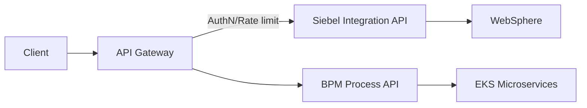
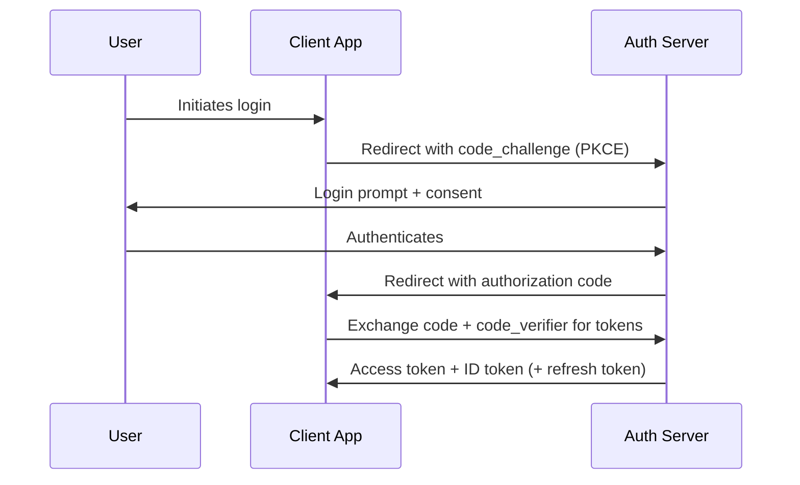

# OWASP / Application Security Handbook — 2026-08 v1

**Owner:** Suraj | DevOps/SRE Engineer, CMG (UK Government project)
**Stack context:** AWS (EC2, EKS, ECR, IAM, OIDC), Docker, Terraform, Ansible, Jenkins, GitHub Actions, Helm, SonarQube, Trivy, WebSphere, Siebel CRM, BPM — on Amazon Linux
**Status:** Active month file. All updates go in-place here until an explicit new-version command is given.

---

## Table of Contents

1. Phase 1 — Security Fundamentals
2. Phase 2 — OWASP Fundamentals
3. Phase 3 — OWASP Top 10 (2021)
4. Phase 4 — Injection
5. Phase 5 — Broken Authentication
6. Phase 6 — Authorization & Access Control
7. Phase 7 — Cryptography
8. Phase 8 — Security Misconfiguration
9. Phase 9 — Vulnerable Components
10. Phase 10 — Logging & Monitoring
11. Phase 11 — SSRF
12. Phase 12 — XSS
13. Phase 13 — CSRF
14. Phase 14 — Security Headers
15. Phase 15 — API Security
16. Phase 16 — JWT Security
17. Phase 17 — OAuth2 / OIDC
18. Phase 18 — Web App Security Testing
19. Phase 19 — DevSecOps Pipeline
20. Phase 20 — SonarQube + OWASP
21. Phase 21 — Container Security
22. Phase 22 — Kubernetes Security
23. Phase 23 — Cloud Security (AWS)
24. Phase 24 — Secrets Management
25. Phase 25 — Threat Modeling
26. Phase 26 — Vulnerability Management
27. Phase 27 — Security Incident / RCA Scenarios
28. Master Comparison Tables
29. Master Rapid Fire

---

# Phase 1 — Security Fundamentals

## 1.1 What is Application Security?
- Practice of finding, fixing, and preventing security vulnerabilities at the application layer (code, APIs, dependencies, config) — distinct from network or infra security.
- Spans design → coding → build → deploy → runtime.
- **CMG example:** Siebel CRM custom workflows and BPM process APIs are in-scope for AppSec review, not just the WebSphere runtime hardening.

## 1.2 What is Cyber Security?
- Umbrella discipline protecting systems, networks, and data from digital attacks — includes AppSec, network security, cloud security, endpoint security, and IAM.

## 1.3 What is Information Security (InfoSec)?
- Broader than cyber security — protects information in any form (digital, physical, verbal). Cyber security is a subset of InfoSec focused on digital systems.

## 1.4 CIA Triad
| Principle | Meaning | CMG Example |
|---|---|---|
| Confidentiality | Only authorized parties see data | Siebel citizen data restricted via RBAC + IAM |
| Integrity | Data isn't tampered with | Terraform state locked in S3 + DynamoDB to prevent concurrent corruption |
| Availability | Systems stay up for authorized use | EKS multi-AZ + HPA to survive node loss |

## 1.5 AAA — Authentication, Authorization, Accounting
- **Authentication (AuthN):** Proving identity ("who are you") — e.g., OIDC login to EKS via IAM roles for service accounts (IRSA).
- **Authorization (AuthZ):** Determining permitted actions ("what can you do") — e.g., Kubernetes RBAC restricting `kubectl` access per namespace.
- **Accounting/Auditing:** Recording what happened — e.g., CloudTrail logs for every IAM API call in the CMG AWS account.

## 1.6 Identity
- The set of attributes uniquely identifying a user, service, or workload (human identity vs. machine/workload identity — e.g., a Jenkins service account vs. a developer's SSO login).

## 1.7 Threat vs Vulnerability vs Risk vs Exploit
| Term | Definition | Example |
|---|---|---|
| Threat | Potential cause of harm | A malicious actor targeting public-facing Siebel endpoints |
| Vulnerability | A weakness that can be exploited | Outdated WebSphere version with known CVE |
| Risk | Likelihood × Impact of a threat exploiting a vulnerability | High risk if internet-facing + unpatched + high-privilege |
| Exploit | The actual mechanism/code used to take advantage of a vulnerability | A crafted payload triggering the CVE |

## 1.8 Attack Surface
- Sum of all points where an unauthorized user could try to enter or extract data — endpoints, ports, APIs, third-party dependencies, IAM roles, exposed S3 buckets.
- **Reduction principle:** minimize exposed services, close unused ports, remove unused IAM permissions, delete unused ECR images/EKS workloads.

## 1.9 Security Controls
- **Preventive:** IAM policies, input validation, WAF rules.
- **Detective:** GuardDuty, CloudTrail, SIEM alerts.
- **Corrective:** Auto-remediation Lambda, patch pipelines.
- **Deterrent:** Audit logging visibility, banners.

## 1.10 Defense in Depth
- Layered security controls so a single failure doesn't lead to compromise.
- **CMG example layering:** Network (Security Groups) → IAM (least privilege) → Application (input validation) → Runtime (container non-root) → Monitoring (CloudWatch/GuardDuty alerts).

## 1.11 Zero Trust
- "Never trust, always verify" — no implicit trust based on network location (internal vs external).
- Every request authenticated + authorized + encrypted, even between internal microservices.
- **CMG example:** mTLS between EKS services rather than trusting the VPC boundary alone.

## 1.12 Secure by Design
- Security requirements built into architecture from day one, not bolted on afterward (e.g., threat modeling during design phase of a new Siebel integration API).

## 1.13 Shift Left Security
- Move security activities (SAST, SCA, secret scanning, threat modeling) earlier in the SDLC — ideally at commit/PR stage rather than post-deployment.
- **CMG example:** SonarQube + Trivy run in the GitHub Actions PR pipeline before merge, not just before production release.

## 1.14 DevSecOps
- Integrates security into every stage of DevOps (Dev → Build → Test → Release → Deploy → Operate) using automation, not manual gatekeeping.
- Core idea: security is everyone's responsibility, automated wherever possible.

---

## 🔥 Phase 1 Rapid Fire
- Q: Difference between Cyber Security and Information Security? → A: InfoSec covers all data forms (digital+physical); Cyber Security covers digital systems only.
- Q: What does the "A" in CIA stand for (two meanings)? → A: Availability (CIA triad) or Authorization/Accounting (AAA) — context dependent.
- Q: Threat vs Vulnerability? → A: Threat is the potential danger; vulnerability is the weakness that enables it.
- Q: What is Zero Trust in one line? → A: Never trust by default, verify every request regardless of network location.
- Q: Shift Left means? → A: Running security checks earlier in the SDLC (at code/PR stage).

---

# Phase 2 — OWASP Fundamentals

## 2.1 What is OWASP?
- Open Web Application Security Project — nonprofit foundation producing free, community-driven AppSec standards, tools, and documentation.

## 2.2 Why OWASP?
- Vendor-neutral, widely adopted industry baseline for AppSec; referenced in compliance frameworks (PCI-DSS, ISO 27001) and government security assessments — relevant to CMG as a UK Gov project subject to security audits.

## 2.3 Key OWASP Projects
| Project | Purpose |
|---|---|
| OWASP Top 10 | Most critical web app security risks |
| OWASP ASVS | Application Security Verification Standard — testable security requirements by level (1/2/3) |
| OWASP API Security Top 10 | API-specific risk categories |
| OWASP SAMM | Software Assurance Maturity Model — org-level AppSec maturity assessment |
| OWASP Cheat Sheets | Practical, topic-specific secure coding guidance |
| OWASP Testing Guide | Methodology for manual/automated security testing |
| OWASP Mobile Security | Mobile app-specific risks (MASVS/MASTG) |
| OWASP Dependency-Check | SCA tool for known-vulnerable dependencies |
| OWASP ZAP | Free DAST/proxy tool for scanning running web apps |

## 2.4 Real DevSecOps Usage
- **OWASP Top 10:** used as the checklist for SAST/DAST rule tuning and threat modeling categories.
- **ASVS:** used to define acceptance criteria for a security sign-off (e.g., "must meet ASVS Level 2" for a citizen-facing Siebel portal).
- **Dependency-Check / Trivy:** integrated into GitHub Actions pipeline as an SCA gate before ECR push.
- **ZAP:** run against a staging EKS environment as an automated DAST step post-deploy.

## 🔥 Phase 2 Rapid Fire
- Q: What does ASVS stand for? → A: Application Security Verification Standard.
- Q: SAMM measures what? → A: An organization's AppSec program maturity, not a single app's vulnerabilities.
- Q: Is OWASP Top 10 a complete vulnerability list? → A: No — it's the top categories by prevalence/impact, not exhaustive.

---

# Phase 3 — OWASP Top 10 (2021 — verify against current OWASP source when asked for "latest")

> Note: OWASP Top 10 is revised periodically (2013, 2017, 2021...). Always verify against official owasp.org before stating "current" categories in an interview context.

## A01:2021 – Broken Access Control
- **Definition:** Restrictions on what authenticated users can do aren't properly enforced.
- **Root causes:** Missing function-level access checks, IDOR, CORS misconfiguration, privilege escalation paths.
- **Attack flow:** Attacker → authenticated as low-priv user → manipulates ID/URL/token → accesses another user's resource or admin function.
- **CMG example:** A Siebel REST API endpoint that trusts a `customerId` query param without verifying it belongs to the logged-in session — classic IDOR.
- **Prevention:** Deny-by-default, server-side authorization checks on every request, RBAC/ABAC, disable directory listing.
- **Detection:** SAST (missing authz annotations), manual pentest, access-control-focused DAST rules.

## A02:2021 – Cryptographic Failures
- **Definition:** Failures related to cryptography that expose sensitive data (previously "Sensitive Data Exposure").
- **Root causes:** Weak/no encryption in transit or at rest, weak algorithms (MD5/SHA1 for passwords), hardcoded keys.
- **CMG example:** RDS backing Siebel not encrypted at rest, or TLS termination at an ALB using an outdated cipher suite.
- **Prevention:** TLS 1.2+, AES-256 at rest, KMS-managed keys, bcrypt/argon2 for passwords, no custom crypto.

## A03:2021 – Injection
- **Definition:** Untrusted data sent to an interpreter as part of a command/query.
- **Types:** SQL, NoSQL, OS command, LDAP, XPath — detailed in Phase 4.
- **Prevention:** Parameterized queries, ORM, input validation, least-privilege DB accounts.

## A04:2021 – Insecure Design
- **Definition:** Missing or ineffective security controls at the design stage — not a coding bug but an architecture gap.
- **CMG example:** Designing a BPM approval workflow without a step to re-verify authorization if the approver's role changes mid-process.
- **Prevention:** Threat modeling, secure design patterns, reference architectures.

## A05:2021 – Security Misconfiguration
- **Definition:** Insecure default configs, incomplete setups, verbose errors, unpatched systems.
- **CMG example:** WebSphere admin console exposed without IP restriction; default Kubernetes namespace with no NetworkPolicy.
- **Prevention:** Hardening baselines, automated config scanning (Trivy config scan, kube-bench), infrastructure as code review.

## A06:2021 – Vulnerable and Outdated Components
- **Definition:** Using libraries/frameworks/OS packages with known vulnerabilities.
- **CMG example:** An old Log4j version in a Siebel integration service (Log4Shell-class risk).
- **Prevention:** SCA (Trivy, Dependency-Check), SBOM tracking, automated patch pipelines, Dependabot/Renovate.

## A07:2021 – Identification and Authentication Failures
- **Definition:** Weaknesses in login, session management, credential handling (previously "Broken Authentication").
- **Prevention:** MFA, strong session ID generation, secure password storage, rate-limited login endpoints.

## A08:2021 – Software and Data Integrity Failures
- **Definition:** Code/infra that doesn't verify integrity — e.g., unsigned CI/CD artifacts, insecure deserialization, unverified auto-updates.
- **CMG example:** Jenkins/GitHub Actions pipeline pulling a base image by mutable tag (`:latest`) without digest pinning or image signing verification.
- **Prevention:** Signed commits/artifacts, image signing (cosign), pinned digests, integrity checks in CI/CD.

## A09:2021 – Security Logging and Monitoring Failures
- **Definition:** Insufficient logging/alerting lets breaches go undetected for long periods.
- **CMG example:** No alert configured for repeated 403s on the Siebel API — a brute-force/IDOR probe goes unnoticed.
- **Prevention:** Centralized logging (CloudWatch/ELK), SIEM correlation rules, alert on auth failures/privilege changes.

## A10:2021 – Server-Side Request Forgery (SSRF)
- **Definition:** App fetches a remote resource using a user-supplied URL without validation, letting attacker reach internal systems.
- **CMG example:** A webhook/callback feature in a BPM integration that fetches attacker-supplied URLs, potentially reaching the EC2 instance metadata service (IMDS).
- **Prevention:** Allowlist destinations, block internal IP ranges, use IMDSv2, network segmentation.

## 🔥 Phase 3 Rapid Fire
- Q: A01 in OWASP Top 10 2021? → A: Broken Access Control.
- Q: What replaced "Sensitive Data Exposure" in 2021? → A: Cryptographic Failures (A02).
- Q: Which category is new in 2021 vs 2017? → A: Insecure Design (A04) and Software/Data Integrity Failures (A08).
- Q: SSRF risk to AWS specifically? → A: Reaching EC2 instance metadata service to steal IAM credentials — mitigated by IMDSv2.

---

# Phase 4 — Injection

## 4.1 SQL Injection
- **What:** Untrusted input concatenated into a SQL query, letting attacker alter query logic.
- **Vulnerable example:**
```sql
-- BAD
query = "SELECT * FROM users WHERE username = '" + input + "'"
```
- **Secure example:**
```sql
-- GOOD (parameterized)
SELECT * FROM users WHERE username = ?
```
- **CMG example:** A legacy Siebel eScript business service building dynamic SQL from a request parameter — classic target for SASt/DAST.
- **Detection:** SAST (taint analysis), DAST (SQLMap-style automated probing in authorized test), code review.
- **Prevention:** Parameterized queries/prepared statements, ORM, input validation, least-privilege DB user, WAF as compensating control (not primary defense).

## 4.2 NoSQL Injection
- Similar concept against MongoDB/DynamoDB-style queries — e.g., injecting operators like `$where` or `$gt` via JSON input.
- **Prevention:** Strict schema validation, avoid building queries from raw JSON input, use query builders/SDK parameter binding.

## 4.3 OS Command Injection
- **What:** Untrusted input passed to a shell command.
- **Vulnerable example (conceptual):** `os.system("ping " + user_input)`
- **CMG example:** A Jenkins pipeline script or Ansible playbook that shells out using an unsanitized parameter from a webhook payload.
- **Prevention:** Avoid shell invocation entirely where possible; use language-native APIs; strict allowlist validation; run with least-privilege service account.

## 4.4 LDAP Injection
- Manipulating LDAP queries (e.g., in an AD-integrated login) via unescaped special characters (`*`, `(`, `)`).
- **Prevention:** Escape LDAP special characters, use parameterized LDAP filters.

## 4.5 XPath Injection
- Similar to SQLi but against XML/XPath queries — relevant to XML-based Siebel/BPM integrations.
- **Prevention:** Parameterized XPath, input validation, avoid string-concatenated XPath expressions.

## 4.6 Template Injection (SSTI)
- User input evaluated by a server-side template engine, potentially leading to RCE.
- **Prevention:** Never render user input as a template; use sandboxed/logic-less template engines; escape by default.

## 4.7 Code Injection
- Attacker input executed as code (e.g., `eval()` on user input).
- **Prevention:** Never `eval` untrusted input; use safe parsers/deserializers.

## 4.8 Header Injection (CRLF Injection)
- Injecting `\r\n` into headers to split responses or inject additional headers.
- **Prevention:** Reject/encode CRLF characters in any user input reflected into headers.

## 🔥 Phase 4 Rapid Fire
- Q: Best single defense against SQLi? → A: Parameterized queries / prepared statements.
- Q: Why is a WAF not sufficient alone against injection? → A: It's a compensating detection/blocking layer, not a fix for the root cause in code.
- Q: What does SSTI stand for? → A: Server-Side Template Injection.

---

# Phase 5 — Broken Authentication

## 5.1 Weak Passwords & Credential Stuffing
- **Credential stuffing:** attacker replays breached username/password pairs from other sites at scale.
- **Prevention:** MFA, breached-password checks (e.g., HaveIBeenPwned API), rate limiting, CAPTCHA on repeated failures.

## 5.2 Brute Force
- Systematic guessing of credentials.
- **Prevention:** Account lockout/backoff, rate limiting per IP/account, MFA.

## 5.3 Session Attacks
- **Session fixation:** attacker sets a known session ID on the victim before login, then hijacks it post-auth. Fix: regenerate session ID on privilege change (login).
- **Session hijacking:** stealing a valid session token (via XSS, network sniffing on unencrypted traffic). Fix: HttpOnly + Secure cookies, TLS everywhere, short session lifetime.

## 5.4 MFA Weaknesses
- SMS-based MFA vulnerable to SIM-swap; prefer TOTP/WebAuthn/FIDO2.
- MFA fatigue attacks (push-bombing) — mitigate with number matching.

## 5.5 Password Storage
- **Never** store plaintext or reversible-encrypted passwords.
- Use slow, salted hashing: bcrypt, scrypt, or argon2 (argon2id preferred).

## 5.6 Token & JWT Security
- Covered in depth in Phase 16 — key point here: tokens are bearer credentials; treat like passwords (short expiry, secure storage, rotation).

## 5.7 OAuth2 / OIDC / Refresh Tokens
- Detailed in Phase 17.
- Refresh tokens should be rotated on use and revocable; access tokens short-lived.

## 5.8 Session Expiration
- Idle timeout + absolute timeout; invalidate server-side session/token on logout, not just client-side deletion.

## 🔥 Phase 5 Rapid Fire
- Q: Session fixation fix? → A: Regenerate the session ID upon successful login.
- Q: Preferred password hashing algorithm today? → A: argon2id (bcrypt/scrypt acceptable alternatives).
- Q: Why is SMS MFA weaker than TOTP? → A: Vulnerable to SIM-swap and SS7 interception attacks.

---

# Phase 6 — Authorization & Access Control

## 6.1 Authentication vs Authorization
| | Authentication | Authorization |
|---|---|---|
| Question | Who are you? | What can you do? |
| Example | Login with SSO | RBAC role determines allowed API calls |
| Failure mode | Impersonation | Privilege escalation / IDOR |

## 6.2 RBAC vs ABAC
- **RBAC (Role-Based Access Control):** Permissions tied to roles (e.g., `viewer`, `admin`). Simple, widely used (Kubernetes RBAC, IAM roles).
- **ABAC (Attribute-Based Access Control):** Permissions evaluated from attributes (user department, resource sensitivity, time of day) — more flexible, more complex.
- **CMG example:** EKS uses Kubernetes RBAC for namespace-scoped permissions; a citizen data platform might need ABAC to restrict access to records based on case-worker region.

## 6.3 IDOR (Insecure Direct Object Reference)
- Direct exposure of an internal object reference (ID) without ownership/permission verification.
- **Example:** `/api/invoice/1042` — changing the ID returns another user's invoice.
- **Prevention:** Server-side ownership check on every object access; use indirect/opaque references or UUIDs plus authorization checks (not obscurity alone).

## 6.4 BOLA (Broken Object Level Authorization)
- API-specific term for IDOR — #1 in OWASP API Security Top 10. Same root cause and fix as IDOR.

## 6.5 Privilege Escalation
- **Horizontal:** Accessing another user's data at the same privilege level (e.g., user A viewing user B's record).
- **Vertical:** Gaining higher privileges than assigned (e.g., regular user reaching admin functions).
- **Prevention:** Enforce authorization checks at every layer, deny by default, avoid trusting client-supplied role claims without server verification.

## 6.6 Least Privilege
- Grant only the minimum permissions needed. **CMG example:** Jenkins/GitHub Actions OIDC role scoped to only the specific ECR repo + EKS namespace it deploys to, not account-wide access.

## 🔥 Phase 6 Rapid Fire
- Q: IDOR vs BOLA? → A: Same concept; BOLA is the API-specific OWASP API Top 10 naming for IDOR.
- Q: Horizontal vs vertical privilege escalation? → A: Horizontal = same level, different user's data; vertical = gaining a higher privilege level.
- Q: RBAC vs ABAC — which is more granular? → A: ABAC, since it evaluates attributes/context rather than fixed roles.

---

# Phase 7 — Cryptography

## 7.1 Hashing vs Encryption vs Encoding
| | Reversible? | Purpose | Example |
|---|---|---|---|
| Encoding | Yes (no key needed) | Data format transformation, not security | Base64 |
| Encryption | Yes (with key) | Confidentiality | AES-256, RSA |
| Hashing | No (one-way) | Integrity / password storage | SHA-256, bcrypt |

- **Common mistake:** treating Base64 as "encryption" — it provides zero confidentiality.

## 7.2 Symmetric vs Asymmetric Encryption
- **Symmetric:** Same key encrypts/decrypts (AES). Fast, used for bulk data. Key distribution is the challenge.
- **Asymmetric:** Public/private key pair (RSA, ECC). Used for key exchange, digital signatures, TLS handshake.

## 7.3 TLS & Certificates
- TLS provides confidentiality + integrity + server authentication in transit.
- Certificate chain: leaf cert → intermediate CA → root CA. Validate expiry, chain trust, correct SANs.
- **CMG example:** ALB terminates TLS for EKS-hosted services using an ACM-issued cert; internal service-to-service can use mTLS via a service mesh.

## 7.4 Digital Signatures
- Uses private key to sign, public key to verify — proves authenticity + integrity (not confidentiality).
- **CMG example:** Signing container images with cosign before pushing to ECR so the deploy pipeline can verify provenance.

## 7.5 Password Hashing & Salt
- Salt = random value added per-password before hashing, preventing rainbow-table attacks and ensuring identical passwords hash differently.
- Modern recommendation: argon2id with per-password random salt + optional pepper stored separately (e.g., in Secrets Manager).

## 7.6 Key Management, Secrets, KMS, HSM
- **KMS (Key Management Service):** Managed service for creating/rotating/using encryption keys without exposing raw key material (AWS KMS).
- **HSM (Hardware Security Module):** Dedicated hardware for key storage/crypto ops, used where regulatory requirements demand physical key isolation (relevant for UK Gov compliance tiers).
- **CMG example:** RDS/EBS encryption at rest via AWS KMS customer-managed keys, with key rotation enabled and access restricted via IAM key policy.

## 🔥 Phase 7 Rapid Fire
- Q: Is Base64 encryption? → A: No — it's encoding, fully reversible without a key.
- Q: Why use salt in password hashing? → A: Prevents rainbow table attacks and ensures identical passwords produce different hashes.
- Q: Digital signature guarantees what, not what? → A: Authenticity + integrity; NOT confidentiality.

---

# Phase 8 — Security Misconfiguration

## 8.1 Common Misconfigurations
- Default credentials left unchanged (databases, admin consoles).
- Debug mode enabled in production (stack traces leak internals).
- Unnecessary exposed ports/services.
- Excessive IAM permissions ("*:*" policies).
- Missing security headers (see Phase 14).
- Verbose error messages revealing stack traces, DB structure, internal paths.

## 8.2 Cloud & Container Specific
- **Misconfigured cloud resources:** public S3 buckets, overly permissive Security Groups (0.0.0.0/0 on sensitive ports), unencrypted RDS.
- **Container misconfiguration:** running as root, no resource limits, mounting Docker socket into a container.
- **Kubernetes misconfiguration:** default namespace usage, no NetworkPolicy (flat pod-to-pod trust), missing PodSecurity admission, secrets in plain ConfigMaps.
- **Database exposure:** RDS/DynamoDB reachable from the public internet instead of VPC-only.
- **Insecure TLS:** allowing TLS 1.0/1.1 or weak cipher suites on the ALB/NLB listener.

## 8.3 CMG Production Example
- A Trivy config scan in the GitHub Actions pipeline catches a Terraform-defined Security Group opening port 22 to `0.0.0.0/0` before it ever reaches the EC2 self-hosted runner subnet.

## 8.4 Prevention
- Infrastructure as Code + policy-as-code (OPA/Conftest, tfsec, Checkov) scanning Terraform before apply.
- Harden default configs via golden AMIs/base images.
- Automated drift detection.

## 🔥 Phase 8 Rapid Fire
- Q: Why is debug mode dangerous in prod? → A: Leaks stack traces/internal details useful for further attacks.
- Q: Tool commonly used to scan Terraform for misconfig? → A: tfsec / Checkov (also Trivy config scan).

---

# Phase 9 — Vulnerable & Outdated Components

## 9.1 Core Concepts
- **CVE (Common Vulnerabilities and Exposures):** unique ID for a publicly known vulnerability.
- **CVSS (Common Vulnerability Scoring System):** severity score (0–10) based on exploitability + impact metrics.
- **SBOM (Software Bill of Materials):** manifest of all components/dependencies in a build — needed for rapid impact assessment when a new CVE drops (e.g., Log4Shell).
- **SCA (Software Composition Analysis):** automated scanning of dependencies against known-vulnerability databases.

## 9.2 Practices
- Version pinning (avoid `latest`/floating versions in Dockerfiles and package manifests).
- Transitive dependency awareness — a vulnerability can come from a dependency-of-a-dependency.
- Patch management SLAs by severity (e.g., Critical = 48h, High = 7d).

## 9.3 Tools
| Tool | Scope |
|---|---|
| OWASP Dependency-Check | Language dependency SCA |
| Trivy | Container images, filesystems, IaC, SBOM |
| Snyk | SCA + container + IaC (commercial) |
| Dependabot | Automated PRs for vulnerable dependency updates (GitHub-native) |

## 9.4 CMG Production Example
- GitHub Actions pipeline runs Trivy against the built container image before ECR push; build fails the gate on any CRITICAL CVE without an approved exception.

## 🔥 Phase 9 Rapid Fire
- Q: CVE vs CVSS? → A: CVE identifies the vulnerability; CVSS scores its severity.
- Q: Why version-pin base images? → A: Prevents unreviewed changes from `latest` introducing new vulnerabilities or breaking changes silently.

---

# Phase 10 — Logging & Monitoring

## 10.1 What to Log
- Authentication events (success/failure), authorization denials, privilege changes, admin actions, input validation failures, and application errors — with enough context to investigate, without logging secrets/PII.

## 10.2 Centralized Logging & SIEM
- Aggregate logs from EKS pods, WebSphere, Siebel, and CI/CD into a central store (CloudWatch, ELK, Loki) for correlation.
- SIEM applies correlation rules to detect patterns across sources (e.g., failed logins + IAM policy change from same actor).

## 10.3 Log Tampering & Sensitive Data
- Logs themselves must be protected (append-only/immutable storage, restricted access) to prevent attacker from erasing evidence.
- Never log passwords, tokens, full card numbers, or full PII — mask/redact.

## 10.4 CMG Integration
- CloudWatch Logs for EKS/EC2; Prometheus + Grafana for metrics/alerting; consider a SIEM layer for correlating Siebel audit logs with AWS CloudTrail.

## 🔥 Phase 10 Rapid Fire
- Q: Why must logs never contain secrets? → A: Logs are often broadly accessible/exported; secrets in logs become a new exposure vector.
- Q: A09:2021 covers what? → A: Security Logging and Monitoring Failures.

---

# Phase 11 — SSRF (Server-Side Request Forgery)

## 11.1 What is SSRF?
- Application makes an outbound request to a URL influenced by the attacker, letting them reach internal-only resources the attacker couldn't reach directly.

## 11.2 Attack Flow
```
Attacker → supplies malicious URL (e.g., http://169.254.169.254/latest/meta-data/iam/security-credentials/)
  → App server fetches it server-side
  → Response (internal data / cloud credentials) returned to attacker
```

## 11.3 Cloud Metadata Endpoints (IMDS)
- AWS IMDS at `169.254.169.254` can expose IAM role credentials if reachable via SSRF.
- **Mitigation:** enforce IMDSv2 (session-oriented, token-required) which is far harder to reach via a simple SSRF GET request than IMDSv1.

## 11.4 Prevention
- Allowlist permitted destination hosts/schemes.
- Block requests to private IP ranges (RFC1918) and link-local (169.254.0.0/16) from app-initiated outbound calls.
- Network segmentation — outbound egress rules on the app tier.
- Disable unused URL schemes (file://, gopher://, etc.) in any URL-fetching library.

## 11.5 CMG Production Scenario
- A BPM webhook callback feature accepts a callback URL from the requester. Without validation, an attacker sets the callback to the EC2 IMDS endpoint, attempting to exfiltrate the instance's IAM role credentials. Fixed by allowlisting destinations + enforcing IMDSv2 account-wide.

## 🔥 Phase 11 Rapid Fire
- Q: Best AWS-level control against SSRF-to-credential-theft? → A: Enforce IMDSv2 (`HttpTokens: required`) on all EC2 instances.
- Q: A10:2021 is? → A: Server-Side Request Forgery.

---

# Phase 12 — XSS (Cross-Site Scripting)

## 12.1 Types
| Type | Where payload lives | Trigger |
|---|---|---|
| Reflected | URL/request parameter | Immediately reflected in the response |
| Stored | Database/persisted storage | Served to any user viewing the stored content |
| DOM-based | Client-side JS manipulates DOM | Never touches the server; purely client-side sink |

## 12.2 Attack Flow
```
Attacker → injects <script> or event handler into input field/URL
  → Victim's browser renders/executes attacker's script
  → Script steals cookies/session, performs actions as victim
```

## 12.3 Prevention
- **Output encoding** (context-aware: HTML, JS, URL, attribute encoding) — the primary defense.
- **Input validation** as a secondary layer.
- **Content Security Policy (CSP)** to restrict script sources and block inline scripts.
- Cookie flags: `HttpOnly` (blocks JS access to cookie), `Secure` (HTTPS only), `SameSite` (limits cross-site sending).

## 12.4 CMG Production Example
- A Siebel customer-facing web form reflecting a search term back into the results page without encoding — fixed by enabling framework auto-escaping and adding a CSP header at the ALB/ingress.

## 🔥 Phase 12 Rapid Fire
- Q: Primary defense against XSS? → A: Context-aware output encoding.
- Q: Which cookie flag stops JavaScript from reading a cookie? → A: HttpOnly.
- Q: DOM-based XSS ever touches the server? → A: No — it's purely client-side.

---

# Phase 13 — CSRF (Cross-Site Request Forgery)

## 13.1 What is CSRF?
- Tricks an authenticated victim's browser into submitting an unwanted request to a site where they're logged in, using their existing session/cookies.

## 13.2 Attack Flow
```
Victim logged into bank.com → visits attacker.com
  → attacker.com auto-submits a form to bank.com/transfer
  → Browser attaches victim's bank.com session cookie automatically
  → Transfer executes as the victim, without their consent
```

## 13.3 Prevention
- **SameSite cookies** (`Lax` or `Strict`) — biggest modern mitigation, blocks cross-site cookie sending by default.
- **CSRF tokens** — unique, unpredictable token per session/form, validated server-side.
- **Origin/Referer validation** on state-changing requests.
- For APIs: CSRF is less relevant if using non-cookie auth (bearer tokens in headers aren't auto-attached by the browser), but still validate Origin for cookie-based API auth.
- SPA considerations: if using cookie-based sessions, still need CSRF tokens; if using token-in-header auth, CSRF risk is much lower (but XSS risk becomes the bigger concern for token theft).

## 🔥 Phase 13 Rapid Fire
- Q: Single biggest modern CSRF mitigation? → A: SameSite cookie attribute (Lax/Strict).
- Q: Why are token-header APIs less CSRF-prone than cookie-auth APIs? → A: Browsers don't auto-attach custom headers cross-site the way they auto-attach cookies.

---

# Phase 14 — Security Headers

| Header | Purpose | Example |
|---|---|---|
| Content-Security-Policy | Restrict allowed script/style/resource sources | `default-src 'self'` |
| Strict-Transport-Security | Force HTTPS, prevent downgrade | `max-age=31536000; includeSubDomains` |
| X-Content-Type-Options | Prevent MIME sniffing | `nosniff` |
| X-Frame-Options | Prevent clickjacking via iframe | `DENY` |
| Referrer-Policy | Control referrer info leakage | `strict-origin-when-cross-origin` |
| Permissions-Policy | Restrict browser feature access (camera, geo) | `geolocation=()` |
| Cache-Control | Prevent caching of sensitive responses | `no-store` |

- Cookie attributes (not headers technically, but grouped here): `Secure`, `HttpOnly`, `SameSite`.
- **Production recommendation:** set these centrally at the ingress/ALB or API Gateway layer rather than per-app, for consistency across the CMG EKS estate.

## 🔥 Phase 14 Rapid Fire
- Q: Header that prevents clickjacking? → A: X-Frame-Options (or CSP `frame-ancestors`).
- Q: Header that forces HTTPS at the browser level? → A: Strict-Transport-Security (HSTS).

---

# Phase 15 — API Security

## 15.1 Core Risks (OWASP API Security Top 10 themes)
- BOLA (broken object level authz), broken authentication, excessive data exposure, lack of rate limiting, broken function-level authz, mass assignment, security misconfiguration, injection, improper inventory management, unsafe consumption of third-party APIs.

## 15.2 API Authentication & Authorization
- Prefer OAuth2/OIDC with short-lived tokens over static API keys where possible.
- Enforce authorization checks per-object per-request (see Phase 6 IDOR/BOLA).

## 15.3 API Gateway & Rate Limiting
- API Gateway centralizes authN, rate limiting, request validation, and logging across many backend services.
- Rate limiting prevents brute force, scraping, and resource exhaustion.

## 15.4 Excessive Data Exposure & Mass Assignment
- **Excessive data exposure:** API returns full internal object, relying on the client to filter fields — leaks unintended data.
- **Mass assignment:** API blindly binds all request fields to an internal object (e.g., a user can set `"isAdmin": true` in a profile-update request if the backend auto-binds all JSON fields).
- **Prevention:** Explicit response DTOs (never return raw internal models); explicit allowlist of bindable fields on writes.

## 15.5 API Inventory & Versioning
- Maintain a live inventory of all exposed APIs (shadow/zombie APIs are a top real-world risk) — old, undocumented versions often skip newer security controls.

## 15.6 mTLS
- Mutual TLS — both client and server present certificates, useful for service-to-service auth inside the CMG EKS cluster (e.g., via a service mesh).

## 15.7 CMG Architecture Note


## 🔥 Phase 15 Rapid Fire
- Q: #1 API security risk per OWASP API Top 10? → A: Broken Object Level Authorization (BOLA).
- Q: Mass assignment fix? → A: Explicit allowlist of fields the client is permitted to set, never auto-bind entire request body.

---

# Phase 16 — JWT Security

## 16.1 JWT Structure
```
header.payload.signature
```
- **Header:** algorithm + token type (e.g., `{"alg":"RS256","typ":"JWT"}`).
- **Payload:** claims (`sub`, `exp`, `iat`, custom claims) — Base64URL encoded, **not encrypted**, readable by anyone.
- **Signature:** proves integrity, created using the header+payload signed with a key.

## 16.2 Access Token vs Refresh Token
- **Access token:** short-lived (minutes), sent with each API request.
- **Refresh token:** longer-lived, used to obtain new access tokens; must be stored more securely and be revocable.

## 16.3 Algorithm Selection
- Prefer asymmetric (RS256/ES256) for services where the verifier shouldn't be able to also sign (e.g., microservices only need the public key).
- **Critical vulnerability:** "alg: none" attack — server accepting a token with no signature algorithm. Always enforce expected algorithm server-side; never trust the `alg` header blindly.

## 16.4 Token Storage
- Browser: prefer HttpOnly cookies over localStorage (localStorage is readable by any XSS payload).
- Mobile/native: secure keychain/keystore.

## 16.5 Validation Checklist
- Verify signature, `exp` (expiration), `iat`, `nbf`, `aud` (audience), `iss` (issuer) — many real-world bugs come from validating the signature but skipping `aud`/`iss` checks.

## 16.6 Key Rotation & Revocation
- Use `kid` (key ID) header to support multiple active signing keys during rotation.
- JWTs are stateless — true revocation before expiry requires a denylist/short expiry + refresh-token revocation at the auth server.

## 16.7 Common Mistakes
- Storing sensitive data unencrypted in the payload (it's just Base64, not encrypted).
- Accepting `alg: none`.
- Not validating `aud`/`iss`.
- Excessively long-lived access tokens.

## 🔥 Phase 16 Rapid Fire
- Q: Is a JWT payload encrypted? → A: No — only Base64URL encoded and integrity-protected by the signature.
- Q: The "alg: none" attack exploits what? → A: A server trusting the algorithm specified in the token header instead of enforcing an expected algorithm.
- Q: Where should JWTs NOT be stored in a browser? → A: localStorage (vulnerable to XSS theft) — prefer HttpOnly cookies.

---

# Phase 17 — OAuth2 / OIDC

## 17.1 OAuth2 vs OIDC
| | OAuth2 | OIDC |
|---|---|---|
| Purpose | Authorization (delegated access) | Authentication (identity) — built on top of OAuth2 |
| Output | Access token | ID token (JWT) + access token |

## 17.2 Authorization Code Flow (with PKCE)


## 17.3 PKCE (Proof Key for Code Exchange)
- Protects public clients (SPAs, mobile apps) from authorization code interception — client generates a `code_verifier`, sends its hash (`code_challenge`) upfront, and must present the original verifier at token exchange.

## 17.4 Client Credentials Flow
- Machine-to-machine auth (no user) — e.g., a Jenkins/GitHub Actions service authenticating to an internal API using client ID + secret to get an access token.
- **CMG example:** GitHub Actions using OIDC federation with AWS IAM (no long-lived AWS secrets stored in GitHub at all) — this is OIDC used for workload identity, not just user login.

## 17.5 Scopes vs Claims
- **Scopes:** what the token is allowed to access (requested during authorization, e.g., `read:profile`).
- **Claims:** statements about the subject inside the ID token (e.g., `email`, `sub`, `roles`).

## 🔥 Phase 17 Rapid Fire
- Q: OAuth2 vs OIDC in one line? → A: OAuth2 = authorization framework; OIDC = identity layer built on top of OAuth2.
- Q: Why is PKCE needed for SPAs/mobile apps? → A: They can't safely store a client secret, so PKCE protects the code exchange without one.
- Q: CMG's use of OIDC for CI/CD? → A: GitHub Actions authenticates to AWS via OIDC federation, avoiding static AWS access keys in GitHub secrets.

---

# Phase 18 — Web Application Security Testing

## 18.1 Testing Types
| Type | When | What it finds |
|---|---|---|
| SAST | Source code, pre-build | Code-level flaws (injection patterns, hardcoded secrets) |
| DAST | Running application | Runtime behavior flaws (auth bypass, XSS reflected at runtime) |
| SCA | Dependency manifest/lockfile | Known-vulnerable dependencies |
| IAST | Runtime + instrumented code | Combines SAST/DAST visibility with lower false positives |

## 18.2 Methodology
- Reconnaissance (authorized scope only) → threat modeling → automated scanning (SAST/DAST/SCA) → manual testing for logic flaws automated tools miss (e.g., BOLA, business logic abuse) → reporting → retest after fix.

## 18.3 Tools
- **SAST:** SonarQube, Semgrep.
- **DAST:** OWASP ZAP, Burp Suite.
- **SCA:** Trivy, OWASP Dependency-Check, Snyk.

## 18.4 CMG Note
- All testing must be authorized and scoped — production Siebel/BPM systems handling citizen data require signed-off pentest windows, not ad-hoc scanning.

## 🔥 Phase 18 Rapid Fire
- Q: What can SAST NOT find that DAST can? → A: Runtime-only issues like misconfigurations only visible when the app is running, or auth bypass requiring live session state.
- Q: IAST advantage over pure DAST? → A: Lower false positive rate due to code-level instrumentation combined with runtime behavior.

---

# Phase 19 — DevSecOps Pipeline

## 19.1 Full Flow

```mermaid
flowchart LR
    DEV[Developer]
    GIT[Git Repository]
    SAST[SAST]
    SCA[SCA]
    SECRET[Secret Scan]
    BUILD[Build]
    IMAGE[Container Build]
    SCAN[Container Scan]
    DAST[DAST]
    GATE[Security Gate]
    REG[Registry]
    DEPLOY[Production]
    MON[Monitoring]

    DEV --> GIT
    GIT --> SAST
    SAST --> SCA
    SCA --> SECRET
    SECRET --> BUILD
    BUILD --> IMAGE
    IMAGE --> SCAN
    SCAN --> DAST
    DAST --> GATE
    GATE --> REG
    REG --> DEPLOY
    DEPLOY --> MON
```


## 19.2 Key Concepts
- **Shift Left:** SAST/SCA/secret-scan run at PR stage, not just before release.
- **Security Gates:** automated pass/fail thresholds (e.g., no CRITICAL CVEs, SonarQube Quality Gate passed) blocking merge/deploy.
- **Policy as Code:** OPA/Conftest evaluating Terraform/Kubernetes manifests against org policy before apply.
- **Pipeline security:** protect the pipeline itself — least-privilege OIDC roles, no long-lived secrets in GitHub Actions, signed commits, branch protection.
- **Secret management:** never hardcode secrets in pipeline YAML; pull from AWS Secrets Manager/Parameter Store at runtime.

## 19.3 CMG Production Mapping
- GitHub Actions (migrated from Jenkins) → SonarQube (SAST) → Trivy (SCA + image scan) → build/push to ECR via OIDC-federated role → deploy to EKS via Helm → runtime monitored via CloudWatch/Prometheus.

## 🔥 Phase 19 Rapid Fire
- Q: Where should a secret scan run in the pipeline? → A: As early as possible (pre-commit/PR stage) — shift left.
- Q: What replaces long-lived AWS keys in GitHub Actions for CMG? → A: OIDC federation to an IAM role.

---

# Phase 20 — SonarQube + OWASP

## 20.1 Relationship
- SonarQube is primarily a **SAST** tool with Quality Gates — it flags "Vulnerabilities" (confirmed) and "Security Hotspots" (needs manual review to confirm exploitability).
- SonarQube alone does **not** replace SCA (dependency CVEs), DAST (runtime behavior), or full OWASP Top 10 coverage — e.g., it can't detect a live SSRF exploitation path or a broken authorization flow that spans multiple services.

## 20.2 What SonarQube CAN Detect
- Hardcoded credentials/secrets in code, SQL injection patterns via taint analysis, insecure crypto API usage, code smells that correlate with security risk, some XSS-prone patterns.

## 20.3 What Requires Dedicated Security Tooling
- Known-CVE dependency vulnerabilities → SCA tool (Trivy/Dependency-Check).
- Runtime auth/session bypass → DAST/manual pentest.
- Business logic flaws (BOLA, IDOR) → manual testing, since these require understanding intended authorization logic.
- Container/infra misconfig → Trivy config scan / tfsec / kube-bench.

## 🔥 Phase 20 Rapid Fire
- Q: SonarQube "Vulnerability" vs "Security Hotspot"? → A: Vulnerability = confirmed issue; Security Hotspot = needs manual review to determine if actually exploitable.
- Q: Can SonarQube detect a vulnerable dependency CVE? → A: Not natively — that's SCA territory (Trivy/Dependency-Check), though some SonarQube editions integrate SCA as an add-on.

---

# Phase 21 — Container Security

## 21.1 Core Practices
- Use minimal base images (distroless, alpine) to shrink attack surface.
- Run as **non-root** user inside the container (`USER` directive in Dockerfile, or `runAsNonRoot` in Kubernetes securityContext).
- Never mount the Docker socket into a container (`/var/run/docker.sock`) unless absolutely required — it's effectively root-on-host access.
- No secrets baked into image layers — use runtime secret injection.
- Image signing (cosign) + SBOM generation for provenance and supply-chain integrity.

## 21.2 Scanning
- Trivy scans images for OS package + language dependency CVEs, misconfigurations, and secrets — integrated as a CI gate before ECR push.

## 21.3 Registry Security
- ECR with image scanning enabled, repository policies restricting push/pull to specific IAM roles, lifecycle policies to remove stale/vulnerable images.

## 21.4 CMG Example
- GitHub Actions builds image → Trivy scan (fails on CRITICAL) → cosign sign → push to ECR → EKS pulls only signed, scanned images via admission policy.

## 🔥 Phase 21 Rapid Fire
- Q: Why avoid mounting the Docker socket into a container? → A: It grants effective root access to the host, breaking container isolation entirely.
- Q: Purpose of an SBOM in container security? → A: Rapid impact assessment — know instantly which images contain a newly disclosed vulnerable component.

---

# Phase 22 — Kubernetes Security

## 22.1 Core Areas (cross-reference: full Kubernetes architecture covered in the Kubernetes/DevOps handbook — security-specific notes only here)
- **RBAC:** least-privilege Roles/ClusterRoles bound to ServiceAccounts, not broad `cluster-admin` grants.
- **Service Accounts:** dedicated SA per workload, not the default SA; disable auto-mounting of SA tokens where not needed.
- **Secrets:** Kubernetes Secrets are only base64-encoded by default (not encrypted) unless etcd encryption at rest is enabled — pair with external secret managers (AWS Secrets Manager via CSI driver) for CMG's sensitivity level.
- **Network Policies:** default-deny ingress/egress per namespace, explicit allow rules between services — prevents flat "any pod can reach any pod" trust.
- **Pod Security / Security Context:** `runAsNonRoot`, `readOnlyRootFilesystem`, drop unnecessary Linux capabilities, disallow privileged containers — enforced via Pod Security Admission (`restricted` profile).
- **Admission Controllers:** OPA/Gatekeeper or Kyverno to enforce policy (e.g., "no image without a digest," "no privileged pods") at admission time.
- **API Server & etcd security:** restrict API server access via network controls, enable audit logging, encrypt etcd at rest, restrict etcd access to control plane only.

## 22.2 CMG Example
- EKS cluster with IRSA (IAM Roles for Service Accounts) so pods assume scoped IAM roles instead of node-wide instance roles; NetworkPolicies segmenting the Siebel-integration namespace from unrelated workloads.

## 🔥 Phase 22 Rapid Fire
- Q: Are Kubernetes Secrets encrypted by default? → A: No — base64-encoded only; enable etcd encryption at rest for real protection.
- Q: What does IRSA provide on EKS? → A: Fine-grained, pod-level IAM permissions instead of sharing the node's IAM role across all pods.

---

# Phase 23 — Cloud Security (AWS)

## 23.1 IAM
- Least privilege policies, avoid wildcard actions/resources, use roles over long-lived users/keys, enforce MFA for console access, use permission boundaries for delegated admin.

## 23.2 Key AWS Security Services
| Service | Purpose |
|---|---|
| KMS | Managed encryption key lifecycle |
| Secrets Manager | Secret storage + automatic rotation |
| Security Groups / NACLs | Network-level access control (stateful vs stateless) |
| CloudTrail | API call auditing across the account |
| GuardDuty | Managed threat detection (anomalous API calls, compromised credentials) |
| WAF | Layer 7 filtering (SQLi/XSS pattern blocking, rate-based rules) |
| Shield | DDoS protection (Standard included; Advanced for enhanced SLA) |
| S3 security | Block Public Access, bucket policies, encryption, access logging |
| ECR scanning | Native image vulnerability scanning on push |

## 23.3 CMG Example
- GuardDuty alerting on anomalous IAM activity tied into the SIEM; WAF in front of the Siebel-facing ALB with managed rule groups for OWASP Top 10 pattern blocking as a compensating control.

## 🔥 Phase 23 Rapid Fire
- Q: Security Groups vs NACLs? → A: Security Groups are stateful, instance/ENI-level; NACLs are stateless, subnet-level.
- Q: GuardDuty vs CloudTrail? → A: CloudTrail records API activity; GuardDuty analyzes that activity (plus VPC flow logs/DNS logs) for threats.

---

# Phase 24 — Secrets Management

## 24.1 Anti-Patterns
- Hardcoded secrets in source code/config files, secrets in environment variables committed to Git, secrets baked into container image layers, secrets in plaintext in CI/CD pipeline YAML.

## 24.2 Proper Patterns
- Dedicated secret managers: HashiCorp Vault, AWS Secrets Manager, AWS Parameter Store (SecureString).
- Kubernetes Secrets pulled from external managers via CSI Secrets Store driver rather than stored natively.
- Automatic secret rotation (e.g., RDS credential rotation via Secrets Manager).
- Secret scanning in CI (gitleaks/truffleHog-style, or GitHub Advanced Security secret scanning) blocking commits/PRs containing detected secrets.
- Git history cleanup (BFG Repo-Cleaner / `git filter-repo`) if a secret is ever committed — rotate the secret immediately regardless of history cleanup, since it must be treated as compromised.

## 24.3 CMG Example
- GitHub Actions pulls DB credentials for a deploy step from AWS Secrets Manager at runtime via the OIDC-federated IAM role — nothing stored as a GitHub Actions secret for anything long-lived or high-privilege.

## 🔥 Phase 24 Rapid Fire
- Q: First action after discovering a secret committed to Git? → A: Rotate/revoke the secret immediately — history cleanup alone is not sufficient since it may already be cached/cloned elsewhere.
- Q: Kubernetes-native secret encryption gap? → A: Secrets are base64 only by default; needs etcd encryption at rest or an external secrets manager.

---

# Phase 25 — Threat Modeling

## 25.1 Core Concepts
- **Assets:** what you're protecting (citizen data, credentials, availability).
- **Threats:** who/what could cause harm.
- **Trust boundaries:** points where data crosses between different privilege/trust levels (e.g., internet → ALB → EKS namespace → RDS).
- **Data flow diagrams (DFD):** map how data moves through the system to identify where trust boundaries and attack surfaces exist.

## 25.2 STRIDE Model
| Letter | Threat | Maps to |
|---|---|---|
| S | Spoofing | Authentication |
| T | Tampering | Integrity |
| R | Repudiation | Non-repudiation/logging |
| I | Information Disclosure | Confidentiality |
| D | Denial of Service | Availability |
| E | Elevation of Privilege | Authorization |

## 25.3 Practical Example
- Modeling a new Siebel-to-BPM integration API: draw the DFD, mark the trust boundary at the API Gateway, apply STRIDE per component, derive security requirements (e.g., "Tampering risk on the webhook payload → require HMAC signature verification").

## 🔥 Phase 25 Rapid Fire
- Q: STRIDE's "S" and "E" map to which security properties? → A: S = Spoofing/Authentication, E = Elevation of Privilege/Authorization.
- Q: Purpose of marking trust boundaries in a DFD? → A: Identifies exactly where input must be (re-)validated because trust level changes.

---

# Phase 26 — Vulnerability Management

## 26.1 Lifecycle
```
Identify → Assess Severity (CVSS) → Prioritize (Risk = Likelihood x Impact)
  → Remediate/Patch → Verify Fix → Track Exceptions (if risk-accepted)
```

## 26.2 Severity → Risk → Action

| Severity (CVSS) | Typical Risk | Action / SLA |
|---|---|---|
| Critical (9.0–10) | Immediate exploitation possible, high impact | Patch/mitigate within 24–48h, may require emergency change |
| High (7.0–8.9) | Significant impact, exploit likely | Patch within 7 days |
| Medium (4.0–6.9) | Moderate impact or requires specific conditions | Patch within 30 days |
| Low (0.1–3.9) | Minimal impact | Patch in normal release cycle |

## 26.3 False Positives & Risk Acceptance
- Not every scanner finding is exploitable in context (e.g., a vulnerable function that's never reachable with untrusted input) — document and formally accept residual risk with an expiry date, don't silently ignore.

## 🔥 Phase 26 Rapid Fire
- Q: Typical patch SLA for a Critical CVE? → A: 24–48 hours (org-dependent, but treated as emergency).
- Q: What must accompany a risk-acceptance decision? → A: Documented justification + an expiry/review date, not a permanent silent exception.

---

# Phase 27 — Security Incident / RCA Scenarios

### Scenario 1 — Critical Vulnerability Found in Production
- **Problem:** Trivy/GuardDuty flags a CRITICAL CVE in a running EKS workload.
- **Detection:** Automated scan alert / GuardDuty finding.
- **Investigation:** Confirm exploitability, check if the vulnerable code path is reachable/exposed.
- **Containment:** Restrict network exposure or scale down the affected service if actively exploited.
- **Root Cause:** Outdated base image not rebuilt on schedule.
- **Remediation:** Patch dependency, rebuild + rescan + redeploy image.
- **Verification:** Confirm CVE no longer present in rescanned image.
- **Prevention:** Automated base-image rebuild pipeline on new CVE disclosure (scheduled Trivy rescans of images already in ECR).
- **Interview Answer:** "I'd confirm exploitability first to avoid panic-patching non-reachable code, contain exposure if needed, then patch through the normal CI/CD pipeline with a rescan gate before redeploying."

### Scenario 2 — Secret Committed to Git
- **Problem:** AWS access key accidentally committed to a GitHub Actions workflow file.
- **Detection:** GitHub secret scanning alert.
- **Investigation:** Determine scope of the exposed key's permissions and whether it was used maliciously (check CloudTrail).
- **Containment:** Immediately deactivate/rotate the key in IAM.
- **Root Cause:** No pre-commit secret scanning in place; hardcoded credential instead of OIDC federation.
- **Remediation:** Rotate credential, migrate pipeline to OIDC federation (removing static keys entirely), clean Git history.
- **Prevention:** Pre-commit/PR secret scanning gate, branch protection, move to OIDC everywhere feasible.

### Scenario 3 — Public Cloud Storage Accidentally Exposed
- **Problem:** S3 bucket containing exported data made public via a misconfigured bucket policy.
- **Detection:** AWS Config rule / Trusted Advisor / GuardDuty S3 finding.
- **Investigation:** Determine what was exposed, for how long, and if it was accessed (S3 access logs/CloudTrail data events).
- **Containment:** Immediately enable Block Public Access on the bucket.
- **Root Cause:** Terraform change removed a bucket policy restriction without a policy-as-code gate catching it.
- **Remediation:** Restore restrictive policy, assess breach notification obligations (relevant under UK GDPR for a Gov project).
- **Prevention:** Account-level S3 Block Public Access + Checkov/tfsec gate on Terraform PRs for any S3 policy change.

### Scenario 4 — API Authorization Vulnerability Discovered (BOLA/IDOR)
- **Problem:** Pentest finds a Siebel integration API returning another customer's record by changing the ID.
- **Detection:** Manual pentest / bug bounty report.
- **Investigation:** Determine the extent (how many records could've been enumerated) via log analysis.
- **Containment:** Emergency patch or temporarily disable the vulnerable endpoint.
- **Root Cause:** Missing server-side ownership check.
- **Remediation:** Add authorization check per-request; add automated test coverage for the authz path.
- **Prevention:** Include BOLA-style test cases in the API security test suite going forward.

### Scenario 5 — Dependency with Critical CVE Detected
- **Problem:** SCA scan flags a critical CVE in a transitive dependency.
- **Detection:** Trivy/Dependency-Check CI gate.
- **Investigation:** Check SBOM for all affected images/services.
- **Containment:** Block further deploys of affected images until patched.
- **Root Cause:** No automated dependency update process.
- **Remediation:** Bump dependency version, rebuild, rescan.
- **Prevention:** Dependabot/Renovate automated update PRs + scheduled rescans of deployed images.

### Scenario 6 — Container Image Contains Critical Vulnerability
- (Overlaps with Scenario 1/5 — CMG-specific nuance): tie remediation into the ECR lifecycle policy so vulnerable images are automatically flagged for removal, and admission control blocks new deploys of any image with unresolved CRITICAL findings.

### Scenario 7 — JWT Validation Issue Discovered
- **Problem:** Security review finds a service accepting JWTs without validating the `aud` claim, allowing a token issued for one service to be replayed against another.
- **Root Cause:** Incomplete validation logic (signature checked, `aud`/`iss` skipped).
- **Remediation:** Enforce full claim validation (`aud`, `iss`, `exp`) in the shared auth middleware used across services.
- **Prevention:** Central shared auth library instead of per-service reimplementation, so the fix propagates everywhere at once.

### Scenario 8 — Security Scan Blocks Production Deployment
- **Problem:** A release is blocked because Trivy found a new CRITICAL CVE in a base image that was previously clean.
- **Investigation:** Confirm it's a genuine finding, not a scanner false positive/DB update artifact.
- **Decision:** Either patch quickly (preferred) or file a time-boxed risk exception with sign-off if the vulnerable path is confirmed unreachable and the release is business-critical.
- **Interview Answer:** "I wouldn't bypass the gate silently — I'd assess exploitability, and either fix the base image fast or get a documented, time-boxed exception approved, never a permanent override."

## 🔥 Phase 27 Rapid Fire
- Q: First step after discovering a secret in Git history? → A: Rotate the credential immediately, then clean history.
- Q: Why avoid silently bypassing a failed security gate? → A: Creates an unreviewed, undocumented risk acceptance — always require a time-boxed, sign-off-based exception instead.

---

# Master Comparison Tables

## Authentication vs Authorization
| | Authentication | Authorization |
|---|---|---|
| Question | Who are you? | What can you do? |
| Timing | Happens first | Happens after authN |
| Failure | Impersonation | Privilege escalation / IDOR |

## Encryption vs Hashing vs Encoding
| | Reversible | Key needed | Use |
|---|---|---|---|
| Encoding | Yes | No | Data format transformation |
| Encryption | Yes | Yes | Confidentiality |
| Hashing | No | No | Integrity / password storage |

## SAST vs DAST vs SCA vs IAST
| | Analyzes | Needs running app? | Finds |
|---|---|---|---|
| SAST | Source code | No | Code-level flaws |
| DAST | Running app | Yes | Runtime/auth flaws |
| SCA | Dependencies | No | Known-CVE components |
| IAST | Instrumented runtime | Yes | Combination, fewer false positives |

## Vulnerability vs Threat vs Risk
| | Definition |
|---|---|
| Vulnerability | A weakness |
| Threat | A potential danger that could exploit the weakness |
| Risk | Likelihood × Impact if the threat exploits the vulnerability |

## Bug vs Vulnerability vs Security Hotspot
| | Definition |
|---|---|
| Bug | Functional defect, not necessarily security-related |
| Vulnerability | Confirmed security weakness, exploitable |
| Security Hotspot | Code pattern that *may* be a vulnerability — needs manual review to confirm |

## OAuth2 vs OIDC
| | OAuth2 | OIDC |
|---|---|---|
| Purpose | Authorization | Authentication (built on OAuth2) |
| Token | Access token | ID token (JWT) + access token |

## JWT vs Session (Cookie-Based)
| | JWT | Session |
|---|---|---|
| State | Stateless (self-contained) | Stateful (server-side store) |
| Revocation | Hard (needs denylist) | Easy (delete server-side session) |
| Scalability | Easier across distributed services | Needs shared session store |

## RBAC vs ABAC
| | RBAC | ABAC |
|---|---|---|
| Basis | Fixed roles | Dynamic attributes/context |
| Complexity | Simpler | More flexible, more complex |

## WAF vs API Gateway
| | WAF | API Gateway |
|---|---|---|
| Focus | Layer 7 attack pattern filtering (injection/XSS signatures) | Traffic management: authN, rate limiting, routing, versioning |
| Overlap | Both can enforce some request validation | Often deployed together, not either/or |

## SAST vs SonarQube
| | SAST (general) | SonarQube (specific tool) |
|---|---|---|
| Scope | Category of testing | A specific SAST + code-quality product with Quality Gates |
| Coverage | Varies by tool | Strong on code smells/some vulns; not a full SCA/DAST replacement |

## CVE vs CVSS
| | CVE | CVSS |
|---|---|---|
| What | Unique ID for a known vulnerability | Severity score (0–10) for that vulnerability |

## Container Scan vs Dependency Scan
| | Container Scan | Dependency Scan (SCA) |
|---|---|---|
| Scope | Full image: OS packages + app deps + config | App-level dependency manifest/lockfile only |
| Example tool | Trivy (image mode) | OWASP Dependency-Check, Trivy (fs mode) |

## DAST vs Penetration Testing
| | DAST | Penetration Testing |
|---|---|---|
| Nature | Automated scanning tool | Manual, human-driven, includes business-logic testing |
| Coverage | Broad, fast, repeatable | Deep, contextual, finds logic flaws automation misses |

---

# Master Rapid Fire

- Q: What is the CIA triad? → A: Confidentiality, Integrity, Availability.
- Q: What is AAA? → A: Authentication, Authorization, Accounting.
- Q: A01:2021 (OWASP Top 10)? → A: Broken Access Control.
- Q: A02:2021? → A: Cryptographic Failures.
- Q: A03:2021? → A: Injection.
- Q: A04:2021? → A: Insecure Design.
- Q: A05:2021? → A: Security Misconfiguration.
- Q: A06:2021? → A: Vulnerable and Outdated Components.
- Q: A07:2021? → A: Identification and Authentication Failures.
- Q: A08:2021? → A: Software and Data Integrity Failures.
- Q: A09:2021? → A: Security Logging and Monitoring Failures.
- Q: A10:2021? → A: Server-Side Request Forgery (SSRF).
- Q: Best defense against SQL Injection? → A: Parameterized queries/prepared statements.
- Q: IDOR vs BOLA? → A: Same root issue; BOLA is the API-specific OWASP naming for IDOR.
- Q: Is Base64 encryption? → A: No, it's encoding — fully reversible without any key.
- Q: Preferred modern password hashing algorithm? → A: argon2id.
- Q: Session fixation fix? → A: Regenerate session ID on login.
- Q: Primary XSS defense? → A: Context-aware output encoding.
- Q: Biggest modern CSRF mitigation? → A: SameSite cookie attribute.
- Q: Header that prevents clickjacking? → A: X-Frame-Options / CSP frame-ancestors.
- Q: #1 API security risk (OWASP API Top 10)? → A: BOLA (Broken Object Level Authorization).
- Q: Is a JWT payload encrypted? → A: No — Base64URL encoded and signature-protected, not encrypted.
- Q: OAuth2 vs OIDC? → A: OAuth2 = authorization; OIDC = authentication (identity layer on OAuth2).
- Q: Best AWS control against SSRF-to-credential-theft? → A: Enforce IMDSv2.
- Q: Are Kubernetes Secrets encrypted by default? → A: No — base64 only; need etcd encryption at rest or external secrets manager.
- Q: What does IRSA provide on EKS? → A: Pod-level fine-grained IAM permissions instead of shared node role.
- Q: CVE vs CVSS? → A: CVE = identifier; CVSS = severity score.
- Q: SonarQube Vulnerability vs Security Hotspot? → A: Vulnerability = confirmed; Hotspot = needs manual review.
- Q: First action after a secret leaks to Git? → A: Rotate/revoke the credential immediately.
- Q: STRIDE stands for? → A: Spoofing, Tampering, Repudiation, Information Disclosure, Denial of Service, Elevation of Privilege.
- Q: SAST vs DAST vs SCA vs IAST — one-line difference? → A: SAST=code, DAST=running app, SCA=dependencies, IAST=instrumented runtime combining both.
- Q: Shift Left security means? → A: Running security checks earlier in the SDLC (ideally at commit/PR stage).
- Q: Zero Trust core principle? → A: Never trust by default, verify every request regardless of network location.

---

*End of OWASP-Handbook-2026-08-v1.md — all 27 phases + master tables + master rapid fire complete.*
