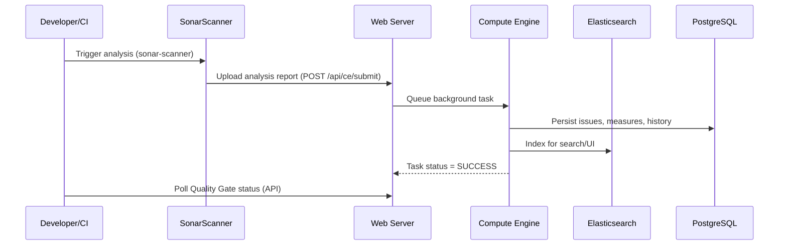
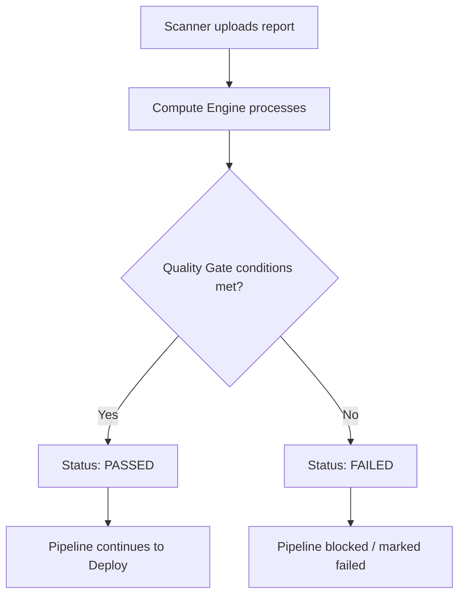
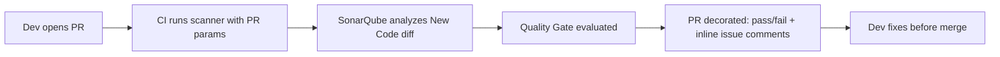
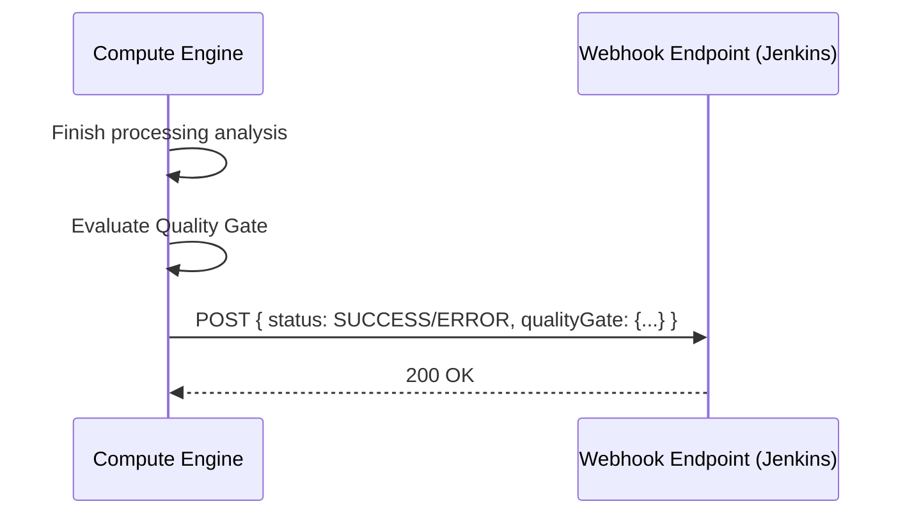
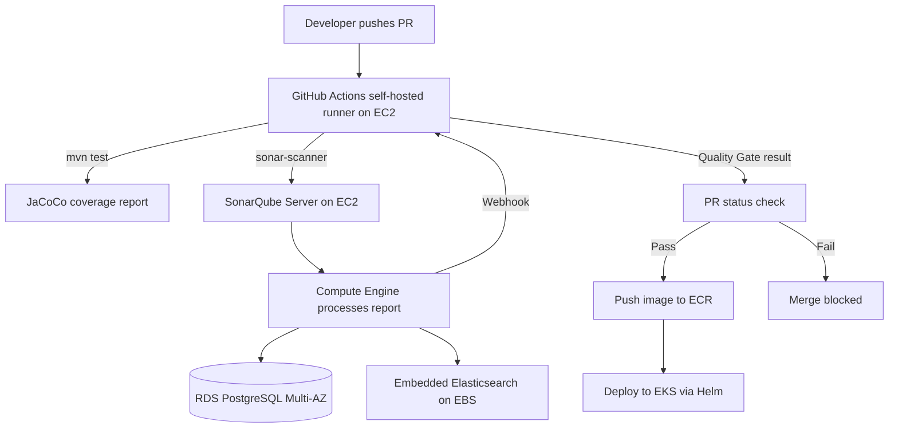

# SonarQube Handbook — 2026-08-v1
### Enterprise SonarQube & DevSecOps Knowledge Base — CMG Production Grounded

> **Status:** Active file for August 2026. Edited in-place. Frozen only on explicit command ("go with version 2" / "new month").
> **Grounding:** All production examples reference the CMG (UK Government) stack — AWS EC2/EKS/ECR/IAM/OIDC, Docker, Terraform, Ansible, Jenkins, GitHub Actions, Helm, SonarQube, Trivy, WebSphere, Siebel CRM, BPM, Amazon Linux.

---

## Table of Contents

1. Phase 1 — SonarQube Fundamentals
2. Phase 2 — SonarQube Architecture
3. Phase 3 — SonarQube Installation
4. Phase 4 — SonarScanner
5. Phase 5 — SonarQube Projects
6. Phase 6 — Rules
7. Phase 7 — Quality Profiles
8. Phase 8 — Quality Gates
9. Phase 9 — New Code
10. Phase 10 — Code Quality Metrics
11. Phase 11 — Code Coverage
12. Phase 12 — Security
13. Phase 13 — Branch & Pull Request Analysis
14. Phase 14 — CI/CD Integration (Overview)
15. Phase 15 — Jenkins + SonarQube
16. Phase 16 — GitHub Actions + SonarQube
17. Phase 17 — GitLab CI/CD + SonarQube
18. Phase 18 — SonarQube Webhooks
19. Phase 19 — Docker + SonarQube
20. Phase 20 — Kubernetes + SonarQube
21. Phase 21 — Database
22. Phase 22 — SonarQube Administration
23. Phase 23 — Upgrade & Migration
24. Phase 24 — REST API
25. Phase 25 — Troubleshooting
26. Phase 26 — Production Architecture
27. Phase 27 — Real Production Scenarios (10 Scenarios)
28. Cheat Sheet
29. 🔥🔥 Master Rapid Fire — All Topics
30. Revision Notes

---

## Phase 1 — SonarQube Fundamentals

### What is SonarQube?
- An open-source/enterprise platform for **continuous inspection of code quality and security**.
- Performs **static code analysis (SAST)** — analyzes source code without executing it.
- Detects **bugs, vulnerabilities, code smells, security hotspots, duplications**.
- Provides a single dashboard across 30+ languages (Java, Python, JS/TS, Go, C#, etc.).

### Why SonarQube?
- Shifts code quality/security checks **left** — caught before merge/deploy, not in production.
- Enforces a **Quality Gate** so bad code cannot progress through CI/CD.
- Gives objective, measurable code health metrics instead of subjective review only.
- Standardizes coding rules across teams/projects (Quality Profiles).

### Static Code Analysis
- Analyzes source code structure, syntax trees, data flow — **no runtime execution**.
- Detects patterns: null pointer risk, SQL injection, hardcoded secrets, resource leaks, complexity.

### SAST vs SonarQube
| Aspect | Generic SAST Tool | SonarQube |
|---|---|---|
| Scope | Security-focused only | Code quality + security combined |
| Metrics | Vulnerabilities only | Bugs, smells, coverage, duplications, vulnerabilities |
| CI/CD Gate | Sometimes | Native Quality Gate concept |
| Multi-language | Varies | 30+ languages out of the box |
| Historical trend | Limited | Built-in (New Code vs Overall Code) |

### Code Quality vs Code Security
- **Code Quality** → maintainability, reliability, readability, technical debt.
- **Code Security** → vulnerabilities, security hotspots, secure coding violations (OWASP/CWE mapped).

### DevSecOps
- SonarQube embeds security scanning **inside** the CI/CD pipeline (not a separate late-stage audit).
- "Shift-left security" — developers see security issues at PR time, not post-release.

### SonarQube Use Cases
- Pre-merge PR quality/security gating.
- Continuous technical debt tracking.
- Compliance/audit evidence for regulated environments (relevant for CMG — UK Gov compliance).
- Enforcing secure coding standards org-wide via Quality Profiles.

### SonarQube Limitations
- **Not** a replacement for DAST (dynamic testing) or penetration testing.
- Does **not execute tests itself** — it only *ingests* coverage reports (JaCoCo/LCOV/etc.), it does not run your test suite.
- False positives possible — Security Hotspots require human review, not pure automation.
- Cannot detect all runtime/business-logic vulnerabilities.

💡 **Tip:** Interviewers frequently probe whether you understand SonarQube analyzes *reports* for coverage rather than running tests — state this explicitly.

🎯 **CMG Production Example:** On the CMG project, SonarQube scans run inside GitHub Actions (migrated from Jenkins) for every PR against Siebel/BPM Java services deployed to EKS. The scanner ingests JaCoCo coverage XML generated by Maven's `test` phase — SonarQube itself never executes the JUnit tests.

---
## Phase 2 — SonarQube Architecture

### Core Components
- **Web Server** — serves the UI + REST API (Elasticsearch-backed search/browse).
- **Compute Engine (CE)** — processes analysis reports asynchronously (background task queue).
- **Elasticsearch (embedded)** — indexes source code, issues, measures for fast search/UI rendering.
- **Database (PostgreSQL)** — stores configuration, quality profiles, quality gates, issues, history.
- **Scanner** — client-side component (SonarScanner/Maven/Gradle/CLI) that analyzes source and uploads a report.

### Component Communication / Request Flow


### ASCII Architecture (Single Node)
```
        ┌─────────────┐
        │  Scanner CLI │  (runs in Jenkins/GitHub Actions runner)
        └──────┬───────┘
               │ report.zip (HTTPS + token auth)
               ▼
        ┌─────────────┐        ┌────────────────┐
        │  Web Server  │◄──────►│  Elasticsearch │ (embedded, single JVM node)
        └──────┬───────┘        └────────────────┘
               │ queues task
               ▼
        ┌──────────────┐
        │ Compute Engine│
        └──────┬────────┘
               │ persists
               ▼
        ┌──────────────┐
        │  PostgreSQL   │
        └──────────────┘
```

### Why "Background Task" model matters
- Analysis upload is **asynchronous** — scanner submission returns immediately with a `ceTaskUrl`.
- Actual processing (issue calculation, Quality Gate evaluation) happens later in CE.
- This is why `waitForQualityGate` in Jenkins / polling in GitHub Actions is required — the Quality Gate result isn't available at upload time.

⚠️ **Common Mistake:** Assuming Quality Gate result is available immediately after `sonar-scanner` exits — it isn't; you must poll or use the webhook.

🎯 **CMG Production Example:** CMG runs a single-node SonarQube server on an EC2 instance (not yet HA) with an external RDS PostgreSQL backend (not the bundled DB) for durability — the bundled embedded Elasticsearch survives instance reboots because analysis index data lives on a persistent EBS volume.

---

## Phase 3 — SonarQube Installation

### Linux (Manual/Systemd)
```bash
# Prereqs: Java 17+, sysctl tuning for Elasticsearch
sudo useradd sonarqube
sudo mkdir -p /opt/sonarqube
sudo unzip sonarqube-*.zip -d /opt/sonarqube
sudo chown -R sonarqube:sonarqube /opt/sonarqube

# Elasticsearch requires these kernel settings on Amazon Linux
sudo sysctl -w vm.max_map_count=262144
sudo sysctl -w fs.file-max=65536
echo "vm.max_map_count=262144" | sudo tee -a /etc/sysctl.conf
```

```ini
# /etc/systemd/system/sonarqube.service
[Unit]
Description=SonarQube
After=network.target

[Service]
Type=forking
User=sonarqube
ExecStart=/opt/sonarqube/bin/linux-x86-64/sonar.sh start
ExecStop=/opt/sonarqube/bin/linux-x86-64/sonar.sh stop
Restart=on-failure
LimitNOFILE=65536
LimitNPROC=4096

[Install]
WantedBy=multi-user.target
```

### Docker
```bash
docker run -d --name sonarqube \
  -p 9000:9000 \
  -e SONAR_JDBC_URL=jdbc:postgresql://db:5432/sonar \
  -e SONAR_JDBC_USERNAME=sonar \
  -e SONAR_JDBC_PASSWORD=sonar \
  -v sonarqube_data:/opt/sonarqube/data \
  -v sonarqube_extensions:/opt/sonarqube/extensions \
  -v sonarqube_logs:/opt/sonarqube/logs \
  sonarqube:community
```

### Docker Compose (Production-style)
```yaml
version: "3.8"
services:
  sonarqube:
    image: sonarqube:community
    depends_on: [db]
    environment:
      SONAR_JDBC_URL: jdbc:postgresql://db:5432/sonar
      SONAR_JDBC_USERNAME: sonar
      SONAR_JDBC_PASSWORD: sonar
    ports: ["9000:9000"]
    volumes:
      - sonarqube_data:/opt/sonarqube/data
      - sonarqube_extensions:/opt/sonarqube/extensions
      - sonarqube_logs:/opt/sonarqube/logs
    ulimits:
      nofile: { soft: 65536, hard: 65536 }
  db:
    image: postgres:15
    environment:
      POSTGRES_USER: sonar
      POSTGRES_PASSWORD: sonar
      POSTGRES_DB: sonar
    volumes:
      - postgresql_data:/var/lib/postgresql/data
volumes:
  sonarqube_data:
  sonarqube_extensions:
  sonarqube_logs:
  postgresql_data:
```

### Key Environment Variables
| Variable | Purpose |
|---|---|
| `SONAR_JDBC_URL` | Database connection string |
| `SONAR_JDBC_USERNAME` / `PASSWORD` | DB credentials |
| `SONAR_WEB_JAVAOPTS` | JVM tuning for web process |
| `SONAR_CE_JAVAOPTS` | JVM tuning for Compute Engine |
| `SONAR_SEARCH_JAVAOPTS` | JVM tuning for Elasticsearch |

### Ports
- **9000** — Web UI / REST API (default).
- Internal Elasticsearch port not exposed externally in production.

### Health Checks
```bash
curl -s http://localhost:9000/api/system/health | jq
curl -s http://localhost:9000/api/system/status
```

### Persistent Storage (Critical)
- `data/` — Elasticsearch indices + embedded H2 (dev only) — **must be a persistent volume**.
- `extensions/` — plugins.
- `logs/` — `web.log`, `ce.log`, `es.log`, `access.log`.

⚠️ **Common Mistake:** Not mounting `data/` as a persistent volume in Docker/K8s — a container restart wipes the search index and requires re-indexing, causing prolonged downtime.

🎯 **CMG Production Example:** CMG's SonarQube runs on an EC2 instance (not containerized in prod) with `/opt/sonarqube/data` on a dedicated EBS gp3 volume, snapshotted nightly via AWS Backup — this was a deliberate choice over EKS because Elasticsearch's `vm.max_map_count` sysctl requirement complicates non-privileged K8s pods.

---

## Phase 4 — SonarScanner

### What is SonarScanner?
- The **client-side CLI tool** that walks source code, computes metrics, and uploads a report to the SonarQube server.
- Multiple flavors: `sonar-scanner` CLI, `sonar-maven-plugin`, `sonar-gradle-plugin`, `sonar-scanner-msbuild` (.NET).

### Installation
```bash
# CLI scanner
curl -sSLo sonar-scanner.zip https://binaries.sonarsource.com/Distribution/sonar-scanner-cli/sonar-scanner-cli-5.0.1.3006-linux.zip
unzip sonar-scanner.zip
export PATH=$PATH:$PWD/sonar-scanner-5.0.1.3006-linux/bin
```

### sonar-project.properties
```properties
sonar.projectKey=cmg-siebel-service
sonar.projectName=CMG Siebel Integration Service
sonar.sources=src/main
sonar.tests=src/test
sonar.java.binaries=target/classes
sonar.coverage.jacoco.xmlReportPaths=target/site/jacoco/jacoco.xml
sonar.exclusions=**/generated/**,**/*Test.java
sonar.host.url=https://sonarqube.cmg-internal.gov.uk
```

### Authentication
```bash
sonar-scanner \
  -Dsonar.token=$SONAR_TOKEN \
  -Dsonar.host.url=$SONAR_HOST_URL
```
- Tokens generated per-user or as **Project Analysis Token** (recommended for CI/CD — narrower scope than user token).
- ⚠️ Never hardcode tokens — always inject via CI secret store (GitHub Actions Secrets / Jenkins Credentials).

### Inclusions / Exclusions
```properties
sonar.exclusions=**/vendor/**,**/node_modules/**,**/*.min.js
sonar.test.exclusions=**/mocks/**
sonar.coverage.exclusions=**/config/**,**/dto/**
```

### Coverage Report Ingestion
- SonarQube **does not run tests** — CI must run tests first, produce a report (JaCoCo XML, LCOV, Cobertura), then the scanner reads that report path.

🔥 **Frequently Asked:** "Does SonarQube execute unit tests?" → **No.** It only parses pre-generated coverage reports supplied via `sonar.coverage.jacoco.xmlReportPaths` (Java) or `sonar.javascript.lcov.reportPaths` (JS).

🎯 **CMG Production Example:** CMG's Maven-based Siebel integration services run `mvn test` (generating JaCoCo XML) as a separate pipeline step *before* `mvn sonar:sonar` — decoupling test execution from analysis lets the pipeline fail fast on test failures before even invoking the scanner.

---

## Phase 5 — SonarQube Projects

### Core Concepts
- **Project Key** — unique identifier (`cmg-siebel-service`), immutable once created (practically).
- **Project Name** — display name in UI.
- **Main Branch** — the reference branch (usually `main`/`master`) against which "Overall Code" metrics apply.
- **Branches** — non-main branches analyzed separately (Developer Edition+ feature; Community Edition analyzes main branch only, no branch/PR decoration).
- **Pull Requests** — ephemeral analysis scoped to New Code in the diff.

### Project Configuration
- Set via `sonar-project.properties`, Maven `pom.xml` sonar properties, or UI-level project settings (exclusions, quality gate assignment).

### Project Permissions
| Permission | Purpose |
|---|---|
| Browse | View project dashboard |
| See Source Code | View source in issue drill-down |
| Administer | Change project settings, Quality Gate, Quality Profile |
| Administer Issues | Resolve/reopen issues, mark false positive |
| Execute Analysis | Push new analysis (typically CI service account only) |

🎯 **CMG Production Example:** CMG uses a dedicated `ci-svc-sonar` service account token scoped to **Execute Analysis** only (not full Administer) for the GitHub Actions self-hosted runner — following least-privilege, so a compromised runner token cannot alter Quality Gates.

---

## Phase 6 — Rules

### What is a Rule?
- A single coding standard check (e.g., "Avoid empty catch blocks") tied to a language.
- Categorized by **Type**: Bug, Vulnerability, Code Smell, Security Hotspot.
- Categorized by **Severity**: Blocker, Critical, Major, Minor, Info.

### Rule Activation
- Rules are activated/deactivated **inside a Quality Profile**, not globally.
- A rule can be active in one profile and inactive in another (e.g., strict "Security" profile vs relaxed "Legacy" profile).

### Custom Rules
- Community Edition: limited custom rule support via plugins (mostly deprecated in favor of built-in rule richness).
- Enterprise/Developer Edition: richer custom rule authoring via APIs.

### Rule Suppression (Use Sparingly)
```java
@SuppressWarnings("java:S1128") // unused import - false positive, generated code
```
Or via UI: mark issue as **Won't Fix** / **False Positive** (requires "Administer Issues" permission, ideally reviewed by a lead).

⚠️ **Common Mistake:** Mass-suppressing rules to force a Quality Gate pass instead of fixing root causes — this is a governance red flag in regulated environments like CMG.

🎯 **CMG Production Example:** CMG's Security lead reviews all "Won't Fix" markings monthly on Siebel/BPM repos as part of the UK Gov security audit trail — every suppression requires a linked Jira ticket in the comment.

---
## Phase 7 — Quality Profiles

### What is a Quality Profile?
- A **named set of active rules** for a specific language, applied to one or more projects.
- Defines *which rules run* — separate from whether the resulting metrics *pass or fail* (that's the Quality Gate's job).

### Default / Built-in Profiles
- Each language ships a **"Sonar way"** default profile — a curated, reasonably strict baseline.
- Built-in profiles are read-only; copy them to create a custom profile.

### Custom Profiles
- Created by copying a built-in profile, then activating/deactivating rules.
- Can be set as **default** for a language at the org level.
- Assigned per-project (Project Settings → Quality Profile).

### Profile Inheritance
- Custom profiles can **extend/inherit** from a parent profile — child gets parent's active rules plus its own additions.
- Useful for org-wide baseline + team-specific stricter profile.

### Best Practices
- Keep one **org-wide baseline profile** per language; avoid profile sprawl (dozens of near-duplicate profiles = maintenance nightmare).
- Version-control profile *changes* via change-log/Jira, since profile changes retroactively affect Overall Code metrics on next re-analysis.

🎯 **CMG Production Example:** CMG maintains a `CMG-Java-Secure` profile inherited from "Sonar way" with additional OWASP Top 10 rules force-activated at Blocker severity, applied org-wide to all Siebel/BPM Java microservices.

---

## Phase 8 — Quality Gates

### What is a Quality Gate?
- A **set of pass/fail conditions** evaluated after each analysis — the gatekeeper that decides if code is "releasable."
- Example default conditions (Sonar way): New Code coverage ≥ 80%, New Code duplications < 3%, zero new Blocker/Critical bugs/vulnerabilities.

### Default vs Custom Quality Gate
- **Sonar way (default)** — evaluates only **New Code** conditions (recommended approach — "clean as you code").
- **Custom Quality Gate** — org can add conditions on Overall Code too (e.g., "Overall Code Coverage ≥ 70%") for legacy debt tracking.

### Conditions Table
| Condition | Scope | Typical Threshold |
|---|---|---|
| Coverage | New Code | ≥ 80% |
| Duplicated Lines % | New Code | < 3% |
| Maintainability Rating | New Code | A |
| Reliability Rating | New Code | A |
| Security Rating | New Code | A |
| New Bugs | New Code | 0 |
| New Vulnerabilities | New Code | 0 |
| New Security Hotspots Reviewed | New Code | 100% |

### Quality Gate Failure / Success Flow


🚀 **Best Practice:** Always gate on **New Code**, not Overall Code — forcing a legacy 500k-line codebase to instantly hit 80% overall coverage is unrealistic; "clean as you code" incrementally improves the codebase.

⚠️ **Common Mistake:** Setting Overall Code coverage as a hard blocking gate on a legacy CMG Siebel monolith with near-zero historical test coverage — this blocks *every* PR indefinitely. Use New Code conditions instead.

🎯 **CMG Production Example:** CMG's `CMG-Prod-Gate` requires 0 new Blocker/Critical vulnerabilities and ≥75% New Code coverage — tuned down from the 80% default because Siebel workflow integration code is inherently harder to unit test; compensated with mandatory integration test coverage tracked separately.

---

## Phase 9 — New Code

### New Code Definition
- The code **changed since a defined baseline** (the "leak period") — as opposed to Overall Code (entire codebase history).
- Philosophy: **"Clean as you code"** — don't demand the whole legacy codebase be perfect; demand new contributions are clean.

### New Code Period Options
| Method | Behavior |
|---|---|
| Previous version | New Code = diff since last tagged version |
| Number of days | New Code = changes in the last N days |
| Specific date | New Code = changes since a fixed date |
| Reference branch | New Code = diff vs a reference branch (default for PRs — diff vs target branch) |

### Why New Code Matters
- Makes Quality Gates **achievable** on legacy codebases.
- Directly maps to PR review — "is *this* PR's code clean?" rather than "is the entire 10-year-old repo clean?"
- Drives incremental technical debt reduction without a big-bang rewrite.

🎯 **CMG Production Example:** CMG's Siebel BPM repo (15+ years old) uses **Reference Branch** as New Code definition — every PR's Quality Gate only judges the diff against `main`, letting legacy Siebel workflow code remain un-refactored while new BPM process code is held to strict standards.

---

## Phase 10 — Code Quality Metrics

| Metric | Meaning |
|---|---|
| **Bugs** | Code that is demonstrably wrong / will misbehave at runtime |
| **Vulnerabilities** | Exploitable security weaknesses (confirmed) |
| **Security Hotspots** | Security-sensitive code requiring **manual review** (not automatically a vulnerability) |
| **Code Smells** | Maintainability issues — not wrong, but risky/costly to maintain |
| **Technical Debt** | Estimated time to fix all Code Smells |
| **Coverage** | % of lines/branches exercised by tests (from ingested reports) |
| **Duplications** | % of duplicated code blocks |
| **Reliability Rating** | A–E, derived from Bugs |
| **Maintainability Rating** | A–E, derived from Code Smells / Technical Debt ratio |
| **Security Rating** | A–E, derived from Vulnerabilities |

### Vulnerability vs Security Hotspot (High-Frequency Interview Q)
| Aspect | Vulnerability | Security Hotspot |
|---|---|---|
| Confidence | Confirmed security issue | Potentially sensitive — needs human judgment |
| Action | Fix required | Review required (Safe / Fixed / To Review) |
| Example | SQL Injection with confirmed unsanitized input | Use of `MessageDigest` — might be fine (checksums) or risky (password hashing) depending on context |

🎯 **CMG Production Example:** A Security Hotspot flagged on CMG's BPM service for hardcoded connection string pattern was reviewed and marked "Safe" after confirming it referenced a non-secret internal service discovery endpoint, not credentials — reviewed and documented per CMG's audit process.

---

## Phase 11 — Code Coverage

### Key Concepts
- **Line coverage** — % of executable lines run by tests.
- **Branch coverage** — % of conditional branches (if/else) exercised.
- SonarQube **ingests** coverage reports; it does **not execute tests**.

### Supported Report Formats
| Language | Tool | Property |
|---|---|---|
| Java | JaCoCo | `sonar.coverage.jacoco.xmlReportPaths` |
| JS/TS | Jest / Istanbul | `sonar.javascript.lcov.reportPaths` |
| Python | pytest-cov | `sonar.python.coverage.reportPaths` |
| Generic | LCOV | varies by language plugin |

### Coverage Troubleshooting (Preview — full detail in Phase 25)
- 0% coverage almost always = wrong report path, or report generated *after* the scanner ran.

🎯 **CMG Production Example:** CMG's Node.js BPM front-end pipeline runs `jest --coverage --coverageReporters=lcov` before the scanner step, pointing `sonar.javascript.lcov.reportPaths=coverage/lcov.info` — a past incident where the coverage step was cached/skipped by GitHub Actions caused a false 0% coverage reading (see Scenario 3 in Phase 27).

---

## Phase 12 — Security

### Concepts
- **SAST** in SonarQube = static analysis for vulnerabilities/hotspots (no runtime).
- **Secure coding rules** mapped to OWASP Top 10, CWE, SANS Top 25.
- **Tokens** — User Tokens, Project Analysis Tokens, Global Analysis Tokens (deprecated in newer versions in favor of scoped tokens).

### Authentication & Authorization
- SonarQube integrates with LDAP/SAML/OIDC for enterprise SSO (Enterprise Edition).
- Local users + tokens for CI service accounts otherwise.

### Least Privilege / Token Rotation
- CI tokens should be **Project Analysis Tokens** scoped to a single project, not global admin tokens.
- Rotate tokens on a schedule; revoke immediately on offboarding/runner compromise.

🔒 **Security:** Never commit `SONAR_TOKEN` to a repo or log it in pipeline output — mask it as a CI secret.

🎯 **CMG Production Example:** CMG rotates the `ci-svc-sonar` GitHub Actions OIDC-derived secret quarterly and stores it in GitHub encrypted Secrets scoped at the repo level (not org-wide), aligned with UK Gov security baseline requirements.

---

## Phase 13 — Branch & Pull Request Analysis

### Branch Analysis
- Main branch → full Overall Code metrics.
- Feature branches (Developer Edition+) → analyzed independently; Community Edition only analyzes the branch it's pointed at (no persistent multi-branch dashboard).

### Pull Request Analysis
- PR analysis is **ephemeral** — scoped to New Code (diff vs target branch).
- **PR Decoration** — SonarQube posts a comment/status check directly on the GitHub/GitLab/Azure DevOps PR with Quality Gate result.

### Developer Feedback Loop


### GitHub Actions PR Parameters
```yaml
- name: SonarQube Scan
  run: |
    sonar-scanner \
      -Dsonar.pullrequest.key=${{ github.event.pull_request.number }} \
      -Dsonar.pullrequest.branch=${{ github.head_ref }} \
      -Dsonar.pullrequest.base=${{ github.base_ref }}
```

⚠️ **Common Mistake:** Missing PR decoration setup (GitHub App / Personal Access Token with repo status permission) — Quality Gate runs fine but never shows up as a PR check, so devs merge unaware of failures.

🎯 **CMG Production Example:** CMG's GitHub Actions workflow decorates every PR against Siebel/BPM repos with inline SonarQube comments, using a GitHub App installation token (not a PAT) for PR decoration — required after CMG's migration off Jenkins, since the old Jenkins SonarQube plugin handled decoration differently via webhook + GitHub status API.

---
## Phase 14 — CI/CD Integration (Overview)

### Common Pattern Across All CI Tools
1. Checkout code.
2. Build + run tests (produce coverage report).
3. Run scanner (upload analysis).
4. Wait/poll for Quality Gate result.
5. Fail pipeline if gate fails (or proceed to deploy if passed).

### Comparison Table
| CI Tool | Native SonarQube Support | Wait Mechanism |
|---|---|---|
| Jenkins | `sonar` plugin | `waitForQualityGate` step (webhook-driven) |
| GitHub Actions | `sonarsource/sonarqube-scan-action` | Poll via `sonar-scanner` exit + API poll, or webhook + status check |
| GitLab CI | Built-in SAST templates / scanner | Merge Request widget via webhook |
| Azure DevOps | SonarQube/SonarCloud extension | Task-native wait |

🎯 **CMG Production Example:** CMG migrated from Jenkins to GitHub Actions specifically to leverage native GitHub PR decoration and OIDC-based AWS auth (no long-lived AWS keys in CI) — SonarQube integration was one of the migration's validation gates.

---

## Phase 15 — Jenkins + SonarQube

### Setup
- Install **SonarQube Scanner plugin** in Jenkins.
- Configure SonarQube server URL + token under *Manage Jenkins → System → SonarQube servers*.
- Store token as a Jenkins **Credential** (Secret Text), never plaintext.

### Production Jenkinsfile
```groovy
pipeline {
    agent any
    stages {
        stage('Checkout') {
            steps { checkout scm }
        }
        stage('Build') {
            steps { sh './build.sh' }
        }
        stage('Test') {
            steps { sh './test.sh' }
        }
        stage('SonarQube Analysis') {
            steps {
                withSonarQubeEnv('SonarQube') {
                    sh 'sonar-scanner'
                }
            }
        }
        stage('Quality Gate') {
            steps {
                timeout(time: 5, unit: 'MINUTES') {
                    waitForQualityGate abortPipeline: true
                }
            }
        }
        stage('Docker Build') {
            steps { sh 'docker build -t application .' }
        }
        stage('Deploy') {
            steps { sh './deploy.sh' }
        }
    }
}
```

### Key Mechanics
- `withSonarQubeEnv` injects `SONAR_HOST_URL` + token env vars automatically from the configured server.
- `waitForQualityGate` **requires a webhook** configured on the SonarQube server pointing back to Jenkins (`<jenkins_url>/sonarqube-webhook/`) — without it, this step **hangs indefinitely** (see Scenario 2 in Phase 27).
- `abortPipeline: true` fails the build on Quality Gate failure.

⚠️ **Common Mistake:** Configuring `waitForQualityGate` without setting up the SonarQube webhook → Jenkins polls forever / times out after the configured timeout with no real evaluation happening.

🎯 **CMG Production Example (Historical/Legacy):** Before migrating to GitHub Actions, CMG's Jenkins pipeline for the Siebel integration layer used exactly this pattern — the most common on-call incident was a stale webhook URL after Jenkins was moved behind a new ALB, causing Quality Gate waits to time out (documented in Scenario 2).

---

## Phase 16 — GitHub Actions + SonarQube

### GitHub Secrets Required
| Secret | Purpose |
|---|---|
| `SONAR_TOKEN` | Auth token (Project Analysis Token recommended) |
| `SONAR_HOST_URL` | SonarQube server URL |

### Production Workflow
```yaml
name: CI - Build, Test, SonarQube

on:
  pull_request:
    branches: [main]
  push:
    branches: [main]

jobs:
  build-test-sonar:
    runs-on: self-hosted   # CMG uses self-hosted EC2 runners
    steps:
      - uses: actions/checkout@v4
        with:
          fetch-depth: 0    # required for accurate New Code / blame data

      - name: Set up JDK
        uses: actions/setup-java@v4
        with:
          java-version: '17'
          distribution: 'temurin'

      - name: Build and Test
        run: mvn -B verify

      - name: SonarQube Scan
        uses: sonarsource/sonarqube-scan-action@v2
        env:
          SONAR_TOKEN: ${{ secrets.SONAR_TOKEN }}
          SONAR_HOST_URL: ${{ secrets.SONAR_HOST_URL }}

      - name: SonarQube Quality Gate Check
        uses: sonarsource/sonarqube-quality-gate-action@v1
        timeout-minutes: 5
        env:
          SONAR_TOKEN: ${{ secrets.SONAR_TOKEN }}
```

### Key Points
- `fetch-depth: 0` is **critical** — shallow clones (default `fetch-depth: 1`) break New Code / SCM blame data, causing inaccurate "New Code" attribution.
- `sonarqube-quality-gate-action` polls the analysis task status and fails the job step if the gate fails — this is the equivalent of Jenkins' `waitForQualityGate`.
- Self-hosted runners (CMG's case) need outbound HTTPS access to both GitHub and the internal SonarQube URL.

⚠️ **Common Mistake:** Using default shallow checkout (`fetch-depth: 1`) — breaks accurate New Code detection and blame-based issue assignment.

🎯 **CMG Production Example:** CMG's GitHub Actions migration required opening an egress rule from the self-hosted EC2 runner security group to the internal SonarQube ALB (previously Jenkins ran on the same VPC as SonarQube with an existing rule; the new runner ASG needed a fresh security group rule — a real migration gotcha).

---

## Phase 17 — GitLab CI/CD + SonarQube

### .gitlab-ci.yml
```yaml
stages: [test, sonar]

sonarqube-check:
  stage: sonar
  image: sonarsource/sonar-scanner-cli:latest
  variables:
    SONAR_HOST_URL: "$SONAR_HOST_URL"
    SONAR_TOKEN: "$SONAR_TOKEN"
    GIT_DEPTH: "0"
  script:
    - sonar-scanner
  allow_failure: false
  only:
    - merge_requests
    - main
```

### Key Points
- `GIT_DEPTH: "0"` — same rationale as GitHub Actions `fetch-depth: 0` (full clone for accurate blame/New Code).
- Merge Request widget shows Quality Gate status natively when the SonarQube GitLab integration is configured (webhook + `SONAR_MERGE_REQUEST` params, or built-in if using SonarQube's GitLab ALM integration).
- `allow_failure: false` ensures the pipeline is blocked on Quality Gate failure.

*(Not currently in CMG's stack — GitLab CI documented here for interview completeness/comparison purposes only.)*

---

## Phase 18 — SonarQube Webhooks

### What is a Webhook (in SonarQube context)?
- An HTTP callback SonarQube fires **after analysis processing completes**, notifying an external system (Jenkins, custom endpoint) of the Quality Gate result.
- Configured under *Administration → Configuration → Webhooks* (global) or per-project.

### Why It's Required
- Scanner upload is async — the caller doesn't know the result at upload time.
- Jenkins' `waitForQualityGate` specifically listens for this webhook to unblock the pipeline step.
- Without it, waiting mechanisms either hang or fall back to (less reliable) polling.

### Webhook Request Flow


### Webhook Payload (simplified)
```json
{
  "status": "SUCCESS",
  "qualityGate": {
    "status": "OK",
    "conditions": [
      { "metric": "new_coverage", "status": "OK" }
    ]
  }
}
```

### Troubleshooting Webhooks
- Verify URL reachability from SonarQube server to the target (network/firewall/security group).
- Check *Administration → Webhooks → Delivery log* (shows HTTP response codes for recent deliveries).
- Common failure: webhook URL uses old load balancer DNS after infra change.

🛠️ **Troubleshooting:** If Jenkins hangs at Quality Gate, check the SonarQube webhook delivery log first — a 404/timeout there is almost always the root cause (see Phase 27, Scenario 2).

🎯 **CMG Production Example:** When CMG moved Jenkins behind a new internal ALB, the SonarQube webhook URL (previously pointing to the old Jenkins EC2 private IP) was left stale for two days — every pipeline hung at the Quality Gate stage until the webhook config was updated to the new ALB DNS name.

---
## Phase 19 — Docker + SonarQube

### Components
- **SonarQube container** — needs `data`, `extensions`, `logs` as persistent volumes.
- **PostgreSQL container** — needs its own persistent volume; never run without external persistence in prod.
- **Docker network** — bridge network so SonarQube can resolve `db` hostname.

### Production Considerations
- Set `ulimits` for `nofile`/`nproc` — Elasticsearch (embedded) requires high file descriptor limits; container will crash-loop without this (see Troubleshooting Phase 25).
- Use named volumes or bind mounts to durable storage (EBS-backed in AWS), not ephemeral container filesystem.
- Health check via `/api/system/health` endpoint for container orchestration readiness probes.

```yaml
healthcheck:
  test: ["CMD", "curl", "-f", "http://localhost:9000/api/system/health"]
  interval: 30s
  timeout: 10s
  retries: 5
```

⚠️ **Common Mistake:** Running SonarQube in Docker without raising `ulimits`/`vm.max_map_count` on the **host** — the embedded Elasticsearch process fails to start, and the container restarts in a loop.

🎯 **CMG Production Example:** CMG evaluated Dockerized SonarQube early on but chose EC2 + systemd instead specifically to avoid managing `vm.max_map_count` host-level sysctl settings across a shared EKS node pool where other workloads shouldn't be affected by that host tuning.

---

## Phase 20 — Kubernetes + SonarQube

### Required Objects
- **Deployment** (or StatefulSet if scaling search nodes) for the SonarQube pod.
- **Service** (ClusterIP) + **Ingress** for external access.
- **ConfigMap** for non-secret config (JDBC URL host, etc.).
- **Secret** for DB credentials + any admin bootstrap secrets.
- **PVC** for `data`/`extensions`/`logs` (ReadWriteOnce is sufficient for single replica).
- **PostgreSQL** — typically external managed RDS in AWS-based clusters rather than in-cluster.

### Basic YAML (Illustrative)
```yaml
apiVersion: apps/v1
kind: Deployment
metadata:
  name: sonarqube
spec:
  replicas: 1
  selector:
    matchLabels: { app: sonarqube }
  template:
    metadata:
      labels: { app: sonarqube }
    spec:
      initContainers:
        - name: sysctl
          image: busybox
          securityContext: { privileged: true }
          command: ["sysctl", "-w", "vm.max_map_count=262144"]
      containers:
        - name: sonarqube
          image: sonarqube:community
          ports: [{ containerPort: 9000 }]
          envFrom:
            - configMapRef: { name: sonarqube-config }
            - secretRef: { name: sonarqube-secrets }
          readinessProbe:
            httpGet: { path: /api/system/status, port: 9000 }
            initialDelaySeconds: 60
          livenessProbe:
            httpGet: { path: /api/system/liveness, port: 9000 }
            initialDelaySeconds: 90
          resources:
            requests: { cpu: "1", memory: "2Gi" }
            limits: { cpu: "2", memory: "4Gi" }
          volumeMounts:
            - { name: data, mountPath: /opt/sonarqube/data }
      volumes:
        - name: data
          persistentVolumeClaim: { claimName: sonarqube-data-pvc }
```

### Key Gotchas
- `vm.max_map_count` is a **host kernel** setting — a privileged initContainer (or a DaemonSet applied cluster-wide) is required, since a regular pod can't change host sysctls.
- Security Context restrictions in hardened clusters (like many UK Gov EKS setups) may **block privileged initContainers** — this is precisely why CMG runs SonarQube outside EKS.
- Liveness/Readiness probes must allow generous `initialDelaySeconds` — SonarQube startup (ES bootstrap) can take 60–90+ seconds.

⚠️ **Common Mistake:** Setting readiness probe `initialDelaySeconds` too low → Kubernetes kills/restarts the pod repeatedly before Elasticsearch finishes bootstrapping, creating a crash loop that looks like an application bug but is actually a probe timing issue.

🎯 **CMG Production Example:** CMG evaluated running SonarQube on EKS but the cluster's Pod Security Standards (`restricted` profile, required for UK Gov compliance) disallow privileged initContainers needed for the `vm.max_map_count` sysctl — this was the deciding factor to keep SonarQube on a dedicated EC2 instance instead.

---

## Phase 21 — Database

### PostgreSQL Requirement
- SonarQube **requires PostgreSQL** in production (other DBs deprecated/unsupported in modern versions).
- Embedded H2 database is for **evaluation only** — never production (no backup story, single connection, data loss risk).

### Connection Configuration
```properties
sonar.jdbc.url=jdbc:postgresql://sonarqube-db.internal:5432/sonarqube
sonar.jdbc.username=sonarqube
sonar.jdbc.password=${SONAR_DB_PASSWORD}
```

### Backup / DR
```bash
# Backup
pg_dump -U sonarqube -h sonarqube-db.internal sonarqube > sonarqube_backup.sql

# Restore
psql -U sonarqube -h sonarqube-db.internal sonarqube < sonarqube_backup.sql
```
- In AWS: prefer **RDS automated snapshots** + point-in-time recovery over manual `pg_dump` for production DR.
- Also back up `data/` (Elasticsearch index can be rebuilt from DB via re-index, but faster to restore from snapshot).

### Production Recommendations
- Use a managed DB (RDS) rather than self-hosted PostgreSQL for CMG-grade durability.
- Enable Multi-AZ for RDS if SonarQube is deemed business-critical infrastructure (blocking all CI/CD pipelines if down).
- Monitor connection pool exhaustion — high-concurrency CI (many parallel PR scans) can exhaust default `sonar.jdbc.maxActive`.

🎯 **CMG Production Example:** CMG's SonarQube uses an external RDS PostgreSQL instance (Multi-AZ) rather than a co-located DB — a deliberate resilience decision, since SonarQube being down blocks every PR merge across all CMG repos (it's a hard gate in branch protection rules).

---

## Phase 22 — SonarQube Administration

### Areas
- **Users/Groups** — local accounts or SSO-provisioned; group-based permission templates recommended over per-user grants.
- **Permission Templates** — auto-apply permissions to new projects matching a naming pattern (e.g., `cmg-*` → CMG-Team template).
- **System Settings** — global defaults (default Quality Gate, default Quality Profile per language).
- **Background Tasks** — *Administration → Projects → Background Tasks* — view/retry failed analysis processing.
- **Plugins** — installed via Marketplace or manual JAR drop into `extensions/plugins` (requires restart).

### Background Task States
| State | Meaning |
|---|---|
| PENDING | Queued, not yet started |
| IN_PROGRESS | Compute Engine actively processing |
| SUCCESS | Completed, Quality Gate evaluated |
| FAILED | Processing error — check `ce.log` |
| CANCELED | Manually canceled or superseded by a newer analysis |

🎯 **CMG Production Example:** CMG uses a Permission Template matching `cmg-*` project keys to auto-grant the `CMG-Platform-Team` group Administer rights and the `ci-svc-sonar` account Execute Analysis rights on every newly created repo's SonarQube project — avoiding manual per-project permission setup.

---

## Phase 23 — Upgrade & Migration

### Upgrade Procedure (General)
1. Read release notes for **breaking changes** and supported upgrade paths (SonarQube generally requires sequential major-version upgrades, can't always skip versions).
2. **Backup database** (full `pg_dump` or RDS snapshot) before touching anything.
3. Stop SonarQube service.
4. Deploy new version binaries/image.
5. Start SonarQube — it runs automatic DB migration on first boot (can take significant time on large DBs).
6. Verify via `/api/system/status` = `UP`, check Background Tasks queue drains normally.
7. Check plugin compatibility — incompatible plugins can block startup.

### Production Upgrade Checklist
- [ ] DB backup taken and verified restorable
- [ ] Maintenance window communicated (CI/CD will be blocked during upgrade)
- [ ] Plugin compatibility confirmed against new version
- [ ] Rollback plan defined (restore DB snapshot + redeploy old version)
- [ ] Smoke test: run one analysis end-to-end post-upgrade

⚠️ **Common Mistake:** Skipping multiple major versions in one upgrade — SonarQube's DB migration framework often only supports upgrading from N-1 or a small supported range of prior versions; skipping too far can corrupt migration state.

🎯 **CMG Production Example:** CMG performs SonarQube upgrades during a scheduled low-traffic window (weekend), with an RDS snapshot taken immediately before and pipeline branch-protection Quality Gate requirement temporarily relaxed org-wide so in-flight PRs aren't blocked during the maintenance window.

---
## Phase 24 — REST API

### Authentication
```bash
curl -u "$SONAR_TOKEN:" "$SONAR_HOST_URL/api/system/status"
```
- Token passed as HTTP Basic Auth **username**, empty password (colon with nothing after it).

### Quality Gate Status API
```bash
curl -u "$SONAR_TOKEN:" \
  "$SONAR_HOST_URL/api/qualitygates/project_status?projectKey=cmg-siebel-service"
```
- Explanation: queries the **current** Quality Gate status for the given project's latest analysis — this is exactly what CI polling scripts use when a native plugin/action isn't available, or for custom dashboard integrations.

### Common Endpoints
| Endpoint | Purpose |
|---|---|
| `/api/projects/search` | List projects |
| `/api/issues/search?projectKeys=X` | List issues for a project |
| `/api/measures/component?component=X&metricKeys=coverage,bugs` | Fetch specific metrics |
| `/api/qualitygates/project_status` | Current Quality Gate result |
| `/api/qualityprofiles/search` | List Quality Profiles |
| `/api/system/health` | Cluster/node health |
| `/api/ce/task?id=<taskId>` | Poll a specific background analysis task |

### Example: Fetch Coverage Metric
```bash
curl -u "$SONAR_TOKEN:" \
  "$SONAR_HOST_URL/api/measures/component?component=cmg-siebel-service&metricKeys=coverage,bugs,vulnerabilities"
```

🎯 **CMG Production Example:** CMG built a lightweight internal Grafana dashboard that polls `/api/measures/component` nightly across all `cmg-*` project keys to trend technical debt and coverage over time — surfaced to engineering leadership as part of monthly delivery review, independent of the per-PR Quality Gate checks.

---

## Phase 25 — Troubleshooting

### Problem: Scanner Cannot Connect to SonarQube Server
- **Symptoms:** `ERROR: Not authorized` / connection timeout / `SSLHandshakeException`.
- **Possible Causes:** wrong `sonar.host.url`, network/security group blocking, self-signed cert not trusted, VPN/firewall.
- **Commands:** `curl -v $SONAR_HOST_URL/api/system/status`
- **Investigation:** confirm DNS resolves, confirm port 9000/443 reachable from CI runner, check cert chain if HTTPS.
- **Root Cause (typical):** self-hosted runner in a different security group/subnet without egress rule to SonarQube ALB.
- **Fix:** add security group rule; or fix DNS; or import internal CA cert into runner's trust store.
- **Verification:** re-run `curl`, confirm `200 OK` with `{"status":"UP"}`.
- **Prevention:** document required network rules in runner provisioning IaC (Terraform).

### Problem: Authentication Failure / Invalid Token
- **Symptoms:** `401 Unauthorized`.
- **Possible Causes:** expired/revoked token, token pasted with trailing whitespace, wrong token type (User Token vs Project Analysis Token scope mismatch).
- **Fix:** regenerate token, store cleanly in CI secret, re-run.
- **Prevention:** token expiry alerts; rotate proactively before expiry, not reactively after failure.

### Problem: Wrong Project Key / Project Not Visible
- **Symptoms:** New unexpected project created, or `404` on API calls.
- **Root Cause:** `sonar.projectKey` mismatch between `sonar-project.properties` and what's expected/existing.
- **Fix:** align project key; if a duplicate project was created, delete it and re-run with the correct key.

### Problem: Source Files Not Detected
- **Root Cause:** `sonar.sources` path wrong, or `.gitignore`-style exclusions too aggressive, or files outside working directory.
- **Fix:** verify `sonar.sources` relative path from the scanner's execution directory; run scanner with `-X` for verbose/debug output.

### Problem: Coverage Showing 0%
- **Symptoms:** Quality Gate fails on New Code coverage despite tests clearly running.
- **Possible Causes:** coverage report generated **after** scanner ran (wrong pipeline stage order), wrong report path property, report format mismatch, CI caching skipped the test step.
- **Investigation:** confirm the coverage XML/LCOV file exists at the configured path **before** the scanner step executes; check file timestamp vs scanner run time.
- **Root Cause (CMG real case):** GitHub Actions dependency cache restored a stale `coverage/` directory from a previous run where the `jest --coverage` step was skipped due to a caching key collision.
- **Fix:** ensure test/coverage generation step always runs (don't cache test output, only dependency caches); verify report path property matches exactly.
- **Verification:** re-run pipeline, confirm coverage % appears correctly in analysis.
- **Prevention:** add a pipeline assertion step that fails fast if the coverage file doesn't exist before invoking the scanner.

### Problem: Quality Gate Stuck / Jenkins Hangs
- See Phase 18 Webhooks + Phase 27 Scenario 2 for full detail.
- **Root Cause (most common):** missing or stale SonarQube webhook configuration pointing to Jenkins.

### Problem: Background Task Failed
- **Investigation:** *Administration → Projects → Background Tasks* → click failed task → view stack trace; also check `ce.log`.
- **Common Root Causes:** out-of-memory during processing, corrupted report upload, DB connectivity lost mid-processing.

### Problem: Elasticsearch / Compute Engine Issues, Container Restarting
- **Root Cause:** `vm.max_map_count` not set (host-level), insufficient file descriptor `ulimits`, insufficient memory (ES + CE + Web all in one JVM heap allocation on undersized instance).
- **Fix:** `sysctl -w vm.max_map_count=262144`, raise `ulimit -n 65536`, increase instance size / heap settings (`SONAR_SEARCH_JAVAOPTS`, `SONAR_WEB_JAVAOPTS`, `SONAR_CE_JAVAOPTS`).
- **Verification:** `docker logs sonarqube` (or `es.log`) shows ES node started successfully, `/api/system/health` = GREEN.

### Problem: Out of Memory / Disk Space
- **Investigation:** `df -h` (disk), `free -h` (memory), check `logs/es.log` for `OutOfMemoryError`.
- **Fix:** expand EBS volume, tune JVM heap sizes, clean old logs/background task history via retention settings.

### Problem: Slow Analysis
- **Possible Causes:** large monorepo without exclusions (analyzing `node_modules`/`vendor`), undersized SonarQube host, DB connection latency, too many concurrent analyses queued.
- **Fix:** tighten `sonar.exclusions`, scale up host resources, stagger concurrent CI triggers, consider a Compute Engine worker count increase (Enterprise Edition supports multiple CE workers).

🛠️ **Troubleshooting Mental Model:** Client-side issue (scanner can't reach/auth) → check network + token. Server-side issue (task fails/slow) → check `ce.log`/`es.log` + resources. Result-not-appearing issue → check webhook.

---

## Phase 26 — Production Architecture

### CMG-Style End-to-End Flow


### Security Checks in the Flow
- Trivy scans the Docker image **after** SonarQube passes (separate supply-chain security gate, complementary to SonarQube's source-level SAST).
- IAM OIDC federation for GitHub Actions → AWS (no static AWS keys) when pushing to ECR.

### Deployment Decision Point
- Quality Gate = **PASSED** → pipeline proceeds to `docker build` → Trivy scan → ECR push → Helm deploy to EKS.
- Quality Gate = **FAILED** → pipeline stops; PR merge blocked via GitHub branch protection rule requiring the SonarQube check to pass.

🎯 **CMG Production Example:** This is CMG's actual production flow — SonarQube Quality Gate and Trivy image scan are both required status checks in GitHub branch protection for `main`, meaning code cannot reach EKS without passing both a source-code gate (SonarQube) and an image/dependency gate (Trivy).

---
## Phase 27 — Real Production Scenarios

### Scenario 1 — Pipeline Succeeds but Quality Gate Fails
- **Investigation:** Check `api/qualitygates/project_status` — identify which condition failed (usually New Code coverage or new vulnerabilities).
- **Commands:** `curl -u $SONAR_TOKEN: "$SONAR_HOST_URL/api/qualitygates/project_status?projectKey=X"`
- **Root Cause:** Build/test steps pass independently of code quality — they're separate concerns; a PR can compile and pass unit tests while still introducing a new Blocker vulnerability or dropping New Code coverage below threshold.
- **Fix:** Address the specific failing condition (add tests, fix flagged vulnerability).
- **Prevention:** Enforce local pre-commit SonarLint IDE integration so devs catch issues before pushing.
- **Interview Answer:** "Build success and Quality Gate are independent — Quality Gate evaluates code quality/security conditions on top of a successful build; I'd check the `project_status` API to see exactly which condition failed and address it directly rather than treating it as a build issue."

### Scenario 2 — Jenkins Waits Indefinitely at Quality Gate
- **Investigation:** Check SonarQube *Administration → Webhooks → Delivery log* for failed/missing deliveries to the Jenkins webhook URL.
- **Commands:** `curl -v <jenkins_url>/sonarqube-webhook/` (from the SonarQube server itself, to confirm reachability)
- **Root Cause:** Webhook not configured, or webhook URL stale after Jenkins infra change (e.g., moved behind new ALB).
- **Fix:** Reconfigure webhook URL under SonarQube project/global webhook settings.
- **Prevention:** Manage the webhook URL as Terraform-managed config tied to Jenkins' actual endpoint, not a manually-set UI value that drifts from infra changes.
- **Interview Answer:** "`waitForQualityGate` is webhook-driven, not polling-based by default — if Jenkins hangs, my first check is always the SonarQube webhook delivery log, not the pipeline logs."

### Scenario 3 — SonarQube Shows 0% Coverage
- **Investigation:** Confirm coverage report file exists and has non-zero content at the exact configured path, before the scanner step runs.
- **Root Cause:** Report generated after scanner ran, wrong path, or CI cache served a stale/empty report.
- **Fix:** Reorder pipeline steps; fix report path property; disable caching of test-output directories.
- **Prevention:** Add a pipeline pre-check step asserting the coverage file exists and is non-empty before invoking `sonar-scanner`.
- **Interview Answer:** "SonarQube doesn't run tests — it only ingests a report. Zero coverage almost always means the report either doesn't exist yet at scan time or the path property is wrong, not that tests aren't running."

### Scenario 4 — SonarScanner Cannot Connect to SonarQube
- **Investigation:** `curl -v $SONAR_HOST_URL/api/system/status` from the CI runner.
- **Root Cause:** Network/security group blocking, DNS misconfiguration, or expired/invalid token.
- **Fix:** Correct security group egress rule / DNS / regenerate token.
- **Prevention:** Include a connectivity smoke-test step early in CI templates shared across teams.

### Scenario 5 — SonarQube Container Keeps Restarting
- **Investigation:** `docker logs sonarqube`, check for `vm.max_map_count` / OOM errors in `es.log`.
- **Root Cause:** Host sysctl not set, or insufficient memory/ulimits for embedded Elasticsearch.
- **Fix:** Set `vm.max_map_count=262144` on host, raise ulimits, right-size instance memory.
- **Prevention:** Bake sysctl settings into the AMI/instance user-data via Terraform so it's never a manual step.

### Scenario 6 — Analysis Suddenly Becomes Very Slow
- **Investigation:** Check Background Tasks queue depth, host CPU/memory, DB query latency, and whether `sonar.exclusions` still properly excludes `node_modules`/`vendor`/generated code (someone may have added a new module without updating exclusions).
- **Root Cause (common):** A new large generated-code directory (e.g., Swagger-generated client) wasn't added to exclusions, ballooning analyzed LOC.
- **Fix:** Update exclusions; scale host if genuinely resource-constrained.
- **Prevention:** Periodic review of `sonar.exclusions` as new modules/generators are introduced.

### Scenario 7 — Database Connection Fails
- **Investigation:** Check `web.log`/`ce.log` for JDBC connection errors; verify RDS security group, credentials, connection pool exhaustion.
- **Root Cause:** RDS maintenance window, credential rotation not propagated to SonarQube config, or connection pool exhausted by concurrent CI load.
- **Fix:** Update credentials/config, restart SonarQube, tune `sonar.jdbc.maxActive`/`maxIdle`.
- **Prevention:** Alert on RDS connection count approaching limits; stagger high-concurrency PR scan windows if needed.

### Scenario 8 — Developer Wants to Bypass a Critical Security Issue
- **Investigation:** Confirm whether it's a true Vulnerability or a Security Hotspot needing review (not automatically blocking).
- **Root Cause:** Deadline pressure vs governance requirement.
- **Fix:** If genuinely a false positive — mark "Won't Fix"/"False Positive" **with mandatory justification comment and lead/security sign-off**, never silently disable the rule org-wide. If it's a real issue — it must be fixed, not bypassed.
- **Prevention:** Document a clear exception/waiver process (CMG requires a linked Jira ticket + security lead approval) so bypasses are auditable, not ad hoc.
- **Interview Answer:** "I'd never disable a rule or lower the Quality Gate threshold just to unblock one PR — that erodes the gate for everyone. Instead, use the built-in issue-resolution workflow (false positive/won't fix) with documented justification, or fix the actual issue."

### Scenario 9 — Quality Gate Passes Locally but Fails in CI/CD
- **Investigation:** Compare local `sonar-project.properties`/CLI flags vs CI pipeline configuration — check New Code period definition, branch/PR parameters, and whether local run used a different (looser) Quality Profile/Gate assignment.
- **Root Cause (common):** Local scans often default to Overall Code / main-branch-style analysis, while CI correctly runs PR-mode analysis against New Code — different scope, different result.
- **Fix:** Ensure local dev scans mirror CI parameters (same PR/branch flags) so devs get an accurate preview before pushing.
- **Prevention:** Provide a standardized local scan script/Makefile target that mirrors CI flags exactly.

### Scenario 10 — SonarQube Server Unavailable During Deployment
- **Investigation:** Check server health/uptime; determine if it's a planned maintenance window or an unplanned outage.
- **Root Cause:** Server down for patching, DB failover event, or resource exhaustion.
- **Fix (immediate):** If deployment is genuinely time-critical and SonarQube is a hard branch-protection gate, only a designated approver can perform a documented, audited emergency merge override — never routine practice.
- **Prevention:** Consider HA/Multi-node setup for SonarQube if it becomes true business-critical blocking infrastructure (Enterprise/Data Center Edition supports clustering); at minimum, ensure fast RTO via good backups and IaC-based redeploy.
- **Interview Answer:** "A hard CI/CD gate becoming a single point of failure is itself a production risk worth flagging — I'd push for either HA SonarQube or a documented, audited break-glass override process rather than ad hoc bypassing."

---

## Cheat Sheet

### Essential Commands
```bash
# Health check
curl -s $SONAR_HOST_URL/api/system/health

# Quality Gate status for a project
curl -u $SONAR_TOKEN: "$SONAR_HOST_URL/api/qualitygates/project_status?projectKey=X"

# Run scanner
sonar-scanner -Dsonar.token=$SONAR_TOKEN -Dsonar.host.url=$SONAR_HOST_URL

# Backup DB
pg_dump -U sonarqube -h <host> sonarqube > backup.sql

# Kernel tuning (Elasticsearch requirement)
sudo sysctl -w vm.max_map_count=262144
```

### Key Properties Reference
| Property | Purpose |
|---|---|
| `sonar.projectKey` | Unique project ID |
| `sonar.sources` | Source path |
| `sonar.tests` | Test path |
| `sonar.exclusions` | Paths to skip |
| `sonar.coverage.jacoco.xmlReportPaths` | Java coverage report |
| `sonar.pullrequest.key/branch/base` | PR analysis params |
| `sonar.host.url` / `sonar.token` | Connection + auth |

### Quality Gate Default Conditions (Sonar way)
- New Code Coverage ≥ 80%
- New Code Duplicated Lines < 3%
- New Bugs / Vulnerabilities = 0
- Security Hotspots Reviewed = 100%
- Maintainability/Reliability/Security Rating = A

---

## 🔥🔥 MASTER RAPID FIRE — ALL SONARQUBE TOPICS

### Fundamentals
Q: What is SonarQube?
A: A platform for continuous inspection of code quality and security via static analysis.

Q: Does SonarQube execute unit tests?
A: No — it only ingests pre-generated coverage reports; test execution happens separately in the CI pipeline.

Q: What is SAST?
A: Static Application Security Testing — analyzing source code for vulnerabilities without executing it.

### Architecture
Q: What is the Compute Engine?
A: The background component that processes uploaded analysis reports asynchronously.

Q: Why is analysis processing asynchronous?
A: Because scanning + report calculation is expensive; the scanner uploads and returns immediately while Compute Engine processes it in the background.

Q: What database does SonarQube require in production?
A: PostgreSQL (external managed DB recommended; embedded H2 is evaluation-only).

### Rules & Quality Profiles
Q: What is a Rule in SonarQube?
A: A single coding standard check tied to a language, categorized by type and severity.

Q: What is a Quality Profile?
A: A named set of active rules for a language, applied to one or more projects.

Q: Difference between Quality Profile and Quality Gate?
A: Quality Profile defines which rules run; Quality Gate defines whether the resulting metrics pass or fail.

### Quality Gates & New Code
Q: What is a Quality Gate?
A: A set of pass/fail conditions evaluated after analysis to determine release-readiness.

Q: What does "Clean as you code" mean?
A: Gating Quality on New Code (the diff) rather than demanding the entire legacy codebase be perfect immediately.

Q: What is New Code Period?
A: The baseline (previous version, N days, date, or reference branch) that defines what counts as "new" code for gating.

### Metrics
Q: Bug vs Vulnerability vs Code Smell?
A: Bug = confirmed runtime defect; Vulnerability = confirmed exploitable security weakness; Code Smell = maintainability issue, not a defect.

Q: Vulnerability vs Security Hotspot?
A: Vulnerability is confirmed and requires a fix; Security Hotspot is security-sensitive code requiring manual review to confirm risk.

Q: What is Technical Debt in SonarQube?
A: Estimated time required to fix all outstanding Code Smells.

### CI/CD
Q: Why does `waitForQualityGate` sometimes hang forever in Jenkins?
A: Because it relies on a SonarQube webhook callback — if the webhook isn't configured or is stale, the step never receives the result.

Q: Why is `fetch-depth: 0` important in GitHub Actions SonarQube scans?
A: A shallow clone breaks accurate SCM blame data and New Code detection.

Q: What triggers a Quality Gate to block a PR merge?
A: A GitHub branch protection rule requiring the SonarQube status check to pass before merge is allowed.

### Webhooks
Q: What does a SonarQube webhook do?
A: Sends an HTTP callback with the Quality Gate result after Compute Engine finishes processing an analysis.

Q: First thing to check when a CI wait-step hangs at Quality Gate?
A: The SonarQube webhook delivery log for failed/missing deliveries.

### Infrastructure
Q: Why does SonarQube's Docker container crash-loop on some hosts?
A: Missing `vm.max_map_count=262144` host sysctl setting required by the embedded Elasticsearch.

Q: Why might SonarQube be run on EC2 instead of EKS in a hardened cluster?
A: Restricted Pod Security Standards may block the privileged initContainer needed to set host-level sysctls for Elasticsearch.

### Security
Q: What kind of token should CI use for SonarQube auth?
A: A scoped Project Analysis Token, not a global admin/user token — least privilege.

Q: How is a SonarQube token authenticated via REST API?
A: As the HTTP Basic Auth username, with an empty password.

### Troubleshooting
Q: Most common root cause of 0% coverage in SonarQube?
A: Coverage report generated after the scanner ran, wrong report path, or a stale cached report.

Q: What should you check first if scanner can't connect to SonarQube?
A: Network reachability (`curl` to `/api/system/status`) and token validity.

---

## Revision Notes

- SonarQube = code **quality + security**, not a test runner — it ingests results, doesn't produce them.
- Quality Gate = the *pass/fail decision*; Quality Profile = the *rules that feed into it*.
- "Clean as you code" (New Code gating) is the modern recommended strategy over Overall Code gating — critical for legacy codebases like CMG's Siebel monolith.
- Webhooks are the backbone of any CI "wait for gate" mechanism — always the first troubleshooting stop when a pipeline hangs.
- Vulnerability = confirmed; Security Hotspot = needs human review — this distinction is a very common interview trip-up.
- Infrastructure gotchas (`vm.max_map_count`, ulimits, PVC persistence) are Elasticsearch-driven, not SonarQube-application-driven — understanding this separates a surface-level answer from a Senior SRE-level answer.
- Every bypass/exception (false positive, won't-fix, emergency merge override) should be **documented and auditable** — critical framing for regulated/Gov environments like CMG.

