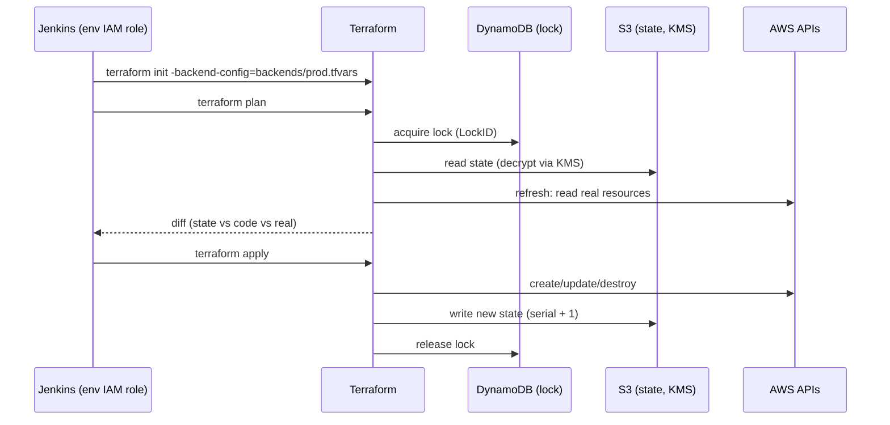
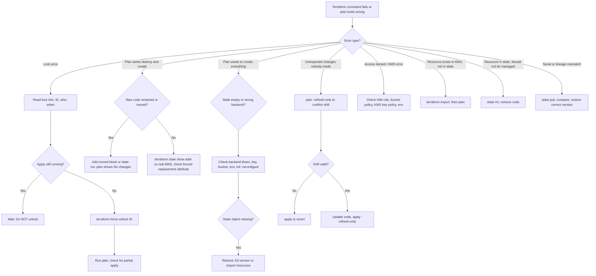

# Terraform State Management: Interview Guide (CMG / EKS)

> Contents: 1 Architecture, 2 Core Concepts, 3 Code, 4 Commands, 5 Scenarios, 6 Troubleshooting Flow, 7 Troubleshooting Commands, 8 Final Memory Sheet

---

## 1. Architecture (Graphical View)

### 1.1 Big picture: how state fits in

```
 Developer ──► Git (PR) ──► Jenkins Pipeline ──► Terraform CLI
                                                     │
                       ┌─────────────────────────────┼─────────────────────────┐
                       │                             │                         │
                       ▼                             ▼                         ▼
              1. LOCK (DynamoDB)           2. READ/WRITE STATE (S3)      3. CALL AWS APIs
              cmg-terraform-locks          cmg-terraform-state-prod      EKS / VPC / RDS / IAM
              LockID = bucket/key          key: eks/prod/terraform.tfstate   (real infra)
                                           ├─ versioning ON
                                           ├─ KMS encrypted (CMK)
                                           ├─ public access BLOCKED
                                           └─ bucket policy: only prod Jenkins role
```

### 1.2 Mermaid: apply lifecycle



### 1.3 Environment isolation

```
        DEV                     UAT                      PROD
  ┌──────────────┐       ┌──────────────┐        ┌──────────────┐
  │ S3 cmg-state-dev  │  │ S3 cmg-state-uat  │   │ S3 cmg-state-prod │
  │ DDB cmg-locks-dev │  │ DDB cmg-locks-uat │   │ DDB cmg-locks-prod│
  │ KMS dev-key       │  │ KMS uat-key       │   │ KMS prod-key      │
  │ IAM jenkins-dev   │  │ IAM jenkins-uat   │   │ IAM jenkins-prod  │
  └──────────────┘       └──────────────┘        └──────────────┘
   ✗ dev role cannot read/write prod bucket; prod key cannot decrypt dev state
```

### 1.4 Three-way relationship (key concept)

```
        .tf CODE  (desired)
             │
             │  plan compares all three
             ▼
   ┌──────► STATE (what TF believes exists) ◄──────┐
   │                                                │
 refresh                                          import
   │                                                │
   └────────── REAL AWS (what actually exists) ─────┘

 code != state          -> plan shows changes (normal apply)
 state != real AWS      -> DRIFT (detect with plan -refresh-only)
 in AWS, not in state   -> needs terraform import
 in state, not in code  -> plan wants to DESTROY it
```

---

## 2. Core Concepts (Point-wise)

- **State file**: `terraform.tfstate`, a JSON map of each `.tf` resource to a real AWS resource.
- Stores: IDs, ARNs, all attributes, dependencies, outputs, provider metadata.
- **`serial`**: increments on every state write. A lower or out-of-order serial signals a conflict or corruption.
- **`lineage`**: a UUID for the state's history that never changes. A mismatch means a different history.
- Terraform reads state before every plan. Without it, Terraform recreates everything.
- State is **metadata, not a backup** of infrastructure.
- State holds **secrets** (RDS passwords, endpoints), so treat it as highly sensitive.

### Security rules
- NEVER commit `*.tfstate` to Git.
- ALWAYS encrypt S3 with a customer-managed KMS key.
- ALWAYS restrict access via bucket policy to minimum IAM roles.
- ALWAYS enable S3 versioning.
- ALWAYS enable DynamoDB locking.
- ALWAYS block all public access.
- Consider MFA delete, and enable CloudTrail on the bucket.

### Isolation rules
- Separate bucket, lock table, KMS key and IAM role per environment.
- Bucket policy DENY for everyone except that environment's Jenkins role.

> Bonus: Terraform 1.10+ supports native S3 locking (`use_lockfile = true`), so DynamoDB is no longer required. Existing CMG-style setups still use DynamoDB.

---

## 3. Code

### 3.1 Full backend (single environment)

```hcl
# backend.tf
terraform {
  backend "s3" {
    bucket         = "cmg-terraform-state-prod"
    key            = "eks/prod/terraform.tfstate"
    region         = "eu-west-2"
    encrypt        = true
    kms_key_id     = "arn:aws:kms:eu-west-2:<acct>:key/prod-key"
    dynamodb_table = "cmg-terraform-locks"
  }
}
```

### 3.2 Partial backend config (dynamic per environment)

```hcl
# backend.tf  (shell only, no dynamic values)
terraform {
  backend "s3" {
    region = "eu-west-2"
  }
}
```

```hcl
# backends/prod.tfvars
bucket         = "cmg-terraform-state-prod"
key            = "eks/prod/terraform.tfstate"
dynamodb_table = "cmg-terraform-locks-prod"
kms_key_id     = "arn:aws:kms:eu-west-2:<acct>:key/prod-key"
```

```bash
terraform init -backend-config=backends/${TF_ENV}.tfvars -reconfigure
# Moving an existing environment to a NEW backend (copies state):
terraform init -backend-config=backends/prod.tfvars -migrate-state
```

### 3.3 Bootstrap resources for the backend (create once, separate config)

```hcl
resource "aws_kms_key" "state" {
  description         = "Terraform state key (prod)"
  enable_key_rotation = true
}

resource "aws_s3_bucket" "state" {
  bucket = "cmg-terraform-state-prod"
}

resource "aws_s3_bucket_versioning" "state" {
  bucket = aws_s3_bucket.state.id
  versioning_configuration { status = "Enabled" }
}

resource "aws_s3_bucket_server_side_encryption_configuration" "state" {
  bucket = aws_s3_bucket.state.id
  rule {
    apply_server_side_encryption_by_default {
      sse_algorithm     = "aws:kms"
      kms_master_key_id = aws_kms_key.state.arn
    }
  }
}

resource "aws_s3_bucket_public_access_block" "state" {
  bucket                  = aws_s3_bucket.state.id
  block_public_acls       = true
  block_public_policy     = true
  ignore_public_acls      = true
  restrict_public_buckets = true
}

resource "aws_dynamodb_table" "locks" {
  name         = "cmg-terraform-locks-prod"
  billing_mode = "PAY_PER_REQUEST"
  hash_key     = "LockID"          # must be exactly "LockID"
  attribute {
    name = "LockID"
    type = "S"
  }
}
```

### 3.4 Bucket policy: only the prod Jenkins role

```json
{
  "Version": "2012-10-17",
  "Statement": [
    {
      "Sid": "DenyAllExceptProdJenkins",
      "Effect": "Deny",
      "Principal": "*",
      "Action": "s3:*",
      "Resource": [
        "arn:aws:s3:::cmg-terraform-state-prod",
        "arn:aws:s3:::cmg-terraform-state-prod/*"
      ],
      "Condition": {
        "StringNotEquals": {
          "aws:PrincipalArn": "arn:aws:iam::<acct>:role/jenkins-prod"
        }
      }
    },
    {
      "Sid": "DenyInsecureTransport",
      "Effect": "Deny",
      "Principal": "*",
      "Action": "s3:*",
      "Resource": [
        "arn:aws:s3:::cmg-terraform-state-prod",
        "arn:aws:s3:::cmg-terraform-state-prod/*"
      ],
      "Condition": { "Bool": { "aws:SecureTransport": "false" } }
    }
  ]
}
```

> Note: a Deny-all-except policy can lock out admins too. Include a break-glass admin role in the allowed principals.

### 3.5 Jenkins pipeline (env selected by branch)

```groovy
pipeline {
  agent any
  environment {
    TF_ENV = "${env.BRANCH_NAME == 'main' ? 'prod' : (env.BRANCH_NAME == 'release' ? 'uat' : 'dev')}"
  }
  stages {
    stage('Init') {
      steps { sh 'terraform init -backend-config=backends/${TF_ENV}.tfvars -reconfigure' }
    }
    stage('Plan') {
      steps { sh 'terraform plan -out=tfplan' }
    }
    stage('Approval') {
      when { branch 'main' }
      steps { input message: 'Apply to PROD?' }
    }
    stage('Apply') {
      steps { sh 'terraform apply tfplan' }
    }
  }
}
```

### 3.6 Rename without recreation

```hcl
# Method 1 (preferred, TF 1.1+): moved block, reviewable in PR and shown in plan
moved {
  from = aws_security_group.old
  to   = module.sg.aws_security_group.eks
}
# Remove the moved block after a successful apply
```

```bash
# Method 2: state mv (all versions, immediate, no plan preview)
terraform state pull > backup-$(date +%F).tfstate
terraform state mv aws_security_group.old module.sg.aws_security_group.eks
terraform plan    # must show: No changes.
```

### 3.7 Import (command and TF 1.5+ block)

```bash
terraform import aws_db_instance.main cmg-prod-db
```

```hcl
# TF 1.5+: reviewable import
import {
  to = aws_db_instance.main
  id = "cmg-prod-db"
}
# terraform plan -generate-config-out=generated.tf  (can draft the resource code)
```

### 3.8 Nightly drift detection (cron / Jenkins)

```bash
terraform init -backend-config=backends/prod.tfvars -reconfigure
terraform plan -refresh-only -detailed-exitcode
# exit 0 = no drift, 2 = drift detected -> alert Slack/email
```

---

## 4. All State Commands

| Command | What it does | When to use |
|---|---|---|
| `terraform state list` | List tracked resources | Verify after import or migration |
| `terraform state show <addr>` | Full attributes of one resource | Compare to real AWS (drift) |
| `terraform state mv src dst` | Rename in state, no destroy | Before renaming in code |
| `terraform state rm <addr>` | Remove from state, AWS untouched | Stop managing a resource |
| `terraform state pull` | Download state to stdout | Backup before any surgery |
| `terraform state push file` | Upload state to backend | Emergency restore (DANGEROUS) |
| `terraform import addr id` | Adopt an existing resource | Bring manual resources under TF |
| `terraform force-unlock ID` | Remove a stuck lock | Only after confirming NO active apply |
| `terraform plan -refresh-only` | Detect drift | Nightly cron |
| `terraform apply -refresh-only` | Accept drift into state | After reviewing the drift |

---

## 5. Scenario Questions and Answers

### Q1. Teammate renamed a resource into a module and the plan shows 1 destroy and 1 create. What do you do?

**Why it happens:** the old address is in state and the new address isn't, so Terraform treats it as delete old plus create new. For an EKS cluster that means downtime and data loss.

**Answer**
1. Don't apply. Run `terraform state pull > backup.tfstate`.
2. Add a `moved {}` block (see 3.6), so the move is in Git and shown in the plan.
3. Run `plan`. It should show the move and no destroy.
4. Apply, then remove the `moved` block in a follow-up PR.

`state mv` is only for a quick one-off, because it has no plan preview and no audit trail.

---

### Q2. A Jenkins apply was killed mid-run and now "Error acquiring the state lock". What do you do?

```
Error: Error acquiring the state lock
Lock Info:
  ID:        a1b2c3d4-...
  Operation: OperationTypeApply
  Who:       jenkins@build-node-3
  Created:   2026-10-09 09:12:44 UTC
```

**Answer**
1. Read the lock info for the ID, who holds it, and when it was taken.
2. Confirm no apply is running: check Jenkins and ask the team.
3. Inspect the item in the DynamoDB table (`LockID` = `bucket/key`).
4. Run `terraform force-unlock a1b2c3d4-...`.
5. Run `terraform plan` to check for a partial apply. Restore a previous S3 version if state is inconsistent.

Never force-unlock while an apply may still be running, because two writers can corrupt state.

---

### Q3. Nightly drift job: someone changed an EKS security group rule in the console. How do you handle it?

**Answer**
1. `terraform plan -refresh-only` flags it (exit code 2 triggers the alert).
2. Find who and why with CloudTrail.
3. Decide:
   - **Change was wrong:** run a normal `terraform apply`, which reverts AWS to match the code.
   - **Change was valid (emergency fix):** update the `.tf` code to match, then `terraform apply -refresh-only` to accept it into state.
4. Prevent it: least-privilege IAM (no console writes in prod), drift alerts, and a review process.

---

### Q4. Prod state file was deleted or corrupted. What's your recovery plan?

**Answer**
1. **S3 versioning**: list versions and restore the latest good one.
   ```bash
   aws s3api list-object-versions --bucket cmg-terraform-state-prod --prefix eks/prod/terraform.tfstate
   aws s3api get-object --bucket cmg-terraform-state-prod --key eks/prod/terraform.tfstate \
     --version-id <GOOD_VERSION> restored.tfstate
   ```
2. Check `serial` and `lineage` in the restored file. It should be the highest serial of the correct lineage.
3. Put it back by copying the version over the current object, or use `terraform state push restored.tfstate` as a last resort.
4. Run `terraform plan`. Expect no changes, or only changes made since that version.
5. If there is no version history, rebuild with `terraform import` per resource, then verify with `state list` and `plan`.

**Prevention:** versioning, MFA delete, restrictive bucket policy, CloudTrail.

---

### Q5. Migrate an existing environment from local state to S3. Steps and risks?

**Answer**
1. Back up the local state: `cp terraform.tfstate backup.tfstate`.
2. Create the bucket (versioning, KMS, public access block) and the DynamoDB table (see 3.3).
3. Add the backend block, then run:
   ```bash
   terraform init -backend-config=backends/prod.tfvars -migrate-state
   ```
4. Verify with `terraform state list` and `terraform plan`. Expect "No changes."
5. Remove local state files and make sure `*.tfstate` is in `.gitignore`.

**Key difference:**
- `-migrate-state` copies existing state to the new backend.
- `-reconfigure` only re-points to a backend and does NOT copy state. Without migration, Terraform starts empty and would try to recreate everything.

---

### Q6. Adopt a manually created RDS instance, and stop managing another resource. How?

**Adopt**
1. Write the `aws_db_instance.main` resource block.
2. `terraform import aws_db_instance.main cmg-prod-db` (or an `import {}` block on 1.5+).
3. Run `plan` and adjust the code until it shows no changes.

**Stop managing**
1. `terraform state pull > backup.tfstate`.
2. `terraform state rm aws_instance.legacy`. The AWS resource stays and Terraform just forgets it.
3. Remove the code too, or the next apply will try to create it again.

Verify both with `terraform state list` and a clean `plan`.

---

## 6. Troubleshooting Flow

### 6.1 Decision tree (Mermaid)



### 6.2 Same flow as a checklist

```
1. Read the exact error message first.
2. Which backend/env am I pointing at?          -> terraform init output, backends/<env>.tfvars
3. Is state reachable and decryptable?          -> state list, IAM / bucket policy / KMS
4. Is something holding the lock?                -> lock info + DynamoDB item
5. Is plan showing destroy/create?               -> rename/move? forced replacement?
6. Is it drift?                                  -> plan -refresh-only
7. Back up before ANY surgery                    -> state pull > backup.tfstate
8. Fix with the smallest tool                    -> moved / mv / import / rm / restore
9. Verify                                        -> state list + plan = No changes
```

---

## 7. Troubleshooting Commands to Remember

```bash
# ---- Inspect ----
terraform state list
terraform state list | grep eks
terraform state show aws_eks_cluster.main
terraform output
terraform show

# ---- Backup (ALWAYS before surgery) ----
terraform state pull > backup-$(date +%F-%H%M).tfstate

# ---- Init / backend problems ----
terraform init -backend-config=backends/prod.tfvars -reconfigure
terraform init -backend-config=backends/prod.tfvars -migrate-state

# ---- Locks ----
terraform force-unlock <LOCK_ID>
aws dynamodb scan --table-name cmg-terraform-locks-prod
aws dynamodb delete-item --table-name cmg-terraform-locks-prod \
  --key '{"LockID":{"S":"cmg-terraform-state-prod/eks/prod/terraform.tfstate"}}'   # last resort

# ---- Drift ----
terraform plan -refresh-only
terraform plan -refresh-only -detailed-exitcode     # 0 clean, 2 drift
terraform apply -refresh-only

# ---- Rename / move / adopt / forget ----
terraform state mv <old> <new>
terraform import <addr> <id>
terraform state rm <addr>

# ---- Recovery from S3 versioning ----
aws s3api list-object-versions --bucket <bkt> --prefix <key>
aws s3api get-object --bucket <bkt> --key <key> --version-id <id> restored.tfstate
terraform state push restored.tfstate               # DANGEROUS, last resort

# ---- Debug ----
TF_LOG=DEBUG terraform plan 2> debug.log
terraform plan -target=<addr>                       # only for emergencies
terraform validate
terraform providers
```

---

## 8. Final Memory Sheet (Quick Revision)

### 8.1 One-liners
- **State** = the mapping of `.tf` to real AWS resources (metadata, not a backup).
- **`serial`** goes up on every write. **`lineage`** is the permanent UUID.
- **Remote backend** = S3 + DynamoDB + KMS.
- **Partial backend** = shell in code, values in `backends/<env>.tfvars`.
- **Isolation** = separate bucket, table, KMS key and IAM role per environment.

### 8.2 Which tool when?

| Situation | Use |
|---|---|
| Renamed or moved resource | `moved {}` (preferred) or `state mv` |
| Exists in AWS, not in TF | `import` |
| Stop managing a resource | `state rm` |
| Stuck lock | `force-unlock` (after confirming no active apply) |
| Detect drift | `plan -refresh-only` |
| Accept drift | `apply -refresh-only` |
| Revert drift | normal `apply` |
| Move to new backend | `init -migrate-state` |
| Re-point to same backend | `init -reconfigure` |
| Before surgery | `state pull > backup` |
| Lost state | S3 version restore, else import |

### 8.3 Never forget
1. Never commit state to Git.
2. Never force-unlock during an active apply.
3. Never skip a backup before state surgery.
4. Never apply a plan with unexpected destroy.
5. Always end with `plan` showing "No changes."

### 8.4 Security checklist (7 items)
`KMS CMK` · `versioning` · `DynamoDB lock` · `block public access` · `least-privilege bucket policy` · `MFA delete` · `CloudTrail`

### 8.5 `state mv` vs `moved {}`

| | `state mv` | `moved {}` |
|---|---|---|
| Version | all | 1.1+ |
| Audit | shell history only | Git and PR |
| Preview | none | shown in plan |
| Rollback | manual | revert in Git |
| Use for | quick one-off | production refactoring |

### 8.6 STAR-style closing line (CMG)
"On CMG, I run isolated S3, DynamoDB, KMS and IAM per environment with partial backend config selected by Jenkins branch. I use `moved` blocks for refactors, nightly `plan -refresh-only` for drift, and S3 versioning for recovery, so state changes are safe, auditable and recoverable."
